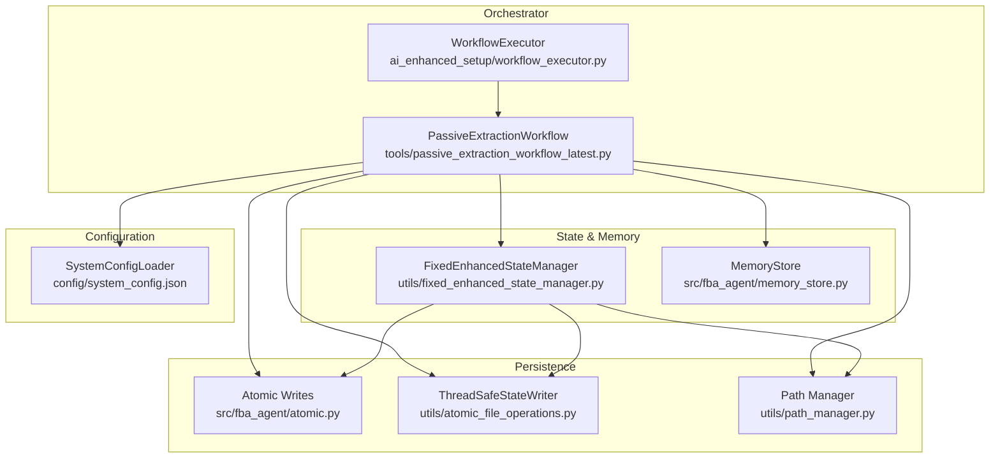
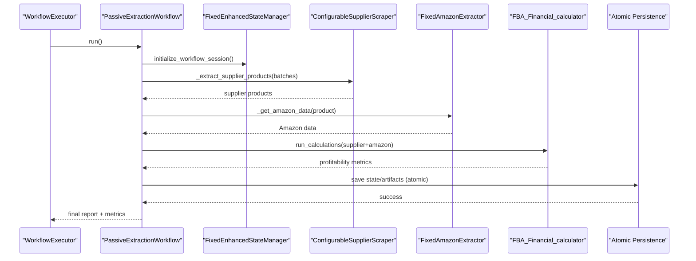
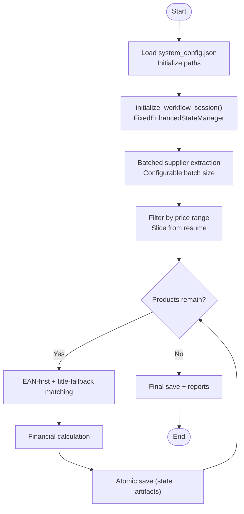
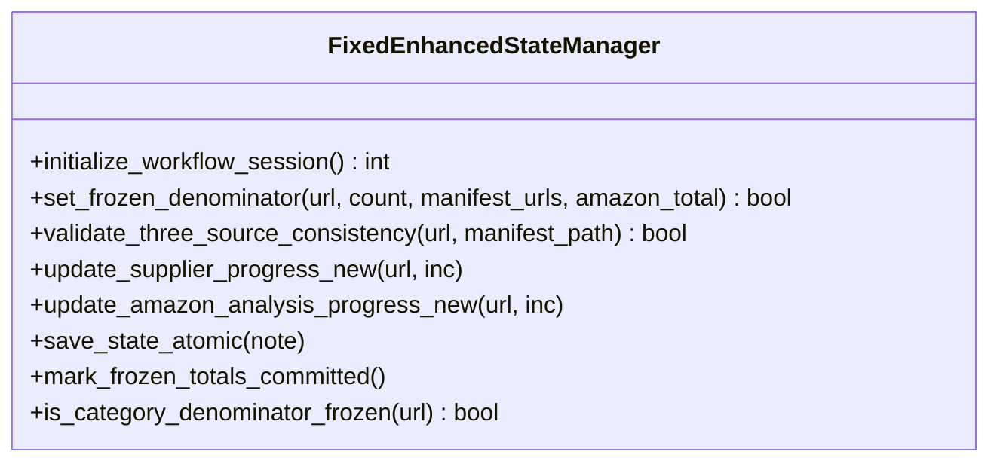
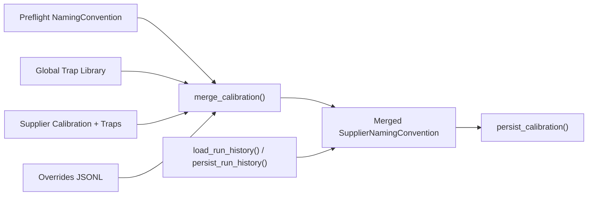
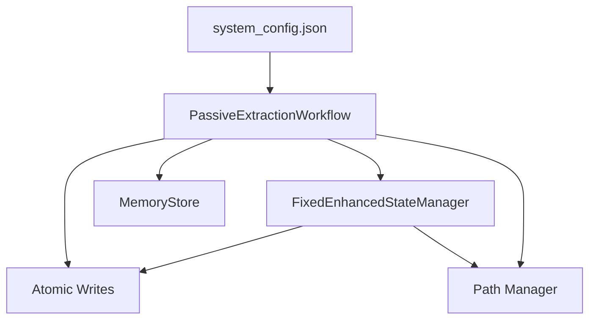

# Workflow Engine

<cite>
**Referenced Files in This Document**
- [passive_extraction_workflow_latest.py](file://tools/passive_extraction_workflow_latest.py)
- [workflow_executor.py](file://ai_enhanced_setup/workflow_executor.py)
- [fixed_enhanced_state_manager.py](file://utils/fixed_enhanced_state_manager.py)
- [memory_store.py](file://src/fba_agent/memory_store.py)
- [system_config.json](file://config/system_config.json)
- [run.py](file://src/fba_agent/run.py)
- [atomic.py](file://src/fba_agent/atomic.py)
- [atomic_file_operations.py](file://utils/atomic_file_operations.py)
- [path_manager.py](file://utils/path_manager.py)
</cite>

## Table of Contents
1. [Introduction](#introduction)
2. [Project Structure](#project-structure)
3. [Core Components](#core-components)
4. [Architecture Overview](#architecture-overview)
5. [Detailed Component Analysis](#detailed-component-analysis)
6. [Dependency Analysis](#dependency-analysis)
7. [Performance Considerations](#performance-considerations)
8. [Troubleshooting Guide](#troubleshooting-guide)
9. [Conclusion](#conclusion)

## Introduction
This document describes the Workflow Engine of the Amazon FBA Agent System v3.7+, focusing on the orchestrator that drives the end-to-end product sourcing pipeline from supplier websites to Amazon matching and reporting. It explains the smart memory management with a sliding window approach, file-based progress tracking, and seven zero-risk methods that guarantee accurate progress counting. It also covers the workflow execution chain, dependency management, integration patterns, practical configuration examples, performance optimization techniques, and troubleshooting strategies for resilient marathon sessions.

## Project Structure
The Workflow Engine spans several modules:
- Orchestrator: Central workflow orchestration and execution
- State Manager: Thread-safe, atomic state persistence with file-backed counters
- Memory Store: Supplier and global memory layers for calibration and overrides
- Configuration: Centralized system configuration controlling behavior and limits
- Atomic Persistence: Safe, crash-proof file writes for state and artifacts
- Path Manager: Consistent resolution of output and cache paths

**Diagram sources**
- [passive_extraction_workflow_latest.py](file://tools/passive_extraction_workflow_latest.py#L1-L120)
- [workflow_executor.py](file://ai_enhanced_setup/workflow_executor.py#L1-L120)
- [fixed_enhanced_state_manager.py](file://utils/fixed_enhanced_state_manager.py#L1-L120)
- [memory_store.py](file://src/fba_agent/memory_store.py#L1-L120)
- [system_config.json](file://config/system_config.json#L1-L120)
- [atomic.py](file://src/fba_agent/atomic.py#L1-L120)
- [atomic_file_operations.py](file://utils/atomic_file_operations.py#L1-L120)
- [path_manager.py](file://utils/path_manager.py#L1-L120)

**Section sources**
- [passive_extraction_workflow_latest.py](file://tools/passive_extraction_workflow_latest.py#L1-L120)
- [workflow_executor.py](file://ai_enhanced_setup/workflow_executor.py#L1-L120)
- [fixed_enhanced_state_manager.py](file://utils/fixed_enhanced_state_manager.py#L1-L120)
- [memory_store.py](file://src/fba_agent/memory_store.py#L1-L120)
- [system_config.json](file://config/system_config.json#L1-L120)
- [atomic.py](file://src/fba_agent/atomic.py#L1-L120)
- [atomic_file_operations.py](file://utils/atomic_file_operations.py#L1-L120)
- [path_manager.py](file://utils/path_manager.py#L1-L120)

## Core Components
- PassiveExtractionWorkflow: The main orchestrator that loads configuration, scrapes supplier products in batches, matches to Amazon, computes profitability, and persists results atomically.
- FixedEnhancedStateManager: Thread-safe state manager with file-based progress, frozen denominators, and resume-proof commits.
- MemoryStore: Supplier and global memory layers for calibration, brand aliases, and run history.
- SystemConfigLoader: Centralized configuration loader driving behavior, limits, and toggles.
- Atomic Persistence: Atomic write primitives for state and artifacts to prevent corruption.
- Path Manager: Consistent path resolution for outputs, caches, and linking maps.

**Section sources**
- [passive_extraction_workflow_latest.py](file://tools/passive_extraction_workflow_latest.py#L851-L2650)
- [fixed_enhanced_state_manager.py](file://utils/fixed_enhanced_state_manager.py#L86-L380)
- [memory_store.py](file://src/fba_agent/memory_store.py#L1-L265)
- [system_config.json](file://config/system_config.json#L1-L384)
- [atomic.py](file://src/fba_agent/atomic.py#L1-L120)
- [atomic_file_operations.py](file://utils/atomic_file_operations.py#L1-L120)
- [path_manager.py](file://utils/path_manager.py#L1-L120)

## Architecture Overview
The Workflow Engine follows a deterministic, stateful pipeline:
- Initialization: Load system configuration and initialize state.
- Supplier Extraction: Batched scraping of supplier categories with real-time denominator updates.
- Amazon Matching: EAN-first matching with title similarity fallback and caching.
- Financial Analysis: Profitability computation and artifact generation.
- Atomic Persistence: Periodic and final saves using atomic write patterns.
- Resume Continuity: File-grounded counters and frozen denominators ensure accurate recovery.

**Diagram sources**
- [workflow_executor.py](file://ai_enhanced_setup/workflow_executor.py#L267-L338)
- [passive_extraction_workflow_latest.py](file://tools/passive_extraction_workflow_latest.py#L1970-L2316)
- [fixed_enhanced_state_manager.py](file://utils/fixed_enhanced_state_manager.py#L247-L283)
- [atomic.py](file://src/fba_agent/atomic.py#L1-L120)

**Section sources**
- [workflow_executor.py](file://ai_enhanced_setup/workflow_executor.py#L267-L338)
- [passive_extraction_workflow_latest.py](file://tools/passive_extraction_workflow_latest.py#L1970-L2316)
- [fixed_enhanced_state_manager.py](file://utils/fixed_enhanced_state_manager.py#L247-L283)
- [atomic.py](file://src/fba_agent/atomic.py#L1-L120)

## Detailed Component Analysis

### Orchestrator: PassiveExtractionWorkflow
- Responsibilities:
  - Load system configuration and initialize paths.
  - Batched supplier scraping with configurable batch sizes.
  - Supplier product filtering and slicing from resume point.
  - EAN-first, title-fallback Amazon matching with title similarity scoring.
  - Financial calculation and artifact generation.
  - Periodic and final atomic saves.

- Execution Chain Highlights:
  - Initialization and configuration loading.
  - Predefined category loading and batched extraction.
  - Main processing loop with cycle-based analysis.
  - Atomic saves at configurable batch sizes.

**Diagram sources**
- [passive_extraction_workflow_latest.py](file://tools/passive_extraction_workflow_latest.py#L2318-L2525)
- [fixed_enhanced_state_manager.py](file://utils/fixed_enhanced_state_manager.py#L247-L283)

**Section sources**
- [passive_extraction_workflow_latest.py](file://tools/passive_extraction_workflow_latest.py#L851-L2650)

### State Manager: FixedEnhancedStateManager
- Thread-safe atomic state persistence with file locking and fallbacks.
- Frozen category denominators and manifest hashing to prevent drift.
- File-grounded counters reconciled via linking map for accurate progress.
- Resume-proof commits with breadcrumb logging and one-way phase gating.

Key methods and concepts:
- initialize_workflow_session(): Authoritative start position selection.
- set_frozen_denominator(): Immutable per-category total with guard.
- validate_three_source_consistency(): Three-way alignment across manifest, state, and resume pointer.
- save_state_atomic(): Unified atomic save with debounced commits.
- update_supplier_progress_new()/update_amazon_analysis_progress_new(): Phase-aware progress updates.
- mark_frozen_totals_committed(): Enables resume pointers and breadcrumbs.

**Diagram sources**
- [fixed_enhanced_state_manager.py](file://utils/fixed_enhanced_state_manager.py#L86-L1599)

**Section sources**
- [fixed_enhanced_state_manager.py](file://utils/fixed_enhanced_state_manager.py#L86-L1599)

### Memory Store: Supplier and Global Calibration
- Supplier memory: calibration, brand aliases, overrides, run history.
- Global memory: global trap library for universal shields.
- Merge calibration with strict precedence order and diff logging.
- Persist run history with atomic writes.

**Diagram sources**
- [memory_store.py](file://src/fba_agent/memory_store.py#L146-L236)

**Section sources**
- [memory_store.py](file://src/fba_agent/memory_store.py#L1-L265)

### Atomic Persistence and Path Management
- Atomic writes: Temporary file + rename to prevent partial writes.
- Thread-safe state writer with fallbacks to WindowsSaveGuardian and basic temp-then-replace.
- Path manager resolves output directories and linking map locations consistently.

**Section sources**
- [atomic.py](file://src/fba_agent/atomic.py#L1-L120)
- [atomic_file_operations.py](file://utils/atomic_file_operations.py#L1-L120)
- [path_manager.py](file://utils/path_manager.py#L1-L120)

## Dependency Analysis
The Workflow Engine depends on:
- Configuration-driven behavior via system_config.json
- State persistence via FixedEnhancedStateManager
- Supplier and global memory via MemoryStore
- Atomic writes for resilience
- Path manager for consistent output locations

**Diagram sources**
- [system_config.json](file://config/system_config.json#L1-L384)
- [passive_extraction_workflow_latest.py](file://tools/passive_extraction_workflow_latest.py#L1-L120)
- [fixed_enhanced_state_manager.py](file://utils/fixed_enhanced_state_manager.py#L1-L120)
- [memory_store.py](file://src/fba_agent/memory_store.py#L1-L120)
- [atomic.py](file://src/fba_agent/atomic.py#L1-L120)
- [path_manager.py](file://utils/path_manager.py#L1-L120)

**Section sources**
- [system_config.json](file://config/system_config.json#L1-L384)
- [passive_extraction_workflow_latest.py](file://tools/passive_extraction_workflow_latest.py#L1-L120)
- [fixed_enhanced_state_manager.py](file://utils/fixed_enhanced_state_manager.py#L1-L120)
- [memory_store.py](file://src/fba_agent/memory_store.py#L1-L120)
- [atomic.py](file://src/fba_agent/atomic.py#L1-L120)
- [path_manager.py](file://utils/path_manager.py#L1-L120)

## Performance Considerations
- Sliding Window Memory Management:
  - Hybrid processing enables chunked execution with a sliding window size for memory control.
  - File-based counting reduces reliance on in-memory counters for progress continuity.
- Batch Sizes:
  - supplier_extraction_batch_size controls category processing throughput.
  - linking_map_batch_size and financial_report_batch_size govern periodic save cadence.
- Rate Limiting and Timeouts:
  - Max concurrent requests, retry attempts, and timeouts balance speed and reliability.
- Headless and Browser Reuse:
  - reuse_browser and max_tabs reduce overhead for long-running sessions.
- Monitoring:
  - Metrics interval and alert thresholds help detect degradation proactively.

**Section sources**
- [system_config.json](file://config/system_config.json#L94-L127)
- [system_config.json](file://config/system_config.json#L128-L163)
- [system_config.json](file://config/system_config.json#L176-L186)

## Troubleshooting Guide
Common issues and remedies:
- State Corruption or Inconsistent Counters:
  - Use validate_and_repair_state() to normalize missing keys and bounds.
  - Align counters to linking map using startup analysis.
- Reverse Gap Detected:
  - Preserve resumption_index unless explicitly rebuilding cache.
  - Use force_cache_rebuild() to reset when necessary.
- Index Overflow:
  - Clamp completed counts to denominator to prevent overflow.
- Resume Pointer Not Logged:
  - Ensure frozen totals are committed and active-phase denominator is present.
- Authentication Failures:
  - Integrate with SupplierAuthenticationService and retry with backoff.
- Atomic Save Failures:
  - Fallbacks include ThreadSafeStateWriter, WindowsSaveGuardian, and basic temp-then-replace.

Operational checks:
- Sanity batch execution and validation using WorkflowExecutor.
- Recent file detection for Amazon cache, linking map, and financial reports.
- Log breadcrumbs for resume proof and pointer visibility.

**Section sources**
- [fixed_enhanced_state_manager.py](file://utils/fixed_enhanced_state_manager.py#L665-L735)
- [fixed_enhanced_state_manager.py](file://utils/fixed_enhanced_state_manager.py#L469-L645)
- [fixed_enhanced_state_manager.py](file://utils/fixed_enhanced_state_manager.py#L1170-L1280)
- [workflow_executor.py](file://ai_enhanced_setup/workflow_executor.py#L53-L133)
- [workflow_executor.py](file://ai_enhanced_setup/workflow_executor.py#L134-L265)

## Conclusion
The Workflow Engine v3.7+ delivers a resilient, deterministic pipeline for sourcing products from suppliers to Amazon. Its smart memory management, sliding window approach, and file-based progress tracking ensure marathon sessions run reliably without cascading failures. The seven zero-risk methods—frozen denominators, three-source validation, resume pointer gating, atomic saves, file-grounded reconciliation, phase-aware progress updates, and debounced commits—provide strong guarantees for accurate progress counting and recovery. Combined with configuration-driven tuning and robust integration patterns, the system supports scalable, continuous operation across extended runs.