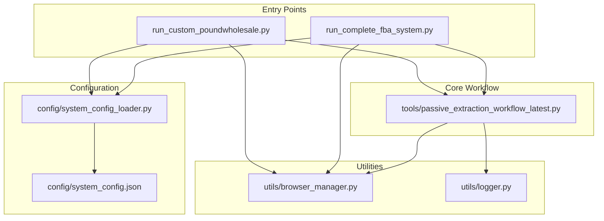
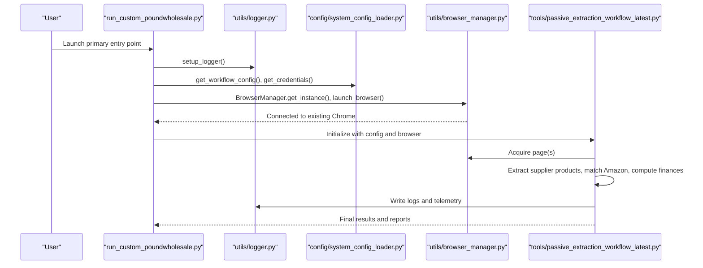
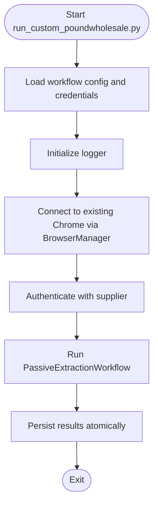
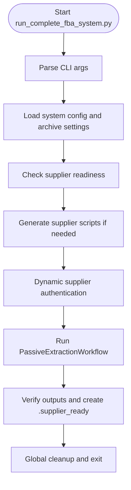
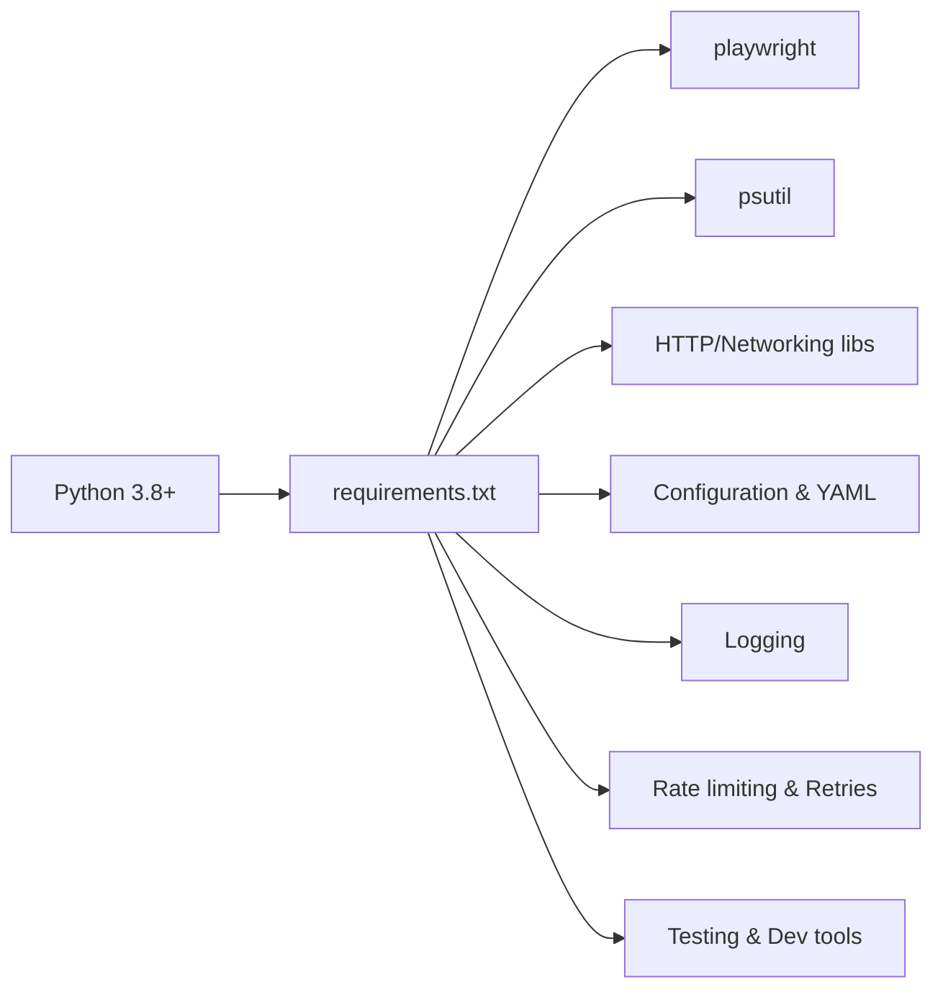

# Getting Started

<cite>
**Referenced Files in This Document**
- [README.md](file://README.md)
- [INSTALLATION_GUIDE.md](file://INSTALLATION_GUIDE.md)
- [WINDOWS_SETUP_GUIDE.md](file://WINDOWS_SETUP_GUIDE.md)
- [requirements.txt](file://requirements.txt)
- [config/system_config.json](file://config/system_config.json)
- [config/system_config_loader.py](file://config/system_config_loader.py)
- [utils/browser_manager.py](file://utils/browser_manager.py)
- [utils/logger.py](file://utils/logger.py)
- [run_custom_poundwholesale.py](file://run_custom_poundwholesale.py)
- [run_complete_fba_system.py](file://run_complete_fba_system.py)
- [tools/passive_extraction_workflow_latest.py](file://tools/passive_extraction_workflow_latest.py)
</cite>

## Table of Contents
1. [Introduction](#introduction)
2. [Project Structure](#project-structure)
3. [Core Components](#core-components)
4. [Architecture Overview](#architecture-overview)
5. [Detailed Component Analysis](#detailed-component-analysis)
6. [Dependency Analysis](#dependency-analysis)
7. [Performance Considerations](#performance-considerations)
8. [Troubleshooting Guide](#troubleshooting-guide)
9. [Conclusion](#conclusion)
10. [Appendices](#appendices)

## Introduction
This guide helps you install and run the Amazon FBA Agent System v3.7+ on Windows and Linux. You will configure prerequisites, set up Chrome debugging, define environment variables, and launch the system using either the primary or alternative entry points. It also includes verification steps and troubleshooting tips to ensure a smooth setup.

## Project Structure
The system is organized around:
- Entry point runners that initialize logging, load configuration, and orchestrate the workflow
- A central workflow engine that coordinates supplier scraping, Amazon matching, and financial analysis
- Utilities for browser management, logging, and Windows-safe atomic file persistence
- Configuration files for system behavior and credentials

**Diagram sources**
- [run_custom_poundwholesale.py](file://run_custom_poundwholesale.py#L1-L157)
- [run_complete_fba_system.py](file://run_complete_fba_system.py#L1-L120)
- [tools/passive_extraction_workflow_latest.py](file://tools/passive_extraction_workflow_latest.py#L1-L200)
- [utils/browser_manager.py](file://utils/browser_manager.py#L1-L200)
- [utils/logger.py](file://utils/logger.py#L1-L48)
- [config/system_config.json](file://config/system_config.json#L1-L384)
- [config/system_config_loader.py](file://config/system_config_loader.py#L1-L87)

**Section sources**
- [README.md](file://README.md#L123-L163)
- [run_custom_poundwholesale.py](file://run_custom_poundwholesale.py#L1-L157)
- [run_complete_fba_system.py](file://run_complete_fba_system.py#L1-L120)
- [tools/passive_extraction_workflow_latest.py](file://tools/passive_extraction_workflow_latest.py#L1-L200)
- [utils/browser_manager.py](file://utils/browser_manager.py#L1-L200)
- [utils/logger.py](file://utils/logger.py#L1-L48)
- [config/system_config.json](file://config/system_config.json#L1-L384)
- [config/system_config_loader.py](file://config/system_config_loader.py#L1-L87)

## Core Components
- Entry points
  - Primary launcher: run_custom_poundwholesale.py
  - Alternative launcher: run_complete_fba_system.py
- Central workflow engine: tools/passive_extraction_workflow_latest.py
- Browser management: utils/browser_manager.py
- Logging: utils/logger.py
- Configuration loader: config/system_config_loader.py
- System configuration: config/system_config.json

**Section sources**
- [README.md](file://README.md#L167-L217)
- [run_custom_poundwholesale.py](file://run_custom_poundwholesale.py#L1-L157)
- [run_complete_fba_system.py](file://run_complete_fba_system.py#L1-L120)
- [tools/passive_extraction_workflow_latest.py](file://tools/passive_extraction_workflow_latest.py#L1-L200)
- [utils/browser_manager.py](file://utils/browser_manager.py#L1-L200)
- [utils/logger.py](file://utils/logger.py#L1-L48)
- [config/system_config_loader.py](file://config/system_config_loader.py#L1-L87)
- [config/system_config.json](file://config/system_config.json#L1-L384)

## Architecture Overview
The system connects to an existing Chrome instance via remote debugging, authenticates with supplier credentials, scrapes supplier product data, matches items to Amazon, computes profitability, and persists results atomically.

**Diagram sources**
- [run_custom_poundwholesale.py](file://run_custom_poundwholesale.py#L43-L124)
- [utils/logger.py](file://utils/logger.py#L7-L48)
- [config/system_config_loader.py](file://config/system_config_loader.py#L29-L55)
- [utils/browser_manager.py](file://utils/browser_manager.py#L77-L140)
- [tools/passive_extraction_workflow_latest.py](file://tools/passive_extraction_workflow_latest.py#L851-L989)

## Detailed Component Analysis

### Prerequisites and Platform Requirements
- Python 3.8+ with pip
- Google Chrome (latest version)
- 8 GB+ RAM recommended
- Windows 10/11 or Linux/WSL2

Notes:
- On Windows, the system uses Windows-native memory management and avoids WSL dependencies.
- On Linux/WSL, Playwright installs Chromium and supports headless or headed modes.

**Section sources**
- [README.md](file://README.md#L99-L120)
- [INSTALLATION_GUIDE.md](file://INSTALLATION_GUIDE.md#L15-L26)
- [INSTALLATION_GUIDE.md](file://INSTALLATION_GUIDE.md#L143-L152)

### Installation Steps

#### Windows (Recommended)
1. Install Python 3.8+ and ensure “Add Python to PATH” is selected.
2. Clone or download the repository.
3. Run the automated Windows setup script to install dependencies and create required directories.
4. Start Chrome with remote debugging enabled.
5. Optionally create a .env file for API keys and memory thresholds.
6. Run the system using the automated Windows script or the primary entry point.

Verification:
- Confirm Chrome DevTools Protocol page is accessible at http://localhost:9222.
- Run the Windows compatibility test to validate imports and memory monitoring.

**Section sources**
- [INSTALLATION_GUIDE.md](file://INSTALLATION_GUIDE.md#L25-L44)
- [INSTALLATION_GUIDE.md](file://INSTALLATION_GUIDE.md#L69-L82)
- [INSTALLATION_GUIDE.md](file://INSTALLATION_GUIDE.md#L83-L94)
- [INSTALLATION_GUIDE.md](file://INSTALLATION_GUIDE.md#L95-L111)
- [INSTALLATION_GUIDE.md](file://INSTALLATION_GUIDE.md#L112-L129)
- [WINDOWS_SETUP_GUIDE.md](file://WINDOWS_SETUP_GUIDE.md#L7-L29)
- [WINDOWS_SETUP_GUIDE.md](file://WINDOWS_SETUP_GUIDE.md#L107-L123)
- [WINDOWS_SETUP_GUIDE.md](file://WINDOWS_SETUP_GUIDE.md#L126-L144)

#### Linux/WSL
1. Install system dependencies (Python 3.8+, pip, git, curl).
2. Install Python dependencies from requirements.txt.
3. Install Playwright browsers and dependencies.
4. Install Chrome if not present.
5. Configure environment variables (optional).
6. Start Chrome with remote debugging enabled.
7. Run the primary entry point for a specific supplier or the alternative system launcher.

**Section sources**
- [INSTALLATION_GUIDE.md](file://INSTALLATION_GUIDE.md#L153-L186)
- [INSTALLATION_GUIDE.md](file://INSTALLATION_GUIDE.md#L188-L263)

### Chrome Debugging Port Configuration
- Windows: Start Chrome with remote debugging port and user data directory.
- Linux/WSL: Start Chrome with remote debugging port and no-sandbox for compatibility.
- The system connects to an existing Chrome instance; it does not launch a new Chromium process.

Verification:
- Open http://localhost:9222 in another browser tab.
- Use curl to verify the CDP endpoint is reachable.

**Section sources**
- [INSTALLATION_GUIDE.md](file://INSTALLATION_GUIDE.md#L83-L94)
- [INSTALLATION_GUIDE.md](file://INSTALLATION_GUIDE.md#L181-L185)
- [INSTALLATION_GUIDE.md](file://INSTALLATION_GUIDE.md#L260-L263)
- [utils/browser_manager.py](file://utils/browser_manager.py#L77-L140)

### Environment Variables and API Keys
- Optional API keys: OPENAI_API_KEY, KEEPA_API_KEY
- Browser configuration: CHROME_DEBUG_PORT
- Memory thresholds: BROWSER_MEMORY_THRESHOLD_MB, WSL_MEMORY_WARNING_GB, WSL_MEMORY_CRITICAL_GB
- Performance tuning: MAX_CONCURRENT_REQUESTS, REQUEST_TIMEOUT_SECONDS, RETRY_ATTEMPTS

Notes:
- On Windows, the system can auto-start Chrome if configured.
- On Linux/WSL, ensure Chrome is started with the debug port before launching the system.

**Section sources**
- [README.md](file://README.md#L342-L358)
- [INSTALLATION_GUIDE.md](file://INSTALLATION_GUIDE.md#L310-L332)

### System Configuration
Key areas:
- System limits and batch sizes
- Processing limits (price range, per-run caps)
- Performance settings (concurrency, timeouts, retries)
- Chrome settings (debug port, headless)
- Authentication controls
- Workflows for supported suppliers

Notes:
- Credentials for suppliers are stored in the system configuration.
- The configuration loader exposes getters for system, Amazon, supplier, and workflow settings.

**Section sources**
- [README.md](file://README.md#L309-L360)
- [config/system_config.json](file://config/system_config.json#L1-L384)
- [config/system_config_loader.py](file://config/system_config_loader.py#L1-L87)

### Running the System

#### Primary Launcher: run_custom_poundwholesale.py
- Initializes logging, loads configuration, authenticates with supplier credentials, connects to Chrome, and runs the workflow.
- Suitable for running a specific supplier workflow with predefined categories.

**Diagram sources**
- [run_custom_poundwholesale.py](file://run_custom_poundwholesale.py#L43-L124)
- [utils/browser_manager.py](file://utils/browser_manager.py#L77-L140)
- [tools/passive_extraction_workflow_latest.py](file://tools/passive_extraction_workflow_latest.py#L851-L989)

**Section sources**
- [run_custom_poundwholesale.py](file://run_custom_poundwholesale.py#L1-L157)

#### Alternative Launcher: run_complete_fba_system.py
- Accepts arguments for supplier URL, email, password, headed mode, and max products.
- Integrates supplier guard checks, dynamic authentication, and output verification.
- Creates run output directories and writes verification artifacts.

**Diagram sources**
- [run_complete_fba_system.py](file://run_complete_fba_system.py#L116-L614)
- [tools/passive_extraction_workflow_latest.py](file://tools/passive_extraction_workflow_latest.py#L636-L750)

**Section sources**
- [run_complete_fba_system.py](file://run_complete_fba_system.py#L1-L120)
- [run_complete_fba_system.py](file://run_complete_fba_system.py#L316-L614)

### Logging and Monitoring
- Logging is initialized per run with timestamped files.
- Tail logs for real-time monitoring of processing, memory, and browser health.
- Use performance dashboards to track products cached, Amazon matches, and processing rates.

**Section sources**
- [utils/logger.py](file://utils/logger.py#L7-L48)
- [README.md](file://README.md#L423-L453)

## Dependency Analysis
The system depends on:
- Core libraries for HTTP, parsing, rate limiting, retries, date/time, configuration, schema validation, Excel, system monitoring, and AI integration
- Playwright for browser automation
- psutil for Windows memory monitoring
- Optional AI integration (OpenAI) and testing/dev tools

**Diagram sources**
- [requirements.txt](file://requirements.txt#L1-L81)

**Section sources**
- [requirements.txt](file://requirements.txt#L1-L81)

## Performance Considerations
- Smart memory management reduces clearing frequency and preserves recent context.
- File-based progress tracking ensures accurate resumability.
- Browser restart logic and circuit breakers improve reliability.
- Long sessions (18+ hours) are supported with automatic recovery.

**Section sources**
- [README.md](file://README.md#L220-L246)
- [README.md](file://README.md#L249-L278)
- [README.md](file://README.md#L282-L306)
- [README.md](file://README.md#L515-L521)

## Troubleshooting Guide
Common issues and resolutions:
- Chrome debug port not accessible
  - Kill existing Chrome processes and restart with the debug port.
  - Verify http://localhost:9222 is reachable.
- Python import errors
  - Reinstall dependencies and Playwright browsers.
- Memory issues
  - Monitor with Task Manager (Windows) or htop (Linux).
  - System automatically manages memory with smart clearing.
- Permission errors
  - Run as Administrator on Windows or fix file permissions on Linux.
- Authentication failures
  - Verify credentials in system configuration and review authentication logs.

Verification checklist:
- All compatibility tests pass.
- Chrome debug port is accessible.
- Memory monitoring shows accurate usage.
- System runs for extended periods without issues.
- Smart memory clearing operates correctly.

**Section sources**
- [README.md](file://README.md#L492-L522)
- [INSTALLATION_GUIDE.md](file://INSTALLATION_GUIDE.md#L472-L532)
- [WINDOWS_SETUP_GUIDE.md](file://WINDOWS_SETUP_GUIDE.md#L191-L237)

## Conclusion
You now have the essentials to install, configure, and run the Amazon FBA Agent System v3.7+ on Windows or Linux. Use the primary launcher for a focused supplier run or the alternative launcher for a comprehensive system execution with dynamic authentication and verification. Follow the troubleshooting steps and verification indicators to ensure a stable, long-running session.

## Appendices

### Practical Examples of Running the System
- Windows (automated):
  - Start Chrome with debug port, then run the Windows script.
- Windows (manual):
  - Start Chrome with debug port, then run the primary entry point.
- Linux/WSL:
  - Start Chrome with debug port, activate virtual environment, then run the primary entry point.

**Section sources**
- [README.md](file://README.md#L61-L96)
- [INSTALLATION_GUIDE.md](file://INSTALLATION_GUIDE.md#L383-L413)

### Difference Between Primary and Alternative Launchers
- Primary launcher (run_custom_poundwholesale.py)
  - Minimal setup, predefined categories, focused supplier run.
- Alternative launcher (run_complete_fba_system.py)
  - Accepts CLI arguments, supplier guard checks, dynamic authentication, output verification, and creates run output directories.

**Section sources**
- [run_custom_poundwholesale.py](file://run_custom_poundwholesale.py#L1-L157)
- [run_complete_fba_system.py](file://run_complete_fba_system.py#L1-L120)
- [run_complete_fba_system.py](file://run_complete_fba_system.py#L316-L614)