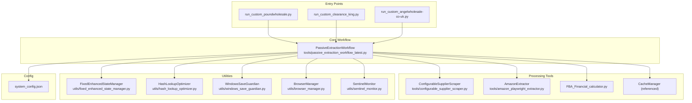
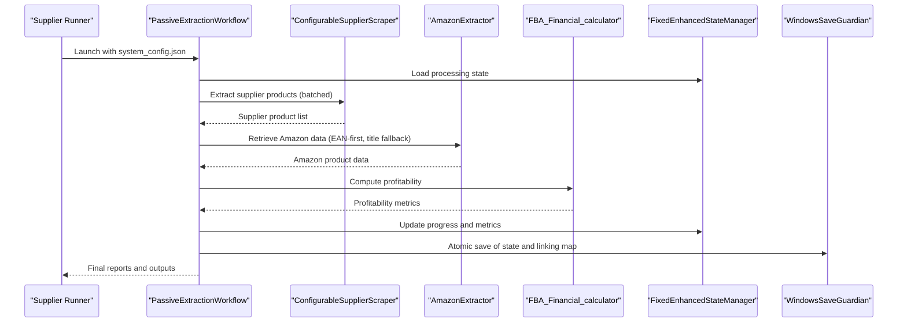
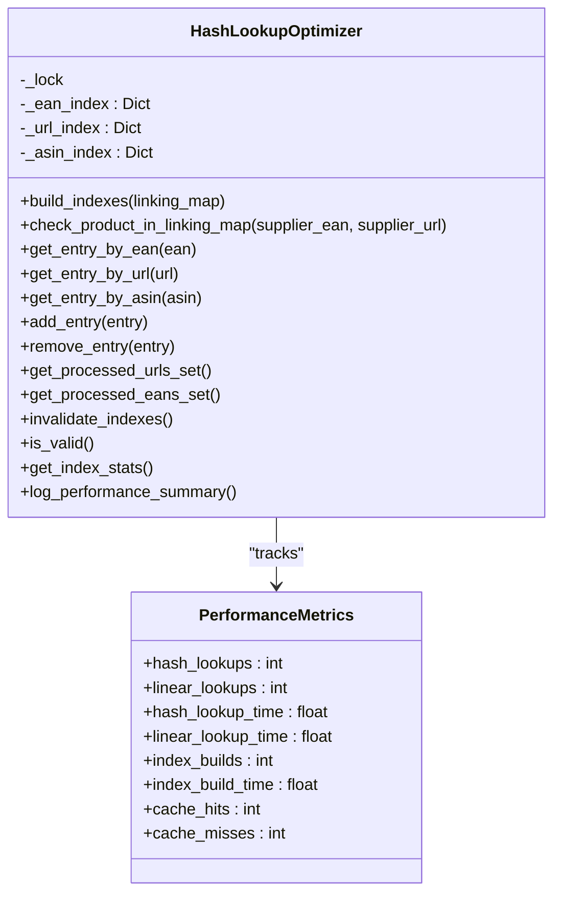
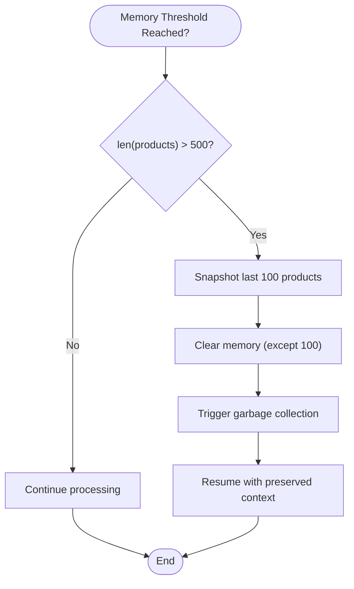
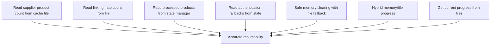
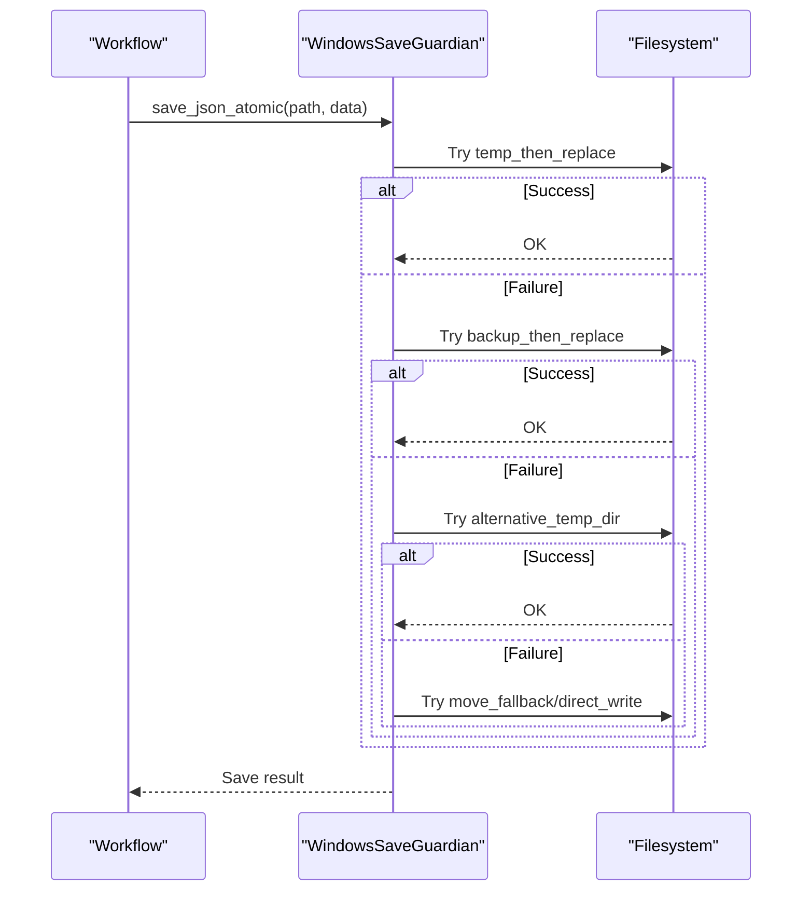
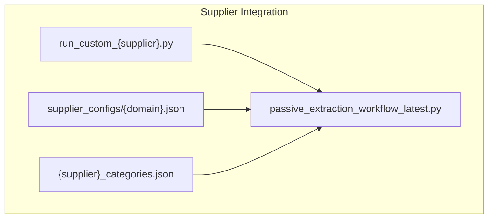
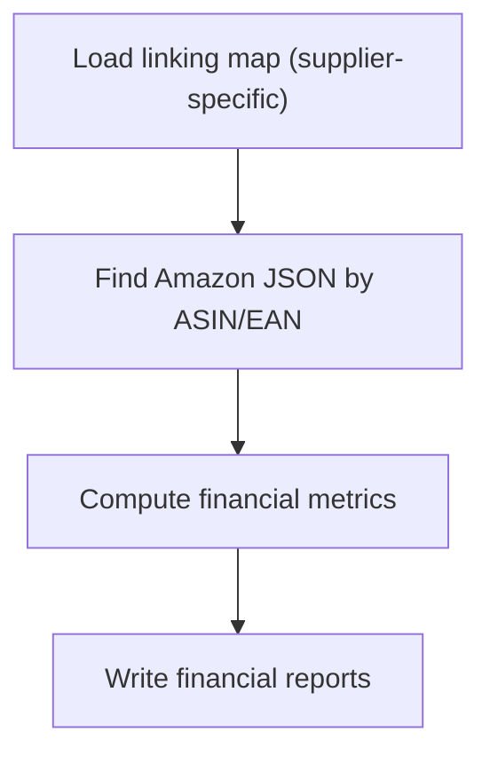
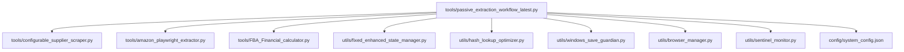

# Project Overview

<cite>
**Referenced Files in This Document**
- [README.md](file://README.md)
- [docs/Project Overview.md](file://docs/Project Overview.md)
- [docs/COMPREHENSIVE_SYSTEM_WORKFLOW_AND_INTEGRATION_GUIDE.md](file://docs/COMPREHENSIVE_SYSTEM_WORKFLOW_AND_INTEGRATION_GUIDE.md)
- [docs/SMART_MEMORY_MANAGEMENT_TECHNICAL_GUIDE.md](file://docs/SMART_MEMORY_MANAGEMENT_TECHNICAL_GUIDE.md)
- [tools/passive_extraction_workflow_latest.py](file://tools/passive_extraction_workflow_latest.py)
- [utils/fixed_enhanced_state_manager.py](file://utils/fixed_enhanced_state_manager.py)
- [utils/hash_lookup_optimizer.py](file://utils/hash_lookup_optimizer.py)
- [utils/windows_save_guardian.py](file://utils/windows_save_guardian.py)
- [utils/browser_manager.py](file://utils/browser_manager.py)
- [utils/sentinel_monitor.py](file://utils/sentinel_monitor.py)
- [tools/configurable_supplier_scraper.py](file://tools/configurable_supplier_scraper.py)
- [tools/amazon_playwright_extractor.py](file://tools/amazon_playwright_extractor.py)
- [tools/FBA_Financial_calculator.py](file://tools/FBA_Financial_calculator.py)
- [config/system_config.json](file://config/system_config.json)
</cite>

## Table of Contents
1. [Introduction](#introduction)
2. [Project Structure](#project-structure)
3. [Core Components](#core-components)
4. [Architecture Overview](#architecture-overview)
5. [Detailed Component Analysis](#detailed-component-analysis)
6. [Dependency Analysis](#dependency-analysis)
7. [Performance Considerations](#performance-considerations)
8. [Troubleshooting Guide](#troubleshooting-guide)
9. [Conclusion](#conclusion)
10. [Appendices](#appendices)

## Introduction
The Amazon FBA Agent System v3.7+ is a production-ready automation platform for robust, resumable FBA product sourcing from supplier websites. It is purpose-built for long-running, deterministic workflows that extract supplier product catalogs, match them to Amazon listings using EAN/title heuristics, compute profitability, and persist results with atomic writes. Major architectural enhancements include:
- Product cache hash optimization for O(1) duplicate prevention
- Smart memory management with sliding-window clearing
- File-based progress tracking for zero-risk resumability
- Processing state integration for reliable workflow continuity
- Windows-native support with atomic file operations and memory monitoring
- Marathon session support for 18+ hour uninterrupted runs

These capabilities enable large-scale, reliable processing of supplier inventories with accurate progress tracking and crash recovery.

**Section sources**
- [README.md](file://README.md#L10-L617)
- [docs/Project Overview.md](file://docs/Project Overview.md#L26-L31)

## Project Structure
The system is organized around a central workflow orchestrator and a set of focused utilities and tools:
- Entry points: per-supplier runners (e.g., run_custom_poundwholesale.py) trigger the workflow
- Central engine: tools/passive_extraction_workflow_latest.py orchestrates scraping, matching, and reporting
- Processing tools: configurable supplier scraper, Amazon extractor, financial calculator, cache manager
- Utilities: state manager, hash lookup optimizer, Windows save guardian, browser manager, sentinel monitor
- Configuration: config/system_config.json drives all operational parameters

**Diagram sources**
- [README.md](file://README.md#L123-L163)
- [docs/Project Overview.md](file://docs/Project Overview.md#L33-L65)

**Section sources**
- [README.md](file://README.md#L123-L163)
- [docs/Project Overview.md](file://docs/Project Overview.md#L33-L65)

## Core Components
- PassiveExtractionWorkflow: Orchestrates supplier scraping, Amazon matching, financial analysis, and periodic atomic saves. It loads system_config.json and processes categories in batches, maintaining resumable state via FixedEnhancedStateManager.
- ConfigurableSupplierScraper: Extracts supplier product data using selector-driven configuration and Playwright, with URL filtering to avoid duplicate processing.
- AmazonExtractor: Searches Amazon via EAN-first strategy, with title-based fallback and robust cookie/CAPTCHA handling.
- FBA_Financial_calculator: Computes profitability metrics using persisted linking maps and Amazon cache data.
- FixedEnhancedStateManager: Thread-safe, atomic state persistence for progress tracking, resumption, and metrics.
- HashLookupOptimizer: Provides O(1) hash-based lookup against linking map entries (EAN/URL/ASIN) to eliminate duplicate processing.
- WindowsSaveGuardian: Atomic file persistence on Windows to avoid WinError 5 and truncation issues.
- BrowserManager: Centralized Chrome management with health checks, circuit breaker protection, and periodic restarts.
- SentinelMonitor: Lightweight divergence detection for linking map integrity and save reliability.

**Section sources**
- [docs/Project Overview.md](file://docs/Project Overview.md#L52-L65)
- [tools/passive_extraction_workflow_latest.py](file://tools/passive_extraction_workflow_latest.py#L1-L120)
- [utils/fixed_enhanced_state_manager.py](file://utils/fixed_enhanced_state_manager.py#L86-L131)
- [utils/hash_lookup_optimizer.py](file://utils/hash_lookup_optimizer.py#L1-L120)
- [utils/windows_save_guardian.py](file://utils/windows_save_guardian.py#L26-L120)
- [utils/browser_manager.py](file://utils/browser_manager.py#L35-L120)
- [utils/sentinel_monitor.py](file://utils/sentinel_monitor.py#L63-L120)
- [tools/configurable_supplier_scraper.py](file://tools/configurable_supplier_scraper.py#L82-L167)
- [tools/amazon_playwright_extractor.py](file://tools/amazon_playwright_extractor.py#L63-L122)
- [tools/FBA_Financial_calculator.py](file://tools/FBA_Financial_calculator.py#L16-L76)

## Architecture Overview
The system’s architecture emphasizes determinism, resumability, and resilience:
- Deterministic execution: Predefined category lists and batched processing ensure repeatable runs.
- Stateful resumption: FixedEnhancedStateManager persists progress and enables recovery after interruptions.
- Atomic persistence: WindowsSaveGuardian and state manager ensure crash-safe writes.
- Browser health: BrowserManager and circuit breaker protect against connection instability.
- Integrity monitoring: SentinelMonitor tracks totals divergence and path variants to detect anomalies.

**Diagram sources**
- [tools/passive_extraction_workflow_latest.py](file://tools/passive_extraction_workflow_latest.py#L2318-L2525)
- [utils/fixed_enhanced_state_manager.py](file://utils/fixed_enhanced_state_manager.py#L148-L200)
- [utils/windows_save_guardian.py](file://utils/windows_save_guardian.py#L86-L182)
- [tools/configurable_supplier_scraper.py](file://tools/configurable_supplier_scraper.py#L1-L200)
- [tools/amazon_playwright_extractor.py](file://tools/amazon_playwright_extractor.py#L1-L200)
- [tools/FBA_Financial_calculator.py](file://tools/FBA_Financial_calculator.py#L1-L200)

**Section sources**
- [README.md](file://README.md#L123-L163)
- [docs/Project Overview.md](file://docs/Project Overview.md#L67-L102)

## Detailed Component Analysis

### Hash-Based Duplicate Prevention
The HashLookupOptimizer builds O(1) indexes for EAN, URL, and ASIN to prevent re-processing of the same product across categories and during linking map updates. It tracks performance metrics and provides thread-safe operations.

**Diagram sources**
- [utils/hash_lookup_optimizer.py](file://utils/hash_lookup_optimizer.py#L1-L200)

**Section sources**
- [docs/Project Overview.md](file://docs/Project Overview.md#L107-L124)
- [utils/hash_lookup_optimizer.py](file://utils/hash_lookup_optimizer.py#L1-L200)

### Smart Memory Management
The workflow uses a sliding-window approach to reduce memory clearing frequency by 99%, preserving the last 100 products for continuity while preventing accumulation. This enables marathon sessions and preserves debugging context.

**Diagram sources**
- [README.md](file://README.md#L226-L246)
- [docs/SMART_MEMORY_MANAGEMENT_TECHNICAL_GUIDE.md](file://docs/SMART_MEMORY_MANAGEMENT_TECHNICAL_GUIDE.md#L1-L230)

**Section sources**
- [README.md](file://README.md#L220-L247)
- [docs/SMART_MEMORY_MANAGEMENT_TECHNICAL_GUIDE.md](file://docs/SMART_MEMORY_MANAGEMENT_TECHNICAL_GUIDE.md#L1-L230)

### File-Based Progress Tracking
Seven zero-risk methods ensure accurate progress counts by reading directly from files, enabling reliable resumption even after crashes. Methods include supplier product counts, linking map entries, processed products, authentication fallbacks, hybrid progress, and consolidated status.

**Diagram sources**
- [README.md](file://README.md#L255-L278)

**Section sources**
- [README.md](file://README.md#L249-L280)

### Windows-Native Support and Atomic Persistence
WindowsSaveGuardian provides atomic file operations with multiple fallback strategies to avoid WinError 5 and truncation. Combined with BrowserManager’s health monitoring and periodic restarts, the system achieves stable, long-running sessions on Windows.

**Diagram sources**
- [utils/windows_save_guardian.py](file://utils/windows_save_guardian.py#L86-L182)

**Section sources**
- [README.md](file://README.md#L282-L307)
- [utils/windows_save_guardian.py](file://utils/windows_save_guardian.py#L26-L120)
- [utils/browser_manager.py](file://utils/browser_manager.py#L35-L120)

### Supplier Integration and Config-Driven Architecture
The system supports multiple suppliers with a config-driven approach. Each supplier has:
- A per-supplier entry script (run_custom_{supplier}.py)
- A selector configuration (config/supplier_configs/{domain}.json)
- A categories configuration (config/{supplier}_categories.json)
- Supplier-specific outputs isolated under OUTPUTS/

**Diagram sources**
- [docs/COMPREHENSIVE_SYSTEM_WORKFLOW_AND_INTEGRATION_GUIDE.md](file://docs/COMPREHENSIVE_SYSTEM_WORKFLOW_AND_INTEGRATION_GUIDE.md#L124-L156)

**Section sources**
- [docs/COMPREHENSIVE_SYSTEM_WORKFLOW_AND_INTEGRATION_GUIDE.md](file://docs/COMPREHENSIVE_SYSTEM_WORKFLOW_AND_INTEGRATION_GUIDE.md#L160-L360)

### Financial Analysis and Reporting
The FBA_Financial_calculator loads supplier-specific linking maps and Amazon cache data to compute profitability metrics. It supports supplier-specific paths and multiple fallback strategies for robustness.

**Diagram sources**
- [tools/FBA_Financial_calculator.py](file://tools/FBA_Financial_calculator.py#L77-L200)

**Section sources**
- [tools/FBA_Financial_calculator.py](file://tools/FBA_Financial_calculator.py#L16-L120)

## Dependency Analysis
The workflow depends on a tight set of core modules with clear boundaries. Indirect dependencies are limited to utilities used by the scraper and browser manager.

**Diagram sources**
- [README.md](file://README.md#L195-L213)

**Section sources**
- [README.md](file://README.md#L195-L213)

## Performance Considerations
- Hash-based lookup optimization delivers O(1) performance for duplicate prevention, replacing O(n) linear searches and improving throughput significantly.
- Smart memory management reduces clearing frequency by 99% while preserving recent context for debugging continuity.
- File-based progress tracking ensures accurate resumability without reliance on potentially stale in-memory counters.
- Windows-native atomic persistence avoids file permission issues and truncation risks.
- Marathon session support (18+ hours) achieved through browser health monitoring, periodic restarts, and resilient state management.

[No sources needed since this section provides general guidance]

## Troubleshooting Guide
Common issues and resolutions:
- Chrome debug port accessibility: Ensure Chrome is started with --remote-debugging-port=9222 and user data directory; verify connectivity before launching the workflow.
- Memory pressure: Monitor with Task Manager (Windows) or htop (Linux); the system automatically applies smart clearing and restarts as needed.
- Authentication failures: Verify credentials in system_config.json, check browser debug port accessibility, and review authentication logs.
- Long sessions: The system is designed for 8+ hour runs; rely on automatic browser restarts and state persistence.

Operational commands:
- Monitor main processing: tail -f logs/debug/run_custom_poundwholesale_*.log
- Monitor memory management: tail -f logs/health/memory_monitoring_*.log
- Monitor browser health: tail -f logs/health/browser_health_*.log
- Check smart memory clearing: grep "SMART MEMORY CLEARED" logs/debug/*.log
- Monitor progress: jq '.total_urls_processed' OUTPUTS/CACHE/processing_states/*.json

**Section sources**
- [README.md](file://README.md#L492-L522)

## Conclusion
The Amazon FBA Agent System v3.7+ delivers a production-grade, resumable automation platform optimized for large-scale supplier product sourcing. Through architectural enhancements—hash-based duplicate prevention, smart memory management, file-based progress tracking, Windows-native atomic persistence, and robust browser health—the system achieves reliability, performance, and marathon session support. The config-driven supplier integration further simplifies onboarding and maintenance.

[No sources needed since this section summarizes without analyzing specific files]

## Appendices

### System Capabilities and Metrics
- Processing capacity: 1M+ products per run
- Session duration: 18+ hours without intervention
- Memory efficiency: <2GB sustained usage
- Recovery time: <3 seconds for browser restart

**Section sources**
- [README.md](file://README.md#L541-L556)

### Configuration Highlights
Key operational parameters are centralized in system_config.json, including:
- Pipeline toggles for resumability and progress tracking
- Processing limits (price filters, pagination safety)
- Performance settings (concurrency, timeouts, retry attempts)
- Cache control and monitoring thresholds
- Output paths and retention policies

**Section sources**
- [config/system_config.json](file://config/system_config.json#L1-L200)