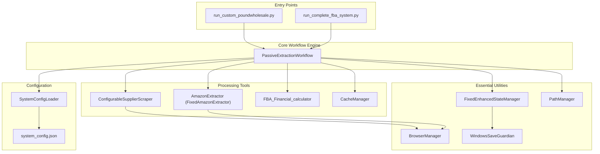
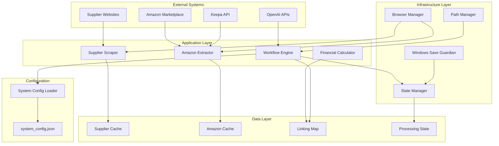
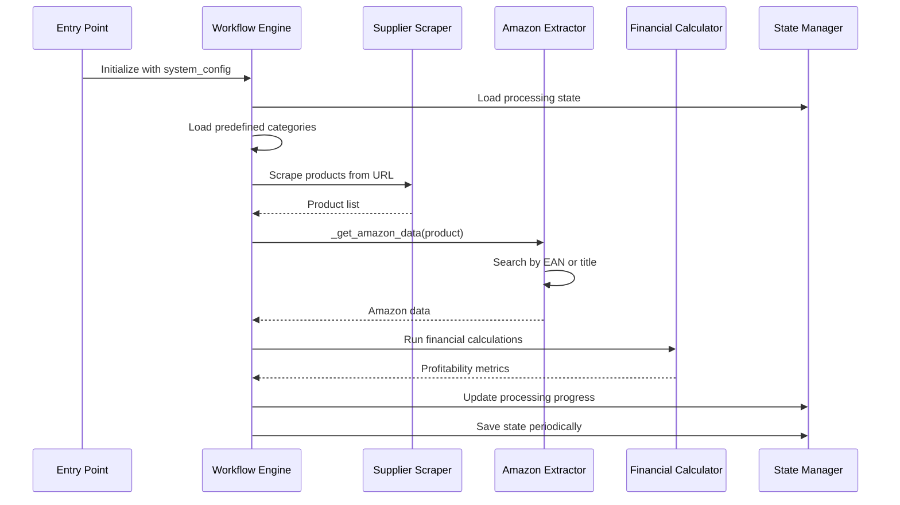
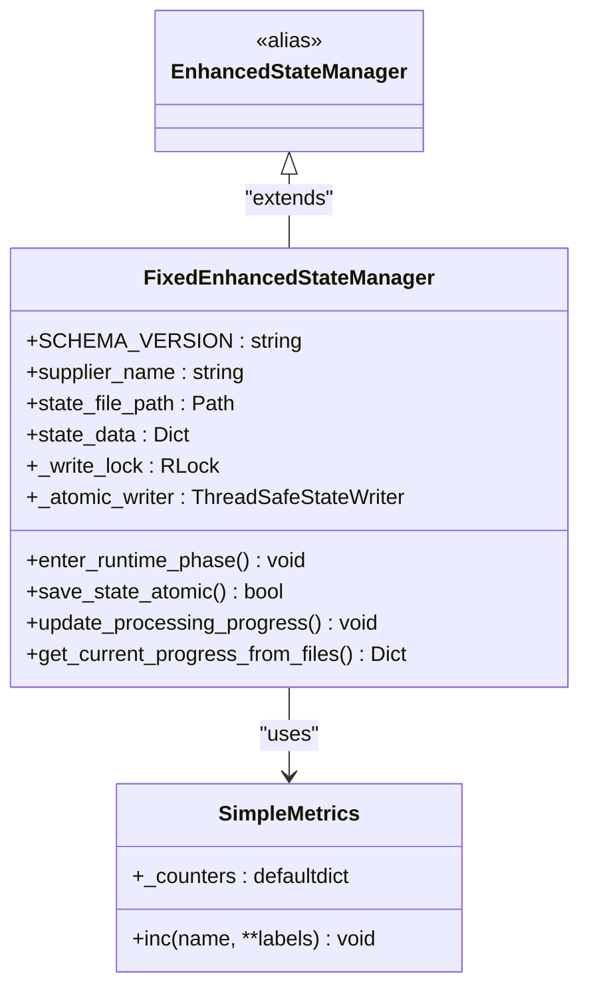
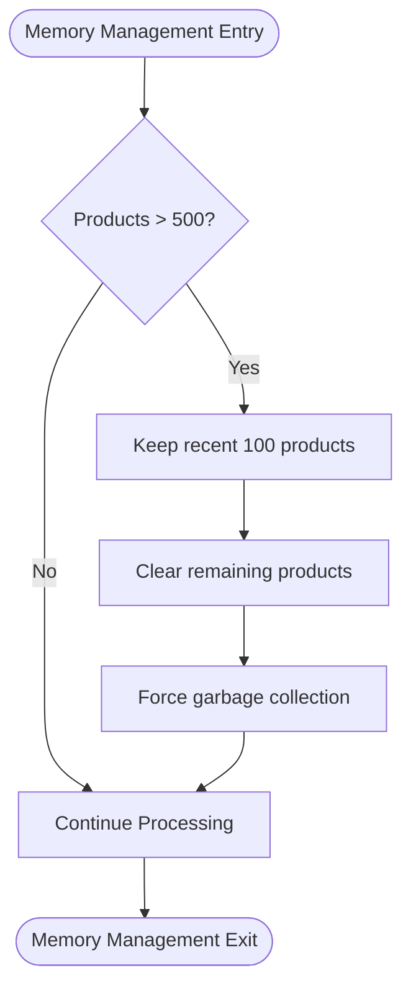
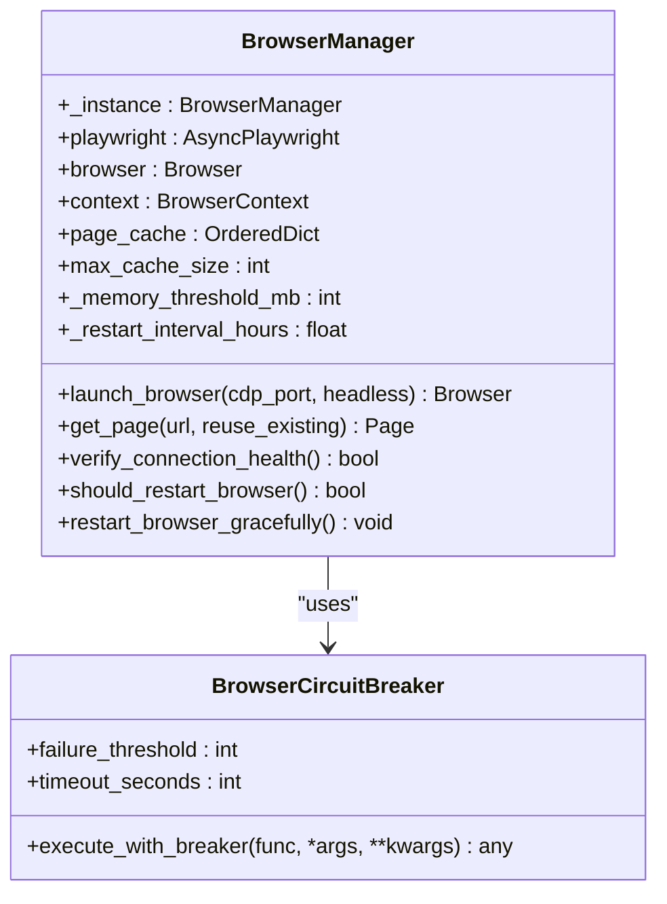
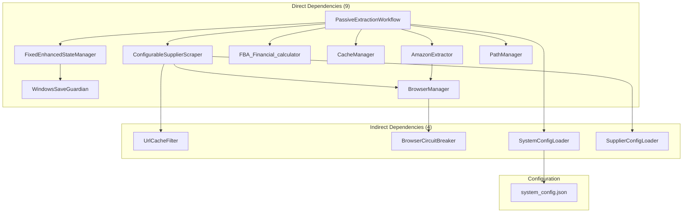

# System Architecture

<cite>
**Referenced Files in This Document**
- [README.md](file://README.md)
- [passive_extraction_workflow_latest.py](file://tools/passive_extraction_workflow_latest.py)
- [configurable_supplier_scraper.py](file://tools/configurable_supplier_scraper.py)
- [amazon_playwright_extractor.py](file://tools/amazon_playwright_extractor.py)
- [FBA_Financial_calculator.py](file://tools/FBA_Financial_calculator.py)
- [fixed_enhanced_state_manager.py](file://utils/fixed_enhanced_state_manager.py)
- [browser_manager.py](file://utils/browser_manager.py)
- [windows_save_guardian.py](file://utils/windows_save_guardian.py)
- [path_manager.py](file://utils/path_manager.py)
- [system_config_loader.py](file://config/system_config_loader.py)
- [system_config.json](file://config/system_config.json)
- [run_custom_poundwholesale.py](file://run_custom_poundwholesale.py)
- [Core Architecture.md](file://repowiki 12 dec & 20 jan\en\content\Core Architecture\Core Architecture.md)
- [Workflow Engine.md](file://repowiki 12 dec & 20 jan\en\content\Core Architecture\Workflow Engine.md)
- [Progress Tracking.md](file://wiki repo 19 nov\3. Core Architecture\3.4. State Manager\3.4.3. Progress Tracking.md)
- [Cache Persistence And Memory Management.md](file://wiki repo 19 nov\9. Caching And Deduplication\9.2. Cache Persistence And Memory Management.md)
- [SMART_MEMORY_MANAGEMENT_UPDATE_SUMMARY.md](file://SMART_MEMORY_MANAGEMENT_UPDATE_SUMMARY.md)
- [State Corruption.md](file://WIKI REPO SEPT17\11. Troubleshooting Guide\11.3. State Management Issues\11.3.1. State Corruption.md)
</cite>

## Table of Contents
1. [Introduction](#introduction)
2. [Project Structure](#project-structure)
3. [Core Components](#core-components)
4. [Architecture Overview](#architecture-overview)
5. [Detailed Component Analysis](#detailed-component-analysis)
6. [Dependency Analysis](#dependency-analysis)
7. [Performance Considerations](#performance-considerations)
8. [Troubleshooting Guide](#troubleshooting-guide)
9. [Conclusion](#conclusion)

## Introduction
The Amazon FBA Agent System v3.7+ is a production-ready automation platform designed for robust, resumable, and highly efficient FBA product sourcing from supplier websites. It features enhanced architectural improvements including smart memory management, Windows native support, zero-risk progress tracking, and comprehensive fault tolerance mechanisms. The system orchestrates multi-stage workflows that identify profitable products by integrating supplier data extraction, Amazon matching, and financial analysis with atomic state persistence and resilient browser management.

## Project Structure
The system is organized into clearly separated layers with explicit responsibilities:
- Entry points: run scripts that initialize the workflow and browser environment
- Central workflow engine: orchestrates the entire processing pipeline
- Processing tools: supplier scraping and Amazon data extraction
- Essential utilities: state management, browser orchestration, atomic file operations
- Configuration management: centralized system configuration loading
- Outputs: structured data storage for cache, linking maps, and reports

**Diagram sources**
- [README.md](file://README.md#L123-L163)
- [passive_extraction_workflow_latest.py](file://tools/passive_extraction_workflow_latest.py#L1-L120)
- [system_config_loader.py](file://config/system_config_loader.py#L1-L87)

**Section sources**
- [README.md](file://README.md#L123-L163)
- [Core Architecture.md](file://repowiki 12 dec & 20 jan\en\content\Core Architecture\Core Architecture.md#L1-L25)

## Core Components
The system's core components work together to deliver a modular, fault-tolerant architecture:

### Central Workflow Engine
The PassiveExtractionWorkflow serves as the primary orchestrator, managing the complete lifecycle from initialization through reporting. It implements a stateful, batched processing model with configurable limits and resilient error handling.

### Processing Tools
- ConfigurableSupplierScraper: Robust supplier data extraction with Playwright, supporting selector-based extraction and AI fallbacks
- FixedAmazonExtractor: Specialized Amazon data extraction with EAN-first matching and title-based fallback
- FBA_Financial_calculator: Comprehensive financial analysis with ROI calculations and VAT implications
- CacheManager: Persistent data caching with atomic write operations

### Essential Utilities
- FixedEnhancedStateManager: Thread-safe state management with zero-risk progress tracking and atomic persistence
- BrowserManager: Centralized browser resource management with LRU caching and health monitoring
- WindowsSaveGuardian: Atomic file operations for Windows compatibility
- PathManager: Cross-platform path standardization

### Configuration Management
SystemConfigLoader provides centralized configuration access with granular getters for different subsystems, ensuring a single source of truth for operational parameters.

**Section sources**
- [README.md](file://README.md#L167-L217)
- [passive_extraction_workflow_latest.py](file://tools/passive_extraction_workflow_latest.py#L1-L120)
- [system_config_loader.py](file://config/system_config_loader.py#L1-L87)

## Architecture Overview
The system implements a layered architecture with clear separation of concerns and strong dependency inversion:

**Diagram sources**
- [Core Architecture.md](file://repowiki 12 dec & 20 jan\en\content\Core Architecture\Core Architecture.md#L253-L293)
- [Workflow Engine.md](file://repowiki 12 dec & 20 jan\en\content\Core Architecture\Workflow Engine.md#L32-L68)

## Detailed Component Analysis

### Workflow Engine Architecture
The PassiveExtractionWorkflow implements a sophisticated orchestration pattern with stateful processing and batched operations:

**Diagram sources**
- [Workflow Engine.md](file://repowiki 12 dec & 20 jan\en\content\Core Architecture\Workflow Engine.md#L298-L343)
- [passive_extraction_workflow_latest.py](file://tools/passive_extraction_workflow_latest.py#L2437-L2525)

### State Management System
The FixedEnhancedStateManager provides thread-safe atomic operations with a single source of truth for resumption and progress tracking:

**Diagram sources**
- [fixed_enhanced_state_manager.py](file://utils/fixed_enhanced_state_manager.py#L86-L200)
- [Progress Tracking.md](file://wiki repo 19 nov\3. Core Architecture\3.4. State Manager\3.4.3. Progress Tracking.md#L1-L15)

### Memory Management Strategy
The system implements a sliding window approach to prevent memory accumulation while preserving processing continuity:

**Diagram sources**
- [README.md](file://README.md#L226-L246)
- [SMART_MEMORY_MANAGEMENT_UPDATE_SUMMARY.md](file://SMART_MEMORY_MANAGEMENT_UPDATE_SUMMARY.md#L95-L127)

### Browser Management Architecture
The BrowserManager provides centralized Chrome instance management with health monitoring and automatic restart capabilities:

**Diagram sources**
- [browser_manager.py](file://utils/browser_manager.py#L35-L200)

**Section sources**
- [passive_extraction_workflow_latest.py](file://tools/passive_extraction_workflow_latest.py#L1-L120)
- [fixed_enhanced_state_manager.py](file://utils/fixed_enhanced_state_manager.py#L86-L200)
- [browser_manager.py](file://utils/browser_manager.py#L35-L200)

## Dependency Analysis
The system maintains loose coupling through dependency injection and centralized configuration:

**Diagram sources**
- [README.md](file://README.md#L395-L420)

The dependency structure ensures:
- Configuration-driven design with centralized parameter management
- Loose coupling between components through interfaces and abstractions
- Clear separation between processing logic and infrastructure concerns
- Extensible architecture supporting new suppliers and integrations

**Section sources**
- [README.md](file://README.md#L395-L420)
- [system_config_loader.py](file://config/system_config_loader.py#L1-L87)

## Performance Considerations
The system implements several optimization strategies for long-running sessions:

### Memory Optimization
- **Sliding Window**: Reduces memory clearing frequency by 99% while maintaining 100% processing continuity
- **Hash-Based Lookups**: O(1) duplicate prevention replacing O(n) linear searches
- **Selective Caching**: Preserves analyzed products while clearing unanalyzed data
- **Smart Clearing**: Operates every 500 products, keeping recent 100 for debugging context

### Fault Tolerance
- **Atomic Operations**: Windows-native atomic saves eliminate file permission issues
- **Browser Health Management**: Circuit breaker protection with automatic restart capabilities
- **State Persistence**: File-grounded state calculations with seven zero-risk methods
- **Authentication Recovery**: Built-in retry mechanisms with adaptive thresholds

### Long-Session Support
- **Marathon Sessions**: Designed for 18+ hour processing without cascading failures
- **Memory Efficiency**: Sustained usage under 2GB with optimized clearing strategies
- **Recovery Time**: Sub-3 second browser restart for seamless continuation

**Section sources**
- [README.md](file://README.md#L220-L306)
- [SMART_MEMORY_MANAGEMENT_UPDATE_SUMMARY.md](file://SMART_MEMORY_MANAGEMENT_UPDATE_SUMMARY.md#L95-L127)

## Troubleshooting Guide
The system provides comprehensive monitoring and diagnostic capabilities:

### State Management Issues
The FixedEnhancedStateManager separates resumption tracking from progress monitoring to prevent corruption:
- Monotonic resumption pointers prevent index resets during processing
- Real-time category product count updates eliminate mismatched totals
- Thread-safe atomic operations ensure data integrity during concurrent access

### Browser Connectivity Problems
Common issues and resolutions:
- **Chrome Debug Port**: Ensure Chrome launched with `--remote-debugging-port=9222`
- **Connection Failures**: Automatic health checks with 2.5-hour restart cycle
- **Memory Pressure**: Threshold-based cleanup with 2GB memory monitoring

### Authentication Failures
- Verify credentials in system_config.json
- Check browser debug port accessibility
- Review authentication logs in logs/debug/
- Adaptive threshold prevents cascading failures

### Performance Optimization
- Monitor with Task Manager (Windows) or htop (Linux)
- System automatically manages memory with smart clearing
- Check logs for memory pressure warnings
- Long sessions supported with automatic browser restarts

**Section sources**
- [State Corruption.md](file://WIKI REPO SEPT17\11. Troubleshooting Guide\11.3. State Management Issues\11.3.1. State Corruption.md#L23-L47)
- [README.md](file://README.md#L492-L522)

## Conclusion
The Amazon FBA Agent System v3.7+ represents a mature, production-ready architecture that successfully balances performance, reliability, and maintainability. Through its modular design, smart memory management, zero-risk progress tracking, and comprehensive fault tolerance mechanisms, the system delivers robust automation for complex e-commerce workflows. The enhanced state management, atomic file operations, and resilient browser orchestration provide the foundation for extended, unattended operations while maintaining data integrity and system stability.

The architectural improvements implemented in v3.7+ address critical scalability challenges while preserving backward compatibility and extending the system's capabilities for enterprise-grade FBA product sourcing operations.