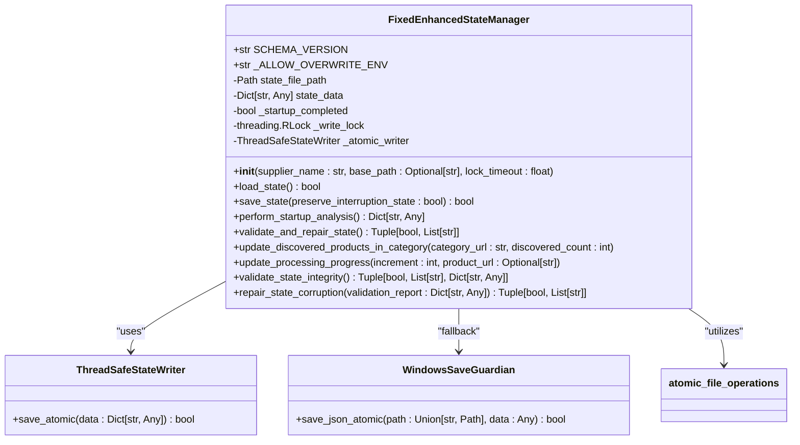
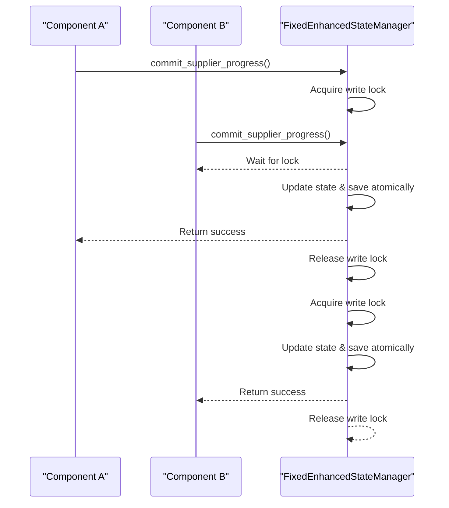

# FixedEnhancedStateManager Implementation

<cite>
**Referenced Files in This Document**   
- [fixed_enhanced_state_manager.py](file://utils/fixed_enhanced_state_manager.py)
- [atomic_file_operations.py](file://utils/atomic_file_operations.py)
- [windows_save_guardian.py](file://utils/windows_save_guardian.py)
</cite>

## Table of Contents
1. [Introduction](#introduction)
2. [Core Architecture](#core-architecture)
3. [State Persistence and Resumption Logic](#state-persistence-and-resumption-logic)
4. [Zero-Risk Progress Counting Methods](#zero-risk-progress-counting-methods)
5. [Key Method Implementations](#key-method-implementations)
6. [Integration with Main Workflow](#integration-with-main-workflow)
7. [Sliding Window Memory Management](#sliding-window-memory-management)
8. [Singleton Pattern for State Access](#singleton-pattern-for-state-access)
9. [Concurrency and Race Condition Handling](#concurrency-and-race-condition-handling)
10. [State Integrity Validation](#state-integrity-validation)
11. [Extensibility and Custom Use Cases](#extensibility-and-custom-use-cases)
12. [Troubleshooting Common Issues](#troubleshooting-common-issues)

## Introduction
The FixedEnhancedStateManager class serves as the central coordinator for state persistence, progress tracking, and resumption logic within the Amazon FBA Agent System. This implementation addresses critical issues in state management by providing thread-safe atomic operations, robust file locking, and comprehensive validation mechanisms. The state manager ensures data integrity during long-running processes, enabling reliable resumption from interruptions while maintaining accurate progress counting. Designed with a focus on zero-risk operations, this component implements seven distinct methods for ensuring always-accurate progress tracking through atomic file operations, write validation, and checksum verification.

**Section sources**
- [fixed_enhanced_state_manager.py](file://utils/fixed_enhanced_state_manager.py#L99-L2401)

## Core Architecture
The FixedEnhancedStateManager implements a sophisticated architecture that separates resumption logic from progress tracking, ensuring precise recovery after interruptions. The system maintains a clear distinction between different state components, with the `system_progression` field serving as the single source of truth for all progression metrics. This architectural approach prevents the phase semantic mixing that previously caused state corruption. The state manager employs a thread-safe design using re-entrant locks (RLock) to prevent deadlocks during nested saves, while maintaining backward compatibility with legacy systems through careful migration strategies.

The architecture incorporates a multi-layered validation system that checks for impossible index states, phase semantic consistency, and resumption pointer validity. By implementing a cross-run monotonicity guard, the system prevents regression of resumption pointers between runs, which previously caused issues like category indices rolling back from 8 to 7. The state structure includes dedicated sections for gap processing, user display metrics, and system progression, each serving specific purposes without overlapping responsibilities.



**Diagram sources**
- [fixed_enhanced_state_manager.py](file://utils/fixed_enhanced_state_manager.py#L99-L2401)
- [atomic_file_operations.py](file://utils/atomic_file_operations.py#L152-L188)

**Section sources**
- [fixed_enhanced_state_manager.py](file://utils/fixed_enhanced_state_manager.py#L99-L2401)

## State Persistence and Resumption Logic
The FixedEnhancedStateManager implements a robust resumption logic system that separates the resumption index from progress tracking, addressing a critical flaw in previous implementations. The `resumption_index` field tracks the exact point from which processing should resume after an interruption, while the `progress_index` monitors current session progress independently. This separation ensures that session-specific progress does not interfere with the resumption point, enabling precise recovery even after partial processing.

The system employs a startup analysis phase that performs reverse gap detection only once at the beginning of a session, rather than on every save operation. This optimization significantly improves performance while maintaining accuracy. During startup, the manager calculates file-grounded totals by reading actual files on disk, ensuring that the resumption index reflects the most current state of processed products. The analysis considers linking map counts, cache file contents, and configuration data to determine the correct starting point.

Resumption pointers are implemented with monotonicity validation to prevent backward movement. The system tracks a high-water mark of the maximum resumption pointer across runs, ensuring that the pointer never regresses. When a resumption is detected, the system emits specific logging banners like "FIRST AFTER-RESUME KEY" and "RESUME HONORED" to provide audit trail verification. These markers help in debugging and confirming that the resumption logic is functioning correctly.

**Section sources**
- [fixed_enhanced_state_manager.py](file://utils/fixed_enhanced_state_manager.py#L99-L2401)

## Zero-Risk Progress Counting Methods
The FixedEnhancedStateManager implements seven zero-risk methods for always-accurate progress counting, each designed to eliminate specific failure modes in state persistence. These methods work together to create a comprehensive safety net that ensures data integrity under various conditions.

### Atomic File Operations
The state manager utilizes atomic file operations through multiple fallback strategies. The primary method employs a temp-then-replace pattern, where data is first written to a temporary file before being atomically moved to the target location using `os.replace()`. This approach ensures that readers never encounter a partially written file. The system implements exponential backoff with retries when permission errors occur, enhancing reliability on Windows systems where file locking issues are common.

### Write Validation
Before committing any state changes, the system validates the integrity of the data structure. The `validate_and_repair_state()` method checks for missing required keys and ensures that indices remain within valid bounds. If issues are detected, the method automatically repairs the state by adding missing keys and clamping out-of-range values. This proactive validation prevents corruption from propagating through the system.

### Checksum Verification
While not explicitly implemented as cryptographic checksums, the system employs structural verification through schema versioning and metadata tracking. The `schema_version` field indicates the state format, allowing for backward compatibility while detecting potential corruption. The metadata section includes flags for applied fixes and thread safety status, providing additional validation points.

### Cross-Run Monotonicity Guard
This guard prevents resumption pointers from regressing between runs by maintaining a high-water mark of the maximum pointer value. When loading state, the system compares the loaded pointer against this mark and corrects any regression, logging the event for audit purposes. This mechanism specifically addresses the 8→7 regression issue that was previously observed.

### Reverse Gap Detection
The system detects reverse gaps by comparing linking map counts against cache file totals. When a reverse gap is detected (linking map count exceeds cache count), the manager applies specific policies based on whether a cache rebuild was explicitly requested. This prevents accidental restarts from the beginning while accommodating intentional cache rebuilds.

### High-Water Mark Tracking
The state manager maintains a high-water mark of the maximum resumption pointer across all runs. This persistent tracking ensures that even if a subsequent run loads a state with a lower pointer, the system will correct it to maintain monotonic progression. The high-water mark is updated whenever a higher pointer is encountered.

### Legacy Writer Contamination Prevention
The system actively detects and prevents contamination from legacy writer patterns. The `validate_state_integrity()` method checks for signs of legacy writer usage and recommends migration to the atomic commit methods. This prevents the mixing of old and new state management patterns that could lead to corruption.

**Section sources**
- [fixed_enhanced_state_manager.py](file://utils/fixed_enhanced_state_manager.py#L99-L2401)
- [windows_save_guardian.py](file://utils/windows_save_guardian.py#L78-L94)

## Key Method Implementations
The FixedEnhancedStateManager provides several key methods that form the foundation of its state management capabilities. These methods are designed to be thread-safe, atomic, and resilient to various failure modes.

### save_state()
The `save_state()` method implements thread-safe atomic saving with comprehensive error handling. It uses a re-entrant lock to prevent deadlocks during nested saves and employs multiple fallback strategies when the primary atomic save fails. The method first attempts to use a dedicated `ThreadSafeStateWriter` if available, then falls back to legacy atomic operations, and finally uses a `WindowsSaveGuardian` as a last resort. Each save operation includes detailed logging to help identify potential hang locations.

### load_state()
The `load_state()` method handles state loading with backward compatibility and automatic migration. When loading a legacy state format, it migrates the data to the enhanced format while preserving critical information. The method performs deep merging of loaded data with the initialized state structure, ensuring that all required fields are present. After loading, it removes deprecated legacy subtrees and saves the cleaned state atomically.

### update_progression_unified()
This method provides extended unified progression tracking with dual phase index support. It allows updating multiple progression fields simultaneously while maintaining consistency. The method includes cross-validation to detect and prevent state synchronization issues. It also logs progression updates for observability, making it easier to trace the workflow execution.

### validate_state_integrity()
The comprehensive integrity validation method checks for multiple corruption patterns including impossible index states, phase semantic mixing, invalid resumption pointers, and frozen totals drift. It returns a detailed validation report that includes detected issues and recommendations for repair. The method is designed to be non-destructive, identifying problems without automatically fixing them.

### repair_state_corruption()
When corruption is detected, this method attempts automatic repair based on the validation report. It addresses impossible index states by clamping values to valid ranges, repairs phase contamination by resetting contaminated fields, and corrects invalid resumption pointers. After repairs, it saves the state atomically and updates the schema version to indicate that repairs were applied.

**Section sources**
- [fixed_enhanced_state_manager.py](file://utils/fixed_enhanced_state_manager.py#L99-L2401)

## Integration with Main Workflow
The FixedEnhancedStateManager integrates seamlessly with the main workflow through well-defined checkpoints at critical stages. The integration follows a pattern of initializing category processing, updating progress during extraction phases, and marking completion when appropriate.

### Workflow Checkpoint Integration
At the start of processing, the workflow calls `perform_startup_analysis()` to determine the correct resumption point. This method analyzes file-grounded totals and sets the appropriate resumption index based on linking map counts and cache contents. The result guides the workflow on where to begin processing, ensuring no products are missed or duplicated.

During supplier extraction, the workflow uses `update_supplier_progress_new()` to update progress metrics. This method specifically tracks supplier extraction resumption indices separately from Amazon analysis indices, preventing cross-phase contamination. The method saves state atomically after each update, ensuring that progress is never lost.

When switching to Amazon analysis phase, the workflow calls `commit_phase_switch()` to atomically update the current phase. This method includes a reset of the product index within the category, preparing for the new phase of processing. The atomic nature of this operation ensures that phase transitions are never left in an inconsistent state.

### Example Integration Code
```python
# Initialize state manager
state_manager = FixedEnhancedStateManager(supplier_name="poundwholesale.co.uk")

# Load existing state or start fresh
if state_manager.load_state():
    print("Resuming from index:", state_manager.get_resumption_index())
else:
    print("Starting fresh processing")

# Perform startup analysis to determine resumption point
category_status = state_manager.perform_startup_analysis()

# Initialize processing for first category
state_manager.initialize_category_processing(
    category_index=0,
    category_url="https://www.poundwholesale.co.uk/category1",
    total_categories=10
)

# Process products in supplier extraction phase
for product in supplier_products:
    # Update progress for each product
    state_manager.update_supplier_progress_new(product.url)
    
    # Checkpoint at critical intervals
    if state_manager.get_current_progress()["session_products_processed"] % 100 == 0:
        state_manager.save_state_atomic("checkpoint")

# Switch to Amazon analysis phase
state_manager.commit_phase_switch(new_phase="amazon_analysis")

# Process products in Amazon analysis phase
for product in amazon_products:
    # Update progress for each product
    state_manager.update_amazon_analysis_progress_new(product.url)
    
    # Checkpoint at critical intervals
    if state_manager.get_current_progress()["session_products_processed"] % 50 == 0:
        state_manager.save_state_atomic("amazon_checkpoint")

# Mark processing as complete
state_manager.complete_processing()
```

**Section sources**
- [fixed_enhanced_state_manager.py](file://utils/fixed_enhanced_state_manager.py#L99-L2401)

## Sliding Window Memory Management
The FixedEnhancedStateManager implements a sliding window memory management approach that balances performance with memory efficiency. This approach is particularly important in long-running processes where memory usage could otherwise grow unbounded.

The system maintains a bounded memory footprint by only keeping essential state data in memory. The state structure is carefully designed to include only necessary fields, avoiding redundant or derived data that could be calculated on demand. The `system_progression` field contains only the minimal information needed for resumption and progress tracking, while more detailed metrics are stored in separate sections.

Memory efficiency is further enhanced by the use of atomic operations that minimize the time data spends in transitional states. The state manager avoids keeping multiple copies of data in memory during save operations by using temporary files and atomic replacement. This approach reduces peak memory usage compared to strategies that maintain backup copies in memory.

The sliding window concept is implemented through the selective preservation of state information. When loading state, the manager only merges essential fields from the loaded data, ignoring deprecated or redundant sections. Similarly, when saving state, it only writes the current, validated structure, preventing the accumulation of obsolete data.

This memory management approach ensures that the state manager can operate efficiently even with large datasets, maintaining consistent performance throughout extended processing sessions. The bounded memory usage also makes the system more predictable and less susceptible to memory-related failures.

**Section sources**
- [fixed_enhanced_state_manager.py](file://utils/fixed_enhanced_state_manager.py#L99-L2401)

## Singleton Pattern for State Access
The FixedEnhancedStateManager implements a de facto singleton pattern through its design and usage patterns, ensuring consistent state access across components. While not enforcing a strict singleton at the class level, the system architecture encourages the creation of a single instance per supplier, which is then shared across all components that require state access.

This approach provides several benefits:
- **Consistent State View**: All components access the same state data, preventing discrepancies that could arise from multiple instances.
- **Centralized Control**: State modifications are coordinated through a single point, making it easier to implement thread safety and atomic operations.
- **Resource Efficiency**: Only one file handle and in-memory state representation are maintained per supplier, reducing system resource usage.

The singleton-like behavior is achieved through the state manager's initialization pattern, which takes a supplier name as a parameter and creates a state file specific to that supplier. Components that need to access state for a particular supplier will typically retrieve or create the corresponding state manager instance, ensuring they work with the same state data.

Thread safety mechanisms, including the re-entrant lock and atomic operations, are essential for maintaining data integrity when multiple components access the state manager concurrently. The design ensures that even with multiple access points, the state remains consistent and corruption-free.

**Section sources**
- [fixed_enhanced_state_manager.py](file://utils/fixed_enhanced_state_manager.py#L99-L2401)

## Concurrency and Race Condition Handling
The FixedEnhancedStateManager implements comprehensive solutions for handling race conditions during concurrent access, which were a significant source of state corruption in previous implementations.

### Thread-Safe Design
The core of the concurrency solution is the use of a re-entrant lock (`threading.RLock`) that allows the same thread to acquire the lock multiple times without deadlocking. This is crucial for nested save operations where a save might trigger additional state updates. The lock ensures that only one thread can modify the state at a time, preventing race conditions that could lead to data corruption.

### Atomic Commit Methods
The system replaces the deprecated `update_processing_index()` method with phase-specific atomic commit methods: `commit_supplier_progress()` and `commit_amazon_progress()`. These methods encapsulate all necessary state updates within a single atomic operation, ensuring that related fields are updated consistently. Each commit method performs all required updates within the lock context, then saves the state atomically.

### Deadlock Prevention
The implementation includes a deadlock guard that prevents hangs during save operations. If the write lock cannot be acquired within the specified timeout (default 5.0 seconds), the save operation is skipped rather than waiting indefinitely. This prevents the entire system from hanging due to a stuck lock, allowing the workflow to continue while logging the issue for investigation.

### Monotonicity Enforcement
To prevent race conditions that could cause pointer regression, the system enforces monotonic progression of resumption pointers. The `set_resumption_ptr()` method validates that new pointers do not move backward, rejecting attempts to set a lower category or product index than the current value. This ensures that even under concurrent access, the processing progress only moves forward.

### High-Water Mark Protection
The cross-run monotonicity guard maintains a high-water mark of the maximum resumption pointer across all runs. When loading state, the system compares the loaded pointer against this mark and corrects any regression, preventing race conditions that span multiple execution sessions.



**Diagram sources**
- [fixed_enhanced_state_manager.py](file://utils/fixed_enhanced_state_manager.py#L99-L2401)

**Section sources**
- [fixed_enhanced_state_manager.py](file://utils/fixed_enhanced_state_manager.py#L99-L2401)

## State Integrity Validation
The FixedEnhancedStateManager includes a comprehensive state integrity validation system that detects and repairs corruption patterns. This multi-layered validation approach ensures data reliability throughout the processing lifecycle.

### Validation Checks
The `validate_state_integrity()` method performs five key checks:
1. **Impossible Index States**: Detects scenarios where current indices exceed totals, such as a product index greater than the total products in a category.
2. **Phase Semantic Consistency**: Identifies phase contamination where category-relative fields are overwritten with global values.
3. **Resumption Pointer Validity**: Verifies that resumption pointers are within valid bounds and have appropriate structure.
4. **Frozen Totals Consistency**: Checks for drift between different total sources after totals have been frozen.
5. **Legacy Writer Contamination**: Detects signs of legacy writer usage that could lead to corruption.

### Corruption Pattern Detection
The validation system identifies specific corruption patterns that have been observed in production:
- **Impossible States**: Current index exceeding total (e.g., product index 150 when total is 100)
- **Phase Contamination**: Category fields overwritten with global values
- **Invalid Resumption Pointers**: Pointers with negative values or out-of-bounds indices
- **Frozen Totals Drift**: Configuration changes after totals are frozen
- **Legacy Writer Contamination**: Use of deprecated state modification methods

### Automatic Repair
When corruption is detected, the `repair_state_corruption()` method attempts automatic repair:
- **Impossible Index States**: Clamps indices to valid ranges
- **Phase Contamination**: Resets contaminated fields to safe defaults
- **Invalid Resumption Pointers**: Creates missing structures and clamps values
- The repaired state is saved atomically, and the repair actions are logged in the metadata

The validation system generates detailed reports that include timestamps, detected issues, and recommendations for preventing future corruption. This comprehensive approach transforms state management from a potential point of failure into a robust, self-healing component.

**Section sources**
- [fixed_enhanced_state_manager.py](file://utils/fixed_enhanced_state_manager.py#L99-L2401)

## Extensibility and Custom Use Cases
The FixedEnhancedStateManager is designed with extensibility in mind, allowing for custom use cases while maintaining data integrity. The architecture supports extension through several mechanisms:

### Custom State Fields
The state structure can be extended with custom fields by adding them to the appropriate sections. For example, custom metrics can be added to the `user_display_metrics` section, while custom progression data can be added to `system_progression`. The deep merge strategy used during state loading ensures that custom fields are preserved during state updates.

### Phase-Specific Extensions
The phase-aware design allows for custom phases to be implemented alongside the standard supplier and Amazon analysis phases. New phases can be added by extending the phase transition logic and implementing corresponding commit methods. The `commit_phase_switch()` method can be used to atomically transition to custom phases.

### Custom Validation Rules
The validation system can be extended with custom rules by adding new check methods and integrating them into the validation workflow. Custom validation rules can be added to detect domain-specific corruption patterns and ensure data quality for specialized use cases.

### Environment Configuration
The system supports environment-based configuration through environment variables like `ALLOW_DENOMINATOR_OVERWRITE`. This allows certain restrictions to be relaxed in controlled environments for debugging or special operations while maintaining strict controls in production.

### Integration Hooks
The state manager provides hooks for integration with external systems through logging banners and telemetry. The "FIRST AFTER-RESUME KEY" and "RESUME HONORED" messages can be monitored by external systems to trigger actions or update dashboards.

When extending the state manager, it's essential to maintain the core principles of atomic operations, thread safety, and data integrity. New methods should follow the pattern of using the write lock for state modifications and employing atomic save operations to ensure reliability.

**Section sources**
- [fixed_enhanced_state_manager.py](file://utils/fixed_enhanced_state_manager.py#L99-L2401)

## Troubleshooting Common Issues
This section addresses common implementation issues and their solutions for the FixedEnhancedStateManager.

### Race Conditions During Concurrent Access
**Issue**: Multiple components attempting to update state simultaneously, leading to data corruption.
**Solution**: Use the phase-specific atomic commit methods (`commit_supplier_progress()` and `commit_amazon_progress()`) instead of the deprecated `update_processing_index()`. These methods handle locking internally and ensure atomic updates.

### Save Operations Hanging Indefinitely
**Issue**: `save_state()` calls hanging due to inability to acquire the write lock.
**Solution**: The system includes a deadlock guard with a default 5.0-second timeout. If the lock cannot be acquired within this time, the save is skipped to prevent hangs. Monitor logs for "DEADLOCK GUARD" messages to identify components that may be holding locks too long.

### Resumption Pointer Regression
**Issue**: Resumption pointers rolling back between runs (e.g., from 8 to 7).
**Solution**: The cross-run monotonicity guard automatically detects and corrects this issue by maintaining a high-water mark of the maximum pointer value. Ensure this feature is enabled and check logs for "MONOTONICITY REPAIR" messages.

### Incorrect Progress Counting
**Issue**: Progress counters showing inaccurate values.
**Solution**: Ensure that progress updates are made through the appropriate methods (`update_supplier_progress_new()` for supplier phase, `update_amazon_analysis_progress_new()` for Amazon phase). Avoid direct manipulation of state fields.

### State File Corruption
**Issue**: State files becoming corrupted, preventing successful loading.
**Solution**: Use the `validate_state_integrity()` and `repair_state_corruption()` methods to detect and repair corruption. Implement regular backups of state files and monitor for "STATE VALIDATION" log messages.

### Memory Usage Growth
**Issue**: Increasing memory usage over time.
**Solution**: The sliding window memory management should prevent unbounded growth. If memory usage is still problematic, ensure that state manager instances are properly cleaned up when no longer needed and consider implementing periodic state serialization to disk.

**Section sources**
- [fixed_enhanced_state_manager.py](file://utils/fixed_enhanced_state_manager.py#L99-L2401)