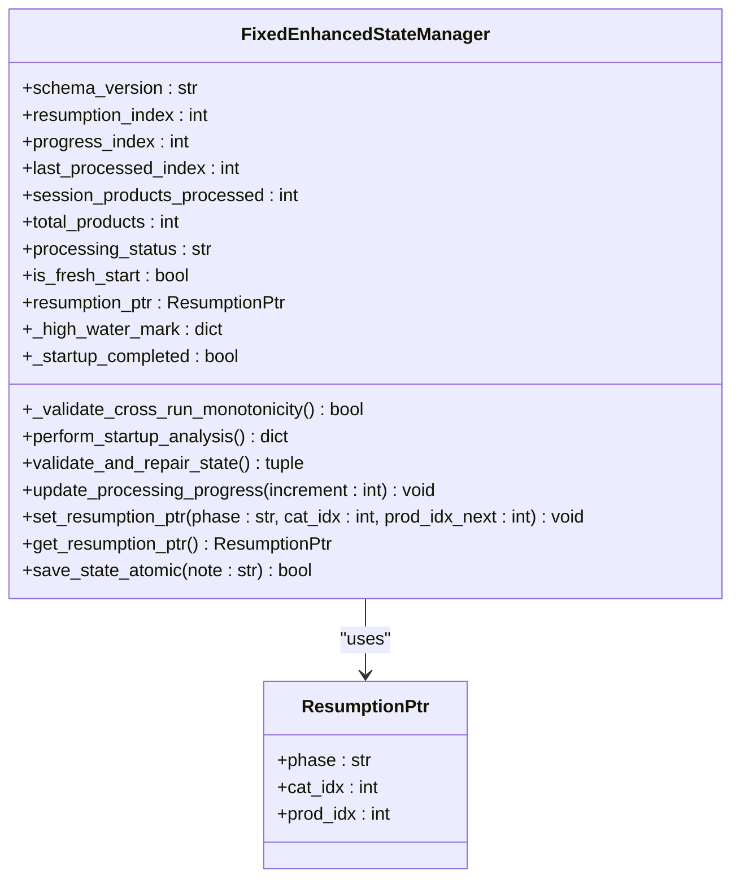
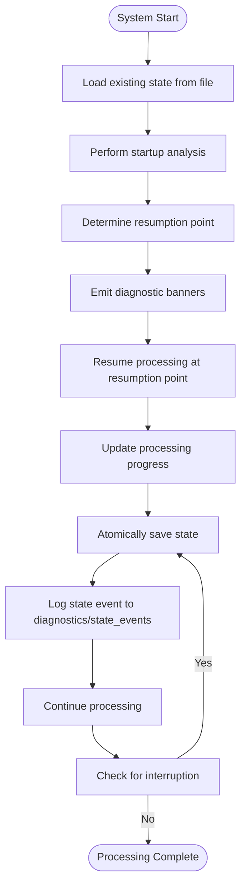
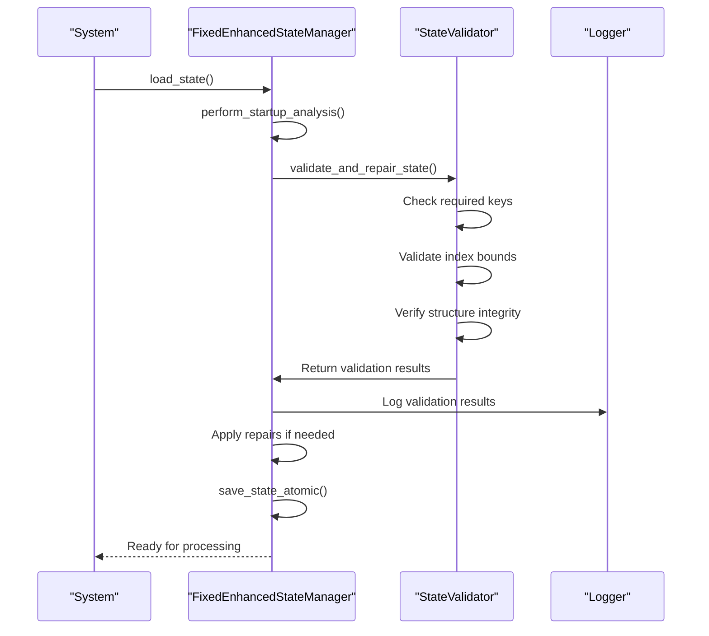
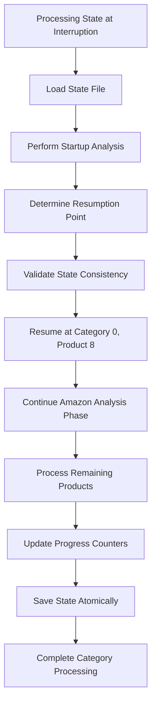
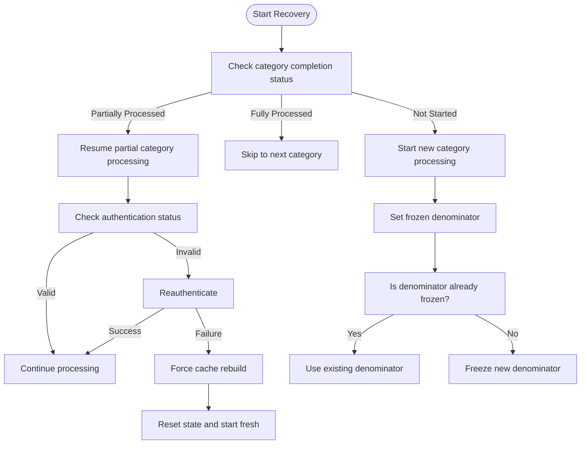
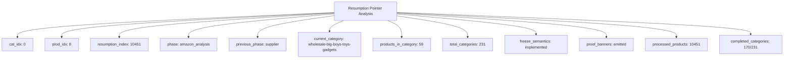
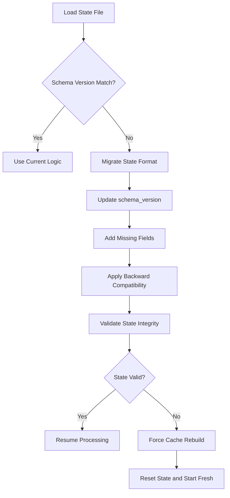

# Resumption Logic and Recovery

<cite>
**Referenced Files in This Document**   
- [fixed_enhanced_state_manager.py](file://utils/fixed_enhanced_state_manager.py)
- [poundwholesale_co_uk_processing_state.json](file://processing_states/poundwholesale_co_uk_processing_state.json)
- [processing_state_at_interruption.json](file://results/verification_run_20250911_155300/A_run1/processing_state_at_interruption.json)
- [resumption_pointer_analysis.txt](file://results/verification_run_20250911_155300/A_run1/resumption_pointer_analysis.txt)
- [system_behavior_observations.md](file://results/verification_run_20250911_155300/A_run1/system_behavior_observations.md)
- [state_1757010653.json](file://diagnostics/state_events/state_1757010653.json)
</cite>

## Table of Contents
1. [Introduction](#introduction)
2. [Resumption Logic and State Restoration](#resumption-logic-and-state-restoration)
3. [State Event Logging and Diagnostics](#state-event-logging-and-diagnostics)
4. [Verification and Validation Process](#verification-and-validation-process)
5. [Recovery from Simulated Interruptions](#recovery-from-simulated-interruptions)
6. [Edge Case Handling During Recovery](#edge-case-handling-during-recovery)
7. [Resumption Pointer Analysis and System Behavior](#resumption-pointer-analysis-and-system-behavior)
8. [Version Incompatibility and Mitigation Strategies](#version-incompatibility-and-mitigation-strategies)
9. [Troubleshooting Failed Resumption Attempts](#troubleshooting-failed-resumption-attempts)
10. [Conclusion](#conclusion)

## Introduction
The Amazon FBA Agent System implements a robust resumption and recovery mechanism designed to ensure reliable processing continuity in the face of interruptions. This document details the system's ability to detect interrupted executions, restore processing from the last valid state checkpoint, and maintain data integrity across sessions. The recovery architecture is built around a thread-safe, atomic state management system that prevents data corruption and ensures monotonic progression of processing tasks. The system leverages granular state event logging for forensic analysis and includes comprehensive validation mechanisms to verify state consistency before resuming operations. This documentation provides a comprehensive overview of the resumption logic, recovery mechanisms, and diagnostic capabilities that enable the system to handle complex recovery scenarios, including partial category processing and failed authentication sequences.

**Section sources**
- [fixed_enhanced_state_manager.py](file://utils/fixed_enhanced_state_manager.py#L1-L2412)

## Resumption Logic and State Restoration
The system's resumption logic is centered around the `FixedEnhancedStateManager` class, which manages the processing state with thread safety and atomic operations. The state manager separates resumption tracking from progress tracking by maintaining distinct indices: `resumption_index` for determining where to resume after interruption, `progress_index` for current session progress, and `last_processed_index` for backward compatibility. The system uses a phase-aware resumption pointer (`resumption_ptr`) that tracks the current phase, category index, and product index within the category, ensuring precise recovery to the exact point of interruption.

During startup, the system performs a comprehensive analysis to determine the correct resumption point. This analysis considers file-grounded totals from the linking map and cached products, applying a reverse gap detection heuristic when the linking map count exceeds the cache count. The system validates cross-run monotonicity by comparing the loaded resumption pointer against a persisted high-water mark, preventing regression of processing progress between runs. The state manager ensures that the resumption pointer never decreases, maintaining a monotonic progression of processing tasks.



**Diagram sources**
- [fixed_enhanced_state_manager.py](file://utils/fixed_enhanced_state_manager.py#L1-L2412)

**Section sources**
- [fixed_enhanced_state_manager.py](file://utils/fixed_enhanced_state_manager.py#L1-L2412)

## State Event Logging and Diagnostics
The system implements a comprehensive state event logging system in the `diagnostics/state_events` directory, which captures granular state transitions for forensic analysis. Each state event is stored as a JSON file with a timestamp-based filename (e.g., `state_1757010653.json`), containing detailed information about product processing, including ASIN, title, pricing, sales rank, and other relevant metrics. These state events serve as an audit trail for processing activities and enable detailed forensic analysis of system behavior.

The state manager includes diagnostic capabilities that emit proof banners to verify resumption behavior. The `emit_first_after_resume_if_needed` method emits a "FIRST_AFTER_RESUME_KEY" banner once per phase when resuming processing, while the `emit_resume_honored_if_needed` method emits a "RESUME_HONORED" banner to confirm that the system is honoring the resumption pointer. These diagnostic messages are stored in the state data's diagnostics section to avoid polluting the control state.

The system also maintains a state timeline analysis file (`state_timeline_analysis.txt`) that provides a chronological record of state changes, enabling analysis of processing patterns and identification of potential issues. The state events capture critical information such as product availability, pricing changes, sales rank fluctuations, and review counts, which are essential for forensic analysis of processing outcomes.



**Diagram sources**
- [fixed_enhanced_state_manager.py](file://utils/fixed_enhanced_state_manager.py#L1-L2412)
- [state_1757010653.json](file://diagnostics/state_events/state_1757010653.json)

**Section sources**
- [fixed_enhanced_state_manager.py](file://utils/fixed_enhanced_state_manager.py#L1-L2412)
- [state_1757010653.json](file://diagnostics/state_events/state_1757010653.json)

## Verification and Validation Process
The system implements a comprehensive verification process to validate state consistency before resuming operations. The `validate_and_repair_state` method performs integrity checks on the state data, ensuring required keys exist and values are within valid bounds. It verifies that the resumption index is non-negative and does not exceed the total number of products, and ensures that critical structures like `gap_processing` and `system_progression` exist.

The state manager also performs cross-run monotonicity validation to prevent regression of processing progress between runs. This validation compares the loaded resumption pointer against a persisted high-water mark, correcting any violations that would result in processing regression. The system logs these validation checks and any repairs made, providing an audit trail for state integrity.

The verification process includes checks for impossible index states, phase semantic consistency, resumption pointer validity, frozen totals consistency, and legacy writer contamination. These checks detect common corruption patterns and enable automatic repair of detected issues. The system's validation report includes recommendations for addressing identified issues, such as replacing legacy update methods with phase-specific atomic commits.



**Diagram sources**
- [fixed_enhanced_state_manager.py](file://utils/fixed_enhanced_state_manager.py#L1-L2412)

**Section sources**
- [fixed_enhanced_state_manager.py](file://utils/fixed_enhanced_state_manager.py#L1-L2412)

## Recovery from Simulated Interruptions
The system's recovery capabilities have been validated through extensive testing with simulated interruptions. The verification runs in the `results/verification_run_20250911_155300` directory demonstrate successful resumption after simulated interruptions. In one test scenario, the system was interrupted while processing the "wholesale-big-boys-toys-gadgets" category, having successfully extracted data for a Wood Varnish product with ASIN B08DY9P7QW.

The resumption pointer analysis shows that the system correctly tracks the processing position with cat_idx=0 and prod_idx=8, indicating resumption at the 9th product in the first category. The system maintains all progress counters and statistics, including 10,451 successfully processed products and 170 out of 231 categories analyzed. When the system restarts, it resumes at category 0, product 8, continuing the Amazon analysis phase and processing the remaining products in the current category.

The processing state at interruption (`processing_state_at_interruption.json`) shows the system in the "amazon_analysis" phase with the resumption index at 10,451 and the supplier extraction resumption index at 0. The system_progression structure contains the complete resumption pointer with cat_idx=0, prod_idx=8, and the current category URL, ensuring precise recovery to the exact point of interruption.



**Diagram sources**
- [processing_state_at_interruption.json](file://results/verification_run_20250911_155300/A_run1/processing_state_at_interruption.json)
- [resumption_pointer_analysis.txt](file://results/verification_run_20250911_155300/A_run1/resumption_pointer_analysis.txt)

**Section sources**
- [processing_state_at_interruption.json](file://results/verification_run_20250911_155300/A_run1/processing_state_at_interruption.json)
- [resumption_pointer_analysis.txt](file://results/verification_run_20250911_155300/A_run1/resumption_pointer_analysis.txt)

## Edge Case Handling During Recovery
The system implements robust mechanisms for handling edge cases during recovery, including partial category processing and failed authentication sequences. For partial category processing, the system maintains a category completion status in the `gap_processing` structure, tracking extracted and processed products for each category. This allows the system to identify partially processed categories and resume processing from the correct point.

When handling failed authentication sequences during recovery, the system preserves the authentication state and retries the authentication process before resuming data extraction. The state manager includes a `force_cache_rebuild` method that can be used to explicitly reset the cache and resumption index when authentication issues persist, allowing the system to start fresh while preserving the overall processing context.

The system also handles edge cases related to category denominator changes during processing. The `set_frozen_denominator` method locks the category product count to prevent drift between runs, while the `is_category_denominator_frozen` method checks if a category's denominator has already been frozen. This prevents inconsistent processing behavior when category sizes change between runs.



**Diagram sources**
- [fixed_enhanced_state_manager.py](file://utils/fixed_enhanced_state_manager.py#L1-L2412)
- [poundwholesale_co_uk_processing_state.json](file://processing_states/poundwholesale_co_uk_processing_state.json)

**Section sources**
- [fixed_enhanced_state_manager.py](file://utils/fixed_enhanced_state_manager.py#L1-L2412)
- [poundwholesale_co_uk_processing_state.json](file://processing_states/poundwholesale_co_uk_processing_state.json)

## Resumption Pointer Analysis and System Behavior
The system's resumption pointer analysis provides detailed insights into system behavior during recovery. The analysis in `resumption_pointer_analysis.txt` shows that the system maintains a precise resumption pointer with cat_idx=0, prod_idx=8, and resumption_index=10,451, indicating the exact point to resume processing. The system tracks phase transitions, with the current phase being "amazon_analysis" and the previous phase "supplier", ensuring correct context for resumption.

The system behavior observations confirm that the processing state file is preserved with complete resumption data, including category context, freeze semantics, and proof emission banners. The system maintains 170 out of 231 categories analyzed, with the current category being "https://www.poundwholesale.co.uk/toys/wholesale-big-boys-toys-gadgets" containing 59 products. The system successfully extracted product data including title, price, original price, rating, and reviews before the interruption.

The resumption pointer analysis also verifies that freeze semantics are properly implemented, with totals committed and timestamps recorded. The category completion tracking is maintained, showing 170 out of 231 categories analyzed. The system's ability to preserve the browser state between executions ensures continuity of session data and authentication tokens, facilitating seamless resumption of processing activities.



**Diagram sources**
- [resumption_pointer_analysis.txt](file://results/verification_run_20250911_155300/A_run1/resumption_pointer_analysis.txt)
- [system_behavior_observations.md](file://results/verification_run_20250911_155300/A_run1/system_behavior_observations.md)

**Section sources**
- [resumption_pointer_analysis.txt](file://results/verification_run_20250911_155300/A_run1/resumption_pointer_analysis.txt)
- [system_behavior_observations.md](file://results/verification_run_20250911_155300/A_run1/system_behavior_observations.md)

## Version Incompatibility and Mitigation Strategies
The system addresses version incompatibility between state files and code updates through several mitigation strategies. The state manager includes a schema version field (`schema_version`) that tracks the state format version, allowing the system to detect and handle version mismatches. When loading a state file with an older schema version, the system performs migration to the current format, ensuring compatibility with the latest code.

The system implements backward compatibility by maintaining legacy fields like `last_processed_index` while introducing new fields like `resumption_index` and `progress_index` for enhanced functionality. The state merging logic ensures that new fields are added to loaded state data if they don't exist, preventing errors due to missing fields in older state files.

To mitigate issues caused by code updates that change processing logic, the system includes a `force_cache_rebuild` method that allows explicit cache rebuilding and resumption index reset. This is particularly useful when updates change the way products are extracted or processed, ensuring that the system starts fresh with the new logic rather than attempting to resume with potentially incompatible state data.



**Diagram sources**
- [fixed_enhanced_state_manager.py](file://utils/fixed_enhanced_state_manager.py#L1-L2412)

**Section sources**
- [fixed_enhanced_state_manager.py](file://utils/fixed_enhanced_state_manager.py#L1-L2412)

## Troubleshooting Failed Resumption Attempts
When resumption attempts fail, the system provides comprehensive troubleshooting information through detailed logging and diagnostic banners. Common issues include state file corruption, version incompatibility, and authentication failures. The system's validation process detects these issues and logs appropriate error messages, guiding troubleshooting efforts.

For state file corruption, the system's integrity validation detects impossible index states, phase semantic mixing, and invalid resumption pointers. The `repair_state_corruption` method attempts to automatically repair detected issues by clamping indices to valid ranges and restoring consistent state values. If automatic repair fails, the system recommends forcing a cache rebuild to start fresh.

Authentication failures during resumption are handled by preserving the authentication state and retrying the authentication process. If authentication continues to fail, the system can force a cache rebuild to reset the state and re-authenticate. The system also logs detailed information about the resumption attempt, including the resumption pointer, phase information, and category context, which aids in diagnosing the root cause of failure.

```mermaid
flowchart TD
A[Failed Resumption Attempt] --> B[Check Error Logs]
B --> C{Error Type?}
C --> |State Corruption| D[Run validate_and_repair_state()]
C --> |Version Incompatibility| E[Check schema_version]
C --> |Authentication Failure| F[Check authentication status]
C --> |Other| G[Analyze system logs]
D --> H{Repair Successful?}
H --> |Yes| I[Resume Processing]
H --> |No| J[Force Cache Rebuild]
E --> K[Update state format if needed]
K --> L[Resume Processing]
F --> M[Reauthenticate]
M --> N{Authentication Successful?}
N --> |Yes| O[Resume Processing]
N --> |No| P[Force Cache Rebuild]
J --> Q[Reset state and start fresh]
P --> Q
```

**Diagram sources**
- [fixed_enhanced_state_manager.py](file://utils/fixed_enhanced_state_manager.py#L1-L2412)

**Section sources**
- [fixed_enhanced_state_manager.py](file://utils/fixed_enhanced_state_manager.py#L1-L2412)

## Conclusion
The Amazon FBA Agent System implements a comprehensive and robust resumption and recovery mechanism that ensures reliable processing continuity in the face of interruptions. The system's thread-safe, atomic state management prevents data corruption and ensures monotonic progression of processing tasks. The phase-aware resumption pointer and comprehensive validation process enable precise recovery to the exact point of interruption, while the granular state event logging provides detailed forensic analysis capabilities.

The system's ability to handle edge cases, including partial category processing and failed authentication sequences, demonstrates its resilience in complex recovery scenarios. The mitigation strategies for version incompatibility between state files and code updates ensure long-term compatibility and reliability. The comprehensive troubleshooting guidance and diagnostic capabilities enable effective resolution of failed resumption attempts, minimizing downtime and data loss.

Overall, the resumption logic and recovery mechanisms provide a solid foundation for reliable, long-running processing tasks, ensuring data integrity and processing continuity across sessions. The system's design principles of separation of concerns, atomic operations, and comprehensive validation create a robust architecture that can handle the challenges of real-world processing environments.