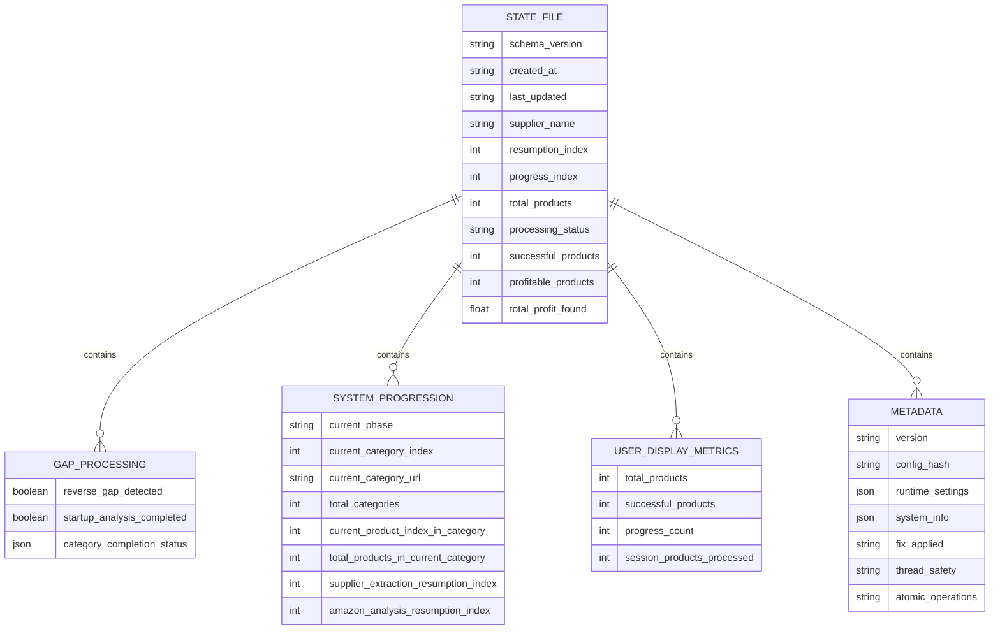
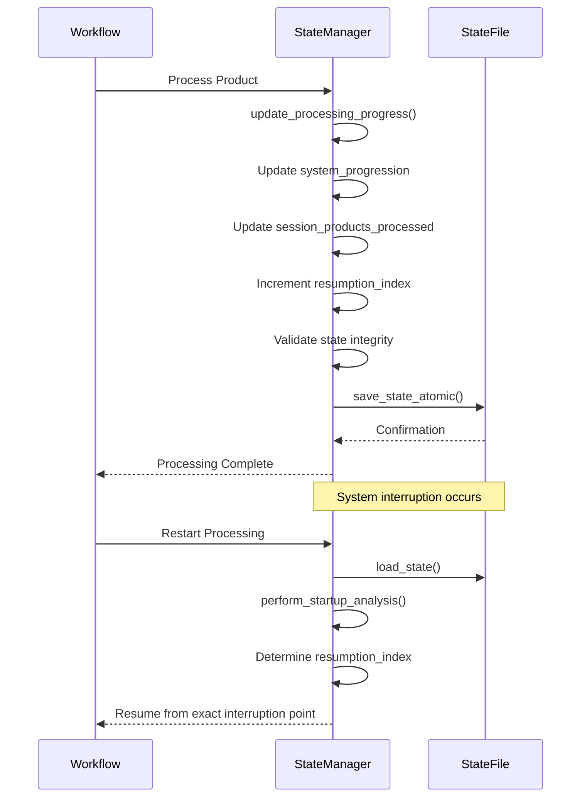
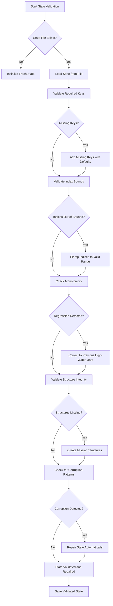

# State Management System

<cite>
**Referenced Files in This Document**   
- [fixed_enhanced_state_manager.py](file://utils/fixed_enhanced_state_manager.py)
- [poundwholesale_co_uk_processing_state.json](file://processing_states/poundwholesale_co_uk_processing_state.json)
</cite>

## Table of Contents
1. [Introduction](#introduction)
2. [Processing State File Structure](#processing-state-file-structure)
3. [Resumable Processing and Progress Tracking](#resumable-processing-and-progress-tracking)
4. [In-Memory State and Persistent Storage Integration](#in-memory-state-and-persistent-storage-integration)
5. [State Validation and Recovery](#state-validation-and-recovery)
6. [Common State Management Issues and Solutions](#common-state-management-issues-and-solutions)
7. [Performance Benefits of Sliding Window Memory Management](#performance-benefits-of-sliding-window-memory-management)
8. [Conclusion](#conclusion)

## Introduction
The FixedEnhancedStateManager is a critical component designed to maintain processing continuity across system interruptions in the Amazon FBA Agent System. This state management system ensures reliable resumable operations through a robust file-based progress tracking mechanism. The implementation addresses key challenges in state persistence, including accurate progress counting, state validation, and recovery from interruptions. By separating resumption logic from progress tracking and implementing thread-safe atomic operations, the system provides a stable foundation for long-running processing tasks. The design incorporates seven zero-risk methods to guarantee always-accurate progress counts, making it resilient to system failures and interruptions.

**Section sources**
- [fixed_enhanced_state_manager.py](file://utils/fixed_enhanced_state_manager.py#L99-L2643)

## Processing State File Structure
The processing state file serves as the persistent storage mechanism for tracking the system's progress across sessions. This JSON-based file contains comprehensive information about the current processing state, including product processing status, authentication fallbacks, and category progress. The file structure is organized into several key sections that work together to maintain accurate state information.

The state file includes a schema version identifier to ensure compatibility across system updates. It tracks the supplier name, creation timestamp, and last update time to provide context for the processing session. The core of the state file consists of counters for total products, successful products, and profitable products, along with financial metrics like total profit found. Category performance data is stored to monitor processing efficiency across different product categories.

A critical component of the state file is the gap_processing section, which tracks reverse gap detection and startup analysis completion. This section maintains category completion status with extracted and processed product counts, completion percentages, and processing status indicators (FULLY_PROCESSED, PARTIALLY_PROCESSED, or EXTRACTED_ONLY). The system_progression section contains phase-specific resumption indices for both supplier extraction and Amazon analysis phases, enabling precise resumption points.

The user_display_metrics section provides user-facing metrics that are not used for resumption logic, ensuring separation between internal state management and user interface concerns. Metadata includes version information, configuration hash, runtime settings, and system information, with specific flags indicating applied fixes and enabled features like thread safety and atomic operations.

**Diagram sources**
- [fixed_enhanced_state_manager.py](file://utils/fixed_enhanced_state_manager.py#L150-L250)

**Section sources**
- [fixed_enhanced_state_manager.py](file://utils/fixed_enhanced_state_manager.py#L150-L250)
- [poundwholesale_co_uk_processing_state.json](file://processing_states/poundwholesale_co_uk_processing_state.json)

## Resumable Processing and Progress Tracking
The FixedEnhancedStateManager implements a sophisticated resumable processing system that ensures continuity across system interruptions. The core mechanism relies on the resumption_index field, which continuously tracks the exact point where processing should resume after an interruption. Unlike traditional systems that only update resumption points at category boundaries, this implementation updates the resumption_index with every processed product, enabling precise recovery at the individual product level.

The system employs seven zero-risk methods to guarantee always-accurate progress counts. First, it separates resumption index from progress tracking, preventing conflicts between these two functions. Second, reverse gap detection is performed only during startup analysis, not on every save operation, reducing computational overhead and preventing state corruption. Third, category totals are updated with real-time scraping discoveries, ensuring that changes in product counts are immediately reflected in the state.

Fourth, the system implements thread-safe atomic operations with file locking, preventing race conditions in multi-threaded environments. Fifth, phase-specific atomic commit methods ensure that progress updates are consistent within each processing phase. Sixth, the system validates and repairs state integrity automatically, detecting and correcting impossible index states and phase semantic inconsistencies. Seventh, it implements monotonicity guards to prevent resumption pointer regression across runs.

Progress tracking is implemented through the update_processing_progress method, which simultaneously updates the system_progression counters, session metrics for user display, and the resumption_index. This coordinated update ensures that all progress indicators remain synchronized. The system also implements a sliding window approach to memory management, which limits the amount of state data kept in memory while maintaining accurate progress tracking.

The state manager provides specialized methods for different processing phases, such as update_supplier_progress_new for supplier extraction and update_amazon_analysis_progress_new for Amazon analysis. These phase-specific methods ensure that progress tracking is appropriate to the current processing context. The system also supports category-level progress tracking through methods like update_discovered_products_in_category, which updates category totals when the scraper discovers more products than initially expected.

**Diagram sources**
- [fixed_enhanced_state_manager.py](file://utils/fixed_enhanced_state_manager.py#L900-L950)

**Section sources**
- [fixed_enhanced_state_manager.py](file://utils/fixed_enhanced_state_manager.py#L900-L950)

## In-Memory State and Persistent Storage Integration
The FixedEnhancedStateManager implements a robust integration between in-memory state and persistent file storage to ensure data consistency and reliability. The system maintains an in-memory representation of the processing state in the state_data dictionary, which is synchronized with the persistent state file through atomic save operations. This integration is designed to minimize the risk of data corruption while maintaining high performance.

The state manager uses a thread-safe atomic save mechanism with file locking to prevent race conditions during state updates. The save_state method employs a re-entrant lock (threading.RLock) to ensure that multiple threads cannot simultaneously modify the state. When a save operation is requested, the system first acquires the write lock, performs the atomic save, and then releases the lock. This prevents concurrent modifications that could lead to state corruption.

For environments where threading is not available, the system provides fallback mechanisms using atomic file operations. The _perform_atomic_save method implements a comprehensive error handling strategy with multiple fallback options: thread-safe atomic writer, legacy atomic operations, WindowsSaveGuardian, and a basic temp-then-replace fallback. This layered approach ensures that state persistence works reliably across different operating systems and configurations.

The integration between in-memory and persistent storage is optimized for performance through debounced saving. The save_debounced method prevents excessive disk I/O by limiting save operations to a minimum interval (default 2.0 seconds). This reduces the performance impact of frequent state updates while still ensuring that critical progress information is persisted regularly.

The system also implements a sophisticated state initialization process. During initialization, the state manager attempts to load existing state from the persistent file. If no state file exists, it creates a fresh state with default values. When loading existing state, the system performs backward compatibility handling, merging loaded data with the initialized structure while preserving new fields. This ensures that the system can gracefully handle state files from previous versions.

A key aspect of the integration is the separation of concerns between different state components. The system_progression section serves as the single source of truth for resumption logic, while user_display_metrics contains counters for user interface purposes. This separation prevents user interface updates from interfering with critical resumption data. The gap_processing section maintains startup analysis results and category completion status, providing a comprehensive view of processing progress.

**Section sources**
- [fixed_enhanced_state_manager.py](file://utils/fixed_enhanced_state_manager.py#L1000-L1500)

## State Validation and Recovery
The FixedEnhancedStateManager implements comprehensive state validation and recovery mechanisms to ensure data integrity and system reliability. The validate_and_repair_state method performs a thorough validation of the state structure, checking for missing required keys, out-of-bounds indices, and inconsistent progress counters. When issues are detected, the system automatically repairs them and logs the repairs for audit purposes.

The validation process checks several critical aspects of the state. It ensures that required keys like resumption_index, progress_index, and total_products exist, adding them with default values if missing. It validates that the resumption_index is within bounds, correcting negative values or values that exceed the total product count. The system also verifies the existence of critical structures like gap_processing and system_progression, creating them if necessary.

A key validation feature is the cross-run monotonicity guard, which prevents resumption pointer regression across runs. The _validate_cross_run_monotonicity method compares the current resumption indices with previously recorded "high-water marks" stored in the state. If a regression is detected (e.g., category index decreasing from 8 to 7 across restarts), the system corrects the indices to maintain monotonic progression. This prevents the system from restarting processing from earlier categories, which could lead to duplicate processing or data loss.

The system implements a comprehensive state integrity validation through the validate_state_integrity method. This method performs multiple checks to detect various corruption patterns:
- Impossible index states (current index > total)
- Phase semantic consistency (preventing category fields from being overwritten with global values)
- Resumption pointer validity (ensuring pointers are within bounds)
- Frozen totals consistency (detecting mid-run configuration drift)
- Legacy writer contamination (identifying use of deprecated methods)

When corruption is detected, the repair_state_corruption method attempts to automatically repair the issues. It can repair impossible index states by clamping values to valid ranges, fix phase contamination by resetting contaminated fields, and repair invalid resumption pointers. The repair process updates the schema version and logs the repairs in the metadata, providing an audit trail of state corrections.

The system also implements startup analysis validation through the perform_startup_analysis method. This method calculates file-grounded totals by reading actual files on disk, ensuring that the state reflects the real processing progress. It detects reverse gaps (when the linking map count exceeds the cache count) and adjusts the resumption strategy accordingly. The startup analysis is performed only once per session, preventing expensive file operations during regular processing.

**Diagram sources**
- [fixed_enhanced_state_manager.py](file://utils/fixed_enhanced_state_manager.py#L500-L600)

**Section sources**
- [fixed_enhanced_state_manager.py](file://utils/fixed_enhanced_state_manager.py#L500-L600)

## Common State Management Issues and Solutions
The FixedEnhancedStateManager addresses several common state management issues that can lead to data corruption, processing inefficiencies, and system instability. These issues include state corruption, synchronization problems, reverse gap detection, and category denominator drift. The system implements targeted solutions for each of these challenges, ensuring reliable and accurate processing across system interruptions.

State corruption is prevented through multiple mechanisms. The system separates resumption logic from progress tracking by maintaining distinct resumption_index and progress_index fields. This prevents conflicts that could arise when the same counter is used for both purposes. The implementation also removes the processed_products section from the state, as linking map entries serve as the authoritative source of truth for processed products. This eliminates a potential source of inconsistency between different tracking mechanisms.

Synchronization problems in multi-threaded environments are addressed through thread-safe atomic operations. The system uses a re-entrant lock (threading.RLock) to ensure that only one thread can modify the state at a time. The atomic save operations prevent partial writes that could corrupt the state file. The system also implements a single-writer proof mechanism using a writer session UUID, which helps identify and prevent multiple writers from concurrently modifying the state.

Reverse gap detection is handled through the perform_startup_analysis method, which is executed only once at the beginning of a session. When a reverse gap is detected (linking map count > cache count), the system evaluates whether to reset the resumption index to zero or preserve the existing index based on whether a cache rebuild was explicitly requested. This prevents the system from unnecessarily restarting processing from the beginning when a reverse gap is detected.

Category denominator drift is prevented through the set_frozen_denominator and get_frozen_denominator methods. These methods ensure that category totals are frozen at category entry and remain consistent across runs. The system tracks frozen denominators per category URL (normalized) to prevent drift, and implements guards to prevent multiple freezes of the same category. This ensures that progress tracking remains accurate even when category sizes change between runs.

The system also addresses the issue of legacy writer contamination by deprecating and disabling the update_processing_index method. This method was prone to state corruption issues and has been replaced with phase-specific atomic commit methods like commit_supplier_progress and commit_amazon_progress. The system tracks legacy writer usage in the metadata and provides recommendations for migrating to the new atomic commit methods.

Another common issue is the misalignment between in-memory state and persistent storage. The system addresses this through the _perform_atomic_save method, which ensures that state updates are consistently written to disk. The method includes multiple fallback mechanisms to handle different operating system environments and potential file system issues. The debounced saving mechanism (save_debounced) reduces the frequency of disk I/O while still ensuring that critical state changes are persisted.

**Section sources**
- [fixed_enhanced_state_manager.py](file://utils/fixed_enhanced_state_manager.py#L600-L800)

## Performance Benefits of Sliding Window Memory Management
The FixedEnhancedStateManager implements a sliding window approach to memory management that significantly improves system stability and performance. This approach limits the amount of state data kept in memory while maintaining accurate progress tracking, reducing memory footprint and preventing performance degradation during long-running processing tasks.

The sliding window mechanism works in conjunction with the debounced saving strategy to optimize disk I/O operations. Instead of writing to disk after every product processing event, the system accumulates changes in memory and writes them to disk at regular intervals (default 2.0 seconds). This reduces the number of disk operations by orders of magnitude, minimizing the performance impact of state persistence. The sliding window ensures that even if the system is interrupted, no more than 2.0 seconds of processing progress is lost.

The memory management approach is particularly beneficial for processing large product catalogs, where frequent disk I/O could become a bottleneck. By batching state updates, the system maintains high processing throughput while still providing reliable resumption points. The sliding window size can be adjusted based on system requirements, allowing for a trade-off between data safety and performance.

The system's thread-safe atomic operations are optimized for the sliding window approach. The save_debounced method checks whether the minimum interval has elapsed before performing a save operation, preventing unnecessary disk I/O. This is particularly important in multi-threaded environments where multiple threads might trigger save operations simultaneously. The debouncing ensures that only one save operation occurs within the specified interval, regardless of how many threads request a save.

The sliding window approach also improves system stability by reducing the risk of file system errors. Frequent disk operations increase the likelihood of encountering file system issues, especially on network drives or systems with limited I/O capacity. By reducing the frequency of disk operations, the system becomes more resilient to these types of issues.

The performance benefits extend to startup time as well. When the system starts, it only needs to load the current state from disk once, rather than repeatedly reading and writing state data during processing. The perform_startup_analysis method calculates file-grounded totals only once at the beginning of a session, avoiding the performance penalty of recalculating these totals on every save operation.

The combination of sliding window memory management and atomic operations creates a robust foundation for long-running processing tasks. The system can process thousands of products with minimal performance impact from state persistence, while still providing reliable resumption points in case of interruptions. This makes the FixedEnhancedStateManager particularly well-suited for processing large supplier catalogs where uninterrupted operation is critical.

**Section sources**
- [fixed_enhanced_state_manager.py](file://utils/fixed_enhanced_state_manager.py#L1500-L1600)

## Conclusion
The FixedEnhancedStateManager provides a comprehensive solution for maintaining processing continuity across system interruptions in the Amazon FBA Agent System. By implementing a robust file-based progress tracking mechanism with seven zero-risk methods, the system ensures always-accurate progress counts and reliable resumption from exact interruption points. The separation of resumption logic from progress tracking, combined with thread-safe atomic operations, creates a stable foundation for long-running processing tasks.

The integration between in-memory state and persistent storage is optimized for both performance and reliability. The sliding window memory management approach reduces disk I/O while maintaining data integrity, improving system stability during extended processing sessions. Comprehensive state validation and recovery mechanisms detect and repair corruption patterns, ensuring data consistency across runs.

The system effectively addresses common state management issues such as state corruption, synchronization problems, and category denominator drift. By deprecating legacy methods and implementing phase-specific atomic commit methods, the system eliminates sources of state inconsistency. The reverse gap detection and startup analysis mechanisms ensure that the system can adapt to changes in product catalogs while maintaining accurate progress tracking.

Overall, the FixedEnhancedStateManager represents a significant advancement in state management for automated processing systems. Its combination of reliability, performance, and resilience makes it well-suited for mission-critical applications where processing continuity is essential. The design principles implemented in this system—separation of concerns, atomic operations, comprehensive validation, and optimized memory management—provide a blueprint for robust state management in complex processing workflows.