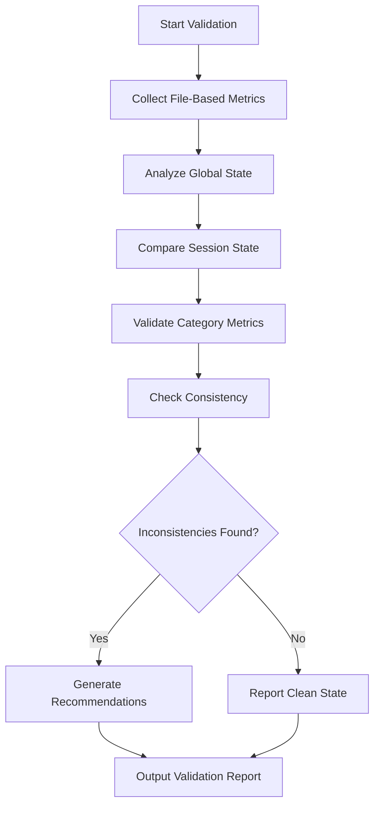
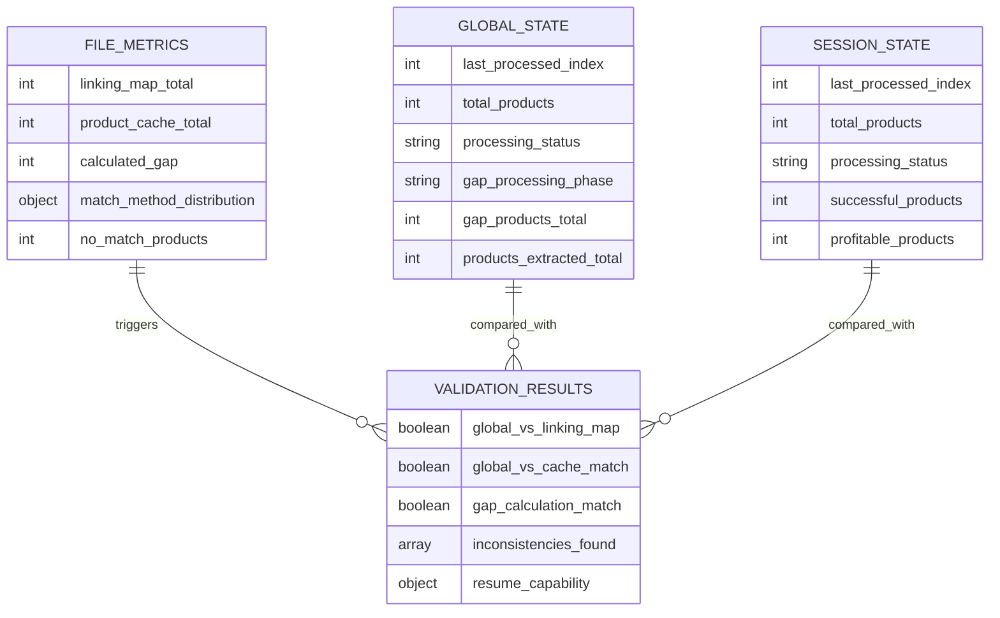
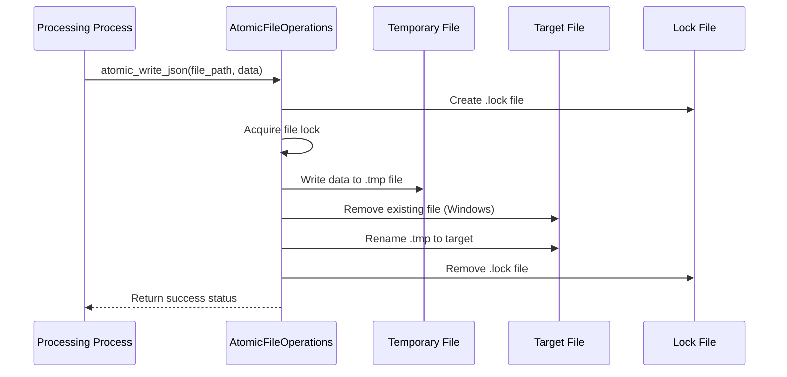
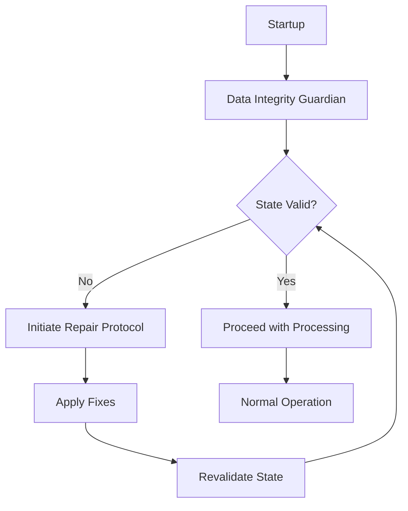
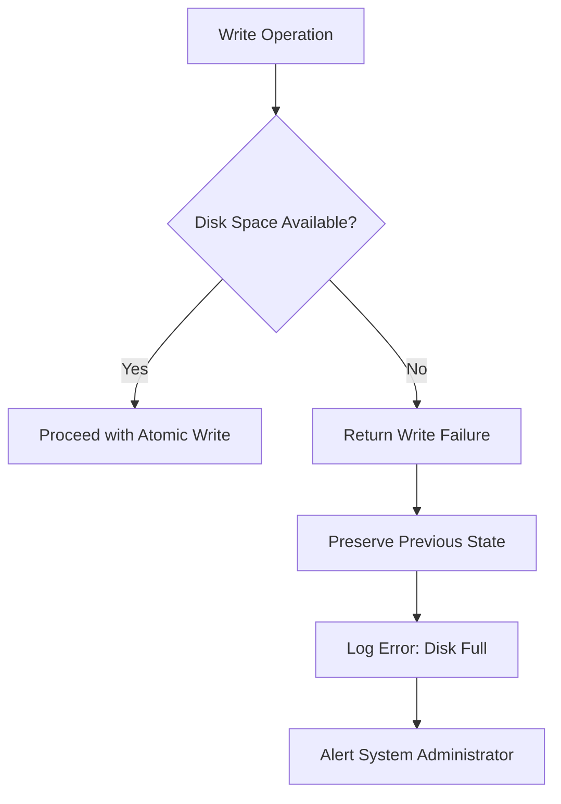
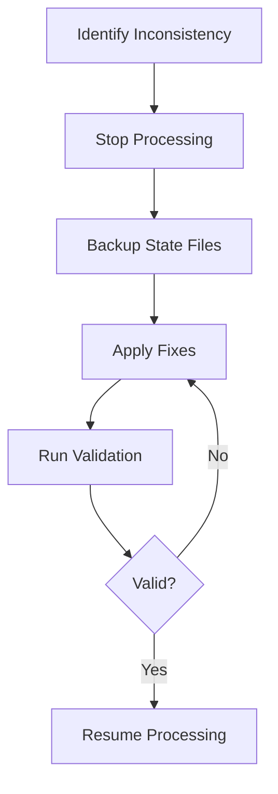

# State Validation and Integrity

<cite>
**Referenced Files in This Document**   
- [state_validation.json](file://OUTPUTS/DIAGNOSTICS/state_validation.json)
- [state_validation.md](file://OUTPUTS/DIAGNOSTICS/state_validation.md)
- [atomic_file_operations.py](file://utils/atomic_file_operations.py)
- [data_integrity_guardian.py](file://utils/data_integrity_guardian.py)
- [fixed_enhanced_state_manager.py](file://utils/fixed_enhanced_state_manager.py)
</cite>

## Table of Contents
1. [Introduction](#introduction)
2. [State Validation Framework](#state-validation-framework)
3. [Multi-Layered Integrity Verification](#multi-layered-integrity-verification)
4. [Atomic File Operations](#atomic-file-operations)
5. [Data Integrity Guardian](#data-integrity-guardian)
6. [State Corruption Forensics](#state-corruption-forensics)
7. [Validation Failure Examples](#validation-failure-examples)
8. [Manual Validation and Repair Procedures](#manual-validation-and-repair-procedures)
9. [Performance Considerations](#performance-considerations)
10. [Best Practices for Production](#best-practices-for-production)

## Introduction

The Amazon FBA Agent System employs a comprehensive state validation and integrity framework to ensure reliable operation during extended processing sessions. This document details the multi-layered approach to maintaining state file reliability, including automated validation mechanisms, atomic file operations, and integrity guardianship protocols. The system is designed to detect, prevent, and recover from state corruption incidents that could otherwise compromise data processing accuracy and continuity.

## State Validation Framework

The state validation framework provides comprehensive assessment of system state consistency through multiple validation layers. The framework generates both JSON and Markdown reports that document the current state of processing, identify inconsistencies, and provide actionable recommendations.



**Diagram sources**
- [state_validation.json](file://OUTPUTS/DIAGNOSTICS/state_validation.json)
- [state_validation.md](file://OUTPUTS/DIAGNOSTICS/state_validation.md)

**Section sources**
- [state_validation.json](file://OUTPUTS/DIAGNOSTICS/state_validation.json)
- [state_validation.md](file://OUTPUTS/DIAGNOSTICS/state_validation.md)

## Multi-Layered Integrity Verification

The system implements a multi-layered approach to state validation, examining consistency across different dimensions of the processing state. This comprehensive verification ensures that all components of the system maintain data integrity throughout the processing lifecycle.

### Validation Layers

The validation process examines three primary layers of state information:

1. **File-based metrics**: Ground truth derived from actual file contents
2. **Global state metrics**: System-wide processing state
3. **Session state metrics**: Current session-specific state



**Diagram sources**
- [state_validation.json](file://OUTPUTS/DIAGNOSTICS/state_validation.json)
- [state_validation.md](file://OUTPUTS/DIAGNOSTICS/state_validation.md)

**Section sources**
- [state_validation.json](file://OUTPUTS/DIAGNOSTICS/state_validation.json)
- [state_validation.md](file://OUTPUTS/DIAGNOSTICS/state_validation.md)

### Consistency Checks

The validation framework performs several critical consistency checks to identify state corruption:

- **Global vs. linking map consistency**: Ensures the global state's total products matches the linking map count
- **Global vs. cache consistency**: Verifies that the global state matches the actual cache length
- **Gap calculation consistency**: Confirms that the reported gap matches the calculated gap

When inconsistencies are detected, the system generates specific recommendations for resolution, such as updating the global state to match actual file counts or initializing gap processing with the correct gap count.

## Atomic File Operations

The atomic_file_operations.py module provides thread-safe, atomic file operations with cross-platform file locking to prevent partial writes during system failures. This ensures that state files are either completely written or not written at all, maintaining data integrity.

### Atomic Write Process



**Diagram sources**
- [atomic_file_operations.py](file://utils/atomic_file_operations.py)

**Section sources**
- [atomic_file_operations.py](file://utils/atomic_file_operations.py)

### Key Features

The atomic file operations implementation includes several critical features:

- **Cross-platform file locking**: Uses platform-appropriate locking mechanisms (msvcrt on Windows, fcntl on Unix)
- **Temporary file strategy**: Writes to a temporary file first, then atomically replaces the target
- **Thread safety**: Implements re-entrant locks to prevent deadlocks in multi-threaded environments
- **Error recovery**: Cleans up temporary files on write failures
- **JSON validation**: Includes integrity checks for JSON file validity

The module provides both class-based and module-level functions for atomic operations, allowing flexible integration throughout the system.

## Data Integrity Guardian

The data_integrity_guardian.py module serves as a mandatory startup reconciliation system that ensures data consistency before any resume calculations or filtering operations. This guardian acts as a gatekeeper, preventing the system from proceeding with potentially corrupted state data.

### Guardian Responsibilities

The Data Integrity Guardian has several critical responsibilities:

1. **Mandatory startup reconciliation**: Performs comprehensive state analysis before processing begins
2. **Data consistency enforcement**: Ensures all state components are synchronized
3. **Resume capability verification**: Validates that the system can safely resume from the current state
4. **Anomaly detection**: Monitors for unusual patterns that may indicate state corruption



**Diagram sources**
- [data_integrity_guardian.py](file://utils/data_integrity_guardian.py)

**Section sources**
- [data_integrity_guardian.py](file://utils/data_integrity_guardian.py)

## State Corruption Forensics

The system maintains detailed forensic analysis of state corruption incidents through the state_validation.json and state_validation.md files. These files document specific instances of state inconsistency and their resolutions, providing valuable insights for system improvement.

### Case Study: Gap Processing Inconsistency

A recent validation report revealed critical inconsistencies in the state management system:

```json
{
  "inconsistencies_found": [
    "Global state total_products (2337) != cache length (2369)",
    "Global gap reported (0) != calculated gap (728)"
  ],
  "recommendations": [
    "Fix state inconsistencies before resuming processing",
    "Verify gap processing calculations",
    "Update global state to match actual file counts",
    "Initialize gap processing with correct gap count"
  ]
}
```

This case demonstrates a scenario where the global state's total products count (2,337) did not match the actual cache length (2,369), and the reported gap (0) differed significantly from the calculated gap (728). Such discrepancies could lead to incomplete processing or duplicate work if not detected and corrected.

### Root Cause Analysis

The forensic analysis identified several contributing factors to state corruption:

- **Race conditions**: Multiple processes attempting to update state simultaneously
- **Incomplete writes**: System failures during state file updates
- **Logic errors**: Incorrect gap calculation algorithms
- **Timing issues**: State updates occurring out of sequence

The system's validation framework successfully detected these issues before they could compromise processing integrity.

## Validation Failure Examples

The system has encountered various validation failures, each with distinct root causes and resolution strategies.

### Disk Full Error

When storage capacity is exhausted, the atomic write operations fail, preventing partial state updates:



This failure mode is handled gracefully by maintaining the previous valid state and alerting administrators to the storage issue.

### Permission Issues

File permission problems, particularly on Windows systems, can prevent state updates:

- **Access denied errors**: Occur when another process has locked the file
- **Insufficient privileges**: The application lacks write permissions to the state directory
- **Antivirus interference**: Security software blocking file operations

The atomic file operations module implements multiple fallback strategies to overcome these issues, including alternative temporary directories and retry mechanisms with exponential backoff.

## Manual Validation and Repair Procedures

When automated systems fail to resolve state inconsistencies, manual intervention may be required. The following procedures guide administrators through the validation and repair process.

### Manual Validation Steps

1. **Examine validation reports**: Review state_validation.json and state_validation.md for specific inconsistencies
2. **Verify file integrity**: Check that all state files are complete and not corrupted
3. **Compare file counts**: Validate that linking map, cache, and state file counts align
4. **Check processing progress**: Confirm that resumption indices match expected values

### Repair Protocol

When inconsistencies are identified, follow this repair protocol:

1. **Stop processing**: Halt all system operations to prevent further state changes
2. **Backup current state**: Create a backup of all state files before making changes
3. **Apply recommended fixes**: Implement the specific recommendations from the validation report
4. **Revalidate state**: Run the validation framework again to confirm resolution
5. **Resume processing**: Restart the system once state integrity is confirmed



**Section sources**
- [state_validation.json](file://OUTPUTS/DIAGNOSTICS/state_validation.json)
- [state_validation.md](file://OUTPUTS/DIAGNOSTICS/state_validation.md)

## Performance Considerations

The state validation system balances thoroughness with execution speed, recognizing that excessive validation can impact overall processing performance.

### Validation Frequency

The system employs a tiered validation strategy based on processing phase:

- **Startup**: Comprehensive validation to ensure clean state
- **Runtime**: Lightweight, targeted validation at key checkpoints
- **Completion**: Full validation to confirm processing integrity

This approach minimizes performance overhead while maintaining appropriate integrity checks throughout the processing lifecycle.

### Trade-offs

The validation framework navigates several key trade-offs:

| Consideration | Thorough Approach | Lightweight Approach | System Choice |
|---------------|-------------------|----------------------|---------------|
| **Validation Depth** | Full file analysis | Key metric checks | Adaptive based on phase |
| **Execution Frequency** | Continuous monitoring | Periodic checks | Phase-based scheduling |
| **Resource Usage** | High CPU/memory | Low resource impact | Optimized for production |
| **Detection Speed** | Immediate detection | Delayed detection | Balanced with performance |

The system prioritizes startup and completion validation for thoroughness, while using more targeted checks during runtime to minimize performance impact.

## Best Practices for Production

To maintain state integrity in production environments, adhere to the following best practices:

### Preventive Measures

- **Regular monitoring**: Implement continuous monitoring of state file health
- **Adequate storage**: Ensure sufficient disk space with automated alerts for low capacity
- **Permission management**: Configure appropriate file permissions for state directories
- **Backup strategy**: Implement regular backups of critical state files

### Operational Guidelines

- **Validation before resume**: Always run state validation before resuming interrupted processing
- **Atomic operations**: Use atomic file operations for all state updates
- **Guardian activation**: Ensure the Data Integrity Guardian runs at startup
- **Error logging**: Maintain comprehensive logs of validation results and repair actions

### Recovery Preparedness

- **Documented procedures**: Maintain up-to-date documentation of manual repair procedures
- **Tested backups**: Regularly test backup restoration procedures
- **Incident response**: Establish clear protocols for responding to state corruption incidents
- **Root cause analysis**: Conduct thorough analysis of each incident to prevent recurrence

By following these best practices, organizations can ensure the reliability and integrity of their Amazon FBA processing system, minimizing the risk of data loss or processing errors.