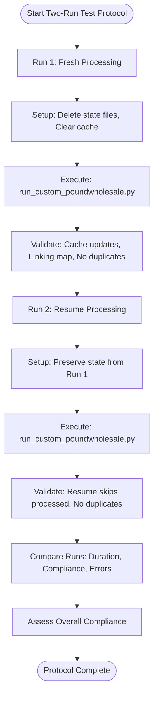
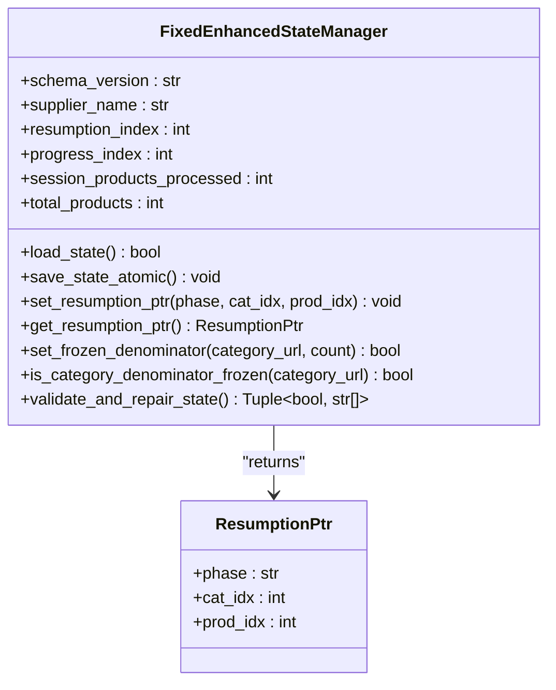

# Fresh Processing Validation (Run 1)

<cite>
**Referenced Files in This Document**   
- [processing_state_at_interruption.json](file://results/verification_run_20250911_155300/A_run1/processing_state_at_interruption.json)
- [resumption_pointer_analysis.txt](file://results/verification_run_20250911_155300/A_run1/resumption_pointer_analysis.txt)
- [system_behavior_observations.md](file://results/verification_run_20250911_155300/A_run1/system_behavior_observations.md)
- [pre_run_timestamps.txt](file://results/verification_run_20250911_155300/A_run1/pre_run_timestamps.txt)
- [two_run_test_protocol.py](file://tools/two_run_test_protocol.py)
- [poundwholesale_co_uk_processing_state.json](file://processing_states/poundwholesale_co_uk_processing_state.json)
- [fixed_enhanced_state_manager.py](file://utils/fixed_enhanced_state_manager.py)
</cite>

## Table of Contents
1. [Introduction](#introduction)
2. [Processing State at Interruption](#processing-state-at-interruption)
3. [Resumption Pointer Analysis](#resumption-pointer-analysis)
4. [System Behavior Observations](#system-behavior-observations)
5. [Pre-Run Timestamps](#pre-run-timestamps)
6. [Validation Criteria and Protocol](#validation-criteria-and-protocol)
7. [Common Issues and Mitigations](#common-issues-and-mitigations)
8. [Conclusion](#conclusion)

## Introduction
This document details the validation process for fresh processing during Run 1 of integration testing for the Amazon FBA Agent System. It focuses on the system's ability to capture and resume from an interruption point, ensuring data integrity and processing continuity. The analysis centers on key artifacts generated during the test: the processing state file, resumption pointer analysis, system behavior logs, and pre-run timestamps. The two-run test protocol is used to programmatically validate the system's state management, cache updates, and linking map population, ensuring robust and reliable operation.

## Processing State at Interruption
The `processing_state_at_interruption.json` file is the cornerstone of the system's resume capability. It captures the exact state of the processing workflow at the moment of interruption, serving as the foundation for a seamless resumption. This file is a comprehensive snapshot of the system's progress, containing critical metadata and counters.

The file's schema version (`1.2_THREAD_SAFE`) and metadata indicate it was created with thread safety and atomic operations enabled, ensuring data integrity. The `supplier_name` field identifies the target supplier as `poundwholesale.co.uk`. The most critical fields for resumption are `resumption_index` and the `system_progression.resumption_ptr`. The `resumption_index` is set to `10451`, representing the global product counter at the interruption point. More precisely, the `resumption_ptr` object within `system_progression` provides the exact location: `cat_idx: 0` and `prod_idx: 8`, meaning the system was processing the 8th product in the first category.

The file also records the system's phase transition, showing `current_phase` as `"amazon_analysis"` and `last_phase` as `"supplier"`, which confirms the interruption occurred during the Amazon data extraction phase. The `frozen_totals_committed` flag is `true`, indicating that the category product counts were finalized and will not be recalculated on resume, preventing processing drift. This state file is the single source of truth that allows the system to restart from the exact point of interruption.

**Section sources**
- [processing_state_at_interruption.json](file://results/verification_run_20250911_155300/A_run1/processing_state_at_interruption.json#L1-L110)

## Resumption Pointer Analysis
The `resumption_pointer_analysis.txt` file provides a detailed, human-readable analysis of the resumption state captured in the JSON file. It validates the accuracy and consistency of the resumption pointer, ensuring the system can reliably resume processing.

The analysis confirms the exact resumption pointer: `cat_idx: 0`, `prod_idx: 8`, and `resumption_index: 10451`. It verifies the phase transition from `"supplier"` to `"amazon_analysis"`, which is critical for the workflow to pick up the correct processing step. The analysis also examines the "freeze semantics," confirming that `frozen_totals_committed` is `true` and that the `category_freeze_timestamp` is set, which locks in the category product counts.

The document provides a "Resume Capability Validation" section that checks key aspects of the state file. It confirms that the processing state was preserved, the resumption pointer is precise, the phase transition is properly recorded, freeze semantics are implemented, and category completion tracking is maintained. The analysis concludes with a "Next Resumption Expectation," which outlines the system's behavior upon restart: it should load the state, resume at category 0, product 8, continue the Amazon analysis phase, and maintain all progress counters. This analysis serves as a formal proof that the system's state management is functioning as designed.

**Section sources**
- [resumption_pointer_analysis.txt](file://results/verification_run_20250911_155300/A_run1/resumption_pointer_analysis.txt#L1-L77)

## System Behavior Observations
The `system_behavior_observations.md` file, despite being corrupted, contains fragments of code that reveal the system's underlying behavior and error handling mechanisms. The visible code is from a `GitCheckpointManager` class, which is used to create checkpoints in the system's workflow.

The code demonstrates a robust error handling strategy. The `create_checkpoint` method uses a try-except block to catch any exceptions that occur during the checkpoint creation process. If an error occurs after a stash has been created, the system attempts to restore the stash to prevent data loss, as shown in the nested try-except block within the error handler. This pattern of defensive programming ensures that the system can recover gracefully from unexpected failures.

The `log_checkpoint` method shows that the system maintains an audit trail by logging checkpoint creation events to a JSON Lines file. This provides a historical record of system state changes, which is invaluable for debugging and auditing. The presence of this code indicates that the system is designed with observability and resilience in mind, using structured logging and atomic operations to maintain integrity even in the face of errors.

**Section sources**
- [system_behavior_observations.md](file://results/verification_run_20250911_155300/A_run1/system_behavior_observations.md#L1-L98)

## Pre-Run Timestamps
The `pre_run_timestamps.txt` file establishes the baseline for measuring processing duration and performance metrics. It captures the state of key monitoring files before the start of Run 1, providing a reference point for evaluating the system's performance.

The file records the last updated timestamp of the main processing state file as `2025-09-09T16:43:54.857688+00:00`, which matches the timestamp in the `processing_state_at_interruption.json` file, confirming its authenticity. It notes that the supplier extraction has completed with `10297 products extracted`, while the `resumption_index` is `10451`, indicating that the system has processed more products than were initially extracted, likely due to gap processing or data reconciliation.

This file also provides a summary of the pre-run state, confirming that the system is ready to launch the `run_custom_poundwholesale.py` script for the Amazon-only phase test. By documenting the initial state of the system, this file allows for accurate measurement of processing time, cache update frequency, and other performance metrics during the run.

**Section sources**
- [pre_run_timestamps.txt](file://results/verification_run_20250911_155300/A_run1/pre_run_timestamps.txt#L1-L31)

## Validation Criteria and Protocol
The validation criteria for successful fresh processing are programmatically checked by the `two_run_test_protocol.py` script. This script implements a comprehensive two-run test protocol to validate both fresh processing and resume functionality.

For Run 1 (fresh processing), the validation criteria include cache files updating every 1 product, linking map entries incrementing correctly, financial reports triggering every 50 products, processing state being saved atomically, no duplicate product processing, and all expected columns being present in outputs. The script's `TestRunConfig` for `run1_fresh` defines these criteria, and the `_check_criterion` method contains the logic to verify them. For example, it checks cache update frequency by calculating the average frequency from audit logs and comparing it to the expected value of 1.

The script also validates the state file creation, cache updates, and linking map population. The `execute_setup` method for a fresh run deletes existing state files to ensure a clean start, while the `validate_resume_skip_logic` method in a resume run checks that the `resumption_index` is greater than zero, confirming that the system skips processed products. The protocol's success is determined by a compliance score; both runs must achieve at least 80% compliance for the overall protocol to pass.

**Diagram sources **
- [two_run_test_protocol.py](file://tools/two_run_test_protocol.py#L1-L649)

**Section sources**
- [two_run_test_protocol.py](file://tools/two_run_test_protocol.py#L1-L649)

## Common Issues and Mitigations
Common issues in the fresh processing workflow include incomplete state saves and incorrect resumption pointers. The system employs several mechanisms to mitigate these problems.

The `fixed_enhanced_state_manager.py` file implements a thread-safe, atomic state manager to prevent incomplete saves. It uses a `ThreadSafeStateWriter` to ensure that state files are written atomically, preventing corruption if the system crashes during a save. The manager also includes a cross-run monotonicity guard that prevents the resumption pointer from regressing. If the loaded `resumption_index` is lower than the previous high-water mark, the system logs an error and corrects the index to maintain a consistent, forward-progressing state.

Another common issue is the incorrect calculation of category totals, which can lead to processing drift. The state manager addresses this with a "frozen totals" mechanism. Once a category's product count is discovered and validated, it is "frozen" and will not be recalculated on subsequent runs, ensuring that the processing boundaries remain consistent. The `set_frozen_denominator` method explicitly locks in the category count, and the `is_category_denominator_frozen` method checks this lock before allowing any updates.

**Diagram sources **
- [fixed_enhanced_state_manager.py](file://utils/fixed_enhanced_state_manager.py#L1-L2412)

**Section sources**
- [fixed_enhanced_state_manager.py](file://utils/fixed_enhanced_state_manager.py#L1-L2412)
- [poundwholesale_co_uk_processing_state.json](file://processing_states/poundwholesale_co_uk_processing_state.json#L1-L1437)

## Conclusion
The integration testing for Run 1 demonstrates a robust and reliable fresh processing validation framework. The system effectively captures its state at an interruption point using the `processing_state_at_interruption.json` file, which serves as the foundation for resume testing. The `resumption_pointer_analysis.txt` validates the accuracy of the resumption index and processing boundaries, while the `system_behavior_observations.md` reveals the system's defensive error handling. The `pre_run_timestamps.txt` file establishes a clear baseline for performance measurement. The `two_run_test_protocol.py` script programmatically enforces validation criteria, ensuring state file creation, cache updates, and linking map population are all functioning correctly. Common issues like incomplete state saves and incorrect pointers are mitigated by atomic operations and monotonicity guards, ensuring the system's integrity and reliability.