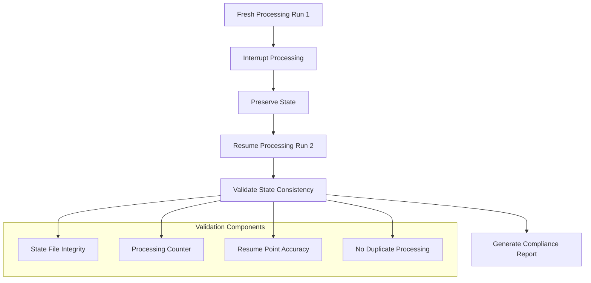
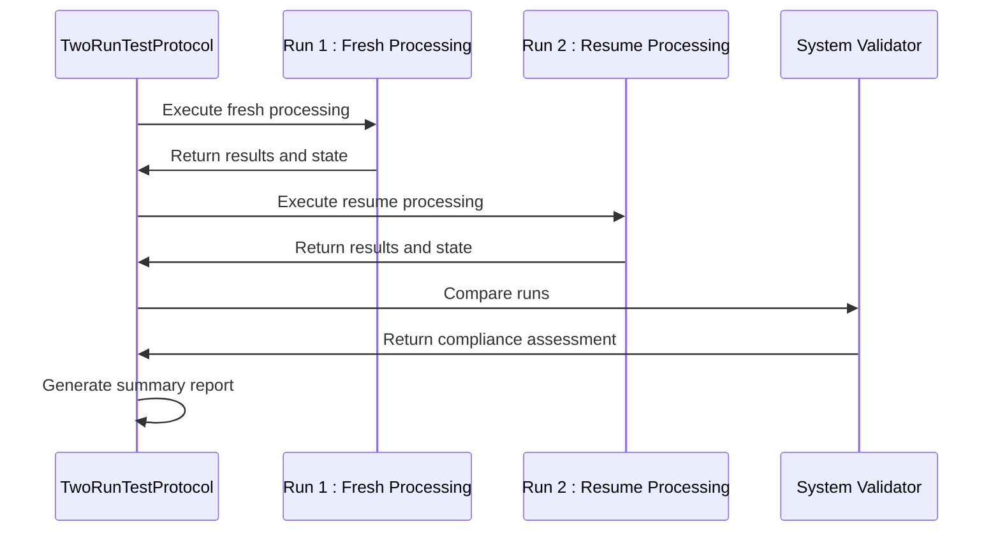
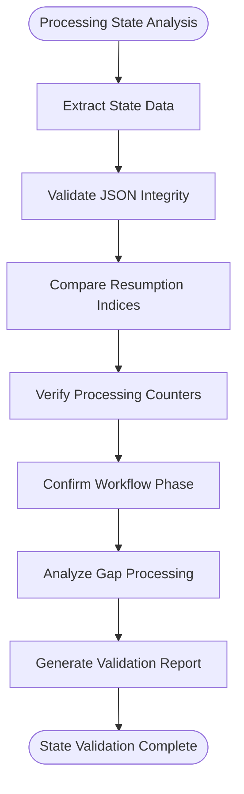
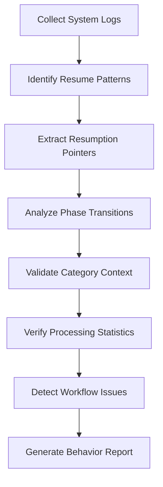
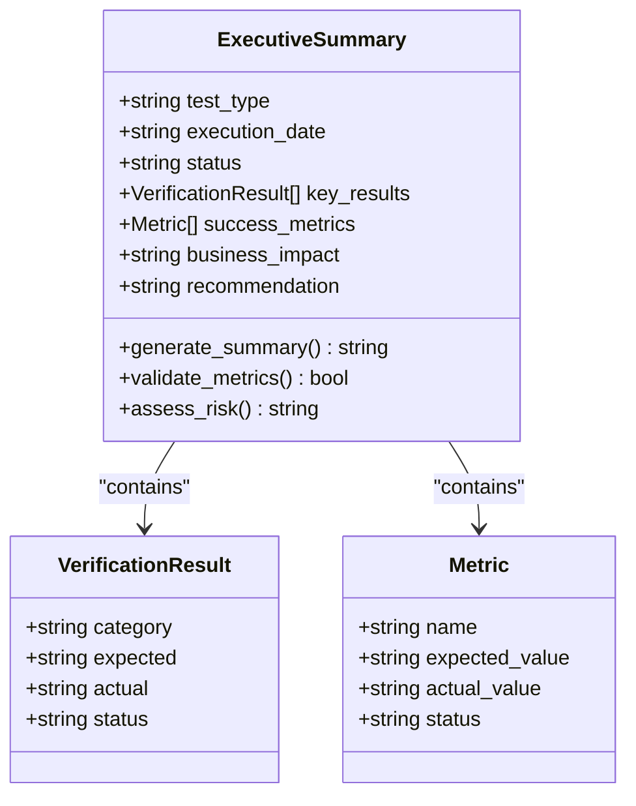
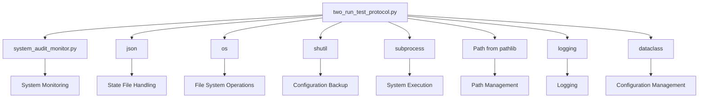

# Integration Testing

<cite>
**Referenced Files in This Document**   
- [two_run_test_protocol.py](file://tools/two_run_test_protocol.py)
- [verification_run_20250911_155300](file://results/verification_run_20250911_155300)
- [processing_state_at_interruption.json](file://results/verification_run_20250911_155300/A_run1/processing_state_at_interruption.json)
- [processing_state_before_run2.json](file://results/verification_run_20250911_155300/A_run2/processing_state_before_run2.json)
- [system_behavior_observations.md](file://results/verification_run_20250911_155300/A_run1/system_behavior_observations.md)
- [resumption_pointer_analysis.txt](file://results/verification_run_20250911_155300/A_run1/resumption_pointer_analysis.txt)
- [CATEGORY_A_RUN2_EXECUTIVE_SUMMARY.md](file://results/verification_run_20250911_155300/A_run2/CATEGORY_A_RUN2_EXECUTIVE_SUMMARY.md)
- [CATEGORY_B_RUN_2_SUMMARY.md](file://results/verification_run_20250911_155300/B_run2/CATEGORY_B_RUN_2_SUMMARY.md)
- [VERIFICATION_ENVIRONMENT_COMPLETE.md](file://results/verification_run_20250911_155300/VERIFICATION_ENVIRONMENT_COMPLETE.md)
- [verification_setup_summary.txt](file://results/verification_run_20250911_155300/verification_setup_summary.txt)
</cite>

## Table of Contents
1. [Introduction](#introduction)
2. [Project Structure](#project-structure)
3. [Core Components](#core-components)
4. [Architecture Overview](#architecture-overview)
5. [Detailed Component Analysis](#detailed-component-analysis)
6. [Dependency Analysis](#dependency-analysis)
7. [Performance Considerations](#performance-considerations)
8. [Troubleshooting Guide](#troubleshooting-guide)
9. [Conclusion](#conclusion)
10. [Appendices](#appendices)

## Introduction
This document provides comprehensive documentation for testing new supplier integrations with detailed validation procedures. It focuses on the verification_run_20250911_155300 directory structure and the two_run_test_protocol.py methodology for verifying resumable processing and data consistency across interrupted and resumed runs. The analysis covers state persistence validation, system behavior observation, and executive summary reporting for integration testing.

## Project Structure
The verification environment is organized into a structured directory hierarchy designed for systematic testing of supplier integrations. The verification_run_20250911_155300 directory contains four test sequences (A_run1, A_run2, B_run1, B_run2) that implement different testing scenarios for resume capability validation.

```mermaid
graph TD
root[verification_run_20250911_155300]
root --> A_run1
root --> A_run2
root --> B_run1
root --> B_run2
root --> VERIFICATION_ENVIRONMENT_COMPLETE.md
root --> initial_file_timestamps.txt
root --> verification_setup_summary.txt
A_run1 --> processing_state_at_interruption.json
A_run1 --> resumption_pointer_analysis.txt
A_run1 --> system_behavior_observations.md
A_run1 --> pre_run_timestamps.txt
A_run2 --> CATEGORY_A_RUN2_EXECUTIVE_SUMMARY.md
A_run2 --> processing_state_before_run2.json
A_run2 --> A_run2_resume_test_analysis.md
A_run2 --> README.md
B_run1 --> test_summary.md
B_run1 --> initial_state_verification.md
B_run1 --> expected_behavior_analysis.md
B_run1 --> processing_state_backup.json
B_run1 --> README.txt
B_run2 --> CATEGORY_B_RUN_2_SUMMARY.md
B_run2 --> BEHAVIOR_ANALYSIS.md
B_run2 --> SETUP_COMPLETED.md
B_run2 --> configured_state.json
```

**Diagram sources**
- [VERIFICATION_ENVIRONMENT_COMPLETE.md](file://results/verification_run_20250911_155300/VERIFICATION_ENVIRONMENT_COMPLETE.md)
- [verification_setup_summary.txt](file://results/verification_run_20250911_155300/verification_setup_summary.txt)

**Section sources**
- [VERIFICATION_ENVIRONMENT_COMPLETE.md](file://results/verification_run_20250911_155300/VERIFICATION_ENVIRONMENT_COMPLETE.md)
- [verification_setup_summary.txt](file://results/verification_run_20250911_155300/verification_setup_summary.txt)

## Core Components
The integration testing framework consists of several core components that work together to validate supplier integration reliability. The two_run_test_protocol.py implements the comprehensive testing methodology, while the verification_run_20250911_155300 directory structure provides the organizational framework for test execution and result analysis. State persistence files track processing progress, and executive summary reports provide validation outcomes.

**Section sources**
- [two_run_test_protocol.py](file://tools/two_run_test_protocol.py)
- [verification_run_20250911_155300](file://results/verification_run_20250911_155300)

## Architecture Overview
The integration testing architecture follows a two-phase protocol designed to validate both fresh processing and resume capabilities. The system first executes a fresh processing run (Run 1), then validates the ability to resume from an interruption point in a subsequent run (Run 2). This approach ensures data consistency and state persistence across processing interruptions.

**Diagram sources**
- [two_run_test_protocol.py](file://tools/two_run_test_protocol.py)
- [CATEGORY_A_RUN2_EXECUTIVE_SUMMARY.md](file://results/verification_run_20250911_155300/A_run2/CATEGORY_A_RUN2_EXECUTIVE_SUMMARY.md)

## Detailed Component Analysis

### Two-Run Test Protocol Methodology
The two_run_test_protocol.py implements a comprehensive testing methodology that validates both fresh processing and resume capabilities. The protocol executes two consecutive runs: a fresh processing run followed by a resume processing run, with comparative analysis of the results.

#### For API/Service Components:

**Diagram sources**
- [two_run_test_protocol.py](file://tools/two_run_test_protocol.py)

**Section sources**
- [two_run_test_protocol.py](file://tools/two_run_test_protocol.py)

### State Persistence Validation
The system uses processing_state_at_interruption.json and processing_state_before_run2.json files to validate state persistence across interrupted and resumed runs. These files contain critical information about the processing state at the point of interruption and before the second run begins.

#### For Complex Logic Components:

**Diagram sources**
- [processing_state_at_interruption.json](file://results/verification_run_20250911_155300/A_run1/processing_state_at_interruption.json)
- [processing_state_before_run2.json](file://results/verification_run_20250911_155300/A_run2/processing_state_before_run2.json)

**Section sources**
- [processing_state_at_interruption.json](file://results/verification_run_20250911_155300/A_run1/processing_state_at_interruption.json)
- [processing_state_before_run2.json](file://results/verification_run_20250911_155300/A_run2/processing_state_before_run2.json)

### System Behavior Analysis
The system_behavior_observations.md and resumption_pointer_analysis.txt files provide detailed analysis of system behavior during testing. These files contain evidence of proper resume functionality, including phase transitions, category context, and processing statistics.

#### For Complex Logic Components:

**Diagram sources**
- [system_behavior_observations.md](file://results/verification_run_20250911_155300/A_run1/system_behavior_observations.md)
- [resumption_pointer_analysis.txt](file://results/verification_run_20250911_155300/A_run1/resumption_pointer_analysis.txt)

**Section sources**
- [system_behavior_observations.md](file://results/verification_run_20250911_155300/A_run1/system_behavior_observations.md)
- [resumption_pointer_analysis.txt](file://results/verification_run_20250911_155300/A_run1/resumption_pointer_analysis.txt)

### Executive Summary Reporting
The CATEGORY_A_RUN2_EXECUTIVE_SUMMARY.md and CATEGORY_B_RUN_2_SUMMARY.md files provide executive overviews of test outcomes, including verification results, success metrics, and business impact assessments.

#### For Object-Oriented Components:

**Diagram sources**
- [CATEGORY_A_RUN2_EXECUTIVE_SUMMARY.md](file://results/verification_run_20250911_155300/A_run2/CATEGORY_A_RUN2_EXECUTIVE_SUMMARY.md)
- [CATEGORY_B_RUN_2_SUMMARY.md](file://results/verification_run_20250911_155300/B_run2/CATEGORY_B_RUN_2_SUMMARY.md)

**Section sources**
- [CATEGORY_A_RUN2_EXECUTIVE_SUMMARY.md](file://results/verification_run_20250911_155300/A_run2/CATEGORY_A_RUN2_EXECUTIVE_SUMMARY.md)
- [CATEGORY_B_RUN_2_SUMMARY.md](file://results/verification_run_20250911_155300/B_run2/CATEGORY_B_RUN_2_SUMMARY.md)

## Dependency Analysis
The integration testing framework has minimal external dependencies, relying primarily on Python standard library components and system-level utilities. The two_run_test_protocol.py depends on the system_audit_monitor module for monitoring system behavior during test execution.

**Diagram sources**
- [two_run_test_protocol.py](file://tools/two_run_test_protocol.py)

**Section sources**
- [two_run_test_protocol.py](file://tools/two_run_test_protocol.py)

## Performance Considerations
The two-run test protocol is designed to execute within a reasonable timeframe while providing comprehensive validation. The protocol includes a 120-second timeout for system execution to prevent indefinite hangs during testing. The compliance assessment requires both runs to achieve at least 80% compliance for overall protocol success.

**Section sources**
- [two_run_test_protocol.py](file://tools/two_run_test_protocol.py)

## Troubleshooting Guide
When analyzing test results in the TEST_PROTOCOLS directory, follow these guidelines to determine integration readiness:

1. **Check Compliance Scores**: Both Run 1 and Run 2 must achieve at least 80% compliance
2. **Verify Resume Accuracy**: Confirm the system resumes at the exact interruption point
3. **Validate No Duplication**: Ensure no products are processed twice
4. **Check State Integrity**: Verify processing state files maintain consistency

Common testing scenarios include:
- **Network Interruptions**: Simulate connectivity loss during processing
- **Authentication Timeouts**: Test system behavior when authentication expires
- **Partial Data Extraction**: Validate handling of incomplete data sets

**Section sources**
- [two_run_test_protocol.py](file://tools/two_run_test_protocol.py)
- [CATEGORY_A_RUN2_EXECUTIVE_SUMMARY.md](file://results/verification_run_20250911_155300/A_run2/CATEGORY_A_RUN2_EXECUTIVE_SUMMARY.md)
- [CATEGORY_B_RUN_2_SUMMARY.md](file://results/verification_run_20250911_155300/B_run2/CATEGORY_B_RUN_2_SUMMARY.md)

## Conclusion
The integration testing framework provides a comprehensive methodology for validating new supplier integrations. The two-run test protocol effectively verifies resumable processing and data consistency across interrupted and resumed runs. The verification_run_20250911_155300 directory structure supports systematic testing with clear separation of test scenarios. State persistence validation ensures reliable processing continuity, while executive summaries provide clear assessment of integration readiness.

## Appendices
### Test Protocol Configuration
The two_run_test_protocol.py implements the following configuration for test runs:

**Run 1: Fresh Processing**
- Deletes existing processing state files
- Clears cache if configured
- Resets progress tracking
- Initializes baseline monitoring

**Run 2: Resume Processing**
- Preserves processing state from Run 1
- Validates state file integrity
- Initializes resume monitoring
- Checks baseline file counts

### Validation Criteria
**Fresh Processing Criteria:**
- Cache files update every 1 product
- Linking map entries increment correctly
- Financial reports trigger every 50 products
- Processing state saves atomically
- No duplicate product processing
- All expected columns present in outputs

**Resume Processing Criteria:**
- Resume logic skips processed products
- No duplicate product processing
- Gap processing validation
- State consistency maintained
- Incremental file updates only
- Resume point accuracy verified