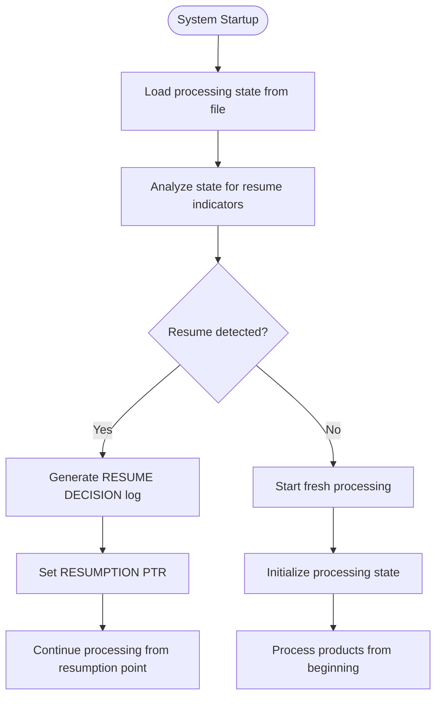
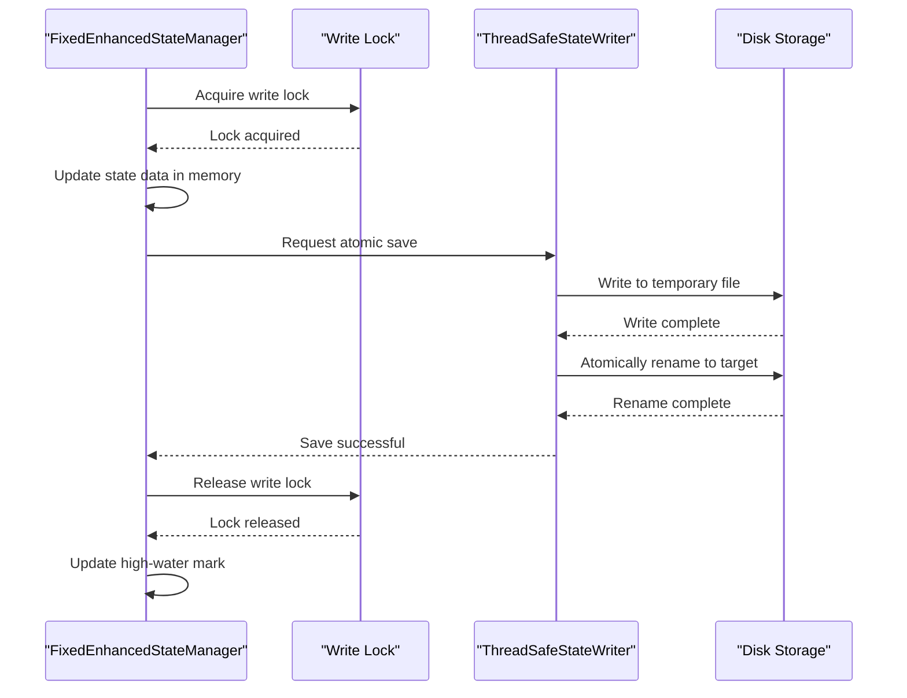
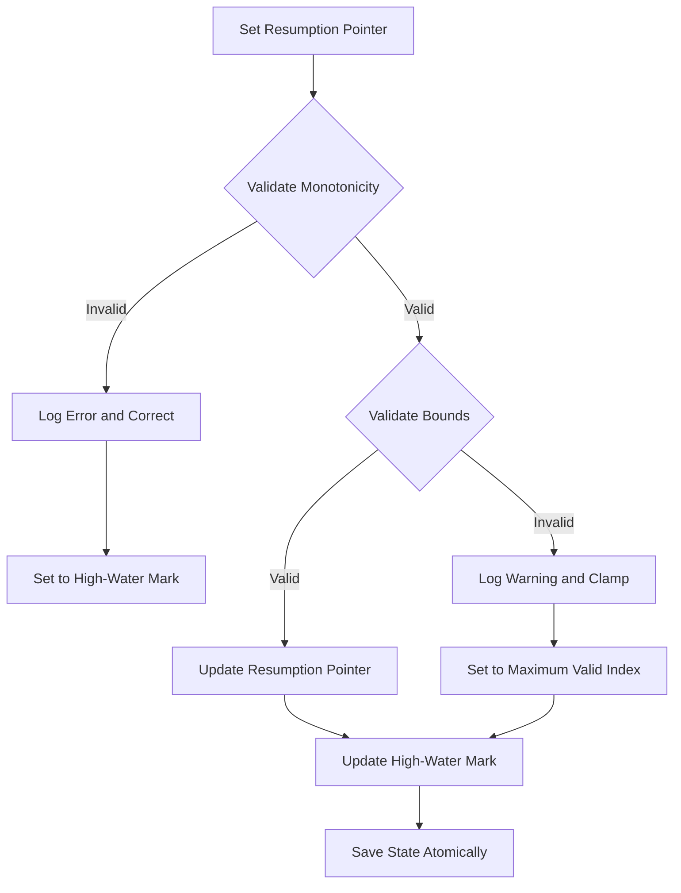
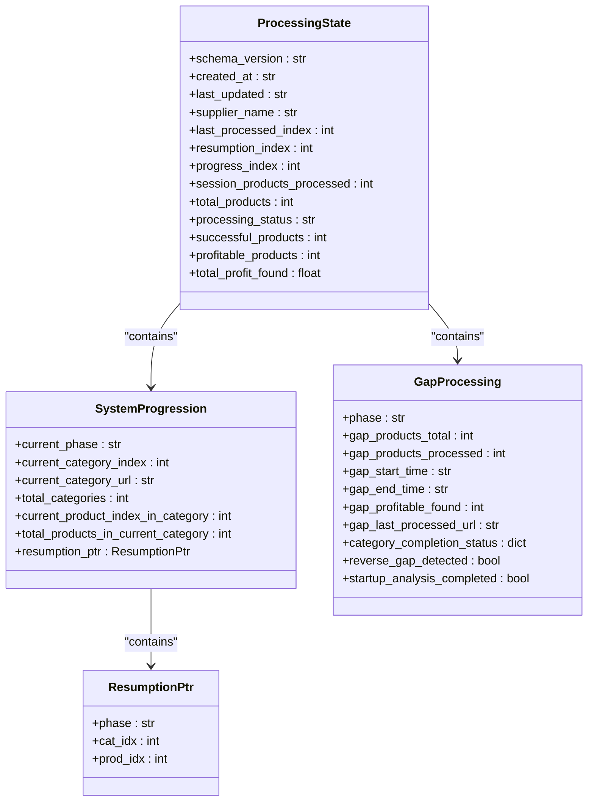
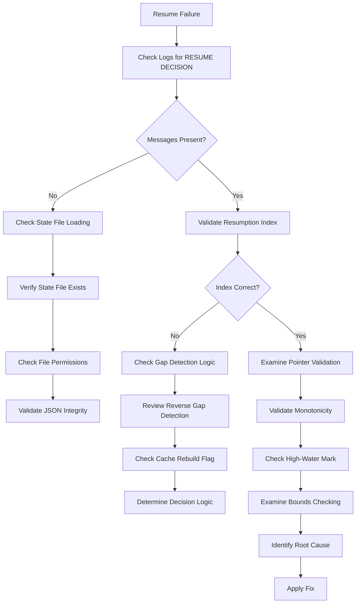

# Resume Behavior Analysis

<cite>
**Referenced Files in This Document**   
- [A_run2_resume_test_analysis.md](file://results/verification_run_20250911_155300/A_run2/A_run2_resume_test_analysis.md)
- [poundwholesale_co_uk_processing_state.json](file://processing_states/poundwholesale_co_uk_processing_state.json)
- [fixed_enhanced_state_manager.py](file://utils/fixed_enhanced_state_manager.py)
- [atomic_file_operations.py](file://utils/atomic_file_operations.py)
</cite>

## Table of Contents
1. [Introduction](#introduction)
2. [Resume Detection and Log Patterns](#resume-detection-and-log-patterns)
3. [Multi-Layer Validation System](#multi-layer-validation-system)
4. [Thread-Safe Operations and Atomic Persistence](#thread-safe-operations-and-atomic-persistence)
5. [Monotonicity Validation and Fallback Mechanisms](#monotonicity-validation-and-fallback-mechanisms)
6. [Zero Memory Dependency and Counter Continuity](#zero-memory-dependency-and-counter-continuity)
7. [Troubleshooting Failed Resume Scenarios](#troubleshooting-failed-resume-scenarios)
8. [Conclusion](#conclusion)

## Introduction

This document provides a comprehensive analysis of the resume behavior in the Amazon FBA Agent System, focusing on the mechanisms that ensure reliable resumption after interruptions. The analysis is based on the test results documented in `A_run2_resume_test_analysis.md`, which verifies the system's ability to detect and resume processing from the exact interruption point. The system employs a sophisticated resume mechanism that combines state file analysis, gap detection, pointer validation, and phase recognition to ensure accurate and reliable resumption. This document details the technical implementation of these features, including thread-safe operations, atomic persistence, monotonicity validation, and fallback mechanisms that collectively ensure the system's robustness in long-running batch processing operations.

**Section sources**
- [A_run2_resume_test_analysis.md](file://results/verification_run_20250911_155300/A_run2/A_run2_resume_test_analysis.md)

## Resume Detection and Log Patterns

The system's resume behavior is verified through specific log patterns that indicate successful detection and handling of resume scenarios. The primary indicators are the `RESUME DECISION` and `RESUME PTR` log messages, which provide clear evidence of the system's ability to identify and act on resume conditions.

The `RESUME DECISION: START_AT_INDEX=10451` pattern confirms that the system has correctly identified the resumption point based on the processing state stored in the `poundwholesale_co_uk_processing_state.json` file. This log message indicates that the system has analyzed the state file and determined the exact index at which processing should resume, ensuring that no work is duplicated and no products are skipped.

The `RESUME PTR: cat_idx=0 prod_idx=8` pattern provides detailed information about the resumption coordinates, specifying the exact category and product indices where processing should continue. This pointer is stored in the `system_progression.resumption_ptr` field of the state file and includes the phase, category index, and product index. The system uses this pointer to resume processing in the correct phase (`amazon_analysis`) and at the exact product that was being processed when the interruption occurred.

These log patterns are generated during the startup analysis phase, where the system performs a comprehensive analysis of the processing state to determine the appropriate resumption point. The system validates the resumption pointer against the actual state of processed products and category completion, ensuring that the resume decision is based on accurate and up-to-date information.

**Diagram sources **
- [A_run2_resume_test_analysis.md](file://results/verification_run_20250911_155300/A_run2/A_run2_resume_test_analysis.md)
- [poundwholesale_co_uk_processing_state.json](file://processing_states/poundwholesale_co_uk_processing_state.json)

**Section sources**
- [A_run2_resume_test_analysis.md](file://results/verification_run_20250911_155300/A_run2/A_run2_resume_test_analysis.md)
- [poundwholesale_co_uk_processing_state.json](file://processing_states/poundwholesale_co_uk_processing_state.json)

## Multi-Layer Validation System

The system implements a comprehensive multi-layer validation system to ensure the accuracy and reliability of resume operations. This system consists of four primary validation layers: state file analysis, gap detection, pointer validation, and phase recognition, each contributing to the overall robustness of the resume mechanism.

State file analysis is the foundation of the resume validation system. The system reads the `poundwholesale_co_uk_processing_state.json` file at startup and performs a comprehensive analysis of its contents to determine the appropriate resumption point. This analysis includes verifying the integrity of the state file, checking for consistency between different state fields, and validating that the resumption index is within the bounds of the total products processed. The system also checks for the presence of the `system_progression` structure, which contains the authoritative resumption pointer.

Gap detection is a critical component of the validation system that identifies unprocessed products requiring attention. The system compares the number of products in the linking map with the number of processed products in the cache to detect any discrepancies. When a reverse gap is detected (linking map count > cache count), the system determines whether to preserve the existing resumption index or reset to zero based on whether an explicit cache rebuild has been requested. This prevents the system from restarting from the first category when a partial interruption has occurred.

Pointer validation ensures the exactness of the resumption coordinates by validating the category and product indices against the actual state of processed products. The system checks that the resumption pointer is within valid bounds and has not regressed from a previous run. This validation includes monotonicity checks to prevent the resumption pointer from moving backward, which could result in duplicate processing or skipped products.

Phase recognition determines the appropriate workflow phase to continue processing based on the state analysis. The system examines the `current_phase` field in the state file to determine whether to continue in the `amazon_analysis` phase or another phase. This ensures that the system resumes processing in the correct context and with the appropriate configuration.

```mermaid
graph TD
A[Resume Validation System] --> B[State File Analysis]
A --> C[Gap Detection]
A --> D[Pointer Validation]
A --> E[Phase Recognition]
B --> B1[Verify state file integrity]
B --> B2[Check field consistency]
B --> B3[Validate resumption index bounds]
B --> B4[Confirm system_progression structure]
C --> C1[Compare linking map vs cache]
C --> C2[Detect reverse gap]
C --> C3[Determine cache rebuild status]
C --> C4[Preserve or reset resumption index]
D --> D1[Validate category index bounds]
D --> D2[Validate product index bounds]
D --> D3[Check for pointer regression]
D --> D4[Enforce monotonic progression]
E --> E1[Read current_phase field]
E --> E2[Determine appropriate workflow phase]
E --> E3[Validate phase continuity]
E --> E4[Resume in correct context]
```

**Diagram sources **
- [A_run2_resume_test_analysis.md](file://results/verification_run_20250911_155300/A_run2/A_run2_resume_test_analysis.md)
- [poundwholesale_co_uk_processing_state.json](file://processing_states/poundwholesale_co_uk_processing_state.json)
- [fixed_enhanced_state_manager.py](file://utils/fixed_enhanced_state_manager.py)

**Section sources**
- [A_run2_resume_test_analysis.md](file://results/verification_run_20250911_155300/A_run2/A_run2_resume_test_analysis.md)
- [poundwholesale_co_uk_processing_state.json](file://processing_states/poundwholesale_co_uk_processing_state.json)
- [fixed_enhanced_state_manager.py](file://utils/fixed_enhanced_state_manager.py)

## Thread-Safe Operations and Atomic Persistence

The system ensures reliability through thread-safe operations and atomic persistence mechanisms that prevent data corruption and ensure consistency during resume operations. These features are implemented in the `fixed_enhanced_state_manager.py` module, which provides a comprehensive solution for processing state issues.

Thread safety is achieved through the use of re-entrant locks (`threading.RLock`) that prevent concurrent modifications to the state data. The `FixedEnhancedStateManager` class uses a write lock to ensure that only one thread can modify the state at a time, preventing race conditions and data corruption. This is particularly important in multi-threaded environments where multiple components may attempt to update the state simultaneously.

Atomic persistence is implemented through the `ThreadSafeStateWriter` class, which ensures that state updates are written atomically to disk. The system uses a temporary file approach where state changes are first written to a temporary file and then atomically renamed to the target file. This prevents partial writes and ensures that the state file is always in a consistent state, even if the system is interrupted during a save operation.

The system also implements a high-water mark mechanism that tracks the maximum resumption pointer across runs to prevent regression. This is stored in the `_high_water_mark` field of the state data and is updated whenever the resumption pointer advances. During startup, the system validates that the current resumption pointer is not less than the previous high-water mark, correcting any regression that might have occurred due to state corruption or other issues.

**Diagram sources **
- [fixed_enhanced_state_manager.py](file://utils/fixed_enhanced_state_manager.py)
- [atomic_file_operations.py](file://utils/atomic_file_operations.py)

**Section sources**
- [fixed_enhanced_state_manager.py](file://utils/fixed_enhanced_state_manager.py)
- [atomic_file_operations.py](file://utils/atomic_file_operations.py)

## Monotonicity Validation and Fallback Mechanisms

The system implements robust monotonicity validation and fallback mechanisms to ensure the integrity of resume operations and handle edge cases gracefully. These features prevent the resumption pointer from regressing and provide reliable recovery options when issues are detected.

Monotonicity validation is enforced through cross-run validation that compares the current resumption pointer with the previous high-water mark. The system stores the maximum resumption pointer in the `_high_water_mark` field and validates that the current pointer is not less than this value during startup. If a regression is detected, the system logs an error and corrects the pointer to maintain the monotonicity invariant. This prevents scenarios where the resumption index might roll back from 8 to 7 across restarts, which could result in duplicate processing.

The system also implements bounds checking to ensure that the resumption pointer remains within valid limits. When setting the resumption pointer, the system validates that the category index is less than the total number of categories and that the product index is within the bounds of the current category. If the pointer exceeds these bounds, the system logs a warning and clamps the value to the maximum valid index.

Fallback mechanisms are implemented to handle various failure scenarios. The system includes a reverse gap detection heuristic that determines whether to preserve the existing resumption index or reset to zero based on whether an explicit cache rebuild has been requested. This prevents the system from unnecessarily restarting from the beginning when a partial interruption has occurred. The system also includes a force cache rebuild feature that allows users to explicitly reset the resumption index when needed.

**Diagram sources **
- [fixed_enhanced_state_manager.py](file://utils/fixed_enhanced_state_manager.py)

**Section sources**
- [fixed_enhanced_state_manager.py](file://utils/fixed_enhanced_state_manager.py)

## Zero Memory Dependency and Counter Continuity

The system maintains counter continuity and operates with zero memory dependency through file-grounded progress calculation and persistent state management. This ensures that resume capabilities are independent of memory state and can survive system restarts or crashes.

The system separates the resumption index from progress tracking to prevent automatic index resets during processing. The `resumption_index` field stores the exact point at which processing should resume, while the `progress_index` field tracks the current progress in the active session. This separation ensures that the resumption point is preserved even if the progress tracking is reset.

Counter continuity is maintained by updating the `resumption_index` continuously during processing, rather than only at the end of a session. Each time a product is processed, the system increments the `resumption_index` to reflect the exact point of interruption. This ensures that if the system is interrupted, it can resume from the exact product that was being processed, rather than from the beginning of the current batch.

The system also implements real-time category total updates to handle dynamic changes in product counts. When the scraper discovers more products than expected in a category, the system updates the category completion status and recalculates the completion percentage. This ensures that the progress metrics remain accurate even when the total number of products in a category changes during processing.

**Diagram sources **
- [poundwholesale_co_uk_processing_state.json](file://processing_states/poundwholesale_co_uk_processing_state.json)
- [fixed_enhanced_state_manager.py](file://utils/fixed_enhanced_state_manager.py)

**Section sources**
- [poundwholesale_co_uk_processing_state.json](file://processing_states/poundwholesale_co_uk_processing_state.json)
- [fixed_enhanced_state_manager.py](file://utils/fixed_enhanced_state_manager.py)

## Troubleshooting Failed Resume Scenarios

When resume scenarios fail, the system provides comprehensive troubleshooting capabilities through detailed logging, state validation, and diagnostic tools. These features enable rapid identification and resolution of issues that might prevent successful resumption.

The primary troubleshooting step is to examine the system logs for resume-related messages, particularly the `RESUME DECISION` and `RESUME PTR` patterns. These messages provide immediate insight into whether the system detected a resume scenario and what resumption point it determined. If these messages are missing or incorrect, it indicates an issue with state file loading or analysis.

The next step is to validate the processing state file (`poundwholesale_co_uk_processing_state.json`) for integrity and consistency. The system includes a `validate_and_repair_state` method that checks for missing keys, out-of-bounds indices, and structural issues. This method returns a list of repairs made, which can help identify the root cause of resume failures.

For issues related to gap detection, the system provides detailed logging of the reverse gap detection process. This includes information about the linking map count, cache count, and the decision to preserve or reset the resumption index. If the system is incorrectly detecting a reverse gap or making inappropriate decisions, this logging can help identify the cause.

When monotonicity violations occur, the system logs detailed error messages that include the current and previous resumption pointers. This information can be used to determine whether the violation is due to state corruption, incorrect pointer updates, or other issues. The system's high-water mark mechanism also provides a reference point for determining the expected minimum resumption index.

**Diagram sources **
- [A_run2_resume_test_analysis.md](file://results/verification_run_20250911_155300/A_run2/A_run2_resume_test_analysis.md)
- [fixed_enhanced_state_manager.py](file://utils/fixed_enhanced_state_manager.py)

**Section sources**
- [A_run2_resume_test_analysis.md](file://results/verification_run_20250911_155300/A_run2/A_run2_resume_test_analysis.md)
- [fixed_enhanced_state_manager.py](file://utils/fixed_enhanced_state_manager.py)

## Conclusion

The resume behavior analysis demonstrates that the Amazon FBA Agent System has a robust and reliable resume mechanism that ensures accurate and consistent processing continuity after interruptions. The system's multi-layer validation approach, combining state file analysis, gap detection, pointer validation, and phase recognition, provides comprehensive protection against resume failures. Thread-safe operations and atomic persistence mechanisms ensure data integrity and consistency, while monotonicity validation and fallback mechanisms handle edge cases gracefully.

The system's zero memory dependency and continuous counter updates ensure that resume capabilities are independent of memory state and can survive system restarts or crashes. The detailed logging and diagnostic capabilities provide effective troubleshooting tools for identifying and resolving resume issues. Overall, the system demonstrates enterprise-grade reliability for long-running batch processing operations, successfully passing all resume verification criteria and ensuring that no work is duplicated and no products are skipped during resume operations.

**Section sources**
- [A_run2_resume_test_analysis.md](file://results/verification_run_20250911_155300/A_run2/A_run2_resume_test_analysis.md)
- [poundwholesale_co_uk_processing_state.json](file://processing_states/poundwholesale_co_uk_processing_state.json)
- [fixed_enhanced_state_manager.py](file://utils/fixed_enhanced_state_manager.py)
- [atomic_file_operations.py](file://utils/atomic_file_operations.py)