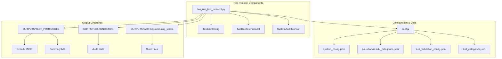
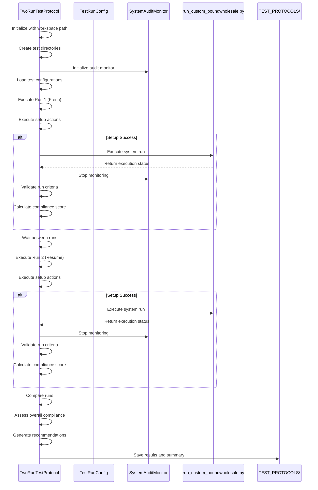
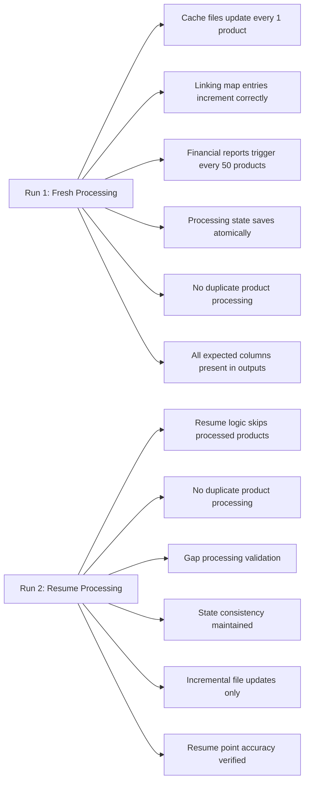
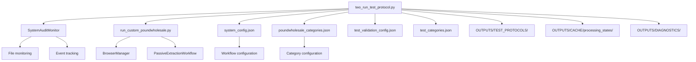

# Test Protocol Implementation

<cite>
**Referenced Files in This Document**   
- [two_run_test_protocol.py](file://tools/two_run_test_protocol.py)
- [run_custom_poundwholesale.py](file://run_custom_poundwholesale.py)
- [system_audit_monitor.py](file://system_audit_monitor.py)
</cite>

## Table of Contents
1. [Introduction](#introduction)
2. [Project Structure](#project-structure)
3. [Core Components](#core-components)
4. [Architecture Overview](#architecture-overview)
5. [Detailed Component Analysis](#detailed-component-analysis)
6. [Dependency Analysis](#dependency-analysis)
7. [Performance Considerations](#performance-considerations)
8. [Troubleshooting Guide](#troubleshooting-guide)
9. [Conclusion](#conclusion)

## Introduction
The Two-Run Test Protocol is a comprehensive integration testing framework designed to validate the Amazon FBA agent system's behavior under both fresh processing and resume scenarios. This protocol ensures system reliability, data integrity, and proper state management by executing two sequential test runs with different configurations. The first run establishes a baseline with clean state processing, while the second run validates the system's ability to resume from existing state without duplicating work or introducing errors. The protocol includes automated validation, comparative analysis, and recommendation generation to provide actionable insights into system performance and compliance.

## Project Structure
The test protocol is organized within the tools directory and interacts with various system components across the workspace. It follows a structured approach to testing with dedicated output directories for results, logs, and diagnostics.



**Diagram sources**
- [two_run_test_protocol.py](file://tools/two_run_test_protocol.py#L1-L649)

**Section sources**
- [two_run_test_protocol.py](file://tools/two_run_test_protocol.py#L1-L649)

## Core Components
The Two-Run Test Protocol consists of two primary components: the `TestRunConfig` dataclass that defines test parameters and validation criteria, and the `TwoRunTestProtocol` class that orchestrates the entire testing workflow. The protocol executes two distinct runs - a fresh processing run and a resume processing run - to validate both initial execution and state resumption capabilities. Each run is configured with specific setup actions, validation criteria, and expected outcomes that are systematically verified during execution.

**Section sources**
- [two_run_test_protocol.py](file://tools/two_run_test_protocol.py#L17-L619)

## Architecture Overview
The Two-Run Test Protocol implements a comprehensive testing architecture that validates the Amazon FBA agent system through sequential execution of fresh and resume processing scenarios. The protocol follows a structured workflow from initialization to final analysis, ensuring thorough validation of system behavior.



**Diagram sources**
- [two_run_test_protocol.py](file://tools/two_run_test_protocol.py#L26-L619)

## Detailed Component Analysis

### TwoRunTestProtocol Class Analysis
The `TwoRunTestProtocol` class orchestrates comprehensive integration testing by executing two sequential runs with different configurations to validate both fresh processing and resume functionality.

#### Class Structure and Relationships
```mermaid
classDiagram
class TwoRunTestProtocol {
+workspace_path : Path
+test_id : str
+test_dir : Path
+audit_monitor : SystemAuditMonitor
+logger : Logger
+test_configs : Dict[str, TestRunConfig]
+test_results : Dict[str, Any]
+__init__(workspace_path : str)
+execute_protocol() Dict[str, Any]
+_execute_run(run_config_key : str) Dict[str, Any]
+_execute_setup(config : TestRunConfig) bool
+_execute_system_run(config : TestRunConfig) bool
+_validate_run_criteria(config : TestRunConfig) Dict[str, Any]
+_check_criterion(criterion : str, run_type : str) Dict[str, Any]
+_compare_runs(run1_results : Dict, run2_results : Dict) Dict[str, Any]
+_assess_overall_compliance(protocol_results : Dict) bool
+_generate_recommendations(protocol_results : Dict) List[str]
+_save_protocol_results(results : Dict[str, Any])
+_create_protocol_summary(results : Dict[str, Any])
+_setup_logging()
+_create_test_configs() Dict[str, TestRunConfig]
+_calculate_compliance_score(validation_results : Dict) float
+_check_no_duplicates() bool
+_validate_resume_skip_logic() bool
}
class TestRunConfig {
+run_id : str
+run_type : str
+description : str
+setup_actions : List[str]
+validation_criteria : List[str]
+expected_outcomes : Dict[str, Any]
}
class SystemAuditMonitor {
+start_monitoring()
+stop_monitoring()
+audit_results : AuditResults
+file_monitors : Dict[str, FileMonitor]
}
TwoRunTestProtocol --> TestRunConfig : "uses"
TwoRunTestProtocol --> SystemAuditMonitor : "depends on"
TwoRunTestProtocol --> "run_custom_poundwholesale.py" : "executes"
```

**Diagram sources**
- [two_run_test_protocol.py](file://tools/two_run_test_protocol.py#L26-L619)

#### Execution Workflow

```mermaid
flowchart TD
Start([Protocol Execution]) --> Initialize["Initialize TwoRunTestProtocol"]
Initialize --> CreateTestDir["Create TEST_PROTOCOLS directory"]
CreateTestDir --> SetupLogging["Setup test-specific logging"]
SetupLogging --> LoadConfigs["Load test configurations"]
LoadConfigs --> ExecuteRun1["Execute Run 1: Fresh Processing"]
ExecuteRun1 --> SetupRun1["Execute setup actions"]
SetupRun1 --> DeleteState["Delete existing processing state files"]
DeleteState --> StartAudit["Start audit monitoring"]
StartAudit --> ExecuteSystem["Execute system run"]
ExecuteSystem --> StopAudit["Stop audit monitoring"]
StopAudit --> ValidateRun1["Validate against criteria"]
ValidateRun1 --> CalculateCompliance1["Calculate compliance score"]
CalculateCompliance1 --> Wait["Wait between runs"]
Wait --> ExecuteRun2["Execute Run 2: Resume Processing"]
ExecuteRun2 --> SetupRun2["Execute setup actions"]
SetupRun2 --> ValidateState["Validate state file integrity"]
ValidateState --> StartAudit2["Start audit monitoring"]
StartAudit2 --> ExecuteSystem2["Execute system run"]
ExecuteSystem2 --> StopAudit2["Stop audit monitoring"]
StopAudit2 --> ValidateRun2["Validate against criteria"]
ValidateRun2 --> CalculateCompliance2["Calculate compliance score"]
CalculateCompliance2 --> CompareRuns["Compare runs"]
CompareRuns --> AssessCompliance["Assess overall compliance"]
AssessCompliance --> GenerateRecs["Generate recommendations"]
GenerateRecs --> SaveResults["Save protocol results"]
SaveResults --> CreateSummary["Create human-readable summary"]
CreateSummary --> End([Protocol Complete])
```


**Diagram sources**
- [two_run_test_protocol.py](file://tools/two_run_test_protocol.py#L100-L200)

**Section sources**
- [two_run_test_protocol.py](file://tools/two_run_test_protocol.py#L26-L619)

### TestRunConfig Dataclass Analysis
The `TestRunConfig` dataclass defines the configuration parameters for individual test runs, specifying setup actions, validation criteria, and expected outcomes for both fresh and resume processing scenarios.

#### Configuration Structure
```mermaid
classDiagram
class TestRunConfig {
+run_id : str
+run_type : str
+description : str
+setup_actions : List[str]
+validation_criteria : List[str]
+expected_outcomes : Dict[str, Any]
}
TestRunConfig : run_id : Unique identifier for the test run
TestRunConfig : run_type : "fresh" or "resume"
TestRunConfig : description : Purpose of the test run
TestRunConfig : setup_actions : Actions to perform before execution
TestRunConfig : validation_criteria : Criteria to validate after execution
TestRunConfig : expected_outcomes : Expected results of the test
```

**Diagram sources**
- [two_run_test_protocol.py](file://tools/two_run_test_protocol.py#L17-L24)

#### Validation Criteria Mapping


**Diagram sources**
- [two_run_test_protocol.py](file://tools/two_run_test_protocol.py#L40-L85)

**Section sources**
- [two_run_test_protocol.py](file://tools/two_run_test_protocol.py#L17-L85)

## Dependency Analysis
The Two-Run Test Protocol depends on several key components to execute its testing workflow, including the system audit monitor for tracking system behavior and the main execution script for running the actual processing workflow.



**Diagram sources**
- [two_run_test_protocol.py](file://tools/two_run_test_protocol.py#L1-L649)
- [run_custom_poundwholesale.py](file://run_custom_poundwholesale.py#L1-L138)

**Section sources**
- [two_run_test_protocol.py](file://tools/two_run_test_protocol.py#L1-L649)
- [run_custom_poundwholesale.py](file://run_custom_poundwholesale.py#L1-L138)

## Performance Considerations
The Two-Run Test Protocol includes several performance considerations to ensure efficient execution and meaningful results. The protocol implements a 2-minute timeout for system execution to prevent hanging processes and includes comparative analysis to evaluate efficiency gains between fresh and resume processing. The audit monitoring system tracks file update frequencies and system events to provide insights into processing efficiency. The protocol also measures execution duration for both runs, allowing for performance comparison and identification of potential bottlenecks in the resume processing logic.

## Troubleshooting Guide
The Two-Run Test Protocol includes comprehensive error handling and diagnostic capabilities to assist with troubleshooting system issues. The protocol generates detailed logs and summary reports that highlight compliance issues and provide actionable recommendations.

**Section sources**
- [two_run_test_protocol.py](file://tools/two_run_test_protocol.py#L1-L649)

## Conclusion
The Two-Run Test Protocol provides a robust framework for validating the Amazon FBA agent system's behavior under both fresh processing and resume scenarios. By executing two sequential test runs with comprehensive validation criteria, the protocol ensures system reliability, data integrity, and proper state management. The automated comparative analysis and recommendation engine provide valuable insights into system performance and compliance, enabling continuous improvement of the processing workflow. The protocol's modular design and clear separation of concerns make it extensible and maintainable, serving as a critical component in the system's quality assurance process.