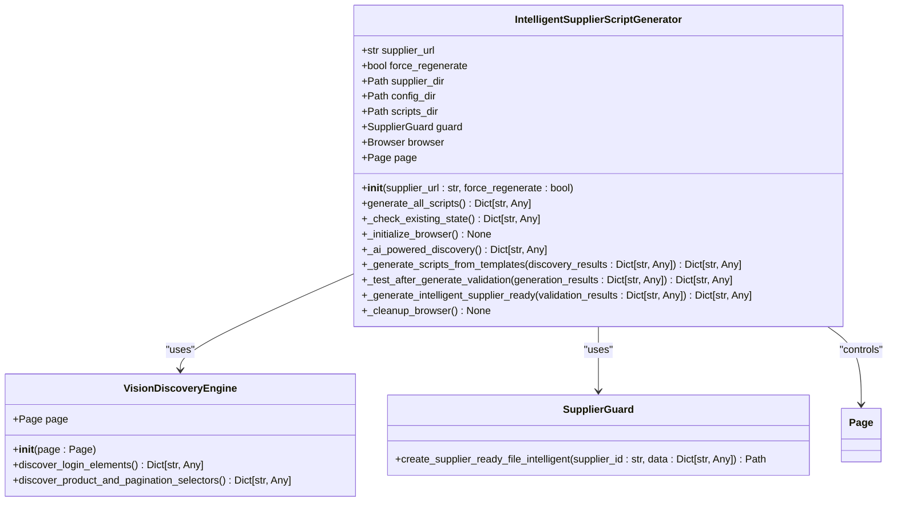
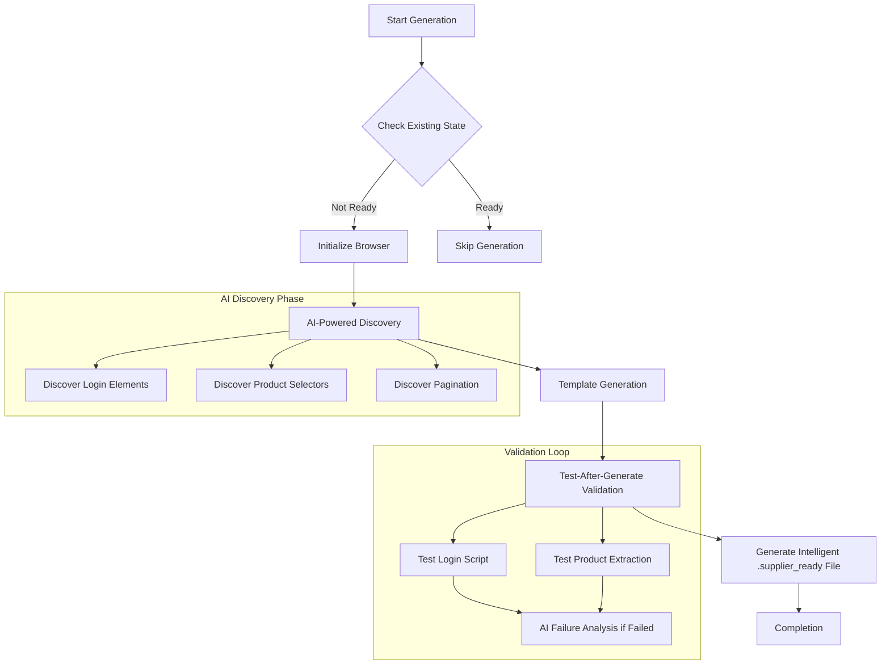
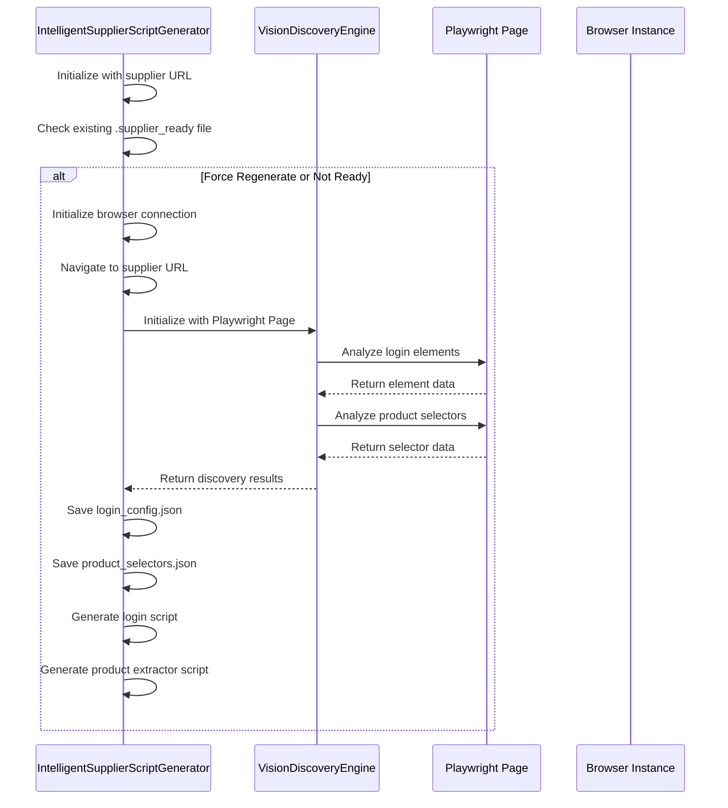

# AI-Powered Discovery

<cite>
**Referenced Files in This Document**   
- [supplier_script_generator.py](file://tools/supplier_script_generator.py)
- [vision_discovery_engine.py](file://tools/vision_discovery_engine.py)
- [www.poundwholesale.co.uk.json](file://config/supplier_configs/www.poundwholesale.co.uk.json)
</cite>

## Table of Contents
1. [Introduction](#introduction)
2. [Core Components](#core-components)
3. [Architecture Overview](#architecture-overview)
4. [Detailed Component Analysis](#detailed-component-analysis)
5. [Integration Between Supplier Script Generator and Vision Discovery Engine](#integration-between-supplier-script-generator-and-vision-discovery-engine)
6. [JSON Output Format for Discovery Results](#json-output-format-for-discovery-results)
7. [AI Detection of Dynamic Content and Complex DOM Structures](#ai-detection-of-dynamic-content-and-complex-dom-structures)
8. [Common Discovery Challenges and Mitigation Strategies](#common-discovery-challenges-and-mitigation-strategies)
9. [Usage of Discovery Results in Template Generation](#usage-of-discovery-results-in-template-generation)
10. [Conclusion](#conclusion)

## Introduction
The AI-powered discovery phase is a critical component of the IntelligentSupplierScriptGenerator system, enabling automated detection of key webpage elements necessary for supplier integration. This document details how the VisionDiscoveryEngine leverages visual analysis and AI to identify login forms, product selectors, and pagination controls across diverse supplier websites. The process enables robust automation script generation without manual configuration, adapting to dynamic content, shadow DOM, and JavaScript-rendered interfaces.

**Section sources**
- [supplier_script_generator.py](file://tools/supplier_script_generator.py#L1-L50)

## Core Components
The AI-powered discovery functionality is implemented through two primary components: the IntelligentSupplierScriptGenerator class and the VisionDiscoveryEngine class. These components work in tandem to analyze supplier webpages, extract selector configurations, and generate executable automation scripts.



**Diagram sources**
- [supplier_script_generator.py](file://tools/supplier_script_generator.py#L100-L200)
- [vision_discovery_engine.py](file://tools/vision_discovery_engine.py#L1-L10)

**Section sources**
- [supplier_script_generator.py](file://tools/supplier_script_generator.py#L1-L1304)

## Architecture Overview
The AI-powered discovery process follows a structured orchestration sequence that begins with browser initialization and concludes with intelligent validation. The system integrates AI capabilities to analyze visual page states and adapt to dynamic content patterns.



**Diagram sources**
- [supplier_script_generator.py](file://tools/supplier_script_generator.py#L200-L300)

## Detailed Component Analysis

### IntelligentSupplierScriptGenerator Analysis
The IntelligentSupplierScriptGenerator class orchestrates the entire discovery and script generation process. It manages browser connections, coordinates AI-powered discovery, generates scripts from templates, and validates the results through automated testing.

#### Integration with VisionDiscoveryEngine


**Diagram sources**
- [supplier_script_generator.py](file://tools/supplier_script_generator.py#L400-L500)
- [vision_discovery_engine.py](file://tools/vision_discovery_engine.py#L1-L20)

**Section sources**
- [supplier_script_generator.py](file://tools/supplier_script_generator.py#L300-L500)

## Integration Between Supplier Script Generator and Vision Discovery Engine
The integration between supplier_script_generator.py and vision_discovery_engine.py is central to the AI-powered discovery process. The IntelligentSupplierScriptGenerator creates an instance of VisionDiscoveryEngine, passing the Playwright page object for analysis.

When _ai_powered_discovery() is called, it initializes VisionDiscoveryEngine with the current page context, enabling visual analysis of the supplier website. The VisionDiscoveryEngine uses this page object to execute JavaScript evaluations, capture visual representations, and identify key elements through AI analysis. This tight integration allows the system to maintain context across the discovery process, preserving browser state and page interactions.

The page object is obtained either from an existing Chrome debug instance (CDP connection) or a newly launched browser, ensuring that the discovery process can work with both automated and human-initiated browsing sessions.

**Section sources**
- [supplier_script_generator.py](file://tools/supplier_script_generator.py#L450-L480)

## JSON Output Format for Discovery Results
The discovery process generates two key configuration files in JSON format: login_config.json and product_selectors.json. These files contain selector strategies and fallback mechanisms for robust automation.

### login_config.json Structure
```json
{
  "email_selector": "input[type='email']",
  "password_selector": "input[type='password']",
  "submit_selector": ".btn.btn-primary.btn-block, button:has-text('Login'), button[type='submit']",
  "login_triggers": [
    "header a:has-text('Sign in')",
    "nav a:has-text('Sign in')",
    "a[href*='/customer/account/login']"
  ],
  "modal_close_selectors": [
    ".modals-overlay",
    ".modal-backdrop",
    "[data-role='backdrop']"
  ]
}
```

### product_selectors.json Structure
```json
{
  "product_container_selector": ".product-item",
  "title_selector_relative": "h2, h3, .title",
  "price_selector_relative": ".price",
  "url_selector_relative": "a",
  "image_selector_relative": "img",
  "pagination_next_selector": "a.next, .pagination .next a"
}
```

The JSON format includes primary selectors and fallback strategies, allowing the generated scripts to attempt multiple selection methods when elements are not found. This multi-strategy approach increases resilience against UI changes and dynamic content loading.

**Section sources**
- [supplier_script_generator.py](file://tools/supplier_script_generator.py#L470-L490)

## AI Detection of Dynamic Content and Complex DOM Structures
The VisionDiscoveryEngine is designed to handle various challenges presented by modern web applications, including dynamic content, shadow DOM elements, and JavaScript-rendered interfaces.

For dynamic content such as lazy-loaded products, the engine employs scrolling and waiting strategies to ensure all elements are rendered before analysis. It can detect infinite scroll patterns and pagination mechanisms through visual cues and DOM structure analysis.

When encountering shadow DOM elements, the system uses JavaScript execution to pierce the shadow boundary and extract meaningful selectors. This capability is essential for interacting with web components that encapsulate their internal structure.

JavaScript-rendered interfaces are handled by waiting for specific network activity to complete and monitoring DOM mutations until a stable state is reached. The AI component analyzes visual patterns to identify interactive elements even when their selectors are dynamically generated.

**Section sources**
- [supplier_script_generator.py](file://tools/supplier_script_generator.py#L800-L900)

## Common Discovery Challenges and Mitigation Strategies
The AI-powered discovery system addresses several common challenges in web automation:

### CAPTCHA Presence
When CAPTCHAs are detected, the system captures screenshots and uses AI analysis to identify the type of challenge. The generated scripts include appropriate error handling and notifications for manual intervention.

### Lazy-Loaded Content
The discovery engine implements scrolling and timing strategies to ensure all products are loaded before selector extraction. It analyzes network patterns to detect AJAX-based content loading.

### Responsive Design Variations
The system captures viewport dimensions and analyzes element visibility across different screen sizes. It generates selectors that work consistently across desktop and mobile layouts.

### Modal Overlays and Popups
The engine identifies common modal patterns and includes overlay dismissal strategies in the generated configuration. This includes both standard close buttons and JavaScript-based removal techniques.

### Dynamic Selector Generation
For sites that generate random class names, the system prioritizes attribute-based selectors (e.g., data- attributes) and text content matching over class names.

**Section sources**
- [supplier_script_generator.py](file://tools/supplier_script_generator.py#L1000-L1200)

## Usage of Discovery Results in Template Generation
Discovery results are directly used to populate templates for login and product extraction scripts. The system replaces placeholder selectors with those identified during the AI-powered discovery phase.

For example, the login script template uses the discovered email_selector, password_selector, and submit_selector values from login_config.json. Similarly, the product extractor script incorporates the product_container_selector and field-specific selectors from product_selectors.json.

The template generation process also incorporates fallback mechanisms, including multiple login trigger selectors and error recovery strategies. These are derived from the comprehensive analysis performed by the VisionDiscoveryEngine.

Generated scripts include test functions that validate the discovery results, creating a feedback loop that ensures the accuracy of the AI-powered discovery process.

**Section sources**
- [supplier_script_generator.py](file://tools/supplier_script_generator.py#L500-L800)

## Conclusion
The AI-powered discovery system implemented in the IntelligentSupplierScriptGenerator represents a significant advancement in automated supplier integration. By leveraging the VisionDiscoveryEngine, the system can automatically detect and adapt to diverse website structures without manual configuration.

The integration between the supplier script generator and vision discovery engine enables robust, self-validating automation scripts that handle real-world challenges such as dynamic content, responsive design, and complex DOM structures. The JSON-based configuration format provides flexibility and resilience, while AI-powered failure analysis ensures continuous improvement of the discovery process.

This approach significantly reduces the time and expertise required to integrate new suppliers, making the system scalable and maintainable in the face of evolving web technologies.