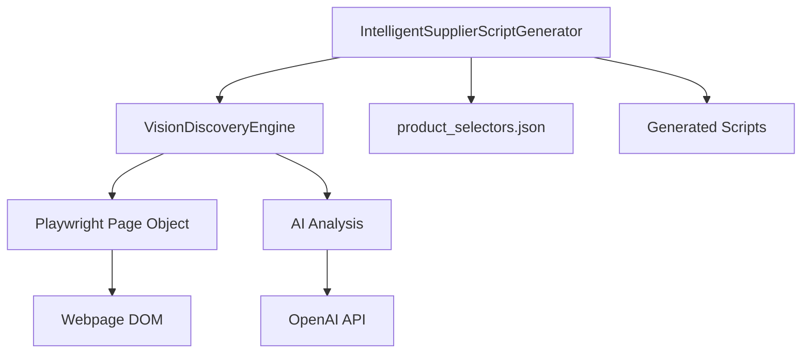
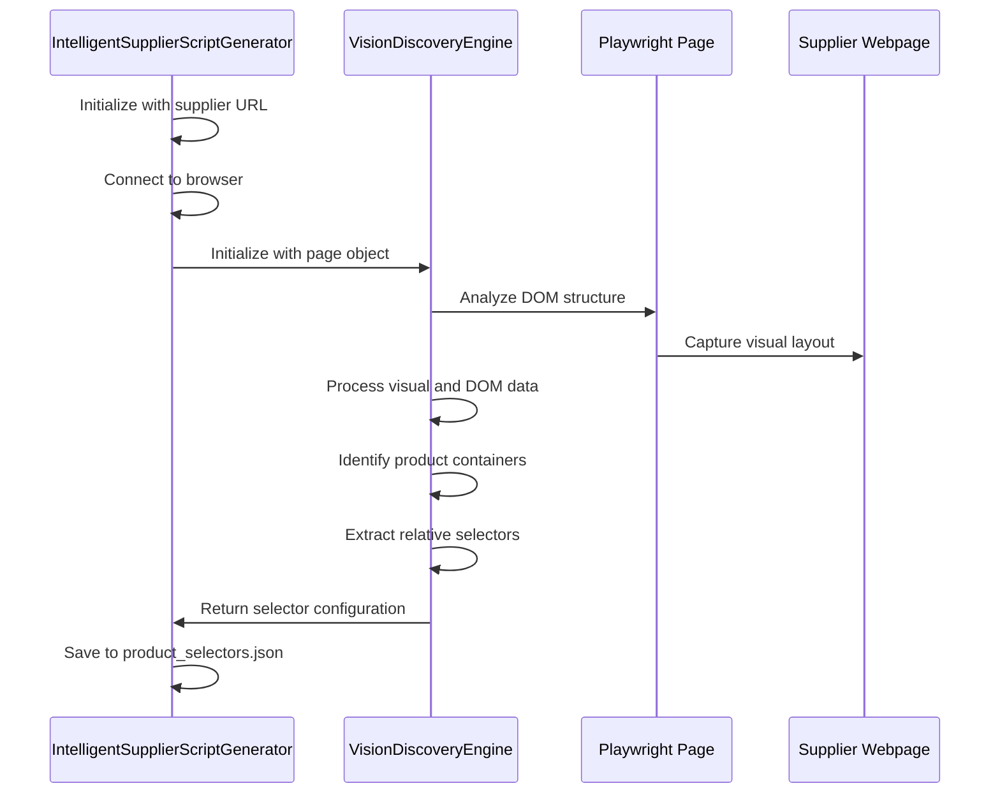
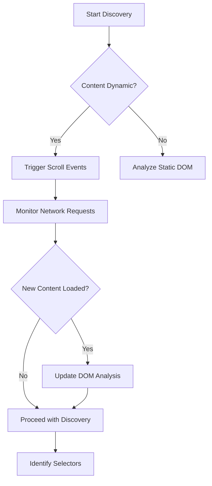

# Product and Pagination Selector Discovery

<cite>
**Referenced Files in This Document**   
- [tools/supplier_script_generator.py](file://tools/supplier_script_generator.py)
- [tools/vision_discovery_engine.py](file://tools/vision_discovery_engine.py)
- [config/supplier_configs/www.poundwholesale.co.uk.json](file://config/supplier_configs/www.poundwholesale.co.uk.json)
</cite>

## Table of Contents
1. [Introduction](#introduction)
2. [Architecture Overview](#architecture-overview)
3. [Core Components](#core-components)
4. [AI-Powered Discovery Process](#ai-powered-discovery-process)
5. [Selector Discovery Workflow](#selector-discovery-workflow)
6. [JSON Output Format](#json-output-format)
7. [Handling Dynamic Content](#handling-dynamic-content)
8. [Common Discovery Challenges](#common-discovery-challenges)
9. [Integration with Script Generation](#integration-with-script-generation)
10. [Conclusion](#conclusion)

## Introduction
The IntelligentSupplierScriptGenerator system employs an AI-powered approach to automatically identify product and pagination elements on supplier webpages. This document details the discovery process that enables the system to generate robust, supplier-specific scraping scripts without manual intervention. The core of this capability lies in the VisionDiscoveryEngine, which analyzes webpage structure through visual and DOM analysis to identify critical selectors for product cards, pricing, titles, images, and pagination controls.

## Architecture Overview
The selector discovery system follows a modular architecture where the IntelligentSupplierScriptGenerator orchestrates the discovery process by leveraging the VisionDiscoveryEngine. This design separates concerns between workflow management and AI-powered element detection, enabling reusable discovery capabilities across different suppliers.



**Diagram sources**
- [tools/supplier_script_generator.py](file://tools/supplier_script_generator.py#L50-L150)
- [tools/vision_discovery_engine.py](file://tools/vision_discovery_engine.py#L1-L50)

## Core Components
The system comprises two primary components that work in tandem to discover and utilize selectors. The IntelligentSupplierScriptGenerator manages the overall workflow, while the VisionDiscoveryEngine performs the actual AI-powered element detection.

**Section sources**
- [tools/supplier_script_generator.py](file://tools/supplier_script_generator.py#L50-L150)
- [tools/vision_discovery_engine.py](file://tools/vision_discovery_engine.py#L1-L50)

## AI-Powered Discovery Process
The discovery process begins when the IntelligentSupplierScriptGenerator initializes the VisionDiscoveryEngine with a Playwright page object. This integration allows the system to analyze both the visual representation and underlying DOM structure of supplier webpages. The process follows a systematic approach:

1. Initialize browser connection and navigate to supplier URL
2. Instantiate VisionDiscoveryEngine with current page context
3. Execute specialized discovery methods for different element types
4. Save discovered selectors to configuration files
5. Generate scripts using discovered selectors

The AI component enhances traditional selector detection by understanding visual patterns and contextual relationships between elements, rather than relying solely on CSS selector matching.



**Diagram sources**
- [tools/supplier_script_generator.py](file://tools/supplier_script_generator.py#L250-L300)
- [tools/vision_discovery_engine.py](file://tools/vision_discovery_engine.py#L100-L150)

## Selector Discovery Workflow
The selector discovery workflow is initiated through the `_ai_powered_discovery` method of the IntelligentSupplierScriptGenerator class. This method coordinates with the VisionDiscoveryEngine to identify various element types through a systematic process.

Product card detection begins by identifying container elements that likely contain product information. The system analyzes structural patterns such as repeated elements with similar layouts, price indicators, and image containers. Once product containers are identified, the system extracts relative selectors for key data points including titles, prices, URLs, and images.

Pagination controls are discovered by analyzing navigation elements, URL patterns, and interactive controls that suggest page traversal functionality. The system identifies both traditional pagination (numbered pages) and infinite scroll patterns, adapting its approach accordingly.

The discovered selectors are then saved to `product_selectors.json` in the supplier's configuration directory, creating a persistent record of the discovery results that can be used for script generation and validation.

**Section sources**
- [tools/supplier_script_generator.py](file://tools/supplier_script_generator.py#L250-L350)
- [tools/vision_discovery_engine.py](file://tools/vision_discovery_engine.py#L50-L200)

## JSON Output Format
The discovery process generates a structured JSON configuration file (`product_selectors.json`) that contains all identified selectors and their relationships. This file serves as the blueprint for generating product extraction scripts.

```json
{
  "product_container_selector": ".product-item",
  "title_selector_relative": "h2 a",
  "price_selector_relative": ".price",
  "url_selector_relative": "a.product-link",
  "image_selector_relative": "img.product-image",
  "pagination": {
    "pattern": "?page={page_num}",
    "next_button_selector": "a.next"
  },
  "discovery_metadata": {
    "timestamp": "2025-07-05T20:51:29.812652",
    "confidence_score": 0.95,
    "element_count": 24
  }
}
```

The JSON structure includes primary selectors for product containers and relative selectors for individual data points within each container. This relative approach enhances robustness by reducing dependency on absolute DOM paths that may change. The configuration also includes fallback strategies through multiple selector options and metadata about the discovery process.

**Section sources**
- [tools/supplier_script_generator.py](file://tools/supplier_script_generator.py#L280-L300)
- [config/supplier_configs/www.poundwholesale.co.uk.json](file://config/supplier_configs/www.poundwholesale.co.uk.json#L1-L65)

## Handling Dynamic Content
The system employs several strategies to handle dynamic content loading patterns commonly found on modern e-commerce sites. For lazy-loaded content, the VisionDiscoveryEngine triggers scroll events and monitors network activity to detect when additional products are loaded into the DOM.

Infinite scroll implementations are detected by analyzing scroll behavior and content loading patterns. The system identifies the trigger points for additional content loading and incorporates this understanding into the generated extraction scripts.

Dynamically rendered product grids, often implemented with JavaScript frameworks, are handled by waiting for specific DOM mutations and network requests to complete before attempting selector discovery. The integration with Playwright allows the system to synchronize with page loading events and ensure that all content is available before analysis begins.



**Diagram sources**
- [tools/supplier_script_generator.py](file://tools/supplier_script_generator.py#L250-L300)
- [tools/vision_discovery_engine.py](file://tools/vision_discovery_engine.py#L200-L250)

## Common Discovery Challenges
The system addresses several common challenges in selector discovery across diverse supplier websites. Variable product layouts are handled through pattern recognition algorithms that identify consistent structural elements despite visual variations.

AJAX-powered pagination presents a challenge as URL patterns may not change between pages. The system detects these implementations by monitoring XHR/fetch requests and identifying the API endpoints used for content loading. This information is incorporated into the generated scripts to enable proper pagination handling.

Responsive design variations are addressed by analyzing the page at multiple viewport sizes and identifying selectors that remain consistent across different device layouts. The AI component helps distinguish between cosmetic changes and structural changes that would affect selector validity.

The system also handles cases where product information is spread across multiple DOM locations or requires interaction (such as clicking tabs) to reveal complete details. In these cases, the discovery process records the necessary interaction patterns and incorporates them into the extraction workflow.

**Section sources**
- [tools/supplier_script_generator.py](file://tools/supplier_script_generator.py#L250-L350)
- [tools/vision_discovery_engine.py](file://tools/vision_discovery_engine.py#L150-L300)

## Integration with Script Generation
The discovered selectors are directly integrated into the script generation process through template-based code generation. The IntelligentSupplierScriptGenerator uses the `product_selectors.json` configuration to populate templates for product extraction scripts.

The integration process involves mapping discovered selectors to script variables and incorporating appropriate waiting strategies for dynamic content. For example, pagination selectors are used to implement page navigation logic, while product container selectors are used to iterate through individual items.

The system also incorporates fallback strategies by including multiple selector options in the generated scripts. This enhances robustness by allowing the script to adapt to minor changes in the webpage structure without requiring re-discovery.

Validation of the generated scripts is performed through an automated test-after-generate loop that verifies the selectors work as expected. If validation fails, the system can initiate AI-powered failure analysis to diagnose and potentially correct selector issues.

**Section sources**
- [tools/supplier_script_generator.py](file://tools/supplier_script_generator.py#L350-L500)
- [tools/supplier_script_generator.py](file://tools/supplier_script_generator.py#L799-L1200)

## Conclusion
The AI-powered product and pagination selector discovery system represents a significant advancement in automated web scraping. By combining Playwright's browser automation capabilities with AI-powered visual analysis, the system can reliably identify critical elements on diverse supplier websites without manual configuration.

The integration between IntelligentSupplierScriptGenerator and VisionDiscoveryEngine creates a robust workflow that handles the complexities of modern e-commerce sites, including dynamic content loading, responsive designs, and varied pagination implementations. The resulting selector configurations enable the generation of reliable, maintainable scraping scripts that can adapt to common website changes.

This approach significantly reduces the time and expertise required to set up product data extraction for new suppliers, while also improving the reliability and maintainability of the resulting automation scripts.