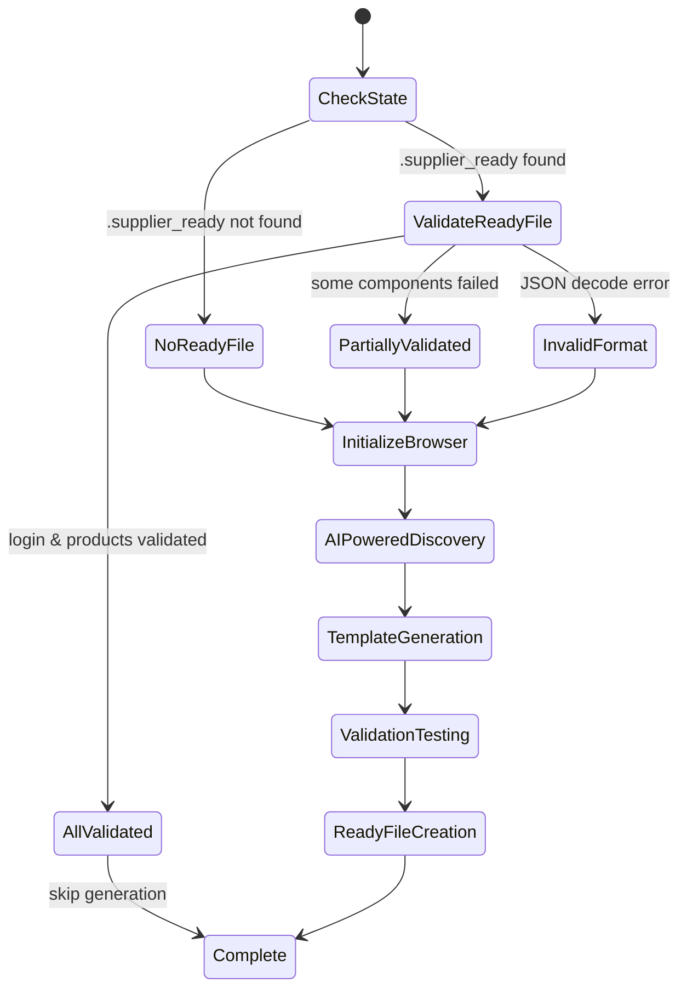
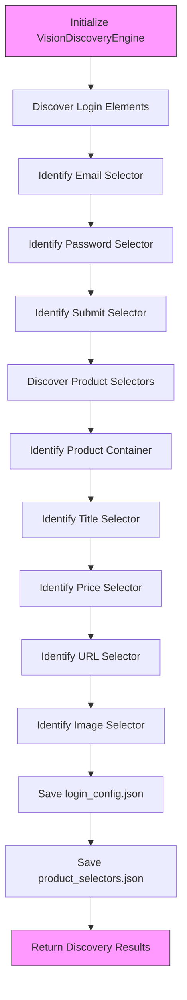
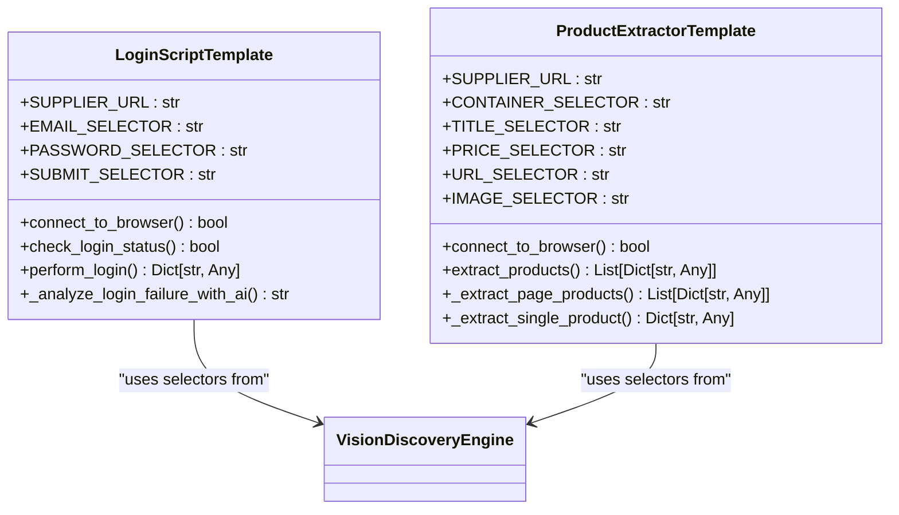
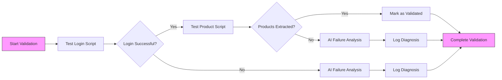
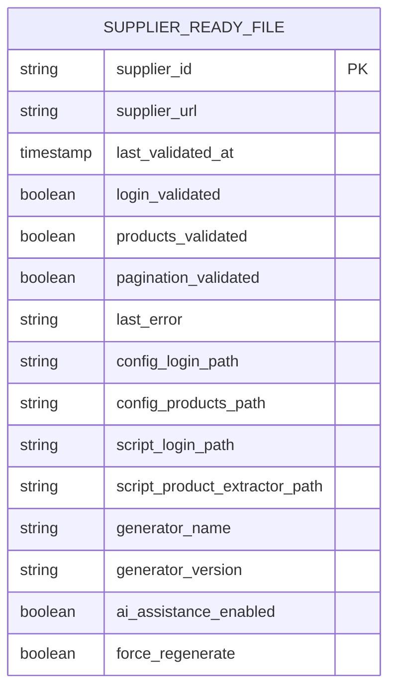

# Script Generation

<cite>
**Referenced Files in This Document**   
- [supplier_script_generator.py](file://tools/supplier_script_generator.py)
- [configurable_supplier_scraper.py](file://tools/configurable_supplier_scraper.py)
- [supplier_authentication_service.py](file://tools/supplier_authentication_service.py)
</cite>

## Table of Contents
1. [Introduction](#introduction)
2. [State Management with SupplierGuard](#state-management-with-supplierguard)
3. [Browser Initialization and Context Handling](#browser-initialization-and-context-handling)
4. [AI-Powered Discovery with VisionDiscoveryEngine](#ai-powered-discovery-with-visiondiscoveryengine)
5. [Template-Based Script Generation](#template-based-script-generation)
6. [Generated Script Structure and Capabilities](#generated-script-structure-and-capabilities)
7. [Test-After-Generate Validation Loop](#test-after-generate-validation-loop)
8. [Intelligent .supplier_ready File Creation](#intelligent-supplier_ready-file-creation)
9. [Integration with configurable_supplier_scraper.py](#integration-with-configurable_supplier_scraperpy)
10. [Handling Complex Generation Challenges](#handling-complex-generation-challenges)

## Introduction
The IntelligentSupplierScriptGenerator class represents the core automation engine for generating, testing, and validating supplier-specific scripts in the Amazon FBA Agent System. This system follows a comprehensive end-to-end workflow that begins with state checking and progresses through browser initialization, AI-powered discovery, template generation, validation testing, and final .supplier_ready file creation. The generator leverages the VisionDiscoveryEngine to automatically detect login elements and product selectors through AI analysis of the current browser state, eliminating the need for manual selector configuration. The system is designed with intelligent state management through the SupplierGuard component, which prevents redundant generation by tracking supplier readiness and validation status. Generated scripts include sophisticated capabilities for authentication handling, modal overlay management, and failure analysis, ensuring robust operation across diverse supplier websites. The test-after-generate validation loop provides a critical quality assurance mechanism that verifies script reliability before deployment, while the integration with the configurable_supplier_scraper.py framework enables seamless incorporation of generated scripts into the broader data extraction workflow.

**Section sources**
- [supplier_script_generator.py](file://tools/supplier_script_generator.py#L1-L1304)

## State Management with SupplierGuard
The SupplierGuard component plays a crucial role in managing supplier state and preventing redundant script generation. Before initiating the generation process, the IntelligentSupplierScriptGenerator performs a comprehensive state check by examining the existence and content of the .supplier_ready file in the supplier's directory. This file serves as a persistent state indicator that tracks the validation status of both login and product extraction components. When a .supplier_ready file exists and both login_validated and products_validated flags are set to true, the generator skips the entire generation process, recognizing that a fully validated script package is already available. If the file exists but validation has failed for specific components, the generator proceeds with targeted regeneration of only the failed components, optimizing resource usage and processing time. In cases where the .supplier_ready file is missing or contains invalid JSON, the system initiates a complete generation cycle. This intelligent state management approach ensures that computational resources are focused on suppliers that genuinely require script updates, while avoiding unnecessary processing for suppliers with validated, working scripts. The SupplierGuard also facilitates the creation of the .supplier_ready file in a standardized format that includes metadata about the generation process, configuration files, and test results.



**Diagram sources**
- [supplier_script_generator.py](file://tools/supplier_script_generator.py#L150-L200)

## Browser Initialization and Context Handling
The browser initialization process establishes a connection to an existing Chrome debug instance or launches a new browser when necessary, ensuring seamless integration with the user's current browsing session. The generator connects to Chrome via the CDP (Chrome DevTools Protocol) endpoint at http://localhost:9222, allowing it to interact with the browser without disrupting the user's workflow. Upon successful connection, the system identifies the currently active and visible page by evaluating document.visibilityState and document.hasFocus() properties, prioritizing the user's active tab for discovery and testing operations. If no active page is found, the system falls back to the first available page in the browser context or creates a new page if none exist. The navigation logic is intelligent, only navigating to the target supplier URL if the current page is on a different domain, thereby preserving the user's current browsing context when possible. This approach minimizes disruption to ongoing user activities while ensuring the browser is properly positioned for the script generation process. The initialization also configures the browser context with realistic user agent strings, viewport dimensions, and HTTP headers to mimic human browsing behavior and reduce the likelihood of bot detection.

```mermaid
sequenceDiagram
participant Generator
participant Playwright
participant Chrome
participant UserPage
Generator->>Playwright : async_playwright().start()
Playwright->>Chrome : connect_over_cdp("http : //localhost : 9222")
Chrome-->>Playwright : Browser instance
Playwright->>Chrome : Get browser contexts
Chrome-->>Playwright : Context list
Playwright->>UserPage : Query all pages
loop For each page
UserPage->>UserPage : evaluate(visibilityState && hasFocus)
UserPage-->>Playwright : Active page found
break
end
Playwright->>Generator : Return active page
alt Current domain != target domain
Generator->>UserPage : goto(supplier_url)
UserPage-->>Generator : Navigation complete
else Already on target domain
Generator->>Generator : Preserve current state
end
```

**Diagram sources**
- [supplier_script_generator.py](file://tools/supplier_script_generator.py#L210-L270)

## AI-Powered Discovery with VisionDiscoveryEngine
The AI-powered discovery phase leverages the VisionDiscoveryEngine to automatically detect login elements and product selectors through sophisticated AI analysis of the current webpage. This process begins with the initialization of the VisionDiscoveryEngine using the active browser page, which serves as the foundation for all subsequent discovery operations. For login element detection, the engine analyzes the page to identify email input fields, password fields, and submit buttons, employing pattern recognition to distinguish these elements from other form controls. The discovery process for product and pagination selectors is equally comprehensive, identifying product container elements, title selectors, price selectors, URL selectors, and image selectors through structural analysis of the page's DOM. These discovered selectors are then saved to configuration files (login_config.json and product_selectors.json) in the supplier's config directory, creating a persistent record of the AI's findings. The discovery process is resilient, creating empty configuration files with error markers when detection fails, allowing for troubleshooting and manual intervention. This AI-powered approach eliminates the need for manual selector configuration, significantly reducing setup time and increasing accuracy by leveraging machine learning to interpret complex webpage structures.



**Diagram sources**
- [supplier_script_generator.py](file://tools/supplier_script_generator.py#L280-L330)

## Template-Based Script Generation
The template-based script generation process transforms the AI-discovered selectors into fully functional Python scripts using predefined templates that incorporate best practices for web automation. The generator creates two distinct scripts: a login script and a product extractor script, each tailored to the specific supplier's website structure. The login script template includes sophisticated authentication handling with multiple login trigger strategies, including header navigation links, customer welcome sections, and generic sign-in text patterns. The template also incorporates modal overlay management, with methods to dismiss common overlay elements and use JavaScript to manipulate z-index and visibility properties when necessary. The product extractor script template is designed for robust data extraction, with selectors for product containers, titles, prices, URLs, and images derived from the AI discovery phase. Both templates include comprehensive error handling and logging, with test functions that allow for validation of script functionality. The generation process dynamically inserts the discovered selectors into the appropriate configuration variables within each script, creating supplier-specific automation code that can be immediately tested and deployed.



**Diagram sources**
- [supplier_script_generator.py](file://tools/supplier_script_generator.py#L340-L400)

## Generated Script Structure and Capabilities
The generated login.py and product_extractor.py scripts exhibit a sophisticated structure designed for reliability, maintainability, and comprehensive error handling. The login script implements a multi-stage authentication process that begins with checking the current login status by searching for logout indicators or account areas on the page. If not already logged in, the script attempts to trigger the login modal through various selectors targeting header navigation, customer welcome sections, and common login URLs. The authentication sequence includes enhanced error handling for filling email and password fields, with mechanisms to scroll elements into view and handle cases where fields exist but are not visible. The submit button click incorporates multiple approaches to handle modal overlays, including dismissing overlay elements, using JavaScript to hide overlays, and enhancing button visibility through style manipulation. The script also includes a critical fallback mechanism that analyzes login failures by taking screenshots, extracting page HTML, and using AI to diagnose the cause of failure, providing actionable insights for troubleshooting. The product extractor script is similarly robust, with pagination support, comprehensive error handling for individual product extraction, and the ability to extract data from multiple pages. Both scripts include test functions that allow for validation of their functionality in isolation.

**Section sources**
- [supplier_script_generator.py](file://tools/supplier_script_generator.py#L410-L1000)

## Test-After-Generate Validation Loop
The test-after-generate validation loop provides a critical quality assurance mechanism that verifies the reliability of generated scripts before deployment. This process begins with dynamic import of the generated login and product extractor scripts, allowing the generator to test the actual code that will be used in production. The login script is tested by executing the test_login function with dummy credentials in test mode, which returns detailed results including success status, error messages, and step-specific information. Similarly, the product extractor script is tested by executing the test_extraction function with a limited page count to ensure rapid validation. If either test fails, the system triggers AI-powered failure analysis, which takes a screenshot of the current page state and uses the OpenAI API to diagnose the likely cause of the failure and suggest fixes. This analysis considers the selectors used by the script and the visual state of the page at the moment of failure, providing targeted recommendations for improvement. The validation results are comprehensive, tracking not only whether login and product extraction were successful but also whether pagination works correctly. This test-after-generate approach ensures that only validated, working scripts are deployed, significantly reducing the risk of failures in the production data extraction workflow.



**Diagram sources**
- [supplier_script_generator.py](file://tools/supplier_script_generator.py#L1010-L1100)

## Intelligent .supplier_ready File Creation
The generation of the intelligent .supplier_ready file represents the final step in the script generation process, creating a comprehensive "report card" that documents the validation status and metadata of the generated scripts. This JSON file follows a structured format that includes the supplier ID and URL, timestamp of last validation, and detailed validation status for login, product extraction, and pagination components. The file also references the configuration files (login_config.json and product_selectors.json) and script files (login.py and product_extractor.py) that were created during the generation process, providing a complete inventory of the generated artifacts. Test results from the validation loop are embedded in the file, allowing for retrospective analysis of script performance. The generator metadata section includes information about the generation process, such as the generator name and version, whether AI assistance was enabled, and whether the generation was forced. This comprehensive file serves as both a state indicator for the SupplierGuard and a diagnostic tool for understanding the quality and reliability of the generated scripts. The use of the SupplierGuard to create this file ensures consistency in format and location across all suppliers, facilitating automated processing and monitoring.



**Diagram sources**
- [supplier_script_generator.py](file://tools/supplier_script_generator.py#L1110-L1150)

## Integration with configurable_supplier_scraper.py
The generated scripts integrate seamlessly with the existing configurable_supplier_scraper.py framework, enabling the automated extraction of supplier data within the broader Amazon FBA workflow. The configurable_supplier_scraper.py class serves as the primary interface for extracting data from supplier websites, utilizing Playwright for robust browser automation with anti-bot evasion and JavaScript support. This scraper class maintains backward compatibility with the orchestrator while using an improved Playwright-based approach. It leverages the selector configurations generated by the IntelligentSupplierScriptGenerator, loading them through the supplier_config_loader to extract data from supplier websites with externalized selector configuration. The scraper's scrape_products_from_url method incorporates the generated product extractor functionality, visiting individual product pages to extract detailed data including title, price, URL, EAN, SKU, availability, and image URL. Authentication is handled through the supplier_authentication_service.py, which ensures that login sessions remain valid throughout the scraping process. The scraper also includes sophisticated memory management and URL filtering capabilities, preventing redundant processing of already-cached URLs and managing system resources efficiently during extended scraping sessions.

**Section sources**
- [configurable_supplier_scraper.py](file://tools/configurable_supplier_scraper.py#L1-L3938)

## Handling Complex Generation Challenges
The IntelligentSupplierScriptGenerator is designed to address common generation challenges such as CAPTCHA detection, complex authentication flows, and dynamic JavaScript content through a combination of sophisticated techniques and AI-powered analysis. For CAPTCHA detection, the system monitors for common indicators such as "captcha", "blocked", or "verification required" in the page text after a failed login attempt, triggering appropriate diagnostic actions. Complex authentication flows are handled through multiple login trigger strategies and modal overlay management, with the ability to identify and interact with various types of login modals and overlays. The system's use of Playwright ensures robust handling of dynamic JavaScript content, with wait_for_load_state and wait_for_timeout methods that accommodate asynchronous page updates. When generation challenges arise, the AI-powered failure analysis provides targeted diagnostics by analyzing screenshots and page HTML to identify the root cause of issues. The system also includes proactive authentication checks during extended scraping sessions, verifying login status every 25 products to prevent pricing failures due to session expiration. These comprehensive capabilities ensure that the generator can successfully create working scripts even for suppliers with complex, dynamic websites that employ anti-bot measures.

**Section sources**
- [supplier_script_generator.py](file://tools/supplier_script_generator.py#L1-L1304)
- [configurable_supplier_scraper.py](file://tools/configurable_supplier_scraper.py#L1-L3938)
- [supplier_authentication_service.py](file://tools/supplier_authentication_service.py#L1-L114)