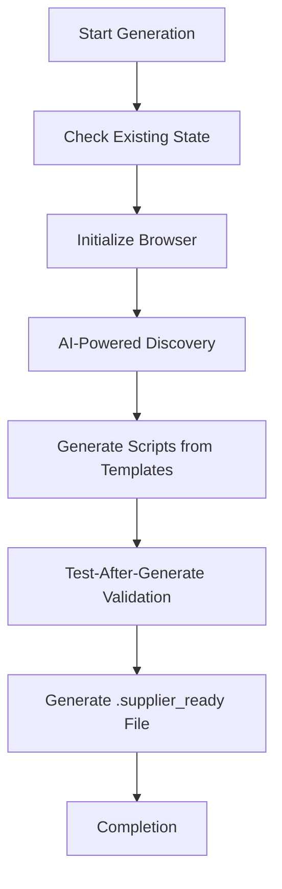
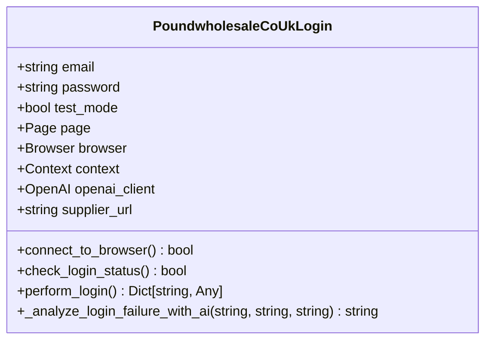
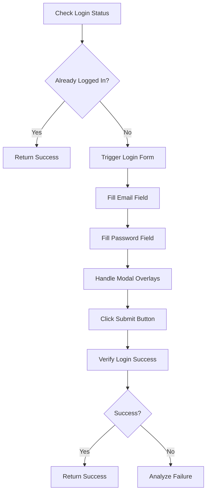
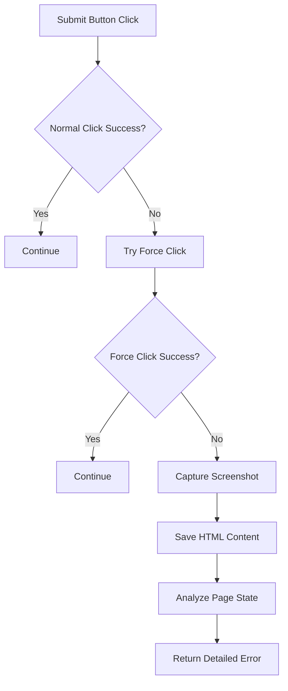
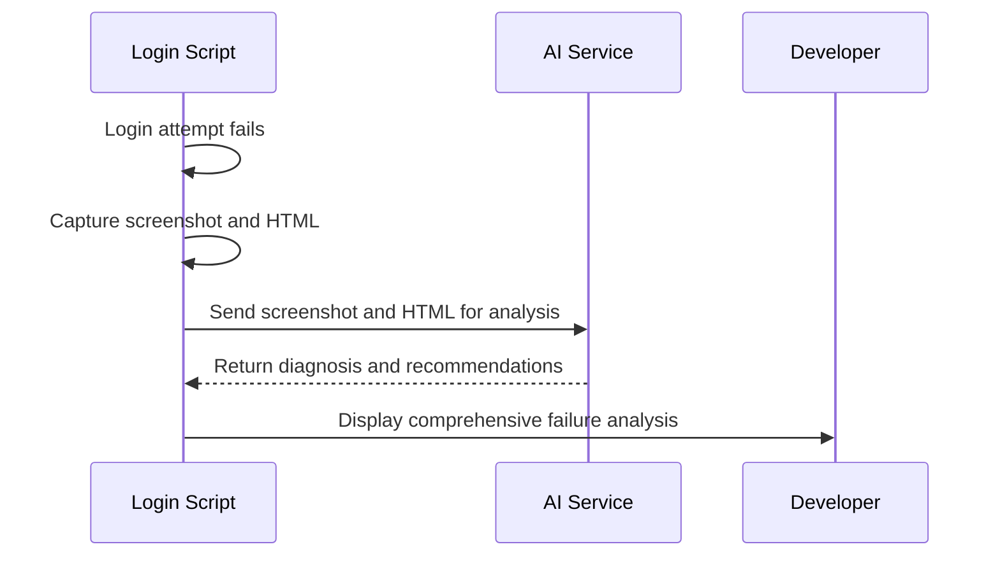

# Login Script Generation

<cite>
**Referenced Files in This Document**   
- [tools/supplier_script_generator.py](file://tools/supplier_script_generator.py)
- [config/supplier_configs/www.poundwholesale.co.uk.json](file://config/supplier_configs/www.poundwholesale.co.uk.json)
</cite>

## Table of Contents
1. [Introduction](#introduction)
2. [Login Script Generation Process](#login-script-generation-process)
3. [Structure of Generated login.py Script](#structure-of-generated-loginpy-script)
4. [Authentication Handling and Modal Overlay Management](#authentication-handling-and-modal-overlay-management)
5. [Error Recovery and Fallback Strategies](#error-recovery-and-fallback-strategies)
6. [AI-Powered Failure Diagnosis](#ai-powered-failure-diagnosis)
7. [Edge Case Handling](#edge-case-handling)
8. [Conclusion](#conclusion)

## Introduction
The IntelligentSupplierScriptGenerator class is responsible for creating supplier-specific automation scripts, with a critical focus on generating robust login scripts. This document details the implementation of the `_generate_login_script_template` method, which uses AI-powered discovery results to create customized login automation scripts. The system analyzes supplier websites to identify login elements and generates Python scripts that handle complex authentication workflows, including modal overlays, dynamic content, and error recovery.

**Section sources**
- [tools/supplier_script_generator.py](file://tools/supplier_script_generator.py#L339-L374)

## Login Script Generation Process
The login script generation process begins with AI-powered discovery of login elements on the supplier's website. The `_generate_login_script_template` method extracts selectors for email, password, and submit elements from the discovery results. These selectors are then embedded into a Python template that forms the basis of the generated login script. The method uses default selectors as fallbacks if specific selectors are not found during discovery, ensuring that the generated script can handle a wide range of website configurations.

The generation process follows a structured sequence: first checking existing state, initializing browser connection, conducting AI-powered discovery, generating scripts from templates, validating the generated scripts, and finally creating an intelligent .supplier_ready file. This comprehensive approach ensures that the generated login scripts are both accurate and reliable.

**Diagram sources**
- [tools/supplier_script_generator.py](file://tools/supplier_script_generator.py#L68-L99)
- [tools/supplier_script_generator.py](file://tools/supplier_script_generator.py#L98-L124)

**Section sources**
- [tools/supplier_script_generator.py](file://tools/supplier_script_generator.py#L314-L342)
- [tools/supplier_script_generator.py](file://tools/supplier_script_generator.py#L288-L317)

## Structure of Generated login.py Script
The generated login.py script follows a structured class-based approach, with the main class named according to the supplier ID. The script includes comprehensive configuration settings, including the supplier URL and CSS selectors for email, password, and submit elements. These selectors are dynamically populated from the AI discovery phase, allowing the script to target the specific elements on the supplier's login page.

The script implements a modular design with distinct methods for different aspects of the login process. The `perform_login` method orchestrates the entire login sequence, while specialized methods handle browser connection, login status verification, and failure analysis. The script also includes test mode functionality that provides enhanced error reporting when enabled, making it easier to diagnose and fix issues during development and validation.

**Diagram sources**
- [tools/supplier_script_generator.py](file://tools/supplier_script_generator.py#L339-L374)

**Section sources**
- [tools/supplier_script_generator.py](file://tools/supplier_script_generator.py#L339-L374)

## Authentication Handling and Modal Overlay Management
The login script implements sophisticated authentication handling that goes beyond simple form filling. It first attempts to detect if the user is already logged in by searching for logout indicators or account areas on the page. If not already logged in, the script tries to trigger the login form by clicking on various login triggers, including sign-in links and account buttons.

For websites with modal overlays, the script employs a multi-layered approach to handle these elements. It first attempts to dismiss modal overlays by clicking on common close buttons or backdrop elements. If this fails, the script uses JavaScript injection to forcibly hide overlay elements by manipulating their CSS properties, setting display to 'none', visibility to 'hidden', and pointerEvents to 'none'. This ensures that the login form is accessible even when obscured by modal overlays.

The script also enhances the visibility of the submit button by manipulating its z-index and position properties, ensuring it can be clicked even when partially obscured. This comprehensive approach to modal overlay management significantly increases the success rate of automated logins on complex websites.

**Diagram sources**
- [tools/supplier_script_generator.py](file://tools/supplier_script_generator.py#L466-L494)
- [tools/supplier_script_generator.py](file://tools/supplier_script_generator.py#L540-L567)
- [tools/supplier_script_generator.py](file://tools/supplier_script_generator.py#L564-L589)

**Section sources**
- [tools/supplier_script_generator.py](file://tools/supplier_script_generator.py#L493-L520)
- [tools/supplier_script_generator.py](file://tools/supplier_script_generator.py#L518-L542)

## Error Recovery and Fallback Strategies
The login script implements comprehensive error recovery mechanisms to handle various failure scenarios. When filling form fields, the script includes enhanced error handling that attempts to scroll elements into view and make them visible before interacting with them. If a password field exists but is not visible, the script attempts a "force fill" operation to input the credentials.

For submit button interaction, the script employs multiple fallback strategies. It first attempts a normal click, and if that fails, it tries a force click that bypasses certain browser protections. The script also checks for common login error indicators in the page text, such as "invalid," "incorrect," "captcha," or "two-factor," and returns detailed error information when these are detected.

In cases where the login attempt fails without clear error messages, the script captures a screenshot of the current page state and saves the HTML content for analysis. This information is crucial for diagnosing issues and understanding why the login process failed, providing valuable insights for debugging and script improvement.

**Diagram sources**
- [tools/supplier_script_generator.py](file://tools/supplier_script_generator.py#L615-L640)
- [tools/supplier_script_generator.py](file://tools/supplier_script_generator.py#L640-L664)

**Section sources**
- [tools/supplier_script_generator.py](file://tools/supplier_script_generator.py#L615-L640)
- [tools/supplier_script_generator.py](file://tools/supplier_script_generator.py#L640-L664)

## AI-Powered Failure Diagnosis
When login verification fails, the system employs AI-powered analysis to diagnose the cause of the failure. The `_analyze_login_failure_with_ai` method sends a screenshot of the current page state and a snippet of the HTML content to an AI service for analysis. This allows the system to understand complex failure scenarios that might not be apparent from simple error messages.

The AI analysis considers several factors, including the current state of the page, any visible error messages, whether login succeeded but verification logic failed, and whether additional steps like CAPTCHA solving or two-factor authentication are required. The AI provides actionable recommendations for resolving the issue, which are included in the failure analysis returned by the script.

This AI-powered diagnosis capability significantly enhances the system's ability to handle unexpected login scenarios and provides valuable insights for improving the login automation process. The combination of visual and textual analysis allows for a comprehensive understanding of the failure context, enabling more effective troubleshooting and resolution.

**Diagram sources**
- [tools/supplier_script_generator.py](file://tools/supplier_script_generator.py#L663-L686)
- [tools/supplier_script_generator.py](file://tools/supplier_script_generator.py#L710-L741)

**Section sources**
- [tools/supplier_script_generator.py](file://tools/supplier_script_generator.py#L685-L711)
- [tools/supplier_script_generator.py](file://tools/supplier_script_generator.py#L738-L773)

## Edge Case Handling
The login script is designed to handle various edge cases that commonly occur during login execution. For websites with CAPTCHA protection, the script detects the presence of CAPTCHA elements and returns appropriate error messages, indicating that manual intervention may be required. Similarly, for sites requiring two-factor authentication, the script identifies the need for additional verification steps and provides guidance on how to proceed.

The system also handles dynamic JavaScript content by waiting for the page to reach a stable state before attempting to interact with login elements. It uses Playwright's wait_for_load_state method to ensure that the DOM is fully loaded before proceeding with the login sequence. This prevents timing issues that could cause the script to fail when elements are not yet available.

For websites with complex authentication flows, the script includes logic to handle redirects that may occur after successful login. It checks the current URL after the login attempt and verifies the login status on the new page if a redirect has occurred. This ensures that the script can successfully authenticate even when the login process involves multiple steps or page transitions.

**Section sources**
- [tools/supplier_script_generator.py](file://tools/supplier_script_generator.py#L640-L664)
- [tools/supplier_script_generator.py](file://tools/supplier_script_generator.py#L663-L686)

## Conclusion
The login script generation component of the IntelligentSupplierScriptGenerator class represents a sophisticated solution for automating supplier authentication. By combining AI-powered discovery with comprehensive error handling and AI-assisted diagnosis, the system creates robust login scripts capable of handling a wide range of website configurations and authentication challenges. The modular design, fallback strategies, and edge case handling ensure high reliability and success rates, making it a critical component of the overall automation system.