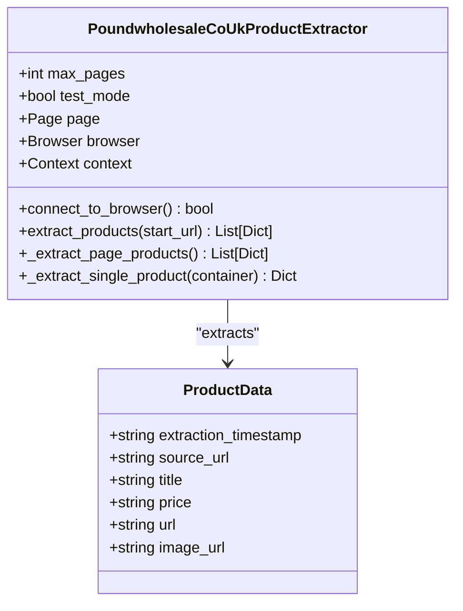
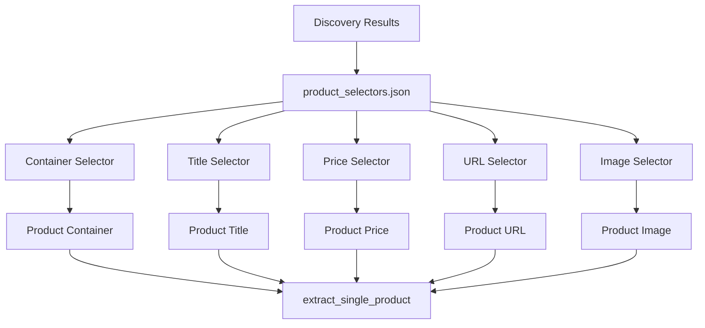
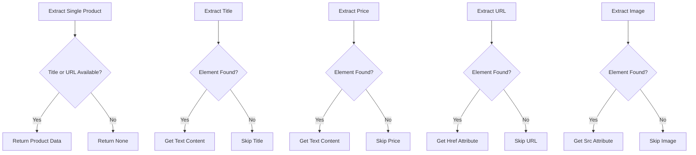

# Product Extractor Generation

<cite>
**Referenced Files in This Document**   
- [supplier_script_generator.py](file://tools/supplier_script_generator.py)
- [product_selectors.json](file://config/supplier_configs/poundwholesale-co-uk.json)
</cite>

## Table of Contents
1. [Introduction](#introduction)
2. [Product Extractor Template Generation Process](#product-extractor-template-generation-process)
3. [Template Structure and Components](#template-structure-and-components)
4. [Selector Configuration and Data Mapping](#selector-configuration-and-data-mapping)
5. [Dynamic Code Generation Mechanism](#dynamic-code-generation-mechanism)
6. [Error Handling Implementation](#error-handling-implementation)
7. [Edge Case Handling](#edge-case-handling)
8. [Validation and Testing](#validation-and-testing)

## Introduction
The product extractor generation component within the IntelligentSupplierScriptGenerator class is responsible for creating supplier-specific product extraction scripts. This system uses AI-powered discovery results from the VisionDiscoveryEngine to generate customized product_extractor.py scripts that can navigate supplier websites, extract product data, and handle various edge cases. The generated scripts are designed to be robust, maintainable, and supplier-specific, ensuring reliable product data extraction across different e-commerce platforms.

## Product Extractor Template Generation Process

The product extractor template generation process begins with the `_generate_product_extractor_template` method of the IntelligentSupplierScriptGenerator class. This method takes discovery results from the VisionDiscoveryEngine, which contains supplier-specific selectors for product elements. The process follows a systematic approach:

1. The VisionDiscoveryEngine analyzes the supplier website and identifies key selectors for product containers, titles, prices, URLs, and images
2. These selectors are saved to a product_selectors.json configuration file in the supplier's config directory
3. The _generate_product_extractor_template method reads these selectors and incorporates them into a Python script template
4. The generated script is saved as a supplier-specific product extractor

The template generation is part of a larger orchestration sequence that includes AI-powered discovery, script generation, validation testing, and intelligent state management. This ensures that each generated product extractor is specifically tailored to the target supplier's website structure.

**Section sources**
- [supplier_script_generator.py](file://tools/supplier_script_generator.py#L50-L1254)

## Template Structure and Components

The generated product extractor template follows a consistent structure with several key components:

**Diagram sources**
- [supplier_script_generator.py](file://tools/supplier_script_generator.py#L50-L1254)

The template includes several key methods:

- **connect_to_browser()**: Establishes connection to an existing Chrome debug instance
- **extract_products()**: Main method that orchestrates the extraction across multiple pages
- **_extract_page_products()**: Extracts all products from the current page
- **_extract_single_product()**: Extracts data from a single product container

The template also includes a test function for validation purposes, allowing the script to be tested independently before integration into the larger system.

**Section sources**
- [supplier_script_generator.py](file://tools/supplier_script_generator.py#L50-L1254)

## Selector Configuration and Data Mapping

The product extractor template incorporates configuration data from product_selectors.json to define the selectors for various product data fields. The system uses a hierarchical approach to selector definition:

**Diagram sources**
- [supplier_script_generator.py](file://tools/supplier_script_generator.py#L50-L1254)
- [poundwholesale-co-uk.json](file://config/supplier_configs/poundwholesale-co-uk.json#L32-L70)

The configuration includes:

- **Product container selector**: Identifies the container element that holds all product information
- **Title selector**: Extracts the product title from within the container
- **Price selector**: Captures the product price information
- **URL selector**: Extracts the product detail page URL
- **Image selector**: Retrieves the product image URL

These selectors are embedded directly into the extraction methods, allowing the script to target specific elements on the supplier's website. The system also includes fallback selectors to handle variations in website structure.

**Section sources**
- [supplier_script_generator.py](file://tools/supplier_script_generator.py#L50-L1254)
- [poundwholesale-co-uk.json](file://config/supplier_configs/poundwholesale-co-uk.json#L32-L70)

## Dynamic Code Generation Mechanism

The dynamic code generation mechanism creates supplier-specific class names and method implementations based on the supplier URL. When generating the product extractor script, the system:

1. Extracts the supplier domain from the URL
2. Converts the domain to a valid Python class name format
3. Uses string formatting to insert the class name into the template

For example, a supplier URL of "https://www.poundwholesale.co.uk" would generate a class named "PoundwholesaleCoUkProductExtractor". This ensures that each supplier has a unique, descriptive class name that follows Python naming conventions.

The generation process also incorporates dynamic configuration values into the script, including:

- SUPPLIER_URL: The base URL for the supplier
- CONTAINER_SELECTOR: The CSS selector for product containers
- TITLE_SELECTOR: The CSS selector for product titles
- PRICE_SELECTOR: The CSS selector for product prices
- URL_SELECTOR: The CSS selector for product URLs
- IMAGE_SELECTOR: The CSS selector for product images

This dynamic approach allows the system to generate highly customized extraction scripts without requiring manual coding for each new supplier.

**Section sources**
- [supplier_script_generator.py](file://tools/supplier_script_generator.py#L50-L1254)

## Error Handling Implementation

The product extractor template includes comprehensive error handling to manage missing or changed elements on supplier websites. The implementation follows a defensive programming approach with multiple layers of protection:

**Diagram sources**
- [supplier_script_generator.py](file://tools/supplier_script_generator.py#L50-L1254)

Key error handling features include:

- Try-except blocks around each extraction operation to prevent script termination
- Conditional checks for element existence before attempting extraction
- Graceful degradation when specific data fields are unavailable
- Logging of extraction failures for debugging purposes
- Validation that at least a title or URL is available before returning a product

This approach ensures that the extractor can continue processing even when some product data is missing or the website structure has changed slightly.

**Section sources**
- [supplier_script_generator.py](file://tools/supplier_script_generator.py#L50-L1254)

## Edge Case Handling

The product extractor template is designed to handle various edge cases commonly encountered in e-commerce websites:

### Pagination Handling
The template includes built-in pagination support through URL pattern manipulation. For suppliers that use query parameters for pagination (e.g., "?page=2"), the template automatically constructs the appropriate URLs for subsequent pages. The system limits the number of pages processed through the max_pages parameter, which can be adjusted based on requirements.

### Lazy-Loaded Content
For websites that use lazy loading for product images or other content, the template relies on Playwright's ability to interact with the browser and wait for content to load. The wait_for_load_state('domcontentloaded') method ensures that the page has finished its initial loading phase before extraction begins.

### Infinite Scroll
While the current implementation primarily handles traditional pagination, the architecture can be extended to support infinite scroll by incorporating scrolling behavior and detection of dynamically loaded content. This could be implemented by adding scroll commands and monitoring for new product containers appearing in the DOM.

### Dynamic Pricing
The template handles dynamic pricing by extracting the price text as it appears on the page. For suppliers that require login to view prices, the system relies on the login script to authenticate before product extraction begins. The price extraction is designed to capture the displayed price text, regardless of how it is delivered (static HTML, JavaScript, or AJAX calls).

**Section sources**
- [supplier_script_generator.py](file://tools/supplier_script_generator.py#L50-L1254)

## Validation and Testing

The generated product extractor scripts undergo automated validation and testing through the test-after-generate validation loop. This process includes:

1. Dynamic import of the generated script module
2. Execution of a test function with a limited number of pages
3. Verification of successful product extraction
4. AI-powered failure analysis if tests fail

The test function extracts a small number of products (typically 2-5) and returns detailed results including the count of extracted products and sample data. This allows for quick validation of the script's functionality without processing large amounts of data.

If the validation fails, the system performs AI-powered failure analysis by capturing a screenshot of the current page state and analyzing it to determine the likely cause of failure. This diagnostic capability helps identify issues such as changed selectors, blocked access, or unexpected page layouts.

**Section sources**
- [supplier_script_generator.py](file://tools/supplier_script_generator.py#L50-L1254)