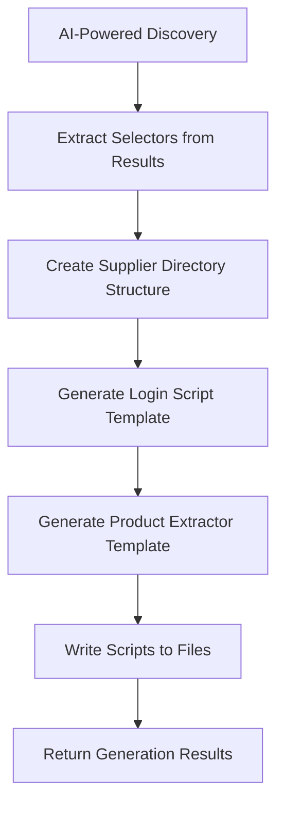
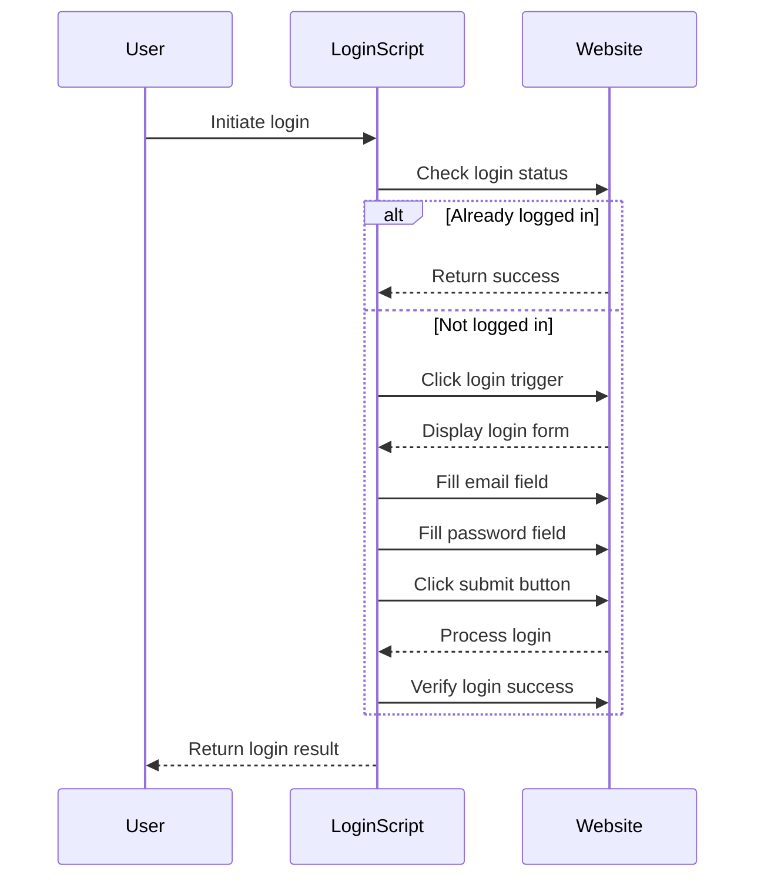
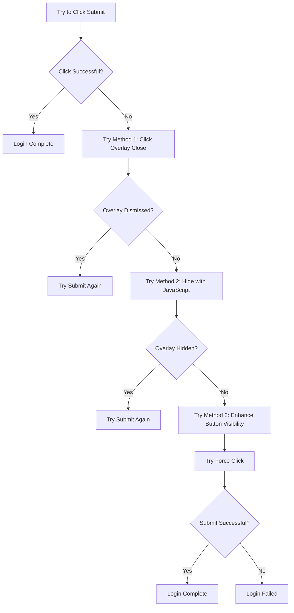
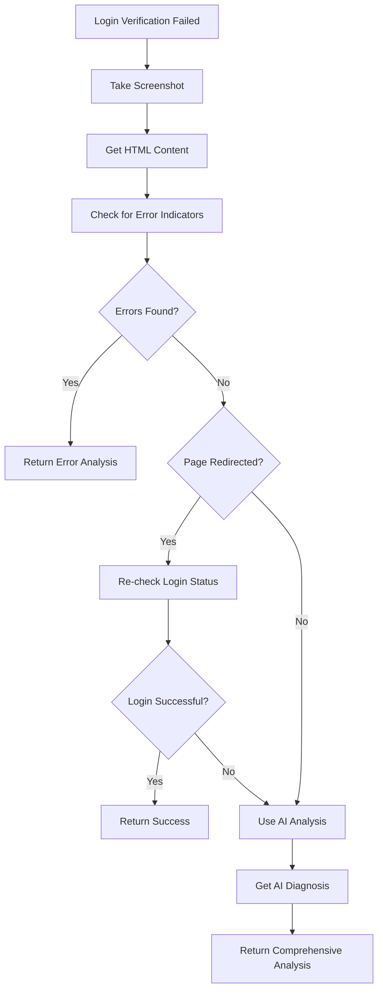
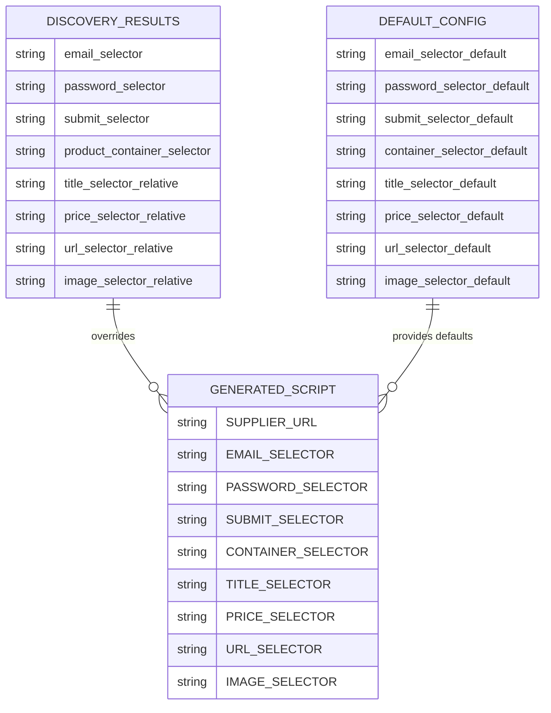
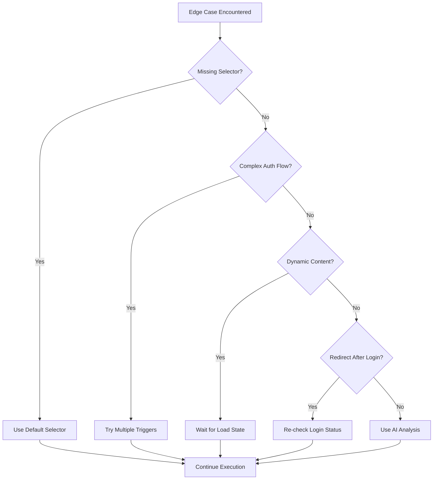

# Template Generation

<cite>
**Referenced Files in This Document**   
- [tools/supplier_script_generator.py](file://tools/supplier_script_generator.py)
- [config/supplier_configs/www.poundwholesale.co.uk.json](file://config/supplier_configs/www.poundwholesale.co.uk.json)
</cite>

## Table of Contents
1. [Introduction](#introduction)
2. [Template Generation Process](#template-generation-process)
3. [Generated Script Structure](#generated-script-structure)
4. [Authentication Handling](#authentication-handling)
5. [Modal Overlay Management](#modal-overlay-management)
6. [Error Recovery Mechanisms](#error-recovery-mechanisms)
7. [Configuration Integration](#configuration-integration)
8. [Dynamic Code Generation](#dynamic-code-generation)
9. [Edge Case Handling](#edge-case-handling)
10. [Conclusion](#conclusion)

## Introduction
The IntelligentSupplierScriptGenerator class implements a sophisticated template generation system that creates supplier-specific automation scripts based on AI-powered discovery results. This system generates two critical scripts for each supplier: a login.py script for authentication and a product_extractor.py script for data extraction. The template generation phase transforms discovered selectors and configuration data into fully functional Python scripts that can handle complex supplier website interactions, including authentication flows, modal overlays, and dynamic content. The system leverages dynamic code generation to create supplier-specific class names and method implementations, ensuring each supplier's scripts are uniquely tailored to their website structure.

**Section sources**
- [tools/supplier_script_generator.py](file://tools/supplier_script_generator.py#L1-L50)

## Template Generation Process
The template generation process is orchestrated by the `_generate_scripts_from_templates` method within the IntelligentSupplierScriptGenerator class. This method follows a systematic approach to create supplier-specific scripts based on discovery results. The process begins after AI-powered discovery has identified the necessary selectors for login elements and product data extraction. The generator creates a supplier-specific directory structure with separate config and scripts subdirectories. It then generates two Python scripts: one for login automation and another for product extraction. The login script is named using the supplier ID pattern `{supplier_id}_login.py`, while the product extractor follows the pattern `{supplier_id}_product_extractor.py`. Each script is populated with configuration data and selectors discovered during the previous phase, creating a customized automation solution for the specific supplier website.



**Diagram sources**
- [tools/supplier_script_generator.py](file://tools/supplier_script_generator.py#L314-L342)

**Section sources**
- [tools/supplier_script_generator.py](file://tools/supplier_script_generator.py#L314-L342)

## Generated Script Structure
The generated scripts follow a consistent structure that includes configuration, class definition, and test functionality. Both the login and product extractor scripts contain several key components: configuration constants at the top of the file, a supplier-specific class that encapsulates the automation logic, and test functions for validation. The login script contains the `perform_login` method that orchestrates the authentication sequence, while the product extractor includes the `extract_products` method for data collection. Each script also includes a test function that can be executed independently to validate the script's functionality. The structure is designed to be both functional and maintainable, with clear separation of concerns and comprehensive error handling throughout.

```mermaid
classDiagram
class LoginScript {
+SUPPLIER_URL : str
+EMAIL_SELECTOR : str
+PASSWORD_SELECTOR : str
+SUBMIT_SELECTOR : str
+{supplier_id}Login
+test_login()
}
class ProductExtractorScript {
+SUPPLIER_URL : str
+CONTAINER_SELECTOR : str
+TITLE_SELECTOR : str
+PRICE_SELECTOR : str
+URL_SELECTOR : str
+IMAGE_SELECTOR : str
+{supplier_id}ProductExtractor
+test_extraction()
}
LoginScript --> LoginScript : "Contains"
ProductExtractorScript --> ProductExtractorScript : "Contains"
```

**Diagram sources**
- [tools/supplier_script_generator.py](file://tools/supplier_script_generator.py#L345-L795)
- [tools/supplier_script_generator.py](file://tools/supplier_script_generator.py#L797-L1013)

**Section sources**
- [tools/supplier_script_generator.py](file://tools/supplier_script_generator.py#L345-L795)
- [tools/supplier_script_generator.py](file://tools/supplier_script_generator.py#L797-L1013)

## Authentication Handling
The authentication handling in the generated login scripts is comprehensive and designed to handle various login scenarios. The `perform_login` method first checks the current login status by looking for logout indicators or account areas on the page. If not already logged in, it attempts to trigger the login modal or form by clicking on various login triggers such as "Sign in" links in headers or navigation elements. The method then fills the email and password fields using selectors discovered during the AI-powered discovery phase. The script includes enhanced error handling for password field visibility, attempting to scroll the element into view and using force fill if necessary. After submitting the credentials, the script verifies login success by checking for logout indicators or account areas, ensuring the authentication was successful.



**Diagram sources**
- [tools/supplier_script_generator.py](file://tools/supplier_script_generator.py#L345-L795)

**Section sources**
- [tools/supplier_script_generator.py](file://tools/supplier_script_generator.py#L345-L795)

## Modal Overlay Management
The system implements sophisticated modal overlay management to handle common obstacles during the login process. The login script employs a three-pronged approach to deal with modal overlays that might block the submit button. First, it attempts to dismiss modal overlays by clicking on common close selectors such as ".modals-overlay", ".modal-backdrop", or close buttons. If this fails, the script tries to hide the overlays using JavaScript by setting their display property to 'none' and visibility to 'hidden'. As a third approach, it enhances the submit button's visibility by modifying its z-index and position properties through JavaScript execution. The script also implements a force click mechanism as a fallback if normal clicking fails, ensuring the submit action can proceed even when obstructed by overlays.



**Diagram sources**
- [tools/supplier_script_generator.py](file://tools/supplier_script_generator.py#L345-L795)

**Section sources**
- [tools/supplier_script_generator.py](file://tools/supplier_script_generator.py#L345-L795)

## Error Recovery Mechanisms
The system incorporates robust error recovery mechanisms to handle various failure scenarios during script execution. When login verification fails, the script initiates a comprehensive analysis process that captures a screenshot of the current page state and retrieves the HTML content for examination. It checks for common error indicators such as "invalid," "incorrect," "captcha," or "security" in the page text. If the page redirects after submission, it re-checks the login status on the new page. For cases where no clear error indicators are found, the script leverages AI analysis by sending the screenshot and HTML snippet to an AI service for diagnosis. The AI provides actionable insights on what went wrong and suggests next steps, creating a powerful feedback loop for troubleshooting authentication issues.



**Diagram sources**
- [tools/supplier_script_generator.py](file://tools/supplier_script_generator.py#L345-L795)

**Section sources**
- [tools/supplier_script_generator.py](file://tools/supplier_script_generator.py#L345-L795)

## Configuration Integration
Configuration data from supplier_configs is seamlessly integrated into the generated templates through a hierarchical approach. The system first loads default selectors for common elements like email fields, password fields, and submit buttons. It then overlays these defaults with supplier-specific selectors discovered during the AI-powered discovery phase. The configuration integration occurs in the `_generate_login_script_template` and `_generate_product_extractor_template` methods, where selectors from the discovery results are extracted and used to populate the script templates. For the product extractor, the system uses configuration data to determine selectors for product containers, titles, prices, URLs, and images. This approach ensures that the generated scripts are customized to the specific supplier's website structure while maintaining fallback options if discovered selectors fail.



**Diagram sources**
- [tools/supplier_script_generator.py](file://tools/supplier_script_generator.py#L345-L795)
- [tools/supplier_script_generator.py](file://tools/supplier_script_generator.py#L797-L1013)
- [config/supplier_configs/www.poundwholesale.co.uk.json](file://config/supplier_configs/www.poundwholesale.co.uk.json#L1-L65)

**Section sources**
- [tools/supplier_script_generator.py](file://tools/supplier_script_generator.py#L345-L795)
- [tools/supplier_script_generator.py](file://tools/supplier_script_generator.py#L797-L1013)
- [config/supplier_configs/www.poundwholesale.co.uk.json](file://config/supplier_configs/www.poundwholesale.co.uk.json#L1-L65)

## Dynamic Code Generation
Dynamic code generation plays a crucial role in creating supplier-specific class names and method implementations. The system uses the supplier ID to generate unique class names by replacing hyphens with underscores and capitalizing the first letter of each component. For example, a supplier with ID "poundwholesale-co-uk" would have a login class named "PoundwholesaleCoUkLogin". This dynamic naming ensures that each supplier's scripts have unique class names, preventing conflicts when multiple supplier scripts are used together. The code generation also dynamically creates method implementations by embedding discovered selectors into the script templates using Python's f-string formatting. This approach allows the system to generate fully functional scripts with minimal code duplication, as the same template can be used for all suppliers with only the configuration values changing.

```mermaid
classDiagram
class IntelligentSupplierScriptGenerator {
+supplier_id : str
+_generate_login_script_template()
+_generate_product_extractor_template()
}
class LoginScriptTemplate {
+{supplier_id}Login
+perform_login()
+check_login_status()
}
class ProductExtractorTemplate {
+{supplier_id}ProductExtractor
+extract_products()
+_extract_page_products()
}
IntelligentSupplierScriptGenerator --> LoginScriptTemplate : "Generates"
IntelligentSupplierScriptGenerator --> ProductExtractorTemplate : "Generates"
LoginScriptTemplate --> LoginScriptTemplate : "Dynamic class name"
ProductExtractorTemplate --> ProductExtractorTemplate : "Dynamic class name"
```

**Diagram sources**
- [tools/supplier_script_generator.py](file://tools/supplier_script_generator.py#L345-L795)
- [tools/supplier_script_generator.py](file://tools/supplier_script_generator.py#L797-L1013)

**Section sources**
- [tools/supplier_script_generator.py](file://tools/supplier_script_generator.py#L345-L795)
- [tools/supplier_script_generator.py](file://tools/supplier_script_generator.py#L797-L1013)

## Edge Case Handling
The system demonstrates sophisticated edge case handling capabilities to address common challenges in web automation. For missing selectors, the system implements a fallback mechanism that uses default selectors when discovered ones are unavailable. In cases of complex authentication flows, the login script attempts multiple login triggers and modal triggers to ensure the login form is displayed. For dynamic JavaScript content, the script includes wait statements and timeout handling to allow content to load before interacting with elements. The system also handles cases where login success might not be immediately verifiable by checking for redirects and re-evaluating login status on the new page. Additionally, the AI-powered failure analysis provides a safety net for unexpected edge cases by leveraging AI to diagnose issues that the script cannot automatically resolve.



**Diagram sources**
- [tools/supplier_script_generator.py](file://tools/supplier_script_generator.py#L345-L795)
- [tools/supplier_script_generator.py](file://tools/supplier_script_generator.py#L797-L1013)

**Section sources**
- [tools/supplier_script_generator.py](file://tools/supplier_script_generator.py#L345-L795)
- [tools/supplier_script_generator.py](file://tools/supplier_script_generator.py#L797-L1013)

## Conclusion
The template generation phase in the IntelligentSupplierScriptGenerator class represents a sophisticated system for creating supplier-specific automation scripts. By leveraging AI-powered discovery results, the system generates customized login and product extraction scripts that are tailored to each supplier's unique website structure. The generated scripts incorporate advanced features such as comprehensive authentication handling, modal overlay management, and robust error recovery mechanisms. Configuration data from supplier_configs is seamlessly integrated into the templates, ensuring that discovered selectors are properly utilized. Dynamic code generation enables the creation of supplier-specific class names and method implementations, while sophisticated edge case handling ensures reliability across various website configurations. This approach creates a flexible and maintainable system for automating interactions with diverse supplier websites, forming a critical component of the overall Amazon FBA agent system.