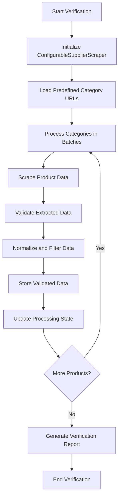
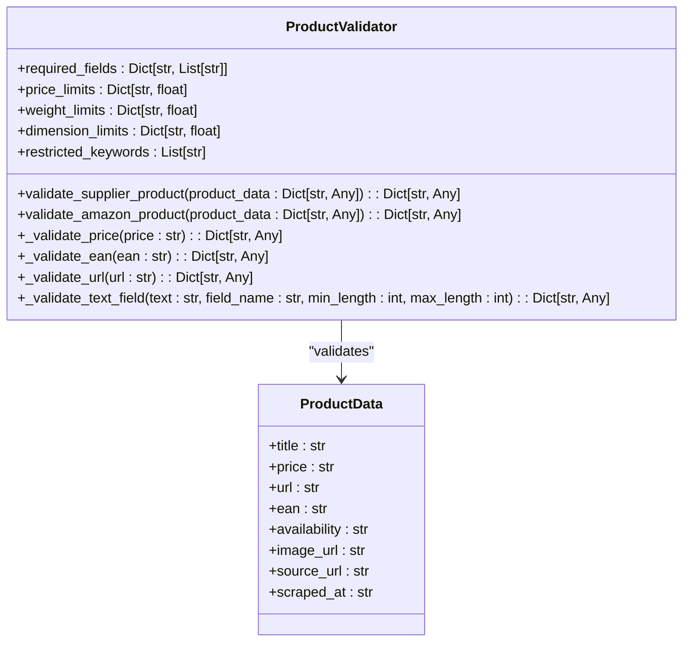
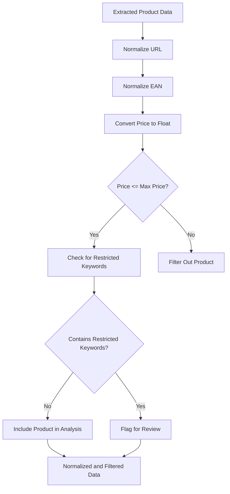
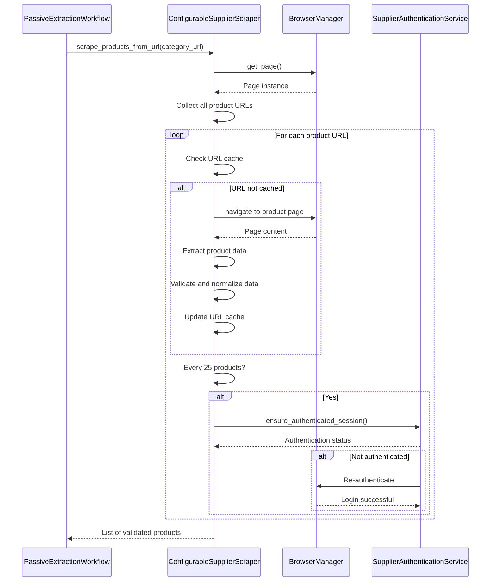
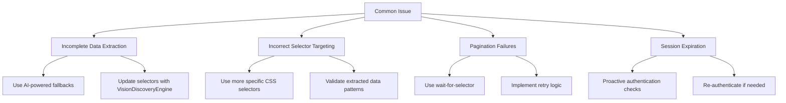

# Product Extraction Verification

<cite>
**Referenced Files in This Document**   
- [configurable_supplier_scraper.py](file://tools/configurable_supplier_scraper.py)
- [product_validator.py](file://tools/legacy_utils/product_validator.py)
- [passive_extraction_workflow_latest.py](file://tools/passive_extraction_workflow_latest.py)
- [supplier_script_generator.py](file://tools/supplier_script_generator.py)
</cite>

## Table of Contents
1. [Introduction](#introduction)
2. [Verification Process Overview](#verification-process-overview)
3. [Key Product Attribute Validation](#key-product-attribute-validation)
4. [Data Normalization and Filtering](#data-normalization-and-filtering)
5. [End-to-End Testing Integration](#end-to-end-testing-integration)
6. [Common Issues and Resolution Strategies](#common-issues-and-resolution-strategies)
7. [Conclusion](#conclusion)

## Introduction
The Product Extraction Verification phase is a critical component of the validation testing process for the Amazon FBA Agent System. This phase ensures that the generated product extractor scripts accurately and reliably extract product data from supplier websites. The verification process involves executing the extractor script against sample product pages and rigorously validating the quality of the extracted data. This document details the comprehensive verification methodology, focusing on the validation of key product attributes such as title, price, EAN, and availability. It also covers the system's data normalization and filtering processes, its integration with the configurable_supplier_scraper.py for end-to-end testing, and strategies for addressing common extraction issues.

## Verification Process Overview
The product extraction verification process is designed to validate the accuracy and reliability of the data extracted by the system's product extractor scripts. This process begins with the execution of the generated script against a set of sample product pages from the target supplier website. The system then captures the extracted data and subjects it to a series of validation checks to ensure its quality and completeness.

The verification workflow is orchestrated by the `PassiveExtractionWorkflow` class, which manages the entire extraction and validation process. The workflow first initializes the `ConfigurableSupplierScraper` to handle the browser automation and data extraction tasks. It then proceeds to scrape product data from predefined category URLs, processing them in configurable batches to ensure memory efficiency and system stability. The extracted data is then passed through a series of validation and normalization steps before being stored and analyzed.

The verification process is stateful, meaning it can be interrupted and resumed without losing progress. This is achieved through the use of an `EnhancedStateManager` that tracks the index of the last processed product. This stateful capability is essential for long-running verification tasks, allowing the system to pick up where it left off in the event of an interruption. The process also includes integrated authentication and retry mechanisms, enabling it to detect and recover from authentication failures during a run.

**Diagram sources**
- [passive_extraction_workflow_latest.py](file://tools/passive_extraction_workflow_latest.py#L851-L2650)
- [configurable_supplier_scraper.py](file://tools/configurable_supplier_scraper.py#L1-L3938)

**Section sources**
- [passive_extraction_workflow_latest.py](file://tools/passive_extraction_workflow_latest.py#L851-L2650)
- [configurable_supplier_scraper.py](file://tools/configurable_supplier_scraper.py#L1-L3938)

## Key Product Attribute Validation
The verification process places a strong emphasis on validating the accuracy of key product attributes, including title, price, EAN, and availability. Each of these attributes is critical for the subsequent financial analysis and profitability assessment of the products.

The **title** of a product is validated to ensure it is not missing and meets minimum length requirements. The system checks that the title is a non-empty string and contains at least five characters, which helps to filter out incomplete or malformed data. Additionally, the title is checked for restricted keywords that might indicate a product is not suitable for Amazon FBA, such as "battery" or "weapon."

The **price** attribute is validated to ensure it is a valid numeric value within an acceptable range. The system converts the extracted price string to a float and checks that it falls between the configured minimum and maximum price limits. Products with prices outside this range are filtered out to ensure only potentially profitable items are considered. The price validation also includes checks for invalid or missing prices, which can indicate issues with the extraction selectors.

The **EAN** (European Article Number) is a critical identifier for product matching on Amazon. The system validates the EAN to ensure it is a 13-digit numeric string and that its checksum is correct. This validation is performed by the `ProductValidator` class, which uses a standard algorithm to verify the integrity of the EAN code. An invalid EAN can lead to failed product matches on Amazon, so this validation step is essential for ensuring data quality.

The **availability** of a product is also validated to ensure it is correctly identified as either "in stock" or "out of stock." The system checks the extracted availability text against known patterns for available and unavailable products. This information is crucial for determining whether a product is currently available for purchase from the supplier.

**Diagram sources**
- [product_validator.py](file://tools/legacy_utils/product_validator.py#L1-L579)
- [configurable_supplier_scraper.py](file://tools/configurable_supplier_scraper.py#L1-L3938)

**Section sources**
- [product_validator.py](file://tools/legacy_utils/product_validator.py#L1-L579)
- [configurable_supplier_scraper.py](file://tools/configurable_supplier_scraper.py#L1-L3938)

## Data Normalization and Filtering
Data normalization and filtering are essential steps in the product extraction verification process, ensuring that the extracted data is consistent, clean, and ready for analysis. The system employs a series of normalization techniques to standardize the data format and remove inconsistencies.

One of the primary normalization tasks is **URL normalization**. The system uses the `normalize_url` function from the `utils.normalization` module to standardize product URLs. This function converts URLs to lowercase and removes trailing slashes, ensuring that duplicate URLs are correctly identified and filtered out. This is particularly important for preventing the same product from being processed multiple times.

**EAN normalization** is another critical step. The system uses the `normalize_ean` function to clean and standardize EAN codes. This function removes any non-numeric characters from the EAN string and ensures it is exactly 13 digits long. This normalization helps to ensure that EAN-based product matching on Amazon is accurate and reliable.

The system also applies **price filtering** based on configurable thresholds. After extracting the price, the system converts it to a float and compares it to the maximum price limit defined in the system configuration. Products with prices exceeding this limit are filtered out, as they are unlikely to be profitable after accounting for Amazon fees and shipping costs. This filtering step helps to focus the analysis on products with the highest potential return on investment.

In addition to these automated normalization and filtering steps, the system also performs **manual validation** of the extracted data. This includes checking for restricted keywords in the product title and description, which can indicate that a product is not suitable for Amazon FBA. The system maintains a list of restricted keywords related to hazardous materials, weapons, adult content, and counterfeit goods, and flags any products that contain these terms for further review.

**Diagram sources**
- [configurable_supplier_scraper.py](file://tools/configurable_supplier_scraper.py#L1-L3938)
- [utils/normalization.py](file://utils/normalization.py#L1-L100)

**Section sources**
- [configurable_supplier_scraper.py](file://tools/configurable_supplier_scraper.py#L1-L3938)
- [utils/normalization.py](file://utils/normalization.py#L1-L100)

## End-to-End Testing Integration
The product extraction verification process is tightly integrated with the `configurable_supplier_scraper.py` module, enabling comprehensive end-to-end testing of the product data extraction workflow. This integration allows the system to test the entire extraction process, from initial page navigation to final data validation, in a single, cohesive operation.

The `ConfigurableSupplierScraper` class is responsible for managing the browser automation and data extraction tasks. It uses Playwright to control a Chrome browser instance, providing robust support for JavaScript-heavy websites and anti-bot evasion techniques. The scraper is configured with externalized selector configurations, allowing it to adapt to different supplier website layouts without requiring code changes.

One of the key features of the end-to-end testing integration is **pagination handling**. The system is designed to navigate through multiple pages of a product category, extracting data from each page in sequence. The `scrape_products_from_url` method in the `ConfigurableSupplierScraper` class is responsible for this task. It first collects all product URLs from the paginated category pages and then visits each individual product page to extract detailed data. This ensures that the verification process covers a representative sample of products from the supplier site.

**URL filtering** is another important aspect of the end-to-end testing integration. The system uses the `url_cache_filter` module to filter out URLs that have already been processed or cached. This prevents the system from re-scraping the same products and ensures that the verification process is efficient and focused on new data. The URL filter checks both the local cache and the linking map to identify already-processed products.

The integration also includes **proactive authentication checks** to ensure that the browser session remains authenticated throughout the extraction process. The system performs an authentication check every 25 products to verify that the login session is still active. If the session has expired, the system triggers a re-authentication process to restore access to the supplier site. This feature is critical for long-running verification tasks, where session timeouts are a common issue.

**Diagram sources**
- [configurable_supplier_scraper.py](file://tools/configurable_supplier_scraper.py#L1-L3938)
- [passive_extraction_workflow_latest.py](file://tools/passive_extraction_workflow_latest.py#L851-L2650)
- [supplier_authentication_service.py](file://tools/supplier_authentication_service.py#L1-L100)

**Section sources**
- [configurable_supplier_scraper.py](file://tools/configurable_supplier_scraper.py#L1-L3938)
- [passive_extraction_workflow_latest.py](file://tools/passive_extraction_workflow_latest.py#L851-L2650)

## Common Issues and Resolution Strategies
Despite the robust design of the product extraction verification system, several common issues can arise during the extraction process. Understanding these issues and their resolution strategies is essential for maintaining the reliability and accuracy of the system.

**Incomplete data extraction** is a frequent problem, often caused by changes in the supplier website's HTML structure. When the extraction selectors no longer match the expected elements, the system may fail to extract certain attributes, such as price or EAN. To resolve this issue, the system employs AI-powered fallbacks to dynamically discover and update the selectors. The `VisionDiscoveryEngine` can analyze the page structure and suggest new selectors, which are then validated through a test-after-generate loop.

**Incorrect selector targeting** can lead to the extraction of data from the wrong elements on the page. This can result in inaccurate or irrelevant data being captured. The resolution strategy involves using more specific and robust CSS selectors that uniquely identify the target elements. The system also validates the extracted data against expected patterns and quality thresholds, flagging any anomalies for manual review.

**Pagination failures** occur when the system is unable to navigate through multiple pages of a product category. This can be caused by dynamic loading of content via JavaScript or changes in the pagination controls. The resolution strategy involves using Playwright's wait-for-selector functionality to ensure that the pagination controls are fully loaded before attempting to click them. The system also implements retry logic with exponential backoff to handle temporary network issues or server delays.

Another common issue is **session expiration** during long-running extraction tasks. When the browser session times out, the system loses access to authenticated content on the supplier site. The resolution strategy involves implementing proactive authentication checks at regular intervals. The system verifies the login status every 25 products and triggers a re-authentication process if necessary, ensuring that the extraction can continue uninterrupted.

**Diagram sources**
- [supplier_script_generator.py](file://tools/supplier_script_generator.py#L1-L1304)
- [configurable_supplier_scraper.py](file://tools/configurable_supplier_scraper.py#L1-L3938)
- [passive_extraction_workflow_latest.py](file://tools/passive_extraction_workflow_latest.py#L851-L2650)

**Section sources**
- [supplier_script_generator.py](file://tools/supplier_script_generator.py#L1-L1304)
- [configurable_supplier_scraper.py](file://tools/configurable_supplier_scraper.py#L1-L3938)

## Conclusion
The Product Extraction Verification phase is a comprehensive and robust process that ensures the accuracy and reliability of the data extracted by the Amazon FBA Agent System. By validating key product attributes, normalizing and filtering data, and integrating with the configurable_supplier_scraper.py for end-to-end testing, the system provides a high level of confidence in the quality of the extracted data. The resolution strategies for common issues such as incomplete data extraction, incorrect selector targeting, and pagination failures further enhance the system's reliability and resilience. This thorough verification process is essential for identifying profitable products and making informed sourcing decisions.