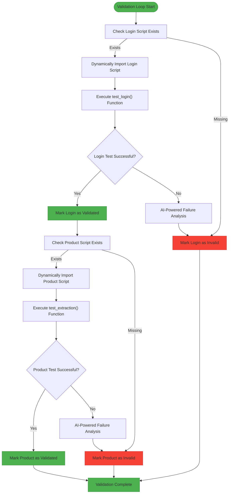
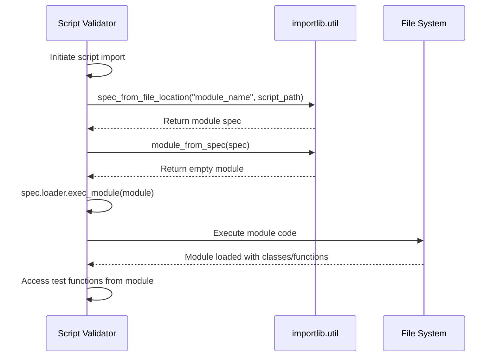
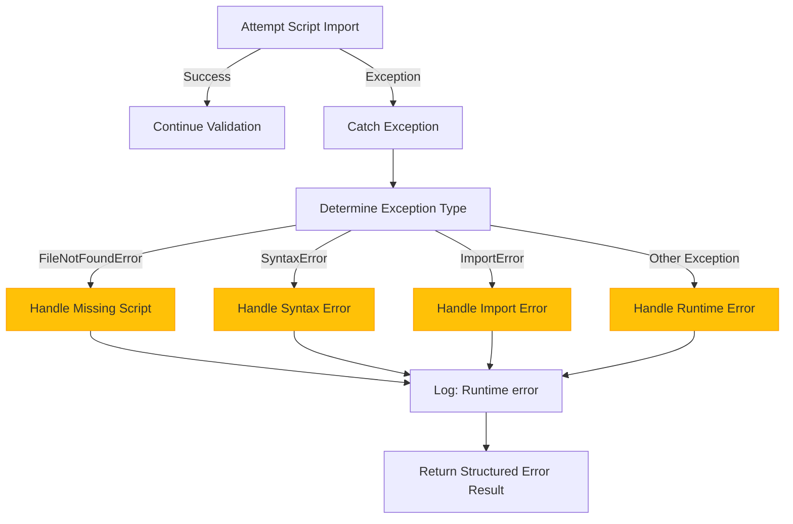

# Script Import Testing

<cite>
**Referenced Files in This Document**  
- [tools/supplier_script_generator.py](file://tools/supplier_script_generator.py)
</cite>

## Table of Contents
1. [Introduction](#introduction)
2. [Script Import Testing Process](#script-import-testing-process)
3. [Dynamic Import Mechanism](#dynamic-import-mechanism)
4. [Validation of Script Existence](#validation-of-script-existence)
5. [Error Handling for Missing or Malformed Scripts](#error-handling-for-missing-or-malformed-scripts)
6. [Verification of Successful Module Loading](#verification-of-successful-module-loading)
7. [Common Issues and Resolution Strategies](#common-issues-and-resolution-strategies)
8. [Conclusion](#conclusion)

## Introduction
The IntelligentSupplierScriptGenerator class implements a robust validation loop that includes dynamic import testing of generated login and product extractor scripts. This document details the script import testing phase, focusing on how the system uses Python's `importlib.util.spec_from_file_location` and `exec_module` to dynamically load and validate generated scripts. The process ensures that all generated scripts are syntactically correct, properly structured, and functionally valid before being marked as ready for use.

**Section sources**
- [tools/supplier_script_generator.py](file://tools/supplier_script_generator.py#L50-L1304)

## Script Import Testing Process
The script import testing phase is a critical component of the validation loop within the IntelligentSupplierScriptGenerator class. This process occurs after the generation of supplier-specific login and product extraction scripts and before the creation of the `.supplier_ready` file. The validation loop ensures that both the login and product extractor scripts can be successfully imported and executed.

The testing process is orchestrated through the `_test_after_generate_validation` method, which sequentially validates both script types. For each script, the system performs existence checks, dynamic import operations, and functional testing using predefined test functions embedded within the generated scripts.

**Diagram sources**
- [tools/supplier_script_generator.py](file://tools/supplier_script_generator.py#L50-L1304)

**Section sources**
- [tools/supplier_script_generator.py](file://tools/supplier_script_generator.py#L50-L1304)

## Dynamic Import Mechanism
The system employs Python's `importlib` module to dynamically import generated scripts during the validation phase. This approach allows the system to load and execute scripts that are generated at runtime without requiring them to be in the Python path or installed as packages.

The dynamic import process uses two key components: `importlib.util.spec_from_file_location` and `importlib.util.module_from_spec`. First, `spec_from_file_location` creates a module specification based on the file path of the generated script. This specification contains all the information needed to load the module. Then, `module_from_spec` creates an empty module object based on this specification.

**Diagram sources**
- [tools/supplier_script_generator.py](file://tools/supplier_script_generator.py#L50-L1304)

**Section sources**
- [tools/supplier_script_generator.py](file://tools/supplier_script_generator.py#L50-L1304)

## Validation of Script Existence
Before attempting to import a generated script, the system validates its existence on the filesystem. This check prevents errors that would occur from attempting to import non-existent files and provides early feedback about potential generation issues.

The validation is performed using standard file system operations through Python's `pathlib.Path` class. The system constructs the expected script path based on the supplier ID and predefined directory structure, then checks if the file exists using the `exists()` method. If the file does not exist, the validation fails immediately, and the system records the failure in the validation results.

The existence check is implemented in both `_test_login_script` and `_test_product_script` methods, which are responsible for validating the respective script types. These methods first verify the script's presence before proceeding with the import process, ensuring that only existing files are processed.

**Section sources**
- [tools/supplier_script_generator.py](file://tools/supplier_script_generator.py#L50-L1304)

## Error Handling for Missing or Malformed Scripts
The system implements comprehensive error handling for both missing and malformed scripts. When a script is missing, the validation process returns a structured error response indicating that the script was not found. This allows the system to distinguish between generation failures and import/execution failures.

For malformed scripts, the system uses try-except blocks to catch exceptions that occur during the import and execution phases. Common exceptions include `SyntaxError` for scripts with invalid Python syntax, `ImportError` for issues with the import process itself, and various runtime exceptions that may occur during test function execution.

When an error occurs, the system captures the exception details and returns them in a standardized error format. This information is used to populate the validation results and, in the case of failures, trigger AI-powered failure analysis to diagnose the root cause and suggest potential fixes.

**Diagram sources**
- [tools/supplier_script_generator.py](file://tools/supplier_script_generator.py#L50-L1304)

**Section sources**
- [tools/supplier_script_generator.py](file://tools/supplier_script_generator.py#L50-L1304)

## Verification of Successful Module Loading
After successfully importing a script, the system verifies that the module was loaded correctly by executing test functions embedded within the generated scripts. Each generated script includes a test function (`test_login` for login scripts and `test_extraction` for product extractor scripts) that validates the core functionality of the script.

The verification process involves calling these test functions with appropriate parameters and evaluating their return values. For login scripts, the test uses dummy credentials to verify that the login sequence can be executed. For product extractor scripts, the test attempts to extract products from a specified number of pages.

The system considers a script successfully validated only if both the import process completes without errors and the test function returns a successful result. This two-step verification ensures that scripts are not only syntactically correct but also functionally sound.

**Section sources**
- [tools/supplier_script_generator.py](file://tools/supplier_script_generator.py#L50-L1304)

## Common Issues and Resolution Strategies
The script import testing phase addresses several common issues that can occur with dynamically generated scripts:

### Incorrect File Paths
Issue: Generated scripts are saved to incorrect locations, preventing successful import.
Resolution: The system uses a consistent directory structure based on the supplier ID, with scripts stored in `suppliers/{supplier_id}/scripts/`. The IntelligentSupplierScriptGenerator class maintains references to these paths throughout the validation process.

### Syntax Errors in Generated Code
Issue: AI-generated code may contain syntax errors that prevent successful import.
Resolution: The system's error handling captures syntax errors during the import phase and reports them in the validation results. Additionally, the AI-powered failure analysis can help identify and correct these issues.

### Module Loading Conflicts
Issue: Conflicts may arise when multiple scripts are loaded or when there are naming collisions.
Resolution: The system uses unique module names based on the supplier ID and employs isolated import operations for each script. The dynamic import process creates separate module objects for each script, preventing namespace pollution.

### Dependency Issues
Issue: Generated scripts may reference modules that are not available in the execution environment.
Resolution: The generated scripts include explicit import statements for all required dependencies, and the system ensures that the execution environment contains all necessary packages.

These issues are systematically addressed through the validation loop, with failures triggering AI-powered analysis to diagnose and suggest solutions.

**Section sources**
- [tools/supplier_script_generator.py](file://tools/supplier_script_generator.py#L50-L1304)

## Conclusion
The script import testing phase in the IntelligentSupplierScriptGenerator class provides a robust mechanism for validating dynamically generated scripts. By using Python's `importlib` module, the system can dynamically import and test scripts without requiring them to be pre-installed or manually added to the Python path. The validation process includes existence checks, dynamic import operations, and functional testing, ensuring that only properly formed and functional scripts are marked as ready for use. Comprehensive error handling and AI-powered failure analysis enable the system to identify and address issues with generated scripts, maintaining the reliability and accuracy of the automation process.

**Section sources**
- [tools/supplier_script_generator.py](file://tools/supplier_script_generator.py#L50-L1304)