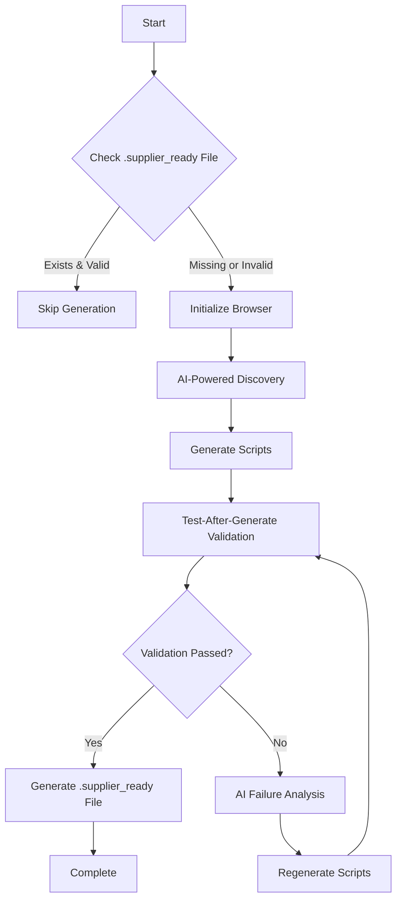
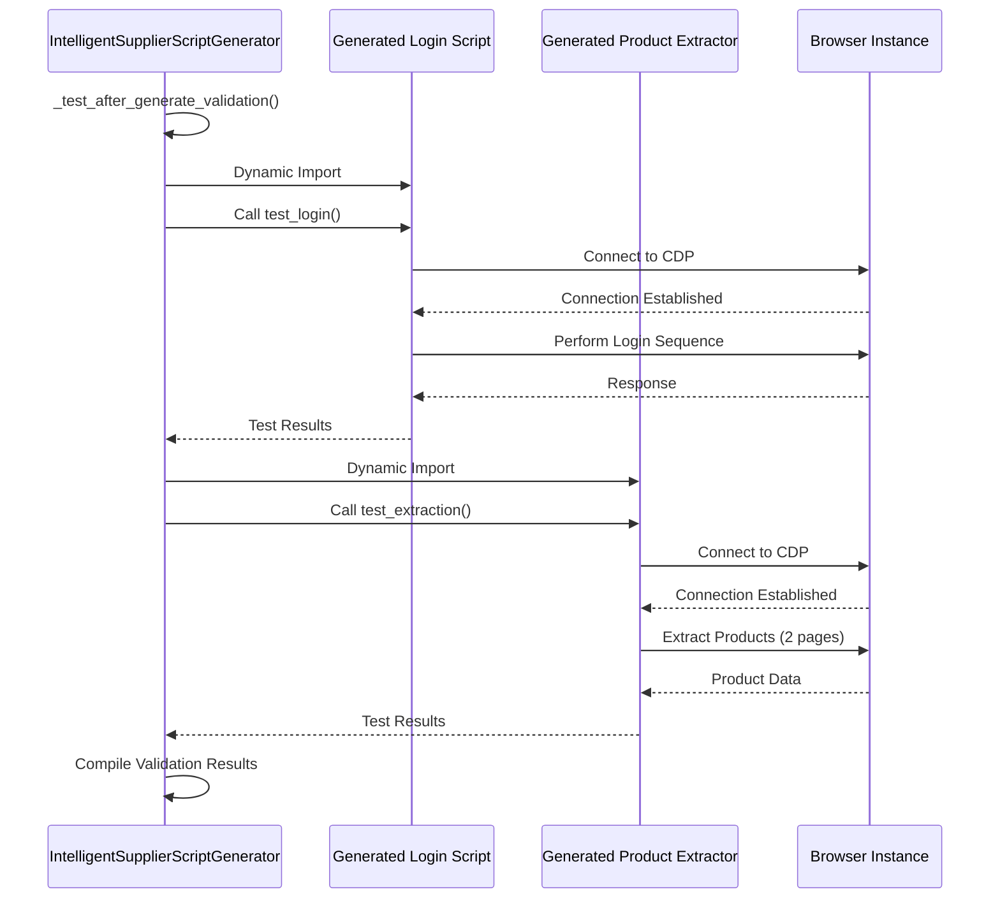
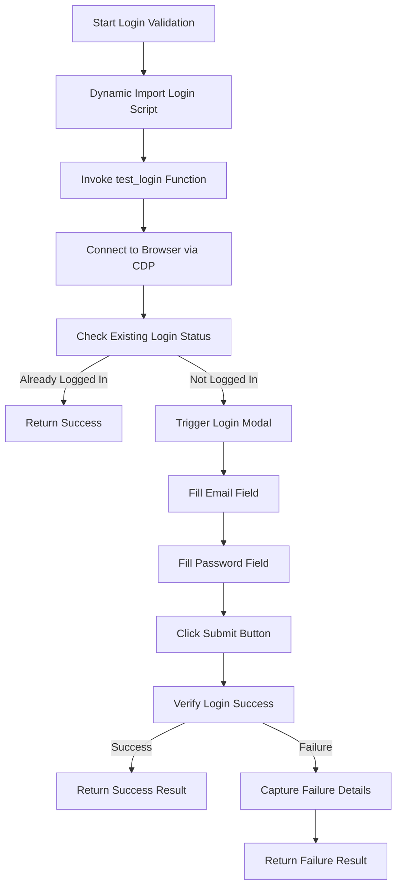
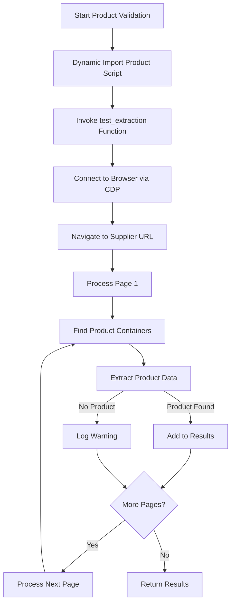
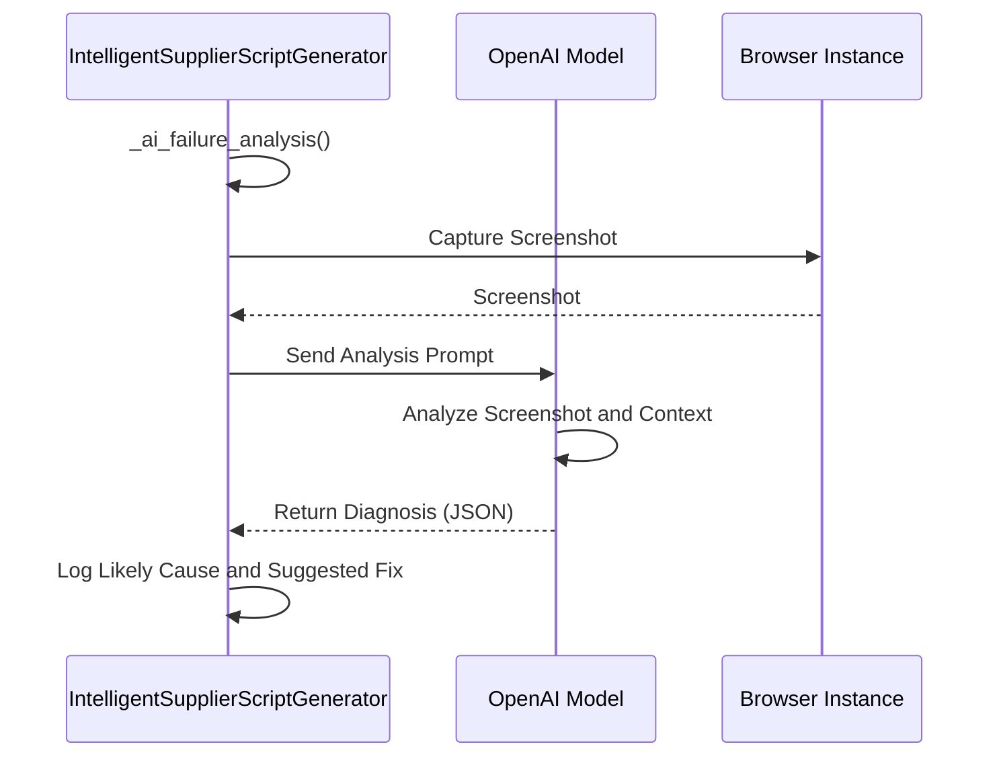
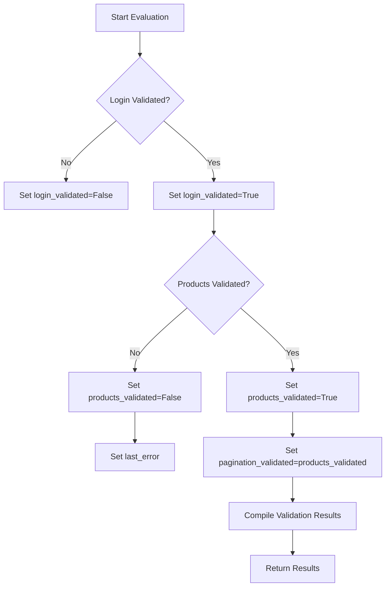

# Validation Testing

<cite>
**Referenced Files in This Document**   
- [tools/supplier_script_generator.py](file://tools/supplier_script_generator.py)
- [tools/configurable_supplier_scraper.py](file://tools/configurable_supplier_scraper.py)
- [suppliers/poundwholesale-co-uk/scripts/poundwholesale-co-uk_login.py](file://suppliers/poundwholesale-co-uk/scripts/poundwholesale-co-uk_login.py)
</cite>

## Table of Contents
1. [Introduction](#introduction)
2. [Validation Workflow Overview](#validation-workflow-overview)
3. [Test-After-Generate Validation Loop](#test-after-generate-validation-loop)
4. [Login Validation Process](#login-validation-process)
5. [Product Extraction Validation](#product-extraction-validation)
6. [AI-Powered Failure Analysis](#ai-powered-failure-analysis)
7. [Validation Result Evaluation](#validation-result-evaluation)
8. [Common Validation Failures and Resolution](#common-validation-failures-and-resolution)
9. [Integration with Configurable Supplier Scraper](#integration-with-configurable-supplier-scraper)
10. [Conclusion](#conclusion)

## Introduction
The IntelligentSupplierScriptGenerator implements a comprehensive validation testing framework to ensure the reliability and accuracy of generated supplier scripts before deployment. This document details the test-after-generate validation loop, which systematically verifies script functionality through automated testing of login authentication and product data extraction. The validation process integrates with the configurable_supplier_scraper.py module to perform end-to-end testing, ensuring that generated scripts can successfully interact with supplier websites and extract required data. The system employs AI-powered failure analysis to diagnose issues and provide actionable insights for script improvement.

**Section sources**
- [tools/supplier_script_generator.py](file://tools/supplier_script_generator.py#L50-L1254)

## Validation Workflow Overview
The validation testing process follows a structured workflow integrated into the IntelligentSupplierScriptGenerator class. The workflow begins with checking the existing state by examining the .supplier_ready file to determine if validation has already been successfully completed. If validation is required, the system initializes a browser connection and proceeds through AI-powered discovery to identify necessary selectors. After generating the login and product extractor scripts from templates, the system executes the test-after-generate validation loop. This loop imports and executes the generated scripts to verify their functionality, with results used to determine whether scripts pass validation or require regeneration. The final step generates an intelligent .supplier_ready file that documents the validation status and serves as a "report card" for the supplier package.

**Diagram sources**
- [tools/supplier_script_generator.py](file://tools/supplier_script_generator.py#L50-L1254)

**Section sources**
- [tools/supplier_script_generator.py](file://tools/supplier_script_generator.py#L50-L1254)

## Test-After-Generate Validation Loop
The test-after-generate validation loop is a critical component of the IntelligentSupplierScriptGenerator class, implemented in the _test_after_generate_validation method. This loop systematically validates the functionality of generated scripts by importing and executing them in a test environment. The validation process consists of two main phases: login script testing and product extraction script testing. For each phase, the system dynamically imports the generated script module and invokes its test function. The results are captured and used to determine whether the script passes validation. If either test fails, the system triggers AI-powered failure analysis to diagnose the issue. The validation results are structured to include success status for login, product extraction, and pagination validation, along with detailed test results and error information.

**Diagram sources**
- [tools/supplier_script_generator.py](file://tools/supplier_script_generator.py#L1053-L1084)

**Section sources**
- [tools/supplier_script_generator.py](file://tools/supplier_script_generator.py#L1053-L1084)

## Login Validation Process
The login validation process is implemented through the _test_login_script method, which verifies the functionality of the generated login script. The process begins by dynamically importing the generated login script module using Python's importlib utilities. The system then invokes the test_login function with dummy credentials in test mode. The login script itself contains comprehensive functionality to handle various authentication scenarios, including checking existing login status, triggering login modals, filling credentials, and handling modal overlays. The validation specifically tests the script's ability to connect to the browser via Chrome DevTools Protocol (CDP), navigate to the supplier URL, fill email and password fields using discovered selectors, click the submit button, and verify successful login. If the test fails, the system captures detailed error information including the specific step that failed and any detected error indicators on the page.

**Diagram sources**
- [tools/supplier_script_generator.py](file://tools/supplier_script_generator.py#L1053-L1084)
- [suppliers/poundwholesale-co-uk/scripts/poundwholesale-co-uk_login.py](file://suppliers/poundwholesale-co-uk/scripts/poundwholesale-co-uk_login.py#L241-L253)

**Section sources**
- [tools/supplier_script_generator.py](file://tools/supplier_script_generator.py#L1053-L1084)

## Product Extraction Validation
The product extraction validation process verifies the functionality of the generated product extractor script through the _test_product_script method. This validation imports the generated product extractor module and invokes its test_extraction function with a maximum of two pages to limit test duration. The product extractor script connects to the browser via CDP and attempts to extract products from the supplier website using selectors discovered during the AI-powered discovery phase. The validation checks whether the script can successfully navigate to the supplier URL, locate product containers using the container selector, and extract key product information including title, price, URL, and image. The test evaluates the script's ability to handle pagination by processing multiple pages. Success is determined by the extraction of at least one valid product with either a title or URL. The validation results include the total number of products extracted and sample product data for verification.

**Diagram sources**
- [tools/supplier_script_generator.py](file://tools/supplier_script_generator.py#L1053-L1084)

**Section sources**
- [tools/supplier_script_generator.py](file://tools/supplier_script_generator.py#L1053-L1084)

## AI-Powered Failure Analysis
When validation fails, the system employs AI-powered failure analysis through the _ai_failure_analysis method to diagnose the root cause and provide actionable insights. This process begins by capturing a screenshot of the current page state at the moment of failure, providing visual context for analysis. The system then prepares a detailed prompt for the AI model that includes information about the failed component, the selectors attempted, and the specific error encountered. The prompt instructs the AI to analyze the screenshot and determine the likely cause of failure, such as incorrect selectors, CAPTCHA challenges, unexpected popups, or changes in HTML structure. The AI model returns a structured JSON response with a likely cause and suggested fix. This AI-powered diagnosis helps identify whether issues stem from selector drift, authentication problems, or other factors, enabling targeted script improvements rather than blind regeneration.

**Diagram sources**
- [tools/supplier_script_generator.py](file://tools/supplier_script_generator.py#L50-L1254)

**Section sources**
- [tools/supplier_script_generator.py](file://tools/supplier_script_generator.py#L50-L1254)

## Validation Result Evaluation
The system evaluates validation results to determine whether generated scripts pass or require regeneration. The evaluation is based on the success status of both login and product extraction tests. A script package passes validation only if both components are successfully validated. The results are structured in a comprehensive format that includes boolean flags for login_validated, products_validated, and pagination_validated status, along with detailed test results and error information. If validation fails, the system captures the last_error message which provides specific details about the failure. The evaluation process also considers the .supplier_ready file state, allowing for selective regeneration of only failed components rather than the entire package. This intelligent evaluation prevents unnecessary regeneration when some components are already validated, optimizing the script generation workflow.

**Diagram sources**
- [tools/supplier_script_generator.py](file://tools/supplier_script_generator.py#L50-L1254)

**Section sources**
- [tools/supplier_script_generator.py](file://tools/supplier_script_generator.py#L50-L1254)

## Common Validation Failures and Resolution
The validation system addresses several common failure scenarios that can occur during script testing. Selector drift occurs when website HTML structure changes, causing selectors to no longer match elements. The system detects this through failed element queries and uses AI analysis to suggest updated selectors. Authentication timeouts happen when login attempts take too long, often due to network issues or server-side delays. The system handles this with appropriate timeouts and retry mechanisms. Data extraction errors occur when product information cannot be properly extracted, typically due to changes in page structure or dynamic content loading. The resolution strategies include AI-powered failure analysis to diagnose issues, selective regeneration of failed components, and leveraging the .supplier_ready file to avoid revalidating successful components. For persistent failures, the system may require manual intervention or updated discovery parameters.

**Section sources**
- [tools/supplier_script_generator.py](file://tools/supplier_script_generator.py#L50-L1254)

## Integration with Configurable Supplier Scraper
The validation testing system integrates with the configurable_supplier_scraper.py module to enable end-to-end testing of generated scripts. This integration allows the validation process to leverage the scraper's robust browser automation capabilities, including connection to shared Chrome instances via CDP and handling of dynamic content. The configurable supplier scraper provides the foundation for the product extraction validation, using selector configurations from the discovery phase to extract product data. The scraper's implementation includes features like rate limiting, retry mechanisms, and anti-bot evasion techniques that enhance the reliability of validation tests. This integration ensures that the validation environment closely mirrors the actual execution environment, providing more accurate assessment of script functionality. The shared browser management through BrowserManager ensures consistency between validation and production execution.

**Section sources**
- [tools/configurable_supplier_scraper.py](file://tools/configurable_supplier_scraper.py#L50-L1254)

## Conclusion
The validation testing framework in the IntelligentSupplierScriptGenerator class provides a comprehensive system for ensuring the reliability of generated supplier scripts. By implementing a test-after-generate validation loop, the system verifies both login authentication and product data extraction functionality before deployment. The integration with configurable_supplier_scraper.py enables end-to-end testing in a realistic environment, while AI-powered failure analysis provides actionable insights for resolving issues. The validation workflow efficiently evaluates script performance and determines whether scripts pass or require regeneration, with support for selective regeneration of failed components. This robust validation process ensures that only properly functioning scripts are deployed, maintaining the integrity and reliability of the supplier data extraction system.