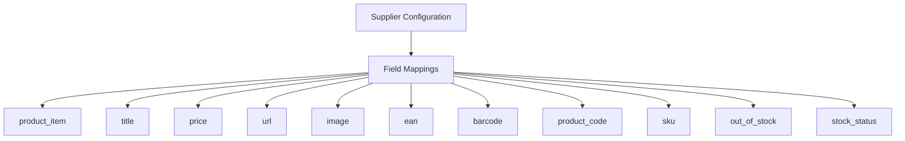
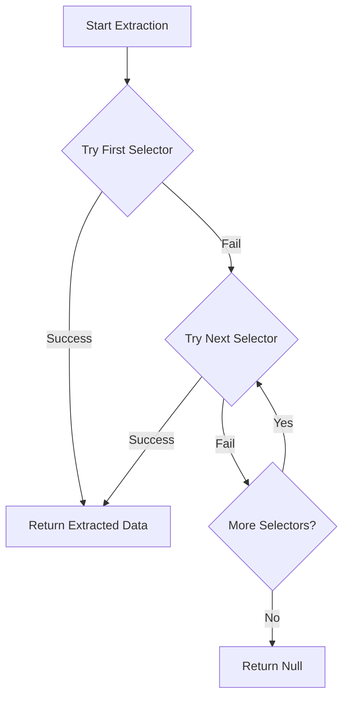

# Field Mappings Configuration

<cite>
**Referenced Files in This Document**   
- [configurable_supplier_scraper.py](file://tools/configurable_supplier_scraper.py)
- [poundwholesale-co-uk.json](file://config/supplier_configs/poundwholesale-co-uk.json)
</cite>

## Table of Contents
1. [Introduction](#introduction)
2. [Field Mappings Structure](#field-mappings-structure)
3. [Core Field Mappings](#core-field-mappings)
4. [Selector Fallback Mechanism](#selector-fallback-mechanism)
5. [Data Extraction Process](#data-extraction-process)
6. [Practical Configuration Example](#practical-configuration-example)
7. [Common Issues and Troubleshooting](#common-issues-and-troubleshooting)
8. [Conclusion](#conclusion)

## Introduction
The field mappings configuration enables the extraction of product data from supplier web pages using CSS selectors. This system allows for flexible and robust data extraction by defining multiple selector options for each product attribute, providing fallback mechanisms when HTML structures vary or change. The configuration is implemented in the `ConfigurableSupplierScraper` class, which uses BeautifulSoup for parsing HTML content and extracting data based on the defined selector mappings. This approach ensures reliable data extraction even when supplier websites have dynamic or inconsistent HTML structures.

**Section sources**
- [configurable_supplier_scraper.py](file://tools/configurable_supplier_scraper.py#L0-L50)

## Field Mappings Structure
The field mappings configuration defines how product data is extracted from supplier web pages using CSS selectors. Each field mapping contains a list of selectors that target specific product attributes. The system attempts each selector in sequence until one successfully extracts data. This structure supports multiple fallback options to handle variations in HTML structure across different supplier websites or page templates.

The configuration is stored in JSON files within the `config/supplier_configs/` directory, with each supplier having its own configuration file. The structure includes mappings for essential product fields such as title, price, URL, image, EAN, barcode, product code, SKU, stock status, and out-of-stock indicators.



**Diagram sources**
- [poundwholesale-co-uk.json](file://config/supplier_configs/poundwholesale-co-uk.json#L1-L122)

## Core Field Mappings
The core field mappings define the essential product attributes that need to be extracted from supplier web pages. Each field has multiple selector options to ensure robust data extraction across different HTML structures.

### product_item
The `product_item` field identifies the container element that contains all product information. This selector is used to isolate individual product listings on category pages.

**Section sources**
- [poundwholesale-co-uk.json](file://config/supplier_configs/poundwholesale-co-uk.json#L6-L9)

### title
The `title` field extracts the product name from the web page. Multiple selectors are provided to handle different HTML structures used by suppliers.

**Section sources**
- [poundwholesale-co-uk.json](file://config/supplier_configs/poundwholesale-co-uk.json#L10-L13)

### price
The `price` field extracts the product price using various selectors, including meta tags and price wrapper elements. This field supports structured data extraction from JSON-LD and Open Graph tags.

**Section sources**
- [poundwholesale-co-uk.json](file://config/supplier_configs/poundwholesale-co-uk.json#L14-L23)

### url
The `url` field extracts the product page URL from anchor elements within the product listing.

**Section sources**
- [poundwholesale-co-uk.json](file://config/supplier_configs/poundwholesale-co-uk.json#L24-L27)

### image
The `image` field extracts the product image URL from image elements within the product listing.

**Section sources**
- [poundwholesale-co-uk.json](file://config/supplier_configs/poundwholesale-co-uk.json#L28-L31)

### ean
The `ean` field extracts the European Article Number using various selectors, including structured data in JSON-LD format and meta tags.

**Section sources**
- [poundwholesale-co-uk.json](file://config/supplier_configs/poundwholesale-co-uk.json#L32-L41)

### barcode
The `barcode` field extracts the product barcode using similar selectors to the EAN field, with support for structured data and meta tags.

**Section sources**
- [poundwholesale-co-uk.json](file://config/supplier_configs/poundwholesale-co-uk.json#L42-L49)

### product_code
The `product_code` field extracts the supplier's internal product code using data attributes and meta tags.

**Section sources**
- [poundwholesale-co-uk.json](file://config/supplier_configs/poundwholesale-co-uk.json#L50-L55)

### sku
The `sku` field extracts the Stock Keeping Unit identifier from data attributes and product information elements.

**Section sources**
- [poundwholesale-co-uk.json](file://config/supplier_configs/poundwholesale-co-uk.json#L56-L59)

### out_of_stock
The `out_of_stock` field identifies products that are currently unavailable using stock status indicators and text content.

**Section sources**
- [poundwholesale-co-uk.json](file://config/supplier_configs/poundwholesale-co-uk.json#L60-L65)

### stock_status
The `stock_status` field extracts the current stock status of a product, indicating whether it is available or unavailable.

**Section sources**
- [poundwholesale-co-uk.json](file://config/supplier_configs/poundwholesale-co-uk.json#L66-L71)

## Selector Fallback Mechanism
The selector fallback mechanism provides robustness in data extraction by attempting multiple selectors for each field until one successfully extracts data. The system processes selectors in the order they are defined in the configuration, allowing for primary selectors to be listed first followed by fallback options.

This approach handles dynamic or inconsistent HTML structures by providing alternative extraction paths when the primary selector fails. For example, if a supplier changes their HTML structure and removes a class name used in the primary selector, the system automatically falls back to alternative selectors that may still be valid.

The fallback mechanism is implemented in the `_extract_text_by_selector` method, which iterates through the list of selectors for a given field and returns the first successful extraction.



**Diagram sources**
- [configurable_supplier_scraper.py](file://tools/configurable_supplier_scraper.py#L1400-L1420)

## Data Extraction Process
The data extraction process utilizes the `_extract_text_by_selector` method in `configurable_supplier_scraper.py` to extract product data using BeautifulSoup. This method takes a BeautifulSoup object and a list of CSS selectors, attempting each selector in sequence until data is successfully extracted.

The process begins by creating a BeautifulSoup object from the HTML content of the supplier web page. For each product field, the system iterates through the configured selectors, applying each one to the BeautifulSoup object. When a selector successfully matches an element, the text content is extracted and returned.

For fields like EAN and price, the system can extract data from structured sources such as JSON-LD scripts and meta tags. This allows for reliable extraction even when the visible text content is dynamically loaded or protected.

The extraction process includes error handling and logging to track selector performance and identify issues with data extraction.

```mermaid
sequenceDiagram
participant Scraper
participant BeautifulSoup
participant SelectorConfig
participant HTMLPage
Scraper->>SelectorConfig : Request field selectors
SelectorConfig-->>Scraper : Return selector list
Scraper->>HTMLPage : Fetch page content
HTMLPage-->>Scraper : Return HTML
Scraper->>BeautifulSoup : Parse HTML
BeautifulSoup-->>Scraper : Create soup object
loop For each selector
Scraper->>BeautifulSoup : Apply selector
alt Success
BeautifulSoup-->>Scraper : Return element
Scraper->>Scraper : Extract text
Scraper-->>Scraper : Return data
break Success
else Fail
BeautifulSoup-->>Scraper : No match
end
end
```

**Diagram sources**
- [configurable_supplier_scraper.py](file://tools/configurable_supplier_scraper.py#L1400-L1420)

## Practical Configuration Example
The `poundwholesale-co-uk.json` configuration file provides a practical example of field mappings for the Poundwholesale supplier. This configuration demonstrates the use of multiple selector options for robust data extraction.

For the `price` field, the configuration includes several selectors:
- `span.price.discount` - Targets discounted price elements
- `meta[property="product:price:amount"]` - Extracts price from Open Graph meta tags
- `script[type="application/ld+json"]` - Parses price from JSON-LD structured data

The EAN field configuration demonstrates the use of structured data extraction:
- `script[type="application/ld+json"]` - Extracts EAN from JSON-LD product data
- `meta[itemprop="gtin13"]` - Retrieves EAN from schema.org meta tags
- `dt:contains('EAN') + dd` - Finds EAN in definition list pairs

This multi-layered approach ensures that product data can be extracted even when the supplier's website structure changes or when certain elements are not available.

**Section sources**
- [poundwholesale-co-uk.json](file://config/supplier_configs/poundwholesale-co-uk.json#L1-L122)

## Common Issues and Troubleshooting
Several common issues can affect selector effectiveness in data extraction:

### Selector Conflicts
Selector conflicts occur when multiple selectors match different elements on the page. This can result in incorrect data being extracted. To resolve this, prioritize more specific selectors and use attribute selectors to target exact elements.

### Dynamic Content Loading
Dynamic content loaded via JavaScript may not be available when the initial HTML is parsed. The scraper addresses this by using Playwright to render pages with JavaScript execution before extraction.

### Authentication-Protected Pricing
Some suppliers require authentication to view pricing information. The system detects login requirements through specific selectors like `a.btn.customer-login-link.login-btn` and can trigger authentication workflows.

### Troubleshooting Guidance
To debug selector effectiveness:
1. Use browser developer tools to inspect the HTML structure
2. Test selectors in the browser console using `document.querySelector()`
3. Verify that selectors match the intended elements
4. Check for dynamically loaded content that may require JavaScript execution
5. Test selectors with different product pages to ensure consistency

The system logs selector attempts and failures, providing valuable information for troubleshooting extraction issues.

**Section sources**
- [configurable_supplier_scraper.py](file://tools/configurable_supplier_scraper.py#L1400-L1420)
- [poundwholesale-co-uk.json](file://config/supplier_configs/poundwholesale-co-uk.json#L1-L122)

## Conclusion
The field mappings configuration provides a flexible and robust system for extracting product data from supplier web pages. By defining multiple selector options for each field, the system can handle variations in HTML structure and ensure reliable data extraction. The use of structured data sources like JSON-LD and meta tags enhances extraction reliability, while the fallback mechanism provides resilience against HTML changes. This approach enables consistent data collection across multiple suppliers with different website structures and content delivery methods.