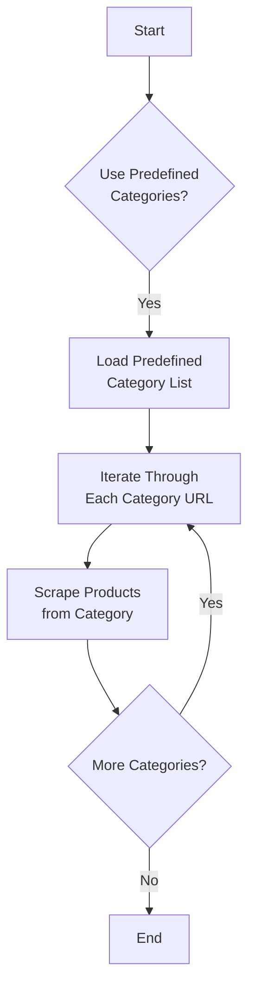
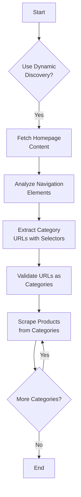
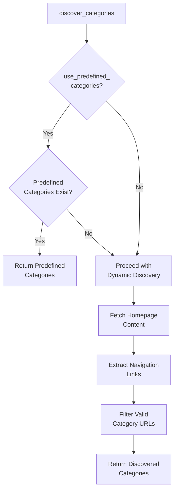

# Navigation Configuration

<cite>
**Referenced Files in This Document**   
- [poundwholesale-co-uk.json](file://config/supplier_configs/poundwholesale-co-uk.json)
- [configurable_supplier_scraper.py](file://tools/configurable_supplier_scraper.py)
</cite>

## Table of Contents
1. [Introduction](#introduction)
2. [Navigation Strategy Configuration](#navigation-strategy-configuration)
3. [Predefined Categories Approach](#predefined-categories-approach)
4. [Dynamic Discovery Approach](#dynamic-discovery-approach)
5. [Control Flags and Their Impact](#control-flags-and-their-impact)
6. [Category Discovery Implementation](#category-discovery-implementation)
7. [Practical Example: Poundwholesale.co.uk](#practical-example-poundwholesalecouk)
8. [Use Cases and Selection Guidance](#use-cases-and-selection-guidance)

## Introduction
This document provides comprehensive documentation on the navigation configuration system for supplier website category discovery and traversal. It explains how the system determines which approach to use for navigating supplier websites, with a focus on the configuration options available and their impact on scraping behavior. The system supports both predefined category configurations and dynamic discovery methods, allowing for flexible and reliable data collection from various supplier websites.

## Navigation Strategy Configuration
The navigation strategy is controlled through the `navigation_configuration` section in supplier configuration files. This configuration determines how the system discovers and navigates through product categories on supplier websites.

The primary field that controls the navigation approach is `navigation_strategy`, which can be set to different values to determine the method of category discovery. The system evaluates this configuration along with other control flags to determine the most appropriate navigation method for each supplier.

The configuration is loaded from JSON files in the `config/supplier_configs/` directory, with each supplier having its own configuration file that specifies the optimal navigation strategy based on the supplier's website structure and reliability.

**Section sources**
- [poundwholesale-co-uk.json](file://config/supplier_configs/poundwholesale-co-uk.json#L20-L39)

## Predefined Categories Approach
The predefined categories approach uses a fixed list of category URLs and display names specified in the configuration. This method provides reliable and consistent navigation by using exact URLs that have been verified to work.

When using predefined categories, the system relies on the `predefined_categories` array in the navigation configuration. This array contains objects with `name` and `url` properties, specifying the display name and exact URL for each category.

This approach ensures consistent data collection across runs by eliminating the variability of dynamic discovery. It is particularly useful for supplier websites with stable category structures that do not change frequently.

**Diagram sources **
- [poundwholesale-co-uk.json](file://config/supplier_configs/poundwholesale-co-uk.json#L20-L39)
- [configurable_supplier_scraper.py](file://tools/configurable_supplier_scraper.py#L2500-L2550)

**Section sources**
- [poundwholesale-co-uk.json](file://config/supplier_configs/poundwholesale-co-uk.json#L20-L39)
- [configurable_supplier_scraper.py](file://tools/configurable_supplier_scraper.py#L2500-L2550)

## Dynamic Discovery Approach
The dynamic discovery approach automatically detects categories by analyzing the supplier website's homepage and navigation structure. This method is useful for supplier websites that frequently change their category structure or when comprehensive category coverage is required without manual configuration.

The system uses CSS selectors to identify navigation elements on the homepage and extract category URLs. It employs a comprehensive set of selectors to handle different website structures and frameworks.

Dynamic discovery is particularly valuable when dealing with new supplier websites where the category structure is unknown or when the supplier frequently adds or removes categories. The system can adapt to these changes automatically without requiring manual configuration updates.

**Diagram sources **
- [configurable_supplier_scraper.py](file://tools/configurable_supplier_scraper.py#L2550-L2650)

## Control Flags and Their Impact
The navigation behavior is controlled by several flags in the configuration that determine how the system handles category discovery and scraping.

The `homepage_products_unreliable` flag indicates whether products listed on the homepage can be trusted for accurate data collection. When set to `true`, the system avoids relying on homepage product listings and instead focuses on category-specific pages for more reliable data.

The `use_predefined_categories` flag determines whether the system should use the predefined category list from the configuration. When set to `true`, the system prioritizes the predefined categories over dynamically discovered ones, ensuring consistent navigation paths across scraping runs.

These flags work together to optimize the scraping process based on the specific characteristics of each supplier website, balancing reliability with comprehensiveness.

**Section sources**
- [poundwholesale-co-uk.json](file://config/supplier_configs/poundwholesale-co-uk.json#L20-L39)
- [configurable_supplier_scraper.py](file://tools/configurable_supplier_scraper.py#L2500-L2550)

## Category Discovery Implementation
The category discovery process is implemented in the `discover_categories` method of the `ConfigurableSupplierScraper` class. This method respects the navigation configuration settings and adapts its behavior accordingly.

When `use_predefined_categories` is enabled, the method first checks for predefined categories in the configuration and uses them if available. This prevents unnecessary homepage scraping when a reliable predefined list exists.

The implementation includes safeguards to avoid unreliable homepage scraping by checking the `homepage_products_unreliable` flag. When this flag is set, the system skips homepage product extraction and focuses on category navigation instead.

The discovery process also includes URL validation to ensure that only legitimate category URLs are processed, filtering out links to non-category pages such as login, account, or contact pages.

**Diagram sources **
- [configurable_supplier_scraper.py](file://tools/configurable_supplier_scraper.py#L2500-L2650)

**Section sources**
- [configurable_supplier_scraper.py](file://tools/configurable_supplier_scraper.py#L2500-L2650)

## Practical Example: Poundwholesale.co.uk
The poundwholesale-co-uk.json configuration file provides a practical example of navigation configuration in action. This supplier uses the predefined categories approach with a comprehensive list of 17 categories.

The configuration specifies `navigation_strategy` as "predefined_categories" and sets `use_predefined_categories` to `true`, indicating that the system should use the predefined category list. The `homepage_products_unreliable` flag is set to `true`, indicating that homepage product listings should not be relied upon.

The predefined categories array includes exact URLs for categories such as "Seasonal Wholesale Summer", "Wholesale Garden", "Toys", and "Leisure Hobbies", ensuring consistent navigation across scraping runs. This approach guarantees that the same categories are processed in the same order every time, providing reliable and repeatable data collection.

This configuration ensures consistent data collection across runs by using fixed URLs that do not change, avoiding potential issues with dynamic discovery on this particular supplier's website.

**Section sources**
- [poundwholesale-co-uk.json](file://config/supplier_configs/poundwholesale-co-uk.json#L20-L39)

## Use Cases and Selection Guidance
The choice between predefined categories and dynamic discovery depends on several factors related to the supplier website's characteristics and reliability.

The predefined categories approach is recommended for supplier websites with stable category structures that do not change frequently. It is ideal when reliability and consistency across scraping runs are paramount. This approach is particularly suitable for suppliers like Poundwholesale.co.uk where the category structure is well-established and unlikely to change.

The dynamic discovery approach is better suited for supplier websites with frequently changing category structures or when comprehensive coverage of all available categories is required without manual configuration. It is also useful for new supplier websites where the category structure is unknown.

When selecting the appropriate approach, consider the reliability of the supplier website's homepage, the frequency of category changes, and the importance of consistent data collection across runs. The control flags in the configuration provide additional flexibility to fine-tune the behavior based on specific requirements.

**Section sources**
- [poundwholesale-co-uk.json](file://config/supplier_configs/poundwholesale-co-uk.json#L20-L39)
- [configurable_supplier_scraper.py](file://tools/configurable_supplier_scraper.py#L2500-L2650)