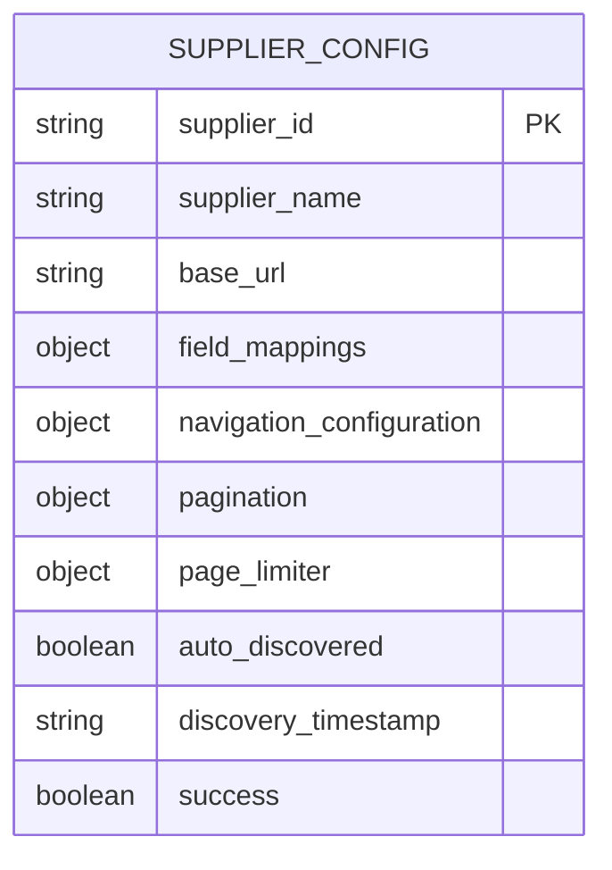
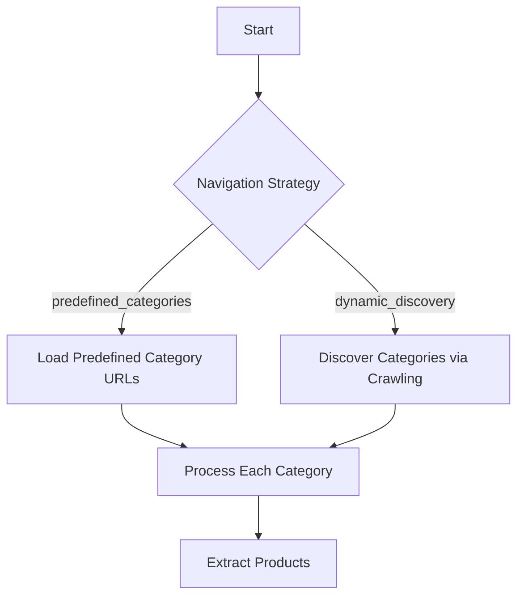
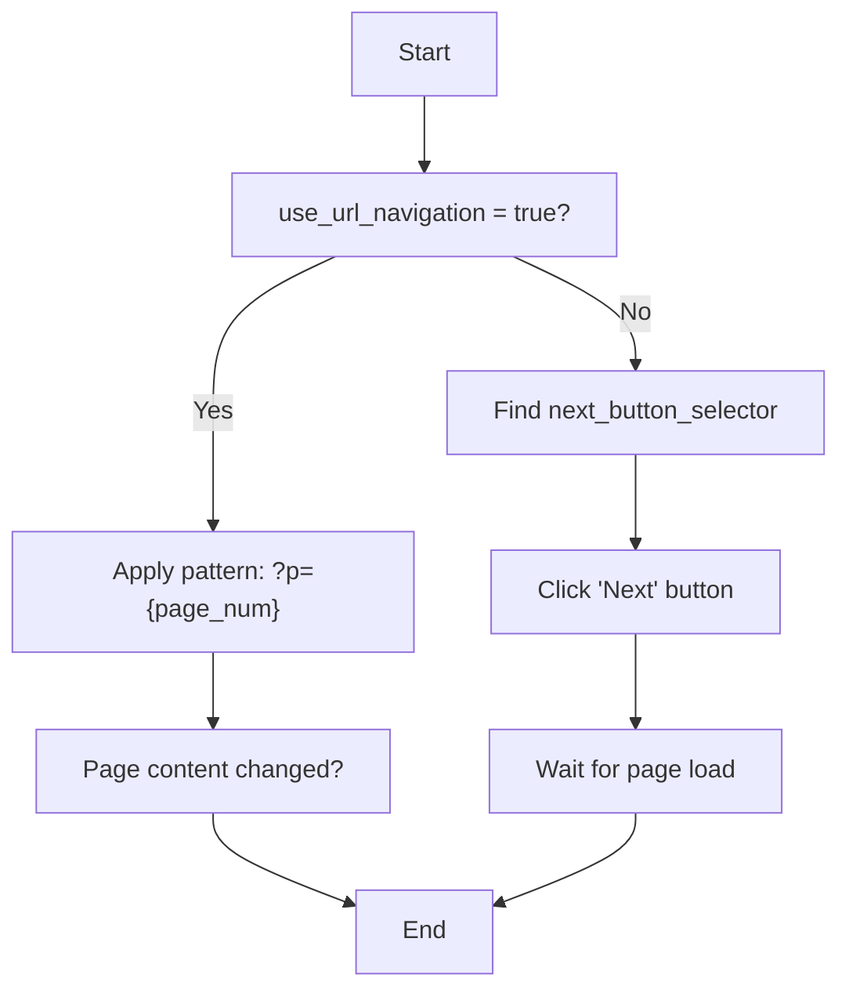
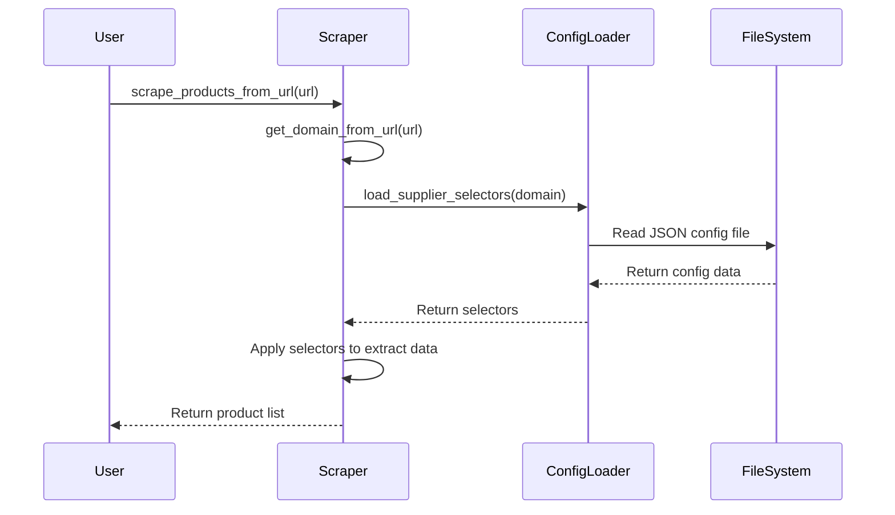

# Supplier Configuration

<cite>
**Referenced Files in This Document**   
- [poundwholesale-co-uk.json](file://config/supplier_configs/poundwholesale-co-uk.json)
- [www.poundwholesale.co.uk.json](file://config/supplier_configs/www.poundwholesale.co.uk.json)
- [configurable_supplier_scraper.py](file://tools/configurable_supplier_scraper.py)
- [supplier_config_loader.py](file://config/supplier_config_loader.py)
</cite>

## Table of Contents
1. [Introduction](#introduction)
2. [Core Configuration Structure](#core-configuration-structure)
3. [Field Mappings and CSS Selectors](#field-mappings-and-css-selectors)
4. [Navigation Configuration](#navigation-configuration)
5. [Pagination and URL Handling](#pagination-and-url-handling)
6. [Page Limiter Configuration](#page-limiter-configuration)
7. [Configuration Loading and Utilization](#configuration-loading-and-utilization)
8. [Testing and Troubleshooting](#testing-and-troubleshooting)
9. [Conclusion](#conclusion)

## Introduction
This document provides comprehensive guidance on supplier configuration files used within the Amazon FBA Agent System. These JSON-based configurations define how product data is extracted from supplier websites through CSS selectors, navigation strategies, and pagination rules. The focus is on the structure and purpose of key fields such as `supplier_id`, `base_url`, `field_mappings`, `navigation_configuration`, `pagination`, and `page_limiter`. Practical examples are drawn from the `poundwholesale-co-uk.json` configuration to illustrate robust selector design and fallback mechanisms. Additionally, this document explains how the `configurable_supplier_scraper.py` module reads and applies these configurations during execution.

## Core Configuration Structure
The supplier configuration file is a JSON document that defines all necessary parameters for scraping a specific supplier's website. Each configuration includes identifying information, base URLs, field mappings for data extraction, navigation settings, and pagination logic.



**Diagram sources**
- [poundwholesale-co-uk.json](file://config/supplier_configs/poundwholesale-co-uk.json)

**Section sources**
- [poundwholesale-co-uk.json](file://config/supplier_configs/poundwholesale-co-uk.json)

### Key Configuration Fields
- **supplier_id**: A unique identifier for the supplier (e.g., "poundwholesale-co-uk")
- **supplier_name**: Human-readable name of the supplier
- **base_url**: The root URL used for constructing full URLs during scraping
- **auto_discovered**: Indicates whether the configuration was automatically generated
- **discovery_timestamp**: Timestamp when the configuration was created or last updated

These fields ensure consistent identification and contextual handling of supplier-specific behaviors across the system.

## Field Mappings and CSS Selectors
The `field_mappings` section defines CSS selectors used to extract product data from HTML pages. Each field supports multiple selector options, enabling fallback behavior when primary selectors fail due to website changes or dynamic content.

### Product Data Extraction Fields
The following fields are mapped using CSS selectors:

| Field | Purpose | Example Selectors |
|-------|-------|-------------------|
| **product_item** | Container element for individual products | `.product-item.product-item-info`, `.product-item` |
| **title** | Product title text | `a.product-item-link`, `h4.product-name a` |
| **price** | Product price display | `span.price.discount`, `meta[property="product:price:amount"]` |
| **url** | Product page URL | `a.product-item-link`, `.product-item-link` |
| **image** | Product image source | `.product-item img.product-image-photo` |
| **ean** | European Article Number (barcode) | `dt:contains('EAN') + dd`, `meta[itemprop="gtin13"]` |
| **stock_status** | Availability status | `.stock.available`, `.stock.unavailable` |

**Section sources**
- [poundwholesale-co-uk.json](file://config/supplier_configs/poundwholesale-co-uk.json)

### Selector Fallback Mechanism
The system attempts selectors in order until one successfully returns content. For example, in `poundwholesale-co-uk.json`, the **price** field uses eight different selectors:
```json
"price": [
  "span.price.discount",
  ".price-wrapper .price.discount",
  ".price-wrapper .price",
  "meta[property=\"product:price:amount\"]",
  "[data-price-amount]",
  "meta[itemprop='price']",
  ".regular-price .price",
  ".price-final_price .price"
]
```
This layered approach ensures robustness against HTML structure changes or missing elements.

### Specialized Extraction Techniques
- **Text-based selectors**: Use `:contains()` to match elements by visible text (e.g., `dt:contains('EAN') + dd`)
- **Attribute-based selectors**: Target elements with specific data attributes (e.g., `[data-ean]`)
- **Structured data**: Extract EAN from JSON-LD scripts or meta tags for reliability
- **Login detection**: The `price_login_required` selector identifies when authentication is needed to view pricing

## Navigation Configuration
The `navigation_configuration` object determines how the scraper discovers and processes product categories.

### Navigation Strategies
Two primary strategies are supported:

| Strategy | Description | Configuration Key |
|---------|-------------|-------------------|
| **predefined_categories** | Uses a fixed list of known category URLs | `"navigation_strategy": "predefined_categories"` |
| **dynamic discovery** | Automatically discovers categories by crawling the site | `"navigation_strategy": "dynamic_discovery"` |

The `poundwholesale-co-uk.json` configuration uses **predefined_categories**, listing 16 specific category URLs such as:
- `https://www.poundwholesale.co.uk/seasonal/wholesale-summer`
- `https://www.poundwholesale.co.uk/toys`
- `https://www.poundwholesale.co.uk/diy`



**Diagram sources**
- [poundwholesale-co-uk.json](file://config/supplier_configs/poundwholesale-co-uk.json)

**Section sources**
- [poundwholesale-co-uk.json](file://config/supplier_configs/poundwholesale-co-uk.json)

### Configuration Options
- **use_predefined_categories**: Boolean flag to enable predefined category usage
- **homepage_products_unreliable**: Indicates whether homepage product listings should be trusted
- **predefined_categories**: Array of category objects with `name` and `url` properties

This strategy ensures consistent and predictable category processing, avoiding potential issues with dynamically changing navigation menus.

## Pagination and URL Handling
The `pagination` configuration controls how the scraper navigates through multiple pages of product listings.

### Pagination Configuration Structure
```json
"pagination": {
  "pattern": "?p={page_num}",
  "use_url_navigation": true,
  "next_button_selector": [
    "a.next",
    ".pagination .next a",
    "a[rel='next']"
  ]
}
```

| Field | Description |
|------|-------------|
| **pattern** | URL template with `{page_num}` placeholder for numbered pagination |
| **use_url_navigation** | Whether to use URL patterns instead of clicking "Next" buttons |
| **next_button_selector** | Fallback selectors for locating "Next" page links |

### URL Pattern Processing
When `use_url_navigation` is enabled, the system constructs subsequent page URLs by replacing `{page_num}` in the pattern. For example:
- Base URL: `https://www.poundwholesale.co.uk/toys`
- Page 2: `https://www.poundwholesale.co.uk/toys?p=2`
- Page 3: `https://www.poundwholesale.co.uk/toys?p=3`

If URL navigation fails, the scraper falls back to clicking elements matched by `next_button_selector`.



**Diagram sources**
- [poundwholesale-co-uk.json](file://config/supplier_configs/poundwholesale-co-uk.json)
- [configurable_supplier_scraper.py](file://tools/configurable_supplier_scraper.py#L2495-L2664)

**Section sources**
- [poundwholesale-co-uk.json](file://config/supplier_configs/poundwholesale-co-uk.json)

## Page Limiter Configuration
The `page_limiter` setting optimizes data extraction by increasing the number of products displayed per page.

### Page Limiter Structure
```json
"page_limiter": {
  "selector": "a[data-role=\"limiter\"][data-value=\"60\"]",
  "value": "60",
  "note": "Sets products per page to 60 - optional optimization"
}
```

| Field | Description |
|------|-------------|
| **selector** | CSS selector for the page size control element |
| **value** | Desired number of products per page |
| **note** | Descriptive comment (ignored by system) |

During execution, the scraper clicks the element matching the selector to load more products before extraction begins. This reduces the number of pages that need to be processed and improves scraping efficiency.

**Section sources**
- [poundwholesale-co-uk.json](file://config/supplier_configs/poundwholesale-co-uk.json)
- [configurable_supplier_scraper.py](file://tools/configurable_supplier_scraper.py#L1342-L1402)

## Configuration Loading and Utilization
The system loads and applies supplier configurations through dedicated modules that interface with the scraper.

### Configuration Loading Process
The `supplier_config_loader.py` module provides functions to load configurations based on domain names:

```python
def load_supplier_selectors(domain: str) -> Dict[str, Any]:
    clean_domain = domain.lower().replace("www.", "")
    config_file = CONFIG_DIR / f"{clean_domain}.json"
    # Load and return configuration
```

It first attempts to load a domain-specific file (e.g., `poundwholesale-co-uk.json`) and falls back to a default configuration if unavailable.

### Integration with Scraper
The `configurable_supplier_scraper.py` module utilizes these configurations during execution:

1. **Initialization**: Loads system configuration and determines AI model settings
2. **Selector Retrieval**: Uses `_get_selectors_for_domain()` to obtain field mappings
3. **Dynamic Application**: Applies selectors during HTML parsing and data extraction
4. **Fallback Handling**: Iterates through multiple selectors until content is found

The scraper supports both direct file access and centralized browser management for efficient resource utilization.



**Diagram sources**
- [configurable_supplier_scraper.py](file://tools/configurable_supplier_scraper.py)
- [supplier_config_loader.py](file://config/supplier_config_loader.py)

**Section sources**
- [configurable_supplier_scraper.py](file://tools/configurable_supplier_scraper.py)
- [supplier_config_loader.py](file://config/supplier_config_loader.py)

## Testing and Troubleshooting
Effective testing and troubleshooting are essential for maintaining reliable supplier configurations.

### Testing Selector Effectiveness
1. **Browser Developer Tools**: Test selectors directly in the browser console using `$$(".selector")`
2. **Incremental Validation**: Start with broad selectors and refine based on results
3. **Multiple Samples**: Test across different category and product pages
4. **Dynamic Content**: Verify selectors work after JavaScript execution

### Common Configuration Issues
| Issue | Symptoms | Solutions |
|------|---------|----------|
| **Selector Conflicts** | Incorrect or duplicate data extraction | Use more specific selectors, add exclusions |
| **Dynamic Content Loading** | Missing data in initial HTML | Implement proper wait conditions, use browser automation |
| **Authentication Barriers** | Login prompts, missing prices | Configure `price_login_required` selector, implement authentication |
| **Pagination Failures** | Incomplete product extraction | Verify URL patterns, test next button selectors |
| **Rate Limiting** | HTTP 429 responses | Implement appropriate delays, use session persistence |

### Debugging Workflow
1. Enable debug logging in `configurable_supplier_scraper.py`
2. Monitor selector application order and success/failure
3. Validate extracted data against actual page content
4. Update selectors incrementally with fallback options
5. Test configuration changes in isolation before deployment

Regular validation ensures configurations remain effective despite website updates or structural changes.

## Conclusion
Supplier configuration files are critical components of the Amazon FBA Agent System, enabling flexible and robust data extraction from diverse supplier websites. By defining structured mappings for product fields, navigation strategies, pagination rules, and display limits, these configurations allow the system to adapt to various website architectures while maintaining high extraction accuracy. The use of multiple CSS selectors with fallback mechanisms ensures resilience against HTML changes, while the integration with the `configurable_supplier_scraper.py` module enables efficient, scalable scraping operations. Proper testing and maintenance of these configurations are essential for sustained system performance and data quality.