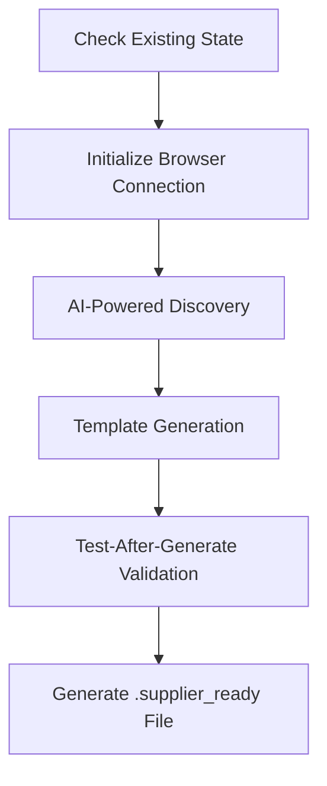
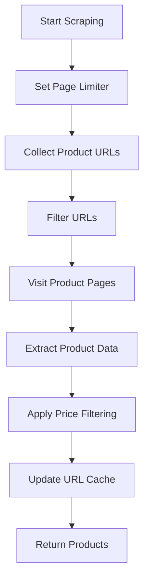
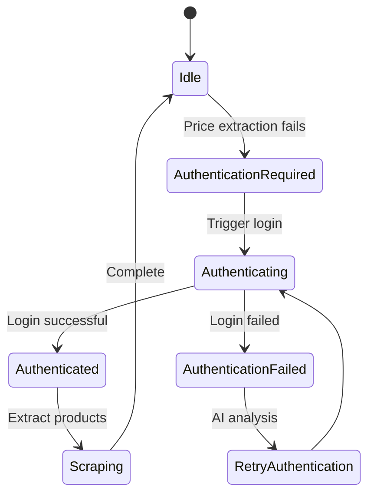

# Supplier Integration Guide

<cite>
**Referenced Files in This Document**   
- [poundwholesale-co-uk.json](file://config/supplier_configs/poundwholesale-co-uk.json)
- [supplier_script_generator.py](file://tools/supplier_script_generator.py)
- [configurable_supplier_scraper.py](file://tools/configurable_supplier_scraper.py)
- [supplier_config_loader.py](file://config/supplier_config_loader.py)
- [supplier_authentication_service.py](file://tools/supplier_authentication_service.py)
</cite>

## Table of Contents
1. [Introduction](#introduction)
2. [Supplier Configuration Files](#supplier-configuration-files)
3. [Creating New Supplier Configurations](#creating-new-supplier-configurations)
4. [Automated Script Generation](#automated-script-generation)
5. [Configurable Scraping Process](#configurable-scraping-process)
6. [Common Integration Challenges](#common-integration-challenges)
7. [Testing and Validation](#testing-and-validation)
8. [Conclusion](#conclusion)

## Introduction
This guide provides comprehensive documentation for integrating new suppliers into the Amazon FBA Agent System. The system uses a configurable scraping approach that allows for rapid onboarding of new suppliers through structured configuration files and automated script generation. The integration process focuses on defining supplier-specific parameters for URL patterns, authentication requirements, and product extraction rules. The system leverages the `configurable_supplier_scraper.py` module which adapts its behavior based on supplier configurations stored in the `supplier_configs` directory. This guide explains the structure and requirements of these configuration files, the process for creating new configurations, and how the system uses these configurations to extract product data from diverse supplier websites.

## Quick Start: Supplier Onboarding Skill

For automated supplier onboarding, use the **supplier-onboarding** skill located at `.claude/skills/supplier-onboarding/SKILL.md`. This provides a 7-step guided workflow:

1. **Data Preprocessing** - LLM validates categories and selectors
2. **Gather Information** - Collects domain, auth requirements, credentials
3. **Prepare Configurations** - Creates JSON config files
4. **Invoke Wizard** - Generates runner script via `utils/supplier_onboarding_wizard.py`
5. **Validate Files** - Verifies generated files are correct
6. **Pre-Run Verification** - Checks system readiness
7. **User Decision** - Test run, main run, or fix issues

### Quick Wizard Command

```bash
python utils/supplier_onboarding_wizard.py \
  --domain "supplier.com" \
  --categories-source "config/supplier_categories.json" \
  --selectors-source "config/supplier_configs/supplier.com.json" \
  --workflow-key "supplier_workflow" \
  --mode generate \
  --authentication-required false
```

### Naming Conventions

The system uses three distinct naming forms:

| Context | Form | Example |
|---------|------|---------|
| Config files | Dot-form | `supplier.com.json` |
| System config | Dot-form | `"supplier_name": "supplier.com"` |
| Runner scripts | Hyphen-form | `run_custom_supplier-com.py` |
| Tool directories | Hyphen-form | `tools/supplier-com/` |
| Workflow keys | Underscore-form | `supplier_workflow` |
| State files | Underscore-form | `supplier_com_processing_state.json` |

## Supplier Configuration Files
The supplier configuration system uses JSON files stored in the `config/supplier_configs` directory to define the scraping parameters for each supplier. These configuration files contain structured data that specifies how to navigate supplier websites, locate product information, and handle authentication requirements. The configuration files follow a standardized schema that includes field mappings for product data extraction, navigation settings, and pagination patterns.

The primary components of a supplier configuration file include:

- **Supplier identification**: Unique identifiers and names for the supplier
- **Base URL**: The root domain for the supplier's website
- **Field mappings**: CSS selectors for extracting product data (title, price, URL, image, EAN, etc.)
- **Navigation configuration**: Settings for category discovery and traversal
- **Pagination settings**: Patterns for navigating through multiple pages of products

The system uses the `supplier_config_loader.py` module to load these configurations, with a fallback mechanism that first attempts to load a domain-specific configuration file and then falls back to a default configuration if none is found.

**Section sources**
- [poundwholesale-co-uk.json](file://config/supplier_configs/poundwholesale-co-uk.json#L1-L122)
- [supplier_config_loader.py](file://config/supplier_config_loader.py#L0-L186)

## Creating New Supplier Configurations
Creating a new supplier configuration involves defining the specific parameters needed to extract product data from a supplier's website. The configuration file must be named using the supplier's domain name with dots replaced by hyphens (e.g., `poundwholesale-co-uk.json`). The configuration follows a structured JSON format with several key sections.

The `field_mappings` section contains arrays of CSS selectors for each type of product data. The system attempts each selector in order until one successfully extracts data. For example, the price extraction might first try a meta tag containing the price amount, then fall back to a price wrapper class, and finally attempt to extract from a regular price element.

```json
"field_mappings": {
  "product_item": [
    ".product-item.product-item-info",
    ".product-item",
    "div.product-item-details"
  ],
  "title": [
    "a.product-item-link",
    ".product-item-link",
    "h4.product-name a"
  ],
  "price": [
    "span.price.discount",
    ".price-wrapper .price.discount",
    ".price-wrapper .price",
    "meta[property=\"product:price:amount\"]",
    "[data-price-amount]",
    "meta[itemprop='price']"
  ],
  "url": [
    "a.product-item-link",
    ".product-item-link",
    ".product-name a"
  ],
  "image": [
    ".product-item img.product-image-photo",
    ".product-item .product-image-photo"
  ],
  "ean": [
    "dt:contains('Product Barcode') + dd",
    "dt:contains('EAN') + dd", 
    "dt:contains('Barcode') + dd",
    "*:contains('Product Barcode/ASIN/EAN:') + *",
    "[data-ean]",
    "script[type=\"application/ld+json\"]"
  ]
}
```

The `navigation_configuration` section defines how the system discovers and navigates product categories. It supports both predefined categories (manually specified URLs) and automatic discovery from the homepage. The `pagination` section specifies the URL pattern for navigating between pages and selectors for locating the "next" button.

**Section sources**
- [poundwholesale-co-uk.json](file://config/supplier_configs/poundwholesale-co-uk.json#L1-L122)

## Automated Script Generation
The system includes an automated script generation tool, `supplier_script_generator.py`, which creates supplier-specific scripts based on the configuration files. This tool follows a five-step orchestration sequence: checking existing state, performing AI-powered discovery, generating templates, validating the generated scripts, and creating an intelligent `.supplier_ready` file.

The AI-powered discovery phase uses a `VisionDiscoveryEngine` to analyze the supplier's website and identify key elements such as login forms and product selectors. This discovery process generates configuration files (`login_config.json` and `product_selectors.json`) that are used to create specialized Python scripts for login automation and product extraction.



**Diagram sources **
- [supplier_script_generator.py](file://tools/supplier_script_generator.py#L0-L1303)

The generated login script includes sophisticated error handling for common issues such as modal overlays, CAPTCHA challenges, and session expiration. The product extractor script uses Playwright to navigate the supplier's website and extract product data according to the configured selectors. Both scripts undergo automated validation testing to ensure they function correctly before being marked as ready for use.

**Section sources**
- [supplier_script_generator.py](file://tools/supplier_script_generator.py#L0-L1303)

## Configurable Scraping Process
The `configurable_supplier_scraper.py` module implements the core scraping functionality that adapts to different suppliers based on their configuration files. This module uses Playwright for browser automation, providing full JavaScript support and anti-bot evasion capabilities. The scraper connects to a shared Chrome instance via CDP (Chrome DevTools Protocol) to maintain session state across different operations.

The scraping process follows a multi-step approach:
1. Set the page limiter to maximize products per page
2. Collect all product URLs from paginated category pages
3. Filter URLs against existing cache and linking maps
4. Visit individual product pages to extract detailed data



**Diagram sources **
- [configurable_supplier_scraper.py](file://tools/configurable_supplier_scraper.py#L0-L3937)

The scraper includes proactive authentication checks every 25 products to prevent pricing failures due to session expiration. It also implements aggressive memory management to handle large-scale scraping operations without memory leaks. The system uses a callback mechanism to integrate with the authentication service, allowing for real-time authentication status evaluation during the scraping process.

**Section sources**
- [configurable_supplier_scraper.py](file://tools/configurable_supplier_scraper.py#L0-L3937)

## Common Integration Challenges
Integrating new suppliers often presents several common challenges related to dynamic content loading, authentication flows, and anti-bot measures. The system addresses these challenges through a combination of configuration options, automated discovery, and fallback mechanisms.

Dynamic content loading is handled by using Playwright to execute JavaScript and wait for network idle states before extracting data. This ensures that all dynamically loaded content is fully rendered before the scraper attempts to extract information.

Authentication flows are managed through the `supplier_authentication_service.py` module, which handles multi-tier authentication with intelligent triggers based on consecutive failures or periodic intervals. The system can detect when a login is required by checking for specific DOM elements such as login buttons or price visibility indicators.



**Diagram sources **
- [supplier_authentication_service.py](file://tools/supplier_authentication_service.py#L0-L113)

Site-specific anti-bot measures are addressed through human-like behavior simulation, including random delays between actions, realistic viewport settings, and proper handling of modal overlays. The system also includes AI-powered failure analysis that uses screenshots and HTML content to diagnose and suggest fixes for blocking issues.

**Section sources**
- [supplier_authentication_service.py](file://tools/supplier_authentication_service.py#L0-L113)

## Testing and Validation
Testing new supplier integrations involves a comprehensive validation process to ensure data extraction accuracy and reliability. The system includes built-in testing functions that validate both the login functionality and product extraction capabilities.

The validation process includes:
- Testing login with dummy credentials in test mode
- Extracting a limited number of products (typically 2 pages) to verify selector accuracy
- Comparing extracted data against expected values
- Checking for proper handling of edge cases like out-of-stock items

The system generates an intelligent `.supplier_ready` file that serves as a "report card" for the supplier package, indicating whether the login and product extraction components have been validated successfully. This file contains metadata about the generation process, including timestamps, validation status, and references to the configuration and script files.

For manual testing, the system provides command-line interfaces for testing individual components. The `supplier_script_generator.py` tool can be run with specific arguments to generate and test scripts for a given supplier URL. Similarly, the `configurable_supplier_scraper.py` module includes test functions that can be executed to validate the scraping process.

**Section sources**
- [supplier_script_generator.py](file://tools/supplier_script_generator.py#L0-L1303)
- [configurable_supplier_scraper.py](file://tools/configurable_supplier_scraper.py#L0-L3937)

## Conclusion
The supplier integration system provides a robust framework for adding new suppliers to the Amazon FBA Agent System. By using structured configuration files in the `supplier_configs` directory, the system can adapt its scraping behavior to accommodate the unique characteristics of different supplier websites. The automated script generation process, powered by AI-assisted discovery, significantly reduces the manual effort required to onboard new suppliers. The configurable scraping approach, combined with sophisticated authentication handling and anti-bot evasion techniques, ensures reliable data extraction even in challenging environments. By following the guidelines outlined in this document, new suppliers can be integrated efficiently and effectively, expanding the system's product sourcing capabilities.