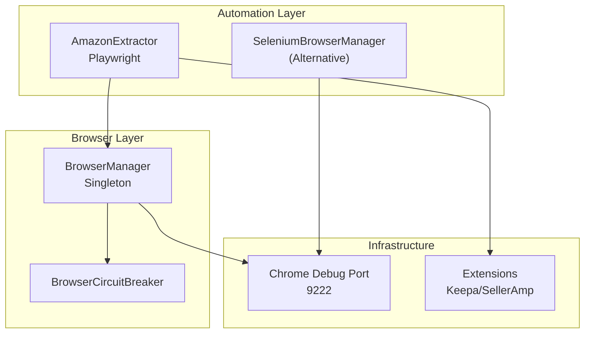
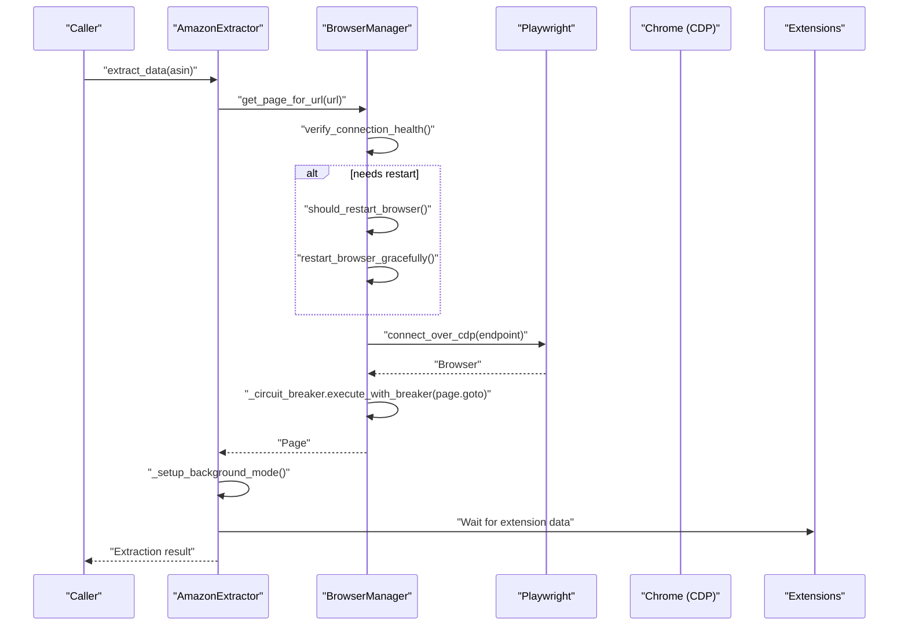
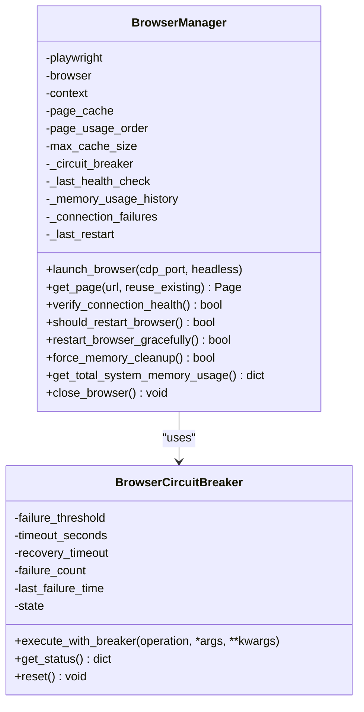
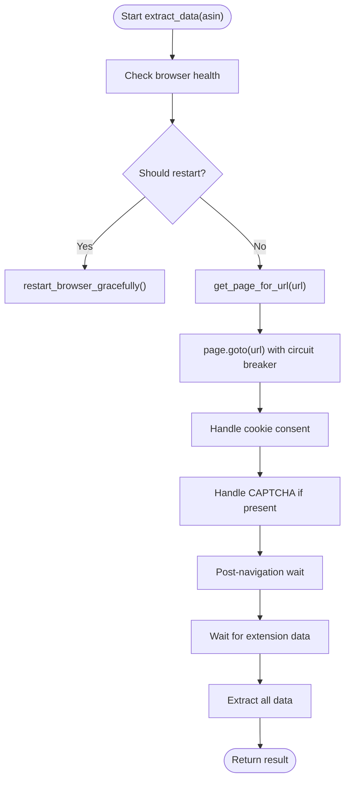
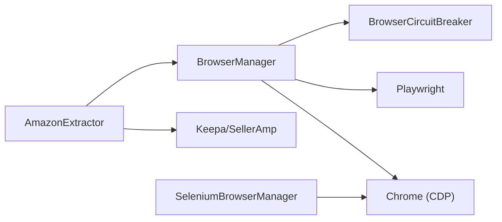

# Browser Automation

<cite>
**Referenced Files in This Document**
- [browser_manager.py](file://utils/browser_manager.py)
- [browser_circuit_breaker.py](file://utils/browser_circuit_breaker.py)
- [amazon_playwright_extractor.py](file://tools/amazon_playwright_extractor.py)
- [selenium_browser_manager.py](file://tools/selenium_browser_manager.py)
- [CHROME_DEBUG_TROUBLESHOOTING_PROMPT.md](file://CHROME_DEBUG_TROUBLESHOOTING_PROMPT.md)
- [state_1757011359.json](file://diagnostics/state_events/state_1757011359.json)
</cite>

## Table of Contents
1. [Introduction](#introduction)
2. [Project Structure](#project-structure)
3. [Core Components](#core-components)
4. [Architecture Overview](#architecture-overview)
5. [Detailed Component Analysis](#detailed-component-analysis)
6. [Dependency Analysis](#dependency-analysis)
7. [Performance Considerations](#performance-considerations)
8. [Troubleshooting Guide](#troubleshooting-guide)
9. [Conclusion](#conclusion)

## Introduction
This document describes the Browser Automation subsystem responsible for Chrome/Chromium automation in the Amazon FBA Agent System. It covers the centralized BrowserManager singleton pattern, page caching strategies, circuit breaker protections, Playwright integration for supplier website scraping and Amazon data extraction, and background-mode techniques to prevent intrusive browser focus. It also documents memory-efficient browser management, session persistence, and fault tolerance, along with infrastructure requirements for Chrome setup and remote debugging port configuration.

## Project Structure
The Browser Automation subsystem centers around:
- Centralized browser management with a singleton BrowserManager
- Circuit breaker for resilience during long-running sessions
- Playwright-based Amazon data extraction with background-mode safeguards
- Optional Selenium-based browser manager for environments requiring alternative drivers

**Diagram sources**
- [browser_manager.py](file://utils/browser_manager.py#L35-L1153)
- [browser_circuit_breaker.py](file://utils/browser_circuit_breaker.py#L37-L214)
- [amazon_playwright_extractor.py](file://tools/amazon_playwright_extractor.py#L63-L122)
- [selenium_browser_manager.py](file://tools/selenium_browser_manager.py#L17-L176)

**Section sources**
- [browser_manager.py](file://utils/browser_manager.py#L1-L1153)
- [browser_circuit_breaker.py](file://utils/browser_circuit_breaker.py#L1-L214)
- [amazon_playwright_extractor.py](file://tools/amazon_playwright_extractor.py#L1-L2512)
- [selenium_browser_manager.py](file://tools/selenium_browser_manager.py#L1-L176)

## Core Components
- BrowserManager (singleton): Manages a persistent Chrome instance via CDP, maintains a small page cache, enforces health checks, and supports graceful restarts and memory cleanup.
- BrowserCircuitBreaker: Protects operations against cascading failures with threshold-based OPEN/HALF_OPEN/CLOSED states.
- AmazonExtractor: Orchestrates Playwright-driven Amazon scraping with cookie consent handling, CAPTCHA mitigation, and extension data extraction.
- SeleniumBrowserManager: Provides an alternative browser manager using Selenium/undetected-chromedriver for environments where Playwright is unsuitable.

**Section sources**
- [browser_manager.py](file://utils/browser_manager.py#L35-L1153)
- [browser_circuit_breaker.py](file://utils/browser_circuit_breaker.py#L37-L214)
- [amazon_playwright_extractor.py](file://tools/amazon_playwright_extractor.py#L63-L122)
- [selenium_browser_manager.py](file://tools/selenium_browser_manager.py#L17-L176)

## Architecture Overview
The system connects to an existing Chrome instance via CDP, ensuring session persistence and extension availability. Pages are reused and cached to reduce overhead. Background-mode safeguards prevent the automation from stealing focus. Circuit breaker and health checks protect long-running operations.

**Diagram sources**
- [browser_manager.py](file://utils/browser_manager.py#L141-L198)
- [browser_manager.py](file://utils/browser_manager.py#L848-L938)
- [browser_manager.py](file://utils/browser_manager.py#L985-L1018)
- [amazon_playwright_extractor.py](file://tools/amazon_playwright_extractor.py#L317-L465)

## Detailed Component Analysis

### BrowserManager Singleton Pattern
- Centralized Chrome lifecycle: connects to an existing Chrome instance via CDP, avoids launching new Chromium instances, and preserves user profiles.
- Page caching: maintains a small LRU cache keyed by URL to reuse pages and reduce navigation overhead.
- Health management: periodic health checks, memory monitoring, and time-based restarts to mitigate resource exhaustion.
- Fault tolerance: circuit breaker integration, fallback strategies, and graceful restarts.
- Memory efficiency: targeted cleanup routines and system memory monitoring to sustain long runs.

**Diagram sources**
- [browser_manager.py](file://utils/browser_manager.py#L35-L1153)
- [browser_circuit_breaker.py](file://utils/browser_circuit_breaker.py#L37-L214)

**Section sources**
- [browser_manager.py](file://utils/browser_manager.py#L35-L1153)
- [browser_circuit_breaker.py](file://utils/browser_circuit_breaker.py#L37-L214)

### Page Caching Strategies
- URL-keyed cache with LRU eviction to limit concurrent pages.
- Reuse existing pages within a persistent context to avoid extension reloads.
- Avoid aggressive bring-to-front operations to prevent focus-related issues.

**Section sources**
- [browser_manager.py](file://utils/browser_manager.py#L141-L208)

### Circuit Breaker Protection Mechanisms
- Threshold-triggered OPEN state to halt operations after repeated failures.
- HALF_OPEN testing with limited retries and recovery timeout.
- Integration with navigation and page operations to prevent cascading failures.

**Section sources**
- [browser_circuit_breaker.py](file://utils/browser_circuit_breaker.py#L37-L214)
- [browser_manager.py](file://utils/browser_manager.py#L180-L183)

### Playwright Integration for Supplier Scraping and Amazon Extraction
- Connection: Uses BrowserManager to connect to an existing Chrome via CDP.
- Navigation: Uses circuit breaker-wrapped page.goto with wait_until and timeouts.
- Cookie consent and CAPTCHA handling: Automated flows with manual fallbacks.
- Extension data waiting: Explicit waits for Keepa/SellerAmp data readiness.
- Page stabilization: Post-navigation waits and background-mode safeguards to avoid focus.

**Diagram sources**
- [amazon_playwright_extractor.py](file://tools/amazon_playwright_extractor.py#L317-L465)
- [browser_manager.py](file://utils/browser_manager.py#L141-L198)

**Section sources**
- [amazon_playwright_extractor.py](file://tools/amazon_playwright_extractor.py#L63-L122)
- [amazon_playwright_extractor.py](file://tools/amazon_playwright_extractor.py#L317-L465)
- [amazon_playwright_extractor.py](file://tools/amazon_playwright_extractor.py#L1383-L1515)

### Chrome DevTools Protocol (CDP) Integration
- Connects to an existing Chrome instance bound to the debug port.
- Dual-stack endpoint selection (IPv6/IPv4) for compatibility with Chrome 139+.
- Persistent context reuse to maintain session state and extension availability.
- Graceful restarts that reconnect without closing the external Chrome.

**Section sources**
- [browser_manager.py](file://utils/browser_manager.py#L77-L140)
- [browser_manager.py](file://utils/browser_manager.py#L242-L300)
- [browser_manager.py](file://utils/browser_manager.py#L985-L1018)
- [CHROME_DEBUG_TROUBLESHOOTING_PROMPT.md](file://CHROME_DEBUG_TROUBLESHOOTING_PROMPT.md#L72-L77)

### Memory-Efficient Browser Management and Fault Tolerance
- Time-based restarts to prevent resource drift.
- System-wide memory monitoring and targeted cleanup routines.
- Circuit breaker and health checks to detect and recover from unstable states.
- Background-mode safeguards to avoid focus-induced instability.

**Section sources**
- [browser_manager.py](file://utils/browser_manager.py#L848-L938)
- [browser_manager.py](file://utils/browser_manager.py#L940-L977)
- [browser_manager.py](file://utils/browser_manager.py#L1019-L1068)

### Infrastructure Requirements and Remote Debugging
- Chrome must be launched with remote debugging enabled on the configured port.
- The default debug port is 9222; diagnostics confirm this expectation.
- Environment variables and configuration should align with the chosen port.

**Section sources**
- [browser_manager.py](file://utils/browser_manager.py#L29-L29)
- [CHROME_DEBUG_TROUBLESHOOTING_PROMPT.md](file://CHROME_DEBUG_TROUBLESHOOTING_PROMPT.md#L72-L77)
- [state_1757011359.json](file://diagnostics/state_events/state_1757011359.json#L309-L310)

## Dependency Analysis

**Diagram sources**
- [amazon_playwright_extractor.py](file://tools/amazon_playwright_extractor.py#L63-L122)
- [browser_manager.py](file://utils/browser_manager.py#L35-L1153)
- [browser_circuit_breaker.py](file://utils/browser_circuit_breaker.py#L37-L214)
- [selenium_browser_manager.py](file://tools/selenium_browser_manager.py#L17-L176)

**Section sources**
- [amazon_playwright_extractor.py](file://tools/amazon_playwright_extractor.py#L63-L122)
- [browser_manager.py](file://utils/browser_manager.py#L35-L1153)
- [browser_circuit_breaker.py](file://utils/browser_circuit_breaker.py#L37-L214)
- [selenium_browser_manager.py](file://tools/selenium_browser_manager.py#L17-L176)

## Performance Considerations
- Prefer page reuse and small caches to minimize navigation overhead.
- Use background-mode safeguards to avoid focus-induced delays.
- Apply circuit breaker and health checks to prevent prolonged stalls.
- Monitor system memory and trigger cleanup proactively to sustain long runs.

## Troubleshooting Guide
Common issues and remedies:
- Chrome debug port accessibility: verify port binding and network stack; use IPv6/IPv4 fallback detection.
- Connection failures: leverage enhanced compatibility modes and progressive timeouts.
- Focus-related instability: background-mode safeguards and avoidance of bring-to-front operations.
- Memory pressure: rely on time-based restarts and targeted cleanup routines.

**Section sources**
- [browser_manager.py](file://utils/browser_manager.py#L242-L300)
- [browser_manager.py](file://utils/browser_manager.py#L398-L428)
- [browser_manager.py](file://utils/browser_manager.py#L848-L938)
- [browser_manager.py](file://utils/browser_manager.py#L940-L977)
- [CHROME_DEBUG_TROUBLESHOOTING_PROMPT.md](file://CHROME_DEBUG_TROUBLESHOOTING_PROMPT.md#L72-L77)
- [state_1757011359.json](file://diagnostics/state_events/state_1757011359.json#L289-L310)

## Conclusion
The Browser Automation subsystem employs a robust, centralized BrowserManager singleton to manage a persistent Chrome instance via CDP, with page caching, health monitoring, and circuit breaker protections. Playwright-based Amazon extraction integrates cookie consent, CAPTCHA handling, and extension data waits, while background-mode safeguards improve stability. The design balances memory efficiency, session persistence, and fault tolerance, with clear infrastructure requirements for Chrome remote debugging.