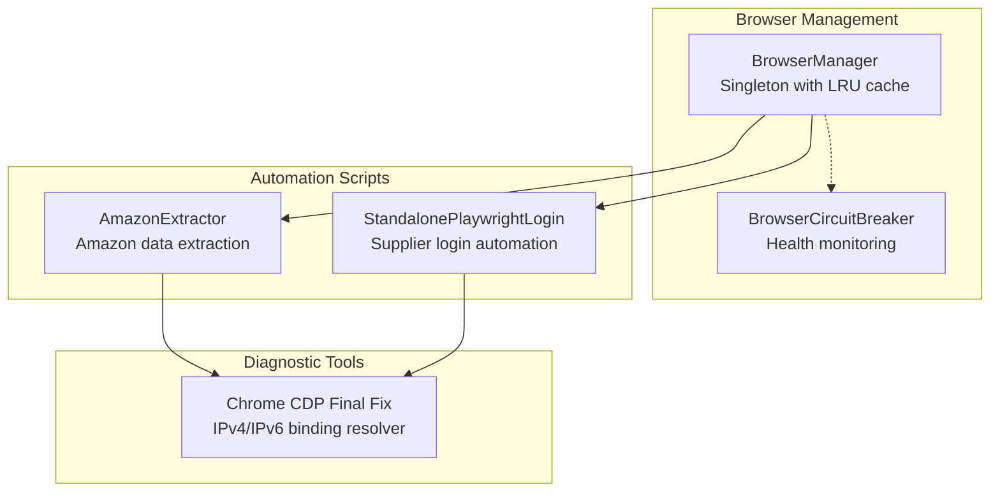
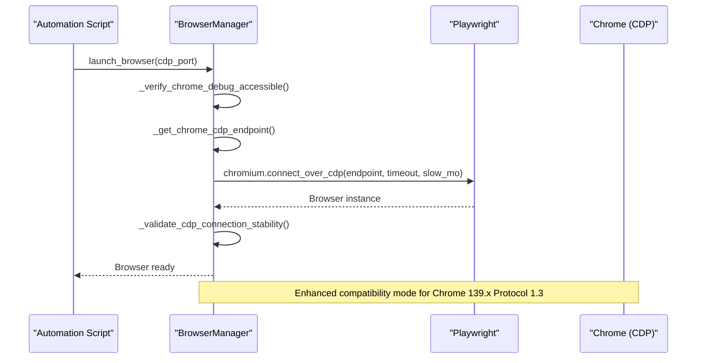
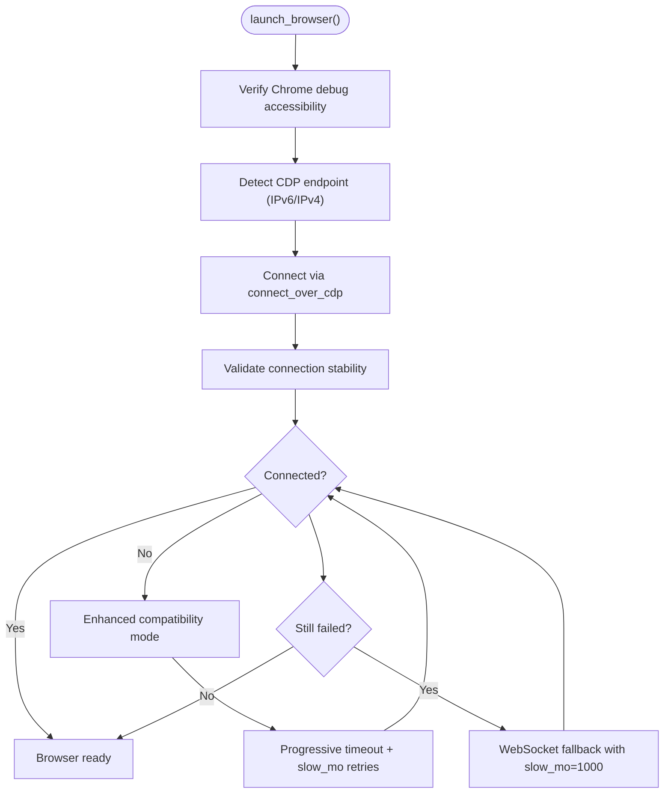
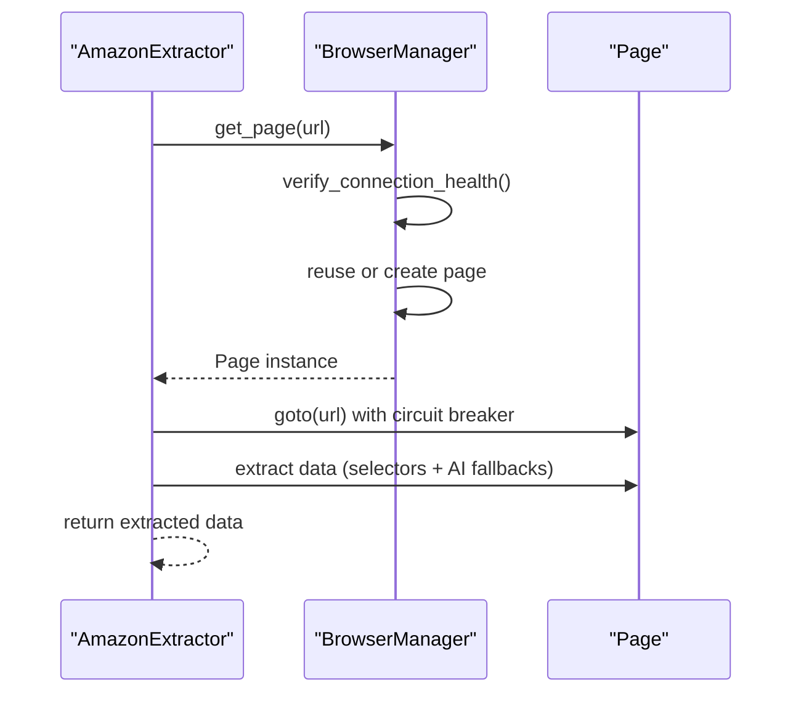
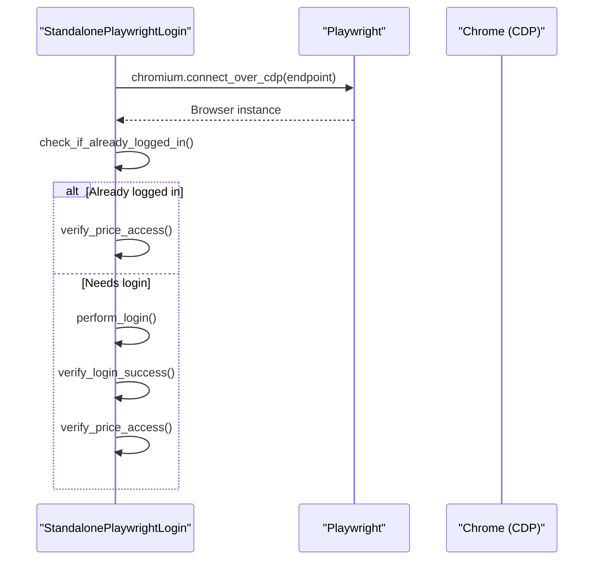
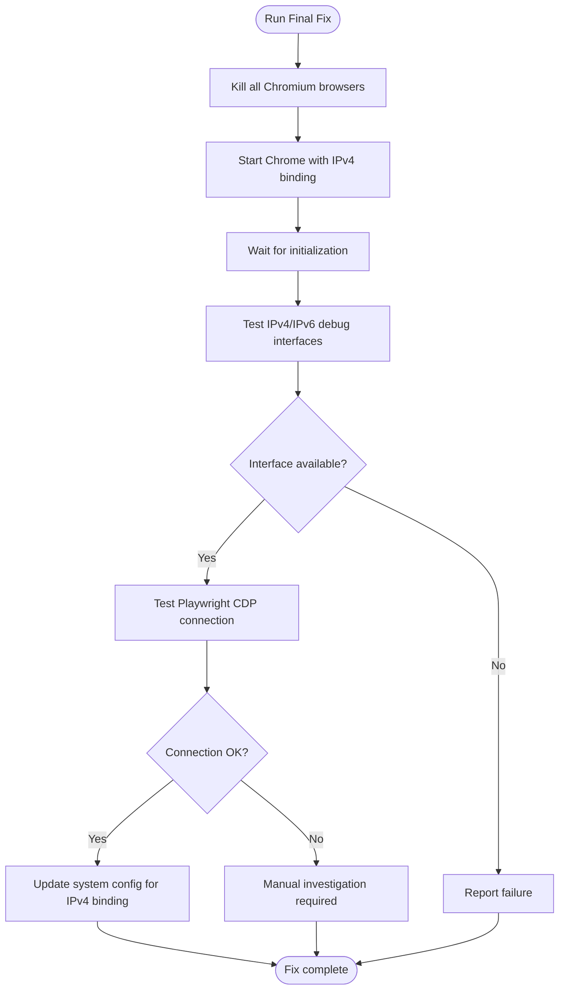
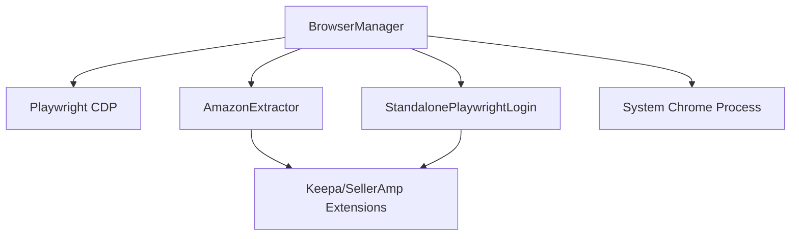

# Chrome DevTools Protocol Integration

<cite>
**Referenced Files in This Document**
- [browser_manager.py](file://utils/browser_manager.py)
- [amazon_playwright_extractor.py](file://tools/amazon_playwright_extractor.py)
- [standalone_playwright_login.py](file://tools/standalone_playwright_login.py)
- [chrome_cdp_final_fix.py](file://chrome_cdp_final_fix.py)
- [browser_manager_chrome_cdp_comprehensive_fixes.md](file://memories/browser_manager_chrome_cdp_comprehensive_fixes.md)
- [chrome_v139_cdp_implementation_final_status.md](file://memories/chrome_v139_cdp_implementation_final_status.md)
</cite>

## Table of Contents
1. [Introduction](#introduction)
2. [Project Structure](#project-structure)
3. [Core Components](#core-components)
4. [Architecture Overview](#architecture-overview)
5. [Detailed Component Analysis](#detailed-component-analysis)
6. [Dependency Analysis](#dependency-analysis)
7. [Performance Considerations](#performance-considerations)
8. [Troubleshooting Guide](#troubleshooting-guide)
9. [Conclusion](#conclusion)

## Introduction
This document explains the Chrome DevTools Protocol (CDP) integration within the browser automation system. It covers connection establishment, IPv6/IPv4 endpoint detection, protocol version handling for Chrome 139.x (Protocol 1.3), enhanced compatibility modes, progressive timeout increases, slow motion timing adjustments, WebSocket fallback mechanisms, connection validation, and protocol handshake verification. It also provides troubleshooting guidance for CDP connection failures, Chrome version detection algorithms, and compatibility matrices for Playwright versions, along with practical examples for configuration, debugging, and performance optimization.

## Project Structure
The CDP integration spans three primary areas:
- Centralized browser management with LRU caching and health monitoring
- Supplier-specific automation scripts leveraging CDP connections
- Diagnostic and fix utilities for IPv6/IPv4 binding and Chrome 139.x compatibility

**Diagram sources**
- [browser_manager.py](file://utils/browser_manager.py#L35-L140)
- [amazon_playwright_extractor.py](file://tools/amazon_playwright_extractor.py#L63-L122)
- [standalone_playwright_login.py](file://tools/standalone_playwright_login.py#L33-L131)
- [chrome_cdp_final_fix.py](file://chrome_cdp_final_fix.py#L13-L56)

**Section sources**
- [browser_manager.py](file://utils/browser_manager.py#L1-L120)
- [amazon_playwright_extractor.py](file://tools/amazon_playwright_extractor.py#L1-L120)
- [standalone_playwright_login.py](file://tools/standalone_playwright_login.py#L1-L60)
- [chrome_cdp_final_fix.py](file://chrome_cdp_final_fix.py#L1-L40)

## Core Components
- BrowserManager: Centralized singleton managing persistent Chrome connections via CDP, with LRU page caching, health monitoring, and fallback strategies.
- AmazonExtractor: Supplier-specific automation that connects to the shared browser instance and performs data extraction.
- StandalonePlaywrightLogin: Independent login automation that connects to the shared Chrome instance via CDP.
- Chrome CDP Final Fix: Utility to diagnose and resolve IPv6/IPv4 binding issues for Chrome 139.x.

Key implementation highlights:
- CDP endpoint detection supports both IPv6 and IPv4 with automatic fallback.
- Enhanced compatibility mode adjusts timeouts and slow motion timing for Chrome 139.x Protocol 1.3.
- WebSocket fallback and connection validation ensure robustness.
- Progressive timeout increases and slow motion timing improve stability across Chrome versions.

**Section sources**
- [browser_manager.py](file://utils/browser_manager.py#L77-L140)
- [browser_manager.py](file://utils/browser_manager.py#L242-L301)
- [browser_manager.py](file://utils/browser_manager.py#L398-L428)
- [browser_manager.py](file://utils/browser_manager.py#L456-L476)
- [browser_manager.py](file://utils/browser_manager.py#L477-L543)
- [browser_manager.py](file://utils/browser_manager.py#L544-L565)
- [browser_manager.py](file://utils/browser_manager.py#L566-L622)
- [browser_manager.py](file://utils/browser_manager.py#L623-L657)

## Architecture Overview
The system establishes a persistent Chrome instance via CDP and shares it across multiple automation scripts. The BrowserManager detects the appropriate endpoint (IPv6/IPv4), applies enhanced compatibility settings for Chrome 139.x, validates the connection, and provides fallbacks when necessary.

**Diagram sources**
- [browser_manager.py](file://utils/browser_manager.py#L77-L140)
- [browser_manager.py](file://utils/browser_manager.py#L242-L301)
- [browser_manager.py](file://utils/browser_manager.py#L398-L428)
- [browser_manager.py](file://utils/browser_manager.py#L544-L565)

## Detailed Component Analysis

### BrowserManager: CDP Connection and Compatibility
The BrowserManager centralizes Chrome connection logic with robust endpoint detection, compatibility modes, and fallback strategies.

- Endpoint Detection:
  - Tests IPv6 first (preferred for Chrome 139+) and falls back to IPv4.
  - Returns the appropriate endpoint string for CDP connection.
- Enhanced Compatibility Mode:
  - Progressive timeout increases and slow motion adjustments tailored for Chrome 139.x Protocol 1.3.
  - Multiple connection attempts with increasing delays.
- WebSocket Fallback:
  - Attempts direct WebSocket connection with maximum timeout and very slow motion for maximum compatibility.
- Connection Validation:
  - Validates browser connectivity and logs version information.
- Troubleshooting:
  - Provides detailed guidance for Chrome debug port issues, including version-specific notes.

**Diagram sources**
- [browser_manager.py](file://utils/browser_manager.py#L77-L140)
- [browser_manager.py](file://utils/browser_manager.py#L242-L301)
- [browser_manager.py](file://utils/browser_manager.py#L398-L428)
- [browser_manager.py](file://utils/browser_manager.py#L456-L476)
- [browser_manager.py](file://utils/browser_manager.py#L544-L565)

**Section sources**
- [browser_manager.py](file://utils/browser_manager.py#L242-L301)
- [browser_manager.py](file://utils/browser_manager.py#L398-L428)
- [browser_manager.py](file://utils/browser_manager.py#L456-L476)
- [browser_manager.py](file://utils/browser_manager.py#L477-L543)
- [browser_manager.py](file://utils/browser_manager.py#L544-L565)

### AmazonExtractor: CDP Integration in Automation
The AmazonExtractor connects to the BrowserManager singleton and performs navigation and data extraction using the shared browser instance.

- Connection:
  - Uses BrowserManager singleton to ensure a single persistent Chrome instance.
- Navigation:
  - Applies circuit breaker for navigation reliability.
  - Avoids bringing pages to front to prevent aggressive browser focus.
- Extension Data:
  - Integrates with Keepa and SellerAmp extensions, with careful handling of background mode.

**Diagram sources**
- [amazon_playwright_extractor.py](file://tools/amazon_playwright_extractor.py#L97-L122)
- [amazon_playwright_extractor.py](file://tools/amazon_playwright_extractor.py#L317-L466)
- [browser_manager.py](file://utils/browser_manager.py#L141-L198)

**Section sources**
- [amazon_playwright_extractor.py](file://tools/amazon_playwright_extractor.py#L97-L122)
- [amazon_playwright_extractor.py](file://tools/amazon_playwright_extractor.py#L317-L466)
- [browser_manager.py](file://utils/browser_manager.py#L141-L198)

### StandalonePlaywrightLogin: CDP-Based Login Automation
The StandalonePlaywrightLogin connects to the shared Chrome instance via CDP, verifies login status, and performs login actions using reliable selectors.

- Connection:
  - Connects to existing Chrome via CDP using the configured endpoint.
- Login Verification:
  - Checks for price visibility and login indicators to determine current state.
- Login Execution:
  - Uses config-driven selectors for email, password, and submit actions.
  - Includes fallbacks like pressing Enter when submit buttons are not found.

**Diagram sources**
- [standalone_playwright_login.py](file://tools/standalone_playwright_login.py#L98-L131)
- [standalone_playwright_login.py](file://tools/standalone_playwright_login.py#L183-L391)
- [standalone_playwright_login.py](file://tools/standalone_playwright_login.py#L543-L580)

**Section sources**
- [standalone_playwright_login.py](file://tools/standalone_playwright_login.py#L98-L131)
- [standalone_playwright_login.py](file://tools/standalone_playwright_login.py#L183-L391)
- [standalone_playwright_login.py](file://tools/standalone_playwright_login.py#L543-L580)

### Chrome CDP Final Fix: IPv6/IPv4 Binding Resolver
The Chrome CDP Final Fix resolves IPv6/IPv4 binding issues for Chrome 139.x by forcing IPv4 binding and validating the debug interface.

- Process Management:
  - Terminates existing Chromium-based browsers to ensure clean state.
- Forced IPv4 Binding:
  - Starts Chrome with `--remote-debugging-address=127.0.0.1` to force IPv4.
- Endpoint Testing:
  - Tests both IPv4 and IPv6 debug interfaces and selects the working one.
- Playwright Connection:
  - Validates Playwright CDP connection to the selected endpoint.
- Configuration Update:
  - Updates system configuration to enforce IPv4 binding for future runs.

**Diagram sources**
- [chrome_cdp_final_fix.py](file://chrome_cdp_final_fix.py#L13-L56)
- [chrome_cdp_final_fix.py](file://chrome_cdp_final_fix.py#L28-L87)
- [chrome_cdp_final_fix.py](file://chrome_cdp_final_fix.py#L88-L118)
- [chrome_cdp_final_fix.py](file://chrome_cdp_final_fix.py#L119-L156)

**Section sources**
- [chrome_cdp_final_fix.py](file://chrome_cdp_final_fix.py#L13-L56)
- [chrome_cdp_final_fix.py](file://chrome_cdp_final_fix.py#L28-L87)
- [chrome_cdp_final_fix.py](file://chrome_cdp_final_fix.py#L88-L118)
- [chrome_cdp_final_fix.py](file://chrome_cdp_final_fix.py#L119-L156)

## Dependency Analysis
The CDP integration relies on Playwright’s CDP capabilities and integrates with system-level Chrome processes. The BrowserManager orchestrates endpoint detection, compatibility modes, and fallbacks, while automation scripts depend on the shared browser instance.

**Diagram sources**
- [browser_manager.py](file://utils/browser_manager.py#L77-L140)
- [amazon_playwright_extractor.py](file://tools/amazon_playwright_extractor.py#L63-L122)
- [standalone_playwright_login.py](file://tools/standalone_playwright_login.py#L33-L131)

**Section sources**
- [browser_manager.py](file://utils/browser_manager.py#L77-L140)
- [amazon_playwright_extractor.py](file://tools/amazon_playwright_extractor.py#L63-L122)
- [standalone_playwright_login.py](file://tools/standalone_playwright_login.py#L33-L131)

## Performance Considerations
- Progressive Timeout Increases: For Chrome 139.x Protocol 1.3, the BrowserManager progressively increases connection timeouts and slow motion timing to accommodate protocol-specific latency.
- Slow Motion Adjustments: Conservative timing settings reduce race conditions and improve stability across versions.
- LRU Page Caching: Limits cached pages to minimize memory pressure and prevent extension-related failures.
- Background Mode: Automation avoids bringing pages to front to prevent aggressive browser focus and reduce UI overhead.
- WebSocket Fallback: When standard CDP fails, the system attempts a WebSocket-based fallback with very slow motion for maximum compatibility.

[No sources needed since this section provides general guidance]

## Troubleshooting Guide

### CDP Connection Failures
Common causes and resolutions:
- Chrome not launched with debug flags:
  - Ensure Chrome is started with `--remote-debugging-port=<port> --user-data-dir=<path>`.
- Port conflicts:
  - Verify the port is free using system network tools and terminate conflicting processes if necessary.
- IPv6/IPv4 binding issues:
  - Use the Chrome CDP Final Fix to force IPv4 binding or rely on automatic endpoint detection.
- Protocol version mismatch:
  - For Chrome 139.x Protocol 1.3, enable enhanced compatibility mode with progressive timeouts and slow motion.

**Section sources**
- [browser_manager.py](file://utils/browser_manager.py#L302-L315)
- [browser_manager.py](file://utils/browser_manager.py#L566-L622)
- [browser_manager.py](file://utils/browser_manager.py#L623-L657)
- [browser_manager_chrome_cdp_comprehensive_fixes.md](file://memories/browser_manager_chrome_cdp_comprehensive_fixes.md#L120-L157)
- [chrome_cdp_final_fix.py](file://chrome_cdp_final_fix.py#L13-L56)

### Chrome Version Detection and Compatibility Matrix
- Chrome 139.x with Protocol 1.3:
  - Requires enhanced compatibility settings: increased timeouts and slow motion.
  - Prefer IPv6 endpoint detection with IPv4 fallback.
- Other Chrome versions:
  - Standard CDP configuration with shorter timeouts and modest slow motion.
- Playwright version compatibility:
  - Ensure Playwright version aligns with installed Chromium; upgrade and reinstall if needed.

**Section sources**
- [browser_manager.py](file://utils/browser_manager.py#L477-L543)
- [browser_manager.py](file://utils/browser_manager.py#L555-L565)
- [browser_manager.py](file://utils/browser_manager.py#L514-L526)

### Practical Examples

- CDP Endpoint Configuration:
  - Use BrowserManager’s automatic endpoint detection to select IPv6 or IPv4.
  - For forced IPv4 binding, start Chrome with `--remote-debugging-address=127.0.0.1`.

- Connection Debugging Techniques:
  - Verify debug port accessibility using HTTP requests to `/json/version`.
  - Check active pages using `/json` endpoint.
  - Monitor memory usage and process detection for accurate diagnostics.

- Performance Optimization Strategies:
  - Enable enhanced compatibility mode for Chrome 139.x.
  - Apply LRU caching and avoid bringing pages to front.
  - Use WebSocket fallback when standard CDP fails.

**Section sources**
- [browser_manager.py](file://utils/browser_manager.py#L242-L301)
- [browser_manager.py](file://utils/browser_manager.py#L566-L622)
- [browser_manager.py](file://utils/browser_manager.py#L658-L800)
- [browser_manager_chrome_cdp_comprehensive_fixes.md](file://memories/browser_manager_chrome_cdp_comprehensive_fixes.md#L120-L157)
- [chrome_cdp_final_fix.py](file://chrome_cdp_final_fix.py#L28-L87)

## Conclusion
The Chrome DevTools Protocol integration leverages a centralized BrowserManager to establish robust CDP connections, with automatic IPv6/IPv4 endpoint detection, enhanced compatibility modes for Chrome 139.x Protocol 1.3, and comprehensive fallback strategies. The system balances stability and performance through progressive timeouts, slow motion adjustments, and careful page lifecycle management. The provided troubleshooting guidance and practical examples enable effective diagnosis and optimization across different Chrome versions and environments.