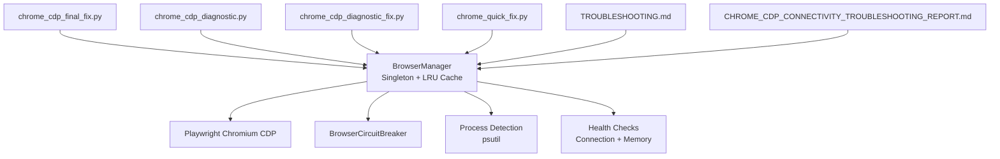
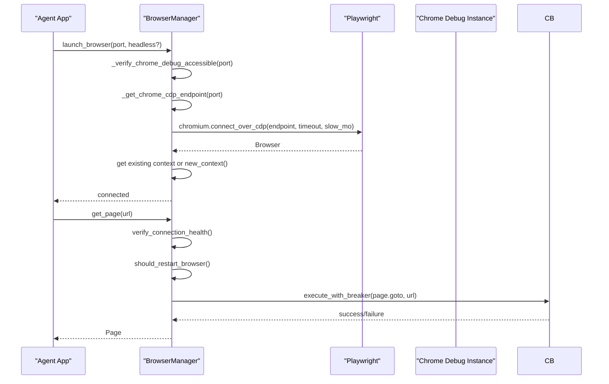
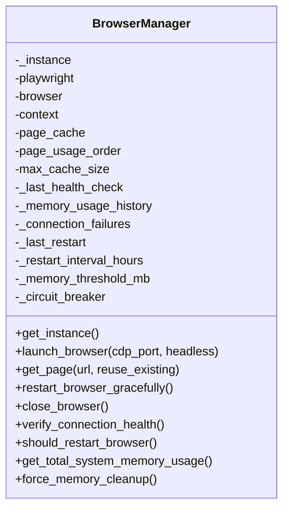
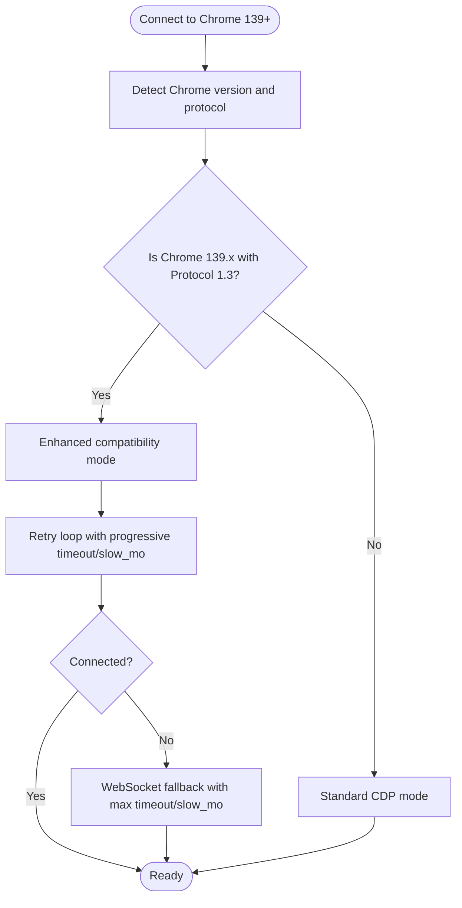
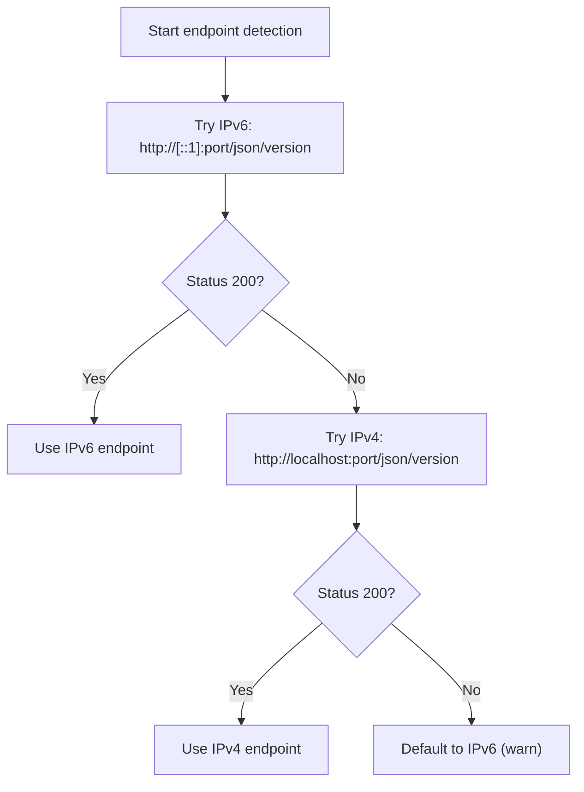
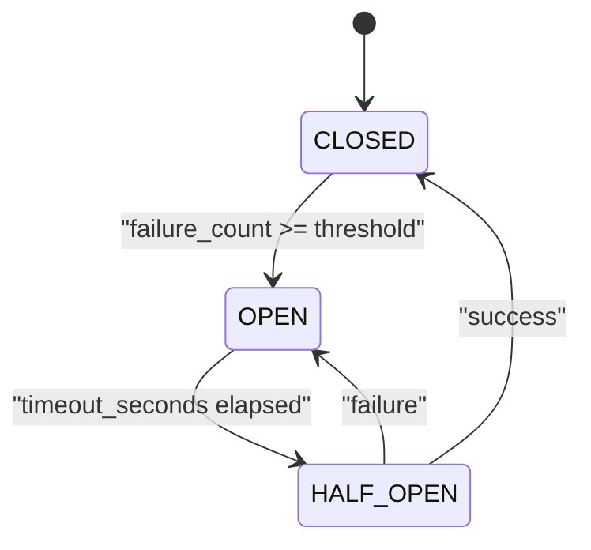
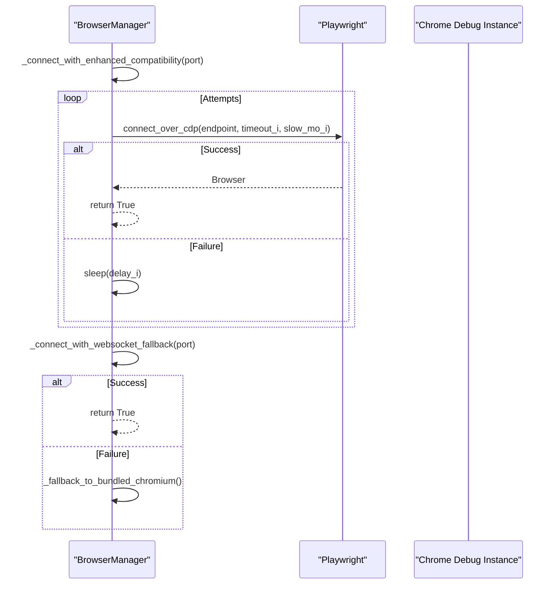
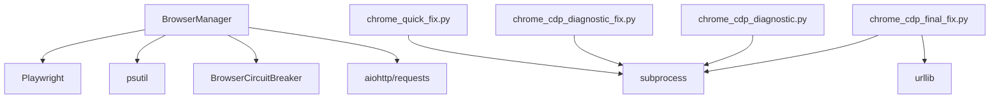

# Browser Connection Management

<cite>
**Referenced Files in This Document**
- [browser_manager.py](file://utils/browser_manager.py)
- [browser_circuit_breaker.py](file://utils/browser_circuit_breaker.py)
- [chrome_cdp_final_fix.py](file://chrome_cdp_final_fix.py)
- [chrome_cdp_diagnostic.py](file://chrome_cdp_diagnostic.py)
- [chrome_cdp_diagnostic_fix.py](file://chrome_cdp_diagnostic_fix.py)
- [chrome_quick_fix.py](file://chrome_quick_fix.py)
- [CHROME_CDP_CONNECTIVITY_TROUBLESHOOTING_REPORT.md](file://CHROME_CDP_CONNECTIVITY_TROUBLESHOOTING_REPORT.md)
- [TROUBLESHOOTING.md](file://docs/TROUBLESHOOTING.md)
</cite>

## Table of Contents
1. [Introduction](#introduction)
2. [Project Structure](#project-structure)
3. [Core Components](#core-components)
4. [Architecture Overview](#architecture-overview)
5. [Detailed Component Analysis](#detailed-component-analysis)
6. [Dependency Analysis](#dependency-analysis)
7. [Performance Considerations](#performance-considerations)
8. [Troubleshooting Guide](#troubleshooting-guide)
9. [Conclusion](#conclusion)

## Introduction
This document explains the browser connection management implementation in the Amazon FBA Agent System with a focus on the BrowserManager singleton pattern, Chrome DevTools Protocol (CDP) connectivity, compatibility modes for Chrome 139+ (Protocol 1.3), IPv4/IPv6 endpoint detection, circuit breaker navigation reliability, connection retry strategies, and graceful fallback mechanisms. It also covers practical Chrome startup commands, connection validation, health monitoring, process detection on Windows, and troubleshooting procedures for CDP connection failures.

## Project Structure
The browser connection management spans several modules:
- Central browser lifecycle and page caching: utils/browser_manager.py
- Circuit breaker for navigation reliability: utils/browser_circuit_breaker.py
- Chrome CDP connectivity fixes and diagnostics: chrome_cdp_final_fix.py, chrome_cdp_diagnostic.py, chrome_cdp_diagnostic_fix.py, chrome_quick_fix.py
- Troubleshooting references: docs/TROUBLESHOOTING.md and CHROME_CDP_CONNECTIVITY_TROUBLESHOOTING_REPORT.md

**Diagram sources**
- [browser_manager.py](file://utils/browser_manager.py#L35-L140)
- [browser_circuit_breaker.py](file://utils/browser_circuit_breaker.py#L37-L110)
- [chrome_cdp_final_fix.py](file://chrome_cdp_final_fix.py#L1-L218)
- [chrome_cdp_diagnostic.py](file://chrome_cdp_diagnostic.py#L1-L421)
- [chrome_cdp_diagnostic_fix.py](file://chrome_cdp_diagnostic_fix.py#L1-L215)
- [chrome_quick_fix.py](file://chrome_quick_fix.py#L1-L124)
- [TROUBLESHOOTING.md](file://docs/TROUBLESHOOTING.md#L111-L145)
- [CHROME_CDP_CONNECTIVITY_TROUBLESHOOTING_REPORT.md](file://CHROME_CDP_CONNECTIVITY_TROUBLESHOOTING_REPORT.md#L1-L126)

**Section sources**
- [browser_manager.py](file://utils/browser_manager.py#L1-L120)
- [browser_circuit_breaker.py](file://utils/browser_circuit_breaker.py#L1-L60)
- [chrome_cdp_final_fix.py](file://chrome_cdp_final_fix.py#L1-L60)
- [chrome_cdp_diagnostic.py](file://chrome_cdp_diagnostic.py#L1-L60)
- [chrome_cdp_diagnostic_fix.py](file://chrome_cdp_diagnostic_fix.py#L1-L60)
- [chrome_quick_fix.py](file://chrome_quick_fix.py#L1-L60)
- [TROUBLESHOOTING.md](file://docs/TROUBLESHOOTING.md#L111-L145)
- [CHROME_CDP_CONNECTIVITY_TROUBLESHOOTING_REPORT.md](file://CHROME_CDP_CONNECTIVITY_TROUBLESHOOTING_REPORT.md#L1-L60)

## Core Components
- BrowserManager singleton: Centralizes Chrome connection, context, and page lifecycle; enforces LRU page caching; integrates health checks and graceful restarts.
- BrowserCircuitBreaker: Implements state machine (CLOSED/OPEN/HALF_OPEN) to protect navigation operations under failure conditions.
- Chrome CDP helpers: Provide IPv4/IPv6 endpoint detection, enhanced compatibility modes for Chrome 139+ Protocol 1.3, and diagnostic scripts for connectivity issues.

Key characteristics:
- Singleton pattern ensures a single persistent Chrome instance is shared across tools.
- CDP-only connection to existing Chrome debug instances; avoids launching new Chromium.
- IPv6-first endpoint detection with IPv4 fallback for Chrome 139+ compatibility.
- Enhanced retry loops with progressive timeouts and backoff for Chrome 139+.
- Circuit breaker for navigation reliability with automatic recovery.
- Graceful restarts and memory monitoring to maintain long-running sessions.

**Section sources**
- [browser_manager.py](file://utils/browser_manager.py#L35-L140)
- [browser_circuit_breaker.py](file://utils/browser_circuit_breaker.py#L37-L110)

## Architecture Overview
The system connects to an existing Chrome instance via Playwright’s connect_over_cdp, validates the connection, and manages pages within a persistent context. Health monitoring and circuit breaker logic guard navigation operations. Diagnostic and fix scripts assist with IPv4/IPv6 binding and startup flags.

**Diagram sources**
- [browser_manager.py](file://utils/browser_manager.py#L77-L140)
- [browser_manager.py](file://utils/browser_manager.py#L141-L198)
- [browser_circuit_breaker.py](file://utils/browser_circuit_breaker.py#L72-L111)

## Detailed Component Analysis

### BrowserManager Singleton Pattern and Lifecycle
- Singleton enforcement prevents multiple browser instances.
- Centralized connection to existing Chrome via CDP; context persistence across page navigations.
- LRU page cache capped to reduce memory pressure; evicts oldest entries when capacity is exceeded.
- Health checks include connection liveness and memory usage monitoring.
- Graceful restart mechanism preserves session continuity by reconnecting rather than closing the persistent browser.

**Diagram sources**
- [browser_manager.py](file://utils/browser_manager.py#L35-L1153)

**Section sources**
- [browser_manager.py](file://utils/browser_manager.py#L35-L140)
- [browser_manager.py](file://utils/browser_manager.py#L848-L938)
- [browser_manager.py](file://utils/browser_manager.py#L979-L1069)

### Enhanced Compatibility Modes for Chrome 139+ (Protocol 1.3)
- Dynamic endpoint selection: tries IPv6 first (Chrome 139+ default), falls back to IPv4.
- Progressive timeout and slow_mo increases per attempt to accommodate Chrome 139+ responsiveness.
- Dedicated enhanced compatibility connection routine with retry loop and backoff.
- Protocol detection supports version-specific configuration tuning.

**Diagram sources**
- [browser_manager.py](file://utils/browser_manager.py#L398-L428)
- [browser_manager.py](file://utils/browser_manager.py#L430-L454)
- [browser_manager.py](file://utils/browser_manager.py#L456-L475)
- [browser_manager.py](file://utils/browser_manager.py#L477-L512)
- [browser_manager.py](file://utils/browser_manager.py#L527-L542)

**Section sources**
- [browser_manager.py](file://utils/browser_manager.py#L273-L301)
- [browser_manager.py](file://utils/browser_manager.py#L398-L428)
- [browser_manager.py](file://utils/browser_manager.py#L430-L454)
- [browser_manager.py](file://utils/browser_manager.py#L456-L475)
- [browser_manager.py](file://utils/browser_manager.py#L477-L542)

### IPv4/IPv6 Endpoint Detection and Connection Validation
- Dual-stack probing: tests IPv6 endpoint first, then IPv4 fallback.
- Validates endpoint reachability and returns appropriate CDP URL.
- Provides detailed troubleshooting steps when ports are inaccessible or blocked.

**Diagram sources**
- [browser_manager.py](file://utils/browser_manager.py#L273-L301)
- [browser_manager.py](file://utils/browser_manager.py#L242-L272)

**Section sources**
- [browser_manager.py](file://utils/browser_manager.py#L242-L301)

### Circuit Breaker Pattern for Navigation Reliability
- State machine: CLOSED → OPEN (after threshold failures) → HALF_OPEN (testing recovery) → CLOSED.
- Automatic recovery after timeout; records success/failure transitions.
- Integrates with BrowserManager to wrap page navigation operations.

**Diagram sources**
- [browser_circuit_breaker.py](file://utils/browser_circuit_breaker.py#L103-L128)

**Section sources**
- [browser_circuit_breaker.py](file://utils/browser_circuit_breaker.py#L37-L110)
- [browser_circuit_breaker.py](file://utils/browser_circuit_breaker.py#L112-L165)

### Connection Retry Mechanisms and Graceful Fallback Strategies
- Retry loops with incremental delays for Chrome 139+ compatibility.
- WebSocket fallback with maximum timeout and conservative slow_mo for broad compatibility.
- Fallback to Playwright bundled Chromium when CDP connection fails (headless mode).
- Persistent browser behavior: disconnect without closing the external Chrome instance.

**Diagram sources**
- [browser_manager.py](file://utils/browser_manager.py#L398-L428)
- [browser_manager.py](file://utils/browser_manager.py#L456-L475)
- [browser_manager.py](file://utils/browser_manager.py#L209-L241)

**Section sources**
- [browser_manager.py](file://utils/browser_manager.py#L398-L475)
- [browser_manager.py](file://utils/browser_manager.py#L209-L241)

### Practical Chrome Startup Commands and Debug Flags
- Start Chrome with remote debugging enabled and a dedicated user data directory.
- Diagnostic and quick-fix scripts demonstrate the exact command-line flags and process management.

Examples (paths and flags):
- Remote debugging port and user data directory
- Disable background throttling and compositor features
- No first run and default browser checks

**Section sources**
- [chrome_cdp_final_fix.py](file://chrome_cdp_final_fix.py#L28-L56)
- [chrome_cdp_diagnostic_fix.py](file://chrome_cdp_diagnostic_fix.py#L80-L98)
- [chrome_quick_fix.py](file://chrome_quick_fix.py#L88-L92)

### Connection Validation Procedures and Health Monitoring
- Lightweight health checks: verify browser version and context responsiveness.
- Memory monitoring: track Chrome and system memory usage; trigger cleanup when thresholds are exceeded.
- Periodic restarts based on elapsed time to mitigate long-running instability.

**Section sources**
- [browser_manager.py](file://utils/browser_manager.py#L848-L884)
- [browser_manager.py](file://utils/browser_manager.py#L816-L847)
- [browser_manager.py](file://utils/browser_manager.py#L885-L938)
- [browser_manager.py](file://utils/browser_manager.py#L940-L978)
- [TROUBLESHOOTING.md](file://docs/TROUBLESHOOTING.md#L111-L145)

### Process Detection Algorithms for Windows Systems
- Enhanced Chrome process detection using psutil with fallbacks for Windows-specific executables.
- Accurate memory reporting across Chrome, Edge, and Chromium variants.

**Section sources**
- [browser_manager.py](file://utils/browser_manager.py#L658-L720)
- [browser_manager.py](file://utils/browser_manager.py#L721-L814)

## Dependency Analysis
- BrowserManager depends on:
  - Playwright for CDP connections and page management
  - psutil for process and memory monitoring
  - BrowserCircuitBreaker for navigation reliability
  - aiohttp/requests for endpoint probing and protocol detection
- Diagnostic and fix scripts depend on subprocess and urllib for process control and HTTP probing.

**Diagram sources**
- [browser_manager.py](file://utils/browser_manager.py#L19-L26)
- [browser_circuit_breaker.py](file://utils/browser_circuit_breaker.py#L25-L32)
- [chrome_cdp_final_fix.py](file://chrome_cdp_final_fix.py#L7-L11)
- [chrome_cdp_diagnostic.py](file://chrome_cdp_diagnostic.py#L1-L60)
- [chrome_cdp_diagnostic_fix.py](file://chrome_cdp_diagnostic_fix.py#L1-L60)
- [chrome_quick_fix.py](file://chrome_quick_fix.py#L7-L11)

**Section sources**
- [browser_manager.py](file://utils/browser_manager.py#L19-L26)
- [browser_circuit_breaker.py](file://utils/browser_circuit_breaker.py#L25-L32)
- [chrome_cdp_final_fix.py](file://chrome_cdp_final_fix.py#L7-L11)
- [chrome_cdp_diagnostic.py](file://chrome_cdp_diagnostic.py#L1-L60)
- [chrome_cdp_diagnostic_fix.py](file://chrome_cdp_diagnostic_fix.py#L1-L60)
- [chrome_quick_fix.py](file://chrome_quick_fix.py#L7-L11)

## Performance Considerations
- Prefer persistent CDP connections to existing Chrome to avoid overhead of launching new browser instances.
- Use conservative slow_mo and progressive timeouts for Chrome 139+ to balance reliability and speed.
- Limit page cache size to prevent memory bloat; trigger cleanup proactively when memory thresholds are approached.
- Avoid aggressive browser focus operations to prevent UI interference and resource contention.

## Troubleshooting Guide
Common issues and remedies:
- Chrome debug port not accessible:
  - Ensure Chrome is started with remote debugging flags and a dedicated user data directory.
  - Verify port is free and reachable via IPv4/IPv6 endpoints.
- IPv4/IPv6 binding problems:
  - Force IPv4 binding or rely on dual-stack detection.
  - Use diagnostic scripts to probe interfaces and test Playwright connectivity.
- Connection failures and navigation instability:
  - Circuit breaker will block operations after repeated failures; wait for automatic recovery or inspect logs.
  - Trigger graceful restart to reset state and reconnect to the persistent browser.
- Memory pressure:
  - Monitor system and Chrome memory usage; perform forced cleanup and consider restarts.

Practical commands and scripts:
- Start Chrome with debug flags
- Kill existing Chrome processes and restart cleanly
- Probe debug endpoints and validate Playwright connectivity
- Run diagnostic and quick-fix scripts for automated remediation

**Section sources**
- [browser_manager.py](file://utils/browser_manager.py#L302-L315)
- [browser_manager.py](file://utils/browser_manager.py#L623-L657)
- [browser_manager.py](file://utils/browser_manager.py#L985-L1019)
- [TROUBLESHOOTING.md](file://docs/TROUBLESHOOTING.md#L111-L145)
- [CHROME_CDP_CONNECTIVITY_TROUBLESHOOTING_REPORT.md](file://CHROME_CDP_CONNECTIVITY_TROUBLESHOOTING_REPORT.md#L1-L126)
- [chrome_cdp_final_fix.py](file://chrome_cdp_final_fix.py#L13-L56)
- [chrome_cdp_diagnostic.py](file://chrome_cdp_diagnostic.py#L1-L60)
- [chrome_cdp_diagnostic_fix.py](file://chrome_cdp_diagnostic_fix.py#L80-L103)
- [chrome_quick_fix.py](file://chrome_quick_fix.py#L40-L124)

## Conclusion
The BrowserManager provides robust, production-ready browser connection management for the Amazon FBA Agent System. By leveraging persistent CDP connections, IPv4/IPv6 endpoint detection, enhanced compatibility modes for Chrome 139+, and a resilient circuit breaker, the system achieves reliable navigation and long-running stability. Health monitoring, graceful restarts, and comprehensive diagnostics further strengthen operational reliability. The included scripts and troubleshooting references offer practical guidance for resolving common CDP connectivity issues and maintaining a healthy automation pipeline.