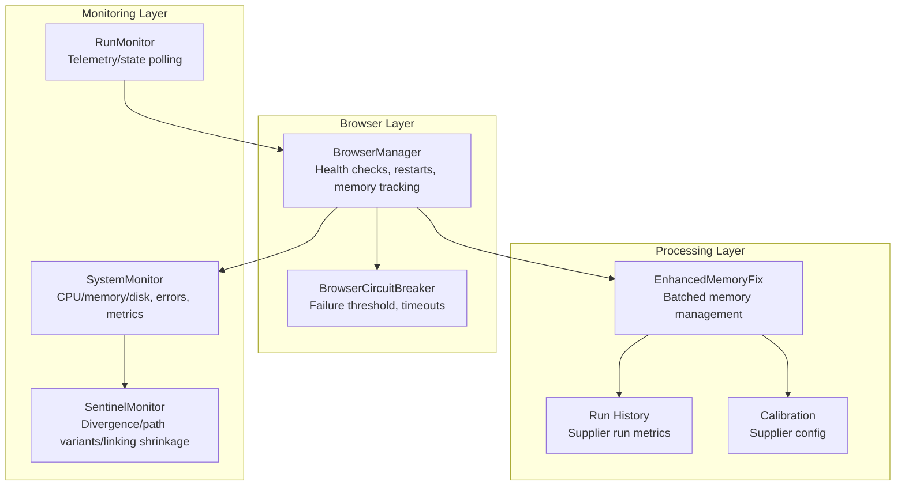
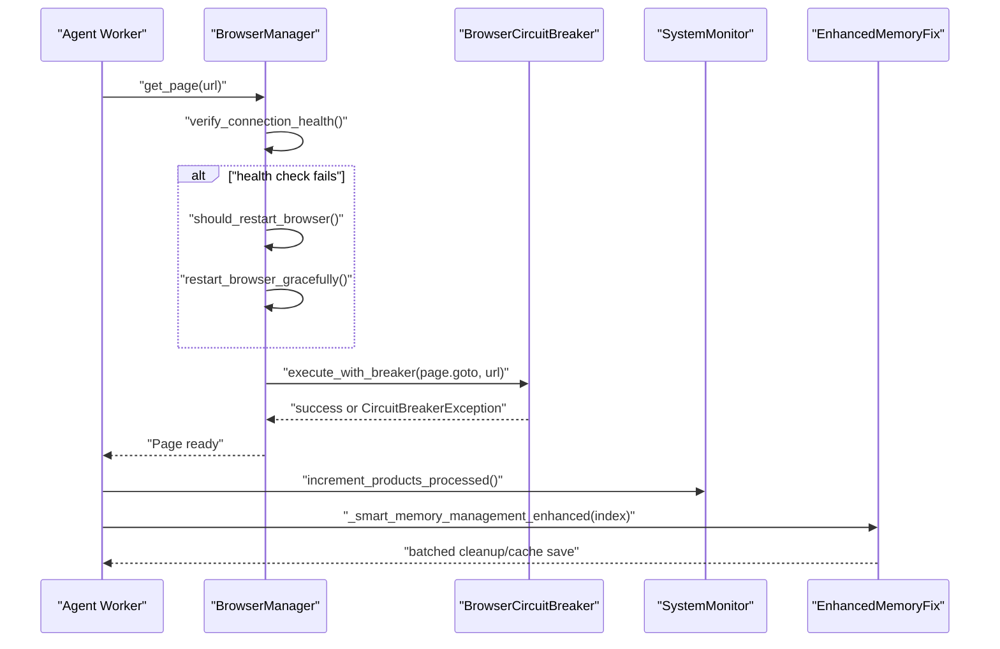
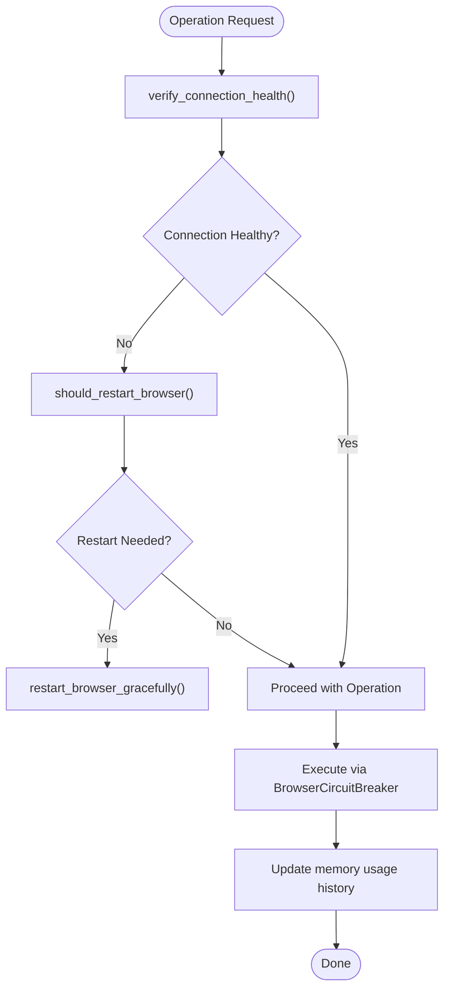
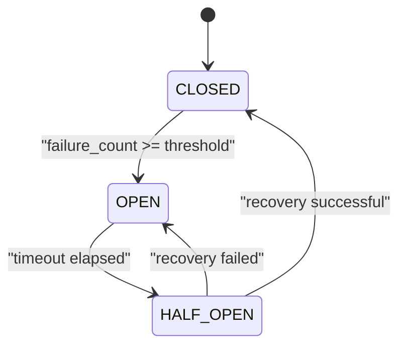
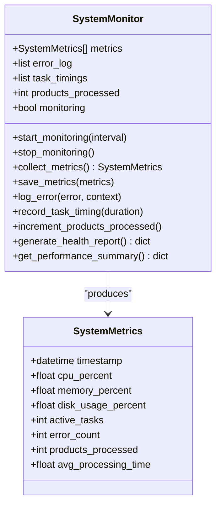
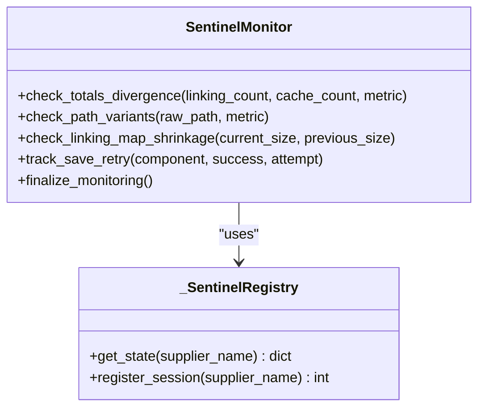
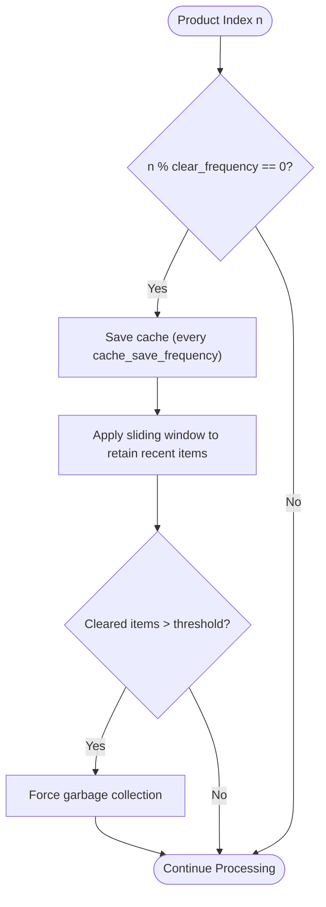
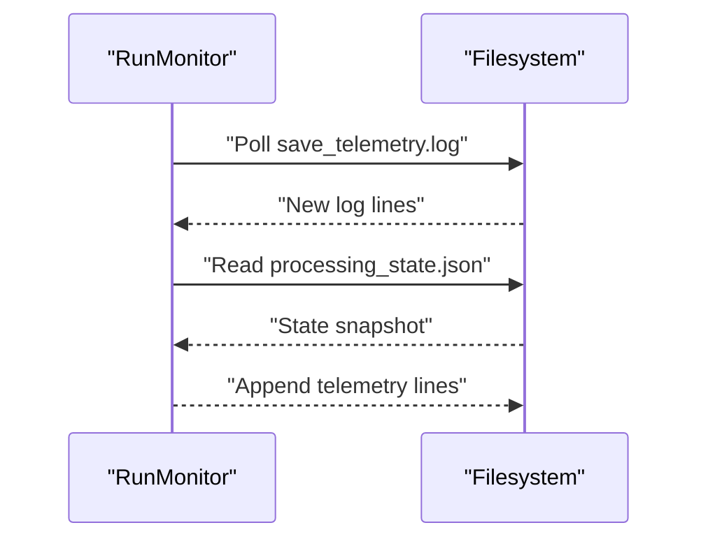
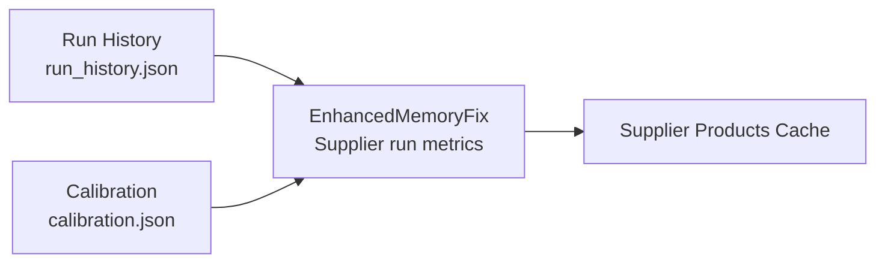
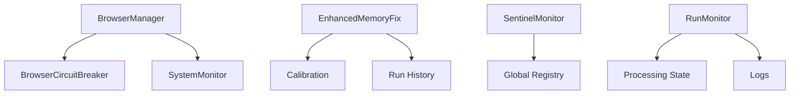

# Browser Health Monitoring

<cite>
**Referenced Files in This Document**
- [browser_manager.py](file://utils/browser_manager.py)
- [browser_circuit_breaker.py](file://utils/browser_circuit_breaker.py)
- [system_monitor.py](file://tools/system_monitor.py)
- [sentinel_monitor.py](file://utils/sentinel_monitor.py)
- [run_monitor.py](file://tools/run_monitor.py)
- [enhanced_memory_fix.py](file://enhanced_memory_fix.py)
- [run_history.json](file://memory/suppliers/poundwholesale/run_history.json)
- [calibration.json](file://memory/suppliers/poundwholesale/calibration.json)
</cite>

## Table of Contents
1. [Introduction](#introduction)
2. [Project Structure](#project-structure)
3. [Core Components](#core-components)
4. [Architecture Overview](#architecture-overview)
5. [Detailed Component Analysis](#detailed-component-analysis)
6. [Dependency Analysis](#dependency-analysis)
7. [Performance Considerations](#performance-considerations)
8. [Troubleshooting Guide](#troubleshooting-guide)
9. [Conclusion](#conclusion)

## Introduction
This document explains the browser health monitoring and management system used by the Amazon FBA Agent System. It covers how the system tracks memory usage, monitors connection reliability, enforces automatic restart policies, and maintains long-running stability during extended supplier scraping sessions. It also documents memory threshold monitoring (2 GB default), restart interval controls (2.5 hours), memory usage history tracking, supplier session monitoring, product processing metrics, and automated cleanup mechanisms. Practical configuration examples and guidance for preventing memory leaks and optimizing performance are included.

## Project Structure
The browser health system spans several modules:
- Browser lifecycle and resource management with health checks and restart triggers
- Circuit breaker to protect against cascading failures during long sessions
- System-wide metrics and health reporting
- Sentinel monitoring for data integrity and anomaly detection
- Run-time telemetry and state monitoring
- Memory management enhancements for batched cleanup and cache persistence

**Diagram sources**
- [browser_manager.py](file://utils/browser_manager.py#L35-L120)
- [browser_circuit_breaker.py](file://utils/browser_circuit_breaker.py#L37-L120)
- [system_monitor.py](file://tools/system_monitor.py#L34-L120)
- [sentinel_monitor.py](file://utils/sentinel_monitor.py#L63-L120)
- [run_monitor.py](file://tools/run_monitor.py#L51-L97)
- [enhanced_memory_fix.py](file://enhanced_memory_fix.py#L2-L60)
- [run_history.json](file://memory/suppliers/poundwholesale/run_history.json#L1-L88)
- [calibration.json](file://memory/suppliers/poundwholesale/calibration.json#L1-L55)

**Section sources**
- [browser_manager.py](file://utils/browser_manager.py#L35-L120)
- [system_monitor.py](file://tools/system_monitor.py#L34-L120)
- [sentinel_monitor.py](file://utils/sentinel_monitor.py#L63-L120)
- [run_monitor.py](file://tools/run_monitor.py#L51-L97)
- [enhanced_memory_fix.py](file://enhanced_memory_fix.py#L2-L60)
- [run_history.json](file://memory/suppliers/poundwholesale/run_history.json#L1-L88)
- [calibration.json](file://memory/suppliers/poundwholesale/calibration.json#L1-L55)

## Core Components
- BrowserManager: Centralized browser lifecycle with health monitoring, memory tracking, restart policy enforcement, and supplier session counters.
- BrowserCircuitBreaker: Protects operations with failure threshold and recovery timeouts to prevent cascading failures.
- SystemMonitor: Aggregates system metrics (CPU, memory, disk), error logs, and processing statistics for health reporting.
- SentinelMonitor: Tracks data integrity anomalies such as totals divergence, path variants, and unexpected shrinking of linking maps.
- RunMonitor: Polls processing state and logs to produce telemetry traces for runtime diagnostics.
- EnhancedMemoryFix: Implements batched memory management with sliding window cache trimming and periodic cache saves.

**Section sources**
- [browser_manager.py](file://utils/browser_manager.py#L35-L120)
- [browser_circuit_breaker.py](file://utils/browser_circuit_breaker.py#L37-L120)
- [system_monitor.py](file://tools/system_monitor.py#L34-L120)
- [sentinel_monitor.py](file://utils/sentinel_monitor.py#L63-L120)
- [run_monitor.py](file://tools/run_monitor.py#L51-L97)
- [enhanced_memory_fix.py](file://enhanced_memory_fix.py#L2-L60)

## Architecture Overview
The browser health system integrates tightly with the browser lifecycle and processing pipeline. BrowserManager orchestrates connections, enforces restart policies, and tracks memory usage. SystemMonitor provides system-level health summaries. SentinelMonitor detects data integrity issues. EnhancedMemoryFix performs periodic cleanup and cache persistence. RunMonitor supplies runtime telemetry.

**Diagram sources**
- [browser_manager.py](file://utils/browser_manager.py#L141-L198)
- [browser_circuit_breaker.py](file://utils/browser_circuit_breaker.py#L72-L111)
- [system_monitor.py](file://tools/system_monitor.py#L115-L118)
- [enhanced_memory_fix.py](file://enhanced_memory_fix.py#L2-L60)

## Detailed Component Analysis

### BrowserManager: Health Monitoring and Automatic Restarts
- Health checks and restart triggers:
  - Periodic verification of connection health before operations.
  - Decision to restart based on elapsed time (2.5 hours default) and memory thresholds (2 GB default).
  - Tracking of connection failures and memory usage history for trend analysis.
- Memory tracking:
  - Measures Chrome process memory usage across multiple processes.
  - Maintains a rolling history of memory measurements for diagnostics.
- Supplier session monitoring:
  - Tracks session start time, products processed, and last memory cleanup.
- Restart controls:
  - Configurable restart interval (hours) and memory threshold (MB).
  - Graceful restart mechanism integrated with health checks.

**Diagram sources**
- [browser_manager.py](file://utils/browser_manager.py#L141-L198)
- [browser_manager.py](file://utils/browser_manager.py#L54-L67)
- [browser_manager.py](file://utils/browser_manager.py#L658-L720)

**Section sources**
- [browser_manager.py](file://utils/browser_manager.py#L54-L67)
- [browser_manager.py](file://utils/browser_manager.py#L141-L198)
- [browser_manager.py](file://utils/browser_manager.py#L658-L720)

### BrowserCircuitBreaker: Failure Protection During Long Sessions
- Threshold-based protection:
  - Failure threshold (default 3) and recovery timeout (default 5 minutes).
  - Half-open testing to gradually restore service after recovery.
- State transitions:
  - CLOSED → OPEN → HALF_OPEN → CLOSED on successful recovery.
- Integration:
  - Used around navigation and other critical browser operations to prevent cascading failures.

**Diagram sources**
- [browser_circuit_breaker.py](file://utils/browser_circuit_breaker.py#L112-L133)

**Section sources**
- [browser_circuit_breaker.py](file://utils/browser_circuit_breaker.py#L37-L120)
- [browser_circuit_breaker.py](file://utils/browser_circuit_breaker.py#L112-L133)

### SystemMonitor: System Metrics and Health Reports
- Metrics collection:
  - CPU percent, memory percent, disk usage percent, active tasks, error count, products processed, average processing time.
- Reporting:
  - Generates health report with averages over recent samples and warning thresholds for CPU, memory, and error rates.
  - Provides performance summary including min/max/avg processing times and system metrics averages.

**Diagram sources**
- [system_monitor.py](file://tools/system_monitor.py#L22-L33)
- [system_monitor.py](file://tools/system_monitor.py#L34-L120)

**Section sources**
- [system_monitor.py](file://tools/system_monitor.py#L22-L33)
- [system_monitor.py](file://tools/system_monitor.py#L34-L120)

### SentinelMonitor: Data Integrity and Anomaly Detection
- Totals divergence checks:
  - Compares linking map counts with cache counts and flags significant divergence.
- Path variant tracking:
  - Detects multiple path representations for the same resource.
- Linking map shrinkage:
  - Alerts when the linking map unexpectedly shrinks.
- Save retry tracking:
  - Records save attempts and outcomes for diagnostics.
- Global registry:
  - Aggregates metrics across sessions for cross-session analysis.

**Diagram sources**
- [sentinel_monitor.py](file://utils/sentinel_monitor.py#L63-L120)
- [sentinel_monitor.py](file://utils/sentinel_monitor.py#L34-L54)

**Section sources**
- [sentinel_monitor.py](file://utils/sentinel_monitor.py#L63-L120)
- [sentinel_monitor.py](file://utils/sentinel_monitor.py#L34-L54)

### EnhancedMemoryFix: Batched Cleanup and Cache Persistence
- Batched memory management:
  - Configurable clear frequency per batch (default 200 products).
  - Sliding window retention to keep recent items and periodically clear older ones.
- Cache persistence:
  - Frequent cache saves (default every 50 products) to reduce memory pressure and enable recovery.
- Garbage collection:
  - Forced GC when significant clearing occurs to reclaim memory promptly.

**Diagram sources**
- [enhanced_memory_fix.py](file://enhanced_memory_fix.py#L2-L60)

**Section sources**
- [enhanced_memory_fix.py](file://enhanced_memory_fix.py#L2-L60)

### RunMonitor: Telemetry and State Polling
- Polls processing state and logs at a short interval.
- Emits structured telemetry lines with timestamps for both log events and state changes.
- Writes PID to a file for process tracking.

**Diagram sources**
- [run_monitor.py](file://tools/run_monitor.py#L51-L97)

**Section sources**
- [run_monitor.py](file://tools/run_monitor.py#L51-L97)

### Supplier Session Monitoring and Product Processing Metrics
- Supplier run history:
  - Tracks run identifiers, timestamps, bucket counts, and artifacts paths for each session.
- Calibration:
  - Supplier-specific configuration affecting parsing and normalization behavior.
- Integration:
  - EnhancedMemoryFix leverages supplier name and cache directories to persist intermediate results.

**Diagram sources**
- [run_history.json](file://memory/suppliers/poundwholesale/run_history.json#L1-L88)
- [calibration.json](file://memory/suppliers/poundwholesale/calibration.json#L1-L55)
- [enhanced_memory_fix.py](file://enhanced_memory_fix.py#L18-L26)

**Section sources**
- [run_history.json](file://memory/suppliers/poundwholesale/run_history.json#L1-L88)
- [calibration.json](file://memory/suppliers/poundwholesale/calibration.json#L1-L55)
- [enhanced_memory_fix.py](file://enhanced_memory_fix.py#L18-L26)

## Dependency Analysis
- BrowserManager depends on:
  - psutil for memory measurement.
  - BrowserCircuitBreaker for operation protection.
  - SystemMonitor for system-level metrics aggregation.
- EnhancedMemoryFix depends on:
  - Supplier configuration and cache directories.
  - File I/O and garbage collection for cleanup.
- SentinelMonitor depends on:
  - Thread-safe registries for cross-session aggregation.
- RunMonitor depends on:
  - Processing state and log file paths for telemetry.

**Diagram sources**
- [browser_manager.py](file://utils/browser_manager.py#L22-L24)
- [browser_circuit_breaker.py](file://utils/browser_circuit_breaker.py#L37-L71)
- [system_monitor.py](file://tools/system_monitor.py#L34-L47)
- [sentinel_monitor.py](file://utils/sentinel_monitor.py#L34-L54)
- [run_monitor.py](file://tools/run_monitor.py#L8-L12)
- [enhanced_memory_fix.py](file://enhanced_memory_fix.py#L6-L10)

**Section sources**
- [browser_manager.py](file://utils/browser_manager.py#L22-L24)
- [browser_circuit_breaker.py](file://utils/browser_circuit_breaker.py#L37-L71)
- [system_monitor.py](file://tools/system_monitor.py#L34-L47)
- [sentinel_monitor.py](file://utils/sentinel_monitor.py#L34-L54)
- [run_monitor.py](file://tools/run_monitor.py#L8-L12)
- [enhanced_memory_fix.py](file://enhanced_memory_fix.py#L6-L10)

## Performance Considerations
- Restart interval tuning:
  - Adjust restart interval (hours) to balance stability and uptime based on observed connection drift.
- Memory thresholds:
  - Tune memory threshold (MB) to catch early memory growth before instability.
- Circuit breaker parameters:
  - Adjust failure threshold and timeout to match workload variability and acceptable recovery time.
- Batch sizes:
  - Increase cache save frequency and sliding window size to reduce peak memory usage during intensive scraping.
- Logging overhead:
  - Reduce log verbosity in production to minimize I/O impact on long runs.

[No sources needed since this section provides general guidance]

## Troubleshooting Guide
- High memory usage:
  - Confirm memory threshold and restart interval are set appropriately.
  - Review memory usage history tracked by BrowserManager.
  - Trigger frequent cache saves and sliding window trimming via EnhancedMemoryFix.
- Connection failures:
  - Use BrowserCircuitBreaker to limit cascading failures.
  - Verify Chrome debug accessibility and endpoint selection logic.
  - Follow troubleshooting steps for Chrome debug port verification and process detection.
- Data integrity issues:
  - Use SentinelMonitor to detect totals divergence, path variants, and linking map shrinkage.
  - Inspect aggregated registry state for cross-session trends.
- Telemetry gaps:
  - Ensure RunMonitor has write permissions and paths are correct.
  - Verify processing state file exists and is readable.

**Section sources**
- [browser_manager.py](file://utils/browser_manager.py#L54-L67)
- [browser_manager.py](file://utils/browser_manager.py#L658-L720)
- [browser_circuit_breaker.py](file://utils/browser_circuit_breaker.py#L112-L133)
- [sentinel_monitor.py](file://utils/sentinel_monitor.py#L79-L109)
- [run_monitor.py](file://tools/run_monitor.py#L51-L97)

## Conclusion
The Amazon FBA Agent System’s browser health monitoring combines robust connection management, memory tracking, and automated restart policies with protective circuit breaking and comprehensive diagnostics. Together, these components sustain long-running supplier scraping sessions while providing actionable insights through metrics, telemetry, and integrity checks. Tuning parameters such as restart intervals, memory thresholds, and batch sizes enables operators to optimize stability and performance for their environments.