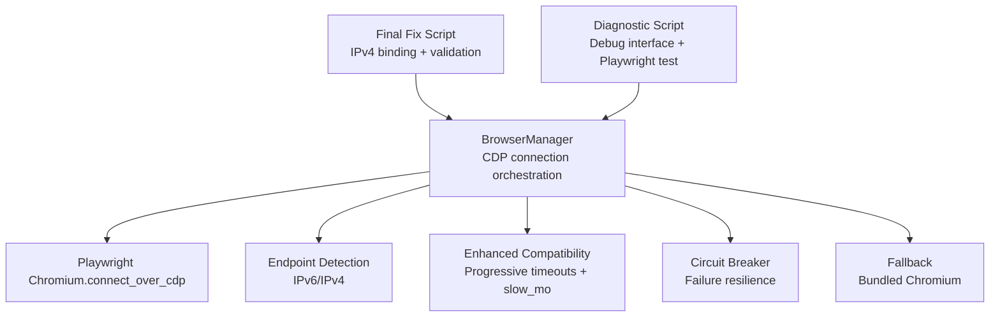
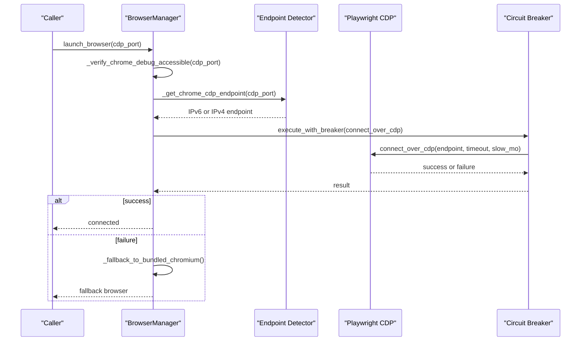
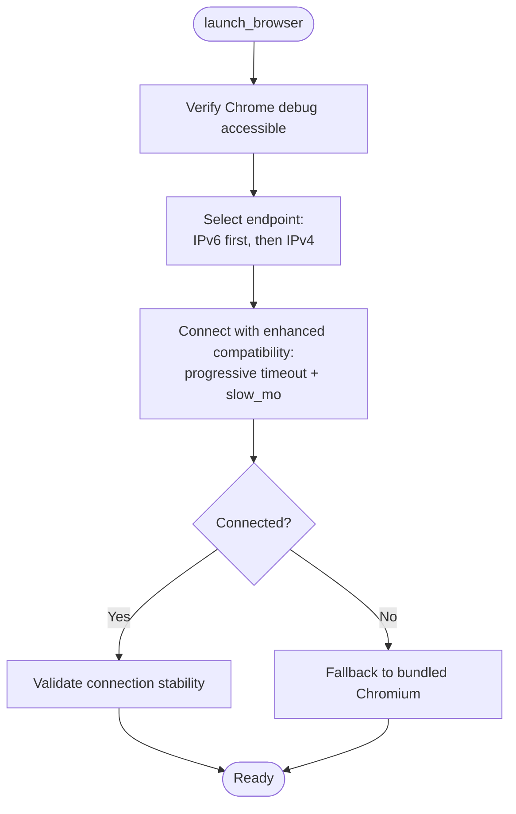
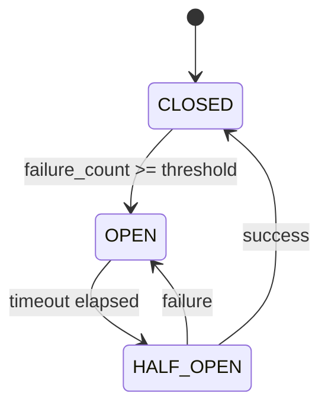
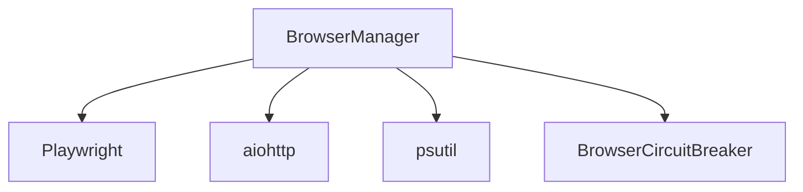

# CDP Connection Handling

<cite>
**Referenced Files in This Document**
- [utils/browser_manager.py](file://utils/browser_manager.py)
- [utils/browser_circuit_breaker.py](file://utils/browser_circuit_breaker.py)
- [chrome_cdp_final_fix.py](file://chrome_cdp_final_fix.py)
- [chrome_cdp_diagnostic_fix.py](file://chrome_cdp_diagnostic_fix.py)
- [CHROME_CDP_CONNECTIVITY_TROUBLESHOOTING_REPORT.md](file://CHROME_CDP_CONNECTIVITY_TROUBLESHOOTING_REPORT.md)
- [browser_manager_chrome_cdp_comprehensive_fixes.md](file://memories/browser_manager_chrome_cdp_comprehensive_fixes.md)
</cite>

## Table of Contents
1. [Introduction](#introduction)
2. [Project Structure](#project-structure)
3. [Core Components](#core-components)
4. [Architecture Overview](#architecture-overview)
5. [Detailed Component Analysis](#detailed-component-analysis)
6. [Dependency Analysis](#dependency-analysis)
7. [Performance Considerations](#performance-considerations)
8. [Troubleshooting Guide](#troubleshooting-guide)
9. [Conclusion](#conclusion)

## Introduction
This document explains Chrome DevTools Protocol (CDP) connection handling in the Amazon FBA Agent System. It focuses on connecting to existing Chrome instances via CDP, with special attention to Chrome 139+ compatibility (Protocol 1.3), IPv6/IPv4 endpoint detection, enhanced compatibility modes, progressive timeouts, slow-motion timing adjustments, connection validation, and robust fallback strategies. Practical configuration examples and troubleshooting procedures are included to help diagnose and resolve common connection failures.

## Project Structure
The CDP connection logic is primarily implemented in the Browser Manager utility, with supporting components for circuit breaking, diagnostics, and final fixes. The structure emphasizes:
- Centralized browser lifecycle management
- IPv6/IPv4 endpoint detection for Chrome 139+
- Enhanced compatibility modes for Protocol 1.3
- Progressive timeout and slow-motion tuning
- Fallback to bundled Chromium when CDP fails
- Diagnostic scripts and troubleshooting reports

**Diagram sources**
- [utils/browser_manager.py](file://utils/browser_manager.py#L77-L140)
- [utils/browser_circuit_breaker.py](file://utils/browser_circuit_breaker.py#L37-L110)
- [chrome_cdp_final_fix.py](file://chrome_cdp_final_fix.py#L28-L86)
- [chrome_cdp_diagnostic_fix.py](file://chrome_cdp_diagnostic_fix.py#L80-L118)

**Section sources**
- [utils/browser_manager.py](file://utils/browser_manager.py#L77-L140)
- [utils/browser_circuit_breaker.py](file://utils/browser_circuit_breaker.py#L37-L110)
- [chrome_cdp_final_fix.py](file://chrome_cdp_final_fix.py#L28-L86)
- [chrome_cdp_diagnostic_fix.py](file://chrome_cdp_diagnostic_fix.py#L80-L118)

## Core Components
- BrowserManager: Central orchestrator for CDP connections, endpoint detection, enhanced compatibility modes, and fallback strategies.
- BrowserCircuitBreaker: Implements circuit breaker pattern to prevent cascading failures during long-running sessions.
- chrome_cdp_final_fix.py: Automated fix script that forces IPv4 binding for Chrome 139+ and validates connectivity.
- chrome_cdp_diagnostic_fix.py: Diagnostic script that starts Chrome with debug flags, tests endpoints, and validates Playwright CDP connectivity.
- Troubleshooting report: Consolidated guidance for diagnosing and resolving CDP connectivity issues.

Key implementation highlights:
- Connects to existing Chrome debug instance only (no new Chromium launches).
- Detects and selects IPv6 or IPv4 endpoints based on Chrome version and protocol.
- Applies enhanced compatibility mode for Chrome 139.x with Protocol 1.3.
- Uses progressive timeouts and slow-motion timing tuned for stability.
- Provides fallback to Playwright’s bundled Chromium when CDP fails.
- Integrates circuit breaker to protect against repeated failures.

**Section sources**
- [utils/browser_manager.py](file://utils/browser_manager.py#L77-L140)
- [utils/browser_manager.py](file://utils/browser_manager.py#L242-L300)
- [utils/browser_manager.py](file://utils/browser_manager.py#L398-L454)
- [utils/browser_manager.py](file://utils/browser_manager.py#L527-L542)
- [utils/browser_circuit_breaker.py](file://utils/browser_circuit_breaker.py#L37-L110)
- [chrome_cdp_final_fix.py](file://chrome_cdp_final_fix.py#L28-L86)
- [chrome_cdp_diagnostic_fix.py](file://chrome_cdp_diagnostic_fix.py#L80-L118)

## Architecture Overview
The CDP connection architecture centers on a deterministic flow that validates the Chrome debug interface, selects the appropriate endpoint, applies compatibility settings, and falls back gracefully when needed.

**Diagram sources**
- [utils/browser_manager.py](file://utils/browser_manager.py#L77-L140)
- [utils/browser_manager.py](file://utils/browser_manager.py#L242-L300)
- [utils/browser_manager.py](file://utils/browser_manager.py#L398-L454)
- [utils/browser_circuit_breaker.py](file://utils/browser_circuit_breaker.py#L72-L110)

## Detailed Component Analysis

### BrowserManager: CDP Connection Orchestration
Responsibilities:
- Verify Chrome debug accessibility on IPv6/IPv4.
- Determine the correct CDP endpoint for Chrome 139+ (Protocol 1.3).
- Apply enhanced compatibility mode with progressive timeouts and slow-motion timing.
- Validate connection stability and provide detailed troubleshooting.
- Fallback to Playwright’s bundled Chromium when CDP fails.

Endpoint detection algorithm:
- Prefer IPv6 endpoint for Chrome 139+ compatibility.
- Fallback to IPv4 if IPv6 fails.
- Default to IPv6 if both checks fail (aligning with Chrome v139 behavior).

Enhanced compatibility mode:
- For Chrome 139.x with Protocol 1.3, increase timeout and slow_mo progressively across attempts.
- Use exponential backoff between attempts to improve reliability.

Connection validation:
- After successful connection, validate browser version and context/page availability.
- Provide detailed troubleshooting steps when connection fails.

**Diagram sources**
- [utils/browser_manager.py](file://utils/browser_manager.py#L77-L140)
- [utils/browser_manager.py](file://utils/browser_manager.py#L242-L300)
- [utils/browser_manager.py](file://utils/browser_manager.py#L398-L454)
- [utils/browser_manager.py](file://utils/browser_manager.py#L527-L542)

**Section sources**
- [utils/browser_manager.py](file://utils/browser_manager.py#L77-L140)
- [utils/browser_manager.py](file://utils/browser_manager.py#L242-L300)
- [utils/browser_manager.py](file://utils/browser_manager.py#L398-L454)
- [utils/browser_manager.py](file://utils/browser_manager.py#L527-L542)

### BrowserCircuitBreaker: Failure Resilience
Purpose:
- Prevent cascading failures during long-running sessions by temporarily blocking operations after repeated failures.
- Provide automatic recovery after a configurable timeout.

Behavior:
- CLOSED: Allow operations; increment failure count on exceptions.
- OPEN: Block operations for a timeout period; raise exceptions with retry timing.
- HALF_OPEN: Allow limited operations to test recovery; transition back to CLOSED on success or OPEN on failure.

**Diagram sources**
- [utils/browser_circuit_breaker.py](file://utils/browser_circuit_breaker.py#L37-L133)

**Section sources**
- [utils/browser_circuit_breaker.py](file://utils/browser_circuit_breaker.py#L37-L110)
- [utils/browser_circuit_breaker.py](file://utils/browser_circuit_breaker.py#L112-L173)

### chrome_cdp_final_fix.py: IPv4 Binding and Validation
Highlights:
- Forces IPv4 binding for Chrome 139+ to resolve endpoint resolution issues.
- Starts Chrome with debug flags and waits for initialization.
- Tests both IPv4 and IPv6 debug interfaces.
- Validates Playwright CDP connection and updates system configuration.

Practical configuration examples:
- Chrome launch flags for IPv4 binding and debugging:
  - remote-debugging-port=9222
  - remote-debugging-address=127.0.0.1
  - disable-web-security
  - disable-features=VizDisplayCompositor,TranslateUI
- System configuration updates:
  - debug_port: 9222
  - binding: ipv4_forced
  - startup_flags: remote-debugging-address, disable-web-security, disable-features

**Section sources**
- [chrome_cdp_final_fix.py](file://chrome_cdp_final_fix.py#L28-L86)
- [chrome_cdp_final_fix.py](file://chrome_cdp_final_fix.py#L119-L155)

### chrome_cdp_diagnostic_fix.py: Debug Interface and Playwright Validation
Highlights:
- Starts Chrome with debug flags and comprehensive logging.
- Tests debug endpoint accessibility and handles timeouts and connection errors.
- Validates Playwright CDP connection and provides actionable feedback.

**Section sources**
- [chrome_cdp_diagnostic_fix.py](file://chrome_cdp_diagnostic_fix.py#L80-L118)

### Troubleshooting Report: Consolidated Guidance
The troubleshooting report consolidates common issues and recommended actions for CDP connectivity failures, including:
- Ensuring Chrome is launched with debug flags.
- Verifying port accessibility and process status.
- Handling version and protocol mismatches.
- Applying the final fix script for IPv4 binding.

**Section sources**
- [CHROME_CDP_CONNECTIVITY_TROUBLESHOOTING_REPORT.md](file://CHROME_CDP_CONNECTIVITY_TROUBLESHOOTING_REPORT.md#L1-L126)

## Dependency Analysis
The BrowserManager depends on:
- Playwright for CDP connections and page management.
- aiohttp for asynchronous endpoint probing.
- psutil for browser memory monitoring and process detection.
- BrowserCircuitBreaker for resilience.

**Diagram sources**
- [utils/browser_manager.py](file://utils/browser_manager.py#L19-L26)
- [utils/browser_manager.py](file://utils/browser_manager.py#L242-L300)
- [utils/browser_circuit_breaker.py](file://utils/browser_circuit_breaker.py#L25-L31)

**Section sources**
- [utils/browser_manager.py](file://utils/browser_manager.py#L19-L26)
- [utils/browser_manager.py](file://utils/browser_manager.py#L242-L300)
- [utils/browser_circuit_breaker.py](file://utils/browser_circuit_breaker.py#L25-L31)

## Performance Considerations
- Progressive timeout increases reduce immediate failures and improve stability for Chrome 139+.
- Slow-motion timing adjustments accommodate slower protocol handshakes and reduce race conditions.
- Circuit breaker prevents repeated failures from overwhelming the system during long runs.
- Endpoint selection prioritizes IPv6 for modern Chrome versions while maintaining IPv4 fallback.

[No sources needed since this section provides general guidance]

## Troubleshooting Guide

Common connection failures and resolutions:
- Chrome debug port not accessible:
  - Ensure Chrome is started with debug flags and user data directory.
  - Verify port is free and reachable.
  - Use diagnostic scripts to test endpoints and Playwright connectivity.
- Protocol version mismatch (Chrome 139.x with Protocol 1.3):
  - Apply enhanced compatibility mode with increased timeout and slow_mo.
  - Use the final fix script to force IPv4 binding for improved endpoint resolution.
- Endpoint resolution issues:
  - Prefer IPv6 endpoint for Chrome 139+; fallback to IPv4 if needed.
  - Default to IPv6 if both checks fail to align with Chrome v139 behavior.
- Fallback scenarios:
  - If CDP fails, launch Playwright’s bundled Chromium in headless mode.
  - Note that profile sync and extensions are not available in fallback mode.

Practical examples:
- CDP connection parameters:
  - Timeout: 30–60 seconds depending on compatibility mode.
  - Slow motion: 100–700 ms depending on attempt and mode.
- Slow motion settings:
  - Conservative timing for stability: 150–200 ms.
  - Enhanced compatibility: progressive increments across attempts.
- IPv6/IPv4 endpoint determination:
  - Test IPv6 first; fallback to IPv4; default to IPv6 if both fail.

**Section sources**
- [utils/browser_manager.py](file://utils/browser_manager.py#L242-L300)
- [utils/browser_manager.py](file://utils/browser_manager.py#L398-L454)
- [utils/browser_manager.py](file://utils/browser_manager.py#L527-L542)
- [chrome_cdp_final_fix.py](file://chrome_cdp_final_fix.py#L28-L86)
- [chrome_cdp_diagnostic_fix.py](file://chrome_cdp_diagnostic_fix.py#L80-L118)
- [CHROME_CDP_CONNECTIVITY_TROUBLESHOOTING_REPORT.md](file://CHROME_CDP_CONNECTIVITY_TROUBLESHOOTING_REPORT.md#L1-L126)

## Conclusion
The Amazon FBA Agent System implements robust CDP connection handling tailored for Chrome 139+ environments. Through IPv6/IPv4 endpoint detection, enhanced compatibility modes, progressive timeouts, slow-motion timing, and resilient fallbacks, the system maintains reliable browser automation. The provided scripts and troubleshooting guidance enable quick diagnosis and resolution of connectivity issues, ensuring stable operation across diverse Chrome versions and network configurations.