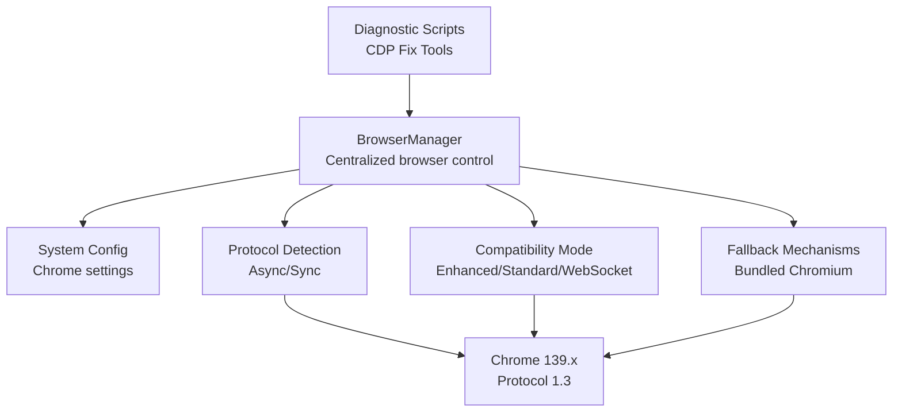
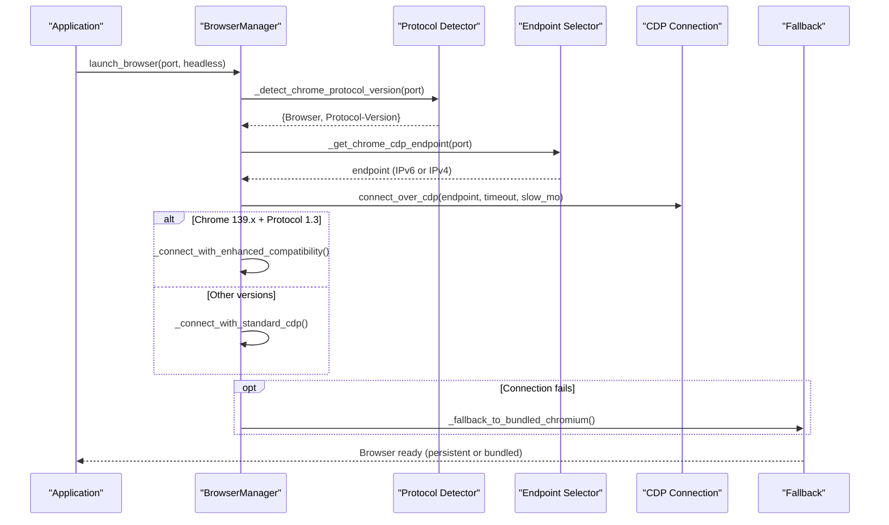
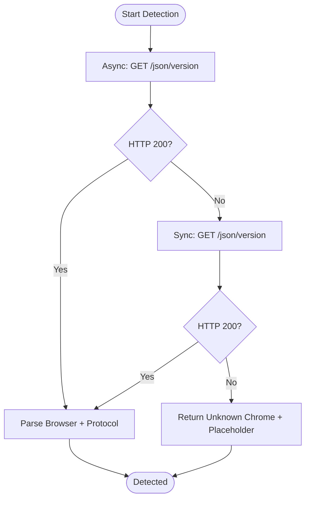
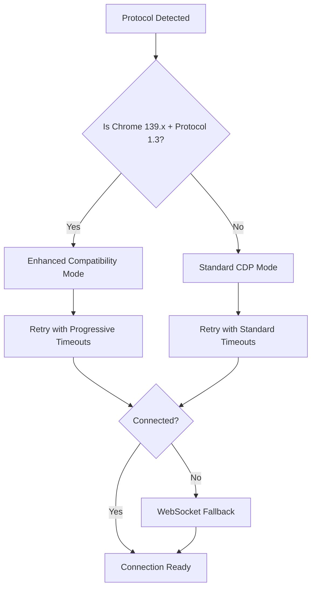
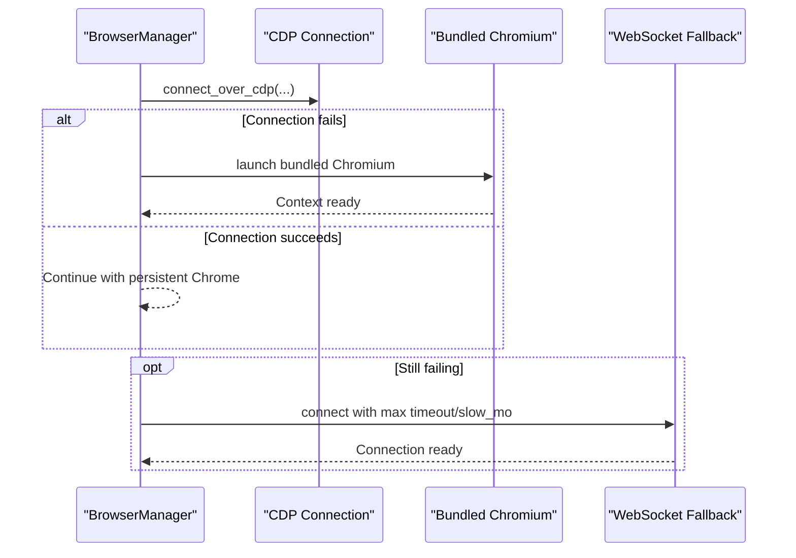
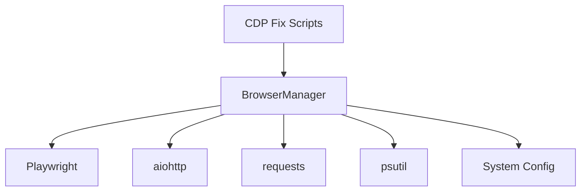

# Chrome Version Compatibility

<cite>
**Referenced Files in This Document**
- [browser_manager.py](file://utils/browser_manager.py)
- [system_config.json](file://config/system_config.json)
- [chrome_cdp_final_fix.py](file://chrome_cdp_final_fix.py)
- [chrome_quick_fix.py](file://chrome_quick_fix.py)
- [browser_manager_chrome_cdp_comprehensive_fixes.md](file://memories/browser_manager_chrome_cdp_comprehensive_fixes.md)
- [chrome_v139_cdp_implementation_final_status.md](file://memories/chrome_v139_cdp_implementation_final_status.md)
- [chrome_cdp_diagnostic.py](file://chrome_cdp_diagnostic.py)
</cite>

## Table of Contents
1. [Introduction](#introduction)
2. [Project Structure](#project-structure)
3. [Core Components](#core-components)
4. [Architecture Overview](#architecture-overview)
5. [Detailed Component Analysis](#detailed-component-analysis)
6. [Dependency Analysis](#dependency-analysis)
7. [Performance Considerations](#performance-considerations)
8. [Troubleshooting Guide](#troubleshooting-guide)
9. [Conclusion](#conclusion)

## Introduction
This document explains the Chrome version compatibility management system used by the Amazon FBA Agent System. It covers automatic Chrome version detection, protocol version assessment (with special handling for Chrome 139.x and Protocol 1.3), compatibility mode selection, and enhanced settings for improved reliability. It also documents fallback detection methods (asynchronous and synchronous), version-specific configuration adjustments, practical examples of compatibility mode activation, protocol validation, and troubleshooting steps for version incompatibilities.

## Project Structure
The Chrome compatibility system spans several components:
- Centralized browser management with LRU caching and health monitoring
- Configuration-driven Chrome settings
- Diagnostic and fix scripts for CDP connectivity
- Memory and performance optimizations tailored for long-running supplier extractions

**Diagram sources**
- [browser_manager.py](file://utils/browser_manager.py#L35-L140)
- [system_config.json](file://config/system_config.json#L200-L207)
- [chrome_cdp_final_fix.py](file://chrome_cdp_final_fix.py#L1-L218)
- [chrome_quick_fix.py](file://chrome_quick_fix.py#L1-L124)

**Section sources**
- [browser_manager.py](file://utils/browser_manager.py#L35-L140)
- [system_config.json](file://config/system_config.json#L200-L207)

## Core Components
- BrowserManager: Singleton that manages Playwright Chromium connections, page caching, health monitoring, and compatibility modes. It supports both persistent Chrome connections (via CDP) and fallback to bundled Chromium.
- System Configuration: Defines Chrome debug port, headless mode, and extension preferences.
- Diagnostic and Fix Scripts: Provide automated solutions for CDP connectivity issues, including IPv4/IPv6 binding and profile startup.

Key capabilities:
- Automatic Chrome version and protocol detection
- Dual-stack endpoint selection (IPv6 preferred, IPv4 fallback)
- Enhanced compatibility mode for Chrome 139.x with Protocol 1.3
- Progressive retry and timeout adjustments
- Fallback to bundled Chromium when persistent Chrome is unavailable

**Section sources**
- [browser_manager.py](file://utils/browser_manager.py#L35-L140)
- [browser_manager.py](file://utils/browser_manager.py#L398-L428)
- [browser_manager.py](file://utils/browser_manager.py#L477-L525)
- [system_config.json](file://config/system_config.json#L200-L207)

## Architecture Overview
The system integrates three detection paths and multiple fallback strategies to ensure robust Chrome connectivity:

**Diagram sources**
- [browser_manager.py](file://utils/browser_manager.py#L77-L140)
- [browser_manager.py](file://utils/browser_manager.py#L398-L428)
- [browser_manager.py](file://utils/browser_manager.py#L430-L454)
- [browser_manager.py](file://utils/browser_manager.py#L209-L241)

## Detailed Component Analysis

### Automatic Chrome Version Detection and Protocol Assessment
The system performs dual-path detection:
- Asynchronous detection using aiohttp to query the Chrome debug JSON endpoint
- Synchronous fallback using requests for environments where async is unavailable

Detection outcomes:
- Returns browser version and protocol version
- On failure, returns placeholder data to trigger compatibility mode

**Diagram sources**
- [browser_manager.py](file://utils/browser_manager.py#L477-L525)

**Section sources**
- [browser_manager.py](file://utils/browser_manager.py#L477-L525)

### Compatibility Mode Selection and Enhanced Settings
When Chrome 139.x with Protocol 1.3 is detected, the system activates enhanced compatibility mode:
- Progressive timeout increases (20s, 30s, 40s, 50s, 60s)
- Increasing slow motion timing (300ms, 400ms, 500ms, 600ms, 700ms)
- Up to five connection attempts with exponential backoff delays

For other versions, standard CDP settings are used with shorter timeouts and modest slow motion.

**Diagram sources**
- [browser_manager.py](file://utils/browser_manager.py#L398-L428)
- [browser_manager.py](file://utils/browser_manager.py#L430-L454)
- [browser_manager.py](file://utils/browser_manager.py#L456-L475)

**Section sources**
- [browser_manager.py](file://utils/browser_manager.py#L398-L428)
- [browser_manager.py](file://utils/browser_manager.py#L430-L454)
- [browser_manager.py](file://utils/browser_manager.py#L527-L542)

### Fallback Detection Methods
Two fallback strategies ensure continuity:
- Fallback to Playwright's bundled Chromium when persistent Chrome is unreachable
- WebSocket direct fallback with maximum timeout and very slow motion for maximum compatibility

**Diagram sources**
- [browser_manager.py](file://utils/browser_manager.py#L209-L241)
- [browser_manager.py](file://utils/browser_manager.py#L456-L475)

**Section sources**
- [browser_manager.py](file://utils/browser_manager.py#L209-L241)
- [browser_manager.py](file://utils/browser_manager.py#L456-L475)

### Synchronous and Asynchronous Detection Approaches
- Asynchronous detection uses aiohttp with short timeouts to quickly determine protocol support
- Synchronous detection uses requests as a fallback when async is unavailable or blocked
- Both paths return structured data to drive compatibility mode selection

**Section sources**
- [browser_manager.py](file://utils/browser_manager.py#L477-L525)

### Version-Specific Configuration Adjustments
Configuration is driven by detected browser and protocol versions:
- Chrome 139.x with Protocol 1.3: extended timeout and conservative slow motion
- Other versions: standard timeout and slow motion

These settings are applied dynamically during connection attempts.

**Section sources**
- [browser_manager.py](file://utils/browser_manager.py#L527-L542)

### Practical Examples

#### Activating Enhanced Compatibility Mode
- The system automatically detects Chrome 139.x + Protocol 1.3 and switches to enhanced compatibility mode
- Progressive retries with increasing timeouts and slow motion are applied

Example activation indicators:
- Multiple connection attempts with incremental delays
- Logging of enhanced compatibility progress

**Section sources**
- [browser_manager.py](file://utils/browser_manager.py#L398-L428)

#### Protocol Version Validation
- Asynchronous detection: GET /json/version via aiohttp
- Synchronous fallback: GET /json/version via requests
- On success, the system logs browser and protocol version and selects appropriate connection settings

**Section sources**
- [browser_manager.py](file://utils/browser_manager.py#L477-L525)

#### Troubleshooting Version Incompatibilities
Common scenarios and remedies:
- IPv4/IPv6 binding issues: Use diagnostic scripts to force IPv4 binding and verify endpoints
- Persistent Chrome not reachable: Switch to bundled Chromium fallback
- Debug port conflicts: Kill existing Chrome processes, free the port, and restart with proper flags

**Section sources**
- [chrome_cdp_final_fix.py](file://chrome_cdp_final_fix.py#L1-L218)
- [chrome_quick_fix.py](file://chrome_quick_fix.py#L1-L124)
- [browser_manager.py](file://utils/browser_manager.py#L209-L241)

## Dependency Analysis
The Chrome compatibility system depends on:
- Playwright for browser automation and CDP connections
- aiohttp/requests for protocol detection
- psutil for memory monitoring and process detection
- System configuration for Chrome debug port and headless preferences

**Diagram sources**
- [browser_manager.py](file://utils/browser_manager.py#L19-L26)
- [system_config.json](file://config/system_config.json#L200-L207)
- [chrome_cdp_final_fix.py](file://chrome_cdp_final_fix.py#L88-L117)

**Section sources**
- [browser_manager.py](file://utils/browser_manager.py#L19-L26)
- [system_config.json](file://config/system_config.json#L200-L207)

## Performance Considerations
- Enhanced compatibility mode increases connection time but improves reliability for Chrome 139.x
- Progressive timeouts and slow motion reduce race conditions and improve stability
- Memory monitoring and periodic restarts prevent long-running sessions from degrading performance
- LRU page caching limits tab count to minimize memory pressure during supplier extractions

[No sources needed since this section provides general guidance]

## Troubleshooting Guide

### Common Issues and Remedies
- Chrome debug port not accessible:
  - Verify port is free and Chrome is started with debug flags
  - Use diagnostic scripts to confirm endpoint accessibility
- Protocol mismatch with Playwright:
  - Ensure Playwright version supports the Chrome version
  - Install compatible Chromium binaries
- IPv4/IPv6 binding problems:
  - Force IPv4 binding and verify connectivity
  - Update system configuration to reflect binding preferences

### Diagnostic Tools
- Automated fix scripts:
  - Kill existing Chrome processes
  - Start Chrome with debug flags and verify endpoints
  - Update configuration for IPv4 binding when needed

**Section sources**
- [browser_manager_chrome_cdp_comprehensive_fixes.md](file://memories/browser_manager_chrome_cdp_comprehensive_fixes.md#L1-L231)
- [chrome_v139_cdp_implementation_final_status.md](file://memories/chrome_v139_cdp_implementation_final_status.md#L1-L193)
- [chrome_cdp_final_fix.py](file://chrome_cdp_final_fix.py#L1-L218)
- [chrome_cdp_diagnostic.py](file://chrome_cdp_diagnostic.py#L1-L421)

## Conclusion
The Amazon FBA Agent System implements a robust Chrome version compatibility framework that automatically detects browser and protocol versions, selects optimal connection strategies, and applies enhanced settings for Chrome 139.x with Protocol 1.3. Through dual-path detection, progressive retries, and comprehensive fallback mechanisms, the system maintains reliability across diverse environments while providing clear diagnostics and remediation paths.