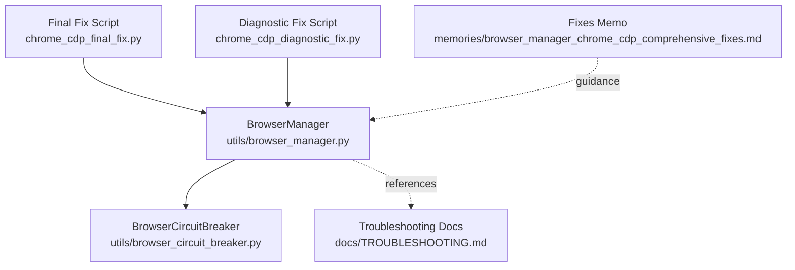
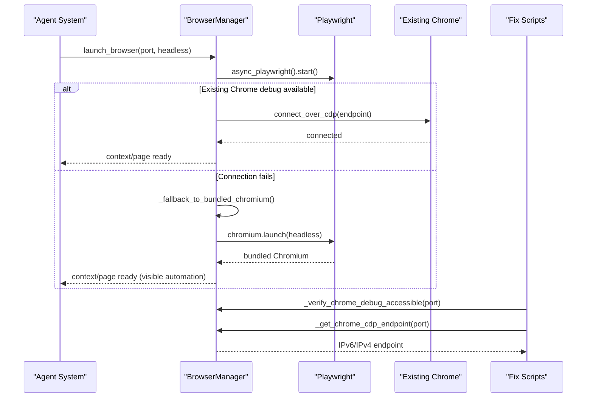
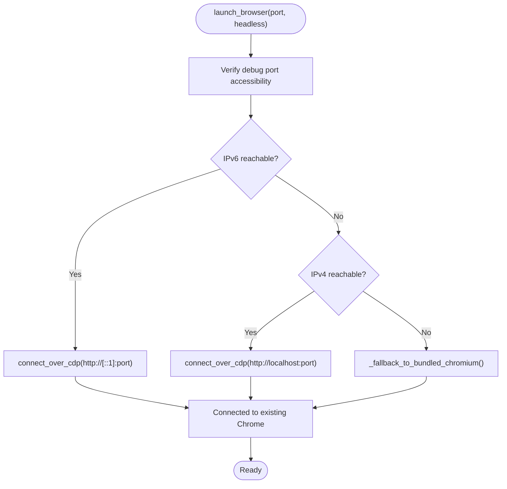
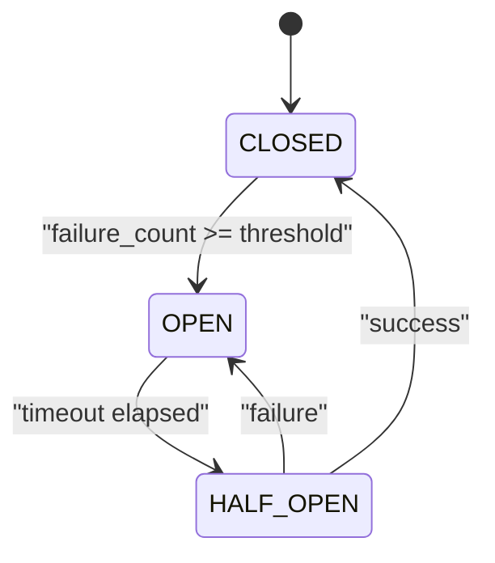
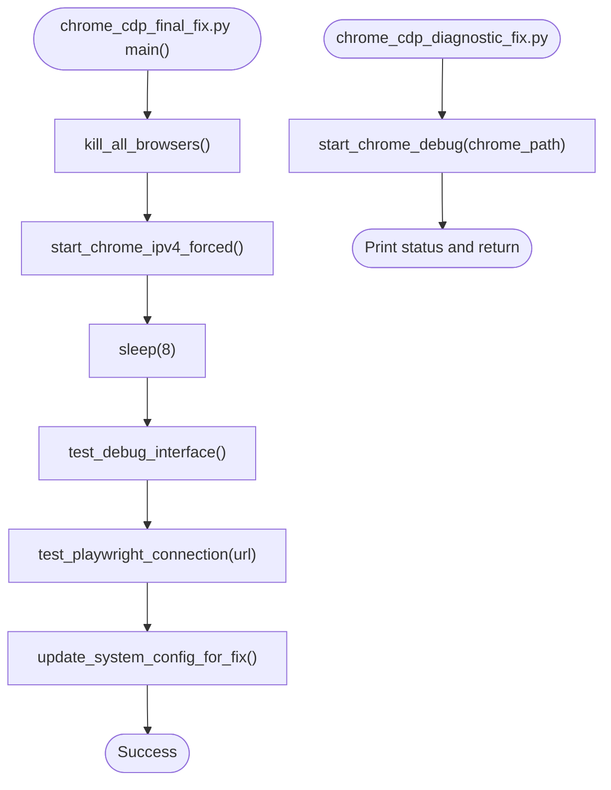
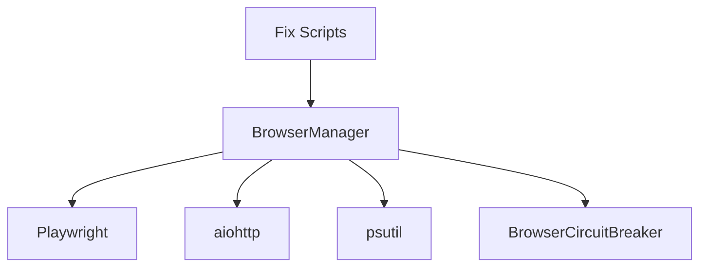

# Connection Troubleshooting

<cite>
**Referenced Files in This Document**
- [browser_manager.py](file://utils/browser_manager.py)
- [browser_circuit_breaker.py](file://utils/browser_circuit_breaker.py)
- [TROUBLESHOOTING.md](file://docs/TROUBLESHOOTING.md)
- [chrome_cdp_final_fix.py](file://chrome_cdp_final_fix.py)
- [chrome_cdp_diagnostic_fix.py](file://chrome_cdp_diagnostic_fix.py)
- [browser_manager_chrome_cdp_comprehensive_fixes.md](file://memories/browser_manager_chrome_cdp_comprehensive_fixes.md)
</cite>

## Table of Contents
1. [Introduction](#introduction)
2. [Project Structure](#project-structure)
3. [Core Components](#core-components)
4. [Architecture Overview](#architecture-overview)
5. [Detailed Component Analysis](#detailed-component-analysis)
6. [Dependency Analysis](#dependency-analysis)
7. [Performance Considerations](#performance-considerations)
8. [Troubleshooting Guide](#troubleshooting-guide)
9. [Conclusion](#conclusion)

## Introduction
This document provides comprehensive troubleshooting guidance for browser connection issues in the Amazon FBA Agent System, with a focus on Chrome remote debugging protocol (CDP) connectivity. It covers step-by-step procedures for verifying ports, detecting processes, validating connections, and applying version-specific fixes. It also documents fallback strategies when Chrome debug connections fail, including Playwright’s bundled Chromium activation and persistent context alternatives. Practical diagnostic commands and resolution steps are included for common connection problems.

## Project Structure
The troubleshooting workflow spans several components:
- Centralized browser management with LRU caching and health monitoring
- Circuit breaker integration for resilience
- Diagnostic and fix scripts for Chrome CDP connectivity
- System-wide troubleshooting documentation

**Diagram sources**
- [browser_manager.py](file://utils/browser_manager.py#L35-L140)
- [browser_circuit_breaker.py](file://utils/browser_circuit_breaker.py#L37-L110)
- [TROUBLESHOOTING.md](file://docs/TROUBLESHOOTING.md#L46-L90)
- [chrome_cdp_final_fix.py](file://chrome_cdp_final_fix.py#L13-L56)
- [chrome_cdp_diagnostic_fix.py](file://chrome_cdp_diagnostic_fix.py#L80-L103)
- [browser_manager_chrome_cdp_comprehensive_fixes.md](file://memories/browser_manager_chrome_cdp_comprehensive_fixes.md#L32-L98)

**Section sources**
- [browser_manager.py](file://utils/browser_manager.py#L35-L140)
- [TROUBLESHOOTING.md](file://docs/TROUBLESHOOTING.md#L46-L90)

## Core Components
- BrowserManager: Centralizes Chrome CDP connection, context management, page caching, and fallback strategies. It supports IPv4/IPv6 endpoint selection and enhanced compatibility modes for Chrome 139.x.
- BrowserCircuitBreaker: Implements circuit breaker logic to prevent cascading failures and enable automatic recovery.
- Troubleshooting documentation: Provides platform-specific commands and remediation steps for Chrome debug port accessibility.
- Chrome CDP fix scripts: Offer automated fixes for IPv4 binding and Playwright connectivity validation.

**Section sources**
- [browser_manager.py](file://utils/browser_manager.py#L35-L140)
- [browser_circuit_breaker.py](file://utils/browser_circuit_breaker.py#L37-L110)
- [TROUBLESHOOTING.md](file://docs/TROUBLESHOOTING.md#L46-L90)
- [chrome_cdp_final_fix.py](file://chrome_cdp_final_fix.py#L13-L56)

## Architecture Overview
The system connects to an existing Chrome instance via CDP. If unavailable, it falls back to Playwright’s bundled Chromium. The BrowserManager encapsulates connection logic, retries, and compatibility handling.

**Diagram sources**
- [browser_manager.py](file://utils/browser_manager.py#L77-L140)
- [browser_manager.py](file://utils/browser_manager.py#L209-L241)
- [browser_manager.py](file://utils/browser_manager.py#L242-L301)
- [chrome_cdp_final_fix.py](file://chrome_cdp_final_fix.py#L57-L86)

## Detailed Component Analysis

### BrowserManager: Chrome CDP Connection and Fallback
- Connection strategy:
  - Attempts to connect to an existing Chrome instance using CDP.
  - Verifies debug port accessibility via IPv6/IPv4 endpoints.
  - Selects appropriate endpoint based on Chrome version and protocol.
- Retry and compatibility:
  - Uses enhanced compatibility mode for Chrome 139.x with progressive timeouts and slower motion settings.
  - Provides WebSocket fallback with maximum timeout and conservative timing.
- Fallback mechanisms:
  - Bundled Chromium launch when CDP fails.
  - Persistent context fallback with separate profile directory and off-screen window positioning.
- Health monitoring:
  - Tracks memory usage and restarts periodically to prevent connection issues.
  - Integrates with BrowserCircuitBreaker to suspend operations during failures.

**Diagram sources**
- [browser_manager.py](file://utils/browser_manager.py#L77-L140)
- [browser_manager.py](file://utils/browser_manager.py#L242-L301)
- [browser_manager.py](file://utils/browser_manager.py#L209-L241)

**Section sources**
- [browser_manager.py](file://utils/browser_manager.py#L77-L140)
- [browser_manager.py](file://utils/browser_manager.py#L242-L301)
- [browser_manager.py](file://utils/browser_manager.py#L209-L241)
- [browser_manager.py](file://utils/browser_manager.py#L302-L428)

### BrowserCircuitBreaker: Resilience During Failures
- Purpose: Prevents cascading failures by temporarily blocking operations after repeated failures, with automatic recovery.
- Behavior:
  - CLOSED: Operations allowed.
  - OPEN: Operations blocked for a timeout period.
  - HALF_OPEN: Limited operations allowed to test recovery.
- Integration: Used by BrowserManager to wrap navigation and other browser operations.

**Diagram sources**
- [browser_circuit_breaker.py](file://utils/browser_circuit_breaker.py#L37-L110)

**Section sources**
- [browser_circuit_breaker.py](file://utils/browser_circuit_breaker.py#L37-L110)

### Chrome CDP Fix Scripts: Automated Diagnostics and Remediation
- Final Fix Script:
  - Stops all Chromium-based browsers.
  - Starts Chrome with forced IPv4 binding for debug port.
  - Tests both IPv4 and IPv6 debug interfaces.
  - Validates Playwright CDP connection and updates system configuration.
- Diagnostic Fix Script:
  - Starts Chrome with debug flags and prints detailed status.
  - Tests debug endpoint accessibility and handles timeouts and connection errors.

**Diagram sources**
- [chrome_cdp_final_fix.py](file://chrome_cdp_final_fix.py#L157-L205)
- [chrome_cdp_diagnostic_fix.py](file://chrome_cdp_diagnostic_fix.py#L80-L103)

**Section sources**
- [chrome_cdp_final_fix.py](file://chrome_cdp_final_fix.py#L13-L56)
- [chrome_cdp_final_fix.py](file://chrome_cdp_final_fix.py#L57-L118)
- [chrome_cdp_final_fix.py](file://chrome_cdp_final_fix.py#L157-L205)
- [chrome_cdp_diagnostic_fix.py](file://chrome_cdp_diagnostic_fix.py#L80-L103)

### Conceptual Overview
- IPv4 vs IPv6 binding:
  - Chrome 139.x prefers IPv6; the system tests IPv6 first and falls back to IPv4.
  - Fix scripts enforce IPv4 binding to resolve connectivity issues.
- Fallback strategies:
  - Playwright bundled Chromium for headless automation when Chrome debug is unavailable.
  - Persistent context fallback with separate profile directory to avoid conflicts.

[No sources needed since this section doesn't analyze specific files]

## Dependency Analysis
- BrowserManager depends on:
  - Playwright for CDP connections and browser launches.
  - aiohttp for asynchronous HTTP checks of debug endpoints.
  - psutil for memory usage monitoring and process detection.
- BrowserCircuitBreaker integrates with BrowserManager to protect operations.
- Fix scripts depend on subprocess and urllib for process and HTTP operations.

**Diagram sources**
- [browser_manager.py](file://utils/browser_manager.py#L19-L26)
- [browser_circuit_breaker.py](file://utils/browser_circuit_breaker.py#L25-L31)
- [chrome_cdp_final_fix.py](file://chrome_cdp_final_fix.py#L7-L11)

**Section sources**
- [browser_manager.py](file://utils/browser_manager.py#L19-L26)
- [browser_circuit_breaker.py](file://utils/browser_circuit_breaker.py#L25-L31)
- [chrome_cdp_final_fix.py](file://chrome_cdp_final_fix.py#L7-L11)

## Performance Considerations
- Connection timeouts and slow motion:
  - Chrome 139.x compatibility uses increased timeouts and slower motion to stabilize connections.
- Memory monitoring:
  - Periodic browser restarts prevent memory-related connection failures.
- Headless vs visible automation:
  - Bundled Chromium is launched headless to avoid popups; persistent context fallback positions windows off-screen.

[No sources needed since this section provides general guidance]

## Troubleshooting Guide

### Step-by-Step: Chrome Debug Port Connectivity
1. Verify Chrome is running with debug flags:
   - Windows: taskkill /F /IM chrome.exe
   - Start Chrome with debug port and user data directory
   - Confirm with curl http://localhost:9222/json/version
2. Check port availability:
   - netstat -an | findstr :9222 (Windows)
3. Validate connection from the system:
   - Use BrowserManager’s verification logic to test IPv6 and IPv4 endpoints.
4. If connection fails:
   - Use the Final Fix Script to force IPv4 binding and validate Playwright CDP.
   - Alternatively, use the Diagnostic Fix Script to start Chrome with debug flags and print status.

Practical commands:
- Windows: taskkill /F /IM chrome.exe
- Start Chrome: chrome --remote-debugging-port=9222 --user-data-dir=C:\temp\chrome-debug
- Verify: curl http://localhost:9222/json/version
- Run fix: python chrome_cdp_final_fix.py
- Run diagnostic: python chrome_cdp_diagnostic_fix.py

Resolution steps for common issues:
- Port in use: Kill Chrome processes, choose a different port, and retry.
- IPv6/IPv4 mismatch: Use the Final Fix Script to enforce IPv4 binding.
- Chrome not started with debug flags: Start Chrome with --remote-debugging-port and --user-data-dir.
- Playwright version mismatch: Upgrade Playwright and install Chromium.

**Section sources**
- [TROUBLESHOOTING.md](file://docs/TROUBLESHOOTING.md#L46-L90)
- [browser_manager.py](file://utils/browser_manager.py#L242-L301)
- [chrome_cdp_final_fix.py](file://chrome_cdp_final_fix.py#L13-L56)
- [chrome_cdp_diagnostic_fix.py](file://chrome_cdp_diagnostic_fix.py#L80-L103)

### Version-Specific Guidance
- Chrome 139.x Protocol 1.3:
  - Prefer IPv6 binding; if unreachable, fall back to IPv4.
  - Use enhanced compatibility mode with progressive timeouts and slower motion.
- Playwright version alignment:
  - Ensure Playwright version compatibility; reinstall if needed.

**Section sources**
- [browser_manager.py](file://utils/browser_manager.py#L398-L428)
- [browser_manager.py](file://utils/browser_manager.py#L527-L542)

### Chrome Process Management
- Stop all Chromium-based browsers before starting with debug flags.
- Use separate profile directories for user Chrome and Playwright fallback to avoid conflicts.
- Position Playwright fallback windows off-screen to prevent focus interference.

**Section sources**
- [chrome_cdp_final_fix.py](file://chrome_cdp_final_fix.py#L13-L26)
- [browser_manager.py](file://utils/browser_manager.py#L342-L373)

### Network Connectivity Checks
- Test IPv4 and IPv6 endpoints for the debug port.
- Validate HTTP status codes and JSON responses from /json/version and /json.
- Use short timeouts for fast failure detection.

**Section sources**
- [browser_manager.py](file://utils/browser_manager.py#L242-L301)
- [browser_manager.py](file://utils/browser_manager.py#L566-L622)

### Fallback Strategies When Chrome Debug Connection Fails
- Playwright bundled Chromium:
  - Launches headless by default to avoid popups; automation remains visible.
  - Extensions and profile sync are not available.
- Persistent context fallback:
  - Uses a separate profile directory and off-screen window positioning.
  - Different debug port to avoid conflicts with user Chrome.

**Section sources**
- [browser_manager.py](file://utils/browser_manager.py#L209-L241)
- [browser_manager.py](file://utils/browser_manager.py#L342-L373)
- [browser_manager_chrome_cdp_comprehensive_fixes.md](file://memories/browser_manager_chrome_cdp_comprehensive_fixes.md#L77-L98)

### Practical Examples
- Running the Final Fix Script:
  - python chrome_cdp_final_fix.py
- Running the Diagnostic Fix Script:
  - python chrome_cdp_diagnostic_fix.py
- Verifying debug port from Python:
  - Use BrowserManager’s verification methods to test endpoints.

**Section sources**
- [chrome_cdp_final_fix.py](file://chrome_cdp_final_fix.py#L157-L205)
- [chrome_cdp_diagnostic_fix.py](file://chrome_cdp_diagnostic_fix.py#L80-L103)
- [browser_manager.py](file://utils/browser_manager.py#L566-L622)

## Conclusion
The Amazon FBA Agent System provides robust mechanisms to diagnose and resolve Chrome CDP connectivity issues. By verifying ports, managing processes, and leveraging IPv4/IPv6 compatibility, the system can maintain stable connections. When CDP fails, it seamlessly falls back to Playwright’s bundled Chromium or a persistent context, ensuring continued automation. Use the provided scripts and troubleshooting steps to quickly identify and resolve connection problems.