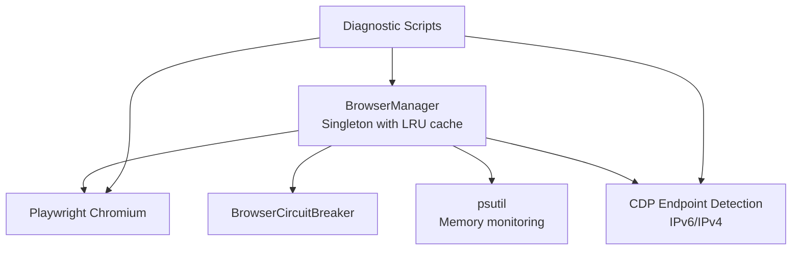
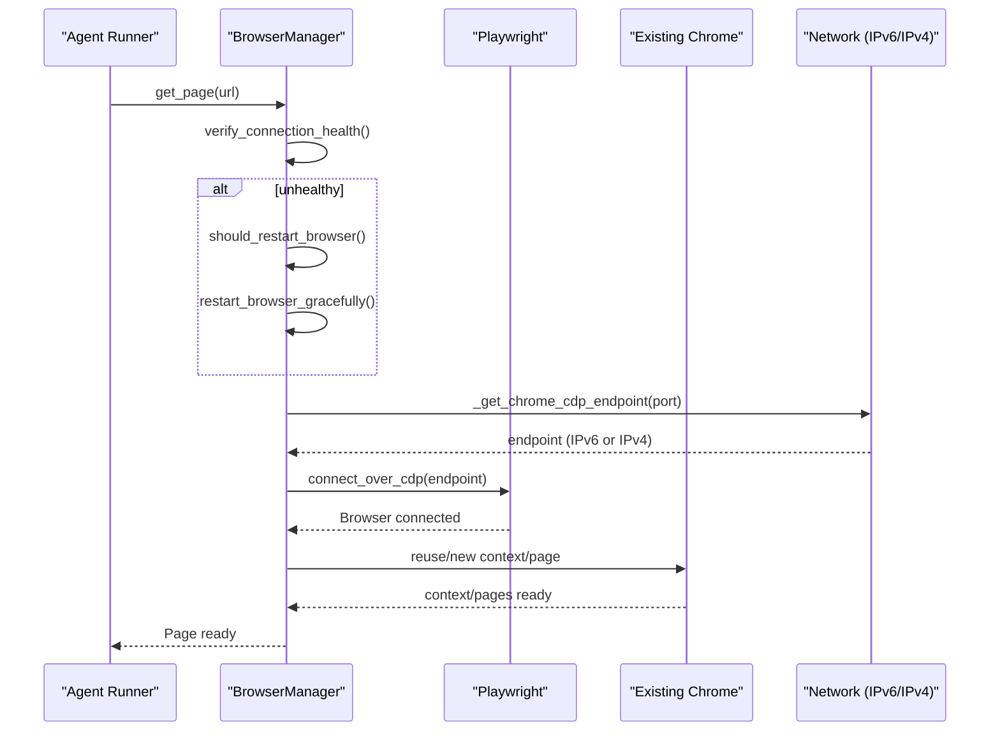
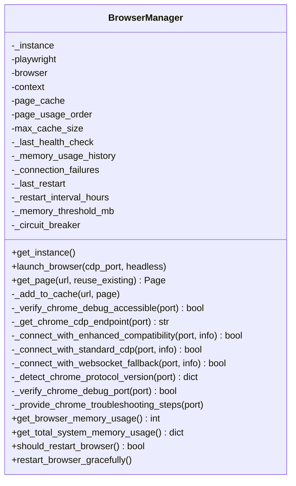
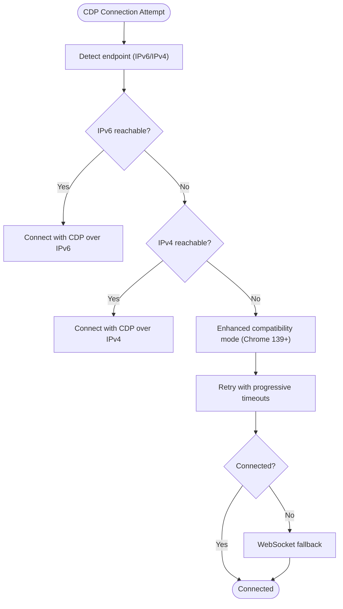
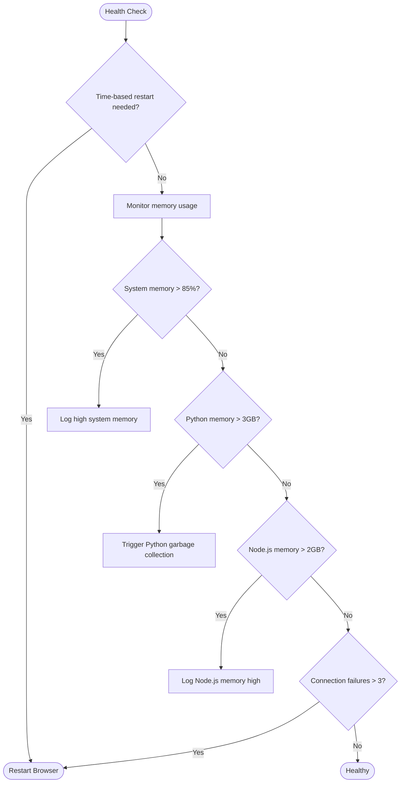
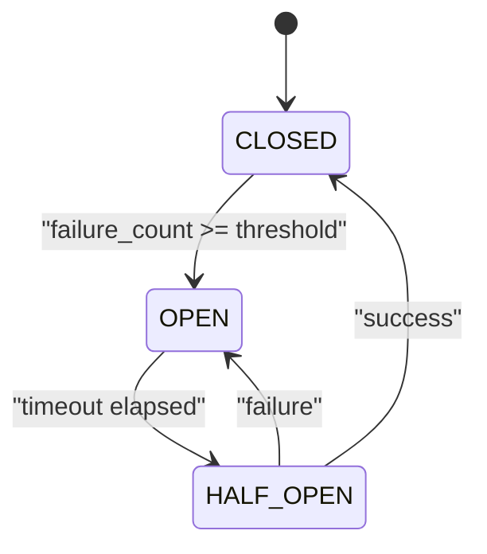
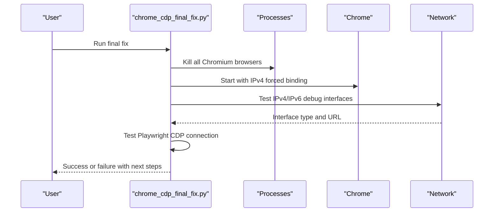
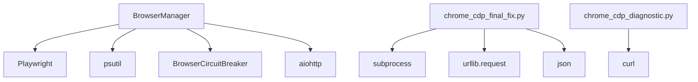

# Chrome Management

<cite>
**Referenced Files in This Document**
- [utils/browser_manager.py](file://utils/browser_manager.py)
- [utils/browser_circuit_breaker.py](file://utils/browser_circuit_breaker.py)
- [chrome_cdp_final_fix.py](file://chrome_cdp_final_fix.py)
- [chrome_cdp_diagnostic.py](file://chrome_cdp_diagnostic.py)
- [chrome_cdp_diagnostic_fix.py](file://chrome_cdp_diagnostic_fix.py)
- [chrome_quick_fix.py](file://chrome_quick_fix.py)
- [CHROME_DEBUG_TROUBLESHOOTING_PROMPT.md](file://CHROME_DEBUG_TROUBLESHOOTING_PROMPT.md)
- [wiki-dec-3/11. Troubleshooting Guide/11.1. Browser Issues/11.1.1. Connectivity Issues.md](file://wiki-dec-3/11. Troubleshooting Guide/11.1. Browser Issues/11.1.1. Connectivity Issues.md)
</cite>

## Table of Contents
1. [Introduction](#introduction)
2. [Project Structure](#project-structure)
3. [Core Components](#core-components)
4. [Architecture Overview](#architecture-overview)
5. [Detailed Component Analysis](#detailed-component-analysis)
6. [Dependency Analysis](#dependency-analysis)
7. [Performance Considerations](#performance-considerations)
8. [Troubleshooting Guide](#troubleshooting-guide)
9. [Conclusion](#conclusion)

## Introduction
This document explains the Chrome Management subsystem used by the Amazon FBA Agent System. It focuses on the BrowserManager singleton pattern for centralized browser lifecycle management, connection to existing Chrome instances via Chrome DevTools Protocol (CDP), and context persistence. It covers configuration requirements for the remote debugging port and user data directory, IPv6/IPv4 endpoint detection for Chrome 139+ compatibility, connection retry mechanisms, enhanced compatibility modes, memory monitoring integration with psutil, and automatic browser restart logic. It also provides troubleshooting procedures for common connection issues, process detection algorithms for Windows systems, fallback strategies when Chrome debug connection fails, and practical examples of Chrome startup commands, connection validation, and health monitoring implementation.

## Project Structure
The Chrome Management subsystem centers around a singleton BrowserManager that orchestrates Playwright’s Chromium connection to an existing Chrome instance. Supporting scripts provide diagnostics, quick fixes, and final fixes for CDP connectivity issues, especially with Chrome 139+.

**Diagram sources**
- [utils/browser_manager.py](file://utils/browser_manager.py#L35-L140)
- [utils/browser_circuit_breaker.py](file://utils/browser_circuit_breaker.py#L37-L110)
- [chrome_cdp_final_fix.py](file://chrome_cdp_final_fix.py#L13-L56)

**Section sources**
- [utils/browser_manager.py](file://utils/browser_manager.py#L35-L140)

## Core Components
- BrowserManager singleton: Centralized lifecycle management, connection to existing Chrome via CDP, context persistence, page caching, health monitoring, and restart logic.
- BrowserCircuitBreaker: Implements circuit breaker pattern to prevent cascading failures during long-running sessions.
- Diagnostic and Fix Scripts: Automated helpers to validate endpoints, force IPv4 binding, and update configuration for Chrome 139+ compatibility.

Key responsibilities:
- Launch/connect to existing Chrome via CDP on a configured port.
- Detect and select IPv6 or IPv4 endpoints depending on Chrome version.
- Retry connection with enhanced compatibility modes for Chrome 139.x Protocol 1.3.
- Monitor memory usage and trigger controlled restarts.
- Provide detailed troubleshooting and fallback strategies.

**Section sources**
- [utils/browser_manager.py](file://utils/browser_manager.py#L35-L140)
- [utils/browser_circuit_breaker.py](file://utils/browser_circuit_breaker.py#L37-L110)
- [chrome_cdp_final_fix.py](file://chrome_cdp_final_fix.py#L13-L56)

## Architecture Overview
The subsystem integrates BrowserManager with Playwright to attach to an existing Chrome instance. It dynamically detects the correct CDP endpoint, applies enhanced compatibility settings for Chrome 139+, and monitors health to maintain reliability.

**Diagram sources**
- [utils/browser_manager.py](file://utils/browser_manager.py#L141-L198)
- [utils/browser_manager.py](file://utils/browser_manager.py#L273-L300)
- [utils/browser_manager.py](file://utils/browser_manager.py#L398-L454)

## Detailed Component Analysis

### BrowserManager Singleton Pattern
- Singleton enforcement prevents multiple browser instances and ensures shared state across the system.
- Centralized lifecycle management: launch/connect to existing Chrome, manage context and pages, and enforce restart policies.
- Page caching with LRU eviction to reduce overhead and improve stability.
- Health monitoring: tracks memory usage, connection failures, and restart intervals.

**Diagram sources**
- [utils/browser_manager.py](file://utils/browser_manager.py#L35-L140)
- [utils/browser_manager.py](file://utils/browser_manager.py#L141-L198)
- [utils/browser_manager.py](file://utils/browser_manager.py#L242-L300)
- [utils/browser_manager.py](file://utils/browser_manager.py#L398-L476)
- [utils/browser_manager.py](file://utils/browser_manager.py#L477-L542)
- [utils/browser_manager.py](file://utils/browser_manager.py#L658-L800)

**Section sources**
- [utils/browser_manager.py](file://utils/browser_manager.py#L35-L140)
- [utils/browser_manager.py](file://utils/browser_manager.py#L141-L198)
- [utils/browser_manager.py](file://utils/browser_manager.py#L242-L300)
- [utils/browser_manager.py](file://utils/browser_manager.py#L398-L476)
- [utils/browser_manager.py](file://utils/browser_manager.py#L477-L542)
- [utils/browser_manager.py](file://utils/browser_manager.py#L658-L800)

### CDP Endpoint Detection and Compatibility Modes
- Dual-stack endpoint detection: tries IPv6 first (preferred for Chrome 139+) and falls back to IPv4.
- Enhanced compatibility mode for Chrome 139.x Protocol 1.3: progressive timeouts and slower timing to accommodate protocol changes.
- Standard CDP and WebSocket fallback modes for maximum compatibility.

**Diagram sources**
- [utils/browser_manager.py](file://utils/browser_manager.py#L273-L300)
- [utils/browser_manager.py](file://utils/browser_manager.py#L398-L454)
- [utils/browser_manager.py](file://utils/browser_manager.py#L456-L476)

**Section sources**
- [utils/browser_manager.py](file://utils/browser_manager.py#L273-L300)
- [utils/browser_manager.py](file://utils/browser_manager.py#L398-L476)

### Memory Monitoring and Automatic Restart Logic
- Memory monitoring via psutil for Chrome processes and system memory.
- Windows-specific process detection enhancements.
- Controlled restart policy based on time thresholds and excessive connection failures.
- Memory pressure triggers Python garbage collection without restarting the browser.

**Diagram sources**
- [utils/browser_manager.py](file://utils/browser_manager.py#L894-L938)

**Section sources**
- [utils/browser_manager.py](file://utils/browser_manager.py#L658-L800)
- [utils/browser_manager.py](file://utils/browser_manager.py#L894-L938)

### BrowserCircuitBreaker Integration
- Protects against cascading failures during long-running sessions.
- Three states: CLOSED, OPEN, HALF_OPEN with configurable thresholds and timeouts.
- Integrates with BrowserManager to guard navigation and other operations.

**Diagram sources**
- [utils/browser_circuit_breaker.py](file://utils/browser_circuit_breaker.py#L37-L133)

**Section sources**
- [utils/browser_circuit_breaker.py](file://utils/browser_circuit_breaker.py#L37-L133)
- [utils/browser_manager.py](file://utils/browser_manager.py#L180-L184)

### Diagnostic and Fix Scripts
- chrome_cdp_final_fix.py: Forces IPv4 binding, tests endpoints, validates Playwright connection, and updates system configuration.
- chrome_cdp_diagnostic.py: Comprehensive diagnostic workflow for CDP connectivity.
- chrome_cdp_diagnostic_fix.py: JSON payload example for diagnostics.
- chrome_quick_fix.py: Quick steps to kill Chrome processes, ensure profile directory, start Chrome with debug flags, and test the endpoint.

**Diagram sources**
- [chrome_cdp_final_fix.py](file://chrome_cdp_final_fix.py#L13-L56)
- [chrome_cdp_final_fix.py](file://chrome_cdp_final_fix.py#L57-L86)
- [chrome_cdp_final_fix.py](file://chrome_cdp_final_fix.py#L88-L118)
- [chrome_cdp_final_fix.py](file://chrome_cdp_final_fix.py#L157-L205)

**Section sources**
- [chrome_cdp_final_fix.py](file://chrome_cdp_final_fix.py#L13-L56)
- [chrome_cdp_final_fix.py](file://chrome_cdp_final_fix.py#L57-L86)
- [chrome_cdp_final_fix.py](file://chrome_cdp_final_fix.py#L88-L118)
- [chrome_cdp_final_fix.py](file://chrome_cdp_final_fix.py#L157-L205)
- [chrome_cdp_diagnostic.py](file://chrome_cdp_diagnostic.py#L1-L421)
- [chrome_cdp_diagnostic_fix.py](file://chrome_cdp_diagnostic_fix.py#L1-L215)
- [chrome_quick_fix.py](file://chrome_quick_fix.py#L1-L124)

## Dependency Analysis
- BrowserManager depends on Playwright for CDP connections, psutil for memory monitoring, and aiohttp for endpoint verification.
- BrowserCircuitBreaker is integrated into BrowserManager to protect operations.
- Diagnostic and fix scripts depend on subprocess, urllib, and JSON for process control and endpoint validation.

**Diagram sources**
- [utils/browser_manager.py](file://utils/browser_manager.py#L19-L26)
- [utils/browser_manager.py](file://utils/browser_manager.py#L242-L271)
- [utils/browser_circuit_breaker.py](file://utils/browser_circuit_breaker.py#L25-L31)
- [chrome_cdp_final_fix.py](file://chrome_cdp_final_fix.py#L7-L11)
- [chrome_cdp_final_fix.py](file://chrome_cdp_final_fix.py#L57-L86)
- [chrome_cdp_diagnostic.py](file://chrome_cdp_diagnostic.py#L64-L95)

**Section sources**
- [utils/browser_manager.py](file://utils/browser_manager.py#L19-L26)
- [utils/browser_manager.py](file://utils/browser_manager.py#L242-L271)
- [utils/browser_circuit_breaker.py](file://utils/browser_circuit_breaker.py#L25-L31)
- [chrome_cdp_final_fix.py](file://chrome_cdp_final_fix.py#L7-L11)
- [chrome_cdp_final_fix.py](file://chrome_cdp_final_fix.py#L57-L86)
- [chrome_cdp_diagnostic.py](file://chrome_cdp_diagnostic.py#L64-L95)

## Performance Considerations
- Prefer connecting to an existing Chrome instance to avoid launching new processes and to persist context and extensions.
- Use conservative timing (slow_mo) and progressive timeouts for Chrome 139+ compatibility to reduce flakiness.
- Limit page cache size to reduce memory footprint and prevent Keepa extension failures.
- Monitor system memory and trigger Python garbage collection proactively to mitigate memory pressure without restarting the browser.

## Troubleshooting Guide
Common connection issues and remedies:
- Ensure Chrome is launched with the required flags: remote debugging port and user data directory.
- Validate the debug endpoint with curl or equivalent.
- On Windows, kill existing Chrome processes and start Chrome with debug flags.
- For Chrome 139+, use IPv4 binding or rely on the enhanced compatibility mode.
- Use diagnostic scripts to automate validation and gather logs.

Practical examples:
- Chrome startup command with debug flags:
  - Windows: chrome --remote-debugging-port=9222 --user-data-dir=C:\ChromeDebugProfile
  - Linux: google-chrome --remote-debugging-port=9222 --user-data-dir=/tmp/chrome-debug
- Connection validation:
  - curl http://localhost:9222/json/version
- Health monitoring:
  - Use BrowserManager methods to check memory usage and trigger restarts when needed.

Fallback strategies:
- If CDP connection fails, try the WebSocket fallback approach with maximum timeout and very slow timing.
- If endpoint detection fails, default to IPv6 but log warnings and continue with retries.
- If all else fails, fall back to Playwright’s bundled Chromium in headless mode (with limitations).

Process detection algorithms for Windows:
- Enhanced Chrome process detection using psutil with fallback to executable path inspection.
- Detect Chrome, Microsoft Edge, and Chromium variants to compute total memory usage.

**Section sources**
- [utils/browser_manager.py](file://utils/browser_manager.py#L302-L314)
- [utils/browser_manager.py](file://utils/browser_manager.py#L623-L656)
- [utils/browser_manager.py](file://utils/browser_manager.py#L673-L701)
- [utils/browser_manager.py](file://utils/browser_manager.py#L894-L938)
- [CHROME_DEBUG_TROUBLESHOOTING_PROMPT.md](file://CHROME_DEBUG_TROUBLESHOOTING_PROMPT.md#L72-L77)
- [wiki-dec-3/11. Troubleshooting Guide/11.1. Browser Issues/11.1.1. Connectivity Issues.md](file://wiki-dec-3/11. Troubleshooting Guide/11.1. Browser Issues/11.1.1. Connectivity Issues.md#L60-L95)
- [chrome_cdp_final_fix.py](file://chrome_cdp_final_fix.py#L28-L56)
- [chrome_cdp_final_fix.py](file://chrome_cdp_final_fix.py#L57-L86)
- [chrome_quick_fix.py](file://chrome_quick_fix.py#L67-L118)

## Conclusion
The Chrome Management subsystem provides robust, production-ready browser lifecycle management centered on a singleton BrowserManager. It connects to existing Chrome instances via CDP, adapts to Chrome 139+ compatibility, monitors memory and health, and offers comprehensive diagnostics and fallback strategies. By following the documented startup commands, validation steps, and troubleshooting procedures, operators can maintain reliable automation sessions with minimal disruption.