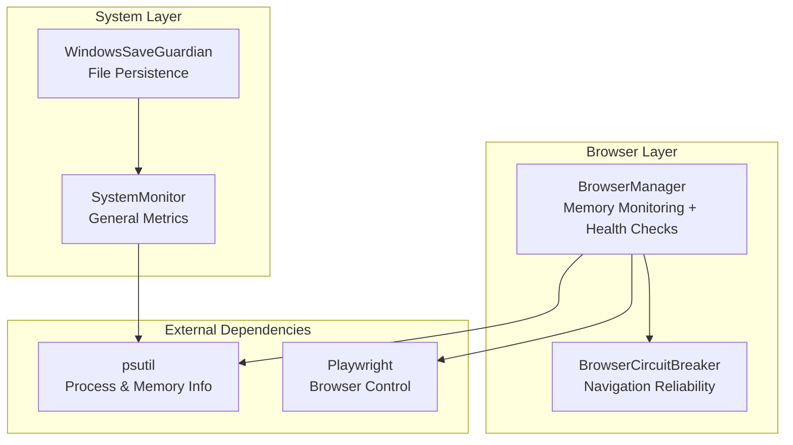
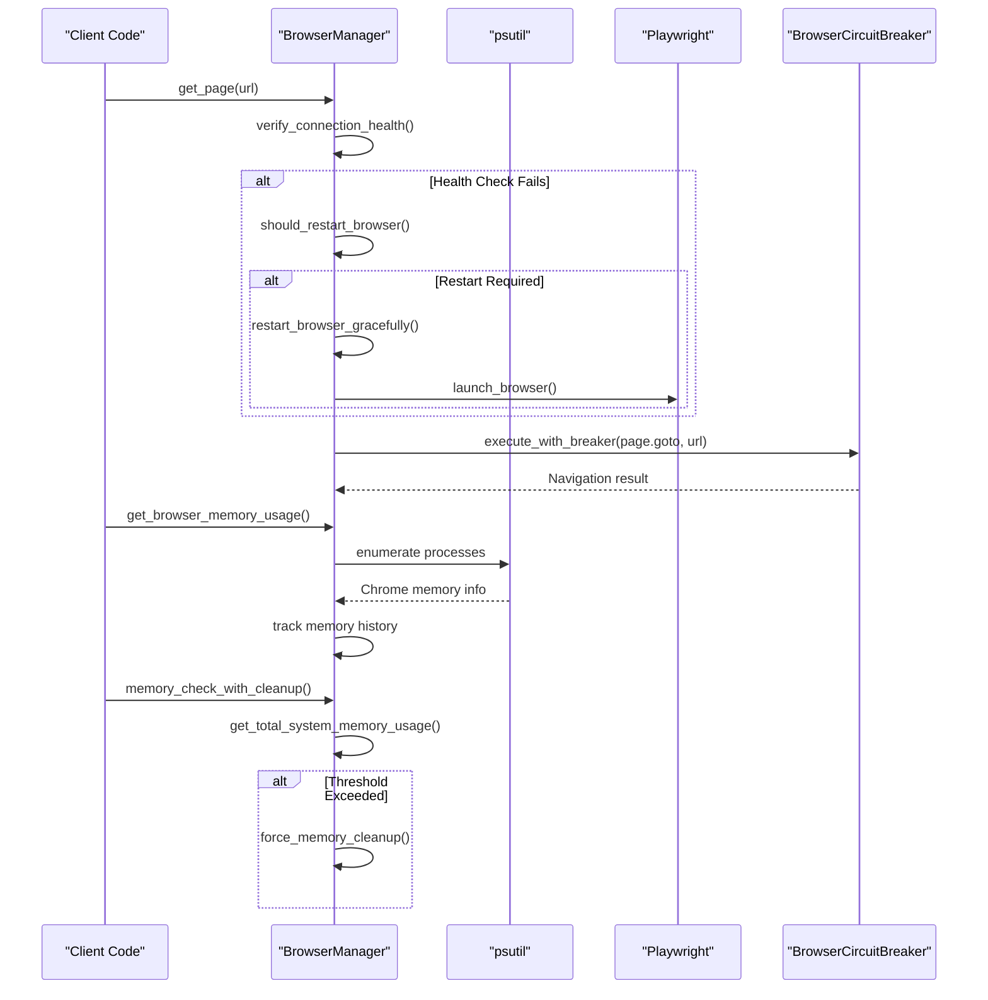
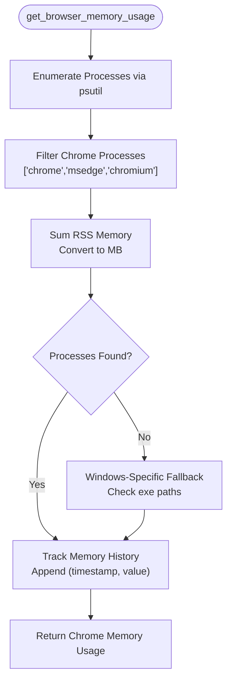
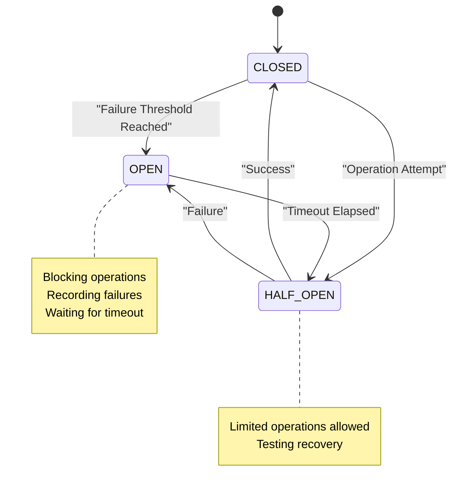
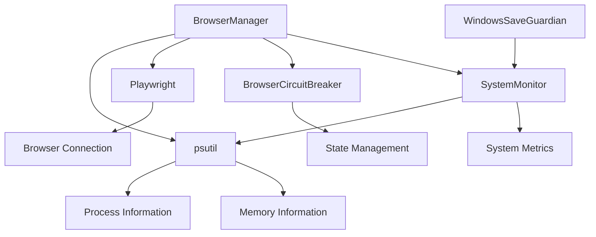

# Memory Monitoring and Health Management

<cite>
**Referenced Files in This Document**
- [browser_manager.py](file://utils/browser_manager.py)
- [browser_circuit_breaker.py](file://utils/browser_circuit_breaker.py)
- [system_monitor.py](file://tools/system_monitor.py)
- [windows_save_guardian.py](file://utils/windows_save_guardian.py)
</cite>

## Table of Contents
1. [Introduction](#introduction)
2. [Project Structure](#project-structure)
3. [Core Components](#core-components)
4. [Architecture Overview](#architecture-overview)
5. [Detailed Component Analysis](#detailed-component-analysis)
6. [Dependency Analysis](#dependency-analysis)
7. [Performance Considerations](#performance-considerations)
8. [Troubleshooting Guide](#troubleshooting-guide)
9. [Conclusion](#conclusion)

## Introduction
This document explains the memory monitoring and health management system implemented in the BrowserManager. It covers psutil-based Chrome process detection and memory usage tracking, Windows-specific enhancements for accurate process identification, memory threshold monitoring, automatic browser restart logic, memory usage history tracking, and the BrowserCircuitBreaker implementation for navigation reliability. Practical examples demonstrate memory usage queries, health checks, and automatic recovery mechanisms, along with fallback strategies when memory monitoring fails and integration with the broader system health monitoring infrastructure.

## Project Structure
The memory and health management system spans several modules:
- BrowserManager: Centralized browser lifecycle management with integrated memory monitoring and health checks
- BrowserCircuitBreaker: Implements circuit breaker pattern for navigation reliability
- SystemMonitor: General system health monitoring and metrics collection
- WindowsSaveGuardian: Robust file persistence with Windows-specific fallback strategies

**Diagram sources**
- [browser_manager.py](file://utils/browser_manager.py#L35-L120)
- [browser_circuit_breaker.py](file://utils/browser_circuit_breaker.py#L37-L70)
- [system_monitor.py](file://tools/system_monitor.py#L34-L47)
- [windows_save_guardian.py](file://utils/windows_save_guardian.py#L26-L44)

**Section sources**
- [browser_manager.py](file://utils/browser_manager.py#L1-L120)
- [browser_circuit_breaker.py](file://utils/browser_circuit_breaker.py#L1-L50)
- [system_monitor.py](file://tools/system_monitor.py#L1-L47)
- [windows_save_guardian.py](file://utils/windows_save_guardian.py#L1-L44)

## Core Components
The memory monitoring and health management system centers around three primary components:

- BrowserManager: Singleton browser manager with integrated memory monitoring, health checks, and automatic restart logic
- BrowserCircuitBreaker: Implements circuit breaker pattern to prevent cascading failures during navigation operations
- SystemMonitor: Provides general system health metrics collection and reporting

Key capabilities include:
- Psutil-based Chrome process detection with Windows-specific enhancements
- Memory threshold monitoring (2048 MB default)
- Automatic browser restart logic every 2.5 hours
- Memory usage history tracking for trend analysis
- Navigation reliability through circuit breaker pattern
- Fallback strategies when memory monitoring fails

**Section sources**
- [browser_manager.py](file://utils/browser_manager.py#L35-L70)
- [browser_circuit_breaker.py](file://utils/browser_circuit_breaker.py#L37-L70)
- [system_monitor.py](file://tools/system_monitor.py#L34-L47)

## Architecture Overview
The system architecture integrates browser lifecycle management with comprehensive memory monitoring and health checks:

**Diagram sources**
- [browser_manager.py](file://utils/browser_manager.py#L141-L198)
- [browser_manager.py](file://utils/browser_manager.py#L658-L719)
- [browser_manager.py](file://utils/browser_manager.py#L940-L977)
- [browser_circuit_breaker.py](file://utils/browser_circuit_breaker.py#L72-L110)

## Detailed Component Analysis

### BrowserManager Memory Monitoring
The BrowserManager implements comprehensive memory monitoring with the following key features:

#### Psutil-Based Chrome Process Detection
The system uses psutil to detect and monitor Chrome processes with enhanced accuracy:

**Diagram sources**
- [browser_manager.py](file://utils/browser_manager.py#L658-L719)

#### Windows-Specific Enhancements
The system includes specialized detection for Windows environments:
- Enhanced process filtering using executable paths
- Fallback detection when process names are not found
- Platform-aware logging and behavior

#### Memory Threshold Monitoring
The system monitors memory usage against configurable thresholds:
- Default memory threshold: 2048 MB
- Automatic restart logic every 2.5 hours
- Memory usage history tracking for trend analysis

#### Automatic Browser Restart Logic
The BrowserManager implements intelligent restart logic:
- Time-based restart every 2.5 hours
- Connection failure-based restart triggers
- Graceful restart preserving session state

#### Memory Cleanup and Recovery
The system provides comprehensive memory management:
- Aggressive memory cleanup for supplier scraping
- Forced garbage collection
- System-wide memory pressure detection

**Section sources**
- [browser_manager.py](file://utils/browser_manager.py#L658-L719)
- [browser_manager.py](file://utils/browser_manager.py#L816-L846)
- [browser_manager.py](file://utils/browser_manager.py#L885-L938)
- [browser_manager.py](file://utils/browser_manager.py#L940-L977)

### BrowserCircuitBreaker Implementation
The BrowserCircuitBreaker implements the circuit breaker pattern for navigation reliability:

**Diagram sources**
- [browser_circuit_breaker.py](file://utils/browser_circuit_breaker.py#L37-L70)

Key features include:
- Configurable failure threshold (default: 3)
- Timeout-based recovery (default: 300 seconds)
- State management (CLOSED, OPEN, HALF_OPEN)
- Automatic failure counting and recovery timing

#### Failure Threshold Configuration
The circuit breaker supports customizable parameters:
- failure_threshold: Number of failures before opening circuit
- timeout_seconds: Time to keep circuit open before testing recovery
- recovery_timeout: Time to wait in HALF_OPEN before full recovery

#### Timeout Handling
The system implements sophisticated timeout handling:
- Dynamic timeout calculation based on state
- Gradual recovery through HALF_OPEN state
- Automatic state transitions based on success/failure patterns

**Section sources**
- [browser_circuit_breaker.py](file://utils/browser_circuit_breaker.py#L37-L191)

### System Integration and Health Monitoring
The BrowserManager integrates with broader system health monitoring:

#### System Metrics Collection
The system collects comprehensive system metrics:
- CPU usage percentage
- Memory usage percentage
- Disk usage percentage
- Active task count
- Error logging and tracking

#### Health Report Generation
The system generates health reports with:
- Average CPU and memory usage over recent measurements
- Error rate analysis
- Performance summaries
- Warning indicators for high resource usage

#### Integration with WindowsSaveGuardian
The system integrates with Windows-specific persistence:
- Robust file saving with multiple fallback strategies
- Windows-specific error handling for WinError 5
- Atomic persistence with telemetry logging

**Section sources**
- [system_monitor.py](file://tools/system_monitor.py#L34-L179)
- [windows_save_guardian.py](file://utils/windows_save_guardian.py#L26-L182)

## Dependency Analysis
The memory monitoring and health management system has the following key dependencies:

**Diagram sources**
- [browser_manager.py](file://utils/browser_manager.py#L13-L23)
- [browser_circuit_breaker.py](file://utils/browser_circuit_breaker.py#L25-L31)
- [system_monitor.py](file://tools/system_monitor.py#L12-L20)
- [windows_save_guardian.py](file://utils/windows_save_guardian.py#L14-L23)

The dependencies show a clear separation of concerns:
- BrowserManager depends on psutil for process/memory monitoring and Playwright for browser control
- BrowserCircuitBreaker provides independent reliability management
- SystemMonitor offers general system metrics collection
- WindowsSaveGuardian provides specialized file persistence

**Section sources**
- [browser_manager.py](file://utils/browser_manager.py#L13-L23)
- [browser_circuit_breaker.py](file://utils/browser_circuit_breaker.py#L25-L31)
- [system_monitor.py](file://tools/system_monitor.py#L12-L20)
- [windows_save_guardian.py](file://utils/windows_save_guardian.py#L14-L23)

## Performance Considerations
The memory monitoring and health management system is designed with several performance optimizations:

### Memory Efficiency
- Process enumeration optimized with targeted filtering
- Memory usage history limited to 100 measurements
- Selective logging to reduce overhead
- Platform-specific optimizations for Windows

### Resource Management
- Time-based restarts prevent memory accumulation
- Aggressive cleanup during high memory pressure
- Connection failure monitoring prevents cascading failures
- Graceful restart preserves session state

### Scalability
- Singleton pattern ensures single browser instance
- Asynchronous operations prevent blocking
- Configurable thresholds adapt to different workloads
- Modular design allows independent scaling

## Troubleshooting Guide

### Memory Monitoring Issues
Common memory monitoring problems and solutions:

#### Chrome Process Detection Failures
- **Issue**: Chrome processes not detected by name filtering
- **Solution**: Windows-specific fallback using executable paths
- **Prevention**: Platform-aware detection logic

#### Memory Usage Reporting Problems
- **Issue**: Memory usage returns -1 or unexpected values
- **Solution**: Enhanced fallback detection and error handling
- **Monitoring**: Comprehensive logging of detection attempts

### Browser Restart Issues
Common restart-related problems:

#### Connection Health Check Failures
- **Issue**: Frequent connection failures requiring restart
- **Solution**: Circuit breaker pattern prevents cascading failures
- **Monitoring**: Connection failure counters and logging

#### Graceful Restart Failures
- **Issue**: Browser restart not completing successfully
- **Solution**: Graceful cleanup and reconnection logic
- **Recovery**: Automatic fallback to bundled Chromium if needed

### Circuit Breaker Issues
Common circuit breaker problems:

#### False Positives
- **Issue**: Circuit breaker opens unnecessarily
- **Solution**: Configurable thresholds and timeout periods
- **Monitoring**: State transitions and failure counts

#### Recovery Delays
- **Issue**: Extended time in OPEN state
- **Solution**: Gradual recovery through HALF_OPEN state
- **Optimization**: Adjustable recovery timeouts

**Section sources**
- [browser_manager.py](file://utils/browser_manager.py#L885-L938)
- [browser_manager.py](file://utils/browser_manager.py#L985-L1018)
- [browser_circuit_breaker.py](file://utils/browser_circuit_breaker.py#L112-L172)

## Conclusion
The memory monitoring and health management system in the BrowserManager provides comprehensive browser lifecycle management with integrated memory monitoring and reliability features. The system's key strengths include:

- Robust psutil-based Chrome process detection with Windows-specific enhancements
- Configurable memory threshold monitoring and automatic restart logic
- Comprehensive memory usage history tracking for trend analysis
- Reliable navigation through the BrowserCircuitBreaker pattern
- Integrated system health monitoring and reporting
- Fallback strategies for memory monitoring failures
- Seamless integration with broader system health infrastructure

The system is designed for production use with careful attention to resource management, reliability, and maintainability. Its modular architecture allows for independent scaling and customization while maintaining system stability during long-running operations.