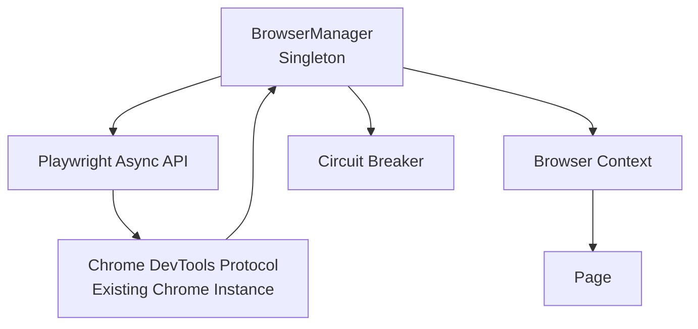
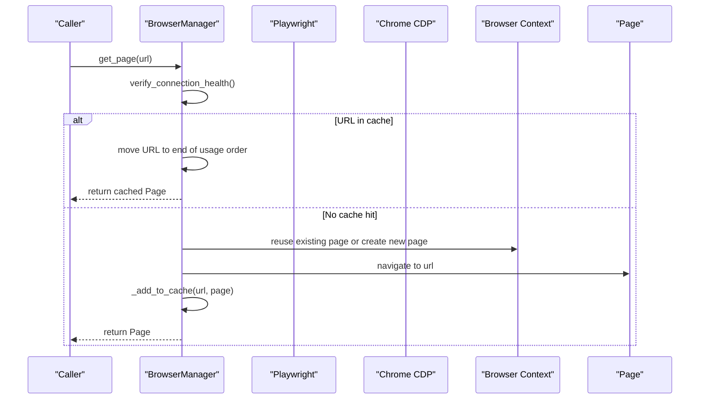
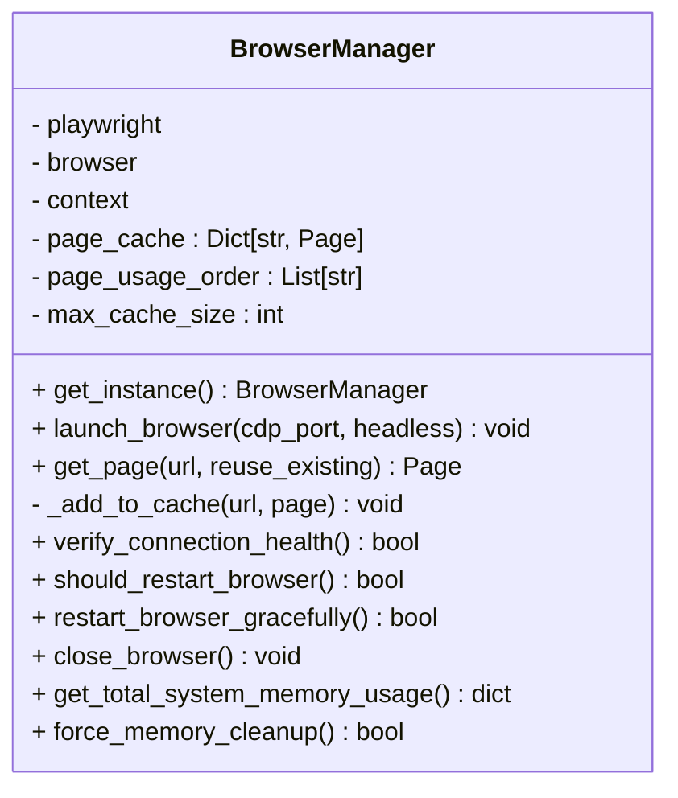
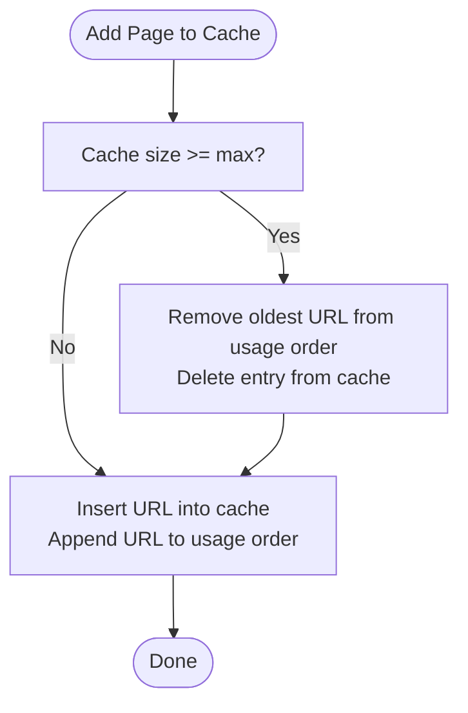
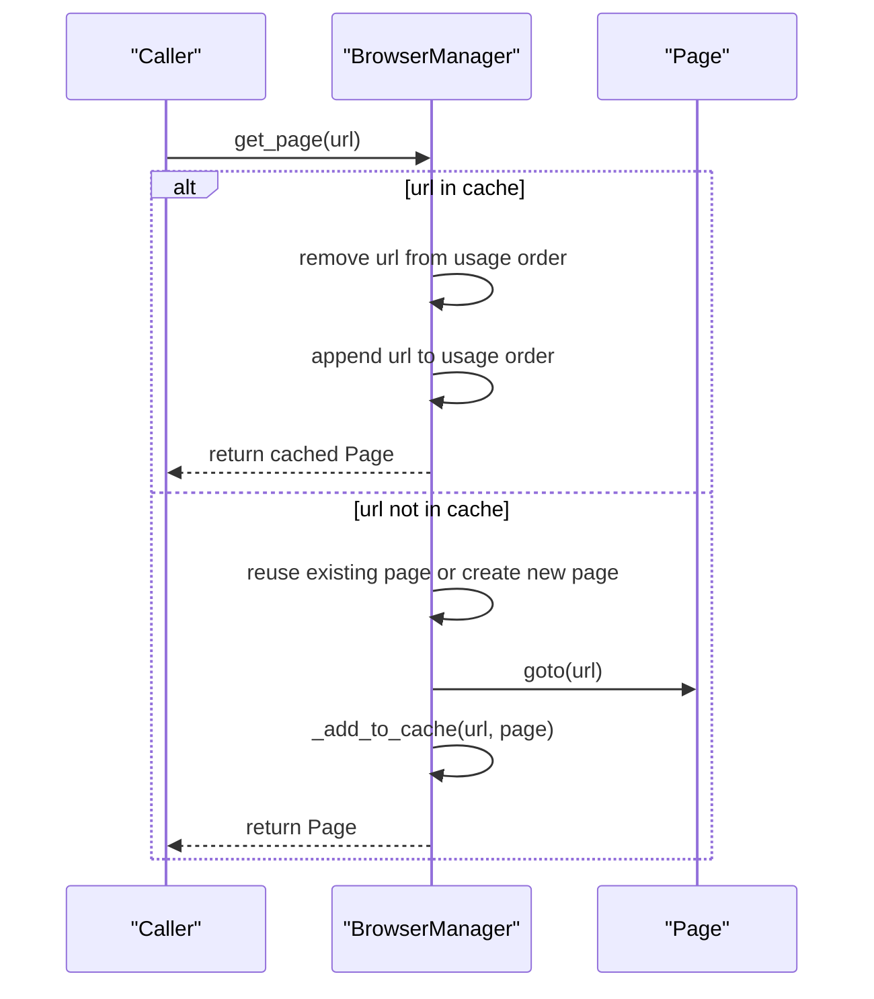
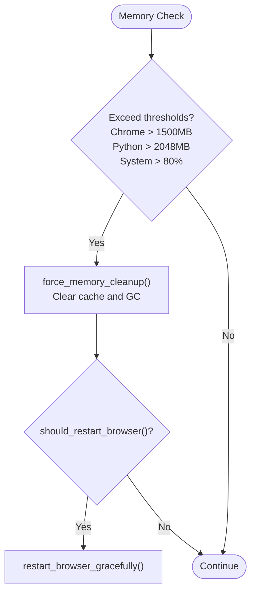
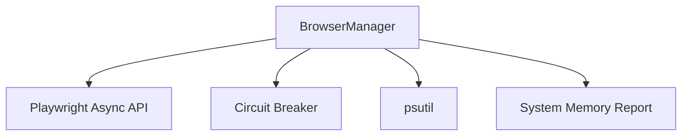

# Page Caching and LRU Management

<cite>
**Referenced Files in This Document**
- [browser_manager.py](file://utils/browser_manager.py)
- [AGENTS.md](file://AGENTS.md)
- [browser_circuit_breaker.py](file://utils/browser_circuit_breaker.py)
- [amazon_playwright_extractor.py](file://tools/amazon_playwright_extractor.py)
- [SYSTEM_MEMORY_AND_BROWSER_MANAGEMENT_REPORT.md](file://SYSTEM_MEMORY_AND_BROWSER_MANAGEMENT_REPORT.md)
</cite>

## Table of Contents
1. [Introduction](#introduction)
2. [Project Structure](#project-structure)
3. [Core Components](#core-components)
4. [Architecture Overview](#architecture-overview)
5. [Detailed Component Analysis](#detailed-component-analysis)
6. [Dependency Analysis](#dependency-analysis)
7. [Performance Considerations](#performance-considerations)
8. [Troubleshooting Guide](#troubleshooting-guide)
9. [Conclusion](#conclusion)

## Introduction
This document explains the page caching and LRU (Least Recently Used) management system within the BrowserManager. It covers how the system tracks page usage, enforces cache limits, evicts least recently used pages, and maintains a single-page mode for stability and compatibility with the Keepa extension. It also documents memory optimization strategies, cache invalidation, and practical examples of cache hits and misses.

## Project Structure
The BrowserManager resides in the utilities module and orchestrates browser lifecycle, CDP connections, and page caching. The system is designed to connect to an existing Chrome instance via CDP and maintain a persistent browser context.

**Diagram sources**
- [browser_manager.py](file://utils/browser_manager.py#L35-L120)

**Section sources**
- [browser_manager.py](file://utils/browser_manager.py#L1-L120)
- [AGENTS.md](file://AGENTS.md#L140-L150)

## Core Components
- BrowserManager: Singleton that manages a persistent browser connection, a single-page context, and an LRU cache of pages keyed by URL.
- Page cache: A dictionary keyed by URL storing Page objects, paired with a usage order list to implement LRU eviction.
- Circuit Breaker: Protects navigation operations from repeated failures.
- Memory monitoring and cleanup: Tracks memory usage and performs forced cleanup when thresholds are exceeded.

Key implementation highlights:
- Single-page mode enforced via constant `MAX_CACHED_PAGES = 1` to stabilize extension behavior.
- LRU eviction occurs when cache size reaches the configured limit.
- Aggressive browser focus behaviors removed to prevent interfering with user Chrome instances.

**Section sources**
- [browser_manager.py](file://utils/browser_manager.py#L29-L68)
- [browser_manager.py](file://utils/browser_manager.py#L141-L198)
- [browser_manager.py](file://utils/browser_manager.py#L200-L208)
- [AGENTS.md](file://AGENTS.md#L142-L144)

## Architecture Overview
The BrowserManager coordinates with Playwright to connect to an existing Chrome instance via CDP. It maintains a single persistent context and a single page, reusing the page for subsequent navigations. The page cache stores Page objects keyed by URL and tracks usage order to evict the least recently used page when capacity is reached.

**Diagram sources**
- [browser_manager.py](file://utils/browser_manager.py#L141-L198)
- [browser_manager.py](file://utils/browser_manager.py#L200-L208)

## Detailed Component Analysis

### BrowserManager Singleton and Page Cache
- Singleton pattern ensures a single shared browser instance and context.
- Page cache is keyed by URL and stores Page objects.
- Usage order maintained via a list to support LRU eviction.
- Cache size limit enforced by removing the oldest entry when capacity is exceeded.

**Diagram sources**
- [browser_manager.py](file://utils/browser_manager.py#L35-L120)
- [browser_manager.py](file://utils/browser_manager.py#L200-L208)

**Section sources**
- [browser_manager.py](file://utils/browser_manager.py#L35-L120)
- [browser_manager.py](file://utils/browser_manager.py#L200-L208)

### LRU Eviction and Cache Size Limits
- Default cache size is 10 pages.
- When adding a new page, if the cache is at capacity, the oldest URL is evicted from both the cache and the usage order.
- The usage order is updated on every cache hit or navigation to mark the URL as most recently used.

**Diagram sources**
- [browser_manager.py](file://utils/browser_manager.py#L200-L208)

**Section sources**
- [browser_manager.py](file://utils/browser_manager.py#L200-L208)

### Single-Page Mode and Keepa Extension Compatibility
- The system enforces a single-page mode (`MAX_CACHED_PAGES = 1`) to keep extension behavior stable.
- This prevents conflicts with the Keepa extension and reduces instability during long-running sessions.
- The single-page mode also simplifies memory management and browser focus behavior.

**Section sources**
- [browser_manager.py](file://utils/browser_manager.py#L29-L31)
- [AGENTS.md](file://AGENTS.md#L142-L144)

### Page Reuse Strategy and URL-Based Caching
- On cache hit, the page is reused and its position in the usage order is updated to reflect recent use.
- On navigation, the page is reused if available; otherwise a new page is created within the persistent context.
- The URL serves as the cache key, enabling efficient reuse for repeated visits to the same URL.

**Diagram sources**
- [browser_manager.py](file://utils/browser_manager.py#L141-L198)
- [browser_manager.py](file://utils/browser_manager.py#L200-L208)

**Section sources**
- [browser_manager.py](file://utils/browser_manager.py#L141-L198)
- [browser_manager.py](file://utils/browser_manager.py#L200-L208)

### Cache Invalidation Strategies
- Forced memory cleanup clears the page cache and triggers garbage collection.
- Periodic memory checks trigger cleanup when thresholds are exceeded.
- Graceful browser restarts reset health metrics and clear caches without closing the persistent browser.

**Diagram sources**
- [browser_manager.py](file://utils/browser_manager.py#L940-L978)
- [browser_manager.py](file://utils/browser_manager.py#L816-L847)
- [browser_manager.py](file://utils/browser_manager.py#L885-L938)

**Section sources**
- [browser_manager.py](file://utils/browser_manager.py#L940-L978)
- [browser_manager.py](file://utils/browser_manager.py#L816-L847)
- [browser_manager.py](file://utils/browser_manager.py#L885-L938)

### Memory Optimization Techniques
- Time-based browser restarts (every 2.5 hours) to prevent CDP connection degradation.
- Memory pressure detection and forced cleanup to reduce Chrome and Python memory usage.
- Reduced memory thresholds for Python (3GB) and Node.js (2GB) monitoring to trigger GC without restarting the browser.

**Section sources**
- [browser_manager.py](file://utils/browser_manager.py#L885-L938)
- [SYSTEM_MEMORY_AND_BROWSER_MANAGEMENT_REPORT.md](file://SYSTEM_MEMORY_AND_BROWSER_MANAGEMENT_REPORT.md#L72-L83)

### Removal of Aggressive Browser Focus Behaviors
- The system removes calls to bring pages to front to prevent interfering with the user’s Chrome instance.
- This change improves stability and avoids unexpected window activation during automation.

**Section sources**
- [browser_manager.py](file://utils/browser_manager.py#L154-L191)

### Practical Examples

#### Cache Hit Scenario
- A caller requests a page for a URL that is already cached.
- The BrowserManager moves the URL to the end of the usage order and returns the cached page.

#### Cache Miss Scenario
- A caller requests a page for a URL not in the cache.
- The BrowserManager reuses an existing page or creates a new one, navigates to the URL, and adds it to the cache.

#### LRU Eviction Example
- With a cache size limit of 10, adding a 11th page triggers eviction of the oldest entry.
- The usage order is updated accordingly.

#### Memory Usage Monitoring
- The system periodically logs memory usage and triggers cleanup when thresholds are exceeded.
- Forced cleanup clears the cache and runs garbage collection.

**Section sources**
- [browser_manager.py](file://utils/browser_manager.py#L141-L198)
- [browser_manager.py](file://utils/browser_manager.py#L200-L208)
- [browser_manager.py](file://utils/browser_manager.py#L940-L978)
- [browser_manager.py](file://utils/browser_manager.py#L816-L847)

## Dependency Analysis
The BrowserManager depends on Playwright for CDP connections and page management, and integrates with a circuit breaker for navigation resilience. It also relies on system memory monitoring and cleanup routines.

**Diagram sources**
- [browser_manager.py](file://utils/browser_manager.py#L1-L26)
- [browser_manager.py](file://utils/browser_manager.py#L658-L804)
- [browser_circuit_breaker.py](file://utils/browser_circuit_breaker.py)

**Section sources**
- [browser_manager.py](file://utils/browser_manager.py#L1-L26)
- [browser_manager.py](file://utils/browser_manager.py#L658-L804)

## Performance Considerations
- Single-page mode reduces overhead and improves stability for extension compatibility.
- LRU eviction keeps the cache bounded and prevents unbounded growth.
- Time-based restarts mitigate long-running connection issues.
- Memory monitoring and forced cleanup help maintain system responsiveness.

[No sources needed since this section provides general guidance]

## Troubleshooting Guide
- If the browser becomes unstable, trigger a graceful restart to reset health metrics and clear caches.
- If memory usage spikes, rely on periodic memory checks and forced cleanup to recover.
- If Keepa or other extensions are not visible, ensure single-page mode is active and focus behaviors are disabled.

**Section sources**
- [browser_manager.py](file://utils/browser_manager.py#L979-L1018)
- [browser_manager.py](file://utils/browser_manager.py#L940-L978)
- [AGENTS.md](file://AGENTS.md#L142-L144)

## Conclusion
The BrowserManager’s page caching and LRU management system provides a stable, memory-conscious approach to browser automation. By enforcing a single-page mode, implementing LRU eviction, and removing aggressive focus behaviors, the system maintains compatibility with extensions like Keepa while optimizing performance and reliability for long-running sessions.