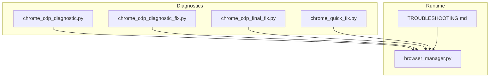
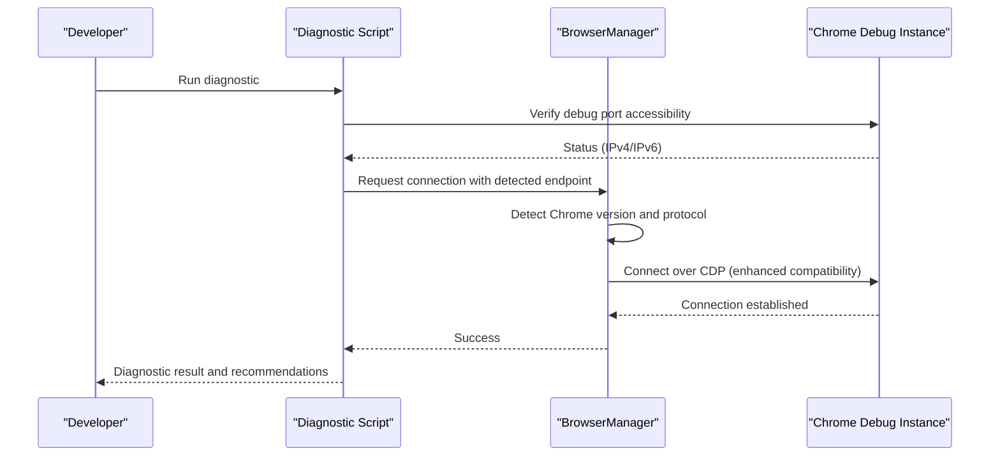
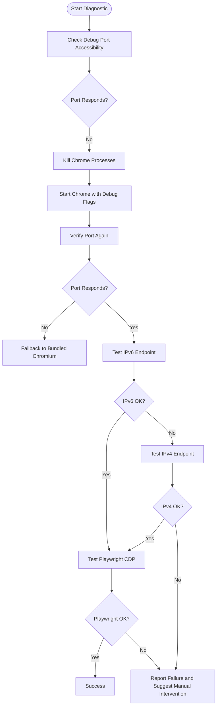
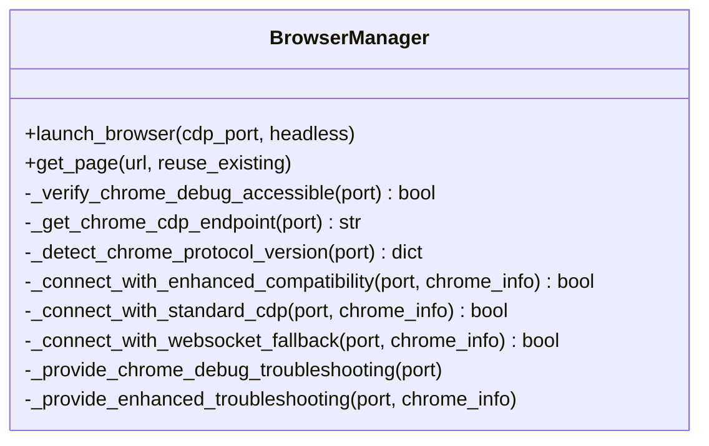
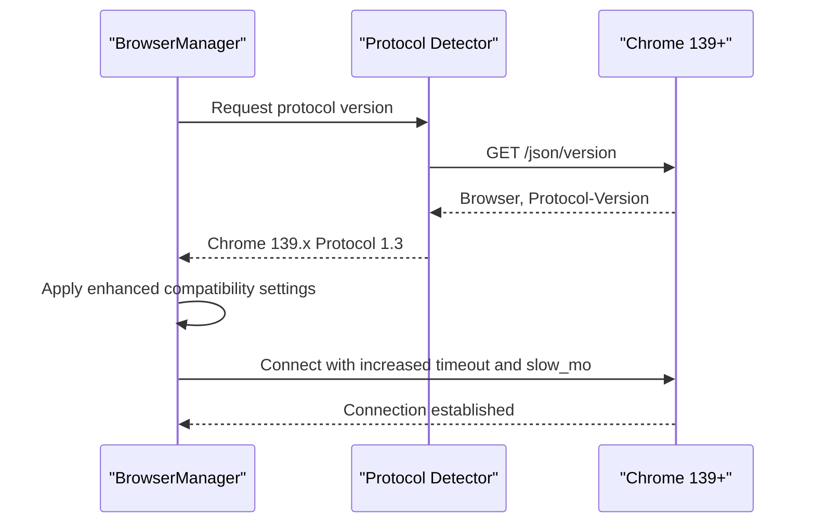
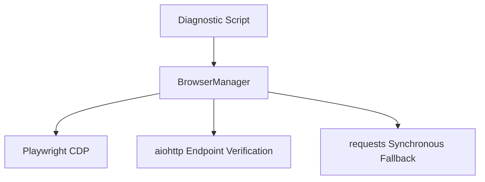

# Troubleshooting and Diagnostics

<cite>
**Referenced Files in This Document**
- [CHROME_CDP_CONNECTIVITY_TROUBLESHOOTING_REPORT.md](file://CHROME_CDP_CONNECTIVITY_TROUBLESHOOTING_REPORT.md)
- [CHROME_DEBUG_TROUBLESHOOTING_PROMPT.md](file://CHROME_DEBUG_TROUBLESHOOTING_PROMPT.md)
- [TROUBLESHOOTING.md](file://docs/TROUBLESHOOTING.md)
- [browser_manager.py](file://utils/browser_manager.py)
- [chrome_cdp_diagnostic.py](file://chrome_cdp_diagnostic.py)
- [chrome_cdp_diagnostic_fix.py](file://chrome_cdp_diagnostic_fix.py)
- [chrome_cdp_final_fix.py](file://chrome_cdp_final_fix.py)
- [chrome_quick_fix.py](file://chrome_quick_fix.py)
</cite>

## Table of Contents
1. [Introduction](#introduction)
2. [Project Structure](#project-structure)
3. [Core Components](#core-components)
4. [Architecture Overview](#architecture-overview)
5. [Detailed Component Analysis](#detailed-component-analysis)
6. [Dependency Analysis](#dependency-analysis)
7. [Performance Considerations](#performance-considerations)
8. [Troubleshooting Guide](#troubleshooting-guide)
9. [Conclusion](#conclusion)
10. [Appendices](#appendices)

## Introduction
This document provides comprehensive troubleshooting and diagnostics for Chrome browser management issues, focusing on Chrome Debug Protocol (CDP) connection failures. It covers step-by-step procedures for port verification, process cleanup, startup command validation, diagnostic logging, error interpretation, automated suggestions, protocol detection, version compatibility checks, and enhanced troubleshooting for Chrome 139+ Protocol 1.3 requirements. Practical examples, Windows-specific procedures, network connectivity checks, and fallback strategies are included for system administrators and developers.

## Project Structure
The troubleshooting assets are distributed across diagnostic scripts, the browser manager implementation, and official documentation:
- Diagnostic scripts provide automated verification and fixes for Chrome debug connectivity.
- The browser manager encapsulates Playwright CDP connection logic, protocol detection, and fallback strategies.
- Official documentation defines standardized troubleshooting procedures and system requirements.

**Diagram sources**
- [chrome_cdp_diagnostic.py](file://chrome_cdp_diagnostic.py#L1-L421)
- [chrome_cdp_diagnostic_fix.py](file://chrome_cdp_diagnostic_fix.py#L1-L215)
- [chrome_cdp_final_fix.py](file://chrome_cdp_final_fix.py#L1-L218)
- [chrome_quick_fix.py](file://chrome_quick_fix.py#L1-L124)
- [browser_manager.py](file://utils/browser_manager.py#L1-L1153)
- [TROUBLESHOOTING.md](file://docs/TROUBLESHOOTING.md#L1-L934)

**Section sources**
- [chrome_cdp_diagnostic.py](file://chrome_cdp_diagnostic.py#L1-L421)
- [chrome_cdp_diagnostic_fix.py](file://chrome_cdp_diagnostic_fix.py#L1-L215)
- [chrome_cdp_final_fix.py](file://chrome_cdp_final_fix.py#L1-L218)
- [chrome_quick_fix.py](file://chrome_quick_fix.py#L1-L124)
- [browser_manager.py](file://utils/browser_manager.py#L1-L1153)
- [TROUBLESHOOTING.md](file://docs/TROUBLESHOOTING.md#L1-L934)

## Core Components
- Chrome CDP Diagnostic Scripts: Provide automated checks for debug port accessibility, IPv4/IPv6 binding, and Playwright connectivity.
- Browser Manager: Centralizes Playwright CDP connection, protocol detection, endpoint selection, and fallback strategies.
- Troubleshooting Documentation: Defines standardized procedures for diagnosing and resolving Chrome debug connectivity issues.

Key responsibilities:
- Port verification and endpoint selection (IPv6 preferred for Chrome 139+, IPv4 fallback).
- Enhanced compatibility modes for Chrome 139.x Protocol 1.3.
- Automated troubleshooting suggestions and logging.
- Fallback to bundled Chromium when CDP fails.
- Windows-specific process cleanup and startup validation.

**Section sources**
- [browser_manager.py](file://utils/browser_manager.py#L242-L301)
- [browser_manager.py](file://utils/browser_manager.py#L398-L454)
- [browser_manager.py](file://utils/browser_manager.py#L477-L542)
- [TROUBLESHOOTING.md](file://docs/TROUBLESHOOTING.md#L46-L90)

## Architecture Overview
The system integrates diagnostic scripts with the browser manager to validate and repair Chrome debug connectivity. The browser manager detects Chrome version and protocol, selects the appropriate endpoint, and applies enhanced compatibility settings for Chrome 139+.

**Diagram sources**
- [chrome_cdp_diagnostic.py](file://chrome_cdp_diagnostic.py#L1-L421)
- [browser_manager.py](file://utils/browser_manager.py#L242-L301)
- [browser_manager.py](file://utils/browser_manager.py#L398-L454)

## Detailed Component Analysis

### Chrome CDP Diagnostic Scripts
These scripts automate verification of debug port accessibility, IPv4/IPv6 binding, and Playwright connectivity. They provide actionable insights and remediation steps.

**Diagram sources**
- [chrome_cdp_diagnostic.py](file://chrome_cdp_diagnostic.py#L1-L421)
- [chrome_cdp_diagnostic_fix.py](file://chrome_cdp_diagnostic_fix.py#L1-L215)
- [chrome_cdp_final_fix.py](file://chrome_cdp_final_fix.py#L1-L218)
- [chrome_quick_fix.py](file://chrome_quick_fix.py#L1-L124)

**Section sources**
- [chrome_cdp_diagnostic.py](file://chrome_cdp_diagnostic.py#L1-L421)
- [chrome_cdp_diagnostic_fix.py](file://chrome_cdp_diagnostic_fix.py#L1-L215)
- [chrome_cdp_final_fix.py](file://chrome_cdp_final_fix.py#L1-L218)
- [chrome_quick_fix.py](file://chrome_quick_fix.py#L1-L124)

### Browser Manager: Protocol Detection and Enhanced Compatibility
The browser manager implements robust protocol detection and compatibility handling for Chrome 139+ Protocol 1.3.

**Diagram sources**
- [browser_manager.py](file://utils/browser_manager.py#L35-L140)
- [browser_manager.py](file://utils/browser_manager.py#L242-L301)
- [browser_manager.py](file://utils/browser_manager.py#L477-L542)
- [browser_manager.py](file://utils/browser_manager.py#L398-L454)

Key behaviors:
- Dual-stack endpoint selection: tests IPv6 first (Chrome 139+ preference), falls back to IPv4.
- Enhanced compatibility mode for Chrome 139.x Protocol 1.3 with progressive timeouts and slower timing.
- Detailed troubleshooting logging with version-specific guidance.
- Fallback to bundled Chromium when CDP fails.

**Section sources**
- [browser_manager.py](file://utils/browser_manager.py#L242-L301)
- [browser_manager.py](file://utils/browser_manager.py#L398-L454)
- [browser_manager.py](file://utils/browser_manager.py#L477-L542)
- [browser_manager.py](file://utils/browser_manager.py#L302-L314)

### Enhanced Troubleshooting for Chrome 139+ Protocol 1.3
Chrome 139+ introduces Protocol 1.3 requiring enhanced compatibility settings. The browser manager adapts by:
- Selecting IPv6 endpoints by default for compatibility.
- Increasing timeouts and reducing speed for stability.
- Providing detailed protocol detection and troubleshooting steps.

**Diagram sources**
- [browser_manager.py](file://utils/browser_manager.py#L477-L542)
- [browser_manager.py](file://utils/browser_manager.py#L398-L454)

**Section sources**
- [browser_manager.py](file://utils/browser_manager.py#L477-L542)
- [browser_manager.py](file://utils/browser_manager.py#L398-L454)

## Dependency Analysis
The diagnostic scripts depend on the browser manager for connection logic and protocol detection. The browser manager depends on Playwright for CDP connectivity and aiohttp for endpoint verification.

**Diagram sources**
- [browser_manager.py](file://utils/browser_manager.py#L242-L301)
- [browser_manager.py](file://utils/browser_manager.py#L477-L542)

**Section sources**
- [browser_manager.py](file://utils/browser_manager.py#L242-L301)
- [browser_manager.py](file://utils/browser_manager.py#L477-L542)

## Performance Considerations
- Prefer IPv6 endpoints for Chrome 139+ to reduce connection overhead.
- Use enhanced compatibility settings (longer timeouts, slower timing) for stability.
- Monitor memory usage and restart the browser periodically to prevent connection degradation.
- Avoid bundled Chromium unless CDP fails; user’s Chrome profile and extensions are required.

[No sources needed since this section provides general guidance]

## Troubleshooting Guide

### Step-by-Step Procedures
1. **Port Verification**
   - Confirm the debug port is listening and responsive.
   - Use curl or equivalent to query the debug endpoint.
   - Check for port conflicts using netstat.

2. **Process Cleanup**
   - Kill all Chrome processes to eliminate stale sessions.
   - Remove or recreate the user data directory if corrupted.

3. **Startup Command Validation**
   - Start Chrome with remote debugging enabled and a dedicated user data directory.
   - Ensure the command includes the correct port and profile path.

4. **Diagnostic Logging**
   - Enable detailed logging in the browser manager.
   - Capture logs for protocol detection and connection attempts.

5. **Automated Troubleshooting Suggestions**
   - Use diagnostic scripts to validate IPv4/IPv6 binding.
   - Test Playwright CDP connectivity with the detected endpoint.

6. **Protocol Detection and Version Compatibility**
   - Detect Chrome version and protocol version.
   - Apply enhanced compatibility settings for Chrome 139+ Protocol 1.3.

7. **Windows-Specific Procedures**
   - Use taskkill to terminate Chrome processes.
   - Verify firewall and antivirus exclusions.
   - Ensure long path support is enabled if applicable.

8. **Network Connectivity Issues**
   - Test localhost connectivity for IPv4 and IPv6.
   - Validate DNS resolution and proxy settings.

9. **Fallback Strategies**
   - If CDP fails, fall back to bundled Chromium for testing.
   - For production, ensure user’s Chrome is restarted with proper flags.

10. **Common Error Scenarios and Resolutions**
    - Symptom: Port listening but HTTP interface unresponsive.
      - Cause: Chrome started without debug flags or initialization delay.
      - Resolution: Restart Chrome with debug flags and allow full initialization.
    - Symptom: Connection timeout to debug port.
      - Cause: IPv6 binding issues or firewall blocking.
      - Resolution: Force IPv4 binding or adjust firewall rules.
    - Symptom: Chrome 139+ Protocol 1.3 incompatibility.
      - Cause: New protocol version requiring enhanced settings.
      - Resolution: Apply enhanced compatibility mode and increase timeouts.

**Section sources**
- [TROUBLESHOOTING.md](file://docs/TROUBLESHOOTING.md#L46-L90)
- [TROUBLESHOOTING.md](file://docs/TROUBLESHOOTING.md#L757-L800)
- [CHROME_DEBUG_TROUBLESHOOTING_PROMPT.md](file://CHROME_DEBUG_TROUBLESHOOTING_PROMPT.md#L1-L77)
- [CHROME_CDP_CONNECTIVITY_TROUBLESHOOTING_REPORT.md](file://CHROME_CDP_CONNECTIVITY_TROUBLESHOOTING_REPORT.md#L1-L126)
- [browser_manager.py](file://utils/browser_manager.py#L242-L301)
- [browser_manager.py](file://utils/browser_manager.py#L398-L454)

### Diagnostic Scripts and Manual Verification
- Use diagnostic scripts to automate port checks, endpoint validation, and Playwright connectivity tests.
- Manually verify Chrome startup with debug flags and ensure the user data directory is accessible.
- Confirm protocol detection and apply enhanced compatibility settings when necessary.

**Section sources**
- [chrome_cdp_diagnostic.py](file://chrome_cdp_diagnostic.py#L1-L421)
- [chrome_cdp_diagnostic_fix.py](file://chrome_cdp_diagnostic_fix.py#L1-L215)
- [chrome_cdp_final_fix.py](file://chrome_cdp_final_fix.py#L1-L218)
- [chrome_quick_fix.py](file://chrome_quick_fix.py#L1-L124)

## Conclusion
By combining automated diagnostic scripts with the browser manager’s protocol detection and enhanced compatibility features, Chrome debug connectivity issues can be systematically resolved. The procedures outlined here provide a comprehensive framework for verifying ports, cleaning up processes, validating startup commands, interpreting errors, and applying fallback strategies—particularly for Chrome 139+ Protocol 1.3 requirements.

[No sources needed since this section summarizes without analyzing specific files]

## Appendices

### Practical Examples and Scenarios
- Scenario: Port 9222 listening but no HTTP response.
  - Action: Restart Chrome with debug flags and allow initialization; verify with curl.
- Scenario: IPv6 connectivity issues.
  - Action: Force IPv4 binding or adjust system IPv6 configuration.
- Scenario: Chrome 139+ Protocol 1.3 timeout.
  - Action: Apply enhanced compatibility settings and increase timeouts.

**Section sources**
- [CHROME_DEBUG_TROUBLESHOOTING_PROMPT.md](file://CHROME_DEBUG_TROUBLESHOOTING_PROMPT.md#L22-L50)
- [browser_manager.py](file://utils/browser_manager.py#L398-L454)