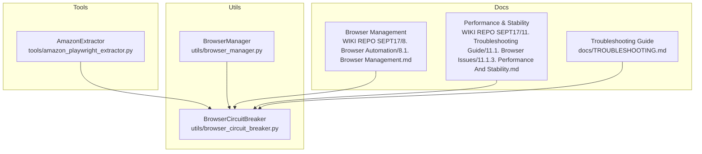
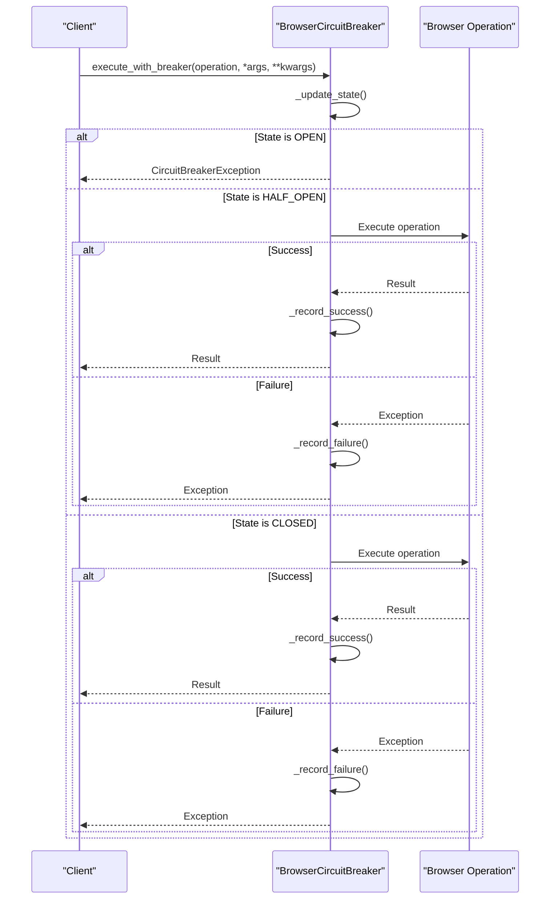
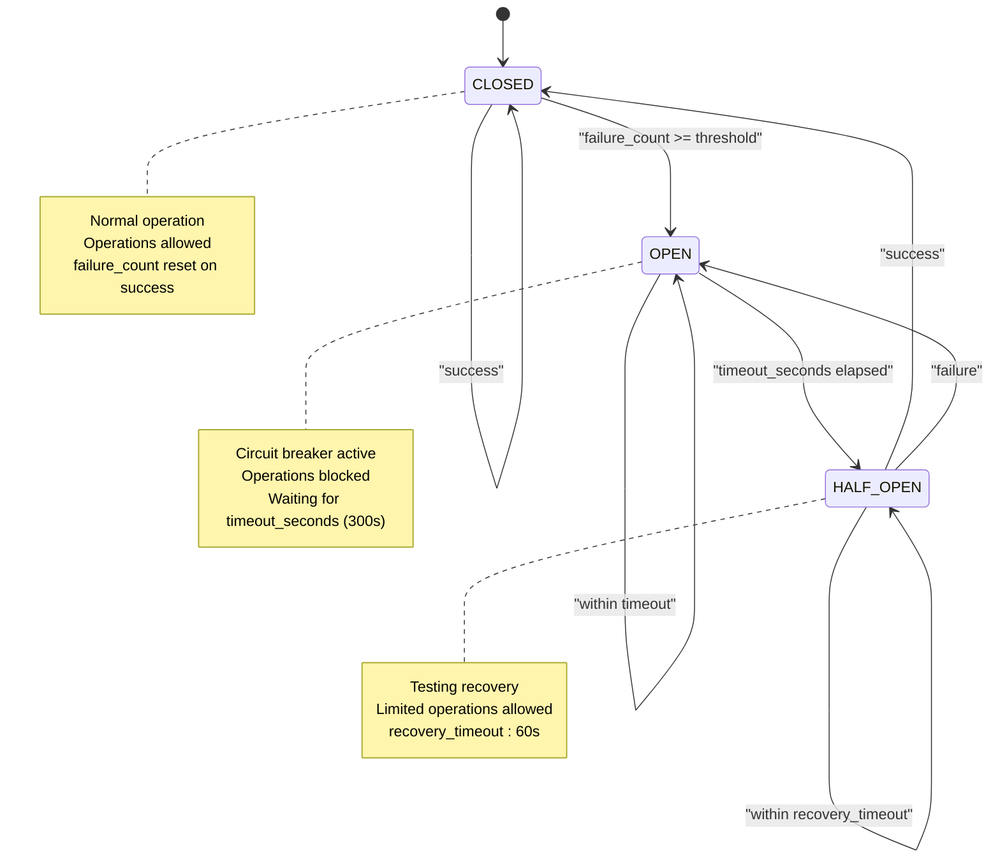
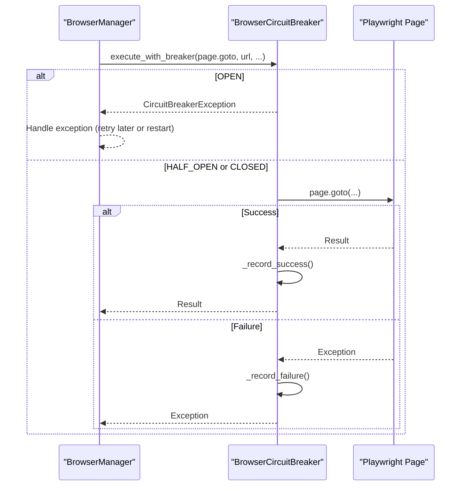
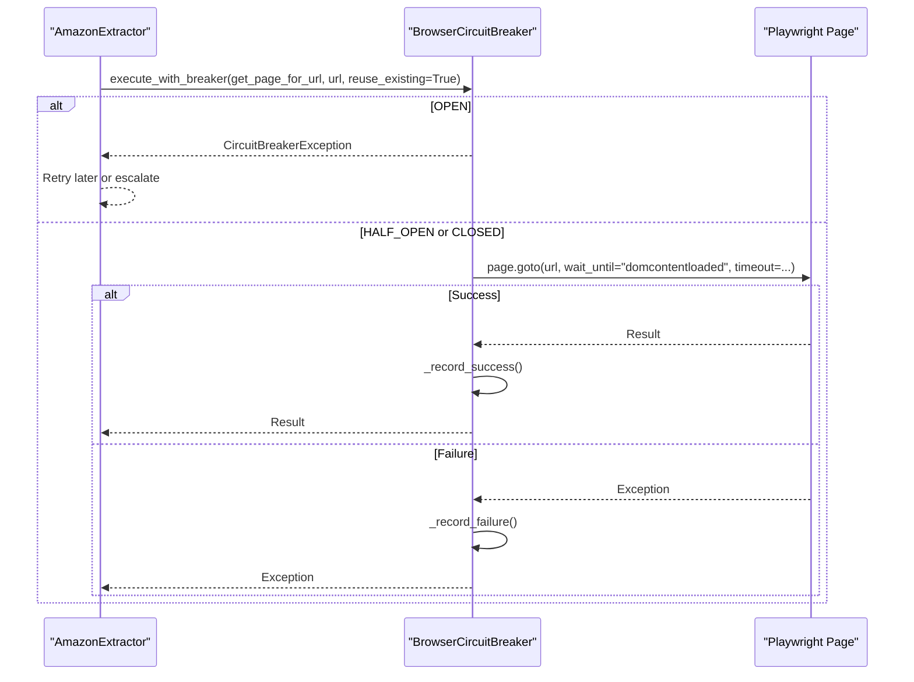
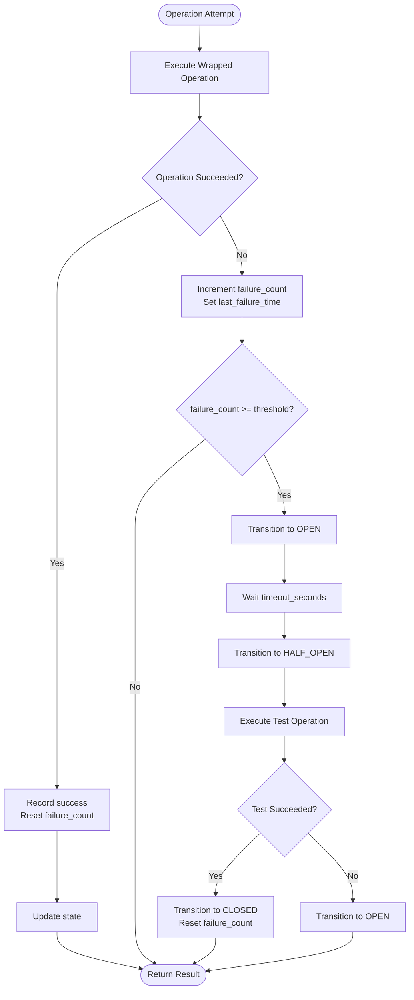
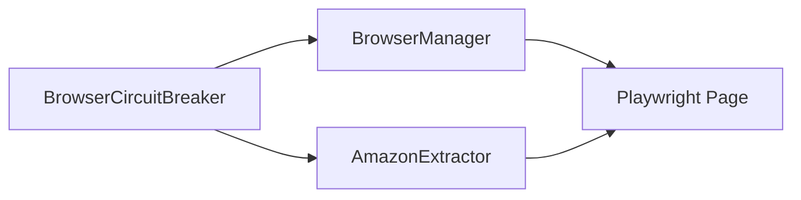

# Circuit Breaker Protection

<cite>
**Referenced Files in This Document**
- [browser_circuit_breaker.py](file://utils/browser_circuit_breaker.py)
- [browser_manager.py](file://utils/browser_manager.py)
- [amazon_playwright_extractor.py](file://tools/amazon_playwright_extractor.py)
- [8. Browser Management.md](file://WIKI REPO SEPT17/8. Browser Automation/8.1. Browser Management.md)
- [Performance And Stability.md](file://WIKI REPO SEPT17/11. Troubleshooting Guide/11.1. Browser Issues/11.1.3. Performance And Stability.md)
- [TROUBLESHOOTING.md](file://docs/TROUBLESHOOTING.md)
</cite>

## Table of Contents
1. [Introduction](#introduction)
2. [Project Structure](#project-structure)
3. [Core Components](#core-components)
4. [Architecture Overview](#architecture-overview)
5. [Detailed Component Analysis](#detailed-component-analysis)
6. [Dependency Analysis](#dependency-analysis)
7. [Performance Considerations](#performance-considerations)
8. [Troubleshooting Guide](#troubleshooting-guide)
9. [Conclusion](#conclusion)

## Introduction
This document explains the Circuit Breaker Protection system for browser operations in the Amazon FBA Agent System. It focuses on the BrowserCircuitBreaker implementation, its configuration defaults, state management, integration with browser operations (navigation, page loading, extension interactions), and how it coordinates with overall browser health monitoring. It also covers usage patterns, failure scenario simulation, recovery validation, and the relationship between circuit breaker protection and browser stability during long-running sessions.

## Project Structure
The circuit breaker is implemented as a reusable utility and integrated into browser lifecycle and extraction tools:
- utils/browser_circuit_breaker.py: Implements the BrowserCircuitBreaker class and decorator
- utils/browser_manager.py: Integrates the circuit breaker into browser lifecycle and navigation
- tools/amazon_playwright_extractor.py: Uses the circuit breaker around page navigation and retrieval
- WIKI documentation: Provides conceptual diagrams and usage context
- docs/TROUBLESHOOTING.md: Offers operational guidance and recovery steps

**Diagram sources**
- [browser_circuit_breaker.py](file://utils/browser_circuit_breaker.py#L1-L214)
- [browser_manager.py](file://utils/browser_manager.py#L61-L61)
- [amazon_playwright_extractor.py](file://tools/amazon_playwright_extractor.py#L355-L406)
- [8. Browser Management.md](file://WIKI REPO SEPT17/8. Browser Automation/8.1. Browser Management.md#L99-L168)
- [Performance And Stability.md](file://WIKI REPO SEPT17/11. Troubleshooting Guide/11.1. Browser Issues/11.1.3. Performance And Stability.md#L25-L65)
- [TROUBLESHOOTING.md](file://docs/TROUBLESHOOTING.md#L127-L145)

**Section sources**
- [browser_circuit_breaker.py](file://utils/browser_circuit_breaker.py#L1-L214)
- [browser_manager.py](file://utils/browser_manager.py#L61-L61)
- [amazon_playwright_extractor.py](file://tools/amazon_playwright_extractor.py#L355-L406)
- [8. Browser Management.md](file://WIKI REPO SEPT17/8. Browser Automation/8.1. Browser Management.md#L99-L168)
- [Performance And Stability.md](file://WIKI REPO SEPT17/11. Troubleshooting Guide/11.1. Browser Issues/11.1.3. Performance And Stability.md#L25-L65)
- [TROUBLESHOOTING.md](file://docs/TROUBLESHOOTING.md#L127-L145)

## Core Components
- BrowserCircuitBreaker: Implements the circuit breaker pattern with CLOSED, OPEN, and HALF_OPEN states. Tracks failure count and timestamps, enforces timeouts, and exposes status and reset operations.
- Integration points:
  - BrowserManager: Initializes a BrowserCircuitBreaker and wraps navigation and page operations.
  - AmazonExtractor: Wraps page navigation and page retrieval with the circuit breaker.

Key configuration defaults:
- Failure threshold: 3 failures
- Timeout (OPEN to HALF_OPEN): 300 seconds (5 minutes)
- Recovery timeout (HALF_OPEN window): 60 seconds

**Section sources**
- [browser_circuit_breaker.py](file://utils/browser_circuit_breaker.py#L51-L70)
- [browser_manager.py](file://utils/browser_manager.py#L61-L61)
- [amazon_playwright_extractor.py](file://tools/amazon_playwright_extractor.py#L355-L406)

## Architecture Overview
The circuit breaker sits between browser operations and the underlying Playwright/Page APIs. It intercepts failures, transitions states, and gates operations to prevent cascading failures during extended scraping sessions.

**Diagram sources**
- [browser_circuit_breaker.py](file://utils/browser_circuit_breaker.py#L72-L110)

**Section sources**
- [browser_circuit_breaker.py](file://utils/browser_circuit_breaker.py#L72-L110)

## Detailed Component Analysis

### BrowserCircuitBreaker Class
- Responsibilities:
  - Gate operations based on current state
  - Track failure count and timestamps
  - Enforce timeout and recovery windows
  - Expose status and manual reset
- State transitions:
  - CLOSED → OPEN when failure_count ≥ threshold
  - OPEN → HALF_OPEN after timeout_seconds elapsed
  - HALF_OPEN → CLOSED on success; HALF_OPEN → OPEN on failure
- Methods:
  - execute_with_breaker: wraps an async operation with state checks and failure/success recording
  - _update_state: evaluates timeouts and transitions
  - _record_success: resets failure count and transitions HALF_OPEN to CLOSED
  - _record_failure: increments failure count and transitions to OPEN or HALF_OPEN
  - get_status: returns current state and timing metadata
  - reset: forces CLOSED state

**Diagram sources**
- [browser_circuit_breaker.py](file://utils/browser_circuit_breaker.py#L104-L128)

**Section sources**
- [browser_circuit_breaker.py](file://utils/browser_circuit_breaker.py#L37-L191)

### Integration with BrowserManager
- BrowserManager initializes a BrowserCircuitBreaker with default parameters and uses it to wrap navigation operations.
- During get_page(url), the navigation is executed through the circuit breaker to protect against repeated failures.

**Diagram sources**
- [browser_manager.py](file://utils/browser_manager.py#L180-L183)
- [browser_circuit_breaker.py](file://utils/browser_circuit_breaker.py#L72-L110)

**Section sources**
- [browser_manager.py](file://utils/browser_manager.py#L61-L61)
- [browser_manager.py](file://utils/browser_manager.py#L180-L183)

### Integration with AmazonExtractor
- AmazonExtractor optionally uses the circuit breaker when obtaining a page or performing navigation.
- This protects navigation retries and page retrieval from cascading failures.

**Diagram sources**
- [amazon_playwright_extractor.py](file://tools/amazon_playwright_extractor.py#L355-L406)
- [browser_circuit_breaker.py](file://utils/browser_circuit_breaker.py#L72-L110)

**Section sources**
- [amazon_playwright_extractor.py](file://tools/amazon_playwright_extractor.py#L355-L406)

### Failure Detection and Recovery Procedures
- Failure detection:
  - Any exception thrown by the wrapped operation increments failure_count and records last_failure_time.
  - When failure_count reaches the threshold, state becomes OPEN.
- Recovery:
  - After timeout_seconds, OPEN transitions to HALF_OPEN to test recovery with limited operations.
  - If HALF_OPEN operations succeed, state becomes CLOSED; if they fail, state returns to OPEN.
  - Success in HALF_OPEN also resets failure_count.
- Automatic recovery timing:
  - OPEN-to-HALF_OPEN: 300 seconds (default)
  - HALF_OPEN window: 60 seconds (default)

**Diagram sources**
- [browser_circuit_breaker.py](file://utils/browser_circuit_breaker.py#L112-L164)

**Section sources**
- [browser_circuit_breaker.py](file://utils/browser_circuit_breaker.py#L112-L164)

### Usage Patterns and Examples
- Direct usage:
  - Wrap any async browser operation with execute_with_breaker to gate failures and enforce timeouts.
- Decorator usage:
  - Apply circuit_breaker_decorator to async functions to automatically add circuit breaker protection.
- Integration examples:
  - BrowserManager.get_page(url) uses the circuit breaker for navigation.
  - AmazonExtractor uses the circuit breaker for page retrieval and navigation.

Operational guidance:
- Monitor logs for circuit breaker exceptions and state transitions.
- Use get_status to inspect current state and timing metadata.
- Reset manually if needed (e.g., after a forced restart).

**Section sources**
- [browser_circuit_breaker.py](file://utils/browser_circuit_breaker.py#L72-L110)
- [browser_circuit_breaker.py](file://utils/browser_circuit_breaker.py#L193-L214)
- [browser_manager.py](file://utils/browser_manager.py#L180-L183)
- [amazon_playwright_extractor.py](file://tools/amazon_playwright_extractor.py#L355-L406)

### Failure Scenario Simulation and Recovery Validation
- Simulate failure scenario:
  - Trigger repeated failures (e.g., navigation timeouts) to reach the threshold and enter OPEN state.
  - Observe that subsequent operations raise CircuitBreakerException until timeout elapses.
- Validate recovery:
  - After timeout, HALF_OPEN allows limited operations; success transitions to CLOSED.
  - Failure in HALF_OPEN returns to OPEN.
- Use get_status to verify timing and state transitions.

**Section sources**
- [browser_circuit_breaker.py](file://utils/browser_circuit_breaker.py#L166-L183)
- [Performance And Stability.md](file://WIKI REPO SEPT17/11. Troubleshooting Guide/11.1. Browser Issues/11.1.3. Performance And Stability.md#L25-L65)

## Dependency Analysis
- BrowserManager depends on BrowserCircuitBreaker for navigation protection.
- AmazonExtractor optionally depends on BrowserCircuitBreaker for page retrieval and navigation.
- Both components rely on the same state machine and configuration defaults.

**Diagram sources**
- [browser_manager.py](file://utils/browser_manager.py#L61-L61)
- [amazon_playwright_extractor.py](file://tools/amazon_playwright_extractor.py#L355-L406)
- [browser_circuit_breaker.py](file://utils/browser_circuit_breaker.py#L37-L70)

**Section sources**
- [browser_manager.py](file://utils/browser_manager.py#L61-L61)
- [amazon_playwright_extractor.py](file://tools/amazon_playwright_extractor.py#L355-L406)
- [browser_circuit_breaker.py](file://utils/browser_circuit_breaker.py#L37-L70)

## Performance Considerations
- The circuit breaker prevents cascading failures during long-running sessions, reducing wasted resources and improving stability.
- HALF_OPEN recovery window (60s) balances cautious testing with timely recovery.
- Integration with BrowserManager and AmazonExtractor ensures protection across navigation and page retrieval operations.

[No sources needed since this section provides general guidance]

## Troubleshooting Guide
- Symptoms of circuit breaker activation:
  - “Circuit breaker OPENED” messages in logs
  - Browser operations suspended
  - Automatic recovery attempts
- Diagnosis:
  - Check circuit breaker status via logs and get_status output.
- Solutions:
  - Wait for automatic recovery (default 300s timeout).
  - Manually reset the circuit breaker if needed.
  - Investigate root causes of failures (navigation timeouts, extension issues) and address them to reduce failure count.

**Section sources**
- [Performance And Stability.md](file://WIKI REPO SEPT17/11. Troubleshooting Guide/11.1. Browser Issues/11.1.3. Performance And Stability.md#L25-L65)
- [TROUBLESHOOTING.md](file://docs/TROUBLESHOOTING.md#L127-L145)

## Conclusion
The BrowserCircuitBreaker provides robust protection for browser operations by gating failures, enforcing timeouts, and enabling gradual recovery. Its integration with BrowserManager and AmazonExtractor ensures that navigation and page retrieval are shielded from cascading failures during extended scraping sessions. Combined with health monitoring and operational guidance, the circuit breaker contributes significantly to overall browser stability and system reliability.