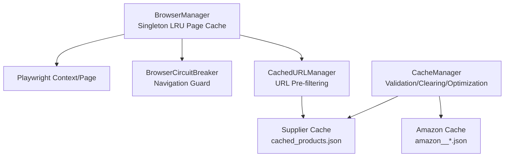
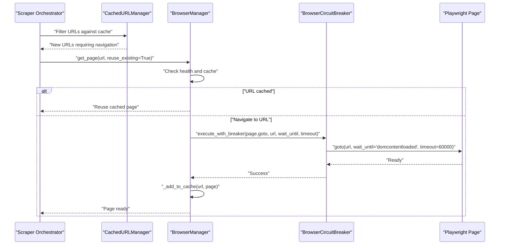
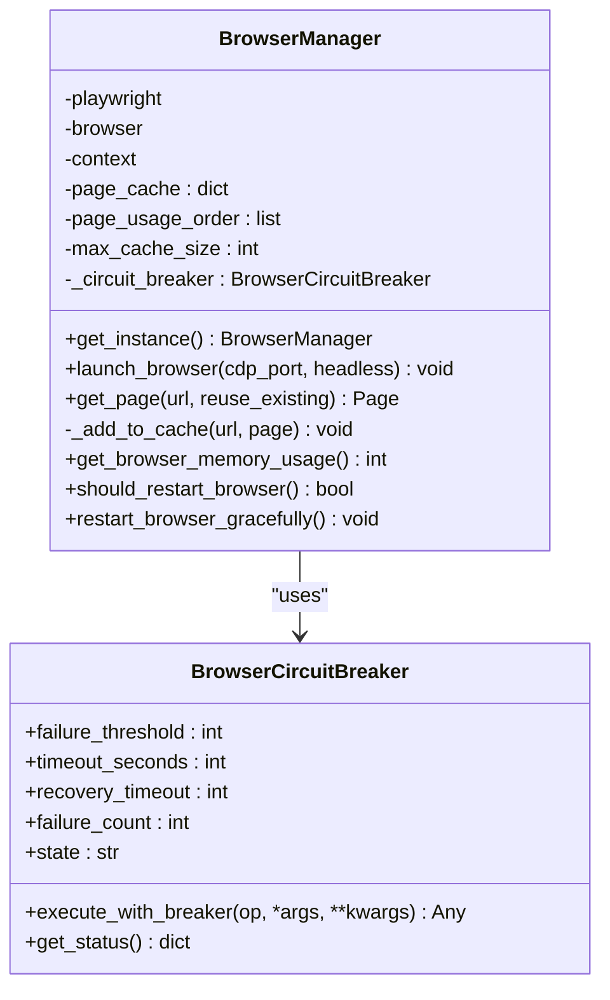
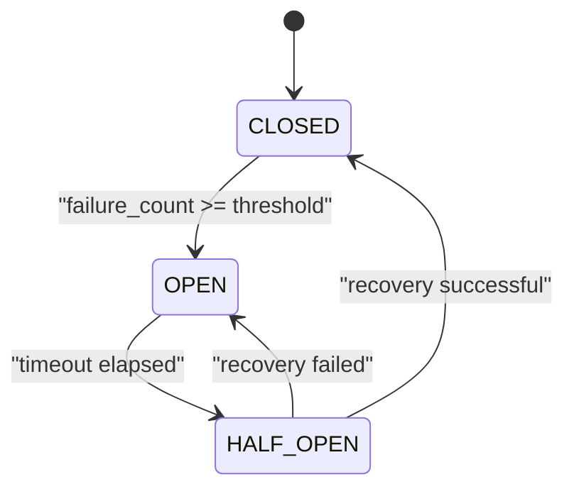
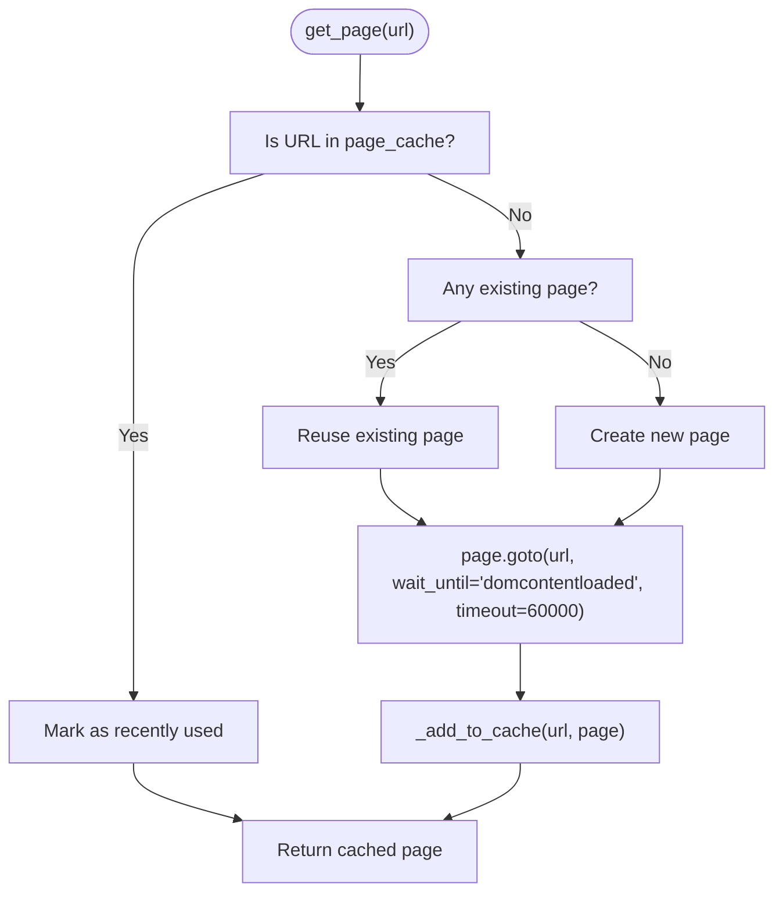
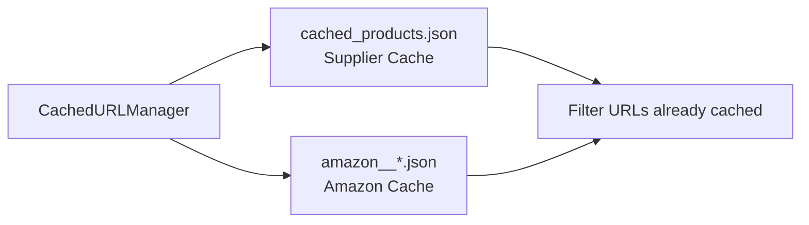
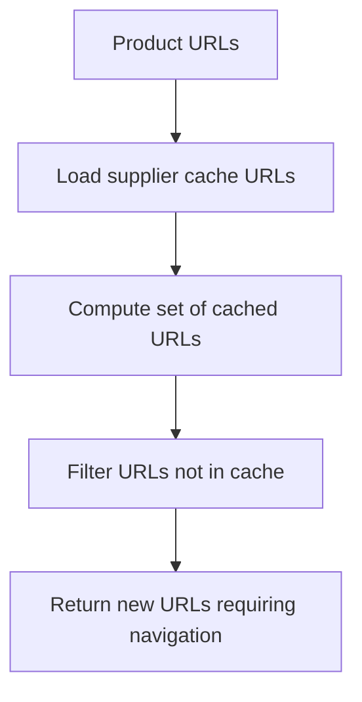
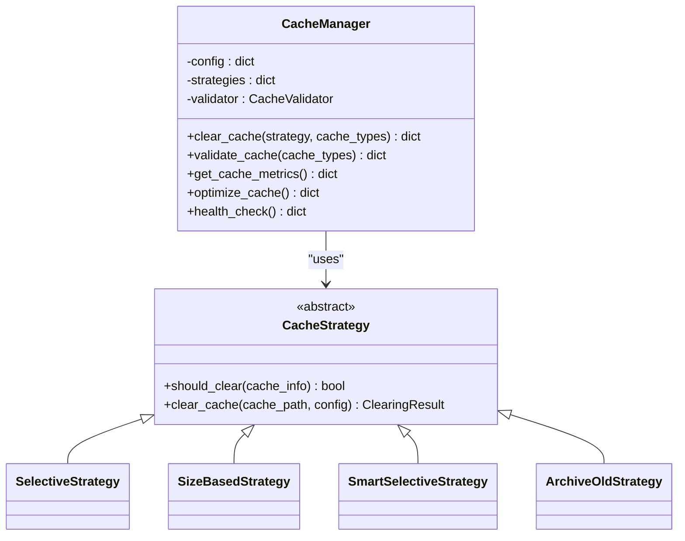
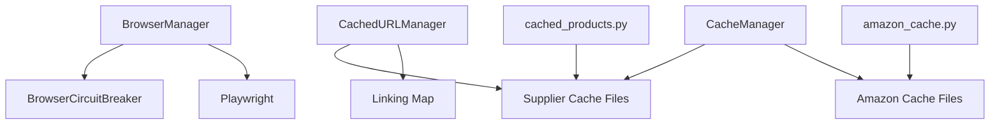

# Page Caching & Navigation

<cite>
**Referenced Files in This Document**
- [browser_manager.py](file://utils/browser_manager.py)
- [browser_circuit_breaker.py](file://utils/browser_circuit_breaker.py)
- [cache_manager.py](file://tools/cache_manager.py)
- [cached_products.py](file://control_plane/tools/cached_products.py)
- [amazon_cache.py](file://control_plane/tools/amazon_cache.py)
- [url_cache_filter.py](file://utils/url_cache_filter.py)
</cite>

## Table of Contents
1. [Introduction](#introduction)
2. [Project Structure](#project-structure)
3. [Core Components](#core-components)
4. [Architecture Overview](#architecture-overview)
5. [Detailed Component Analysis](#detailed-component-analysis)
6. [Dependency Analysis](#dependency-analysis)
7. [Performance Considerations](#performance-considerations)
8. [Troubleshooting Guide](#troubleshooting-guide)
9. [Conclusion](#conclusion)

## Introduction
This document explains the Page Caching and Navigation system used by the Amazon FBA Agent System. It covers:
- LRU page cache with configurable cache sizes and automatic eviction
- Navigation timeout handling (60 seconds default), wait_until conditions, and page stabilization
- Circuit breaker integration for navigation operations
- Page caching strategies for supplier websites and Amazon product pages
- Memory-efficient page lifecycle management
- Examples of cache utilization patterns, error handling, timeout configuration, and cache invalidation scenarios
- Single-page mode implementation and its impact on stability and memory

## Project Structure
The system centers around a singleton browser manager that controls a persistent browser context and maintains an LRU page cache. Supporting utilities provide cache validation, clearing strategies, and URL pre-filtering to avoid redundant navigation.

**Diagram sources**
- [browser_manager.py](file://utils/browser_manager.py#L35-L208)
- [browser_circuit_breaker.py](file://utils/browser_circuit_breaker.py#L37-L111)
- [url_cache_filter.py](file://utils/url_cache_filter.py#L31-L207)
- [cache_manager.py](file://tools/cache_manager.py#L1-L1)

**Section sources**
- [browser_manager.py](file://utils/browser_manager.py#L1-L1153)
- [url_cache_filter.py](file://utils/url_cache_filter.py#L1-L272)
- [cache_manager.py](file://tools/cache_manager.py#L1-L1)

## Core Components
- BrowserManager: Singleton managing a persistent Playwright context with an LRU page cache. Enforces single-page mode for stability, applies circuit breaker to navigation, and performs health checks.
- BrowserCircuitBreaker: Implements the circuit breaker pattern to guard navigation operations and prevent cascading failures.
- CacheManager: Centralized cache management with validation, clearing strategies (selective, size-based, smart-selective, archive-old), and optimization.
- CachedURLManager: Pre-filters URLs against cached supplier product lists to avoid unnecessary navigation.
- Supplier and Amazon cache accessors: Helpers to locate and read cached supplier and Amazon product data.

**Section sources**
- [browser_manager.py](file://utils/browser_manager.py#L35-L208)
- [browser_circuit_breaker.py](file://utils/browser_circuit_breaker.py#L37-L111)
- [cache_manager.py](file://tools/cache_manager.py#L1-L1)
- [url_cache_filter.py](file://utils/url_cache_filter.py#L31-L207)
- [cached_products.py](file://control_plane/tools/cached_products.py#L19-L43)
- [amazon_cache.py](file://control_plane/tools/amazon_cache.py#L9-L27)

## Architecture Overview
The navigation pipeline integrates browser lifecycle management, circuit breaking, and cache-aware URL filtering to stabilize long-running scraping sessions.

**Diagram sources**
- [browser_manager.py](file://utils/browser_manager.py#L141-L198)
- [browser_circuit_breaker.py](file://utils/browser_circuit_breaker.py#L72-L111)
- [url_cache_filter.py](file://utils/url_cache_filter.py#L153-L171)

## Detailed Component Analysis

### BrowserManager: LRU Page Cache and Navigation
- Singleton design ensures a single persistent browser context and shared page cache.
- LRU cache keyed by URL with configurable maximum size; eviction removes the oldest entry when capacity is exceeded.
- Single-page mode enforced for stability and to avoid Keepa extension failures.
- Navigation uses wait_until='domcontentloaded' and a 60-second timeout.
- Circuit breaker wraps navigation to prevent cascading failures.
- Health checks include memory monitoring and periodic restart thresholds.

**Diagram sources**
- [browser_manager.py](file://utils/browser_manager.py#L35-L208)
- [browser_circuit_breaker.py](file://utils/browser_circuit_breaker.py#L37-L111)

**Section sources**
- [browser_manager.py](file://utils/browser_manager.py#L35-L208)
- [browser_circuit_breaker.py](file://utils/browser_circuit_breaker.py#L37-L111)

### Navigation Timeout Handling and Stabilization
- Default navigation timeout: 60 seconds.
- wait_until condition: 'domcontentloaded'.
- Stabilization: The manager logs readiness and avoids aggressive page focus to maintain stability.
- Single-page mode reduces tab overhead and minimizes focus-related instability.

Practical implications:
- Increase timeout for slow suppliers or Amazon product pages.
- Use wait_until='networkidle' for pages with heavy dynamic content.
- Monitor memory usage to preempt restarts and avoid timeouts caused by resource exhaustion.

**Section sources**
- [browser_manager.py](file://utils/browser_manager.py#L180-L184)
- [browser_manager.py](file://utils/browser_manager.py#L30-L32)

### Circuit Breaker Integration for Navigation
- Wraps page.goto with a circuit breaker to protect against repeated failures.
- States: CLOSED (allow operations), OPEN (block operations), HALF_OPEN (limited retries).
- Threshold: 3 failures; recovery timeout: 300 seconds open, 60 seconds half-open.

**Diagram sources**
- [browser_circuit_breaker.py](file://utils/browser_circuit_breaker.py#L112-L133)

**Section sources**
- [browser_circuit_breaker.py](file://utils/browser_circuit_breaker.py#L37-L111)

### Page Caching Strategies and Memory-Efficient Lifecycle
- LRU eviction policy keeps most-recently-used pages cached; oldest entries evicted when capacity is exceeded.
- Single-page mode: Limits tabs to one, reducing memory footprint and preventing focus-related issues.
- Health monitoring: Tracks memory usage and schedules restarts to mitigate resource exhaustion.

**Diagram sources**
- [browser_manager.py](file://utils/browser_manager.py#L141-L198)
- [browser_manager.py](file://utils/browser_manager.py#L200-L208)

**Section sources**
- [browser_manager.py](file://utils/browser_manager.py#L141-L198)
- [browser_manager.py](file://utils/browser_manager.py#L200-L208)

### Supplier Website and Amazon Product Page Caching
- Supplier cache: Stored per supplier domain with flexible filename variants. Accessor functions resolve the correct cache file and read product lists.
- Amazon cache: Stored by ASIN with files named by pattern; accessor locates cached product data by ASIN.
- These caches inform URL pre-filtering to avoid redundant navigation.

**Diagram sources**
- [cached_products.py](file://control_plane/tools/cached_products.py#L19-L43)
- [amazon_cache.py](file://control_plane/tools/amazon_cache.py#L9-L27)
- [url_cache_filter.py](file://utils/url_cache_filter.py#L31-L207)

**Section sources**
- [cached_products.py](file://control_plane/tools/cached_products.py#L19-L43)
- [amazon_cache.py](file://control_plane/tools/amazon_cache.py#L9-L27)
- [url_cache_filter.py](file://utils/url_cache_filter.py#L31-L207)

### URL Pre-filtering to Reduce Navigation
- Loads supplier product cache into memory as a set of URLs for O(1) lookup.
- Filters incoming URL lists to only those not yet cached.
- Optionally filters against a linking map to exclude already-linked URLs.

**Diagram sources**
- [url_cache_filter.py](file://utils/url_cache_filter.py#L49-L171)

**Section sources**
- [url_cache_filter.py](file://utils/url_cache_filter.py#L31-L207)

### Cache Management and Maintenance
- Validation: Ensures JSON integrity and schema compliance for supplier and Amazon caches.
- Clearing strategies:
  - Selective: Removes expired entries based on TTL.
  - Size-based: Evicts oldest files to meet size limits (LRU-like).
  - Smart-selective: Removes processed items using linking map relationships.
  - Archive-old: Moves very old files to archives.
- Optimization: Compresses old cache files to save disk space.
- Health checks: Aggregates validation results, metrics, and system resources.

**Diagram sources**
- [cache_manager.py](file://tools/cache_manager.py#L1-L1)

**Section sources**
- [cache_manager.py](file://tools/cache_manager.py#L1-L1)

## Dependency Analysis
- BrowserManager depends on BrowserCircuitBreaker for navigation safety and on Playwright for browser control.
- CachedURLManager depends on supplier cache files to pre-filter URLs.
- CacheManager coordinates supplier and Amazon cache directories and applies clearing strategies.
- Accessor utilities (cached_products.py, amazon_cache.py) depend on filesystem layout and JSON parsing.

**Diagram sources**
- [browser_manager.py](file://utils/browser_manager.py#L23-L24)
- [browser_circuit_breaker.py](file://utils/browser_circuit_breaker.py#L25-L31)
- [url_cache_filter.py](file://utils/url_cache_filter.py#L31-L207)
- [cache_manager.py](file://tools/cache_manager.py#L1-L1)
- [cached_products.py](file://control_plane/tools/cached_products.py#L19-L43)
- [amazon_cache.py](file://control_plane/tools/amazon_cache.py#L9-L27)

**Section sources**
- [browser_manager.py](file://utils/browser_manager.py#L23-L24)
- [browser_circuit_breaker.py](file://utils/browser_circuit_breaker.py#L25-L31)
- [url_cache_filter.py](file://utils/url_cache_filter.py#L31-L207)
- [cache_manager.py](file://tools/cache_manager.py#L1-L1)
- [cached_products.py](file://control_plane/tools/cached_products.py#L19-L43)
- [amazon_cache.py](file://control_plane/tools/amazon_cache.py#L9-L27)

## Performance Considerations
- Single-page mode reduces tab overhead and stabilizes extension interactions.
- LRU cache minimizes repeated navigation for frequently accessed pages.
- URL pre-filtering dramatically reduces navigation frequency for already-cached suppliers.
- Circuit breaker prevents cascading failures and enables recovery without manual intervention.
- Cache optimization (compression) saves disk space and improves I/O performance.

[No sources needed since this section provides general guidance]

## Troubleshooting Guide
Common issues and resolutions:
- Navigation timeouts: Increase timeout or switch wait_until to 'networkidle'; verify circuit breaker state.
- Excessive memory usage: Monitor with BrowserManager memory APIs; consider restarting the browser gracefully.
- Cache corruption: Use CacheManager validation to detect invalid JSON or missing fields; clear or repair affected caches.
- Redundant navigation: Enable URL pre-filtering to skip cached supplier URLs.
- Amazon cache misses: Confirm ASIN-based cache file naming and existence; use accessor to locate cached data.

Operational tips:
- Configure cache TTL and size limits appropriate to workload.
- Periodically run cache health checks and optimization routines.
- Inspect circuit breaker status to diagnose recurring navigation failures.

**Section sources**
- [browser_manager.py](file://utils/browser_manager.py#L658-L800)
- [browser_circuit_breaker.py](file://utils/browser_circuit_breaker.py#L174-L183)
- [cache_manager.py](file://tools/cache_manager.py#L1-L1)
- [url_cache_filter.py](file://utils/url_cache_filter.py#L153-L171)

## Conclusion
The Page Caching and Navigation system combines a singleton BrowserManager with an LRU page cache, circuit breaker protection, and cache-aware URL pre-filtering. Together, these components deliver stability, performance, and memory efficiency for long-running supplier and Amazon scraping workflows. Cache management utilities ensure data integrity and operational sustainability through validation, selective clearing, and optimization.