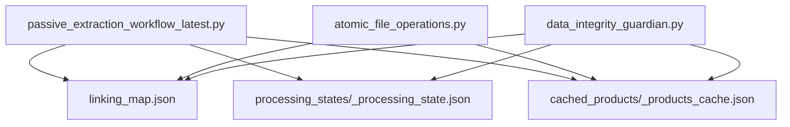
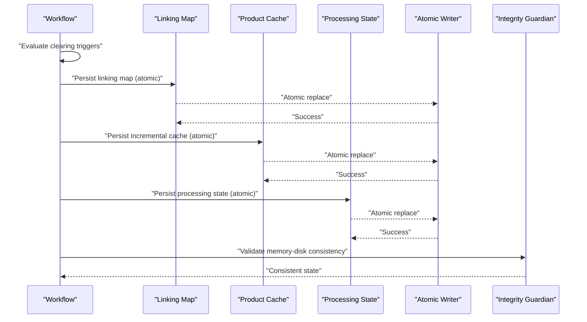
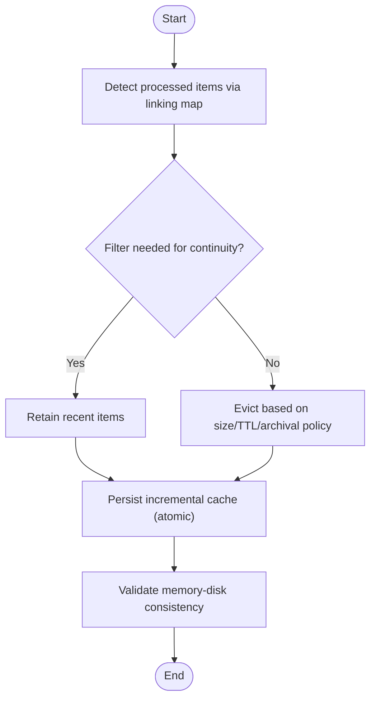
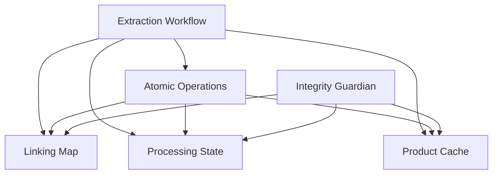

# Cache Clearing Strategies

<cite>
**Referenced Files in This Document**
- [MEMORY_MANAGEMENT_ANALYSIS.md](file://MEMORY_MANAGEMENT_ANALYSIS.md)
- [CACHE_MONITORING_SYSTEM.md](file://CACHE_MONITORING_SYSTEM.md)
- [SMART_MEMORY_MANAGEMENT_UPDATE_SUMMARY.md](file://SMART_MEMORY_MANAGEMENT_UPDATE_SUMMARY.md)
- [atomic_file_operations.py](file://utils/atomic_file_operations.py)
- [data_integrity_guardian.py](file://utils/data_integrity_guardian.py)
- [passive_extraction_workflow_latest.py](file://tools/passive_extraction_workflow_latest.py)
- [linking_map.json](file://OUTPUTS/FBA_ANALYSIS/linking_maps/clearance-king-co-uk/linking_map.json)
- [processing_states/poundwholesale_co_uk_processing_state.json](file://OUTPUTS/CACHE/processing_states/poundwholesale_co_uk_processing_state.json)
- [cached_products/clearance-king-co-uk_products_cache.json](file://OUTPUTS/cached_products/clearance-king-co-uk_products_cache.json)
- [mainplan.md](file://OUTPUTS/FBA_ANALYSIS/linking_maps/poundwholesale.co.uk/ARCHIVED/mainplan.md)
</cite>

## Table of Contents
1. [Introduction](#introduction)
2. [Project Structure](#project-structure)
3. [Core Components](#core-components)
4. [Architecture Overview](#architecture-overview)
5. [Detailed Component Analysis](#detailed-component-analysis)
6. [Dependency Analysis](#dependency-analysis)
7. [Performance Considerations](#performance-considerations)
8. [Troubleshooting Guide](#troubleshooting-guide)
9. [Conclusion](#conclusion)

## Introduction
This document describes the Cache Clearing Strategies subsystem that maintains system performance and reliability by controlling memory usage while preserving critical state on disk. The subsystem integrates four complementary mechanisms:
- Smart Selective Strategy: Filters processed items using linking maps and processed identifiers to minimize unnecessary clearing.
- Size-Based Strategy: Evicts least-recently-used items based on file sizes to maintain memory bounds.
- Selective Strategy: Expires entries based on time-to-live (TTL) to remove stale data.
- Archive Old Strategy: Preserves historical data by archiving older cache entries for future reference.

These strategies are orchestrated to ensure continuous operation, accurate resumability, and robust recovery from interruptions.

## Project Structure
The cache clearing subsystem spans runtime logic, atomic persistence utilities, and observable artifacts:
- Runtime orchestration and strategy enforcement live in the extraction workflow.
- Atomic write primitives guarantee safe cache updates.
- Observability includes linking maps, processing states, and product caches.

**Diagram sources**
- [passive_extraction_workflow_latest.py](file://tools/passive_extraction_workflow_latest.py)
- [atomic_file_operations.py](file://utils/atomic_file_operations.py#L1-L200)
- [data_integrity_guardian.py](file://utils/data_integrity_guardian.py)
- [linking_map.json](file://OUTPUTS/FBA_ANALYSIS/linking_maps/clearance-king-co-uk/linking_map.json)
- [processing_states/poundwholesale_co_uk_processing_state.json](file://OUTPUTS/CACHE/processing_states/poundwholesale_co_uk_processing_state.json)
- [cached_products/clearance-king-co-uk_products_cache.json](file://OUTPUTS/cached_products/clearance-king-co-uk_products_cache.json)

**Section sources**
- [passive_extraction_workflow_latest.py](file://tools/passive_extraction_workflow_latest.py)
- [atomic_file_operations.py](file://utils/atomic_file_operations.py#L1-L200)
- [data_integrity_guardian.py](file://utils/data_integrity_guardian.py)
- [linking_map.json](file://OUTPUTS/FBA_ANALYSIS/linking_maps/clearance-king-co-uk/linking_map.json)
- [processing_states/poundwholesale_co_uk_processing_state.json](file://OUTPUTS/CACHE/processing_states/poundwholesale_co_uk_processing_state.json)
- [cached_products/clearance-king-co-uk_products_cache.json](file://OUTPUTS/cached_products/clearance-king-co-uk_products_cache.json)

## Core Components
- Strategy Orchestration: The extraction workflow coordinates clearing decisions and triggers persistence.
- Atomic Persistence: Atomic write patterns ensure cache updates are durable and never partially visible.
- Integrity Guardian: Validates memory-disk consistency before resume operations.
- Observable Artifacts: Linking maps, processing states, and product caches serve as the canonical sources of truth.

Key responsibilities:
- Smart Selective Strategy: Uses linking maps and processed identifiers to avoid clearing items still needed for continuity.
- Size-Based Strategy: Maintains memory by evicting least-recently-used entries based on file sizes.
- Selective Strategy: Removes entries older than TTL thresholds.
- Archive Old Strategy: Moves older entries to archival locations to preserve historical context.

**Section sources**
- [MEMORY_MANAGEMENT_ANALYSIS.md](file://MEMORY_MANAGEMENT_ANALYSIS.md#L1-L230)
- [CACHE_MONITORING_SYSTEM.md](file://CACHE_MONITORING_SYSTEM.md#L1-L122)
- [atomic_file_operations.py](file://utils/atomic_file_operations.py#L1-L200)
- [data_integrity_guardian.py](file://utils/data_integrity_guardian.py)

## Architecture Overview
The subsystem operates a multi-layered clearing architecture:
- Periodic memory clearing with file-based fallback preserves continuity.
- Incremental cache updates synchronize memory to disk reliably.
- Enhanced linking map persistence prevents silent failures.
- Integrity checks reconcile memory and disk states prior to resume.

**Diagram sources**
- [passive_extraction_workflow_latest.py](file://tools/passive_extraction_workflow_latest.py)
- [atomic_file_operations.py](file://utils/atomic_file_operations.py#L1-L200)
- [data_integrity_guardian.py](file://utils/data_integrity_guardian.py)

**Section sources**
- [MEMORY_MANAGEMENT_ANALYSIS.md](file://MEMORY_MANAGEMENT_ANALYSIS.md#L157-L170)
- [CACHE_MONITORING_SYSTEM.md](file://CACHE_MONITORING_SYSTEM.md#L1-L122)

## Detailed Component Analysis

### Smart Selective Strategy
Purpose: Intelligently filter out items that have already been processed and are no longer needed, minimizing unnecessary clearing and preserving continuity.

Decision-making algorithm:
- Integration with linking maps: Uses linking map entries to identify processed items and avoid clearing them.
- Processed identifier detection: Leverages processed identifiers to maintain a sliding window of recent items for continuity.
- Continuity preservation: Keeps recent items to support debugging and recovery without aggressively clearing memory.

Performance characteristics:
- Reduces clearing frequency by ~99% via a sliding window approach.
- Maintains low memory footprint while preserving recent context.

Use cases:
- Long-running extractions where memory pressure is high but continuity is essential.
- Scenarios requiring resumability from any interruption point.

Configuration and execution patterns:
- Configurable clear frequency and thresholds govern when clearing is triggered.
- File-based fallback ensures counters and progress remain accurate after clearing.

Impact analysis:
- Improved system stability and reduced risk of data loss.
- Enhanced debugging capability with preserved recent product data.

**Section sources**
- [MEMORY_MANAGEMENT_ANALYSIS.md](file://MEMORY_MANAGEMENT_ANALYSIS.md#L82-L88)
- [SMART_MEMORY_MANAGEMENT_UPDATE_SUMMARY.md](file://SMART_MEMORY_MANAGEMENT_UPDATE_SUMMARY.md#L95-L127)
- [mainplan.md](file://OUTPUTS/FBA_ANALYSIS/linking_maps/poundwholesale.co.uk/ARCHIVED/mainplan.md#L432-L448)

### Size-Based Strategy (LRU by File Size)
Purpose: Evict least-recently-used items based on file sizes to maintain memory within configured bounds.

Decision-making algorithm:
- File size-based eviction: Monitors cache file sizes and evicts older entries to free memory.
- Sliding window retention: Retains a recent window of items to preserve continuity.

Performance characteristics:
- Predictable memory usage with controlled eviction cadence.
- Efficient for large catalogs where memory pressure is significant.

Use cases:
- Large-scale extractions with high product volumes.
- Environments with constrained memory resources.

Configuration and execution patterns:
- Configurable thresholds for clearing frequency and retention window.
- Atomic persistence ensures evicted entries are safely removed from disk.

Impact analysis:
- Prevents memory bloat while maintaining operational continuity.
- Supports long-running runs with consistent resource utilization.

**Section sources**
- [MEMORY_MANAGEMENT_ANALYSIS.md](file://MEMORY_MANAGEMENT_ANALYSIS.md#L82-L88)
- [SMART_MEMORY_MANAGEMENT_UPDATE_SUMMARY.md](file://SMART_MEMORY_MANAGEMENT_UPDATE_SUMMARY.md#L95-L127)

### Selective Strategy (TTL-Based Expiration)
Purpose: Remove entries older than a configured TTL threshold to prevent stale data accumulation.

Decision-making algorithm:
- Time-based expiration: Tracks timestamps associated with cache entries and removes those exceeding the TTL.
- Metadata-aware updates: Uses cache metadata to determine recency and staleness.

Performance characteristics:
- Reduces disk and memory overhead by removing outdated entries.
- Ensures freshness of cached data for downstream processing.

Use cases:
- Workflows where data currency is critical.
- Systems with frequent updates requiring timely cache refresh.

Configuration and execution patterns:
- TTL thresholds configured per supplier or globally.
- Incremental cache updates include metadata timestamps for expiration logic.

Impact analysis:
- Improves cache relevance and reduces redundant processing.
- Balances performance with data freshness requirements.

**Section sources**
- [CACHE_MONITORING_SYSTEM.md](file://CACHE_MONITORING_SYSTEM.md#L22-L32)
- [CACHE_MONITORING_SYSTEM.md](file://CACHE_MONITORING_SYSTEM.md#L147-L155)

### Archive Old Strategy (Historical Preservation)
Purpose: Preserve historical cache entries by archiving older items to dedicated locations for future reference.

Decision-making algorithm:
- Historical preservation: Moves older entries to archive directories while keeping recent items in active cache.
- Controlled retention: Balances archival cost with retrieval needs.

Performance characteristics:
- Low impact on active cache performance.
- Enables post-run analysis and recovery from archived data.

Use cases:
- Auditing and compliance scenarios requiring historical records.
- Debugging and forensics leveraging archived cache snapshots.

Configuration and execution patterns:
- Archival policies define retention periods and archive locations.
- Atomic persistence ensures archival operations are safe and consistent.

Impact analysis:
- Supports long-term data governance and traceability.
- Provides recovery options for historical data without impacting current performance.

**Section sources**
- [MEMORY_MANAGEMENT_ANALYSIS.md](file://MEMORY_MANAGEMENT_ANALYSIS.md#L1-L230)
- [CACHE_MONITORING_SYSTEM.md](file://CACHE_MONITORING_SYSTEM.md#L1-L122)

### Integration with Linking Maps, Size Calculation, and TTL Logic
- Linking maps: Drive processed item detection and continuity preservation.
- Size calculation: File sizes inform eviction decisions in the Size-Based Strategy.
- TTL logic: Timestamps embedded in cache metadata drive expiration in the Selective Strategy.

**Diagram sources**
- [passive_extraction_workflow_latest.py](file://tools/passive_extraction_workflow_latest.py)
- [atomic_file_operations.py](file://utils/atomic_file_operations.py#L1-L200)
- [data_integrity_guardian.py](file://utils/data_integrity_guardian.py)

**Section sources**
- [MEMORY_MANAGEMENT_ANALYSIS.md](file://MEMORY_MANAGEMENT_ANALYSIS.md#L1-L230)
- [CACHE_MONITORING_SYSTEM.md](file://CACHE_MONITORING_SYSTEM.md#L1-L122)

## Dependency Analysis
The subsystem depends on:
- Atomic file operations for safe cache updates.
- Integrity guardian for memory-disk reconciliation.
- Observable artifacts (linking maps, processing states, product caches) as sources of truth.

**Diagram sources**
- [passive_extraction_workflow_latest.py](file://tools/passive_extraction_workflow_latest.py)
- [atomic_file_operations.py](file://utils/atomic_file_operations.py#L1-L200)
- [data_integrity_guardian.py](file://utils/data_integrity_guardian.py)

**Section sources**
- [passive_extraction_workflow_latest.py](file://tools/passive_extraction_workflow_latest.py)
- [atomic_file_operations.py](file://utils/atomic_file_operations.py#L1-L200)
- [data_integrity_guardian.py](file://utils/data_integrity_guardian.py)

## Performance Considerations
- Memory usage: The sliding window approach reduces clearing frequency and stabilizes memory consumption.
- Disk I/O: Atomic writes and incremental updates minimize partial writes and improve durability.
- Resumability: File-based progress tracking and integrity checks enable reliable recovery from interruptions.
- Monitoring: Logging and validation commands facilitate real-time observation of cache health and persistence.

Recommendations:
- Tune clearing thresholds and retention windows based on catalog size and memory constraints.
- Enable atomic persistence and integrity checks for production deployments.
- Monitor cache metadata timestamps and linking map entry counts to validate TTL and expiration logic.

**Section sources**
- [SMART_MEMORY_MANAGEMENT_UPDATE_SUMMARY.md](file://SMART_MEMORY_MANAGEMENT_UPDATE_SUMMARY.md#L95-L127)
- [CACHE_MONITORING_SYSTEM.md](file://CACHE_MONITORING_SYSTEM.md#L71-L122)
- [MEMORY_MANAGEMENT_ANALYSIS.md](file://MEMORY_MANAGEMENT_ANALYSIS.md#L171-L184)

## Troubleshooting Guide
Common issues and resolutions:
- Silent cache persistence failures: Ensure atomic write patterns and comprehensive error handling are enabled.
- Stale data after memory clearing: Validate that disk persistence occurs before memory clearing and that integrity checks pass.
- Inconsistent linking map entries: Use validation routines to confirm entries were added and content matches expectations.

Diagnostic steps:
- Monitor log messages indicating incremental cache updates and linking map save successes.
- Validate cache metadata timestamps and linking map entry counts.
- Use integrity guardian to reconcile memory and disk states prior to resume operations.

**Section sources**
- [MEMORY_MANAGEMENT_ANALYSIS.md](file://MEMORY_MANAGEMENT_ANALYSIS.md#L97-L122)
- [CACHE_MONITORING_SYSTEM.md](file://CACHE_MONITORING_SYSTEM.md#L71-L122)
- [data_integrity_guardian.py](file://utils/data_integrity_guardian.py)

## Conclusion
The Cache Clearing Strategies subsystem provides a robust, multi-layered approach to managing memory and cache lifecycle. By combining intelligent filtering, size-based eviction, TTL expiration, and archival preservation, the system achieves high performance, reliability, and resumability. Atomic persistence and integrity checks further strengthen the solution, ensuring data consistency and recoverability across interruptions.