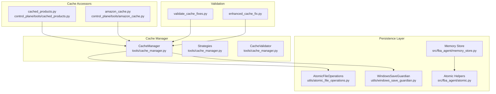
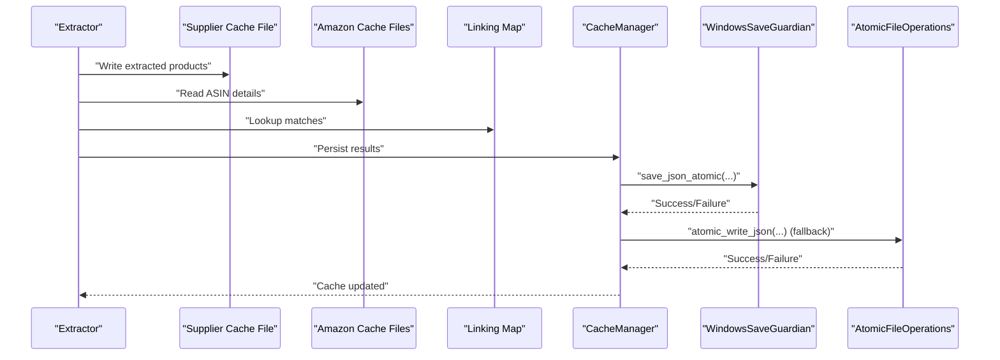
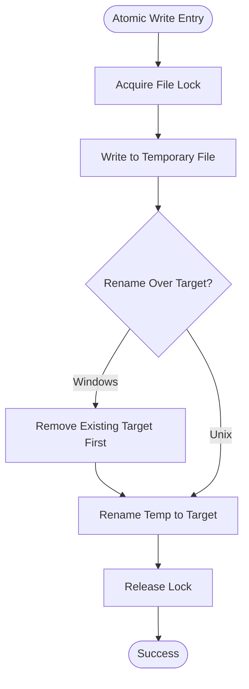
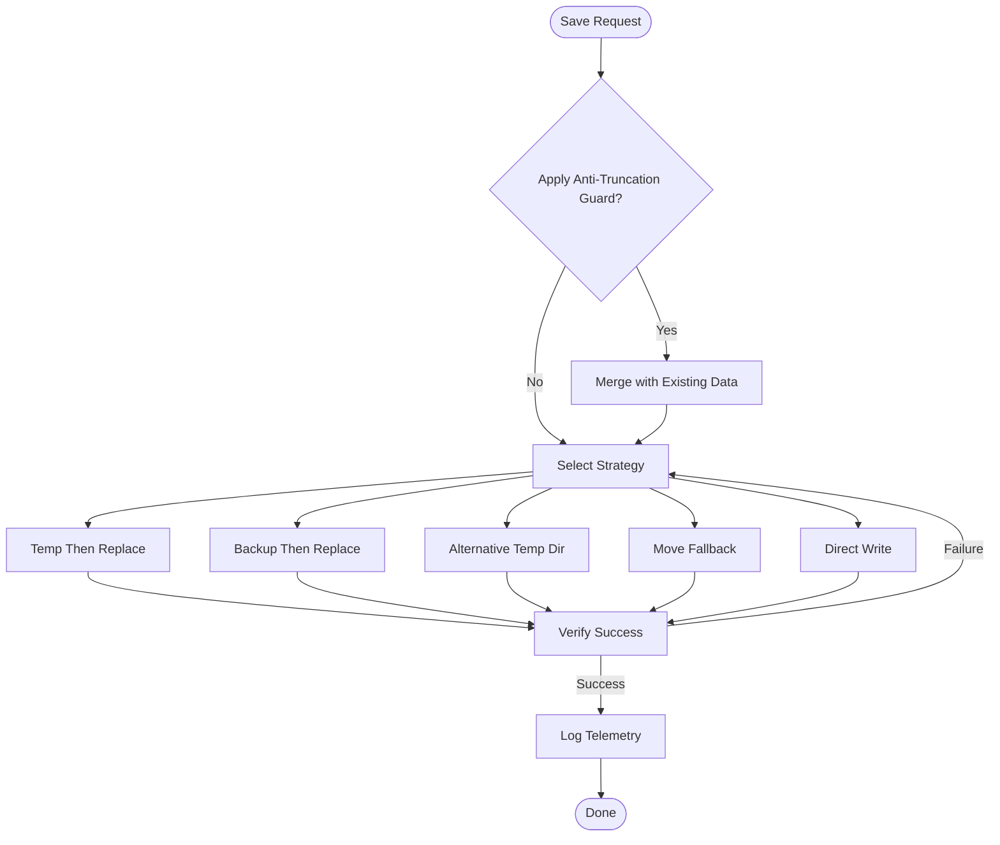
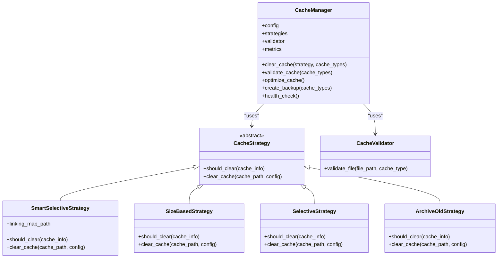
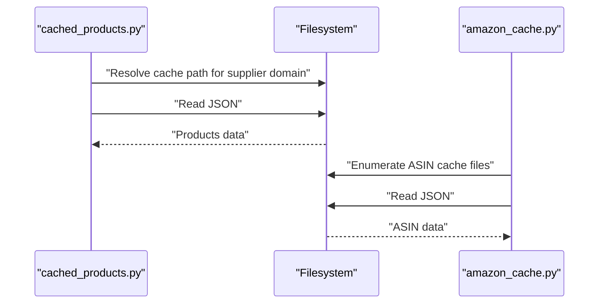
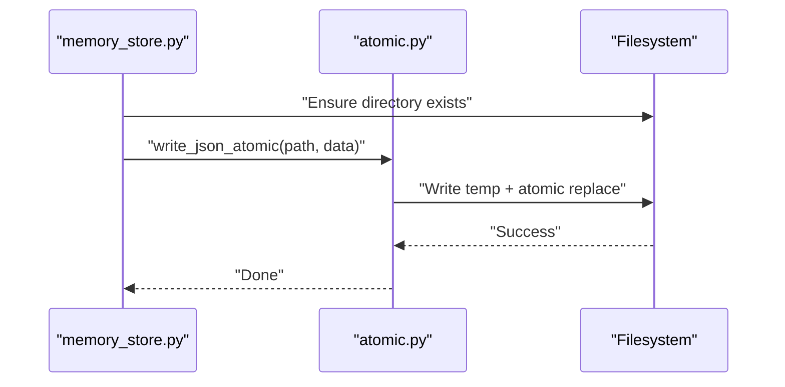
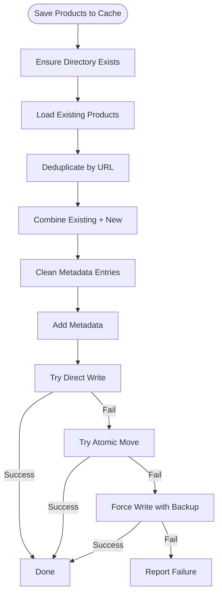
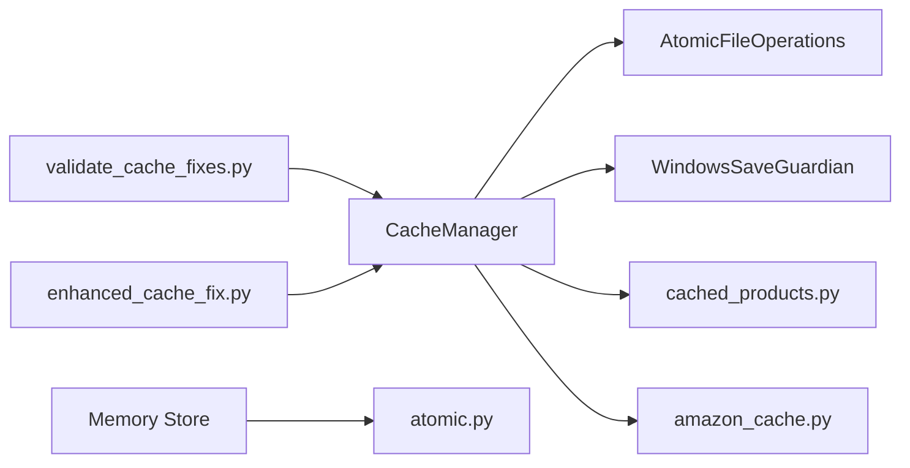

# Cache Management

<cite>
**Referenced Files in This Document**
- [atomic_file_operations.py](file://utils/atomic_file_operations.py)
- [windows_save_guardian.py](file://utils/windows_save_guardian.py)
- [atomic.py](file://src/fba_agent/atomic.py)
- [cache_manager.py](file://tools/cache_manager.py)
- [cached_products.py](file://control_plane/tools/cached_products.py)
- [amazon_cache.py](file://control_plane/tools/amazon_cache.py)
- [memory_store.py](file://src/fba_agent/memory_store.py)
- [validate_cache_fixes.py](file://validate_cache_fixes.py)
- [enhanced_cache_fix.py](file://enhanced_cache_fix.py)
</cite>

## Table of Contents
1. [Introduction](#introduction)
2. [Project Structure](#project-structure)
3. [Core Components](#core-components)
4. [Architecture Overview](#architecture-overview)
5. [Detailed Component Analysis](#detailed-component-analysis)
6. [Dependency Analysis](#dependency-analysis)
7. [Performance Considerations](#performance-considerations)
8. [Troubleshooting Guide](#troubleshooting-guide)
9. [Conclusion](#conclusion)
10. [Appendices](#appendices)

## Introduction
This document describes the Cache Management subsystem of the Amazon FBA Agent System. It explains cache persistence strategies using atomic file operations and batched saving patterns to ensure data integrity. It documents the cache lifecycle from product extraction through Amazon matching to final results storage, and covers cache initialization, serialization, concurrent access handling, Windows-specific safeguards, memory optimization, eviction policies, performance monitoring, validation, corruption detection, and recovery procedures.

## Project Structure
The cache management system spans several modules:
- Cross-platform atomic file operations
- Windows-specific save guardian for resilient writes
- Centralized cache manager with strategies and validation
- Supplier and Amazon cache accessors
- Memory store utilities for atomic persistence
- Validation scripts for cache health and metadata

**Diagram sources**
- [atomic_file_operations.py](file://utils/atomic_file_operations.py#L1-L189)
- [windows_save_guardian.py](file://utils/windows_save_guardian.py#L1-L609)
- [atomic.py](file://src/fba_agent/atomic.py#L1-L50)
- [cache_manager.py](file://tools/cache_manager.py#L1-L1)
- [cached_products.py](file://control_plane/tools/cached_products.py#L1-L96)
- [amazon_cache.py](file://control_plane/tools/amazon_cache.py#L1-L28)
- [memory_store.py](file://src/fba_agent/memory_store.py#L1-L265)
- [validate_cache_fixes.py](file://validate_cache_fixes.py#L1-L203)
- [enhanced_cache_fix.py](file://enhanced_cache_fix.py#L1-L113)

**Section sources**
- [atomic_file_operations.py](file://utils/atomic_file_operations.py#L1-L189)
- [windows_save_guardian.py](file://utils/windows_save_guardian.py#L1-L609)
- [atomic.py](file://src/fba_agent/atomic.py#L1-L50)
- [cache_manager.py](file://tools/cache_manager.py#L1-L1)
- [cached_products.py](file://control_plane/tools/cached_products.py#L1-L96)
- [amazon_cache.py](file://control_plane/tools/amazon_cache.py#L1-L28)
- [memory_store.py](file://src/fba_agent/memory_store.py#L1-L265)
- [validate_cache_fixes.py](file://validate_cache_fixes.py#L1-L203)
- [enhanced_cache_fix.py](file://enhanced_cache_fix.py#L1-L113)

## Core Components
- AtomicFileOperations: Provides cross-platform atomic JSON read/write, append, locking, and integrity validation.
- WindowsSaveGuardian: Windows-safe atomic persistence with multiple fallback strategies, telemetry, and anti-truncation guard.
- CacheManager: Centralized cache lifecycle management with strategies (selective, size-based, smart selective, archive old), validation, metrics, optimization, and backups.
- CacheValidator: Validates cache files by schema and structure.
- Cache Strategies: TTL-based selective clearing, size-based LRU eviction, smart selective clearing using linking map, and archival of old files.
- Supplier and Amazon Cache Accessors: Locate and read supplier and Amazon cache files.
- Memory Store: Uses atomic helpers to persist calibration and run history safely.
- Validation Utilities: Scripts to validate cache health, detect stale or missing files, and simulate atomic updates.

**Section sources**
- [atomic_file_operations.py](file://utils/atomic_file_operations.py#L17-L154)
- [windows_save_guardian.py](file://utils/windows_save_guardian.py#L26-L182)
- [cache_manager.py](file://tools/cache_manager.py#L1-L1)
- [cached_products.py](file://control_plane/tools/cached_products.py#L19-L43)
- [amazon_cache.py](file://control_plane/tools/amazon_cache.py#L9-L27)
- [memory_store.py](file://src/fba_agent/memory_store.py#L104-L130)
- [validate_cache_fixes.py](file://validate_cache_fixes.py#L13-L85)

## Architecture Overview
The cache lifecycle integrates extraction, matching, and storage with robust persistence guarantees:
- Extraction produces supplier product data stored in supplier cache files.
- Matching logic consults Amazon cache entries and linking maps to produce matches.
- Results are persisted atomically to avoid corruption and support concurrent access.
- Windows-specific safeguards ensure resilience against file locking and permission errors.
- Validation and monitoring track health, size, staleness, and corruption.

**Diagram sources**
- [cache_manager.py](file://tools/cache_manager.py#L1-L1)
- [windows_save_guardian.py](file://utils/windows_save_guardian.py#L86-L182)
- [atomic_file_operations.py](file://utils/atomic_file_operations.py#L58-L93)

## Detailed Component Analysis

### AtomicFileOperations
- Purpose: Thread-safe, cross-platform atomic JSON read/write, append, and integrity validation.
- Key capabilities:
  - File locking with platform-specific semantics.
  - Atomic write via temp file + rename.
  - Safe backup creation and JSON integrity checks.
- Concurrency: Uses per-file locks and temporary files to prevent partial writes and race conditions.
- Windows note: Removes target before rename to satisfy Windows atomicity semantics.

**Diagram sources**
- [atomic_file_operations.py](file://utils/atomic_file_operations.py#L58-L93)

**Section sources**
- [atomic_file_operations.py](file://utils/atomic_file_operations.py#L17-L154)

### WindowsSaveGuardian
- Purpose: Production-ready, Windows-safe atomic persistence with multiple strategies and telemetry.
- Strategies (in order):
  - Alternative temp directory
  - Direct write
- Anti-truncation guard: Merges new data with existing large files to prevent accidental truncation.
- Telemetry: Logs strategy outcomes, execution times, and sizes.
- Non-atomic fallbacks: Move and direct write as last resorts.

**Diagram sources**
- [windows_save_guardian.py](file://utils/windows_save_guardian.py#L86-L182)
- [windows_save_guardian.py](file://utils/windows_save_guardian.py#L266-L479)

**Section sources**
- [windows_save_guardian.py](file://utils/windows_save_guardian.py#L26-L182)
- [windows_save_guardian.py](file://utils/windows_save_guardian.py#L266-L479)

### CacheManager
- Responsibilities:
  - Lifecycle: Clear, validate, optimize, backup, health check.
  - Strategies: Selective TTL, size-based LRU, smart selective (with linking map), archive old.
  - Metrics: Hit rate, sizes, counts, corruption counts.
  - Optimization: Compress old cache files.
- Concurrency: Uses thread pool executor for parallel operations.
- Configuration: Per-cache-type TTL, size limits, backup retention, and cleanup strategy.

**Diagram sources**
- [cache_manager.py](file://tools/cache_manager.py#L1-L1)

**Section sources**
- [cache_manager.py](file://tools/cache_manager.py#L1-L1)

### Supplier and Amazon Cache Accessors
- Supplier cache accessor resolves supplier domain to cache file and reads cached products.
- Amazon cache accessor locates ASIN-specific cache files and reads Amazon product data.

**Diagram sources**
- [cached_products.py](file://control_plane/tools/cached_products.py#L19-L43)
- [amazon_cache.py](file://control_plane/tools/amazon_cache.py#L9-L27)

**Section sources**
- [cached_products.py](file://control_plane/tools/cached_products.py#L19-L96)
- [amazon_cache.py](file://control_plane/tools/amazon_cache.py#L9-L27)

### Memory Store Atomic Persistence
- Uses atomic helpers to persist calibration and run history safely.
- Ensures directory creation and atomic replace to avoid corruption.

**Diagram sources**
- [memory_store.py](file://src/fba_agent/memory_store.py#L104-L130)
- [atomic.py](file://src/fba_agent/atomic.py#L15-L33)

**Section sources**
- [memory_store.py](file://src/fba_agent/memory_store.py#L104-L130)
- [atomic.py](file://src/fba_agent/atomic.py#L1-L50)

### Enhanced Cache Save and Recovery
- Implements deduplication, metadata injection, and multi-strategy persistence.
- Supports direct write, atomic move, and backup/recovery on failure.

**Diagram sources**
- [enhanced_cache_fix.py](file://enhanced_cache_fix.py#L2-L113)

**Section sources**
- [enhanced_cache_fix.py](file://enhanced_cache_fix.py#L1-L113)

## Dependency Analysis
- CacheManager depends on:
  - AtomicFileOperations for atomic JSON operations.
  - WindowsSaveGuardian for resilient Windows writes.
  - Supplier and Amazon cache accessors for reading existing cache data.
  - Validation utilities for health checks and metadata verification.
- Memory Store depends on atomic helpers for safe persistence.
- Cross-platform differences:
  - AtomicFileOperations handles Unix vs Windows file locking and rename semantics.
  - WindowsSaveGuardian adds layered fallbacks to mitigate WinError 5 and truncation risks.

**Diagram sources**
- [cache_manager.py](file://tools/cache_manager.py#L1-L1)
- [atomic_file_operations.py](file://utils/atomic_file_operations.py#L1-L189)
- [windows_save_guardian.py](file://utils/windows_save_guardian.py#L1-L609)
- [cached_products.py](file://control_plane/tools/cached_products.py#L1-L96)
- [amazon_cache.py](file://control_plane/tools/amazon_cache.py#L1-L28)
- [memory_store.py](file://src/fba_agent/memory_store.py#L1-L265)
- [validate_cache_fixes.py](file://validate_cache_fixes.py#L1-L203)
- [enhanced_cache_fix.py](file://enhanced_cache_fix.py#L1-L113)

**Section sources**
- [cache_manager.py](file://tools/cache_manager.py#L1-L1)
- [atomic_file_operations.py](file://utils/atomic_file_operations.py#L1-L189)
- [windows_save_guardian.py](file://utils/windows_save_guardian.py#L1-L609)
- [cached_products.py](file://control_plane/tools/cached_products.py#L1-L96)
- [amazon_cache.py](file://control_plane/tools/amazon_cache.py#L1-L28)
- [memory_store.py](file://src/fba_agent/memory_store.py#L1-L265)
- [validate_cache_fixes.py](file://validate_cache_fixes.py#L1-L203)
- [enhanced_cache_fix.py](file://enhanced_cache_fix.py#L1-L113)

## Performance Considerations
- Atomic writes minimize partial writes and improve durability.
- Batched saving patterns (append JSON array, merge large datasets) reduce frequent small writes.
- Compression of old cache files reduces disk usage.
- LRU eviction and TTL-based clearing prevent unbounded growth.
- Parallel execution of validation and clearing improves throughput.
- Anti-truncation guard prevents accidental data loss on small incremental writes to large files.

[No sources needed since this section provides general guidance]

## Troubleshooting Guide
- Corrupted cache files:
  - Use CacheValidator to identify invalid JSON or missing fields.
  - Run validation script to assess overall health and staleness.
- Stale or missing cache:
  - Check file age and size; consider running the system to regenerate.
  - Confirm supplier domain normalization and cache path resolution.
- Windows-specific failures:
  - Prefer WindowsSaveGuardian for atomic saves; it logs telemetry and retries.
  - If truncation suspected, anti-truncation guard merges data to prevent loss.
- Recovery:
  - Use backup files created by CacheManager or force-write with backup restoration.
  - Validate recovered files and monitor for continued stability.

**Section sources**
- [cache_manager.py](file://tools/cache_manager.py#L1-L1)
- [validate_cache_fixes.py](file://validate_cache_fixes.py#L13-L85)
- [windows_save_guardian.py](file://utils/windows_save_guardian.py#L86-L182)

## Conclusion
The Cache Management subsystem ensures reliable, durable, and efficient cache persistence across platforms. It combines atomic file operations, Windows-specific safeguards, intelligent eviction and clearing strategies, comprehensive validation, and performance monitoring to maintain system stability and data integrity throughout the product extraction and matching lifecycle.

[No sources needed since this section summarizes without analyzing specific files]

## Appendices

### Cache Lifecycle Summary
- Initialization: Ensure cache directories exist and load configuration.
- Extraction: Persist supplier product data using atomic helpers.
- Matching: Read Amazon cache and linking map to compute matches.
- Storage: Persist results using atomic write patterns and Windows-safe strategies.
- Maintenance: Periodic validation, clearing, optimization, and backups.

**Section sources**
- [cache_manager.py](file://tools/cache_manager.py#L1-L1)
- [memory_store.py](file://src/fba_agent/memory_store.py#L104-L130)
- [windows_save_guardian.py](file://utils/windows_save_guardian.py#L86-L182)