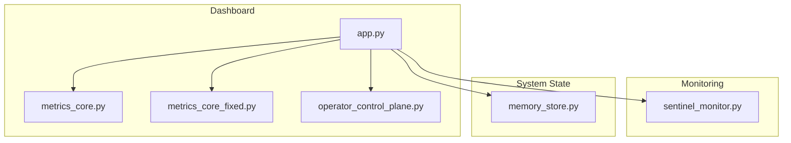
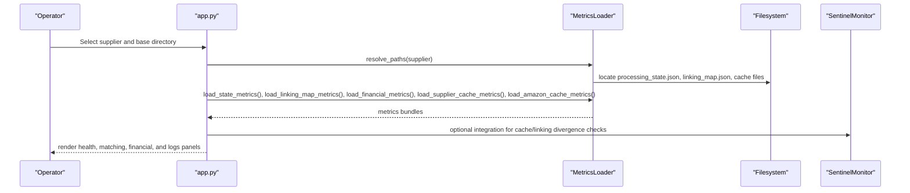
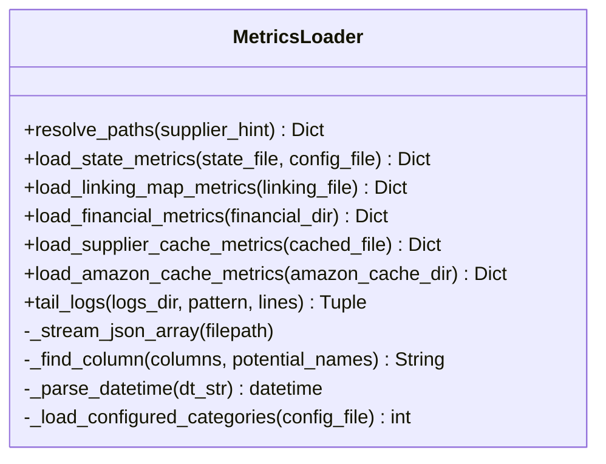
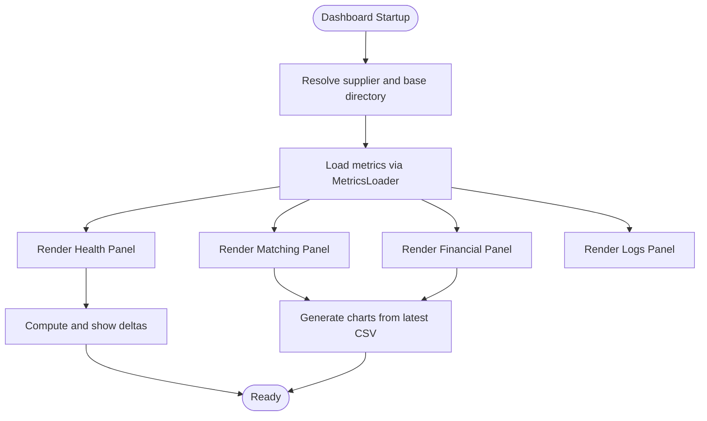
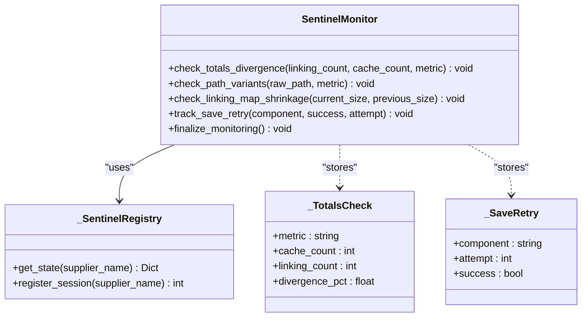
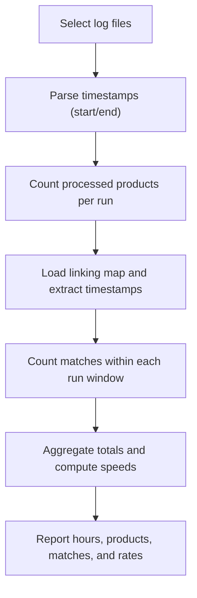
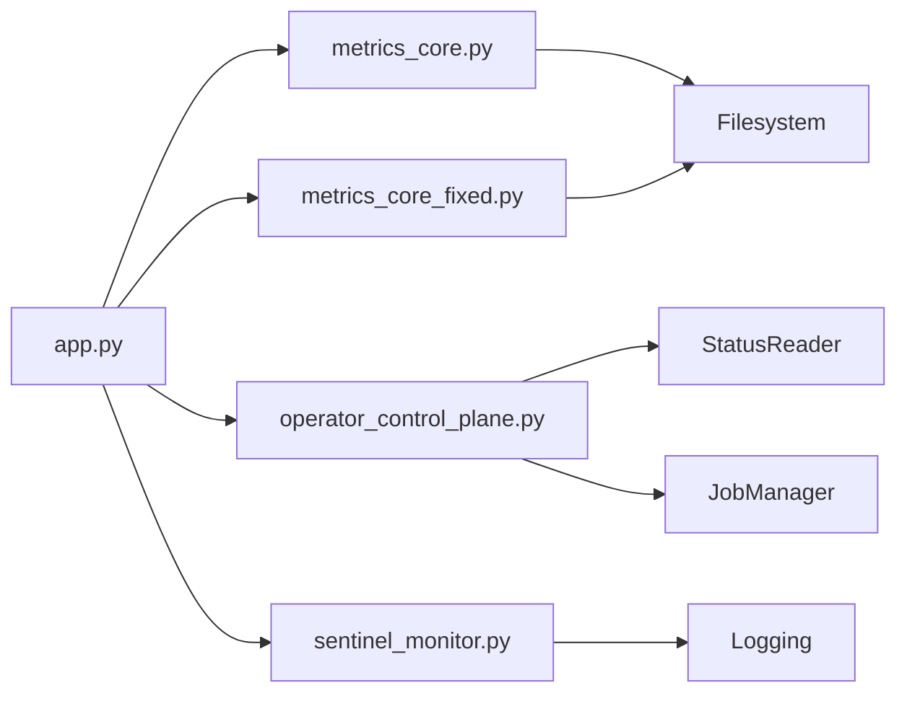

# Cache Metrics and Performance Monitoring

<cite>
**Referenced Files in This Document**
- [metrics_core.py](file://dashboard/metrics_core.py)
- [metrics_core_fixed.py](file://dashboard/metrics_core_fixed.py)
- [app.py](file://dashboard/app.py)
- [operator_control_plane.py](file://dashboard/operator_control_plane.py)
- [sentinel_monitor.py](file://utils/sentinel_monitor.py)
- [memory_store.py](file://src/fba_agent/memory_store.py)
- [calculate_historical_metrics.py](file://calculate_historical_metrics.py)
- [calculate_metrics_v2.py](file://calculate_metrics_v2.py)
- [Cache Persistence and Memory Management.md](file://WIKI REPO SEPT17/9. Caching And Deduplication/9.2. Cache Persistence And Memory Management.md)
</cite>

## Table of Contents
1. [Introduction](#introduction)
2. [Project Structure](#project-structure)
3. [Core Components](#core-components)
4. [Architecture Overview](#architecture-overview)
5. [Detailed Component Analysis](#detailed-component-analysis)
6. [Dependency Analysis](#dependency-analysis)
7. [Performance Considerations](#performance-considerations)
8. [Troubleshooting Guide](#troubleshooting-guide)
9. [Conclusion](#conclusion)

## Introduction
This document describes the Cache Metrics and Performance Monitoring subsystem that tracks cache-related performance, validates cache integrity, and supports operational decisions. It covers:
- Metrics collection for cache sizes, counts, and performance indicators
- Health checks for cache alignment with linking maps and system state
- Historical performance analysis and benchmarking
- Integration with cache clearing and maintenance strategies
- Interpretation guidelines, trend analysis, and capacity planning recommendations

## Project Structure
The subsystem spans three primary areas:
- Metrics loaders that read and compute cache and performance metrics from persisted artifacts
- A Streamlit dashboard that visualizes metrics and enables operator control
- A sentinel monitor that detects anomalies in cache/linking map consistency and persistence retries

**Diagram sources**
- [app.py](file://dashboard/app.py#L1-L595)
- [metrics_core.py](file://dashboard/metrics_core.py#L1-L615)
- [metrics_core_fixed.py](file://dashboard/metrics_core_fixed.py#L1-L554)
- [operator_control_plane.py](file://dashboard/operator_control_plane.py#L1-L174)
- [sentinel_monitor.py](file://utils/sentinel_monitor.py#L1-L201)
- [memory_store.py](file://src/fba_agent/memory_store.py#L1-L265)

**Section sources**
- [app.py](file://dashboard/app.py#L1-L595)
- [metrics_core.py](file://dashboard/metrics_core.py#L1-L615)
- [metrics_core_fixed.py](file://dashboard/metrics_core_fixed.py#L1-L554)
- [operator_control_plane.py](file://dashboard/operator_control_plane.py#L1-L174)
- [sentinel_monitor.py](file://utils/sentinel_monitor.py#L1-L201)
- [memory_store.py](file://src/fba_agent/memory_store.py#L1-L265)

## Core Components
- MetricsLoader (two variants): robust file I/O and metric computation for state, linking map, financial, and cache artifacts
- Dashboard rendering: health panels, matching stats, financial summaries, and live progress
- SentinelMonitor: anomaly detection for cache/linking map divergence, path variants, shrinking linking maps, and save retries
- Memory store utilities: supplier-specific paths and persistence helpers used by the broader system

Key capabilities:
- Supplier cache product counts and Amazon cache file counts/latest timestamps
- Linking map confidence distributions and match method counts
- Financial metrics aggregation and ROI/profitability insights
- Real-time deltas for live progress tracking
- Health assessment via observed vs configured categories and cache alignment checks

**Section sources**
- [metrics_core.py](file://dashboard/metrics_core.py#L15-L615)
- [metrics_core_fixed.py](file://dashboard/metrics_core_fixed.py#L15-L554)
- [app.py](file://dashboard/app.py#L115-L595)
- [sentinel_monitor.py](file://utils/sentinel_monitor.py#L63-L201)
- [memory_store.py](file://src/fba_agent/memory_store.py#L25-L143)

## Architecture Overview
The monitoring pipeline integrates file-based metrics collection, dashboard rendering, and runtime anomaly detection:

**Diagram sources**
- [app.py](file://dashboard/app.py#L38-L595)
- [metrics_core.py](file://dashboard/metrics_core.py#L34-L615)
- [metrics_core_fixed.py](file://dashboard/metrics_core_fixed.py#L34-L554)
- [sentinel_monitor.py](file://utils/sentinel_monitor.py#L79-L110)

## Detailed Component Analysis

### MetricsLoader and Metric Types
The loader reads and computes metrics from:
- Processing state: observed vs configured categories, current category URL, per-category progress, and timestamps
- Linking map: total matches, high-confidence rate, confidence and method distributions, and EAN coverage
- Financial reports: files scanned, rows processed, profitable product counts, average ROI, and total profit
- Supplier cache: product count from cached products file
- Amazon cache: file count and latest modification time

**Diagram sources**
- [metrics_core.py](file://dashboard/metrics_core.py#L15-L615)

Operational highlights:
- Robust JSON parsing supporting arrays, dicts, and JSONL formats
- Streaming and sampling strategies for large files
- Column detection heuristics for financial metrics
- Supplier name normalization across dotted, underscored, and hyphenated forms

**Section sources**
- [metrics_core.py](file://dashboard/metrics_core.py#L34-L615)
- [metrics_core_fixed.py](file://dashboard/metrics_core_fixed.py#L34-L554)

### Dashboard Rendering and Health Panels
The dashboard consolidates metrics into:
- Health panel: categories observed vs configured, current category context, processing status, and totals
- Matching panel: total matches, high-confidence rate, EAN coverage, and method distributions
- Financial panel: files scanned, rows, profitability, average ROI, and total profit
- Logs panel: tail of the latest run log
- Live progress: deltas for matches and cache files

**Diagram sources**
- [app.py](file://dashboard/app.py#L460-L595)

**Section sources**
- [app.py](file://dashboard/app.py#L115-L595)

### SentinelMonitor: Anomaly Detection and Recommendations
The sentinel monitor tracks:
- Totals divergence: compares linking map and cache counts and logs significant discrepancies
- Path variants: detects inconsistent path spellings for the same resource
- Linking map shrinkage: raises warnings when entries decrease unexpectedly
- Save retries: records persistence attempts for diagnostics

**Diagram sources**
- [sentinel_monitor.py](file://utils/sentinel_monitor.py#L19-L201)

Operational guidance:
- Use divergence thresholds to flag cache integrity issues
- Track shrink events to detect unexpected data loss
- Review save retry logs to identify persistence bottlenecks

**Section sources**
- [sentinel_monitor.py](file://utils/sentinel_monitor.py#L63-L192)

### Historical Metrics and Benchmarking
Historical analysis scripts enable:
- Duration and throughput calculations across runs
- Product and match counts aligned to timestamps
- Comparative analysis of performance windows

**Diagram sources**
- [calculate_historical_metrics.py](file://calculate_historical_metrics.py#L1-L69)
- [calculate_metrics_v2.py](file://calculate_metrics_v2.py#L1-L99)

**Section sources**
- [calculate_historical_metrics.py](file://calculate_historical_metrics.py#L1-L69)
- [calculate_metrics_v2.py](file://calculate_metrics_v2.py#L1-L99)

### Integration with Cache Management and Maintenance
- Memory store utilities define supplier-specific paths and persistence helpers used by the broader system
- The dashboard exposes supplier cache counts and Amazon cache metadata for operational oversight
- SentinelMonitor’s divergence and shrinkage checks inform maintenance decisions and alerting thresholds

**Section sources**
- [memory_store.py](file://src/fba_agent/memory_store.py#L25-L143)
- [app.py](file://dashboard/app.py#L186-L197)
- [sentinel_monitor.py](file://utils/sentinel_monitor.py#L79-L155)

## Dependency Analysis
The following diagram shows key dependencies among components:

**Diagram sources**
- [app.py](file://dashboard/app.py#L1-L595)
- [metrics_core.py](file://dashboard/metrics_core.py#L1-L615)
- [metrics_core_fixed.py](file://dashboard/metrics_core_fixed.py#L1-L554)
- [operator_control_plane.py](file://dashboard/operator_control_plane.py#L1-L174)
- [sentinel_monitor.py](file://utils/sentinel_monitor.py#L1-L201)

**Section sources**
- [app.py](file://dashboard/app.py#L1-L595)
- [metrics_core.py](file://dashboard/metrics_core.py#L1-L615)
- [metrics_core_fixed.py](file://dashboard/metrics_core_fixed.py#L1-L554)
- [operator_control_plane.py](file://dashboard/operator_control_plane.py#L1-L174)
- [sentinel_monitor.py](file://utils/sentinel_monitor.py#L1-L201)

## Performance Considerations
- Large file handling: streaming and sampling strategies prevent memory pressure when processing linking maps and financial reports
- Caching: dashboard-level caching avoids redundant loads when file modification times are unchanged
- Live progress: delta computations provide near-real-time feedback without heavy recomputation
- Path resolution: robust supplier name normalization reduces misconfiguration overhead

[No sources needed since this section provides general guidance]

## Troubleshooting Guide
Common scenarios and remedies:
- Missing state or linking files: verify supplier name normalization and directory layouts; the loader returns structured placeholders for missing artifacts
- Large linking maps: the fixed loader samples large files and marks sampled results to avoid timeouts
- Financial CSV parsing: column detection heuristics and size limits improve reliability; check notes for specific failures
- Cache divergence: use sentinel divergence logs to identify mismatched cache/linking map counts and investigate persistence or extraction issues
- Shrinkage warnings: unexpected reductions in linking map size suggest data loss; review save retry logs and persistence paths
- Logs tailing: for very large logs, the loader caps lines to maintain responsiveness

**Section sources**
- [metrics_core.py](file://dashboard/metrics_core.py#L234-L329)
- [metrics_core_fixed.py](file://dashboard/metrics_core_fixed.py#L163-L318)
- [sentinel_monitor.py](file://utils/sentinel_monitor.py#L134-L177)
- [app.py](file://dashboard/app.py#L425-L459)

## Conclusion
The Cache Metrics and Performance Monitoring subsystem provides:
- Comprehensive cache and performance metrics from persisted artifacts
- Real-time health assessments and anomaly detection
- Historical benchmarking and throughput analysis
- Practical integration points for maintenance and alerting

Adopt the recommended thresholds and interpretations to drive capacity planning, tune performance, and automate maintenance decisions based on cache usage patterns.