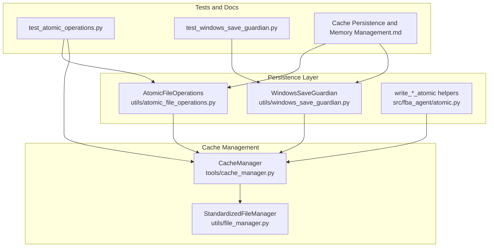
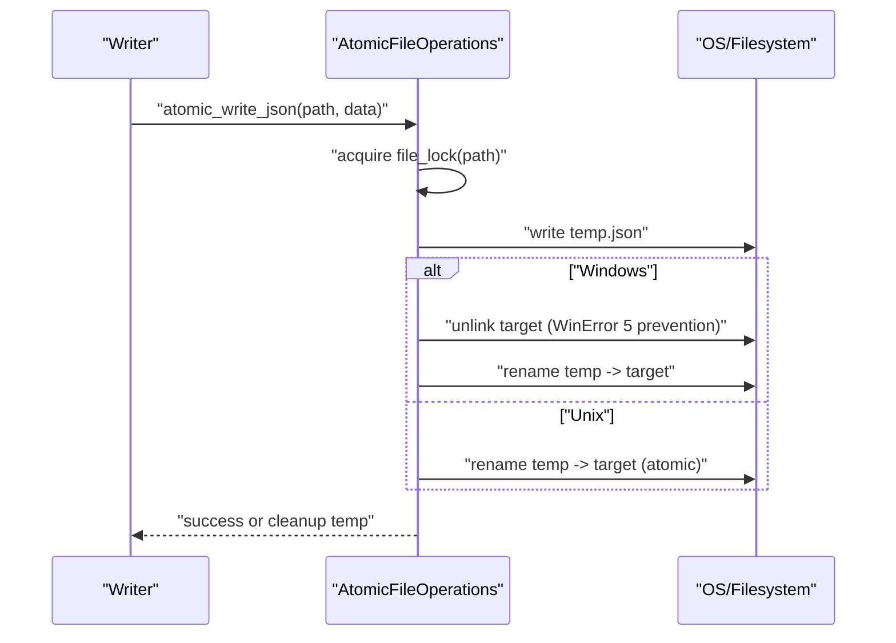
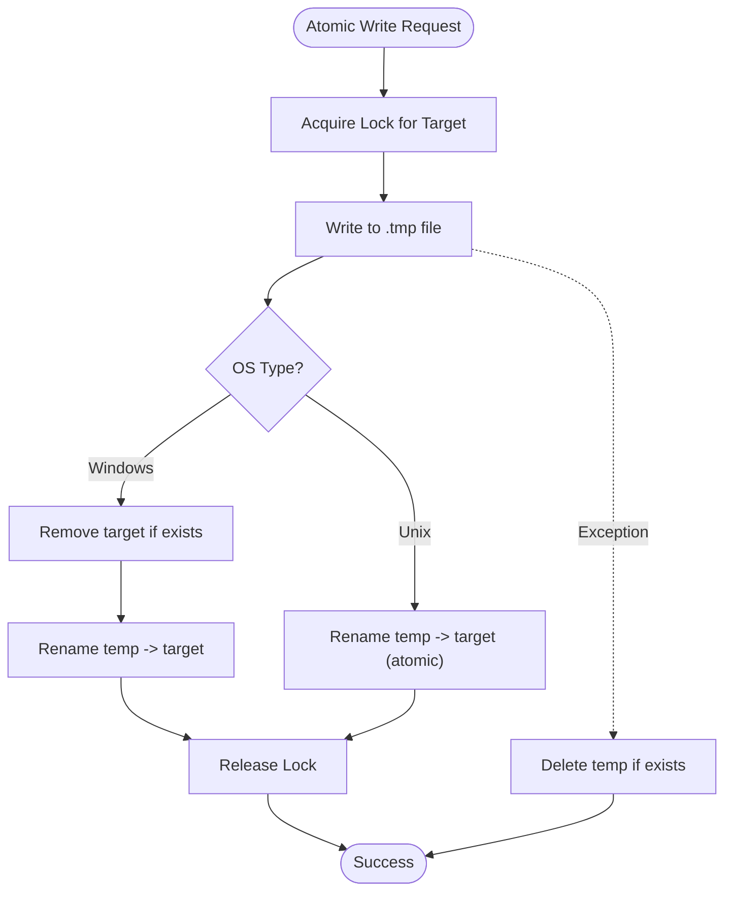
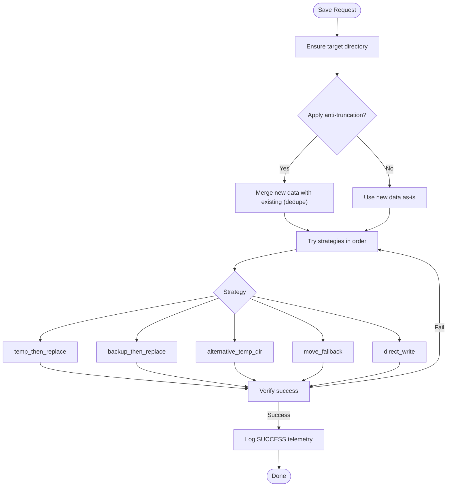
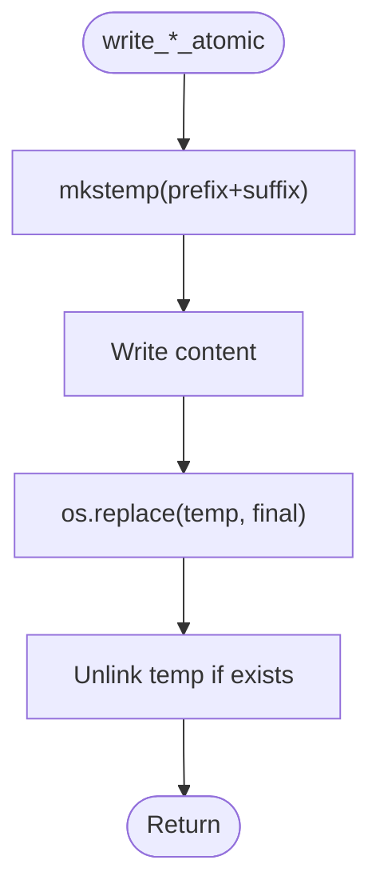
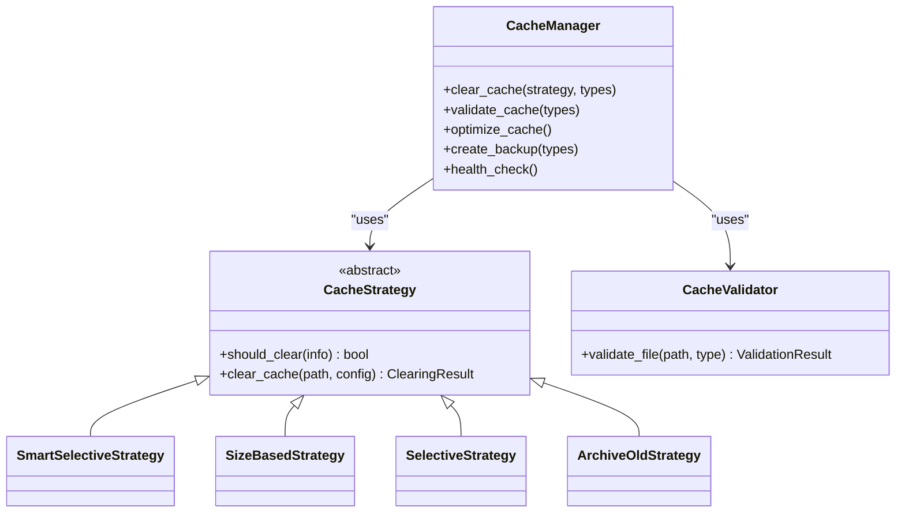
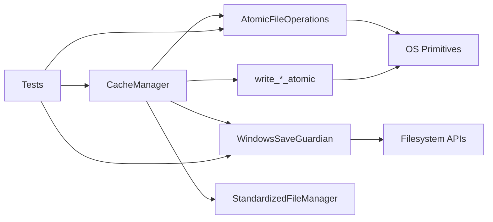

# Cache Persistence and Atomic Operations

<cite>
**Referenced Files in This Document**
- [atomic_file_operations.py](file://utils/atomic_file_operations.py)
- [windows_save_guardian.py](file://utils/windows_save_guardian.py)
- [atomic.py](file://src/fba_agent/atomic.py)
- [cache_manager.py](file://tools/cache_manager.py)
- [file_manager.py](file://utils/file_manager.py)
- [test_atomic_operations.py](file://tests/test_atomic_operations.py)
- [test_windows_save_guardian.py](file://diagnostics/audit_bundle_20250905_001040/windows_save_guardian.py)
- [Cache Persistence and Memory Management.md](file://wiki-dec-3/9. Caching And Deduplication/9.2. Cache Persistence And Memory Management.md)
</cite>

## Table of Contents
1. [Introduction](#introduction)
2. [Project Structure](#project-structure)
3. [Core Components](#core-components)
4. [Architecture Overview](#architecture-overview)
5. [Detailed Component Analysis](#detailed-component-analysis)
6. [Dependency Analysis](#dependency-analysis)
7. [Performance Considerations](#performance-considerations)
8. [Troubleshooting Guide](#troubleshooting-guide)
9. [Conclusion](#conclusion)

## Introduction
This document explains the Cache Persistence and Atomic Operations subsystem that ensures reliable, cross-platform cache storage with atomic file operations and Windows-specific safeguards. It covers:
- Atomic file operations via temporary file writing and atomic renames
- Cross-platform file locking and Windows-specific save guardian strategies
- Integration with the cache manager for safe data persistence
- Rollback mechanisms, concurrency protection, and error handling
- Performance characteristics, disk I/O optimization, and best practices

## Project Structure
The subsystem spans three primary modules:
- Atomic file operations for general-purpose, thread-safe JSON and text writes
- Windows Save Guardian for robust, multi-strategy atomic persistence on Windows
- Cache Manager for lifecycle management, validation, and maintenance of cache stores

**Diagram sources**
- [atomic_file_operations.py](file://utils/atomic_file_operations.py#L17-L154)
- [windows_save_guardian.py](file://utils/windows_save_guardian.py#L26-L512)
- [atomic.py](file://src/fba_agent/atomic.py#L10-L49)
- [cache_manager.py](file://tools/cache_manager.py#L1-L308)
- [file_manager.py](file://utils/file_manager.py#L14-L308)
- [test_atomic_operations.py](file://tests/test_atomic_operations.py#L19-L272)
- [test_windows_save_guardian.py](file://diagnostics/audit_bundle_20250905_001040/windows_save_guardian.py#L515-L609)
- [Cache Persistence and Memory Management.md](file://wiki-dec-3/9. Caching And Deduplication/9.2. Cache Persistence And Memory Management.md#L76-L100)

**Section sources**
- [atomic_file_operations.py](file://utils/atomic_file_operations.py#L17-L154)
- [windows_save_guardian.py](file://utils/windows_save_guardian.py#L26-L512)
- [atomic.py](file://src/fba_agent/atomic.py#L10-L49)
- [cache_manager.py](file://tools/cache_manager.py#L1-L308)
- [file_manager.py](file://utils/file_manager.py#L14-L308)
- [test_atomic_operations.py](file://tests/test_atomic_operations.py#L19-L272)
- [test_windows_save_guardian.py](file://diagnostics/audit_bundle_20250905_001040/windows_save_guardian.py#L515-L609)
- [Cache Persistence and Memory Management.md](file://wiki-dec-3/9. Caching And Deduplication/9.2. Cache Persistence And Memory Management.md#L76-L100)

## Core Components
- AtomicFileOperations: Thread-safe, cross-platform atomic JSON/text writes with file locking and integrity validation.
- WindowsSaveGuardian: Multi-strategy, Windows-focused atomic persistence with telemetry, anti-truncation guard, and fallbacks.
- write_*_atomic helpers: Minimal, POSIX-friendly atomic writers for text, JSON, and binary data.
- CacheManager: Centralized cache lifecycle management, validation, clearing strategies, and maintenance.
- StandardizedFileManager: Consistent file naming and directory layout for cache artifacts.

Key capabilities:
- Atomic writes via temp file + atomic rename (with Windows-specific removal-before-rename)
- File locking for concurrency control
- Backup and rollback strategies
- Anti-truncation guard for large dataset merges
- Telemetry and logging for diagnostics
- Cache health validation and automated maintenance

**Section sources**
- [atomic_file_operations.py](file://utils/atomic_file_operations.py#L17-L154)
- [windows_save_guardian.py](file://utils/windows_save_guardian.py#L26-L512)
- [atomic.py](file://src/fba_agent/atomic.py#L10-L49)
- [cache_manager.py](file://tools/cache_manager.py#L1-L308)
- [file_manager.py](file://utils/file_manager.py#L14-L308)

## Architecture Overview
The subsystem integrates atomic write primitives with cache lifecycle management and Windows-specific safeguards. Writers stage data to a temporary file, then atomically replace the target. On Windows, the implementation removes the target first to avoid WinError 5. The CacheManager orchestrates validation, clearing, and maintenance, while StandardizedFileManager provides consistent paths.

**Diagram sources**
- [atomic_file_operations.py](file://utils/atomic_file_operations.py#L58-L93)

**Section sources**
- [atomic_file_operations.py](file://utils/atomic_file_operations.py#L58-L93)
- [atomic.py](file://src/fba_agent/atomic.py#L10-L49)

## Detailed Component Analysis

### AtomicFileOperations
- Purpose: Provide thread-safe, cross-platform atomic JSON/text/binary writes with file locking and integrity checks.
- Key features:
  - Cross-platform file locking (Windows via msvcrt, Unix via fcntl)
  - Atomic write pattern: temp file → atomic rename (Windows: remove target first)
  - JSON read/write helpers with validation
  - Append-to-array with atomic semantics
  - Safe backup creation and JSON integrity validation

**Diagram sources**
- [atomic_file_operations.py](file://utils/atomic_file_operations.py#L58-L93)

**Section sources**
- [atomic_file_operations.py](file://utils/atomic_file_operations.py#L17-L154)

### WindowsSaveGuardian
- Purpose: Robust, multi-strategy atomic persistence on Windows with telemetry and anti-truncation guard.
- Strategies (in order):
  - temp_then_replace: Temp file + atomic replace with retries/backoff
  - backup_then_replace: Timestamped backup, temp write, atomic replace, rollback on failure
  - alternative_temp_dir: Write to alternate temp directory, copy to target
  - move_fallback: Non-atomic move as last resort (telemetry warning)
  - direct_write: Last-resort direct write (non-atomic)
- Anti-truncation guard: Detects small new data appended to large existing files and merges/deduplicates intelligently.
- Telemetry: Logs strategy outcomes, execution times, and file sizes.

**Diagram sources**
- [windows_save_guardian.py](file://utils/windows_save_guardian.py#L86-L182)
- [windows_save_guardian.py](file://utils/windows_save_guardian.py#L266-L479)

**Section sources**
- [windows_save_guardian.py](file://utils/windows_save_guardian.py#L26-L512)

### write_*_atomic Helpers
- Purpose: Lightweight, POSIX-friendly atomic writers for text, JSON, and binary data.
- Pattern: mkstemp in same directory → write → atomic replace → cleanup temp.

**Diagram sources**
- [atomic.py](file://src/fba_agent/atomic.py#L15-L49)

**Section sources**
- [atomic.py](file://src/fba_agent/atomic.py#L10-L49)

### CacheManager Integration
- Orchestrates cache lifecycle: validation, clearing, optimization, backups, health checks.
- Integrates with atomic operations for safe writes and with StandardizedFileManager for consistent paths.
- Strategies:
  - SmartSelectiveStrategy: Clear processed items using linking map
  - SizeBasedStrategy: LRU eviction by access time
  - SelectiveStrategy: TTL-based clearing
  - ArchiveOldStrategy: Preserve long-lived data by archiving

**Diagram sources**
- [cache_manager.py](file://tools/cache_manager.py#L1-L308)

**Section sources**
- [cache_manager.py](file://tools/cache_manager.py#L1-L308)

### StandardizedFileManager
- Provides consistent file naming and directory layout for cache artifacts.
- Generates standardized filenames and resolves full paths for cache types.

**Section sources**
- [file_manager.py](file://utils/file_manager.py#L14-L308)

### Tests and Validation
- Unit tests validate atomic write/read correctness, concurrency safety, and JSON integrity.
- Windows Save Guardian includes a comprehensive test suite covering all strategies and edge cases.

**Section sources**
- [test_atomic_operations.py](file://tests/test_atomic_operations.py#L19-L272)
- [test_windows_save_guardian.py](file://diagnostics/audit_bundle_20250905_001040/windows_save_guardian.py#L515-L609)

## Dependency Analysis
- AtomicFileOperations depends on platform primitives (fcntl/msvcrt) and uses temporary files for atomicity.
- WindowsSaveGuardian depends on filesystem APIs and implements multiple fallbacks to handle Windows-specific failures.
- write_*_atomic helpers depend on POSIX atomic replace semantics.
- CacheManager coordinates persistence and lifecycle management, invoking atomic operations and relying on StandardizedFileManager for paths.
- Tests validate both atomic primitives and Windows-specific resilience.

**Diagram sources**
- [atomic_file_operations.py](file://utils/atomic_file_operations.py#L17-L154)
- [windows_save_guardian.py](file://utils/windows_save_guardian.py#L26-L512)
- [atomic.py](file://src/fba_agent/atomic.py#L10-L49)
- [cache_manager.py](file://tools/cache_manager.py#L1-L308)
- [file_manager.py](file://utils/file_manager.py#L14-L308)
- [test_atomic_operations.py](file://tests/test_atomic_operations.py#L19-L272)

**Section sources**
- [atomic_file_operations.py](file://utils/atomic_file_operations.py#L17-L154)
- [windows_save_guardian.py](file://utils/windows_save_guardian.py#L26-L512)
- [atomic.py](file://src/fba_agent/atomic.py#L10-L49)
- [cache_manager.py](file://tools/cache_manager.py#L1-L308)
- [file_manager.py](file://utils/file_manager.py#L14-L308)
- [test_atomic_operations.py](file://tests/test_atomic_operations.py#L19-L272)

## Performance Considerations
- Atomic rename minimizes metadata churn and avoids partial reads.
- Cross-platform file locking prevents contention; tune timeouts for heavy concurrency.
- WindowsSaveGuardian’s exponential backoff reduces contention spikes.
- CacheManager’s validation and clearing run asynchronously to minimize impact.
- Compression of old cache files reduces disk usage and I/O overhead.
- Prefer batched writes and merges to reduce the number of atomic operations.

Best practices:
- Use AtomicFileOperations for frequent small writes requiring integrity guarantees.
- Use WindowsSaveGuardian for critical Windows-dependent saves with telemetry.
- Employ CacheManager strategies to keep caches healthy and compact.
- Monitor telemetry logs to identify hotspots and adjust retry/backoff parameters.

[No sources needed since this section provides general guidance]

## Troubleshooting Guide
Common issues and resolutions:
- WinError 5 on Windows: Use WindowsSaveGuardian strategies; it removes targets before rename and retries with backoff.
- Partial writes or corruption: AtomicFileOperations cleans up temp files on exceptions; validate JSON integrity post-write.
- Concurrency conflicts: Ensure file locks are held during read/write; AtomicFileOperations manages locks automatically.
- Truncated files when appending small data to large files: Enable anti-truncation guard to merge and deduplicate.
- Recovery after failed writes: Use backup_then_replace strategy or restore from timestamped backups created by WindowsSaveGuardian.
- Diagnosing failures: Review telemetry logs for strategy outcomes and execution times.

Operational tips:
- Validate cache health regularly using CacheManager’s validator.
- Monitor system resources (CPU, memory, disk) via CacheManager’s health checks.
- Use StandardizedFileManager to ensure consistent paths and naming.

**Section sources**
- [windows_save_guardian.py](file://utils/windows_save_guardian.py#L86-L182)
- [atomic_file_operations.py](file://utils/atomic_file_operations.py#L84-L92)
- [cache_manager.py](file://tools/cache_manager.py#L1-L308)

## Conclusion
The Cache Persistence and Atomic Operations subsystem provides robust, cross-platform cache storage with atomic file operations, concurrency protection, and Windows-specific safeguards. By combining AtomicFileOperations, WindowsSaveGuardian, and CacheManager, the system ensures data integrity, recoverability, and maintainability across diverse environments. Adopt the recommended patterns and strategies to achieve reliable, high-performance cache persistence.