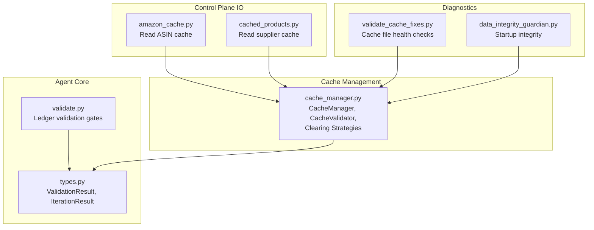
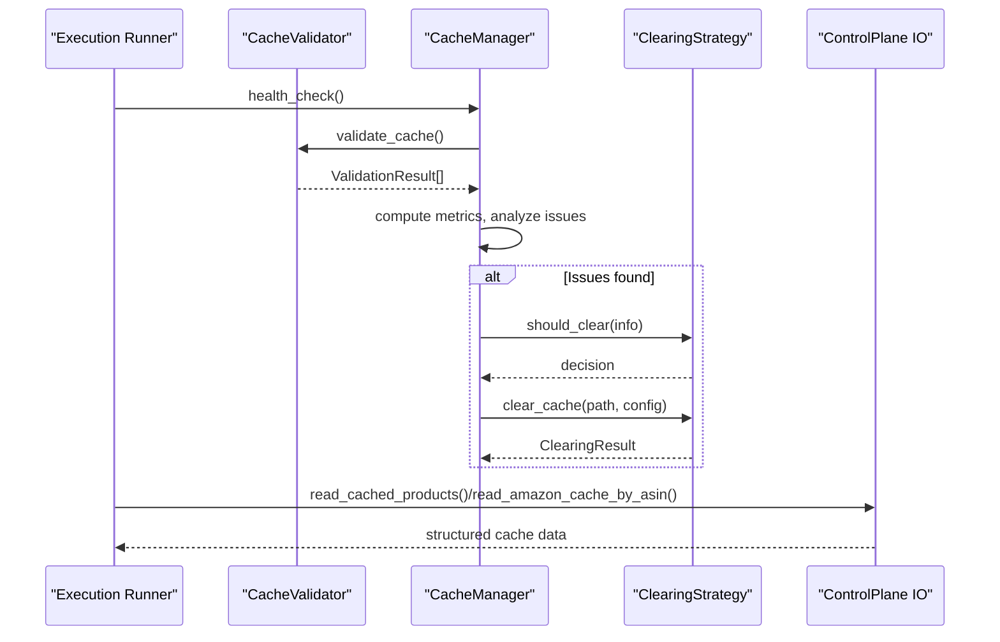
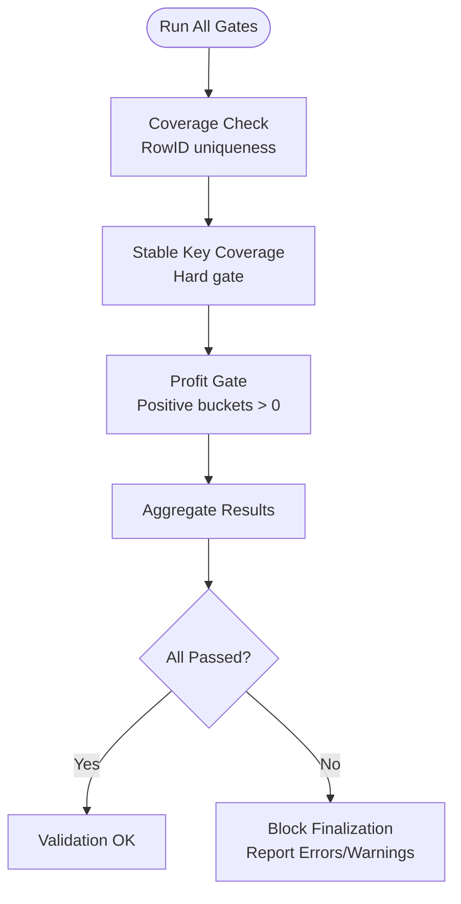
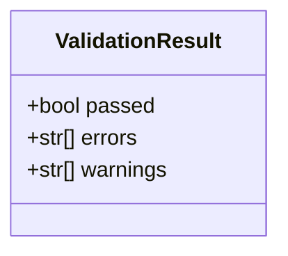
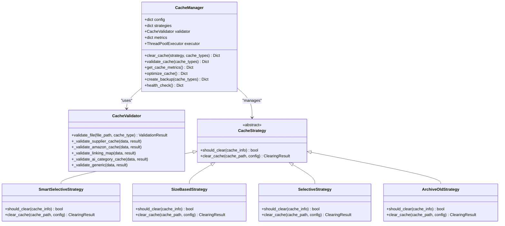
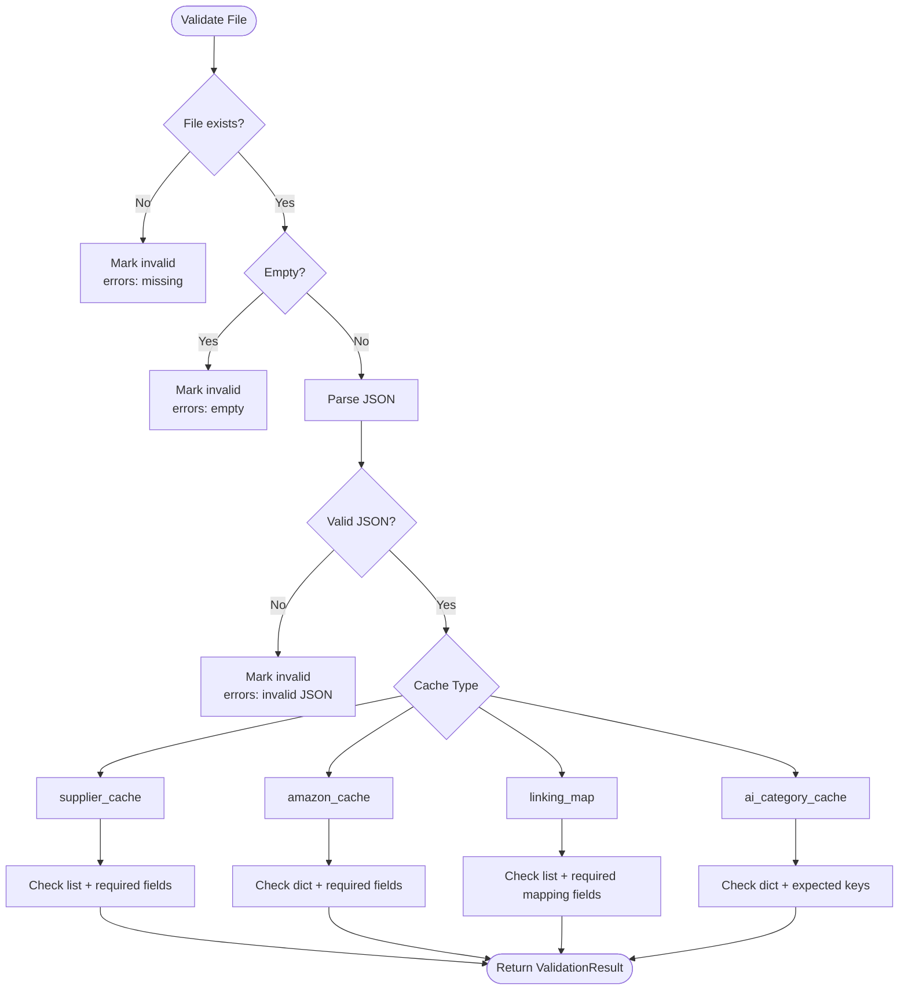
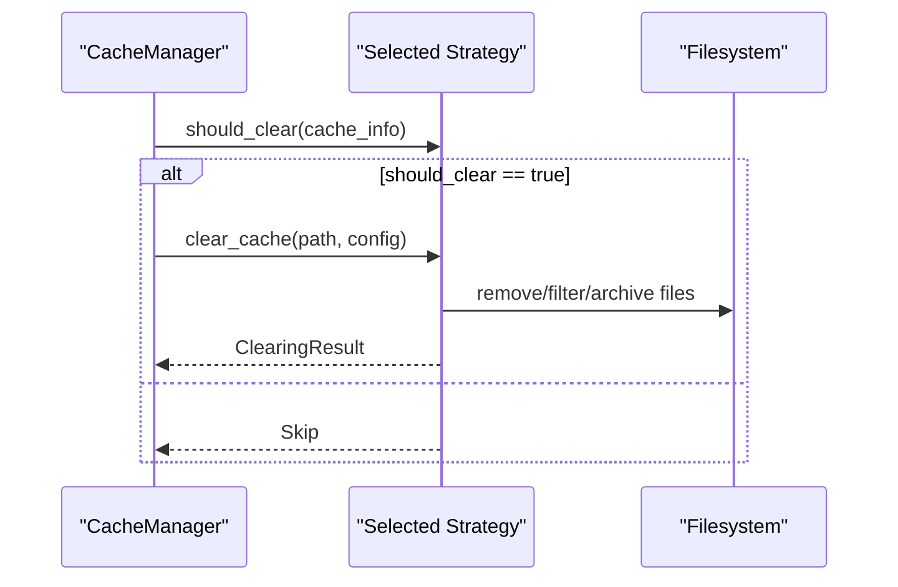
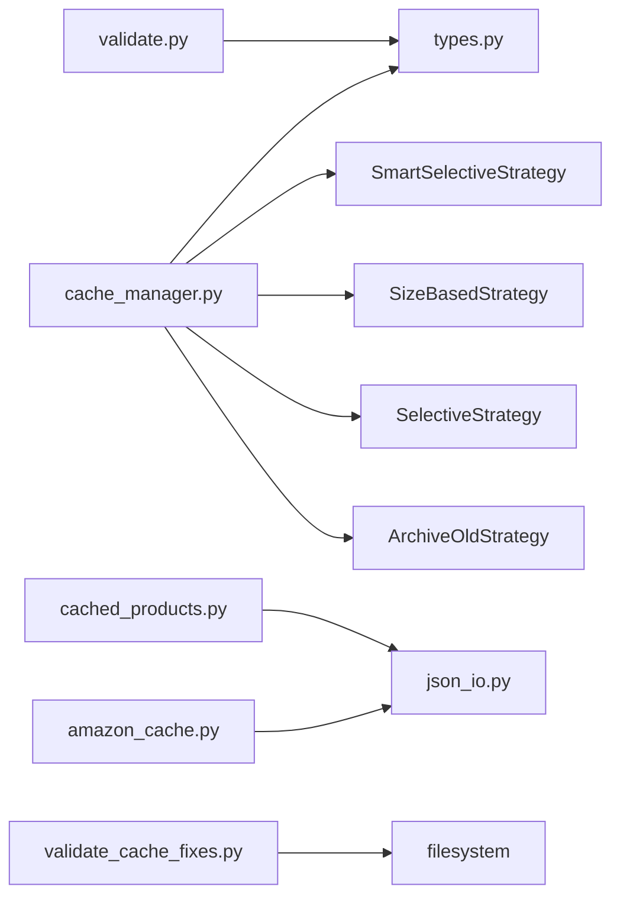

# Cache Validation and Integrity

<cite>
**Referenced Files in This Document**
- [validate.py](file://src/fba_agent/validate.py)
- [types.py](file://src/fba_agent/types.py)
- [cache_manager.py](file://tools/cache_manager.py)
- [amazon_cache.py](file://control_plane/tools/amazon_cache.py)
- [cached_products.py](file://control_plane/tools/cached_products.py)
- [validate_cache_fixes.py](file://validate_cache_fixes.py)
- [data_integrity_guardian.py](file://utils/data_integrity_guardian.py)
</cite>

## Table of Contents
1. [Introduction](#introduction)
2. [Project Structure](#project-structure)
3. [Core Components](#core-components)
4. [Architecture Overview](#architecture-overview)
5. [Detailed Component Analysis](#detailed-component-analysis)
6. [Dependency Analysis](#dependency-analysis)
7. [Performance Considerations](#performance-considerations)
8. [Troubleshooting Guide](#troubleshooting-guide)
9. [Conclusion](#conclusion)

## Introduction
This document describes the Cache Validation and Integrity subsystem that ensures correctness, completeness, and resilience of cached data across the Amazon FBA Agent System. It covers:
- JSON structure validation and schema-specific validation for different cache types
- Corruption detection mechanisms
- The ValidationResult data structure and error/warning reporting
- Validation workflows, error handling patterns, and repair recommendations
- Integration with cache clearing strategies for automatic cleanup of invalid data
- Validation scheduling and health monitoring
- Performance optimization, batch validation techniques, and best practices for maintaining cache integrity across large datasets

## Project Structure
The subsystem spans several modules:
- Validation logic for ledger-level checks resides in the agent core
- A comprehensive cache manager provides schema-aware validation, clearing strategies, and health monitoring
- Control plane tools read and query cache artifacts
- Diagnostic scripts validate cache files and incremental metadata
- A data integrity guardian enforces mandatory startup reconciliation

**Diagram sources**
- [validate.py](file://src/fba_agent/validate.py#L1-L123)
- [types.py](file://src/fba_agent/types.py#L107-L112)
- [cache_manager.py](file://tools/cache_manager.py#L1-L1)
- [amazon_cache.py](file://control_plane/tools/amazon_cache.py#L1-L28)
- [cached_products.py](file://control_plane/tools/cached_products.py#L1-L96)
- [validate_cache_fixes.py](file://validate_cache_fixes.py#L1-L203)
- [data_integrity_guardian.py](file://utils/data_integrity_guardian.py#L1-L6)

**Section sources**
- [validate.py](file://src/fba_agent/validate.py#L1-L123)
- [types.py](file://src/fba_agent/types.py#L107-L112)
- [cache_manager.py](file://tools/cache_manager.py#L1-L1)
- [amazon_cache.py](file://control_plane/tools/amazon_cache.py#L1-L28)
- [cached_products.py](file://control_plane/tools/cached_products.py#L1-L96)
- [validate_cache_fixes.py](file://validate_cache_fixes.py#L1-L203)
- [data_integrity_guardian.py](file://utils/data_integrity_guardian.py#L1-L6)

## Core Components
- Ledger validation gates: coverage checks for RowID and stable_key, profit gate for positive buckets
- ValidationResult data structure: standardized reporting of pass/fail with errors and warnings
- CacheManager: orchestrates validation, clearing, metrics, optimization, backups, and health checks
- CacheValidator: schema-specific validators for supplier_cache, amazon_cache, linking_map, ai_category_cache
- Clearing strategies: smart selective, size-based LRU, selective TTL, and archive old
- Control plane cache readers: supplier product cache and Amazon ASIN cache accessors
- Diagnostic cache health checker: validates cache files, metadata presence, and atomic write behavior
- Data integrity guardian: mandatory startup reconciliation and consistency enforcement

**Section sources**
- [validate.py](file://src/fba_agent/validate.py#L8-L123)
- [types.py](file://src/fba_agent/types.py#L107-L112)
- [cache_manager.py](file://tools/cache_manager.py#L1-L1)
- [amazon_cache.py](file://control_plane/tools/amazon_cache.py#L1-L28)
- [cached_products.py](file://control_plane/tools/cached_products.py#L1-L96)
- [validate_cache_fixes.py](file://validate_cache_fixes.py#L1-L203)
- [data_integrity_guardian.py](file://utils/data_integrity_guardian.py#L1-L6)

## Architecture Overview
The subsystem integrates validation and integrity checks across three layers:
- Validation Layer: ledger-level checks and schema-specific cache validation
- Management Layer: cache lifecycle orchestration, clearing, and health monitoring
- IO Layer: controlled access to cached artifacts

**Diagram sources**
- [cache_manager.py](file://tools/cache_manager.py#L1-L1)
- [validate.py](file://src/fba_agent/validate.py#L94-L123)
- [cached_products.py](file://control_plane/tools/cached_products.py#L37-L96)
- [amazon_cache.py](file://control_plane/tools/amazon_cache.py#L13-L27)

## Detailed Component Analysis

### Ledger Validation Gates
Ledger-level validation ensures:
- Coverage: every RowID from original data appears exactly once in the ledger
- Stable key coverage: every stable_key appears exactly once (hard gate)
- Profit gate: positive buckets must have adjusted_profit > 0

These gates act as hard gates blocking finalization when violated.

**Diagram sources**
- [validate.py](file://src/fba_agent/validate.py#L8-L123)

**Section sources**
- [validate.py](file://src/fba_agent/validate.py#L8-L123)

### ValidationResult Data Structure
ValidationResult captures:
- passed: boolean outcome
- errors: list of error messages
- warnings: list of warning messages

It is used consistently across ledger validation and cache validation.

**Diagram sources**
- [types.py](file://src/fba_agent/types.py#L107-L112)

**Section sources**
- [types.py](file://src/fba_agent/types.py#L107-L112)

### CacheManager Orchestration
CacheManager coordinates:
- Validation: per-cache-type schema validation across directories
- Clearing: multiple strategies (smart selective, size-based, selective TTL, archive old)
- Metrics: file counts, sizes, hit rates, corruption counts
- Optimization: compression of old files
- Backups: snapshot backups of cache directories
- Health checks: overall status, recommendations, system resource checks

**Diagram sources**
- [cache_manager.py](file://tools/cache_manager.py#L1-L1)

**Section sources**
- [cache_manager.py](file://tools/cache_manager.py#L1-L1)

### Schema-Specific Validation for Cache Types
CacheValidator applies schema-specific checks:
- supplier_cache: expects list with required fields in items
- amazon_cache: expects dict with required fields
- linking_map: expects list with required mapping fields
- ai_category_cache: expects dict with expected keys

Warnings are raised for missing optional fields/keys; errors mark structural mismatches.

**Diagram sources**
- [cache_manager.py](file://tools/cache_manager.py#L1-L1)

**Section sources**
- [cache_manager.py](file://tools/cache_manager.py#L1-L1)

### Clearing Strategies and Automatic Cleanup
Strategies determine when and how to clear caches:
- SmartSelectiveStrategy: clears processed items using linking_map and stale thresholds
- SizeBasedStrategy: LRU eviction when exceeding size limits
- SelectiveStrategy: clears expired files based on TTL
- ArchiveOldStrategy: moves old files to archives instead of deletion

**Diagram sources**
- [cache_manager.py](file://tools/cache_manager.py#L1-L1)

**Section sources**
- [cache_manager.py](file://tools/cache_manager.py#L1-L1)

### Control Plane Cache Readers
- read_cached_products: resolves supplier cache path variants and filters by EAN/URL/title
- read_amazon_cache_by_asin: finds Amazon cache files by ASIN globbing and reads JSON safely

These readers encapsulate cache discovery and safe parsing.

**Section sources**
- [cached_products.py](file://control_plane/tools/cached_products.py#L1-L96)
- [amazon_cache.py](file://control_plane/tools/amazon_cache.py#L1-L28)

### Diagnostic Cache Health Checks
validate_cache_fixes.py performs:
- File existence, size, age, and entry count checks
- Metadata presence verification for incremental cache updates
- Atomic write simulation to confirm safe persistence patterns

**Section sources**
- [validate_cache_fixes.py](file://validate_cache_fixes.py#L1-L203)

### Data Integrity Guardian
The data integrity guardian enforces mandatory startup reconciliation and consistency checks before resume calculations and filtering operations.

**Section sources**
- [data_integrity_guardian.py](file://utils/data_integrity_guardian.py#L1-L6)

## Dependency Analysis
Key dependencies and relationships:
- validate.py depends on types.py for ValidationResult
- CacheManager composes CacheValidator and multiple CacheStrategy implementations
- Control plane tools depend on JSON IO utilities and normalization helpers
- Diagnostic scripts rely on filesystem and JSON parsing

**Diagram sources**
- [validate.py](file://src/fba_agent/validate.py#L1-L123)
- [types.py](file://src/fba_agent/types.py#L107-L112)
- [cache_manager.py](file://tools/cache_manager.py#L1-L1)
- [cached_products.py](file://control_plane/tools/cached_products.py#L1-L96)
- [amazon_cache.py](file://control_plane/tools/amazon_cache.py#L1-L28)
- [validate_cache_fixes.py](file://validate_cache_fixes.py#L1-L203)

**Section sources**
- [validate.py](file://src/fba_agent/validate.py#L1-L123)
- [types.py](file://src/fba_agent/types.py#L107-L112)
- [cache_manager.py](file://tools/cache_manager.py#L1-L1)
- [cached_products.py](file://control_plane/tools/cached_products.py#L1-L96)
- [amazon_cache.py](file://control_plane/tools/amazon_cache.py#L1-L28)
- [validate_cache_fixes.py](file://validate_cache_fixes.py#L1-L203)

## Performance Considerations
- Batch validation: CacheManager validates entire directories of JSON files concurrently by iterating globs and invoking schema-specific validators
- Compression optimization: Old cache files are compressed to reduce disk usage
- LRU eviction: SizeBasedStrategy removes least-recently accessed files to maintain size budgets
- Selective clearing: SmartSelectiveStrategy avoids full rebuilds by filtering processed items using linking_map identifiers
- Concurrency: ThreadPoolExecutor supports parallel operations for metrics and backups
- Early exits: Validation stops at first fatal structural mismatch; warnings collect non-blocking issues

[No sources needed since this section provides general guidance]

## Troubleshooting Guide
Common scenarios and remediation steps:
- Corrupted cache files: Use CacheManager.validate_cache to identify invalid files; leverage ClearingResult errors to pinpoint failures; run health_check for recommendations
- Missing incremental metadata: validate_cache_fixes.py detects absence of metadata; simulate cache update test to verify atomic write behavior
- Excessive cache size: Enable SizeBasedStrategy to evict old files; adjust max_size_mb in configuration
- Stale caches: Use SelectiveStrategy with appropriate TTL; monitor age_hours via health_check
- Startup integrity failures: Ensure data_integrity_guardian runs before resume calculations and filtering

Concrete references:
- Validation and clearing orchestration: [cache_manager.py](file://tools/cache_manager.py#L1-L1)
- Ledger-level validation: [validate.py](file://src/fba_agent/validate.py#L94-L123)
- Cache file health checks: [validate_cache_fixes.py](file://validate_cache_fixes.py#L1-L203)
- Data integrity guardian: [data_integrity_guardian.py](file://utils/data_integrity_guardian.py#L1-L6)

**Section sources**
- [cache_manager.py](file://tools/cache_manager.py#L1-L1)
- [validate.py](file://src/fba_agent/validate.py#L94-L123)
- [validate_cache_fixes.py](file://validate_cache_fixes.py#L1-L203)
- [data_integrity_guardian.py](file://utils/data_integrity_guardian.py#L1-L6)

## Conclusion
The Cache Validation and Integrity subsystem provides a robust framework for ensuring cache correctness and resilience:
- Structured validation via ledger gates and schema-specific cache validators
- Comprehensive clearing strategies tailored to different cache lifecycles
- Health monitoring and automated recommendations
- Practical diagnostic tools for cache integrity and incremental update verification
- Integration with control plane IO for safe cache access

By combining these capabilities, the system maintains high data quality across large datasets while optimizing performance and enabling reliable recovery from corruption.