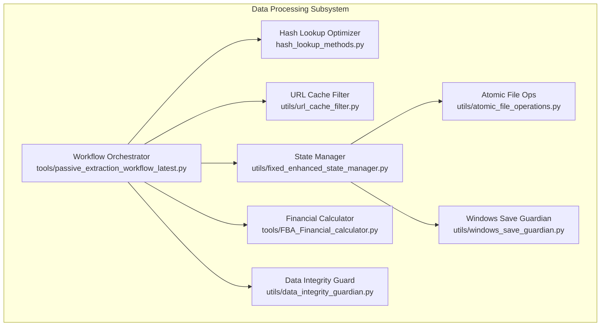
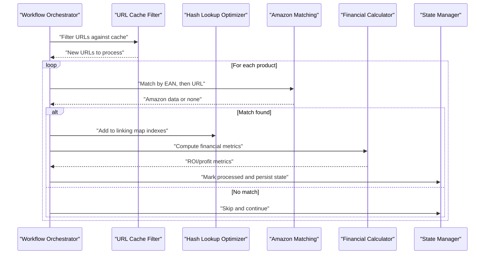
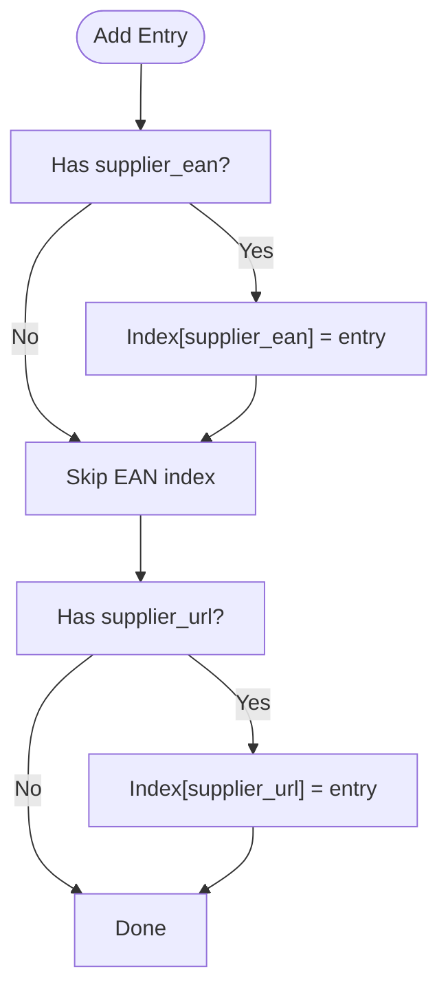
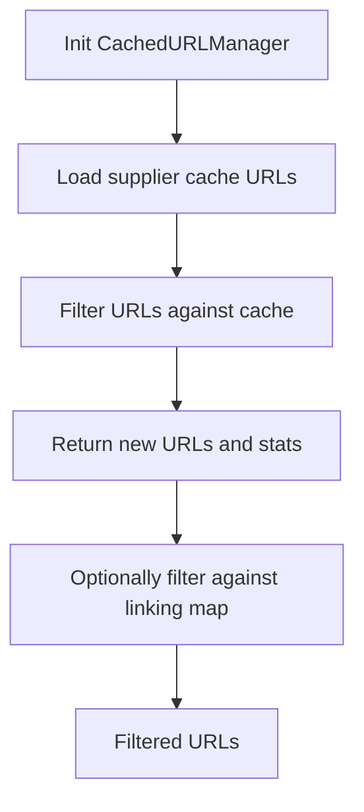
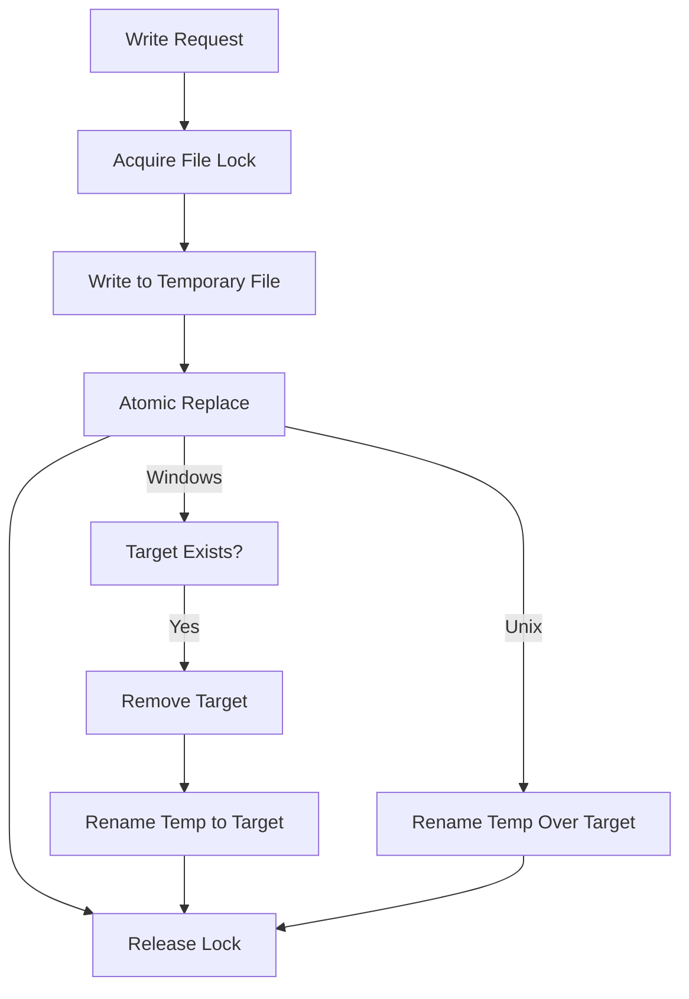
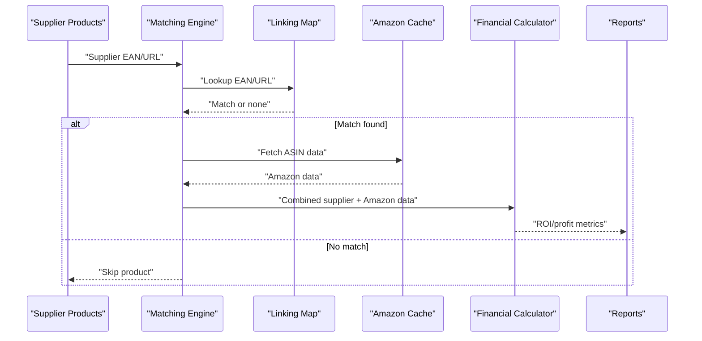
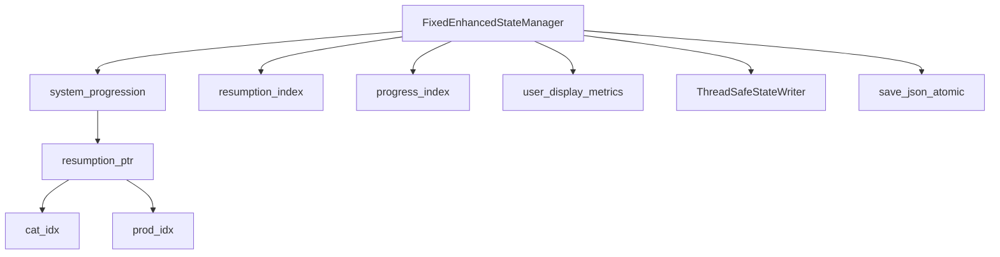
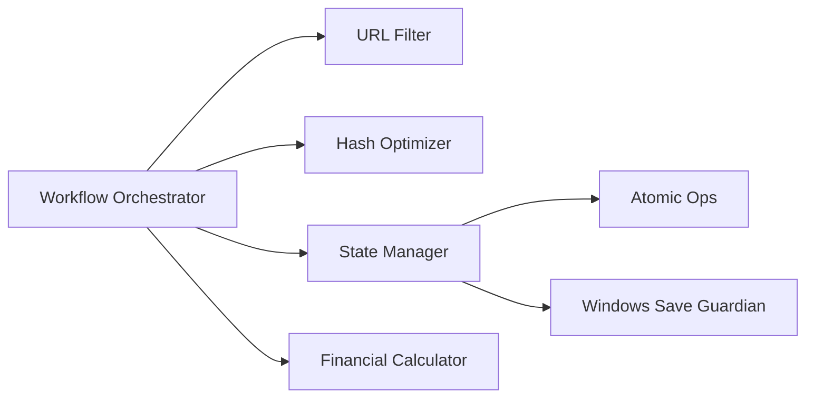

# Data Processing

<cite>
**Referenced Files in This Document**
- [hash_lookup_methods.py](file://hash_lookup_methods.py)
- [url_cache_filter.py](file://utils/url_cache_filter.py)
- [fixed_enhanced_state_manager.py](file://utils/fixed_enhanced_state_manager.py)
- [atomic_file_operations.py](file://utils/atomic_file_operations.py)
- [windows_save_guardian.py](file://utils/windows_save_guardian.py)
- [FBA_Financial_calculator.py](file://tools/FBA_Financial_calculator.py)
- [passive_extraction_workflow_latest.py](file://tools/passive_extraction_workflow_latest.py)
- [data_integrity_guardian.py](file://utils/data_integrity_guardian.py)
</cite>

## Table of Contents
1. [Introduction](#introduction)
2. [Project Structure](#project-structure)
3. [Core Components](#core-components)
4. [Architecture Overview](#architecture-overview)
5. [Detailed Component Analysis](#detailed-component-analysis)
6. [Dependency Analysis](#dependency-analysis)
7. [Performance Considerations](#performance-considerations)
8. [Troubleshooting Guide](#troubleshooting-guide)
9. [Conclusion](#conclusion)

## Introduction
This document describes the Data Processing subsystem with a focus on:
- Hash-based lookup optimization for O(1) performance in product matching and deduplication
- URL filtering mechanisms for cache management and duplicate prevention across suppliers and categories
- Cache persistence strategies using atomic file operations and batched saving patterns
- The data transformation pipeline from supplier product extraction through Amazon matching to financial analysis results
- Architectural patterns for memory optimization, concurrent processing, and data integrity guarantees
- Integration with the state management system for progress tracking and resumption capability

## Project Structure
The Data Processing subsystem spans several modules:
- Hash-based lookup and linking map indexing
- URL cache filtering and pre-processing
- State management and atomic persistence
- Financial analysis integration
- Workflow orchestration and batched processing

**Diagram sources**
- [hash_lookup_methods.py](file://hash_lookup_methods.py#L1-L45)
- [url_cache_filter.py](file://utils/url_cache_filter.py#L1-L272)
- [fixed_enhanced_state_manager.py](file://utils/fixed_enhanced_state_manager.py#L1-L200)
- [atomic_file_operations.py](file://utils/atomic_file_operations.py#L1-L189)
- [windows_save_guardian.py](file://utils/windows_save_guardian.py#L1-L480)
- [FBA_Financial_calculator.py](file://tools/FBA_Financial_calculator.py#L1-L200)
- [passive_extraction_workflow_latest.py](file://tools/passive_extraction_workflow_latest.py#L1-L200)
- [data_integrity_guardian.py](file://utils/data_integrity_guardian.py#L1-L6)

**Section sources**
- [hash_lookup_methods.py](file://hash_lookup_methods.py#L1-L45)
- [url_cache_filter.py](file://utils/url_cache_filter.py#L1-L272)
- [fixed_enhanced_state_manager.py](file://utils/fixed_enhanced_state_manager.py#L1-L200)
- [atomic_file_operations.py](file://utils/atomic_file_operations.py#L1-L189)
- [windows_save_guardian.py](file://utils/windows_save_guardian.py#L1-L480)
- [FBA_Financial_calculator.py](file://tools/FBA_Financial_calculator.py#L1-L200)
- [passive_extraction_workflow_latest.py](file://tools/passive_extraction_workflow_latest.py#L1-L200)
- [data_integrity_guardian.py](file://utils/data_integrity_guardian.py#L1-L6)

## Core Components
- Hash-based lookup optimizer: Provides O(1) insertion, removal, rebuild, and lookup for linking map entries keyed by supplier EAN and URL.
- URL cache filter: Loads supplier cache snapshots and filters new URLs to avoid redundant scraping using in-memory sets.
- State manager: Thread-safe, atomic state persistence with schema versioning and resumption tracking.
- Atomic file operations: Cross-platform atomic write/read with file locking and Windows-specific fallbacks.
- Financial calculator: Integrates Amazon matching results with supplier data to compute financial metrics.
- Workflow orchestrator: Coordinates supplier extraction, Amazon matching, financial analysis, and periodic atomic saves.

**Section sources**
- [hash_lookup_methods.py](file://hash_lookup_methods.py#L6-L45)
- [url_cache_filter.py](file://utils/url_cache_filter.py#L31-L207)
- [fixed_enhanced_state_manager.py](file://utils/fixed_enhanced_state_manager.py#L86-L200)
- [atomic_file_operations.py](file://utils/atomic_file_operations.py#L17-L154)
- [FBA_Financial_calculator.py](file://tools/FBA_Financial_calculator.py#L77-L167)
- [passive_extraction_workflow_latest.py](file://tools/passive_extraction_workflow_latest.py#L1-L200)

## Architecture Overview
The system integrates hash-based lookups, URL filtering, and atomic persistence into a cohesive pipeline:
- Supplier product URLs are pre-filtered against cached URLs to skip previously processed items.
- Products are matched to Amazon via EAN-first, URL fallback strategy, with O(1) deduplication via linking map indexes.
- Financial analysis consumes the linking map to retrieve Amazon data and compute profitability.
- State is persisted atomically and regularly to support resumption and crash recovery.

**Diagram sources**
- [url_cache_filter.py](file://utils/url_cache_filter.py#L153-L171)
- [hash_lookup_methods.py](file://hash_lookup_methods.py#L6-L45)
- [FBA_Financial_calculator.py](file://tools/FBA_Financial_calculator.py#L135-L167)
- [passive_extraction_workflow_latest.py](file://tools/passive_extraction_workflow_latest.py#L1-L200)
- [fixed_enhanced_state_manager.py](file://utils/fixed_enhanced_state_manager.py#L100-L200)

## Detailed Component Analysis

### Hash-Based Lookup Optimization
The optimizer maintains in-memory hash indexes for supplier EAN and supplier URL to achieve O(1) insert, remove, rebuild, and lookup operations. It also exposes a convenience method to add entries and update indexes atomically.

**Diagram sources**
- [hash_lookup_methods.py](file://hash_lookup_methods.py#L6-L14)

**Section sources**
- [hash_lookup_methods.py](file://hash_lookup_methods.py#L6-L45)

### URL Filtering Mechanisms
The URL cache filter loads supplier cache snapshots and filters new URLs using an in-memory set for O(1) membership tests. It also supports filtering against the linking map to prevent reprocessing.

**Diagram sources**
- [url_cache_filter.py](file://utils/url_cache_filter.py#L49-L171)
- [url_cache_filter.py](file://utils/url_cache_filter.py#L179-L206)

**Section sources**
- [url_cache_filter.py](file://utils/url_cache_filter.py#L31-L207)

### Cache Persistence Strategies
Two complementary strategies ensure atomic, crash-safe persistence:
- Atomic file operations: Cross-platform atomic write with file locking and platform-specific rename semantics.
- Windows Save Guardian: Multi-strategy persistence with anti-truncation guard, telemetry, and fallbacks for Windows-specific file locking issues.

**Diagram sources**
- [atomic_file_operations.py](file://utils/atomic_file_operations.py#L58-L93)

**Section sources**
- [atomic_file_operations.py](file://utils/atomic_file_operations.py#L17-L154)
- [windows_save_guardian.py](file://utils/windows_save_guardian.py#L86-L182)

### Data Transformation Pipeline
The pipeline transforms supplier product data into financial insights:
- Supplier extraction yields product entries with EAN and URL.
- Amazon matching resolves ASIN via EAN-first, URL fallback strategy using linking map entries.
- Financial calculator loads linking map and Amazon cache to compute ROI and profitability.
- Results are aggregated and saved to CSV reports.

**Diagram sources**
- [FBA_Financial_calculator.py](file://tools/FBA_Financial_calculator.py#L135-L167)
- [passive_extraction_workflow_latest.py](file://tools/passive_extraction_workflow_latest.py#L1-L200)

**Section sources**
- [FBA_Financial_calculator.py](file://tools/FBA_Financial_calculator.py#L77-L200)
- [passive_extraction_workflow_latest.py](file://tools/passive_extraction_workflow_latest.py#L1-L200)

### State Management and Resumption
The state manager enforces a single source of truth for resumption and progress, with thread-safe atomic operations and schema versioning. It separates resumption pointers from progress tracking to prevent corruption and supports periodic, batched saves.

**Diagram sources**
- [fixed_enhanced_state_manager.py](file://utils/fixed_enhanced_state_manager.py#L86-L200)

**Section sources**
- [fixed_enhanced_state_manager.py](file://utils/fixed_enhanced_state_manager.py#L86-L200)

### Memory Optimization and Concurrent Processing
- Streaming and chunked processing: The workflow processes categories in batches and iterates in cycles to limit memory footprint.
- Incremental updates: Hash indexes and linking map are updated incrementally to avoid full rebuilds.
- Concurrency safeguards: Thread-safe state writer and file locks protect against race conditions during atomic writes.

**Section sources**
- [passive_extraction_workflow_latest.py](file://tools/passive_extraction_workflow_latest.py#L1-L200)
- [atomic_file_operations.py](file://utils/atomic_file_operations.py#L17-L154)
- [fixed_enhanced_state_manager.py](file://utils/fixed_enhanced_state_manager.py#L100-L200)

### Data Integrity Guarantees
- Startup reconciliation: Data integrity guardian ensures consistency before resume or filtering.
- Atomic writes: Atomic file operations and Windows Save Guardian prevent partial writes and corruption.
- Anti-truncation guard: Windows Save Guardian merges new data with existing content when appropriate to avoid truncation.

**Section sources**
- [data_integrity_guardian.py](file://utils/data_integrity_guardian.py#L1-L6)
- [atomic_file_operations.py](file://utils/atomic_file_operations.py#L58-L93)
- [windows_save_guardian.py](file://utils/windows_save_guardian.py#L183-L264)

## Dependency Analysis
The subsystem exhibits low coupling and high cohesion:
- Workflow orchestrator depends on URL filter, hash optimizer, state manager, and financial calculator.
- State manager encapsulates persistence and concurrency concerns.
- Atomic operations and Windows Save Guardian provide infrastructure-level guarantees.

**Diagram sources**
- [passive_extraction_workflow_latest.py](file://tools/passive_extraction_workflow_latest.py#L1-L200)
- [url_cache_filter.py](file://utils/url_cache_filter.py#L1-L272)
- [hash_lookup_methods.py](file://hash_lookup_methods.py#L1-L45)
- [fixed_enhanced_state_manager.py](file://utils/fixed_enhanced_state_manager.py#L1-L200)
- [atomic_file_operations.py](file://utils/atomic_file_operations.py#L1-L189)
- [windows_save_guardian.py](file://utils/windows_save_guardian.py#L1-L480)
- [FBA_Financial_calculator.py](file://tools/FBA_Financial_calculator.py#L1-L200)

**Section sources**
- [passive_extraction_workflow_latest.py](file://tools/passive_extraction_workflow_latest.py#L1-L200)
- [url_cache_filter.py](file://utils/url_cache_filter.py#L1-L272)
- [hash_lookup_methods.py](file://hash_lookup_methods.py#L1-L45)
- [fixed_enhanced_state_manager.py](file://utils/fixed_enhanced_state_manager.py#L1-L200)
- [atomic_file_operations.py](file://utils/atomic_file_operations.py#L1-L189)
- [windows_save_guardian.py](file://utils/windows_save_guardian.py#L1-L480)
- [FBA_Financial_calculator.py](file://tools/FBA_Financial_calculator.py#L1-L200)

## Performance Considerations
- O(1) deduplication: Hash indexes eliminate linear scans for EAN and URL lookups.
- Early filtering: URL cache filter reduces downstream processing by skipping cached URLs.
- Batched saves: Periodic atomic writes reduce I/O overhead and improve throughput.
- Chunked processing: Batching supplier categories limits peak memory usage.

[No sources needed since this section provides general guidance]

## Troubleshooting Guide
- State corruption: The state manager’s schema versioning and thread-safety mitigate corruption risks. Validate state integrity before resume operations.
- Windows save failures: Use Windows Save Guardian’s multi-strategy approach and telemetry to diagnose and recover from file locking issues.
- Truncation risk: Enable anti-truncation guard to merge new data with existing content when saving small updates to large files.
- Atomicity issues: Prefer atomic file operations for critical state and linking map updates.

**Section sources**
- [fixed_enhanced_state_manager.py](file://utils/fixed_enhanced_state_manager.py#L100-L200)
- [windows_save_guardian.py](file://utils/windows_save_guardian.py#L86-L182)
- [atomic_file_operations.py](file://utils/atomic_file_operations.py#L58-L93)

## Conclusion
The Data Processing subsystem achieves high performance and reliability through:
- O(1) hash-based lookups for product matching and deduplication
- Efficient URL filtering to prevent redundant scraping
- Robust atomic persistence with cross-platform compatibility
- Seamless integration of supplier extraction, Amazon matching, and financial analysis
- Strong memory optimization and concurrency safeguards backed by state management and data integrity guarantees