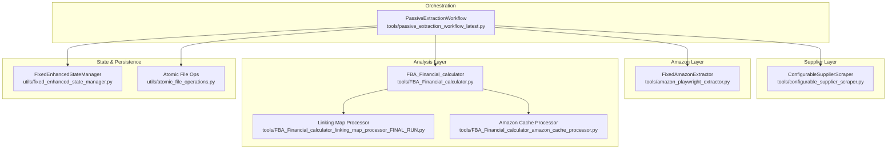
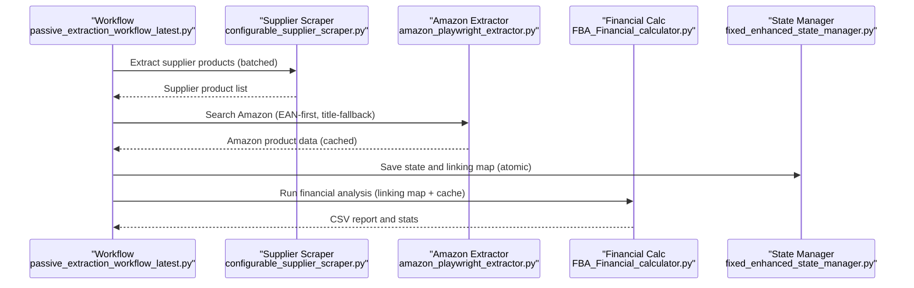
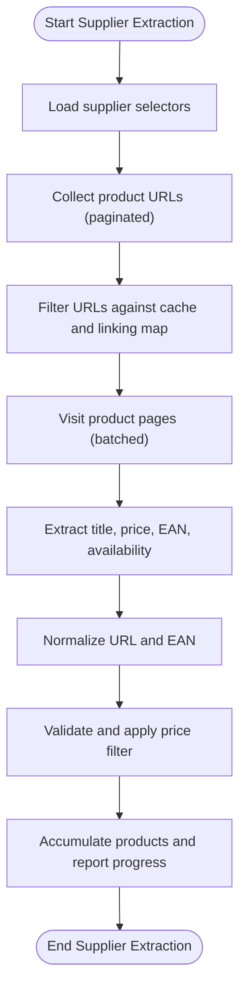
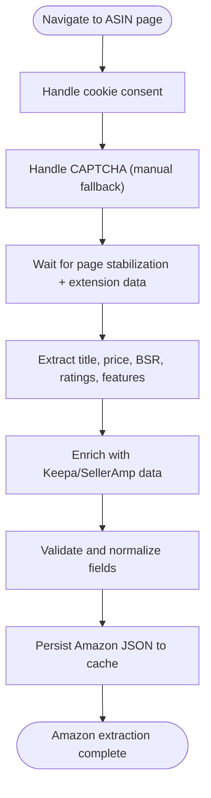
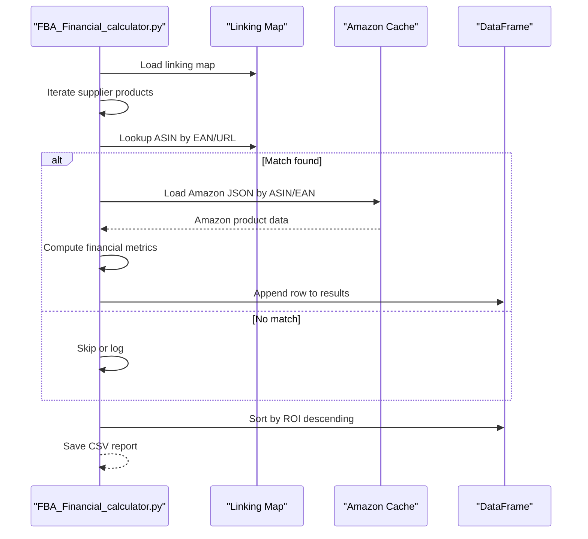
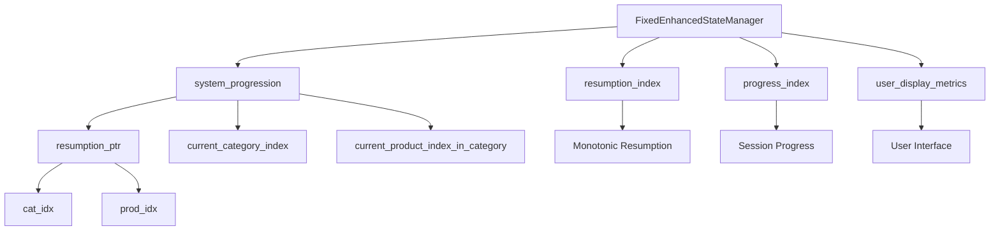
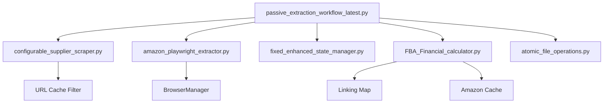

# Data Transformation Pipeline

<cite>
**Referenced Files in This Document**
- [passive_extraction_workflow_latest.py](file://tools/passive_extraction_workflow_latest.py)
- [configurable_supplier_scraper.py](file://tools/configurable_supplier_scraper.py)
- [amazon_playwright_extractor.py](file://tools/amazon_playwright_extractor.py)
- [FBA_Financial_calculator.py](file://tools/FBA_Financial_calculator.py)
- [FBA_Financial_calculator_linking_map_processor_FINAL_RUN.py](file://tools/FBA_Financial_calculator_linking_map_processor_FINAL_RUN.py)
- [FBA_Financial_calculator_amazon_cache_processor.py](file://tools/FBA_Financial_calculator_amazon_cache_processor.py)
- [fixed_enhanced_state_manager.py](file://utils/fixed_enhanced_state_manager.py)
- [atomic_file_operations.py](file://utils/atomic_file_operations.py)
- [Linking Map Persistence.md](file://repowiki 12 dec & 20 jan\en\content\Data Processing Workflow\Amazon Product Matching\Linking Map Persistence.md)
- [State Management Issues.md](file://wiki repo 19 nov\11. Troubleshooting Guide\11.3. State Management Issues\11.3.1. State Corruption.md)
- [Fixedenhancedstatemanager Implementation.md](file://wiki repo 19 nov\6. State Management System\6.2. Fixedenhancedstatemanager Implementation.md)
- [SYSTEM_ARCHITECTURE_ANALYSIS.md](file://SYSTEM_ARCHITECTURE_ANALYSIS.md)
</cite>

## Table of Contents
1. [Introduction](#introduction)
2. [Project Structure](#project-structure)
3. [Core Components](#core-components)
4. [Architecture Overview](#architecture-overview)
5. [Detailed Component Analysis](#detailed-component-analysis)
6. [Dependency Analysis](#dependency-analysis)
7. [Performance Considerations](#performance-considerations)
8. [Troubleshooting Guide](#troubleshooting-guide)
9. [Conclusion](#conclusion)
10. [Appendices](#appendices)

## Introduction
This document describes the end-to-end Data Transformation Pipeline that extracts supplier product listings, enriches them with Amazon marketplace data, normalizes and validates attributes, aggregates results, and produces financial analysis reports. The pipeline integrates three primary subsystems:
- Supplier extraction: ConfigurableSupplierScraper extracts product metadata from supplier sites.
- Amazon extraction: FixedAmazonExtractor (via amazon_playwright_extractor) retrieves Amazon product details.
- Financial analysis: FBA_Financial_calculator computes profitability metrics using linking maps and cached Amazon data.

The pipeline emphasizes resumable processing, atomic persistence, and efficient caching to ensure reliability and performance across large-scale runs.

## Project Structure
The pipeline spans multiple modules under tools/, with supporting utilities in utils/ and documentation in WIKI repositories. Key areas:
- tools/passive_extraction_workflow_latest.py: Orchestrates the full workflow, batching supplier extraction, resuming from state, matching to Amazon, and generating reports.
- tools/configurable_supplier_scraper.py: Robust supplier scraping with selector-driven extraction and URL pre-filtering.
- tools/amazon_playwright_extractor.py: Playwright-based Amazon extraction with cookie handling, CAPTCHA awareness, and extension data.
- tools/FBA_Financial_calculator.py: Financial computations using linking maps and Amazon cache.
- tools/FBA_Financial_calculator_linking_map_processor_FINAL_RUN.py and tools/FBA_Financial_calculator_amazon_cache_processor.py: Standalone processors for bulk linking map and Amazon cache analysis.
- utils/fixed_enhanced_state_manager.py: Atomic, resumable state management with sliding-window memory optimization.
- repowiki 12 dec & 20 jan\en\content\Data Processing Workflow\Amazon Product Matching\Linking Map Persistence.md: Persistent linking map design and integration with financial analysis.

**Diagram sources**
- [passive_extraction_workflow_latest.py](file://tools/passive_extraction_workflow_latest.py#L1-L120)
- [configurable_supplier_scraper.py](file://tools/configurable_supplier_scraper.py#L82-L170)
- [amazon_playwright_extractor.py](file://tools/amazon_playwright_extractor.py#L63-L122)
- [FBA_Financial_calculator.py](file://tools/FBA_Financial_calculator.py#L1-L120)
- [FBA_Financial_calculator_linking_map_processor_FINAL_RUN.py](file://tools/FBA_Financial_calculator_linking_map_processor_FINAL_RUN.py#L349-L382)
- [FBA_Financial_calculator_amazon_cache_processor.py](file://tools/FBA_Financial_calculator_amazon_cache_processor.py#L343-L383)
- [fixed_enhanced_state_manager.py](file://utils/fixed_enhanced_state_manager.py#L1-L200)
- [atomic_file_operations.py](file://utils/atomic_file_operations.py#L1-L200)

**Section sources**
- [passive_extraction_workflow_latest.py](file://tools/passive_extraction_workflow_latest.py#L1-L120)
- [configurable_supplier_scraper.py](file://tools/configurable_supplier_scraper.py#L82-L170)
- [amazon_playwright_extractor.py](file://tools/amazon_playwright_extractor.py#L63-L122)
- [FBA_Financial_calculator.py](file://tools/FBA_Financial_calculator.py#L1-L120)

## Core Components
- Supplier Extraction: ConfigurableSupplierScraper loads selector configurations per supplier, paginates product lists, filters URLs against caches, and extracts normalized product metadata (title, price, EAN, availability). It supports real-time progress callbacks and memory-conscious processing.
- Amazon Extraction: FixedAmazonExtractor connects to a shared Chrome instance, navigates to product pages, handles cookies and CAPTCHAs, and extracts rich product details including pricing, sales rank, ratings, features, and extension data (Keepa/SellerAmp). It persists Amazon JSON artifacts to cache.
- Financial Analysis: FBA_Financial_calculator loads linking maps and Amazon cache to compute profitability metrics (net profit, ROI, breakeven, profit margin) using supplier price and Amazon pricing/fees. It generates CSV reports and summary statistics.
- State Management: FixedEnhancedStateManager tracks progress, supports atomic saves, and maintains a sliding window of memory to prevent unbounded growth. It separates resumption pointers from display metrics for robustness.
- Linking Map Persistence: The linking map associates supplier products to Amazon ASINs, enabling O(1) lookups and resumable operations. It integrates with financial analysis to avoid redundant browser searches.

**Section sources**
- [configurable_supplier_scraper.py](file://tools/configurable_supplier_scraper.py#L477-L800)
- [amazon_playwright_extractor.py](file://tools/amazon_playwright_extractor.py#L317-L466)
- [FBA_Financial_calculator.py](file://tools/FBA_Financial_calculator.py#L472-L712)
- [fixed_enhanced_state_manager.py](file://utils/fixed_enhanced_state_manager.py#L1-L2412)
- [Linking Map Persistence.md](file://repowiki 12 dec & 20 jan\en\content\Data Processing Workflow\Amazon Product Matching\Linking Map Persistence.md#L1-L290)

## Architecture Overview
The pipeline follows a deterministic, resumable workflow:
1. Initialization: Load system configuration, initialize state manager, and set paths.
2. Supplier extraction: Batch process category URLs, scrape product pages, apply price filters, and persist supplier cache.
3. Matching: For each supplier product, search Amazon via EAN-first strategy, fallback to title similarity, and cache results.
4. Linking: Persist associations in the linking map for resumability and future analysis.
5. Financial analysis: Compute metrics using linking map and Amazon cache; produce CSV reports.
6. Persistence: Periodic atomic saves of state and linking map to ensure crash safety.

**Diagram sources**
- [passive_extraction_workflow_latest.py](file://tools/passive_extraction_workflow_latest.py#L851-L2650)
- [configurable_supplier_scraper.py](file://tools/configurable_supplier_scraper.py#L477-L800)
- [amazon_playwright_extractor.py](file://tools/amazon_playwright_extractor.py#L317-L466)
- [FBA_Financial_calculator.py](file://tools/FBA_Financial_calculator.py#L472-L712)
- [fixed_enhanced_state_manager.py](file://utils/fixed_enhanced_state_manager.py#L1-L2412)

## Detailed Component Analysis

### Supplier Extraction: ConfigurableSupplierScraper
- Selector-driven extraction with externalized configuration per supplier domain.
- Pagination handling and product page visits with anti-detection measures.
- URL pre-filtering against supplier cache and linking map to avoid redundant scraping.
- Real-time progress reporting and periodic memory cleanup to sustain long runs.
- Authentication callback integration for proactive pricing checks.

Transformation stages:
- Normalization: URL normalization and EAN normalization for deduplication.
- Enrichment: Availability and normalized identifiers.
- Validation: Price filtering and presence checks before appending to accumulator.

**Diagram sources**
- [configurable_supplier_scraper.py](file://tools/configurable_supplier_scraper.py#L477-L800)

**Section sources**
- [configurable_supplier_scraper.py](file://tools/configurable_supplier_scraper.py#L477-L800)

### Amazon Extraction: FixedAmazonExtractor
- Centralized browser management via BrowserManager singleton.
- Cookie consent and CAPTCHA handling with manual fallback.
- Extension data (Keepa/SellerAmp) extraction post-navigation stabilization.
- Robust navigation with circuit breaker and dead-page detection.

Transformation stages:
- Normalization: Standardize ASIN and product identifiers.
- Enrichment: Sales rank, ratings, features, descriptions, and extension-derived metrics.
- Validation: Price presence and numeric parsing; fallbacks from extension data.

**Diagram sources**
- [amazon_playwright_extractor.py](file://tools/amazon_playwright_extractor.py#L317-L466)

**Section sources**
- [amazon_playwright_extractor.py](file://tools/amazon_playwright_extractor.py#L317-L466)

### Financial Analysis: FBA_Financial_calculator
- Loads linking map and Amazon cache to avoid browser searches.
- Computes profitability metrics using supplier price and Amazon pricing/fees.
- Generates CSV reports sorted by ROI and summary statistics.

Transformation stages:
- Data mapping: Map supplier product fields to report columns and pull Amazon data via linking map.
- Aggregation: Group by product and compute ROI, net profit, breakeven, and profit margin.
- Quality assurance: Validate price presence and field normalization; log missing data.

**Diagram sources**
- [FBA_Financial_calculator.py](file://tools/FBA_Financial_calculator.py#L472-L712)
- [Linking Map Persistence.md](file://repowiki 12 dec & 20 jan\en\content\Data Processing Workflow\Amazon Product Matching\Linking Map Persistence.md#L271-L290)

**Section sources**
- [FBA_Financial_calculator.py](file://tools/FBA_Financial_calculator.py#L472-L712)
- [Linking Map Persistence.md](file://repowiki 12 dec & 20 jan\en\content\Data Processing Workflow\Amazon Product Matching\Linking Map Persistence.md#L265-L270)

### State Management and Resumability
- Single source of truth in system_progression with separated resumption and progress indices.
- Sliding window memory management to cap memory usage.
- Atomic file operations to prevent partial writes and ensure crash safety.
- Integration with workflow to resume from last processed index and avoid reprocessing.

**Diagram sources**
- [Fixedenhancedstatemanager Implementation.md](file://wiki repo 19 nov\6. State Management System\6.2. Fixedenhancedstatemanager Implementation.md#L191-L200)
- [State Management Issues.md](file://wiki repo 19 nov\11. Troubleshooting Guide\11.3. State Management Issues\11.3.1. State Corruption.md#L31-L47)

**Section sources**
- [fixed_enhanced_state_manager.py](file://utils/fixed_enhanced_state_manager.py#L1-L2412)
- [atomic_file_operations.py](file://utils/atomic_file_operations.py#L1-L200)
- [Fixedenhancedstatemanager Implementation.md](file://wiki repo 19 nov\6. State Management System\6.2. Fixedenhancedstatemanager Implementation.md#L191-L200)
- [State Management Issues.md](file://wiki repo 19 nov\11. Troubleshooting Guide\11.3. State Management Issues\11.3.1. State Corruption.md#L23-L47)

## Dependency Analysis
The pipeline exhibits tight coupling among workflow orchestration, supplier scraping, Amazon extraction, and financial analysis, mediated by state and cache layers.

**Diagram sources**
- [passive_extraction_workflow_latest.py](file://tools/passive_extraction_workflow_latest.py#L1-L120)
- [configurable_supplier_scraper.py](file://tools/configurable_supplier_scraper.py#L514-L552)
- [amazon_playwright_extractor.py](file://tools/amazon_playwright_extractor.py#L97-L122)
- [FBA_Financial_calculator.py](file://tools/FBA_Financial_calculator.py#L1-L120)
- [atomic_file_operations.py](file://utils/atomic_file_operations.py#L1-L200)

**Section sources**
- [passive_extraction_workflow_latest.py](file://tools/passive_extraction_workflow_latest.py#L1-L120)
- [configurable_supplier_scraper.py](file://tools/configurable_supplier_scraper.py#L514-L552)
- [amazon_playwright_extractor.py](file://tools/amazon_playwright_extractor.py#L97-L122)
- [FBA_Financial_calculator.py](file://tools/FBA_Financial_calculator.py#L1-L120)

## Performance Considerations
- Batching: Supplier extraction uses configurable batch sizes to control memory and throughput.
- URL pre-filtering: Reduces redundant page visits by leveraging supplier cache and linking map.
- Atomic persistence: Minimizes partial writes and ensures crash recovery without reprocessing.
- Sliding window state: Bounds memory usage in long-running sessions.
- Extension data: Deferred extraction after stabilization to balance accuracy and latency.
- Linking map: Enables O(1) lookups and eliminates repeated browser searches.

[No sources needed since this section provides general guidance]

## Troubleshooting Guide
Common issues and remedies:
- State corruption: Use validate_state_integrity() and repair_state_corruption() methods; monitor “STATE VALIDATION” logs; ensure atomic saves.
- Memory growth: Leverage sliding window memory management and periodic cleanup; verify browser memory pressure signals.
- Persistence failures: Verify atomic write mechanisms and directory permissions; confirm cache directories exist.
- Linking map inconsistencies: Confirm supplier-specific paths and linkage fields; validate EAN/URL matching logic.

**Section sources**
- [Fixedenhancedstatemanager Implementation.md](file://wiki repo 19 nov\6. State Management System\6.2. Fixedenhancedstatemanager Implementation.md#L338-L340)
- [SYSTEM_ARCHITECTURE_ANALYSIS.md](file://SYSTEM_ARCHITECTURE_ANALYSIS.md#L181-L193)
- [State Management Issues.md](file://wiki repo 19 nov\11. Troubleshooting Guide\11.3. State Management Issues\11.3.1. State Corruption.md#L23-L47)

## Conclusion
The Data Transformation Pipeline integrates supplier scraping, Amazon extraction, and financial analysis with robust state management and caching. Its design emphasizes resumability, atomic persistence, and performance optimization, enabling scalable and reliable identification of profitable FBA opportunities.

[No sources needed since this section summarizes without analyzing specific files]

## Appendices

### Data Mapping and Transformation Rules
- Supplier product to report mapping:
  - EAN, ASIN, SupplierTitle, AmazonTitle, SupplierURL, AmazonURL
  - Enhanced metrics: bought_in_past_month, fba_seller_count, fbm_seller_count, total_offer_count
  - Financial metrics: SupplierPrice_incVAT, SupplierPrice_exVAT, SellingPrice_incVAT, ReferralFee, FBAFee, PrepHouseFee, OutputVAT, InputVAT, NetProceeds, HMRC, NetProfit, ROI, Breakeven, ProfitMargin
- Matching rules:
  - Prefer EAN-based match; fallback to title similarity scoring.
  - Use linking map for O(1) lookup; otherwise, direct ASIN or fuzzy title search.
- Validation rules:
  - Require price presence in Amazon data; log missing fields.
  - Normalize EAN and URL; enforce numeric price parsing.

**Section sources**
- [FBA_Financial_calculator.py](file://tools/FBA_Financial_calculator.py#L599-L664)
- [Linking Map Persistence.md](file://repowiki 12 dec & 20 jan\en\content\Data Processing Workflow\Amazon Product Matching\Linking Map Persistence.md#L265-L270)