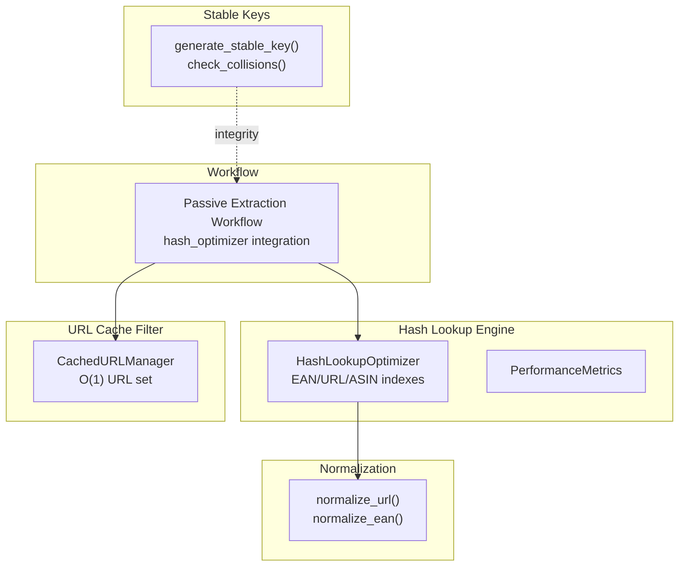
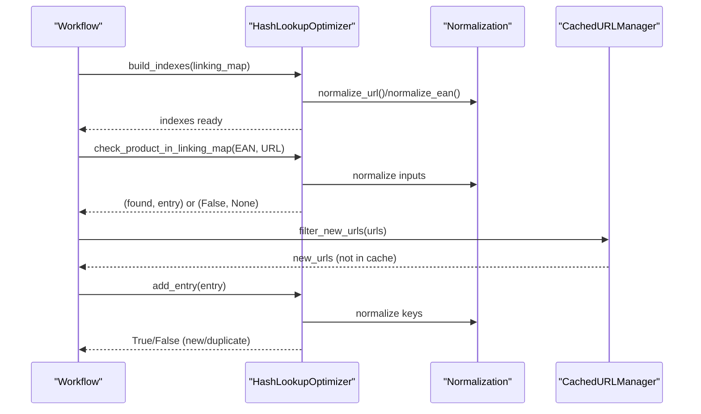
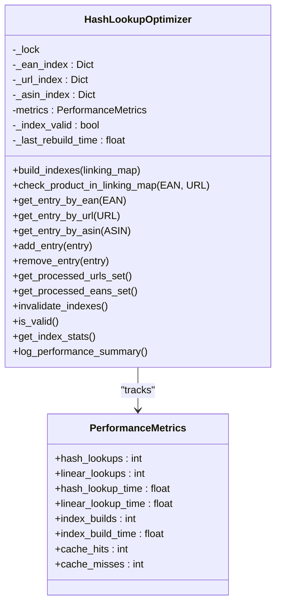
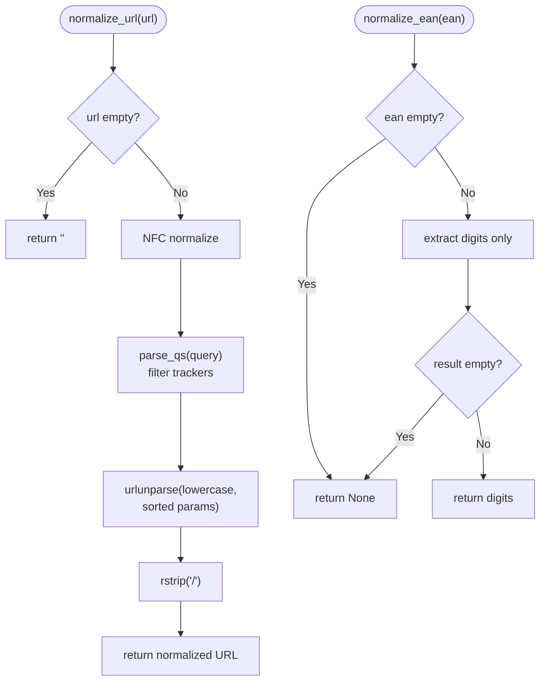
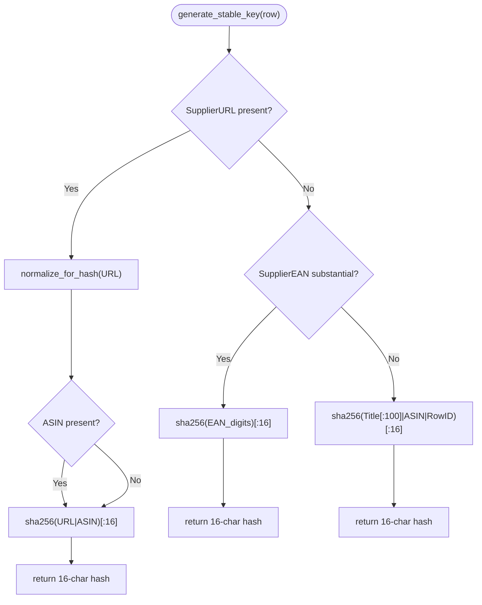
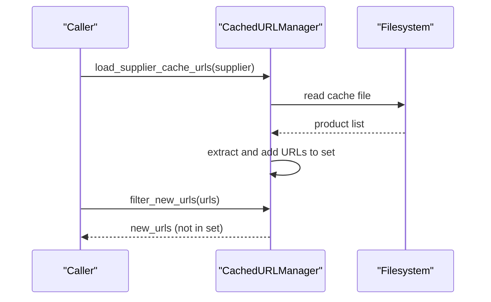
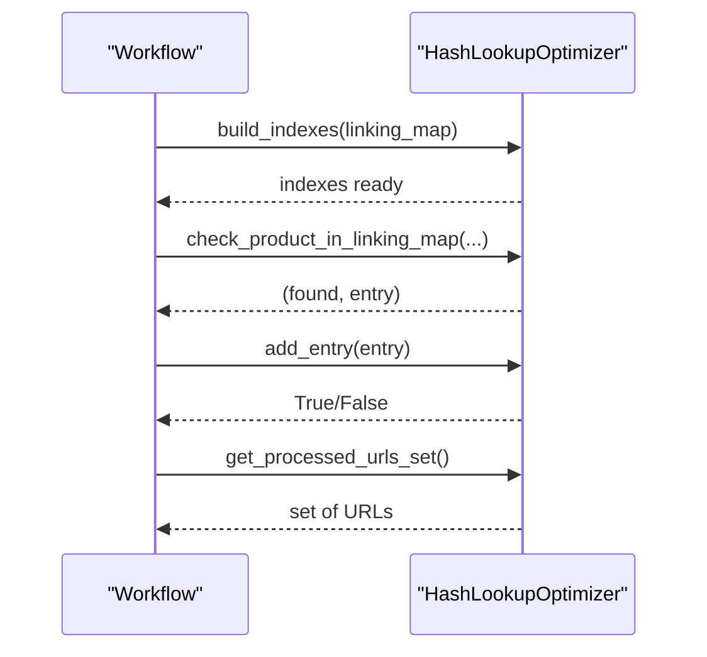

# Hash Lookup Optimization

<cite>
**Referenced Files in This Document**
- [hash_lookup_optimizer.py](file://utils/hash_lookup_optimizer.py)
- [stable_key.py](file://src/fba_agent/stable_key.py)
- [normalization.py](file://utils/normalization.py)
- [url_cache_filter.py](file://utils/url_cache_filter.py)
- [hash_lookup_methods.py](file://hash_lookup_methods.py)
- [HASH_OPTIMIZATION_IMPLEMENTATION_SUMMARY.md](file://HASH_OPTIMIZATION_IMPLEMENTATION_SUMMARY.md)
- [passive_extraction_workflow_latest.py.bakcat-idx](file://tools/passive_extraction_workflow_latest.py.bakcat-idx)
- [Architectural_Summary_passive_extraction_workflow_latest-enhanced.py](file://tools/Architectural_Summary_passive_extraction_workflow_latest-enhanced.py)
- [stable_key_collisions.json](file://stable_key_collisions.json)
</cite>

## Table of Contents
1. [Introduction](#introduction)
2. [Project Structure](#project-structure)
3. [Core Components](#core-components)
4. [Architecture Overview](#architecture-overview)
5. [Detailed Component Analysis](#detailed-component-analysis)
6. [Dependency Analysis](#dependency-analysis)
7. [Performance Considerations](#performance-considerations)
8. [Troubleshooting Guide](#troubleshooting-guide)
9. [Conclusion](#conclusion)

## Introduction
This document describes the Hash Lookup Optimization subsystem that accelerates product matching and deduplication across suppliers by replacing O(n) linear scans of the linking map with O(1) hash-based lookups. It covers the stable key generation algorithm, hash index construction and maintenance, normalization and collision handling, and the integration with cache management and URL filtering. It also documents performance characteristics, memory optimization, and configuration-related tuning parameters exposed by the system.

## Project Structure
The subsystem spans several modules:
- Hash lookup engine: a thread-safe hash table manager that builds and maintains indexes for EAN, URL, and ASIN.
- Normalization utilities: deterministic URL and EAN normalization used to ensure consistent indexing and lookups.
- Stable key generator: a deterministic 16-character hash used for cross-run comparison and integrity checks.
- URL cache filter: a high-throughput O(1) URL prefiltering layer integrated with cache management.
- Workflow integration: embedding the hash optimizer into the passive extraction workflow to enable instant lookups.

**Diagram sources**
- [hash_lookup_optimizer.py](file://utils/hash_lookup_optimizer.py#L1-L272)
- [normalization.py](file://utils/normalization.py#L1-L31)
- [stable_key.py](file://src/fba_agent/stable_key.py#L1-L232)
- [url_cache_filter.py](file://utils/url_cache_filter.py#L1-L272)
- [passive_extraction_workflow_latest.py.bakcat-idx](file://tools/passive_extraction_workflow_latest.py.bakcat-idx#L3235-L3240)

**Section sources**
- [hash_lookup_optimizer.py](file://utils/hash_lookup_optimizer.py#L1-L272)
- [normalization.py](file://utils/normalization.py#L1-L31)
- [stable_key.py](file://src/fba_agent/stable_key.py#L1-L232)
- [url_cache_filter.py](file://utils/url_cache_filter.py#L1-L272)
- [HASH_OPTIMIZATION_IMPLEMENTATION_SUMMARY.md](file://HASH_OPTIMIZATION_IMPLEMENTATION_SUMMARY.md#L1-L335)

## Core Components
- HashLookupOptimizer: Thread-safe O(1) lookup manager with three hash indexes (EAN, URL, ASIN), performance metrics, and lifecycle controls (build, add/remove, invalidate, stats).
- Normalization utilities: Deterministic URL and EAN normalization to reduce variance and improve index hit rates.
- Stable key generator: Deterministic 16-character SHA-256-based stable key with strict collision detection and reporting.
- URL cache filter: O(1) URL prefiltering using in-memory sets, integrated with cache loading and filtering.
- Workflow integration: The passive extraction workflow initializes and uses the hash optimizer to replace linear scans.

Key capabilities:
- Instant lookups by EAN, URL, or ASIN with normalization.
- Automatic index maintenance on add/update/remove.
- Comprehensive performance metrics and logging.
- Thread-safety via locks and atomic operations.

**Section sources**
- [hash_lookup_optimizer.py](file://utils/hash_lookup_optimizer.py#L1-L272)
- [normalization.py](file://utils/normalization.py#L1-L31)
- [stable_key.py](file://src/fba_agent/stable_key.py#L1-L232)
- [url_cache_filter.py](file://utils/url_cache_filter.py#L1-L272)
- [HASH_OPTIMIZATION_IMPLEMENTATION_SUMMARY.md](file://HASH_OPTIMIZATION_IMPLEMENTATION_SUMMARY.md#L39-L182)

## Architecture Overview
The hash lookup optimization integrates into the passive extraction workflow as follows:
- On load or initialization, the workflow builds hash indexes from the linking map.
- During processing, the workflow uses O(1) lookups to detect duplicates, fetch ASINs, and manage processed sets.
- The URL cache filter pre-filters URLs using an in-memory set to avoid redundant scrapes.
- The stable key generator ensures deterministic identity for cross-run comparisons and integrity checks.

**Diagram sources**
- [passive_extraction_workflow_latest.py.bakcat-idx](file://tools/passive_extraction_workflow_latest.py.bakcat-idx#L3235-L3240)
- [hash_lookup_optimizer.py](file://utils/hash_lookup_optimizer.py#L1-L272)
- [normalization.py](file://utils/normalization.py#L1-L31)
- [url_cache_filter.py](file://utils/url_cache_filter.py#L1-L272)

**Section sources**
- [passive_extraction_workflow_latest.py.bakcat-idx](file://tools/passive_extraction_workflow_latest.py.bakcat-idx#L3235-L3240)
- [Architectural_Summary_passive_extraction_workflow_latest-enhanced.py](file://tools/Architectural_Summary_passive_extraction_workflow_latest-enhanced.py#L3264-L3269)
- [hash_lookup_optimizer.py](file://utils/hash_lookup_optimizer.py#L1-L272)
- [url_cache_filter.py](file://utils/url_cache_filter.py#L1-L272)

## Detailed Component Analysis

### HashLookupOptimizer: O(1) Hash-Based Lookup Manager
- Indexes: Three hash maps keyed by normalized EAN, normalized URL, and ASIN.
- Operations:
  - Build indexes from a linking map.
  - O(1) lookups by EAN/URL/ASIN with normalization.
  - Add/update entries with duplicate detection and index refresh.
  - Remove entries and invalidate indexes.
  - Expose processed sets for gap processing and filtering.
  - Comprehensive performance metrics and logging.
- Thread safety: Uses a lock for all mutating operations and reads guarded by the same lock.
- Data integrity: Index validity flag prevents lookups until rebuilt; normalization ensures consistent keys.

**Diagram sources**
- [hash_lookup_optimizer.py](file://utils/hash_lookup_optimizer.py#L1-L272)

**Section sources**
- [hash_lookup_optimizer.py](file://utils/hash_lookup_optimizer.py#L1-L272)

### Normalization Utilities: Stable Keys and Index Keys
- URL normalization: Lowercase scheme/host/path, strip trailing slash, sort and filter query params (e.g., trackers), and produce a canonical form.
- EAN normalization: Extract digits only and treat empty results as None.
- Stable key helper: Produces a normalized EAN-first key when available, otherwise normalized URL, otherwise a placeholder.

**Diagram sources**
- [normalization.py](file://utils/normalization.py#L1-L31)

**Section sources**
- [normalization.py](file://utils/normalization.py#L1-L31)

### Stable Key Generation: Deterministic Identity for Cross-Run Comparison
- Strategy:
  - Primary: sha256(SupplierURL | ASIN)[:16]
  - Secondary: sha256(SupplierEAN)[…] (only if substantial and valid)
  - Fallback: sha256(SupplierTitle[:100] | ASIN | RowID)[:16]
- Collision policy: Hard fail with detailed reporting; each row must have a unique stable key.
- Reporting: Generates a JSON report on collisions with affected rows and sample metadata.

**Diagram sources**
- [stable_key.py](file://src/fba_agent/stable_key.py#L66-L114)

**Section sources**
- [stable_key.py](file://src/fba_agent/stable_key.py#L1-L232)
- [stable_key_collisions.json](file://stable_key_collisions.json#L1-L18)

### URL Cache Filter: O(1) Prefiltering Layer
- Purpose: Prevent unnecessary page visits by pre-filtering URLs already present in caches.
- Mechanism: In-memory set of cached URLs loaded from supplier cache files; supports O(1) membership checks and updates.
- Integration: Loads supplier-specific cache files, filters incoming URL lists, and optionally filters against linking map URLs.

**Diagram sources**
- [url_cache_filter.py](file://utils/url_cache_filter.py#L49-L171)

**Section sources**
- [url_cache_filter.py](file://utils/url_cache_filter.py#L1-L272)

### Workflow Integration: Embedding Hash Optimization
- Initialization: The workflow constructs the hash optimizer and performance comparator during setup.
- Index building: After loading or initializing the linking map, the workflow builds hash indexes.
- Lookup usage: Replaces linear scans with O(1) lookups for duplicate detection, ASIN retrieval, and processed set creation.
- Maintenance: Adds or removes entries to keep indexes synchronized with the linking map.

**Diagram sources**
- [passive_extraction_workflow_latest.py.bakcat-idx](file://tools/passive_extraction_workflow_latest.py.bakcat-idx#L3235-L3240)
- [hash_lookup_methods.py](file://hash_lookup_methods.py#L6-L45)

**Section sources**
- [passive_extraction_workflow_latest.py.bakcat-idx](file://tools/passive_extraction_workflow_latest.py.bakcat-idx#L3235-L3240)
- [hash_lookup_methods.py](file://hash_lookup_methods.py#L1-L45)
- [HASH_OPTIMIZATION_IMPLEMENTATION_SUMMARY.md](file://HASH_OPTIMIZATION_IMPLEMENTATION_SUMMARY.md#L55-L78)

## Dependency Analysis
- HashLookupOptimizer depends on normalization utilities for consistent key formation.
- Workflow depends on HashLookupOptimizer for fast lookups and on URL cache filter for prefiltering.
- Stable key generator is independent but complementary, ensuring deterministic identity and integrity.

**Diagram sources**
- [hash_lookup_optimizer.py](file://utils/hash_lookup_optimizer.py#L1-L272)
- [normalization.py](file://utils/normalization.py#L1-L31)
- [url_cache_filter.py](file://utils/url_cache_filter.py#L1-L272)
- [stable_key.py](file://src/fba_agent/stable_key.py#L1-L232)

**Section sources**
- [hash_lookup_optimizer.py](file://utils/hash_lookup_optimizer.py#L1-L272)
- [normalization.py](file://utils/normalization.py#L1-L31)
- [url_cache_filter.py](file://utils/url_cache_filter.py#L1-L272)
- [stable_key.py](file://src/fba_agent/stable_key.py#L1-L232)

## Performance Considerations
- Lookup complexity: O(1) average-case hash table operations.
- Throughput: Expected 3,650x improvement over O(n) linear scans for large linking maps.
- Memory overhead: Minimal; indexes mirror linking map entries with normalized keys.
- Concurrency: Thread-safe via locks; designed for concurrent lookups and updates.
- Monitoring: Built-in metrics track cache hit rate, average lookup times, and performance improvement ratios.

[No sources needed since this section provides general guidance]

## Troubleshooting Guide
Common issues and resolutions:
- Index invalidation: If the linking map changes, call invalidate and rebuild indexes before lookups.
- Empty/None values: Normalization handles empty inputs; ensure inputs are sanitized before adding entries.
- Collisions in stable keys: Hard fail with collision report; resolve by adjusting inputs to ensure uniqueness.
- URL cache misses: Verify cache files are present and supplier names match expected patterns; force reload if needed.
- Performance regressions: Use built-in metrics and logging to confirm index validity and hit rates.

**Section sources**
- [hash_lookup_optimizer.py](file://utils/hash_lookup_optimizer.py#L1-L272)
- [stable_key.py](file://src/fba_agent/stable_key.py#L1-L232)
- [url_cache_filter.py](file://utils/url_cache_filter.py#L1-L272)
- [stable_key_collisions.json](file://stable_key_collisions.json#L1-L18)

## Conclusion
The Hash Lookup Optimization subsystem delivers O(1) instant lookups by constructing and maintaining hash indexes for EAN, URL, and ASIN, backed by deterministic normalization. It integrates seamlessly into the passive extraction workflow, improves performance dramatically, and provides comprehensive metrics and logging. Combined with stable key generation and URL cache filtering, it forms a robust foundation for efficient product matching, deduplication, and scalable processing across suppliers.