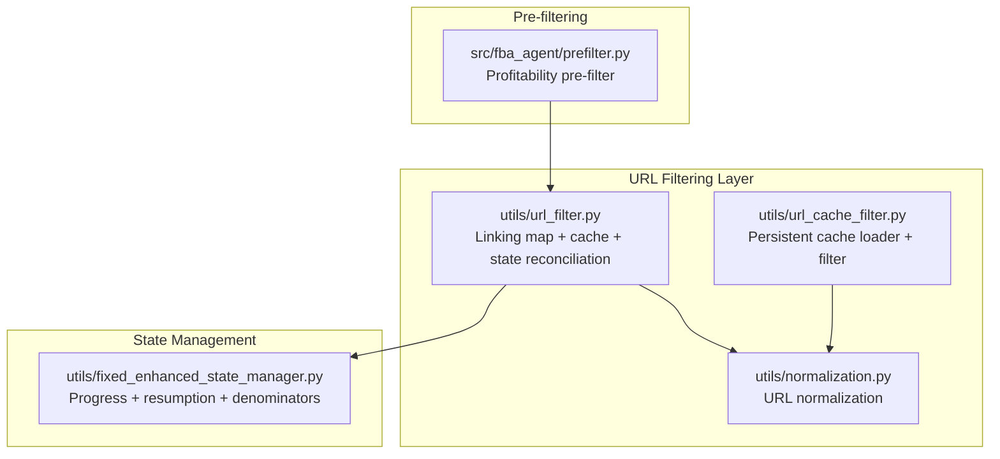
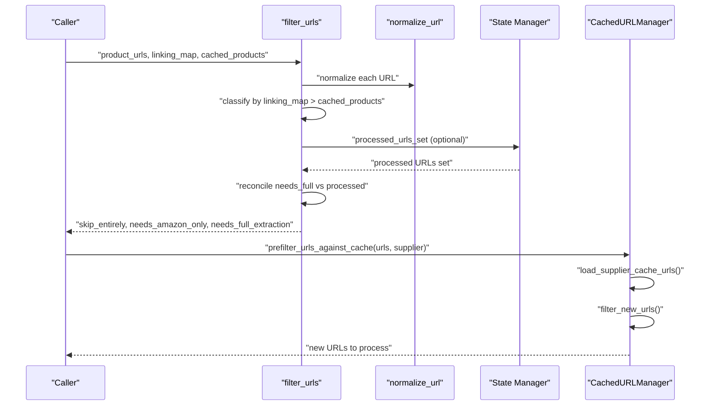
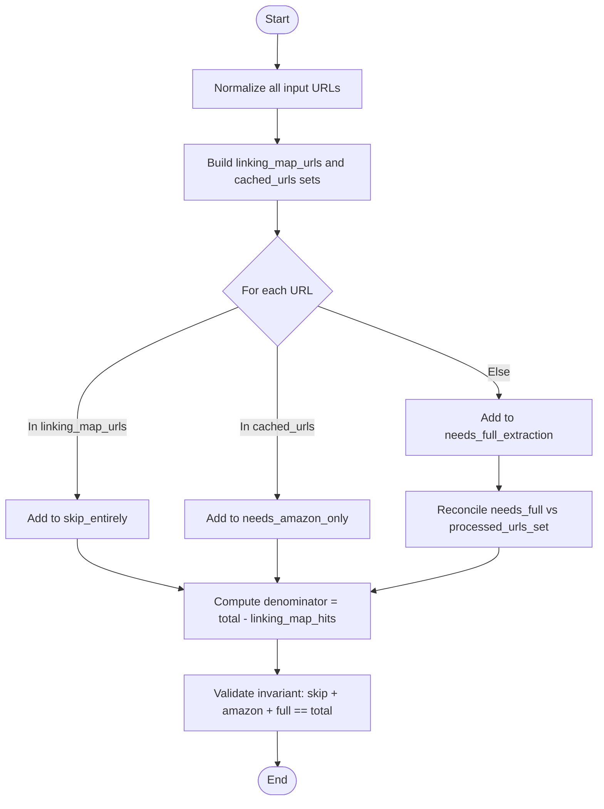
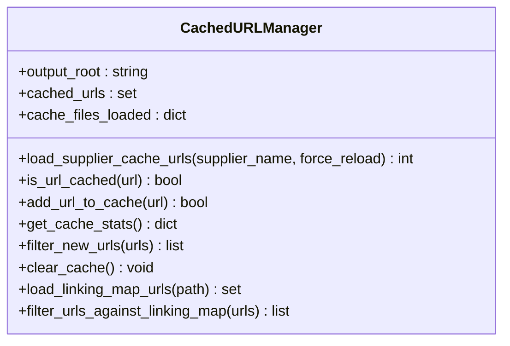
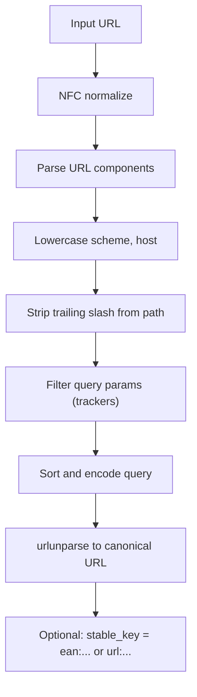
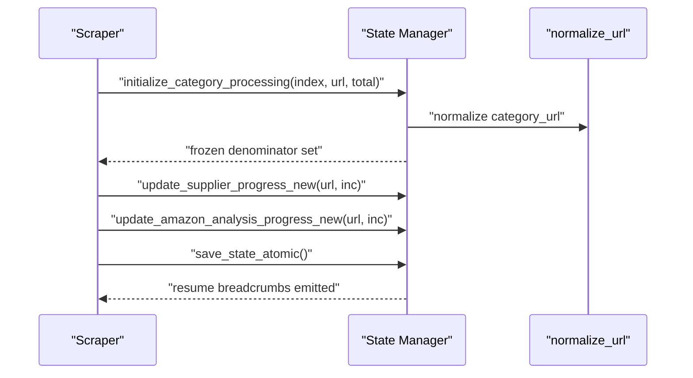
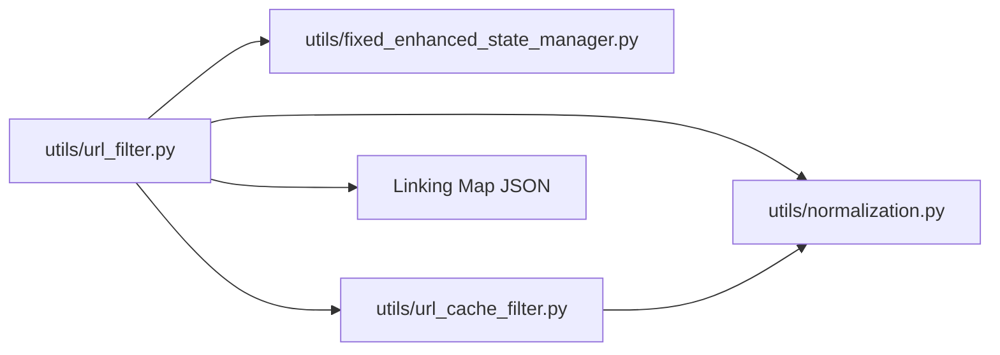

# URL Filtering System

<cite>
**Referenced Files in This Document**
- [url_filter.py](file://utils/url_filter.py)
- [url_cache_filter.py](file://utils/url_cache_filter.py)
- [normalization.py](file://utils/normalization.py)
- [fixed_enhanced_state_manager.py](file://utils/fixed_enhanced_state_manager.py)
- [prefilter.py](file://src/fba_agent/prefilter.py)
- [utils_url_filter.py.diff.txt](file://diagnostics_output/diffs/utils_url_filter.py.diff.txt)
- [linking_map.json](file://OUTPUTS/FBA_ANALYSIS/linking_maps/angelwholesale.co.uk/linking_map.json)
</cite>

## Table of Contents
1. [Introduction](#introduction)
2. [Project Structure](#project-structure)
3. [Core Components](#core-components)
4. [Architecture Overview](#architecture-overview)
5. [Detailed Component Analysis](#detailed-component-analysis)
6. [Dependency Analysis](#dependency-analysis)
7. [Performance Considerations](#performance-considerations)
8. [Troubleshooting Guide](#troubleshooting-guide)
9. [Conclusion](#conclusion)

## Introduction
This document describes the URL Filtering System that prevents duplicate processing across suppliers, categories, and product pages. It explains the multi-layered filtering mechanisms:
- Supplier-level filtering using the linking map (fully processed products)
- Supplier-level filtering using cached supplier product data
- Persistent cache-based filtering for product URLs
- URL normalization and deduplication
- Integration with the state management system for progress tracking and resumption
- Performance optimizations and invariant validation

The system ensures that each URL is processed only once by combining linking map data, supplier cache, and state-managed processed URLs, while maintaining strict invariants and robust diagnostics.

## Project Structure
The URL filtering system spans several modules:
- URL classification and reconciliation logic
- Persistent cache management for product URLs
- URL normalization utilities
- State management for progress tracking and resumption
- Pre-filtering logic for profitability checks

**Diagram sources**
- [url_filter.py](file://utils/url_filter.py#L1-L40)
- [url_cache_filter.py](file://utils/url_cache_filter.py#L1-L272)
- [normalization.py](file://utils/normalization.py#L1-L31)
- [fixed_enhanced_state_manager.py](file://utils/fixed_enhanced_state_manager.py#L1-L800)
- [prefilter.py](file://src/fba_agent/prefilter.py#L1-L179)

**Section sources**
- [url_filter.py](file://utils/url_filter.py#L1-L40)
- [url_cache_filter.py](file://utils/url_cache_filter.py#L1-L272)
- [normalization.py](file://utils/normalization.py#L1-L31)
- [fixed_enhanced_state_manager.py](file://utils/fixed_enhanced_state_manager.py#L1-L800)
- [prefilter.py](file://src/fba_agent/prefilter.py#L1-L179)

## Core Components
- Linking map-based URL classifier: Determines whether a product URL should be skipped entirely (fully processed), processed with Amazon-only analysis, or fully extracted.
- Persistent cache manager: Loads supplier product caches and filters out URLs already present in cache.
- URL normalization: Provides stable URL hashing and normalization for deduplication.
- State manager: Tracks progress, denominators, and resumption pointers to ensure accurate counting and recovery.
- Profitability pre-filter: Removes obviously unprofitable rows before full analysis.

**Section sources**
- [url_filter.py](file://utils/url_filter.py#L7-L39)
- [url_cache_filter.py](file://utils/url_cache_filter.py#L31-L207)
- [normalization.py](file://utils/normalization.py#L9-L31)
- [fixed_enhanced_state_manager.py](file://utils/fixed_enhanced_state_manager.py#L86-L1599)
- [prefilter.py](file://src/fba_agent/prefilter.py#L110-L167)

## Architecture Overview
The filtering pipeline integrates multiple sources of truth and persistence:
- Input URLs are normalized and classified against:
  - Linking map (fully processed)
  - Supplier cache (supplier data available)
  - State-managed processed URLs (for reconciliation)
- Persistent cache loader reads supplier cache files and maintains an in-memory set for O(1) lookups.
- State manager enforces denominator freezing and progress tracking to maintain accurate counts and resumption.

**Diagram sources**
- [url_filter.py](file://utils/url_filter.py#L7-L39)
- [url_cache_filter.py](file://utils/url_cache_filter.py#L226-L246)
- [normalization.py](file://utils/normalization.py#L9-L18)
- [fixed_enhanced_state_manager.py](file://utils/fixed_enhanced_state_manager.py#L1027-L1168)

## Detailed Component Analysis

### Linking Map and Cache-Based Classification
The classifier prioritizes fully processed URLs (from the linking map) over cached supplier URLs, and leaves unprocessed URLs for full extraction. It also supports reconciliation against state-managed processed URLs and computes a formal denominator.

**Diagram sources**
- [url_filter.py](file://utils/url_filter.py#L25-L39)
- [utils_url_filter.py.diff.txt](file://diagnostics_output/diffs/utils_url_filter.py.diff.txt#L26-L334)

**Section sources**
- [url_filter.py](file://utils/url_filter.py#L7-L39)
- [utils_url_filter.py.diff.txt](file://diagnostics_output/diffs/utils_url_filter.py.diff.txt#L26-L334)

### Persistent Cache Management for Product URLs
The cache manager loads supplier product cache files into memory and filters new URLs efficiently. It supports:
- Loading supplier cache files by supplier name
- O(1) lookups using an in-memory set
- Real-time updates when adding new URLs
- Statistics and diagnostics

**Diagram sources**
- [url_cache_filter.py](file://utils/url_cache_filter.py#L31-L207)

**Section sources**
- [url_cache_filter.py](file://utils/url_cache_filter.py#L31-L207)

### URL Normalization and Stable Keys
Normalization ensures URLs are compared consistently by:
- Applying Unicode NFC normalization
- Lowercasing scheme and host
- Stripping trailing slashes from paths
- Sorting and filtering query parameters (removing trackers)
- Constructing a canonical URL representation

Stable keys prioritize EAN when available, otherwise fall back to normalized URLs.

**Diagram sources**
- [normalization.py](file://utils/normalization.py#L9-L31)

**Section sources**
- [normalization.py](file://utils/normalization.py#L9-L31)

### State Management Integration for Progress Tracking
The state manager:
- Freezes category denominators to prevent mutation
- Tracks progress across supplier and Amazon phases
- Persists resumption pointers and resumes from the correct position
- Validates three sources of truth (manifest, state, resume pointer) and enforces invariants

**Diagram sources**
- [fixed_enhanced_state_manager.py](file://utils/fixed_enhanced_state_manager.py#L1055-L1168)

**Section sources**
- [fixed_enhanced_state_manager.py](file://utils/fixed_enhanced_state_manager.py#L805-L996)
- [fixed_enhanced_state_manager.py](file://utils/fixed_enhanced_state_manager.py#L1055-L1168)

### Profitability Pre-filtering (Prior to Full Analysis)
While not part of URL filtering, the prefilter removes obviously unprofitable rows before they enter the full analysis pipeline, reducing downstream processing overhead.

**Section sources**
- [prefilter.py](file://src/fba_agent/prefilter.py#L110-L167)

## Dependency Analysis
The filtering system depends on:
- Normalization utilities for stable comparisons
- State manager for processed URL tracking and progress
- Persistent cache manager for supplier cache lookups
- Linking map data for fully processed URLs

**Diagram sources**
- [url_filter.py](file://utils/url_filter.py#L4-L4)
- [url_cache_filter.py](file://utils/url_cache_filter.py#L22-L29)
- [fixed_enhanced_state_manager.py](file://utils/fixed_enhanced_state_manager.py#L48-L58)
- [linking_map.json](file://OUTPUTS/FBA_ANALYSIS/linking_maps/angelwholesale.co.uk/linking_map.json)

**Section sources**
- [url_filter.py](file://utils/url_filter.py#L4-L4)
- [url_cache_filter.py](file://utils/url_cache_filter.py#L22-L29)
- [fixed_enhanced_state_manager.py](file://utils/fixed_enhanced_state_manager.py#L48-L58)
- [linking_map.json](file://OUTPUTS/FBA_ANALYSIS/linking_maps/angelwholesale.co.uk/linking_map.json)

## Performance Considerations
- Hash-based lookups: Using sets for linking map and cache URLs enables O(1) membership tests.
- Lazy cache loading: Supplier caches are loaded on demand and tracked to avoid redundant loads.
- Atomic state writes: Ensures consistency and avoids partial writes during resumption.
- Normalization cost: Applied once per URL; keep normalization lightweight and reuse normalized forms.
- Invariant validation: Added post-processing validation to catch classification errors early.

[No sources needed since this section provides general guidance]

## Troubleshooting Guide
Common issues and resolutions:
- Duplicate processing: Verify that processed URLs are captured in state and that reconciliation moves items from full extraction to Amazon-only processing.
- Invariant failures: The classifier logs detailed breakdowns and snapshots diagnostics for failed invariants.
- Cache misses: Ensure supplier cache files exist and are readable; confirm the cache manager loaded the correct supplier file.
- Cross-domain filtering: Use normalized URLs to ensure URLs from different subdomains or paths are treated consistently.
- Encoding issues: Rely on normalization to handle percent-encoding and Unicode normalization.

**Section sources**
- [utils_url_filter.py.diff.txt](file://diagnostics_output/diffs/utils_url_filter.py.diff.txt#L340-L441)
- [url_cache_filter.py](file://utils/url_cache_filter.py#L70-L102)
- [normalization.py](file://utils/normalization.py#L9-L18)

## Conclusion
The URL Filtering System combines linking map data, supplier cache, and state-managed processed URLs to prevent duplicate processing across suppliers, categories, and product pages. It leverages normalization, persistent cache management, and rigorous invariant validation to maintain correctness and performance. Integration with the state management system ensures accurate progress tracking and reliable resumption.