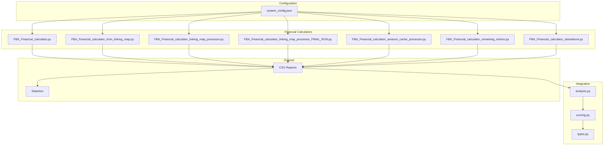
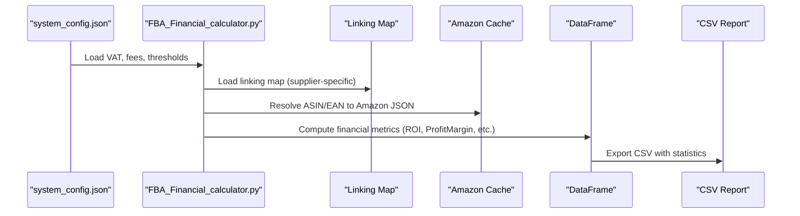
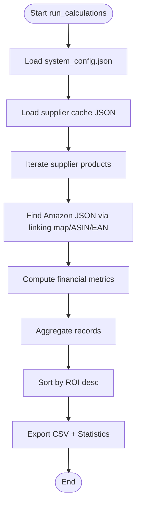
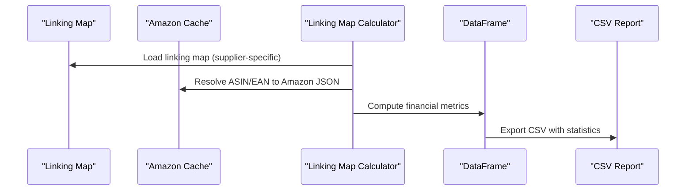
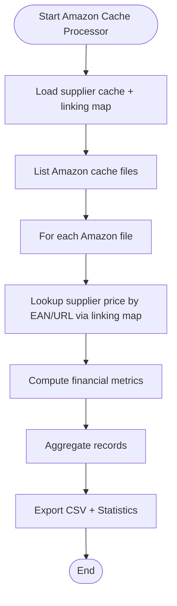
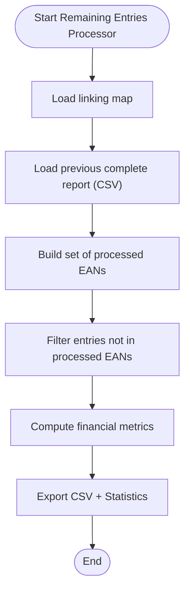
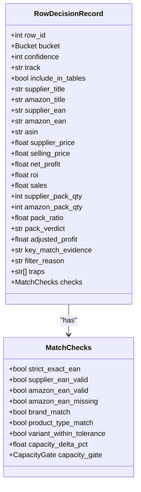
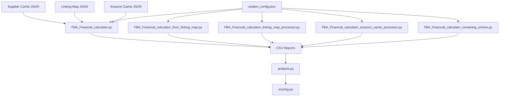

# Financial Analysis

<cite>
**Referenced Files in This Document**
- [FBA_Financial_calculator.py](file://tools/FBA_Financial_calculator.py)
- [FBA_Financial_calculator_from_linking_map.py](file://tools/FBA_Financial_calculator_from_linking_map.py)
- [FBA_Financial_calculator_linking_map_processor.py](file://tools/FBA_Financial_calculator_linking_map_processor.py)
- [FBA_Financial_calculator_linking_map_processor_FINAL_RUN.py](file://tools/FBA_Financial_calculator_linking_map_processor_FINAL_RUN.py)
- [FBA_Financial_calculator_amazon_cache_processor.py](file://tools/FBA_Financial_calculator_amazon_cache_processor.py)
- [FBA_Financial_calculator_remaining_entries.py](file://tools/FBA_Financial_calculator_remaining_entries.py)
- [FBA_Financial_calculator_standalone.py](file://tools/FBA_Financial_calculator_standalone.py)
- [system_config.json](file://config/system_config.json)
- [analysis.py](file://src/fba_agent/analysis.py)
- [types.py](file://src/fba_agent/types.py)
- [scoring.py](file://src/fba_agent/scoring.py)
</cite>

## Table of Contents
1. [Introduction](#introduction)
2. [Project Structure](#project-structure)
3. [Core Components](#core-components)
4. [Architecture Overview](#architecture-overview)
5. [Detailed Component Analysis](#detailed-component-analysis)
6. [Dependency Analysis](#dependency-analysis)
7. [Performance Considerations](#performance-considerations)
8. [Troubleshooting Guide](#troubleshooting-guide)
9. [Conclusion](#conclusion)

## Introduction
This document describes the Financial Analysis subsystem responsible for comprehensive profitability analysis of FBA (Fulfillment by Amazon) products. It covers the integration of the FBA_Financial_calculator suite with matching results and data processing pipelines, including FBA fee calculations, shipping costs, revenue projections, ROI computation, profit margin analysis, and investment screening criteria. It documents the financial reporting generation system that produces CSV outputs and outlines configuration-driven financial parameters and thresholds. Architectural considerations address accuracy, performance optimization, and extensibility for future financial metrics.

## Project Structure
The Financial Analysis subsystem is implemented as a set of modular calculators and processors that operate on outputs from the broader workflow engine:
- Financial calculators: standalone and linking-map-centric scripts that compute profitability metrics and produce CSV reports.
- Configuration: centralized system_config.json defines financial parameters (VAT rates, referral and fulfillment fees, prep house fees, and analysis thresholds).
- Post-processing integration: analysis.py and scoring.py integrate financial results into the broader matching and decision pipeline.

**Diagram sources**
- [FBA_Financial_calculator.py](file://tools/FBA_Financial_calculator.py#L1-L712)
- [FBA_Financial_calculator_from_linking_map.py](file://tools/FBA_Financial_calculator_from_linking_map.py#L1-L408)
- [FBA_Financial_calculator_linking_map_processor.py](file://tools/FBA_Financial_calculator_linking_map_processor.py#L1-L429)
- [FBA_Financial_calculator_linking_map_processor_FINAL_RUN.py](file://tools/FBA_Financial_calculator_linking_map_processor_FINAL_RUN.py#L1-L436)
- [FBA_Financial_calculator_amazon_cache_processor.py](file://tools/FBA_Financial_calculator_amazon_cache_processor.py#L1-L455)
- [FBA_Financial_calculator_remaining_entries.py](file://tools/FBA_Financial_calculator_remaining_entries.py#L1-L465)
- [FBA_Financial_calculator_standalone.py](file://tools/FBA_Financial_calculator_standalone.py#L1-L561)
- [system_config.json](file://config/system_config.json#L1-L384)
- [analysis.py](file://src/fba_agent/analysis.py#L1-L418)
- [scoring.py](file://src/fba_agent/scoring.py#L1-L59)
- [types.py](file://src/fba_agent/types.py#L1-L168)

**Section sources**
- [FBA_Financial_calculator.py](file://tools/FBA_Financial_calculator.py#L1-L712)
- [system_config.json](file://config/system_config.json#L1-L384)

## Core Components
- FBA_Financial_calculator.py: Core calculator using supplier cache and linking map to match supplier products to Amazon data, compute financial metrics, and export CSV reports with profitability statistics.
- Linking-map-centric calculators: Specialized processors that use the linking map as the primary data source to ensure all matched entries are processed, including entries not present in the current supplier cache.
- Amazon cache processor: Processes all Amazon cache files and matches them with supplier pricing to generate complete financial reports.
- Remaining entries processor: Identifies and processes linking map entries not included in prior complete reports.
- Standalone calculator: A self-contained script for targeted linking map processing with hardcoded paths.
- Configuration loader: Centralized financial parameters (VAT rate, referral fee rate, fulfillment fee minimum, prep house fixed fee) and analysis thresholds (min ROI percent, min profit per unit, etc.) are loaded from system_config.json.
- Integration with matching pipeline: Financial results are integrated into analysis.py and scoring.py to inform bucketing, confidence, and decision-making.

Key financial metrics computed:
- SupplierPrice_incVAT/exVAT, SellingPrice_incVAT
- ReferralFee, FBAFee, PrepHouseFee
- NetProceeds, NetProfit, HMRC (input VAT offset/refund)
- ROI (Return on Investment), Breakeven, ProfitMargin
- Enhanced metrics: bought_in_past_month, fba_seller_count, fbm_seller_count, total_offer_count

**Section sources**
- [FBA_Financial_calculator.py](file://tools/FBA_Financial_calculator.py#L375-L470)
- [FBA_Financial_calculator_from_linking_map.py](file://tools/FBA_Financial_calculator_from_linking_map.py#L150-L217)
- [FBA_Financial_calculator_linking_map_processor.py](file://tools/FBA_Financial_calculator_linking_map_processor.py#L157-L225)
- [FBA_Financial_calculator_amazon_cache_processor.py](file://tools/FBA_Financial_calculator_amazon_cache_processor.py#L122-L189)
- [FBA_Financial_calculator_remaining_entries.py](file://tools/FBA_Financial_calculator_remaining_entries.py#L193-L267)
- [system_config.json](file://config/system_config.json#L208-L246)

## Architecture Overview
The Financial Analysis subsystem orchestrates three primary data flows:
1. Supplier cache + linking map + Amazon cache: The canonical flow used by FBA_Financial_calculator.py, which loads supplier cache entries, resolves ASINs via linking map, fetches Amazon JSON, computes financials, and writes CSV.
2. Linking map as source-of-truth: Linking-map-centric processors enumerate linking map entries, resolve Amazon data by ASIN/EAN, compute financials, and write CSV. This ensures completeness across all matched entries.
3. Amazon cache enumeration: The Amazon cache processor iterates all Amazon cache files, attempts supplier price lookups via EAN and linking map, computes financials, and writes CSV.

**Diagram sources**
- [FBA_Financial_calculator.py](file://tools/FBA_Financial_calculator.py#L45-L58)
- [FBA_Financial_calculator.py](file://tools/FBA_Financial_calculator.py#L472-L664)
- [system_config.json](file://config/system_config.json#L208-L246)

## Detailed Component Analysis

### FBA_Financial_calculator.py
- Purpose: Core financial calculator integrating supplier cache, linking map, and Amazon cache to compute profitability and export CSV.
- Data sources:
  - Supplier cache JSON (supplier-specific)
  - Linking map JSON (supplier-specific)
  - Amazon scrape JSON (amazon_cache)
- Processing logic:
  - Loads system configuration (VAT rate, referral fee rate, fulfillment fee minimum, prep house fixed fee, analysis thresholds).
  - Iterates supplier cache entries, finds matching Amazon data via linking map and ASIN/EAN resolution, extracts price fields, computes financials, aggregates records, sorts by ROI, and exports CSV.
- Outputs: CSV report with financial metrics and statistics; statistics include processed, found_matches, generated_calculations, output_file, and profitability breakdown.

**Diagram sources**
- [FBA_Financial_calculator.py](file://tools/FBA_Financial_calculator.py#L472-L664)

**Section sources**
- [FBA_Financial_calculator.py](file://tools/FBA_Financial_calculator.py#L45-L58)
- [FBA_Financial_calculator.py](file://tools/FBA_Financial_calculator.py#L472-L664)

### Linking-map-centric calculators
- FBA_Financial_calculator_from_linking_map.py:
  - Uses linking map as the primary data source to process all entries, ensuring coverage of entries not present in the current supplier cache.
  - Computes financials and exports CSV with statistics.
- FBA_Financial_calculator_linking_map_processor.py:
  - Similar to the above but designed to work with the system workflow’s linking map structure.
  - Removes supplier cache dependency; directly uses linking map entries for supplier data.
- FBA_Financial_calculator_linking_map_processor_FINAL_RUN.py:
  - Hardcodes a specific linking map file path for a final run; otherwise follows the same logic as the processor.

**Diagram sources**
- [FBA_Financial_calculator_from_linking_map.py](file://tools/FBA_Financial_calculator_from_linking_map.py#L219-L360)
- [FBA_Financial_calculator_linking_map_processor.py](file://tools/FBA_Financial_calculator_linking_map_processor.py#L227-L382)
- [FBA_Financial_calculator_linking_map_processor_FINAL_RUN.py](file://tools/FBA_Financial_calculator_linking_map_processor_FINAL_RUN.py#L233-L389)

**Section sources**
- [FBA_Financial_calculator_from_linking_map.py](file://tools/FBA_Financial_calculator_from_linking_map.py#L219-L360)
- [FBA_Financial_calculator_linking_map_processor.py](file://tools/FBA_Financial_calculator_linking_map_processor.py#L227-L382)
- [FBA_Financial_calculator_linking_map_processor_FINAL_RUN.py](file://tools/FBA_Financial_calculator_linking_map_processor_FINAL_RUN.py#L233-L389)

### Amazon cache processor
- FBA_Financial_calculator_amazon_cache_processor.py:
  - Enumerates all Amazon cache files and attempts to match supplier prices via EAN and linking map (EAN and URL).
  - Builds supplier-product maps and linking maps for fast lookup, computes financials, and exports CSV.
  - Provides statistics on processed files, matches, and missing data.

**Diagram sources**
- [FBA_Financial_calculator_amazon_cache_processor.py](file://tools/FBA_Financial_calculator_amazon_cache_processor.py#L191-L409)

**Section sources**
- [FBA_Financial_calculator_amazon_cache_processor.py](file://tools/FBA_Financial_calculator_amazon_cache_processor.py#L191-L409)

### Remaining entries processor
- FBA_Financial_calculator_remaining_entries.py:
  - Processes linking map entries not included in a previously generated complete report.
  - Loads the complete report to deduplicate EANs, then processes the remaining entries to generate a second CSV.

**Diagram sources**
- [FBA_Financial_calculator_remaining_entries.py](file://tools/FBA_Financial_calculator_remaining_entries.py#L269-L424)

**Section sources**
- [FBA_Financial_calculator_remaining_entries.py](file://tools/FBA_Financial_calculator_remaining_entries.py#L269-L424)

### Standalone calculator
- FBA_Financial_calculator_standalone.py:
  - Self-contained script for targeted linking map processing with hardcoded paths.
  - Demonstrates the same financial computation logic and CSV export.

**Section sources**
- [FBA_Financial_calculator_standalone.py](file://tools/FBA_Financial_calculator_standalone.py#L393-L529)

### Integration with matching pipeline
- Financial results feed into analysis.py and scoring.py:
  - analysis.py uses financial metrics (NetProfit, ROI) to compute buckets (VERIFIED, HIGHLY_LIKELY, NEEDS_VERIFICATION, FILTERED_OUT) and confidence.
  - scoring.py computes a confidence score based on match checks and financial signals.
- Types define the data structures used across the pipeline.

**Diagram sources**
- [types.py](file://src/fba_agent/types.py#L74-L104)
- [analysis.py](file://src/fba_agent/analysis.py#L305-L345)
- [scoring.py](file://src/fba_agent/scoring.py#L7-L58)

**Section sources**
- [analysis.py](file://src/fba_agent/analysis.py#L126-L131)
- [analysis.py](file://src/fba_agent/analysis.py#L348-L345)
- [scoring.py](file://src/fba_agent/scoring.py#L7-L58)
- [types.py](file://src/fba_agent/types.py#L74-L104)

## Dependency Analysis
- Configuration-driven financial parameters:
  - VAT rate, referral fee rate, fulfillment fee minimum, prep house fixed fee, and analysis thresholds are loaded from system_config.json and applied consistently across calculators.
- Data dependencies:
  - Supplier cache JSON (per supplier)
  - Linking map JSON (per supplier)
  - Amazon scrape JSON (amazon_cache)
- Output dependencies:
  - CSV reports consumed by analysis.py and scoring.py for decision-making and confidence computation.

**Diagram sources**
- [system_config.json](file://config/system_config.json#L208-L246)
- [FBA_Financial_calculator.py](file://tools/FBA_Financial_calculator.py#L45-L58)
- [FBA_Financial_calculator_from_linking_map.py](file://tools/FBA_Financial_calculator_from_linking_map.py#L29-L46)
- [FBA_Financial_calculator_linking_map_processor.py](file://tools/FBA_Financial_calculator_linking_map_processor.py#L30-L52)
- [FBA_Financial_calculator_amazon_cache_processor.py](file://tools/FBA_Financial_calculator_amazon_cache_processor.py#L30-L52)
- [FBA_Financial_calculator_remaining_entries.py](file://tools/FBA_Financial_calculator_remaining_entries.py#L29-L53)

**Section sources**
- [system_config.json](file://config/system_config.json#L208-L246)
- [FBA_Financial_calculator.py](file://tools/FBA_Financial_calculator.py#L45-L58)

## Performance Considerations
- File I/O optimization:
  - Use supplier-specific paths to avoid scanning unnecessary directories.
  - Cache linking maps in memory to reduce repeated reads.
- Data structure efficiency:
  - Build lookup maps (EAN->supplier product, URL->supplier product, EAN/URL->ASIN) to minimize nested loops.
- Sorting and aggregation:
  - Sort by ROI once at the end to avoid repeated sorting during aggregation.
- Logging and progress:
  - Use periodic logging to track progress for long-running runs.
- Memory management:
  - For large datasets, consider batching CSV exports and limiting in-memory DataFrame size.

[No sources needed since this section provides general guidance]

## Troubleshooting Guide
Common issues and resolutions:
- Missing Amazon data:
  - Linking map or ASIN/EAN resolution failures lead to skipped entries. Verify linking map integrity and file naming conventions.
- Price extraction failures:
  - If no price fields are found in Amazon JSON, the entry is skipped. Ensure Amazon cache contains current_price or price fields.
- Configuration loading errors:
  - If system_config.json is malformed, calculators fall back to defaults. Validate JSON syntax and required keys.
- No matching records:
  - If no financial calculations are generated, check supplier cache and linking map consistency and file paths.

**Section sources**
- [FBA_Financial_calculator.py](file://tools/FBA_Financial_calculator.py#L522-L527)
- [FBA_Financial_calculator.py](file://tools/FBA_Financial_calculator.py#L574-L583)
- [FBA_Financial_calculator_from_linking_map.py](file://tools/FBA_Financial_calculator_from_linking_map.py#L236-L240)
- [FBA_Financial_calculator_linking_map_processor.py](file://tools/FBA_Financial_calculator_linking_map_processor.py#L254-L258)
- [FBA_Financial_calculator_amazon_cache_processor.py](file://tools/FBA_Financial_calculator_amazon_cache_processor.py#L220-L226)

## Conclusion
The Financial Analysis subsystem provides robust, configuration-driven profitability analysis for FBA products. By leveraging linking maps, supplier caches, and Amazon scrape data, it computes accurate financial metrics and generates actionable CSV reports. Integration with the matching pipeline enables informed decision-making through bucketing and confidence scoring. The architecture supports extensibility for additional financial metrics and maintains performance through efficient data structures and logging.