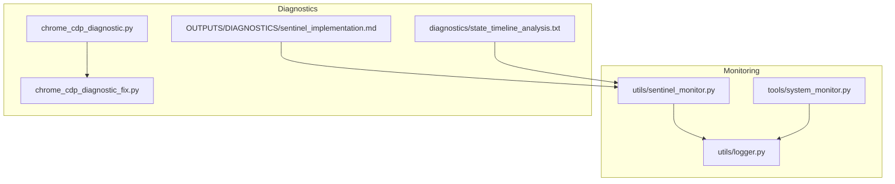
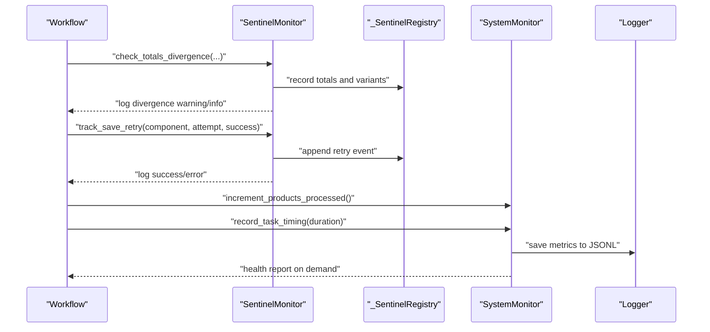
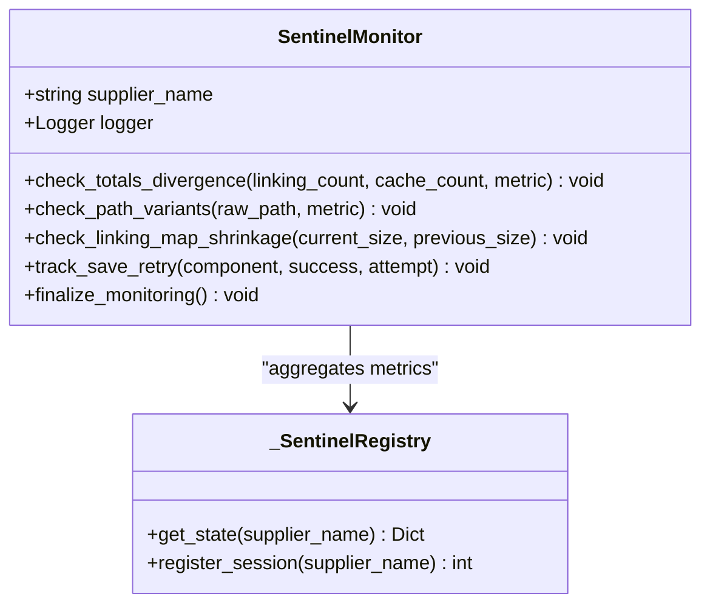
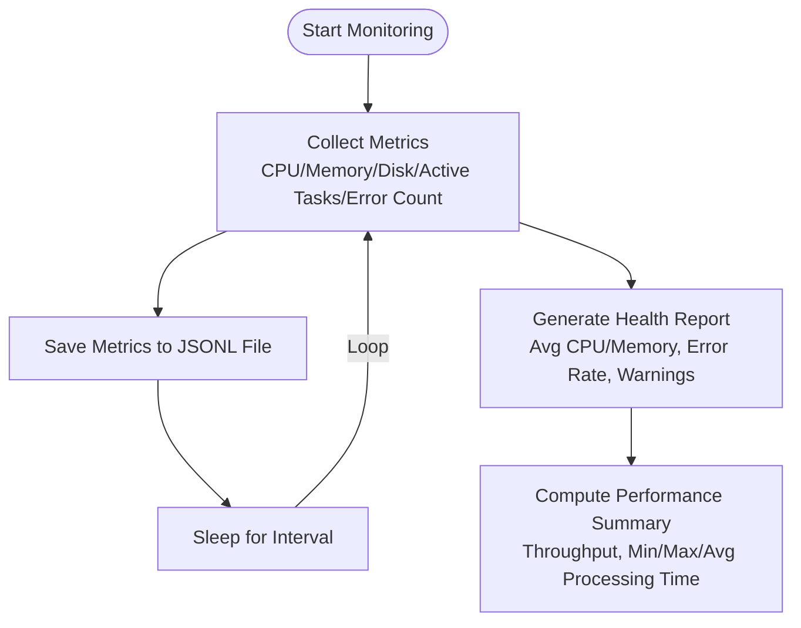
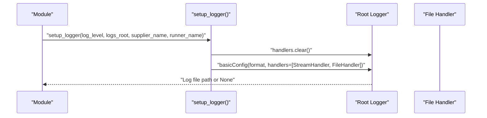
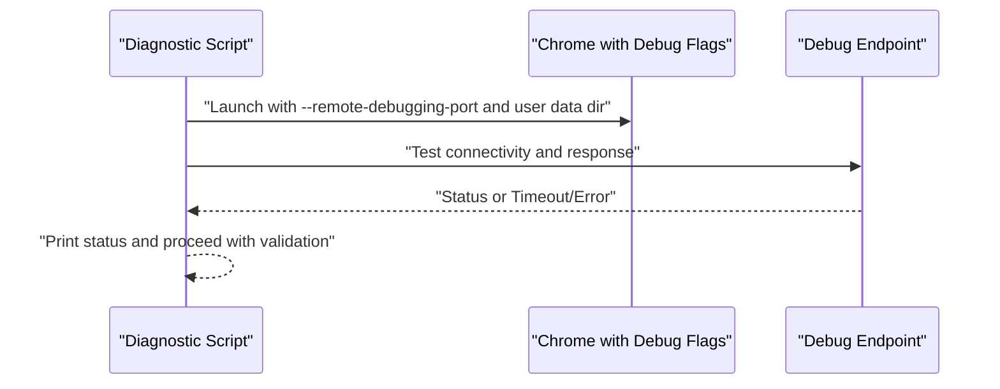
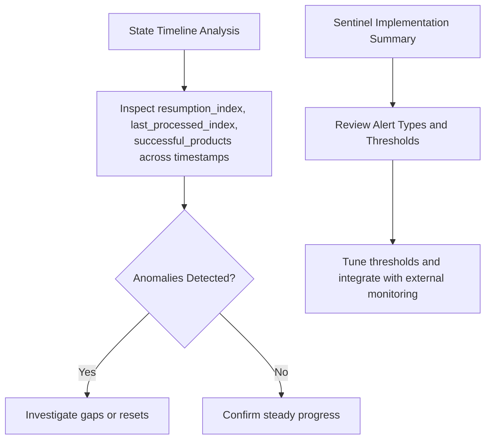
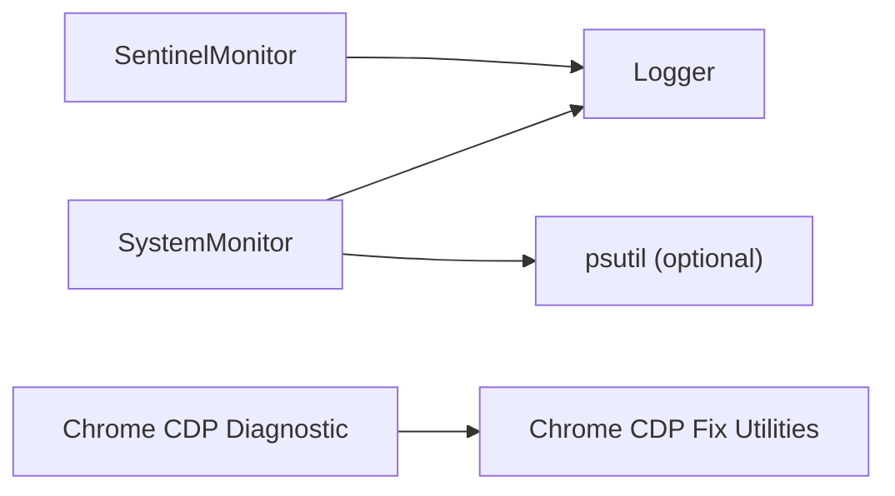

# Monitoring & Diagnostics

<cite>
**Referenced Files in This Document**
- [sentinel_monitor.py](file://utils/sentinel_monitor.py)
- [logger.py](file://utils/logger.py)
- [system_monitor.py](file://tools/system_monitor.py)
- [sentinel_implementation.md](file://OUTPUTS/DIAGNOSTICS/sentinel_implementation.md)
- [state_timeline_analysis.txt](file://diagnostics/state_timeline_analysis.txt)
- [chrome_cdp_diagnostic.py](file://chrome_cdp_diagnostic.py)
- [chrome_cdp_diagnostic_fix.py](file://chrome_cdp_diagnostic_fix.py)
</cite>

## Table of Contents
1. [Introduction](#introduction)
2. [Project Structure](#project-structure)
3. [Core Components](#core-components)
4. [Architecture Overview](#architecture-overview)
5. [Detailed Component Analysis](#detailed-component-analysis)
6. [Dependency Analysis](#dependency-analysis)
7. [Performance Considerations](#performance-considerations)
8. [Troubleshooting Guide](#troubleshooting-guide)
9. [Conclusion](#conclusion)

## Introduction
This document describes the Monitoring & Diagnostics subsystem for the Amazon FBA Agent System. It covers the sentinel monitoring system for proactive health tracking, alerting, and automated recovery cues; system monitoring for resource utilization and performance; diagnostic tools for browser automation and state/workflow issues; logging architecture and error reporting; and integration patterns with external systems and automated testing. The focus is on low-overhead monitoring and comprehensive diagnostic coverage to prevent silent failures and accelerate troubleshooting.

## Project Structure
The Monitoring & Diagnostics subsystem spans several modules:
- Sentinel monitoring utilities for detecting data inconsistencies and save reliability
- System monitoring for CPU/memory/disk and runtime metrics
- Logging infrastructure for structured, timestamped records
- Diagnostic scripts for browser automation (Chrome DevTools Protocol) issues
- Diagnostic artifacts and summaries for state and workflow validation

**Diagram sources**
- [sentinel_monitor.py](file://utils/sentinel_monitor.py#L1-L201)
- [system_monitor.py](file://tools/system_monitor.py#L1-L180)
- [logger.py](file://utils/logger.py#L1-L48)
- [chrome_cdp_diagnostic.py](file://chrome_cdp_diagnostic.py#L1-L421)
- [chrome_cdp_diagnostic_fix.py](file://chrome_cdp_diagnostic_fix.py#L1-L215)
- [sentinel_implementation.md](file://OUTPUTS/DIAGNOSTICS/sentinel_implementation.md#L1-L107)
- [state_timeline_analysis.txt](file://diagnostics/state_timeline_analysis.txt#L1-L331)

**Section sources**
- [sentinel_monitor.py](file://utils/sentinel_monitor.py#L1-L201)
- [system_monitor.py](file://tools/system_monitor.py#L1-L180)
- [logger.py](file://utils/logger.py#L1-L48)
- [sentinel_implementation.md](file://OUTPUTS/DIAGNOSTICS/sentinel_implementation.md#L1-L107)
- [state_timeline_analysis.txt](file://diagnostics/state_timeline_analysis.txt#L1-L331)
- [chrome_cdp_diagnostic.py](file://chrome_cdp_diagnostic.py#L1-L421)
- [chrome_cdp_diagnostic_fix.py](file://chrome_cdp_diagnostic_fix.py#L1-L215)

## Core Components
- SentinelMonitor: Proactive detector of data inconsistencies, path variant issues, linking map shrinkage, and save retry patterns. Aggregates metrics globally per supplier and emits session summaries.
- SystemMonitor: Asynchronous system health monitor capturing CPU, memory, disk, active tasks, error counts, and processing throughput; writes metrics to JSONL files and supports health reports.
- Logger: Centralized logging setup with timestamped files and console output, enabling consistent diagnostics across modules.
- Chrome CDP Diagnostics: Scripts to diagnose and fix browser automation issues via remote debugging and structured product data validation.
- Diagnostic Artifacts: State timelines and sentinel implementation summaries for post-run analysis and automated alerting.

**Section sources**
- [sentinel_monitor.py](file://utils/sentinel_monitor.py#L63-L201)
- [system_monitor.py](file://tools/system_monitor.py#L34-L180)
- [logger.py](file://utils/logger.py#L7-L48)
- [chrome_cdp_diagnostic.py](file://chrome_cdp_diagnostic.py#L1-L421)
- [chrome_cdp_diagnostic_fix.py](file://chrome_cdp_diagnostic_fix.py#L1-L215)
- [sentinel_implementation.md](file://OUTPUTS/DIAGNOSTICS/sentinel_implementation.md#L1-L107)
- [state_timeline_analysis.txt](file://diagnostics/state_timeline_analysis.txt#L1-L331)

## Architecture Overview
The subsystem is composed of lightweight, modular components that minimize overhead while maximizing observability:
- SentinelMonitor integrates into the workflow to surface anomalies without altering core logic.
- SystemMonitor runs asynchronously to avoid blocking primary tasks and persists metrics for trend analysis.
- Logger provides a single, consistent interface for all modules.
- Chrome CDP diagnostics isolate browser automation issues and provide actionable fixes.
- Diagnostic summaries and state timelines enable retrospective analysis and automated alerting.

**Diagram sources**
- [sentinel_monitor.py](file://utils/sentinel_monitor.py#L79-L177)
- [system_monitor.py](file://tools/system_monitor.py#L108-L154)
- [logger.py](file://utils/logger.py#L7-L48)

## Detailed Component Analysis

### Sentinel Monitoring System
The sentinel system proactively detects silent failures and inconsistencies:
- Totals divergence detection compares linking and cache counts and logs warnings when divergence exceeds thresholds.
- Path variant tracking normalizes filesystem paths and warns on multiple variants for the same metric.
- Linking map shrinkage detection raises warnings when the map size decreases unexpectedly.
- Save retry tracking records attempts and outcomes for diagnostics and reliability tuning.

**Diagram sources**
- [sentinel_monitor.py](file://utils/sentinel_monitor.py#L34-L201)

**Section sources**
- [sentinel_monitor.py](file://utils/sentinel_monitor.py#L63-L201)
- [sentinel_implementation.md](file://OUTPUTS/DIAGNOSTICS/sentinel_implementation.md#L1-L107)

### System Monitoring and Metrics Collection
SystemMonitor captures runtime health and performance:
- Asynchronous metrics collection using optional psutil integration.
- Persistent JSONL logs for long-term trend analysis.
- Health report generation with thresholds for CPU/memory and error rates.
- Performance summary with processing time statistics and system load averages.

**Diagram sources**
- [system_monitor.py](file://tools/system_monitor.py#L48-L180)

**Section sources**
- [system_monitor.py](file://tools/system_monitor.py#L34-L180)

### Logging Architecture and Error Reporting
Logging is centralized and consistent:
- Timestamped log files under a debug directory with human-readable format.
- Stream handler for console output and file handler for persistent logs.
- Robust initialization that clears root handlers to avoid duplication.

**Diagram sources**
- [logger.py](file://utils/logger.py#L7-L48)

**Section sources**
- [logger.py](file://utils/logger.py#L7-L48)

### Diagnostic Tools for Browser Automation
Chrome CDP diagnostics assist in troubleshooting automation issues:
- Remote debugging flags and user data directory configuration.
- Debug endpoint testing with timeouts and connection error handling.
- Structured product data validation to confirm extraction correctness.

**Diagram sources**
- [chrome_cdp_diagnostic.py](file://chrome_cdp_diagnostic.py#L1-L421)
- [chrome_cdp_diagnostic_fix.py](file://chrome_cdp_diagnostic_fix.py#L80-L215)

**Section sources**
- [chrome_cdp_diagnostic.py](file://chrome_cdp_diagnostic.py#L1-L421)
- [chrome_cdp_diagnostic_fix.py](file://chrome_cdp_diagnostic_fix.py#L1-L215)

### State and Workflow Validation Diagnostics
Diagnostic artifacts support retrospective analysis:
- State timeline captures resumption indices, last processed index, and successful product counts across time slices.
- Sentinel implementation summary documents alert types, thresholds, and integration points.

**Diagram sources**
- [state_timeline_analysis.txt](file://diagnostics/state_timeline_analysis.txt#L1-L331)
- [sentinel_implementation.md](file://OUTPUTS/DIAGNOSTICS/sentinel_implementation.md#L1-L107)

**Section sources**
- [state_timeline_analysis.txt](file://diagnostics/state_timeline_analysis.txt#L1-L331)
- [sentinel_implementation.md](file://OUTPUTS/DIAGNOSTICS/sentinel_implementation.md#L1-L107)

## Dependency Analysis
Key dependencies and relationships:
- SentinelMonitor depends on logging and a global registry for cross-session aggregation.
- SystemMonitor optionally depends on psutil; otherwise, it falls back to default metrics.
- Logger is used by both sentinel and system monitors for consistent output.
- Chrome CDP diagnostics depend on OS-level process launching and network connectivity.

**Diagram sources**
- [sentinel_monitor.py](file://utils/sentinel_monitor.py#L11-L16)
- [system_monitor.py](file://tools/system_monitor.py#L13-L18)
- [logger.py](file://utils/logger.py#L1-L5)
- [chrome_cdp_diagnostic.py](file://chrome_cdp_diagnostic.py#L1-L421)
- [chrome_cdp_diagnostic_fix.py](file://chrome_cdp_diagnostic_fix.py#L1-L215)

**Section sources**
- [sentinel_monitor.py](file://utils/sentinel_monitor.py#L11-L16)
- [system_monitor.py](file://tools/system_monitor.py#L13-L18)
- [logger.py](file://utils/logger.py#L1-L5)
- [chrome_cdp_diagnostic.py](file://chrome_cdp_diagnostic.py#L1-L421)
- [chrome_cdp_diagnostic_fix.py](file://chrome_cdp_diagnostic_fix.py#L1-L215)

## Performance Considerations
- SentinelMonitor uses lightweight checks and avoids heavy computation; thresholds are tuned to reduce noise while catching meaningful issues.
- SystemMonitor runs asynchronously and writes metrics incrementally to JSONL files, minimizing I/O overhead.
- Logger initializes handlers once and avoids duplication to prevent excessive disk writes.
- Chrome CDP diagnostics launch Chrome with minimal flags to reduce overhead while enabling debugging.

[No sources needed since this section provides general guidance]

## Troubleshooting Guide
Common scenarios and resolutions:
- Silent data loss or inconsistencies: Review sentinel alerts for linking map shrinkage and totals divergence; consult the sentinel implementation summary for thresholds and alert types.
- High CPU/memory usage: Use SystemMonitor’s health report to identify sustained high loads; correlate with processing time spikes.
- Browser automation failures: Run Chrome CDP diagnostics to validate remote debugging connectivity and product extraction correctness; apply suggested fixes from diagnostic outputs.
- State/workflow regressions: Inspect state timeline for unexpected resets or gaps in resumption indices and last processed index.

**Section sources**
- [sentinel_implementation.md](file://OUTPUTS/DIAGNOSTICS/sentinel_implementation.md#L1-L107)
- [system_monitor.py](file://tools/system_monitor.py#L119-L154)
- [chrome_cdp_diagnostic.py](file://chrome_cdp_diagnostic.py#L1-L421)
- [chrome_cdp_diagnostic_fix.py](file://chrome_cdp_diagnostic_fix.py#L1-L215)
- [state_timeline_analysis.txt](file://diagnostics/state_timeline_analysis.txt#L1-L331)

## Conclusion
The Monitoring & Diagnostics subsystem provides proactive, low-overhead visibility into system health, data integrity, and workflow execution. By combining sentinel checks, asynchronous system metrics, robust logging, and targeted browser diagnostics, operators can detect and resolve issues quickly, maintain high reliability, and scale monitoring with minimal operational overhead.