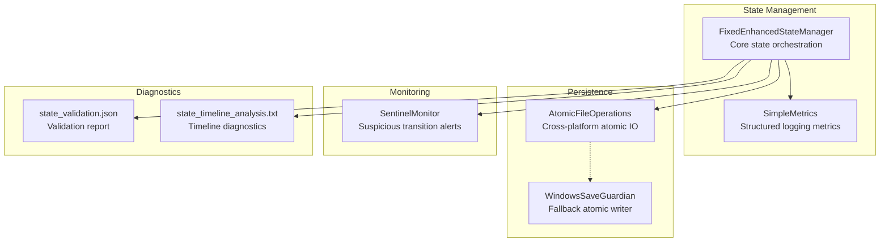
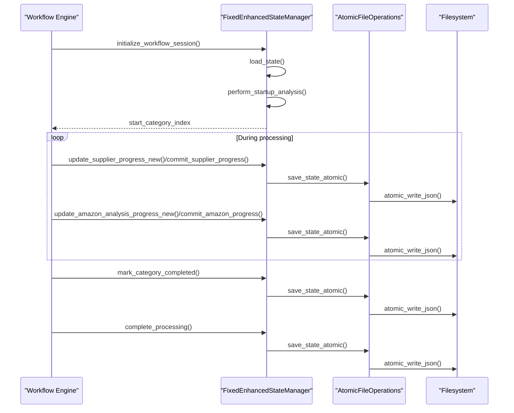
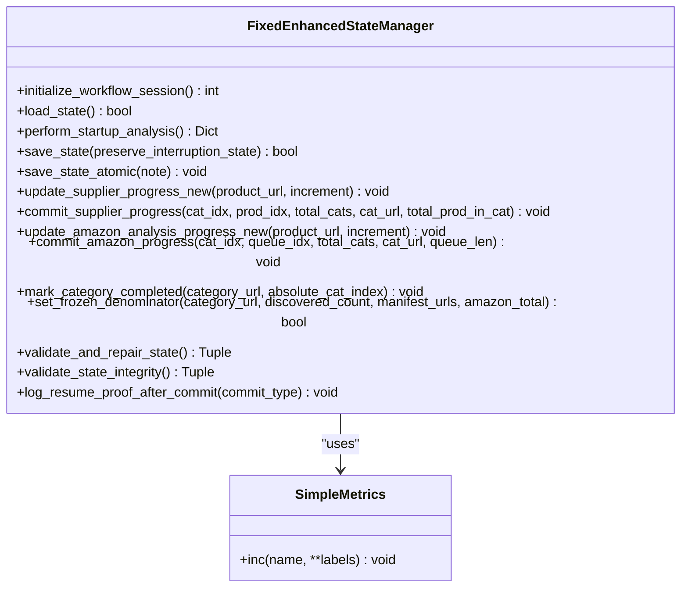
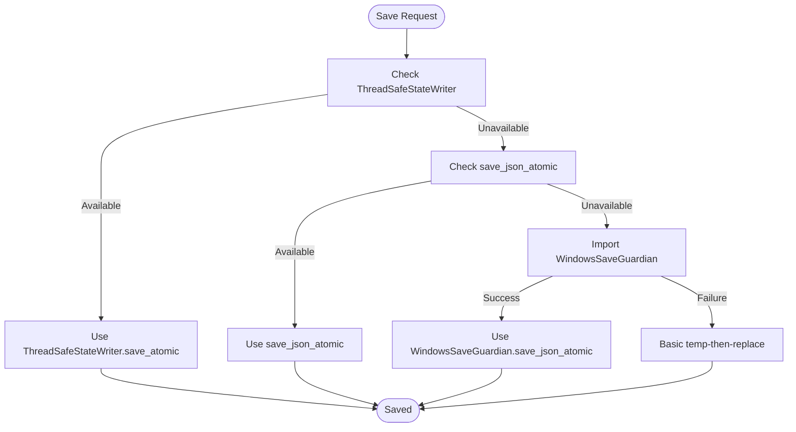
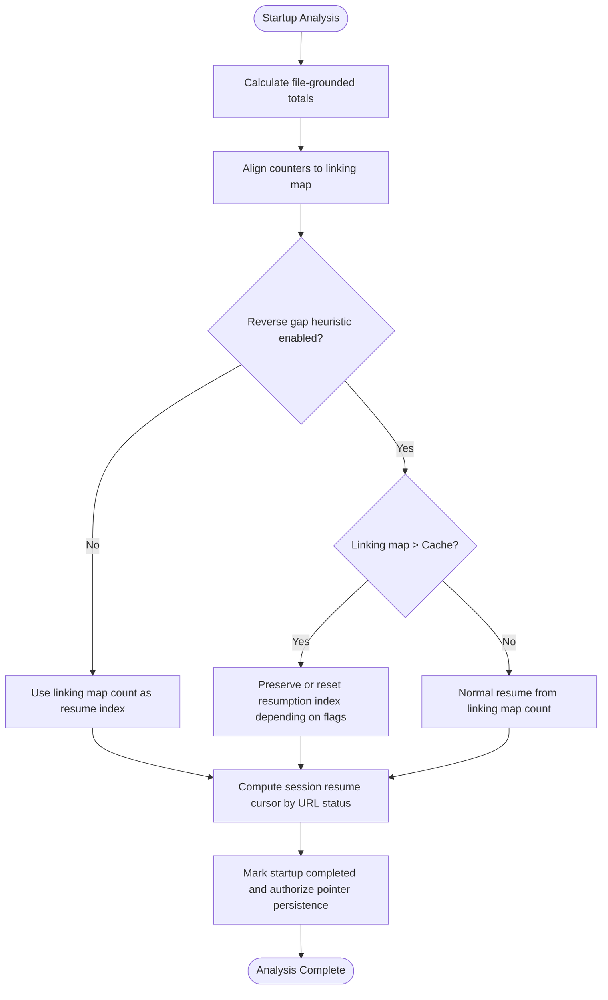
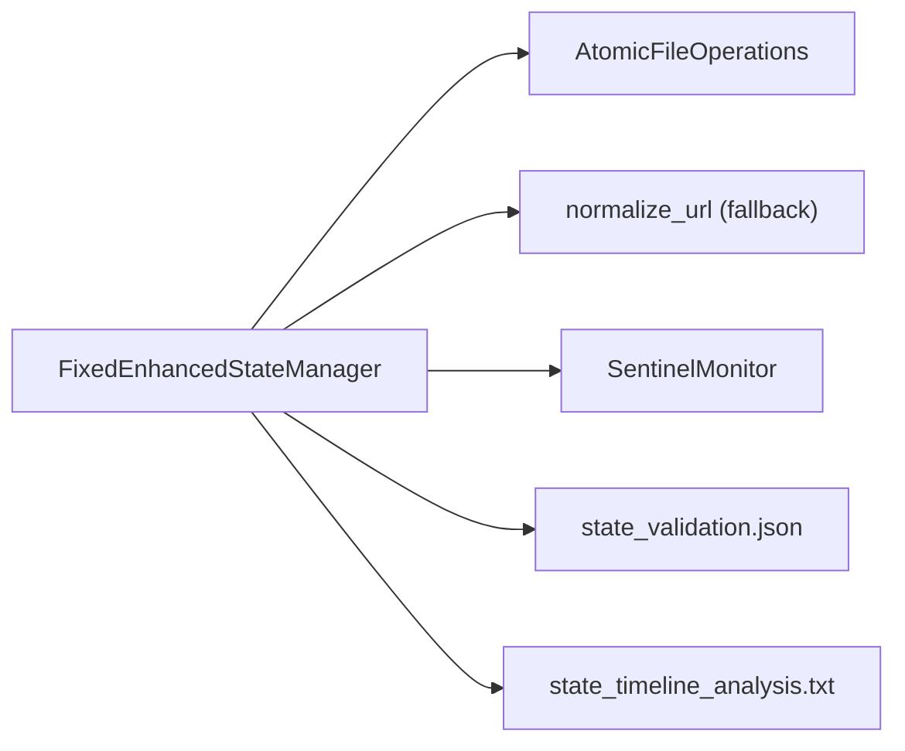

# State Management

<cite>
**Referenced Files in This Document**
- [fixed_enhanced_state_manager.py](file://utils/fixed_enhanced_state_manager.py)
- [atomic_file_operations.py](file://utils/atomic_file_operations.py)
- [sentinel_monitor.py](file://utils/sentinel_monitor.py)
- [data_integrity_guardian.py](file://utils/data_integrity_guardian.py)
- [state_validation.json](file://OUTPUTS/DIAGNOSTICS/state_validation.json)
- [state_validation.md](file://OUTPUTS/DIAGNOSTICS/state_validation.md)
- [state_timeline_analysis.txt](file://diagnostics/state_timeline_analysis.txt)
- [state_1757010653.json](file://diagnostics/state_events/state_1757010653.json)
- [state_1757010699.json](file://diagnostics/state_events/state_1757010699.json)
- [state_1757010706.json](file://diagnostics/state_events/state_1757010706.json)
- [state_1757010713.json](file://diagnostics/state_events/state_1757010713.json)
- [state_1757010802.json](file://diagnostics/state_events/state_1757010802.json)
- [state_1757010803.json](file://diagnostics/state_events/state_1757010803.json)
- [state_1757010844.json](file://diagnostics/state_events/state_1757010844.json)
- [state_1757010892.json](file://diagnostics/state_events/state_1757010892.json)
- [state_1757010900.json](file://diagnostics/state_events/state_1757010900.json)
- [state_1757010901.json](file://diagnostics/state_events/state_1757010901.json)
- [state_1757010958.json](file://diagnostics/state_events/state_1757010958.json)
- [state_1757010959.json](file://diagnostics/state_events/state_1757010959.json)
- [state_1757010967.json](file://diagnostics/state_events/state_1757010967.json)
- [state_1757010968.json](file://diagnostics/state_events/state_1757010968.json)
- [state_1757010979.json](file://diagnostics/state_events/state_1757010979.json)
- [state_1757010985.json](file://diagnostics/state_events/state_1757010985.json)
- [state_1757010986.json](file://diagnostics/state_events/state_1757010986.json)
- [state_1757010991.json](file://diagnostics/state_events/state_1757010991.json)
- [state_1757010995.json](file://diagnostics/state_events/state_1757010995.json)
- [state_1757010996.json](file://diagnostics/state_events/state_1757010996.json)
- [state_1757011028.json](file://diagnostics/state_events/state_1757011028.json)
- [state_1757011038.json](file://diagnostics/state_events/state_1757011038.json)
- [state_1757011044.json](file://diagnostics/state_events/state_1757011044.json)
- [state_1757011048.json](file://diagnostics/state_events/state_1757011048.json)
- [state_1757011049.json](file://diagnostics/state_events/state_1757011049.json)
- [state_1757011051.json](file://diagnostics/state_events/state_1757011051.json)
- [state_1757011067.json](file://diagnostics/state_events/state_1757011067.json)
- [state_1757011075.json](file://diagnostics/state_events/state_1757011075.json)
- [state_1757011120.json](file://diagnostics/state_events/state_1757011120.json)
- [state_1757011126.json](file://diagnostics/state_events/state_1757011126.json)
- [state_1757011127.json](file://diagnostics/state_events/state_1757010725.json)
- [state_1757011151.json](file://diagnostics/state_events/state_1757011151.json)
- [state_1757011160.json](file://diagnostics/state_events/state_1757011160.json)
- [state_1757011181.json](file://diagnostics/state_events/state_1757011181.json)
- [state_1757011229.json](file://diagnostics/state_events/state_1757011229.json)
- [state_1757011237.json](file://diagnostics/state_events/state_1757011237.json)
- [state_1757011238.json](file://diagnostics/state_events/state_1757011238.json)
- [state_1757011260.json](file://diagnostics/state_events/state_1757011260.json)
- [state_1757011351.json](file://diagnostics/state_events/state_1757011351.json)
- [state_1757011359.json](file://diagnostics/state_events/state_1757011359.json)
- [state_1757011360.json](file://diagnostics/state_events/state_1757011360.json)
</cite>

## Table of Contents
1. [Introduction](#introduction)
2. [Project Structure](#project-structure)
3. [Core Components](#core-components)
4. [Architecture Overview](#architecture-overview)
5. [Detailed Component Analysis](#detailed-component-analysis)
6. [Dependency Analysis](#dependency-analysis)
7. [Performance Considerations](#performance-considerations)
8. [Troubleshooting Guide](#troubleshooting-guide)
9. [Conclusion](#conclusion)

## Introduction
This document describes the State Management subsystem centered on the FixedEnhancedStateManager. It explains how the system achieves resilience and reliability through file-based progress tracking, automatic resumption, atomic persistence, and validation. It also covers integration with the workflow engine, recovery mechanisms for interrupted runs, concurrency protection, serialization/deserialization, cross-platform compatibility, and monitoring/diagnostics.

## Project Structure
The State Management subsystem is primarily implemented in a single module with supporting utilities:
- FixedEnhancedStateManager orchestrates state lifecycle, startup analysis, resumption decisions, and atomic persistence.
- Atomic file operations provide thread-safe, cross-platform atomic writes and reads.
- Sentinel monitoring tracks suspicious transitions and divergence.
- Diagnostics and validation artifacts support health checks and post-mortem analysis.

**Diagram sources**
- [fixed_enhanced_state_manager.py](file://utils/fixed_enhanced_state_manager.py#L86-L131)
- [atomic_file_operations.py](file://utils/atomic_file_operations.py#L17-L154)
- [sentinel_monitor.py](file://utils/sentinel_monitor.py#L63-L201)

**Section sources**
- [fixed_enhanced_state_manager.py](file://utils/fixed_enhanced_state_manager.py#L1-L120)
- [atomic_file_operations.py](file://utils/atomic_file_operations.py#L1-L189)
- [sentinel_monitor.py](file://utils/sentinel_monitor.py#L1-L201)

## Core Components
- FixedEnhancedStateManager: Thread-safe state manager with schema-versioned state, startup analysis, resumption logic, and atomic save paths. It separates resumption index from progress tracking, freezes category denominators, and enforces monotonic progression.
- AtomicFileOperations: Provides atomic JSON write/read with cross-platform file locking and fallbacks.
- SentinelMonitor: Lightweight runtime monitor surfacing suspicious state transitions and divergence.
- Validation and diagnostics: JSON reports and timeline analysis files support integrity checks and recovery.

**Section sources**
- [fixed_enhanced_state_manager.py](file://utils/fixed_enhanced_state_manager.py#L86-L131)
- [atomic_file_operations.py](file://utils/atomic_file_operations.py#L17-L154)
- [sentinel_monitor.py](file://utils/sentinel_monitor.py#L63-L201)

## Architecture Overview
The subsystem centers on a single-responsible state manager that coordinates with atomic persistence and monitoring. The workflow engine interacts with the state manager for checkpointing and resumption decisions.

**Diagram sources**
- [fixed_enhanced_state_manager.py](file://utils/fixed_enhanced_state_manager.py#L247-L283)
- [fixed_enhanced_state_manager.py](file://utils/fixed_enhanced_state_manager.py#L1170-L1281)
- [fixed_enhanced_state_manager.py](file://utils/fixed_enhanced_state_manager.py#L1614-L1696)
- [fixed_enhanced_state_manager.py](file://utils/fixed_enhanced_state_manager.py#L1697-L1785)
- [atomic_file_operations.py](file://utils/atomic_file_operations.py#L58-L93)

## Detailed Component Analysis

### FixedEnhancedStateManager
- Responsibilities:
  - Initialize and load state with backward compatibility.
  - Perform startup analysis to reconcile counters and compute resumption position.
  - Freeze category denominators and maintain cross-run monotonicity.
  - Provide atomic save paths with debouncing and resume breadcrumbs.
  - Enforce phase semantics and detect corruption patterns.
  - Support dual-phase resumption indices and manifest-based session cursors.
- Key patterns:
  - Thread-safety via re-entrant locks and a writer session UUID.
  - Atomic save prioritizes a thread-safe state writer, falls back to legacy atomic operations, and then to a Windows-specific guardian.
  - Startup gating prevents premature pointer writes until analysis completes.
  - Resume breadcrumbs and “first-after-resume”/“resume honored” banners for auditability.

**Diagram sources**
- [fixed_enhanced_state_manager.py](file://utils/fixed_enhanced_state_manager.py#L86-L131)
- [fixed_enhanced_state_manager.py](file://utils/fixed_enhanced_state_manager.py#L75-L84)

**Section sources**
- [fixed_enhanced_state_manager.py](file://utils/fixed_enhanced_state_manager.py#L148-L158)
- [fixed_enhanced_state_manager.py](file://utils/fixed_enhanced_state_manager.py#L285-L328)
- [fixed_enhanced_state_manager.py](file://utils/fixed_enhanced_state_manager.py#L469-L645)
- [fixed_enhanced_state_manager.py](file://utils/fixed_enhanced_state_manager.py#L1170-L1281)
- [fixed_enhanced_state_manager.py](file://utils/fixed_enhanced_state_manager.py#L1614-L1785)
- [fixed_enhanced_state_manager.py](file://utils/fixed_enhanced_state_manager.py#L1797-L1830)
- [fixed_enhanced_state_manager.py](file://utils/fixed_enhanced_state_manager.py#L1864-L1932)
- [fixed_enhanced_state_manager.py](file://utils/fixed_enhanced_state_manager.py#L2086-L2138)

### Atomic Persistence and Cross-Platform Compatibility
- AtomicFileOperations provides:
  - File locking with platform-specific mechanisms (Windows and Unix).
  - Atomic JSON write/read with temp-file then-rename semantics.
  - Safe backup creation and JSON integrity validation.
- FixedEnhancedStateManager integrates multiple atomic save paths:
  - Thread-safe state writer (preferred).
  - Legacy atomic JSON writer.
  - WindowsSaveGuardian fallback.
  - Basic temp-then-replace fallback.

**Diagram sources**
- [fixed_enhanced_state_manager.py](file://utils/fixed_enhanced_state_manager.py#L1226-L1281)
- [atomic_file_operations.py](file://utils/atomic_file_operations.py#L58-L93)

**Section sources**
- [atomic_file_operations.py](file://utils/atomic_file_operations.py#L17-L154)
- [fixed_enhanced_state_manager.py](file://utils/fixed_enhanced_state_manager.py#L1226-L1281)

### Startup Analysis and Recovery
- Startup analysis reconciles counters using linking map and cache as ground-truth, computes resumption position, and detects reverse gaps.
- Recovery logic:
  - Determines whether to preserve or reset resumption index based on explicit cache rebuild flags and reverse-gap heuristics.
  - Computes a session cursor by URL status to avoid restarting from the first category.
  - Validates cross-run monotonicity and clamps progress to bounds.

**Diagram sources**
- [fixed_enhanced_state_manager.py](file://utils/fixed_enhanced_state_manager.py#L469-L645)
- [fixed_enhanced_state_manager.py](file://utils/fixed_enhanced_state_manager.py#L2487-L2599)

**Section sources**
- [fixed_enhanced_state_manager.py](file://utils/fixed_enhanced_state_manager.py#L469-L645)
- [fixed_enhanced_state_manager.py](file://utils/fixed_enhanced_state_manager.py#L2487-L2599)

### Concurrency Protection and Single-Writer Proof
- Re-entrant lock protects save operations; deadlock guard logs and skips save if acquisition times out.
- Writer session UUID establishes single-writer proof to prevent split-brain scenarios.
- Debounced saves reduce I/O pressure while preserving resume proof.

**Section sources**
- [fixed_enhanced_state_manager.py](file://utils/fixed_enhanced_state_manager.py#L121-L127)
- [fixed_enhanced_state_manager.py](file://utils/fixed_enhanced_state_manager.py#L1170-L1188)
- [fixed_enhanced_state_manager.py](file://utils/fixed_enhanced_state_manager.py#L1466-L1476)

### Metrics Collection and Observability
- SimpleMetrics emits structured metrics for observability.
- Resume breadcrumbs and “first-after-resume”/“resume honored” banners provide audit trails.
- SentinelMonitor tracks totals divergence, path variants, linking map shrinkage, and save retries.

**Section sources**
- [fixed_enhanced_state_manager.py](file://utils/fixed_enhanced_state_manager.py#L75-L84)
- [fixed_enhanced_state_manager.py](file://utils/fixed_enhanced_state_manager.py#L1312-L1338)
- [fixed_enhanced_state_manager.py](file://utils/fixed_enhanced_state_manager.py#L1339-L1407)
- [sentinel_monitor.py](file://utils/sentinel_monitor.py#L63-L201)

### Validation Systems for State Integrity
- validate_state_integrity detects impossible index states, phase semantic inconsistencies, invalid resumption pointers, frozen totals drift, and legacy writer contamination.
- validate_and_repair_state repairs detected issues and persists the repaired state atomically.
- validate_three_source_consistency ensures manifest, frozen denominator, and resume pointer denominators align.

**Section sources**
- [fixed_enhanced_state_manager.py](file://utils/fixed_enhanced_state_manager.py#L1864-L1932)
- [fixed_enhanced_state_manager.py](file://utils/fixed_enhanced_state_manager.py#L2086-L2138)
- [fixed_enhanced_state_manager.py](file://utils/fixed_enhanced_state_manager.py#L896-L970)

### Integration with Workflow Engine
- Workflow calls initialize_workflow_session() to obtain the authoritative start position.
- During supplier extraction and Amazon analysis phases, the workflow uses commit methods that update system_progression and persist atomically.
- The workflow triggers mark_category_completed() to advance persistent category index and prepare the next category.

**Section sources**
- [fixed_enhanced_state_manager.py](file://utils/fixed_enhanced_state_manager.py#L247-L283)
- [fixed_enhanced_state_manager.py](file://utils/fixed_enhanced_state_manager.py#L1614-L1696)
- [fixed_enhanced_state_manager.py](file://utils/fixed_enhanced_state_manager.py#L1697-L1785)
- [fixed_enhanced_state_manager.py](file://utils/fixed_enhanced_state_manager.py#L2769-L2810)

## Dependency Analysis
The FixedEnhancedStateManager depends on atomic file operations and normalization utilities, and integrates with monitoring and diagnostics.

**Diagram sources**
- [fixed_enhanced_state_manager.py](file://utils/fixed_enhanced_state_manager.py#L37-L72)
- [atomic_file_operations.py](file://utils/atomic_file_operations.py#L17-L154)
- [sentinel_monitor.py](file://utils/sentinel_monitor.py#L63-L201)

**Section sources**
- [fixed_enhanced_state_manager.py](file://utils/fixed_enhanced_state_manager.py#L37-L72)
- [atomic_file_operations.py](file://utils/atomic_file_operations.py#L17-L154)
- [sentinel_monitor.py](file://utils/sentinel_monitor.py#L63-L201)

## Performance Considerations
- Debounced saves reduce frequent disk writes while maintaining resume proof.
- Atomic operations minimize partial writes risk; cross-platform locking avoids corruption on concurrent access.
- Startup analysis computes file-grounded totals once and gates further recomputations to avoid expensive scans during runtime.
- URL normalization and manifest hashing enable deterministic comparisons and stable identifiers.

## Troubleshooting Guide
- Use validate_state_integrity() to detect corruption patterns and generate a validation report.
- Repair detected issues with repair_state_corruption() and persist atomically.
- Review state_validation.json and state_timeline_analysis.txt for diagnostics.
- Inspect sentinel alerts for totals divergence, path variants, and linking map shrinkage.
- Examine state event snapshots for regression analysis.

**Section sources**
- [fixed_enhanced_state_manager.py](file://utils/fixed_enhanced_state_manager.py#L1864-L1932)
- [fixed_enhanced_state_manager.py](file://utils/fixed_enhanced_state_manager.py#L2086-L2138)
- [state_validation.json](file://OUTPUTS/DIAGNOSTICS/state_validation.json)
- [state_validation.md](file://OUTPUTS/DIAGNOSTICS/state_validation.md)
- [state_timeline_analysis.txt](file://diagnostics/state_timeline_analysis.txt)
- [sentinel_monitor.py](file://utils/sentinel_monitor.py#L79-L155)

## Conclusion
The State Management subsystem, anchored by the FixedEnhancedStateManager, delivers a resilient, observable, and recoverable state model. Through atomic persistence, startup analysis, denominator freezing, and comprehensive validation, it ensures reliable resumption and integrity across interrupted runs. Integration with monitoring and diagnostics enables proactive health checks and targeted troubleshooting.